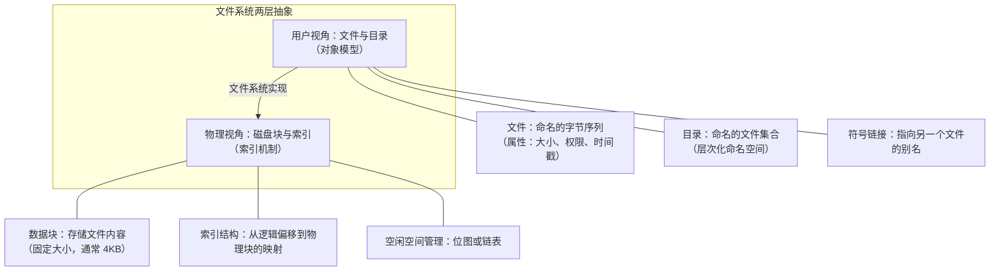
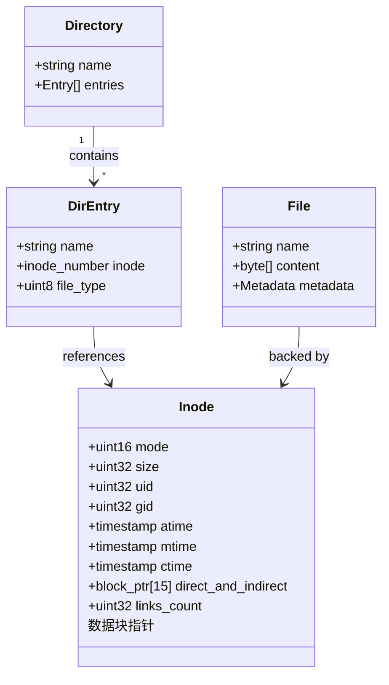
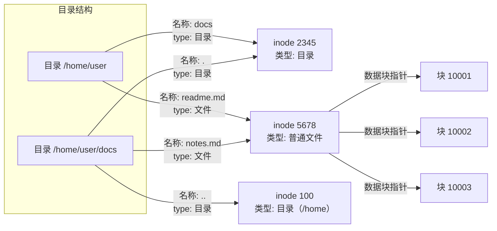
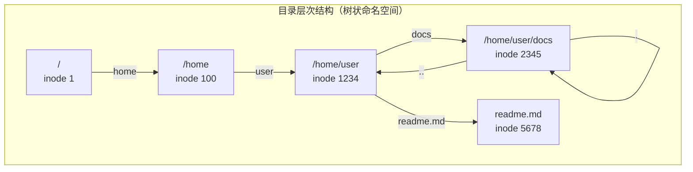
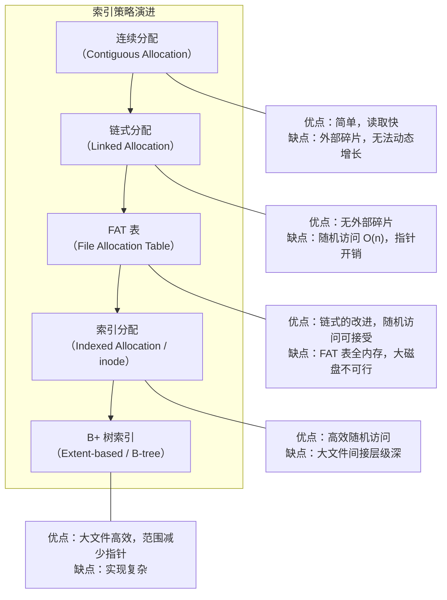
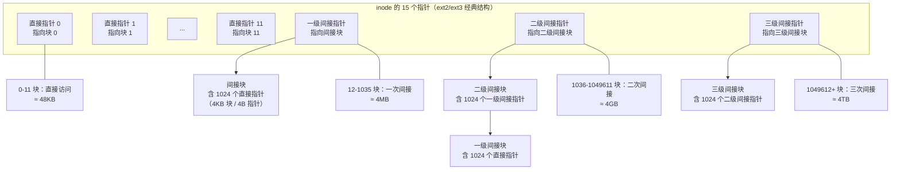
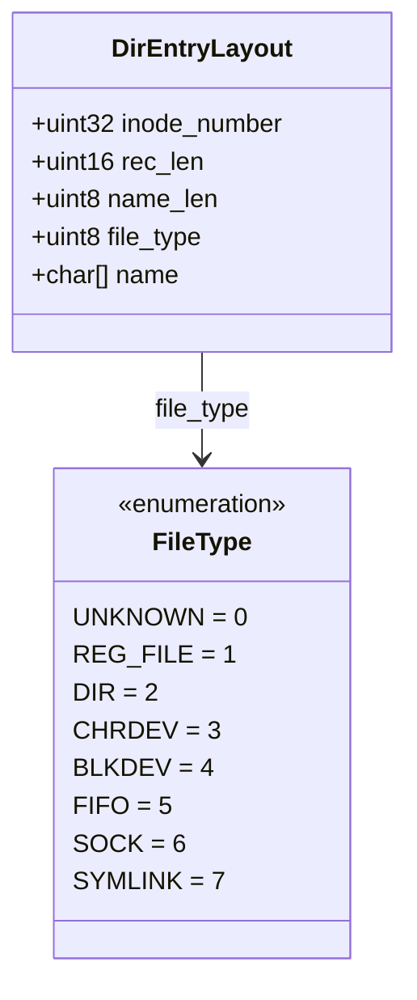
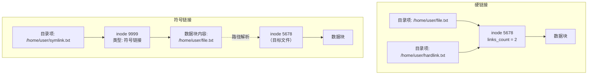

# 文件系统-对象与索引

## 章节导言

在 [06-文件系统](06-文件系统.md) 中，我们从操作系统的角度概述了文件系统的整体架构。本节则深入文件系统的内部实现：**文件系统如何将外存上的原始数据块组织为有结构的数据对象，以及如何通过索引机制高效定位这些对象。**

文件系统的核心架构问题可以拆解为两个正交的维度：

1. **对象模型**：如何定义"文件"这一抽象？它有哪些属性？如何组织成目录层次结构？
2. **索引机制**：如何从文件的逻辑位置映射到物理磁盘块？不同索引策略各自的适用场景与权衡？

理解这两个维度，是理解所有文件系统设计（从 FAT 到 ext4 到 Btrfs）的基础。

## 核心概念与原理

### 文件系统的两层抽象

文件系统的设计可以分为两个正交的层次：



**关键洞察：对象模型是所有文件系统的共性，索引机制是文件系统个性的体现。** 不同文件系统的根本差异，几乎都体现在索引策略的选择上。

### 对象模型：文件的本质

文件（File）是外存上数据的基本组织单元。从用户视角看，文件是一个命名的字节序列（Byte Sequence），但从文件系统实现的角度，文件是一个包含元数据和数据引用的对象：



**inode（索引节点）** 是文件系统最核心的数据结构。它存储了文件的所有元数据，以及指向文件数据块的指针。inode 与文件内容的关系是：

- **inode 是文件的唯一标识**（在同一个文件系统内，inode number 唯一标识一个文件）
- **文件名不是文件的标识**，文件名只是目录项（Directory Entry）中的一个字符串
- **一个 inode 可以被多个目录项引用**（硬链接），`links_count` 记录引用数



上图中，`readme.md` 和 `notes.md` 指向同一个 inode 5678——这就是硬链接。删除其中一个目录项，文件内容不会消失，直到 `links_count` 归零。

### 目录：命名空间的组织

目录（Directory）是一种特殊的文件，其内容是一组目录项（Directory Entry）的列表。每个目录项记录了文件名与 inode number 的映射。

**目录的本质是映射表**，而非容器。文件并不"在"目录中，目录只是提供了一个名字到 inode 的映射。



**路径解析的过程**，就是从根目录开始，逐级查找目录项，最终得到目标文件 inode number 的过程。例如访问 `/home/user/readme.md`：

1. 读取 inode 1（根目录），查找名称为 `home` 的目录项，得到 inode 100
2. 读取 inode 100（/home 目录），查找名称为 `user` 的目录项，得到 inode 1234
3. 读取 inode 1234（/home/user 目录），查找名称为 `readme.md` 的目录项，得到 inode 5678
4. 读取 inode 5678 的数据块，获得文件内容

### 索引机制：从逻辑到物理的映射

索引机制解决的核心问题是：**给定文件的逻辑偏移量（第 N 个字节），如何快速定位其所在的物理磁盘块？**



#### inode 的多级索引

经典的 UNIX inode 采用混合索引策略，在空间效率和访问速度之间取得平衡：



**多级索引的访问代价：**

| 文件大小 | 索引层级 | 磁盘 IO 次数（最坏） |
|----------|---------|---------------------|
| ≤ 48KB | 直接指针 | 1（仅数据块） |
| ≤ 4MB | 一级间接 | 2（间接块 + 数据块） |
| ≤ 4GB | 二级间接 | 3（二级块 + 一级块 + 数据块） |
| ≤ 4TB | 三级间接 | 4（三级块 + 二级块 + 一级块 + 数据块） |

实际运行中，操作系统会缓存间接块，因此随机访问的代价通常远低于最坏情况。

#### Extent-based 分配

现代文件系统（ext4、XFS、Btrfs）采用 Extent（区段）替代传统的块指针。一个 Extent 记录的是一组**连续的物理块**，而非单个块：

```text
传统 inode: [块1] [块2] [块3] [块4] ...  （每个块一个指针）
Extent:     [起始块: 1000, 长度: 4]        （连续4块，一个记录）
```

**Extent 的优势：**
- 大幅减少元数据大小（尤其对大文件）
- 鼓励连续分配，提升顺序读写性能
- 与 B+ 树结合，支持高效的区间查询

## Mermaid 可视化

### 文件系统整体结构

```mermaid
graph TB
    subgraph 磁盘布局["文件系统磁盘布局（ext2/ext3 经典布局）"]
        direction LR
        SB["引导块\nBoot Block"]
        BG1_SB["超级块\nSuperblock"]
        BG1_BGDT["块组描述符表\nBGDT"]
        BG1_BMB["块位图\nBlock Bitmap"]
        BG1_IMB["inode 位图\nInode Bitmap"]
        BG1_IT["inode 表\nInode Table"]
        BG1_DB["数据块\nData Blocks"]

        BG2_SB["超级块\n（备份）"]
        BG2_BGDT["块组描述符表\n（备份）"]
        BG2_BMB["块位图"]
        BG2_IMB["inode 位图"]
        BG2_IT["inode 表"]
        BG2_DB["数据块"]

        BG3_DB2["..."]
    end

    SB --> BG1_SB --> BG1_BGDT --> BG1_BMB --> BG1_IMB --> BG1_IT --> BG1_DB
    BG1_DB --> BG2_SB --> BG2_BGDT --> BG2_BMB --> BG2_IMB --> BG2_IT --> BG2_DB
    BG2_DB --> BG3_DB2

```



**块组（Block Group）** 的设计动机：将磁盘分为多个块组，每个块组独立管理自己的 inode 和数据块。这带来两个好处：

1. **局部性**：文件的 inode 和数据块尽量分配在同一块组内，减少磁头寻道
2. **可靠性**：超级块和块组描述符表在多个块组中有备份，单点损坏不致命

### 目录项结构



目录项的 `rec_len` 字段支持变长记录和前向跳过删除项，这使得目录的删除操作无需移动后续数据，但长期运行会导致目录碎片化。上图为 ext4 磁盘上目录项的 `file_type` 编码；用户态 `getdents` 返回的 `DT_*` 常量取值与之不同（如 `DT_REG=8`、`DT_DIR=4`）。

### 硬链接 vs 符号链接



| 维度 | 硬链接 | 符号链接 |
|------|--------|---------|
| 指向 | inode number | 文件路径字符串 |
| 跨文件系统 | 不可以 | 可以 |
| 目标删除后 | 仍可访问（links_count 减 1） | 悬垂链接（Dangling Link） |
| 实现成本 | 几乎为零 | 需要额外 inode 和数据块 |
| 解析开销 | 无（直接引用 inode） | 需要路径解析（可能多级） |

## 设计原则与权衡

### 原则一：元数据与数据分离

inode 将元数据（属性 + 索引指针）与数据（文件内容）分离存储，这一设计带来诸多好处：

- 元数据小而固定，可集中管理（inode 表），缓存效率高
- 数据块大小灵活，可按需分配
- 两者可独立优化存储布局

### 原则二：局部性优先

块组的设计、extent 的分配策略、目录的哈希索引（dx_root），都体现了"局部性优先"的原则：**相关数据在物理上越接近，访问效率越高。** 对于旋转磁盘，这意味着减少寻道时间；对于 SSD，这意味着减少写放大。

### 原则三：空间换时间的权衡

| 策略 | 空间开销 | 时间收益 |
|------|---------|---------|
| FAT 表 | 全表常驻内存 | 块指针查找在内存完成，避免额外磁盘 IO |
| inode 缓存 | 内存占用 | 避免磁盘 IO |
| 目录哈希索引 | 额外磁盘块 | 目录查找 O(1) vs O(n) |
| Extent 替代块指针 | — | 大幅减少元数据大小 |

### Trade-off 分析：FAT vs inode

| 维度 | FAT | inode |
|------|-----|-------|
| 索引结构 | 全局链表（FAT 表） | 每文件独立索引 |
| 随机访问 | 链表遍历 O(n) | 直接计算 O(1) |
| 内存需求 | FAT 表全内存 | 按需缓存 inode |
| 大磁盘支持 | 差（FAT32 最大 2TB） | 好（64 位偏移） |
| 元数据 | 目录项内嵌（无独立 inode） | 独立 inode |
| 实现复杂度 | 低 | 中 |

FAT 的设计适合小容量可移动存储（U 盘、SD 卡），inode 的设计适合大容量固定存储。两者服务于不同的场景，不存在绝对优劣。

### Trade-off 分析：固定大小块 vs 变长块

| 维度 | 固定大小块 | 变长块 |
|------|-----------|-------|
| 分配算法 | 简单（位图） | 复杂（最佳适配等） |
| 碎片 | 内部碎片 | 外部碎片 |
| 元数据 | 仅位图 | 需要长度和偏移 |
| 典型代表 | ext4, NTFS | VMS, 早期 OS |

现代文件系统几乎全部选择固定大小块，因为简单性和可预测性比空间效率更重要。

## 实践案例与反模式

### 反模式一：大量小文件

每个文件至少占用一个 inode 和一个数据块（4KB）。一个 1 字节的文件，实际占用 4KB+ 磁盘空间（inode 约 256B + 数据块 4KB）。如果系统存在大量小文件，会导致：

- inode 表耗尽（即使数据块有空闲）
- 磁盘空间利用率极低
- 目录查找变慢

解决方案：使用数据库或打包文件（如 tar、zip）聚合小文件。

### 反模式二：目录嵌套过深

路径解析需要逐级读取 inode 和目录数据。深层嵌套意味着多次磁盘 IO。同时，某些系统 API 对路径长度有限制（PATH_MAX = 4096）。

### 反模式三：误删硬链接认为文件已删除

```bash
ln original.txt hardlink.txt   # 创建硬链接
rm original.txt                 # 删除原文件名
cat hardlink.txt               # 文件内容仍然存在！
```

硬链接删除只是 `links_count` 减 1，只有 `links_count` 归零时才真正删除数据。这在备份场景中是特性，但在安全擦除场景中是陷阱。

### 实践案例：Git 的对象模型

Git 的对象存储是文件系统索引思想的一个精妙应用：

- **Blob 对象**：存储文件内容，类似 inode 的数据块
- **Tree 对象**：存储目录结构，类似目录项
- **Commit 对象**：存储快照引用，类似文件系统的日志

Git 通过 SHA-1 哈希作为对象的唯一标识（类似 inode number），实现了内容寻址存储（Content-Addressable Storage），彻底消除了命名冲突和重复存储。

## 小结与关键要点

1. **文件系统的设计可分为对象模型和索引机制两个正交维度**。对象模型定义"文件是什么"，索引机制定义"如何找到文件数据"。理解这两个维度，就能理解所有文件系统的设计选择。

2. **inode 是文件系统的核心数据结构**，它将元数据与数据分离，通过多级索引支持从 48KB 到 4TB 的文件高效访问。现代文件系统用 Extent + B+ 树进一步优化了大文件的索引效率。

3. **目录是映射表而非容器**。文件名只是目录项中的字符串，inode number 才是文件的真正标识。硬链接是指向同一 inode 的多个目录项，符号链接是存储路径字符串的特殊文件。

4. **索引策略的选择是空间、时间和实现复杂度的三维权衡**。从 FAT 的全局链表到 inode 的多级索引，从块指针到 Extent，每次演进都在不同的场景下优化了这一权衡。

5. **块组设计体现了"局部性优先"原则**——将相关数据（inode 与数据块、超级块与备份）在物理上靠近存储，减少寻道和 IO 延迟。这一原则贯穿了从旋转磁盘到 SSD 的存储介质演进。
