# 文件系统-格式与容灾

## 章节导言

在 [16-文件系统-对象与索引](16-文件系统-对象与索引.md) 中，我们分析了文件系统的对象模型和索引机制——这是文件系统在"正常"运行时的逻辑。然而，现实世界充满不确定性：突然断电、内核崩溃、磁盘坏道、人为误操作。**文件系统的容灾能力，决定了数据在异常面前是"完整恢复"还是"永久丢失"。**

本节聚焦于文件系统的两个关键容灾维度：

1. **格式设计**：文件系统的磁盘布局如何影响数据完整性和恢复能力
2. **容灾机制**：日志（Journal）、写时复制（COW）、校验和（Checksum）、RAID 等如何保护数据安全

文件系统的容灾设计，本质上是**在性能与可靠性之间寻找平衡**——每一次写入都同步落盘是最安全的，但性能不可接受；完全异步写入是最快的，但异常时数据可能丢失。

## 核心概念与原理

### 文件系统的一致性问题

文件系统的操作通常涉及多个磁盘块的修改。例如，创建一个文件需要同时修改：

1. inode 位图（标记新 inode 已使用）
2. inode 表（写入新 inode 的内容）
3. 数据块位图（标记数据块已使用）
4. 数据块（写入文件内容）
5. 父目录的数据块（添加新目录项）
6. 父目录的 inode（更新 mtime/ctime）

**如果在上述步骤中途断电，磁盘上的状态将处于不一致**——例如 inode 已标记为已使用，但目录项未写入，导致 inode 泄漏（孤儿 inode）。

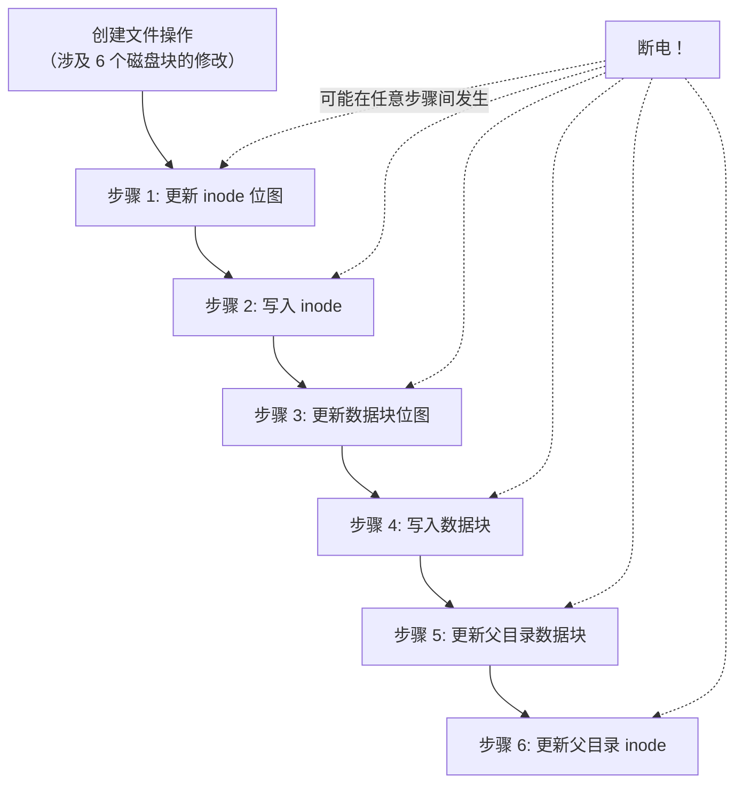

### 日志机制（Journaling）

日志机制的核心思想来自数据库的 **WAL（Write-Ahead Log）**：在修改实际数据之前，先将"要做什么修改"记录到日志中。如果中途崩溃，重启时重放日志即可恢复一致性。

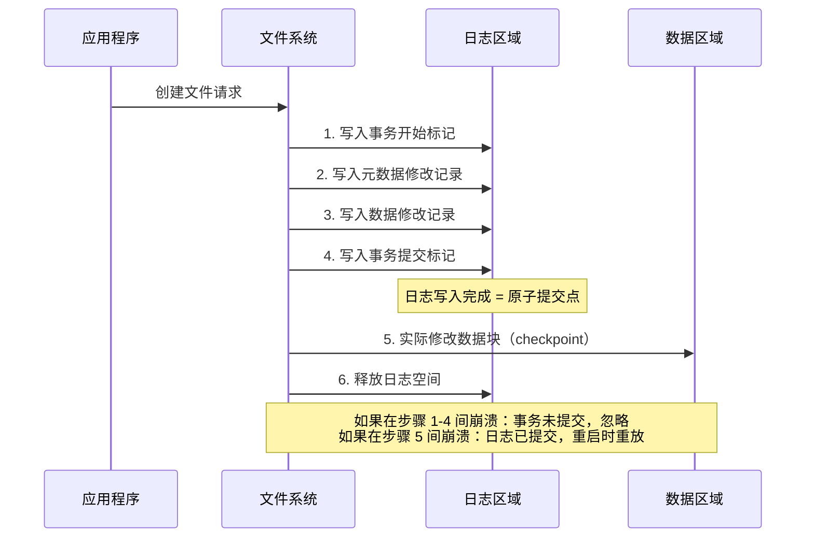

**日志的三种模式：**

| 模式 | 记录内容 | 安全性 | 性能 |
|------|---------|--------|------|
| Journal（全日志） | 元数据 + 数据 | 最高 | 最低（所有数据写两遍） |
| Ordered（有序） | 仅元数据，但保证数据先落盘 | 高 | 中（数据只写一遍，但需等待落盘） |
| Writeback（回写） | 仅元数据，不保证数据先落盘 | 中 | 最高（数据可能在新元数据后落盘） |

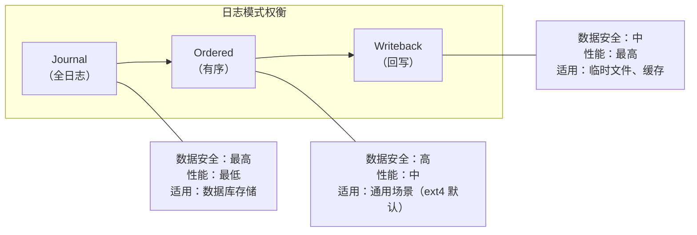

### 写时复制（Copy-On-Write）

日志机制解决了崩溃一致性问题，但无法解决**静默数据损坏**（Silent Data Corruption）——磁盘固件可能返回错误数据而不报错。写时复制（COW）文件系统从根本上了改变了写入模型：**永远不覆盖已有数据，而是写入新位置后原子切换指针。**

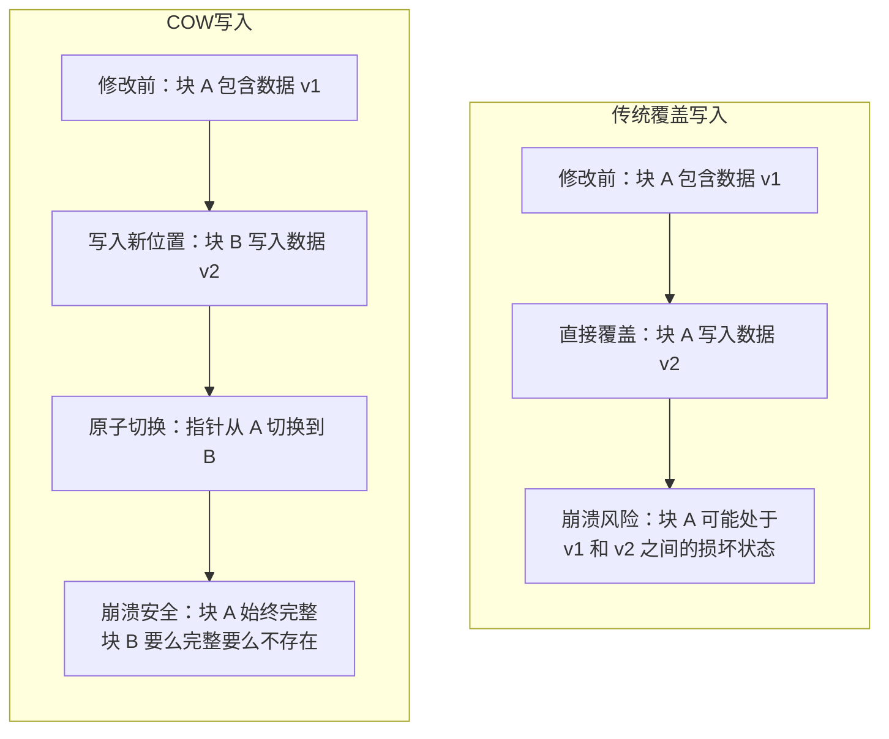

**COW 文件系统的代表：**

- **ZFS**：Sun Microsystems 设计，号称"最后一个文件系统"，端到端数据完整性验证
- **Btrfs**：Linux 原生 COW 文件系统，支持快照、子卷、透明压缩
- **ReFS**：Windows Server 的弹性文件系统

COW 的核心优势：

1. **崩溃一致性**：无需日志，因为旧数据永远不被覆盖
2. **快照**：记录根指针即可创建一致性快照，零拷贝
3. **校验和**：每个数据块附带校验和，可检测静默损坏
4. **在线修复**：发现损坏块时，利用冗余副本修复

COW 的核心代价：

1. **写放大**：修改一个字节需要写入整个块（通常 4KB 或更大）
2. **碎片化**：COW 导致数据块分散，顺序读退化为随机读
3. **空间回收与维护**：需要定期运行维护任务（如 Btrfs 的 balance 整理分配；ZFS 的 scrub 用于校验数据完整性，而非垃圾回收）

### Log-Structured 文件系统

LFS（Log-Structured File System）将 COW 推向极致：**整个文件系统就是一个只追加的日志**，所有修改（元数据和数据）都追加到日志末尾。

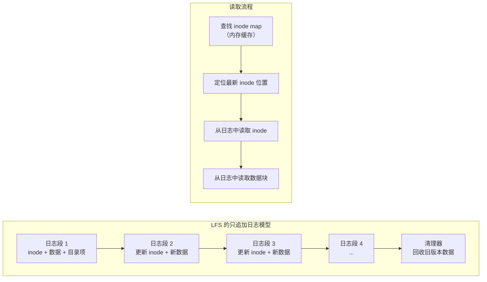

**LFS 的优势：**

- 写入性能极佳（所有写入都是顺序追加）
- 崩溃恢复极快（只需检查最后一个不完整的日志段）
- 天然支持快照（记录 inode map 的某个版本）

**LFS 的挑战：**

- **读取性能**：需要通过 inode map 间接定位，随机读性能差
- **清理器复杂度**：垃圾回收（段清理）的效率直接影响写入性能的稳定性
- **空闲空间管理**：当磁盘接近满时，清理器无法找到可回收的段，性能急剧下降

## Mermaid 可视化

### 日志恢复流程

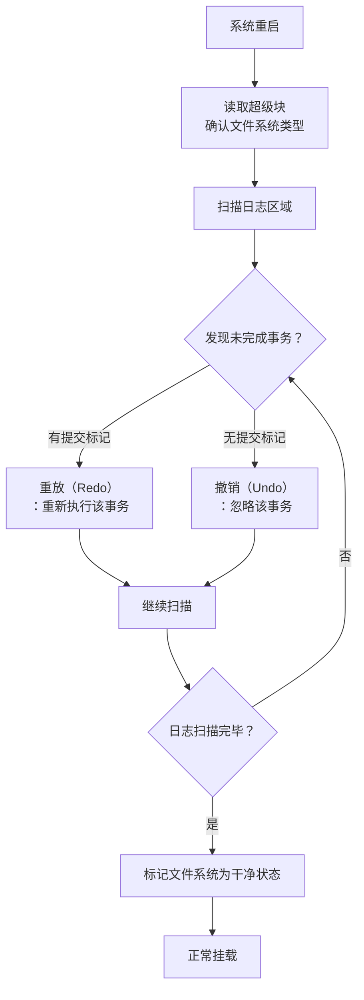

### RAID 级别对比

文件系统的容灾不仅依赖软件机制，还依赖硬件层面的冗余。RAID（Redundant Array of Inexpensive Disks）通过磁盘阵列提供不同级别的冗余和性能：

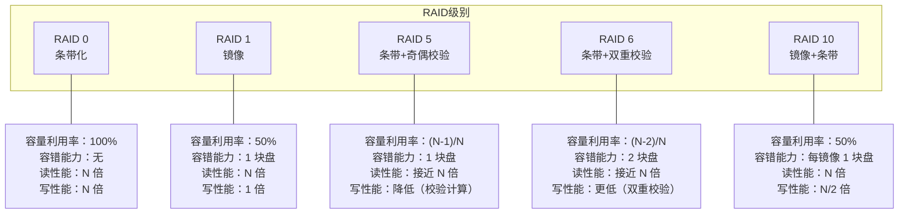

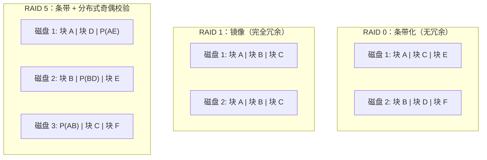

**RAID 5 的写惩罚：** 每次数据写入需要 4 次 IO（读旧数据、读旧校验、写新数据、写新校验），这就是为什么 RAID 5 在随机写密集场景下性能不佳。

### 文件系统容灾层次

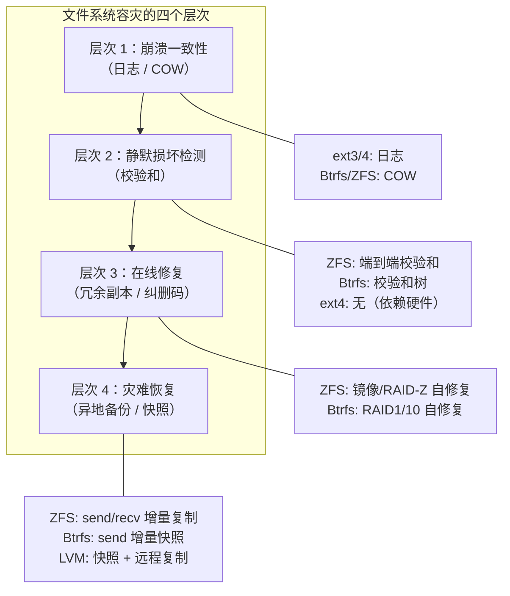

### ZFS 的端到端完整性验证

ZFS 是目前文件系统中数据完整性设计的巅峰，其核心机制是**端到端校验和（End-to-End Checksum）**：

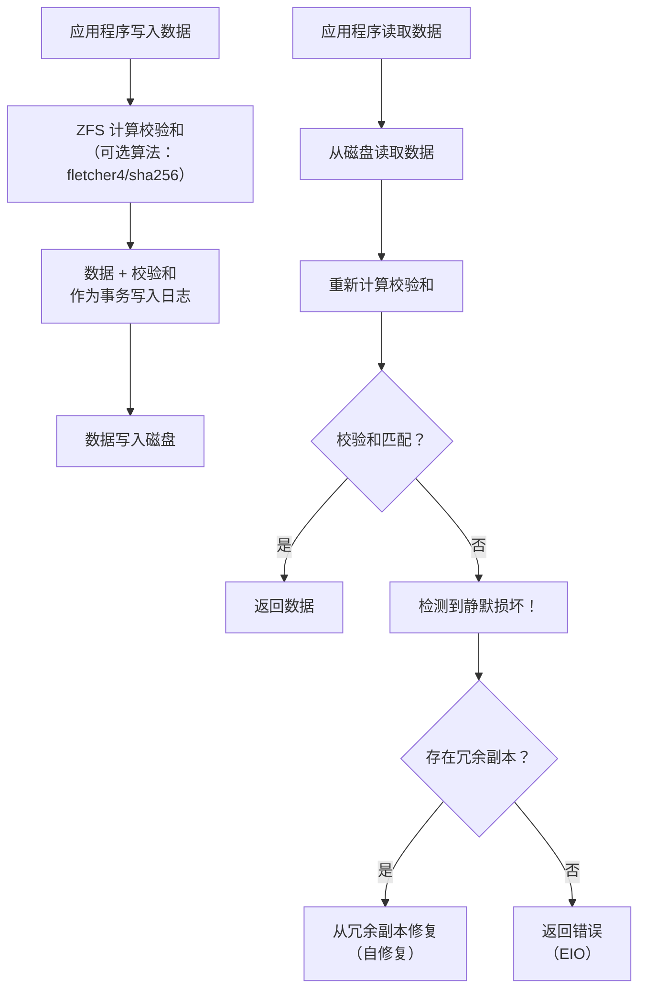

ZFS 的校验和存储在父节点中（Merkle Tree 结构），这意味着**即使磁盘固件返回错误数据，ZFS 也能检测到并尝试修复**——这是传统文件系统做不到的。

## 设计原则与权衡

### 原则一：原子性是容灾的基石

无论是日志的原子提交、COW 的指针切换，还是 LFS 的只追加写入，其核心都是**保证关键状态变更的原子性**。文件系统容灾设计的首要目标不是"不丢失数据"（这不可能），而是"要么完整，要么不存在，绝不处于半完成状态"。

### 原则二：校验和是信任的边界

传统文件系统信任磁盘返回的数据——但磁盘固件可能静默返回错误数据。ZFS 的哲学是**信任但要验证**：对每一个数据块计算并验证校验和，将信任边界从"磁盘固件"收缩到"校验和算法"。

### 原则三：性能与可靠性的三维权衡

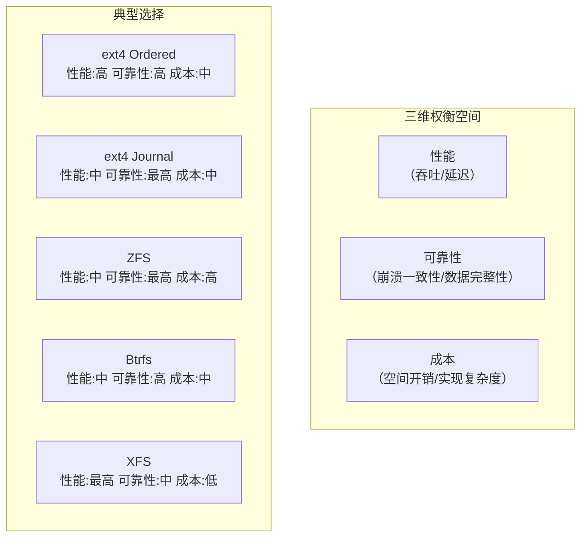

### Trade-off 分析：日志 vs COW

| 维度 | 日志文件系统 | COW 文件系统 |
|------|------------|-------------|
| 崩溃一致性 | 日志保证 | 天然保证（旧数据不被覆盖） |
| 写入性能 | 日志写入 + 数据写入 = 两倍写 | COW 写入 + 可能的读修改写 |
| 读取性能 | 数据局部性好 | 可能碎片化（需定期整理） |
| 快照 | 需要额外机制 | 天然支持（记录根指针） |
| 校验和 | 通常不支持 | 内建支持 |
| 实现成熟度 | 高（ext4, XFS） | 中（Btrfs, ZFS） |
| 空间效率 | 高（无校验和开销） | 中（校验和 + 可能的碎片） |

### Trade-off 分析：软件 RAID vs 硬件 RAID

| 维度 | 软件 RAID | 硬件 RAID |
|------|----------|----------|
| 性能 | CPU 处理（现代 CPU 影响小） | 专用处理器 |
| 灵活性 | 可在线调整 | 需要重启/专用工具 |
| 可移植性 | 好（磁盘可直接移到其他系统） | 差（依赖特定控制器） |
| 成本 | 无额外硬件 | RAID 卡价格不菲 |
| 缓存 | 依赖 OS 页缓存 | 自带电池保护写缓存 |
| 趋势 | 主流（ZFS RAID-Z, mdadm） | 逐渐边缘化 |

现代趋势是软件 RAID + ZFS/Btrfs，因为硬件 RAID 的写缓存在断电时可能丢失数据，而软件方案提供端到端的完整性保证。

## 实践案例与反模式

### 反模式一：在 Journal 模式下运行数据库

数据库自身实现了 WAL 机制，如果文件系统也用 Journal（全日志）模式，则每次写入实际被写了三遍：DB WAL → FS Journal → FS Data。这造成了严重的写放大。

正确做法：数据库存储应使用 Ordered 或 Writeback 模式，甚至使用裸设备（raw device）绕过文件系统。

### 反模式二：RAID 5 用于大容量慢速磁盘

RAID 5 在重建（rebuild）时需要读取所有剩余磁盘。对于大容量慢速磁盘（如 10TB HDD），重建时间可能长达数天，在此期间：

- 系统性能严重下降
- 出现第二块盘故障的概率不可忽略（URE 概率随容量增加）
- 一旦出现 URE（不可恢复读错误），重建失败

正确做法：大容量存储使用 RAID 6 或 RAID 10，或 ZFS RAID-Z2/RAID-Z3。

### 反模式三：不验证备份的可恢复性

备份的价值在于恢复，而非备份本身。常见错误：

- 从未测试过恢复流程
- 备份数据已损坏但未发现（缺少校验和验证）
- 恢复时间超出 RTO（Recovery Time Objective）

正确做法：定期执行恢复演练，验证数据完整性，测量恢复时间。

### 实践案例：ZFS 的 scrub 机制

ZFS 的 `scrub` 命令会读取所有数据并验证校验和，即使数据未被访问。这是检测静默损坏的唯一可靠方式：

```bash
# 启动 scrub（在线执行，不影响正常使用）
zpool scrub tank

# 查看 scrub 状态
zpool status tank
```

scrub 发现损坏时，如果存在冗余副本（镜像或 RAID-Z），ZFS 会自动用正确的副本修复损坏的数据——这就是"自修复"（Self-Healing）。

### 实践案例：Btrfs 的快照与增量备份

```bash
# 创建子卷
btrfs subvolume create /data/app

# 创建只读快照（瞬间完成，零拷贝）
btrfs subvolume snapshot -r /data/app /data/app-snap-20240101

# 增量发送快照到远程（仅传输差异部分）
btrfs send -p /data/app-snap-20240101 /data/app-snap-20240102 | \
  ssh backup-server "btrfs receive /backup/app"
```

COW 文件系统的快照机制使得增量备份变得极其高效——无需扫描文件系统比较差异，只需对比两棵 B+ 树的差异即可。

## 小结与关键要点

1. **文件系统的一致性问题是容灾设计的原点**。任何涉及多个磁盘块修改的操作，都可能在任意步骤间断电，导致磁盘状态不一致。日志和 COW 是解决此问题的两种根本性方案。

2. **日志机制用 WAL 思想保证崩溃一致性，但无法检测静默损坏**。三种日志模式（Journal/Ordered/Writeback）在安全性和性能之间提供不同权衡，Ordered 是通用场景的最佳选择。

3. **COW 文件系统通过"永远不覆盖已有数据"实现崩溃一致性，并内建校验和与快照支持**。ZFS 的端到端校验和和 Merkle Tree 结构使其成为数据完整性设计的巅峰，但代价是更高的内存需求和实现复杂度。

4. **RAID 提供硬件层面的冗余，但软件 RAID + COW 文件系统是现代趋势**。硬件 RAID 的写缓存在断电时可能丢失数据，而 ZFS/Btrfs 提供端到端的完整性保证和更灵活的管理能力。

5. **容灾是一个层次化体系**：崩溃一致性（日志/COW）→ 静默损坏检测（校验和）→ 在线修复（冗余副本）→ 灾难恢复（异地备份/快照）。每一层解决不同级别的异常，缺少任何一层都存在数据丢失风险。
