# CPU篇-指令集

## 章节导言

冯·诺依曼体系结构由三类基础零部件构成：中央处理器、存储、输入输出设备。其中，中央处理器的核心能力最终体现为**指令集（Instruction Set）**——它既是硬件与软件的契约边界，也是"解决一切可以用计算来解决的问题"这一宏大目标的具体承载。

一个核心的架构问题随之浮现：为什么如此精简的指令集规格设计，却能支撑起无穷复杂的计算需求？指令集的设计边界在哪里——哪些能力应当被纳入指令集，哪些应当被剥离出去？CISC 与 RISC 之争的本质又是什么？

本章将从指令集的本质出发，剖析 CPU 指令集作为硬件-软件契约的设计哲学，以及其中蕴含的架构权衡。

---

## 核心概念与原理

### 指令集的定义

**指令集（Instruction Set Architecture, ISA）** 是 CPU 向软件暴露的全部功能的规格定义，是硬件与软件之间的契约。它规定了：

- CPU 能理解并执行的所有操作的集合（指令的语义）
- 操作数的数据类型与寻址方式
- 寄存器的组织结构
- 中断与异常的处理模型
- 内存访问的语义约束（如对齐要求、可见性模型）

指令集是架构设计中"规格"概念的典型体现——它定义了接口，但不规定实现。同一指令集可以有多种微架构实现，正如许式伟所强调的：**规格是零部件连接需求的抽象，符合规格的实现方案可以有很多种。**


### 指令集的本质：可编程性的物质化

冯·诺依曼体系的核心洞见在于**可编程性**：CPU 执行的指令序列不是固定的，而是由存储中的数据决定。指令集正是这一洞见的物质化——它定义了"可编程"的边界。

从架构视角审视，指令集的精妙之处在于：**它将"计算"能力的稳定性与"计算需求"的多样性解耦了。** CPU 指令集本身是相对稳定的（需求的稳定点），而无穷多样的计算需求则通过存储中的指令序列来实现（需求的变化点）。

```mermaid
graph LR
    subgraph 稳定点——CPU指令集
        CALC["计算类指令<br>加减乘除、逻辑运算"]
        IO_INST["I/O 类指令<br>存储读写、设备数据交换"]
        JUMP["跳转类指令<br>条件/无条件跳转、函数调用"]
    end

    subgraph 变化点——存储中的指令序列
        PROG1["程序A：文字处理器"]
        PROG2["程序B：3D渲染引擎"]
        PROG3["程序C：神经网络推理"]
    end

    CALC & IO_INST & JUMP -->|"组合"| PROG1 & PROG2 & PROG3

```

### CPU 指令的分类体系

根据冯·诺依曼体系的设计，CPU 指令可以系统性地分为三大类：

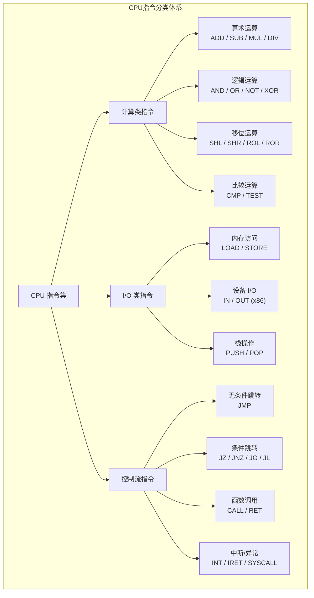

**计算类指令**实现了数学意义上的函数变换——将输入数据映射为输出数据。这是 CPU 之所以被称为"计算"核心的根本。

**I/O 类指令**打通了 CPU 与存储及外部设备的数据通路。值得注意的是，在多数 RISC 架构中，I/O 指令被统一为 LOAD/STORE 两种内存访问操作，设备 I/O 通过内存映射（Memory-Mapped I/O）实现，体现了架构设计的极简主义。

**控制流指令**赋予了程序"决策"能力。正如许式伟所指出的，从汇编角度看只有两种基本跳转：无条件跳转和条件跳转。循环、分支等高级控制结构都由这两种基本跳转组合实现。

### 指令的执行模型

CPU 执行指令的过程遵循**取指-译码-执行**的循环，即指令周期（Instruction Cycle）：

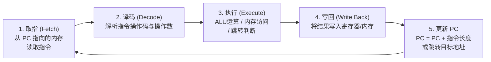

这个循环的深刻含义在于：**程序的执行在物理上不过是一个有限状态机的循环往复，但通过存储中指令序列的可变性，实现了计算能力的无穷性。** 这正是冯·诺依曼"存储程序"概念的核心价值。

---

## CISC 与 RISC：指令集设计的根本权衡

### 两条路线的分歧

指令集设计面临的核心矛盾是：**指令集应当多复杂？** 对此，历史上形成了两种截然不同的设计哲学。

```mermaid
graph TB
    subgraph CISC——复杂指令集
        CISC_CORE["设计哲学：<br>用硬件复杂度换软件简洁性"]
        CISC_FEAT["特征：指令多而复杂<br>变长编码 / 微程序实现<br>内存-内存操作 / 多种寻址模式"]
        CISC_REP["代表：x86 (Intel / AMD)"]
    end

    subgraph RISC——精简指令集
        RISC_CORE["设计哲学：<br>用软件复杂度换硬件简洁性"]
        RISC_FEAT["特征：指令少而规整<br>定长编码 / 硬连线实现<br>LOAD/STORE 架构 / 寄存器密集"]
        RISC_REP["代表：ARM / RISC-V / MIPS"]
    end

    CISC_CORE --> CISC_FEAT --> CISC_REP
    RISC_CORE --> RISC_FEAT --> RISC_REP

```

### 权衡的本质

CISC 与 RISC 之争表面是指令数量多寡之争，实质是**硬件与软件的职责边界划分之争**——哪些事情应该由硬件做，哪些应该留给软件（编译器）去做。

| 维度 | CISC | RISC |
|------|------|------|
| 设计出发点 | 减少编译器负担，一条指令完成复杂操作 | 简化硬件设计，提高时钟频率与流水线效率 |
| 指令长度 | 变长（x86: 1-15 字节） | 定长（ARM: 2/4 字节, RISC-V: 4 字节） |
| 寻址模式 | 丰富（内存-内存、内存-寄存器等） | 极简（仅 LOAD/STORE 访问内存） |
| 寄存器数量 | 较少（x86: 8-16 通用寄存器） | 较多（ARM: 31, RISC-V: 32） |
| 硬件实现 | 微程序 ROM + 微操作序列 | 硬连线逻辑，单周期执行为主 |
| 代码密度 | 较高——一条复杂指令等效多条简单指令 | 较低——需多条指令完成同等语义 |
| 流水线效率 | 低——变长指令导致译码复杂 | 高——定长指令天然适合流水线 |
| 功耗 | 较高 | 较低 |

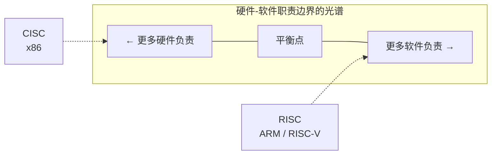

### 历史的辩证：殊途同归

CISC 与 RISC 的竞争并非简单的优胜劣汰，而是呈现出辩证的融合趋势：

**CISC 的自我修正**：现代 x86 处理器在硬件内部将复杂指令分解为类 RISC 的微操作（Micro-Ops），前端的复杂指令集保持了软件兼容性，后端的微操作引擎则获得了 RISC 的流水线效率。这实质上是**在 ISA 层面保持 CISC，在微架构层面采用 RISC**。

**RISC 的功能扩展**：RISC 架构也在不断扩展指令集。ARM 的 NEON SIMD 指令、RISC-V 的扩展指令集（M/A/F/D/C 等），都表明纯粹的"精简"并非目的，按需扩展才是正道。

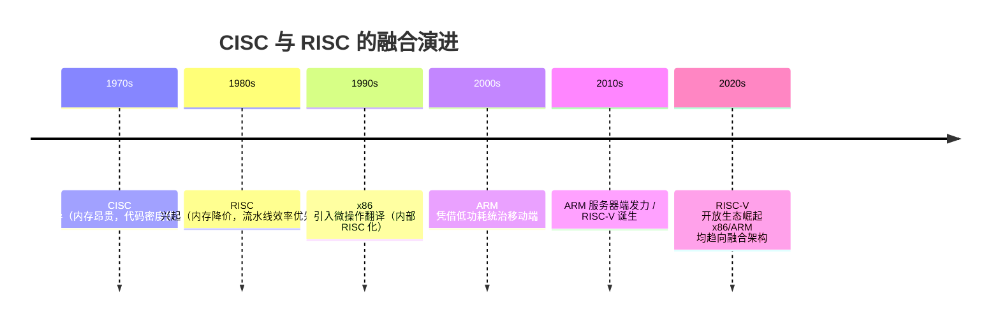

### 架构启示

许式伟在分析冯·诺依曼体系时提出：**需求的稳定点往往是系统的核心价值点，而需求的变化点则需要做开放性设计。** 指令集设计完美印证了这一原则：

- 指令集的核心语义（计算、I/O、跳转）是稳定点，必须精确定义
- 指令集的扩展能力是变化点，需要开放性设计（如 RISC-V 的模块化扩展机制）

RISC-V 的模块化设计正是这一原则的最佳实践：基础指令集（RV32I/RV64I）极简且稳定，通过标准扩展（M/A/F/D/C）和自定义扩展来应对变化需求。

---

## 指令集作为契约：硬件-软件的接口协议

### 契约的双向约束

指令集作为契约，同时对硬件和软件产生约束：

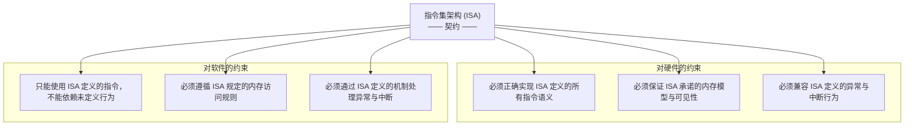

### 二进制兼容性的商业意义

指令集作为契约的最直接后果是**二进制兼容性**：只要 ISA 不变，已编译的软件无需重新编译即可在新处理器上运行。这构成了 CPU 厂商最核心的商业护城河。

x86 体系之所以能延续四十余年，根本原因在于 Intel 始终保持向后兼容——从 8086 到今天的 Core Ultra，所有为 8086 编写的程序仍可在现代 CPU 上运行。这种兼容性的代价是巨大的技术债务，但其商业价值不可估量。

反观 RISC-V 的设计哲学则更为开放：它不追求向后兼容的历史包袱，而是通过模块化扩展来应对演进需求。这是一种"契约的轻量化"策略——基础契约极简，扩展契约按需加载。

---

## 寻址模式：数据访问的抽象层次

寻址模式（Addressing Mode）是指令集设计中影响编程模型灵活性的关键要素，它定义了指令如何定位操作数。

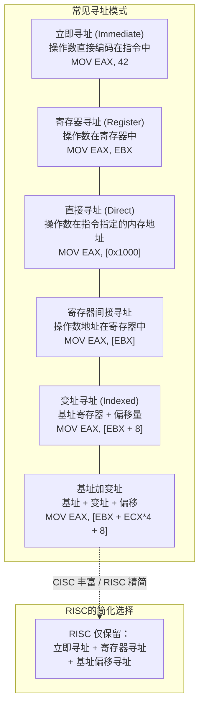

CISC 架构（如 x86）提供丰富的寻址模式，单条指令即可完成复杂的内存访问计算。RISC 架构则大幅精简寻址模式，将复杂的地址计算交由多条指令组合完成。这再次体现了硬件复杂度与软件复杂度之间的权衡。

---

## 指令集与汇编语言的关系

指令集是 CPU 硬件的规格定义，而汇编语言是指令集的人类可读表示。二者的关系是严格的一一映射：

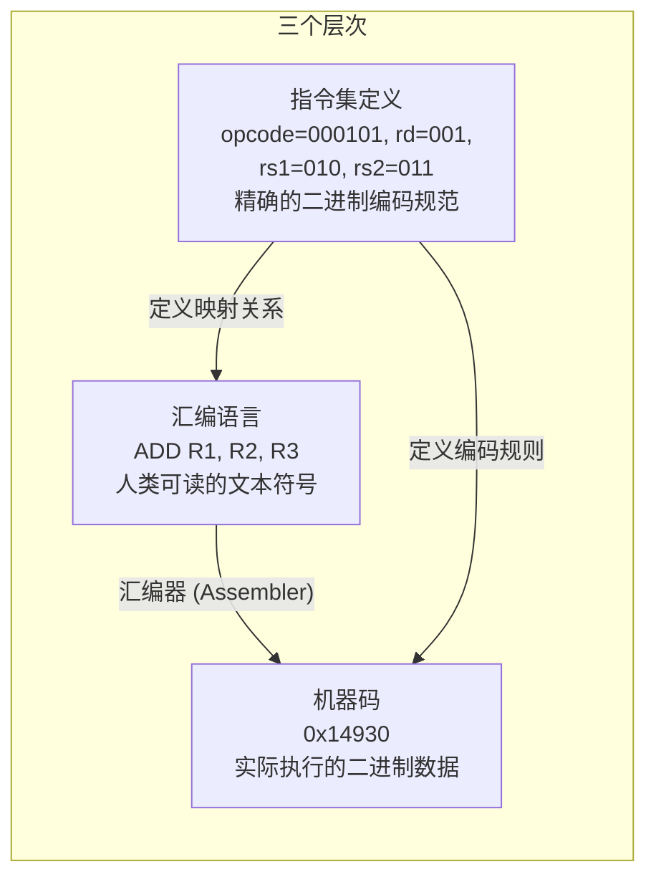

正如许式伟在"汇编：编程语言的诞生"（参见第 03 讲）中所论述的，汇编语言的革命性贡献在于用文本符号替代二进制编码，让程序员从物理地址的束缚中解脱出来。而这一切的前提，正是指令集作为稳定契约的存在——没有稳定的指令集规格，汇编语言的符号映射就失去了根基。

汇编语言对指令集的效率优化主要体现在四方面：

1. **指令助记符**：用 `ADD` 替代操作码的二进制表示
2. **变量名**：用符号替代内存物理地址
3. **函数名**：用符号替代函数入口地址
4. **标签名**：用符号替代跳转目标地址

---

## 设计原则与权衡（Trade-off 分析）

### 原则一：稳定点内聚，变化点外放

指令集设计应遵循许式伟提出的核心架构原则：**将需求的稳定点固化为指令集的核心，将变化点推到指令集之外。**

- **稳定点**：基本计算语义（算术/逻辑/跳转）、寄存器模型、内存访问语义
- **变化点**：设备交互协议（推给驱动程序）、复杂计算逻辑（推给软件指令序列）、指令集扩展（推给模块化机制）

### 原则二：完备性与极简性的张力

指令集必须满足**图灵完备性**——即能够表达任意可计算函数。但图灵完备所需的最小指令集极其精简（理论上仅需 6-8 条指令即可），实际 ISA 则需在完备性与实用性之间取得平衡。

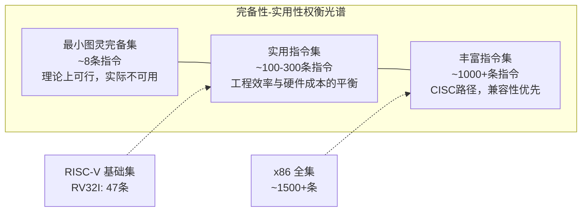

### 原则三：ISA 寿命远超微架构

一个成功的指令集架构的生命周期可达数十年（x86 超过 40 年，ARM 超过 30 年），远超任何具体微架构的寿命。因此，ISA 设计必须有前瞻性，同时避免过度设计。

RISC-V 的策略值得借鉴：基础 ISA（RV32I/RV64I）冻结不再修改，所有新功能通过标准扩展或自定义扩展实现。这确保了核心契约的绝对稳定，同时保留了应对未来变化的开放性。

### Trade-off 矩阵

| 设计决策 | 选择 A | 选择 B | 核心权衡 |
|---------|--------|--------|---------|
| 指令数量 | 少（RISC） | 多（CISC） | 硬件简洁性 vs 代码密度 |
| 指令长度 | 定长 | 变长 | 流水线效率 vs 代码密度 |
| 寻址模式 | 精简 | 丰富 | 编译器负担 vs 编程灵活性 |
| 寄存器数量 | 多 | 少 | 上下文切换开销 vs 寄存器窗口压力 |
| 扩展机制 | 模块化 | 单一增补 | 灵活性 vs 兼容性复杂度 |
| 内存模型 | 强一致性 | 弱一致性 | 编程简单性 vs 多核可扩展性 |

---

## 实践案例与反模式

### 正面案例：RISC-V 的模块化 ISA 设计

RISC-V 将指令集拆分为一个极简的基础集（RV32I 仅 47 条指令）加一系列可选标准扩展，是架构设计"稳定点内聚，变化点外放"原则的典范。

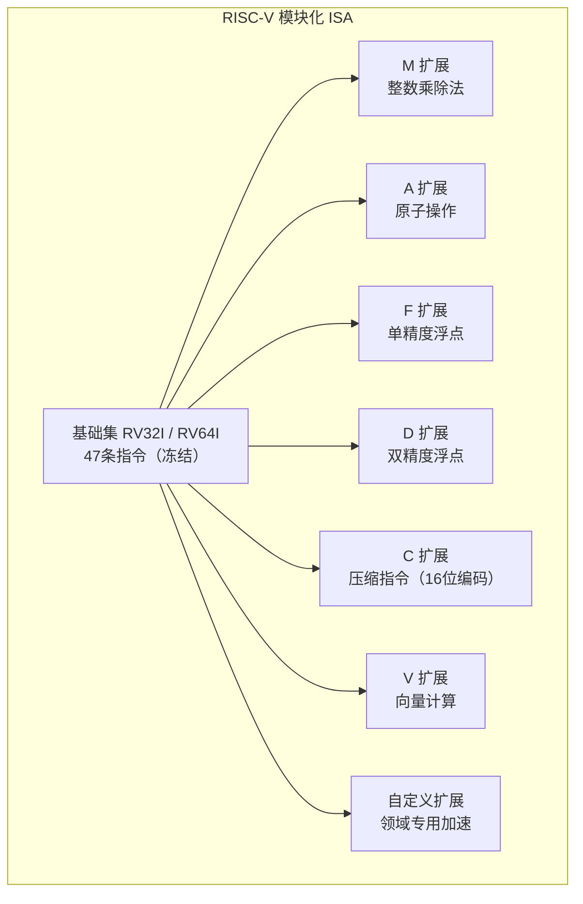

**设计洞察**：基础集冻结意味着所有 RISC-V 处理器必定支持这 47 条指令，任何软件都可以依赖它。扩展则按需实现，编译器可通过运行时检测来决定是否使用扩展指令。这完美解决了"兼容性"与"演进性"的矛盾。

### 正面案例：x86 的微操作翻译

现代 x86 处理器在 ISA 层面保持 CISC 的丰富语义（保障数十年的二进制兼容性），但在微架构层面将复杂指令翻译为类 RISC 的微操作，获得流水线效率。这种"前端兼容、后端高效"的分层策略，体现了架构设计中**接口稳定与实现自由**的经典原则。

### 反模式：Itanium (IA-64) 的 VLIW 路径

Intel 的 Itanium 处理器采用显式并行指令计算（EPIC/VLIW），将指令调度责任完全推给编译器，期望通过编译器的全局优化来替代硬件的动态调度。这一设计在实践中遭遇了严重挫折：

1. **编译器难以充分挖掘运行时信息**：硬件的动态乱序执行在运行时可获得更多调度信息，而编译器只能做静态分析
2. **二进制兼容性差**：新的微架构需要重新编译才能获得最佳性能
3. **编程模型复杂**：开发者需理解底层硬件细节

Itanium 的失败印证了一个架构原则：**将本应由硬件承担的复杂度强推给软件，往往不是简化而是转移问题，且通常降低整体效率。** 这与许式伟强调的"稳定点往往是核心价值点"一脉相承——指令调度的稳定需求应由硬件保障，而非依赖编译器的优化能力。

### 反模式：过度扩展导致 ISA 膨胀

x86 指令集从 8086 的约 100 条指令膨胀到今天的 1500+ 条指令，其中大量指令是为特定场景优化的专用指令。ISA 膨胀带来的问题包括：

- 译码器复杂度持续增长，功耗与面积开销增大
- 编译器难以自动选择最优指令，许多专用指令实际很少被使用
- 验证成本指数级增长——每新增一条指令需验证与所有已有指令的组合行为

这从反面验证了"极简核心 + 模块化扩展"设计策略的优越性。

---

## 指令集的演进与生态

### 从指令集到生态的飞轮效应

指令集的价值不仅在于技术设计，更在于其构建的生态系统。一个成功的 ISA 会形成正向飞轮：

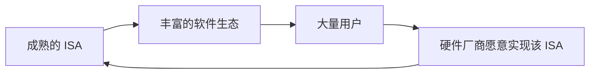

x86 和 ARM 之所以主导各自的市场，技术因素只是起点，生态飞轮才是决定性因素。RISC-V 作为开放 ISA，其核心竞争力不在于技术优势，而在于**打破 ISA 的商业垄断，让更多厂商可以参与生态构建**。

### 现代 ISA 的三层抽象

现代计算机系统中，指令集实际上存在于三个层次，形成递进的抽象链：

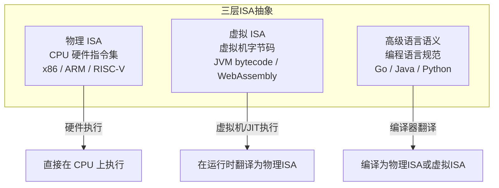

WebAssembly (Wasm) 的兴起尤其值得关注。正如许式伟在"架构设计的宏观视角"（参见第 01 讲）中所预见的，JavaScript 作为浏览器的"机器码"地位正在被改变。Wasm 本质上定义了一种新的虚拟 ISA——它比物理 ISA 更高层、更安全、更可移植，同时比 JavaScript 更接近底层、更高效。

这揭示了一个深刻的架构规律：**抽象层次的提升不是线性的替代，而是层次的叠加。每一层 ISA 都有自己的适用场景，它们共存而非互斥。**

---

## 小结

指令集是冯·诺依曼体系结构中最精妙的契约设计。它以极其精简的规格，支撑了无穷多样的计算需求，其核心机制是**将"计算能力"的稳定性与"计算需求"的多样性解耦**。

CISC 与 RISC 之争的本质是硬件-软件职责边界的划分，而二者的融合趋势则表明：没有绝对的最优解，只有特定约束条件下的最佳权衡。现代 ISA 设计的共识正在趋向"极简核心 + 模块化扩展"，RISC-V 是这一共识的典型代表。

---

## 关键要点

1. **指令集是硬件-软件的契约**：它定义了 CPU 暴露给软件的全部功能规格，是需求稳定点的固化，任何 ISA 设计必须以长期稳定性为首要考量。

2. **CISC 与 RISC 的本质是硬件-软件职责边界的划分**：CISC 用硬件复杂度换软件简洁性，RISC 反之；现代处理器趋向"前端兼容（CISC 接口）+ 后端高效（RISC 微操作）"的融合架构。

3. **稳定点内聚，变化点外放**：指令集核心应极简且冻结，扩展能力通过模块化机制按需加载，RISC-V 的设计是这一原则的最佳实践。

4. **ISA 的价值 = 技术设计 x 生态飞轮**：x86 和 ARM 的统治地位不仅源于技术，更源于生态正反馈；RISC-V 的核心竞争力在于以开放策略打破 ISA 商业垄断。

5. **抽象是层次的叠加而非替代**：从物理 ISA 到虚拟 ISA（JVM bytecode / WebAssembly），每一层都有其存在价值，理解指令集的设计哲学有助于理解各层抽象的边界与权衡。

---

> **交叉参考**：本章内容与原课程（许式伟架构课）以下讲次密切相关——
> - 第 02 讲"大厦基石：无生有，有生万物"：冯·诺依曼体系的三类零部件与指令集的关系
> - 第 03 讲"汇编：编程语言的诞生"：汇编语言作为指令集的人类可读表示
> - 第 04 讲"编程语言的进化"：从指令集到高级语言的抽象演进
> - 第 05 讲"思考题解读"：可自我迭代计算机中指令集扩展的架构意义
> - 第 07 讲"软件运行机制及内存管理"：指令集与内存管理的交互关系
