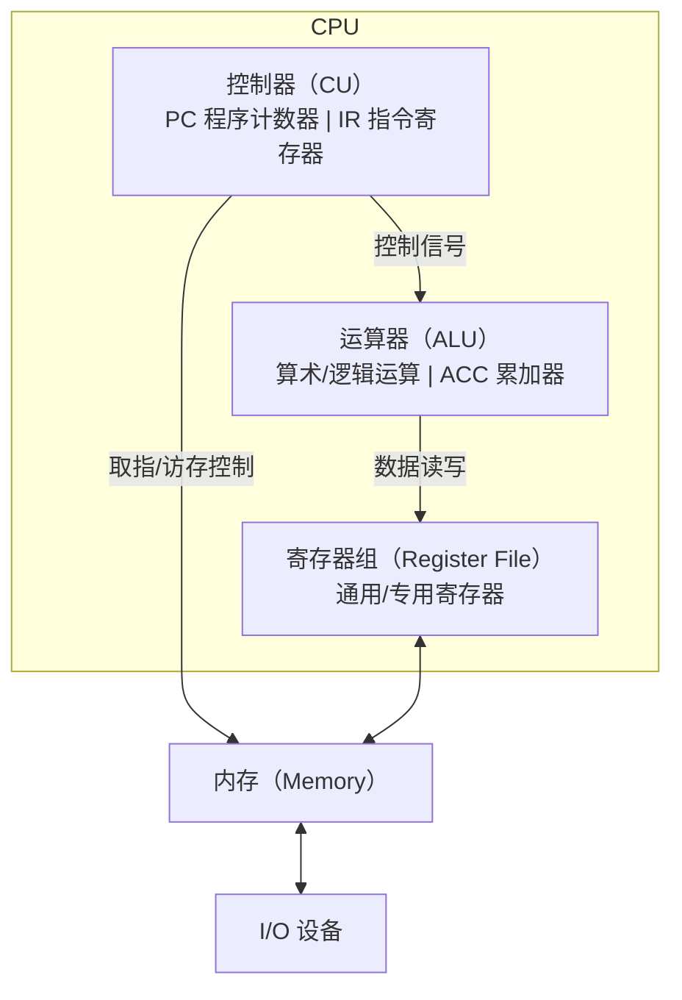

# CPU 内部结构与指令系统

CPU 是计算机的运算与指挥中心。本文整理 CPU 的三大组成部件（运算器、控制器、寄存器组）、指令的执行过程，以及指令集架构（ISA）与 RISC/CISC 的权衡。

## 一、CPU 的三大部件

CPU 内部主要由三部分构成：

### 运算器（ALU，Arithmetic Logic Unit）

- 执行算术运算（加、减、乘、除）与逻辑运算（与、或、非、移位、比较）。
- 由算术逻辑单元、累加器（ACC）、状态寄存器（PSW，存标志位如零标志 Z、进位 C、溢出 V）等组成。

### 控制器（Control Unit）

- CPU 的"指挥中心"，负责取指令、译码、产生控制信号。
- 由程序计数器（PC，指向下一条指令地址）、指令寄存器（IR，存放当前指令）、指令译码器等组成。

### 寄存器组（Register File）

- CPU 内部的高速存储，速度最快、容量最小。
- 通用寄存器（数据、地址）、专用寄存器（PC、IR、SP 栈指针、PSW 状态字）。

CPU 三大部件与总线的协作关系：



## 二、指令的执行周期

一条指令的执行分**取指 → 译码 → 执行 → 写回**四个阶段：

1. **取指（Fetch）**：根据 PC 从内存取指令到 IR，PC 自增指向下一条。
2. **译码（Decode）**：译码器分析 IR 中的操作码与操作数，产生控制信号。
3. **执行（Execute）**：ALU 执行运算，或访问内存。
4. **写回（Write Back）**：把结果写回寄存器或内存。

这即冯·诺依曼的**取指-执行循环**（Instruction Cycle），每个循环完成一条指令：


## 三、指令的组成

一条指令包含两个部分：

- **操作码（Opcode）**：指明做什么（如加、跳转、存取）。
- **操作数（Operand）**：指明对谁操作，可以是寄存器号、内存地址或立即数。

指令长度分定长（固定字节）与变长（按操作码/寻址方式变化）。x86 是变长指令，RISC 多定长指令。

## 四、寻址方式

指令如何找到操作数，即**寻址方式（Addressing Mode）**：

| 方式 | 说明 | 示例 |
| --- | --- | --- |
| 立即寻址 | 操作数就在指令中 | `MOV R1, #5` |
| 直接寻址 | 指令给出内存地址 | `LOAD R1, [1000]` |
| 间接寻址 | 指令给出存放地址的地址 | `LOAD R1, [[1000]]` |
| 寄存器寻址 | 操作数在寄存器 | `ADD R1, R2` |
| 寄存器间接 | 寄存器内存放的是地址 | `LOAD R1, [R2]` |
| 变址/基址寻址 | 基址 + 偏移量 | `LOAD R1, [R2 + 4]`（数组访问）|

寻址方式越丰富，指令越灵活，但译码越复杂。RISC 通常只保留少量简单寻址方式。

## 五、指令集架构（ISA）

**指令集架构（ISA）** 是 CPU 对外提供的指令集合规范，是**软件与硬件之间的接口约定**。汇编器/编译器面向 ISA 生成指令，硬件按 ISA 执行。

主要分两大流派：

### CISC（复杂指令集）

- 代表：x86（Intel、AMD）。
- 特点：指令多、功能强、多为变长指令，一条指令可完成复杂操作（如整块内存复制）。
- 优点：指令丰富，对编译器友好。
- 缺点：译码复杂、功耗高、流水线难做。

### RISC（精简指令集）

- 代表：ARM、RISC-V、MIPS。
- 特点：指令少且规整、多为定长（32 位）、寻址方式简单、**Load/Store 架构**（只有加载/存储能访问内存，运算指令只操作寄存器）。
- 优点：译码简单、易流水线化、功耗低。
- 缺点：复杂操作需多条指令组合。

### 关键对比

| 维度 | CISC（x86）| RISC（ARM）|
| --- | --- | --- |
| 指令长度 | 变长 | 定长 |
| 内存访问 | 运算可直接访问内存 | 仅 Load/Store 访问 |
| 寄存器数量 | 较少 | 较多 |
| 功耗 | 高 | 低 |
| 代表 | 桌面/服务器 | 移动端/嵌入式 |

现代 x86 处理器内部实际把 x86 指令**微码翻译成类似 RISC 的微操作**执行，兼得兼容性与性能，称为**微架构**与 ISA 分离。

## 六、精简指令的执行（Load/Store 架构）

RISC 风格的一条加法，需三步（体现 Load/Store 原则）：

```asm
LOAD  R1, [a]   ; 从内存 a 加载到 R1
LOAD  R2, [b]   ; 从内存 b 加载到 R2
ADD   R3, R1, R2; 寄存器相加，结果存 R3
STORE [c], R3   ; 结果写回内存 c
```

运算指令只操作寄存器，内存访问由专门指令负责，极大简化译码与流水线。

## 小结

- CPU 由运算器、控制器、寄存器组构成，执行"取指→译码→执行→写回"循环。
- 指令含操作码与操作数，通过不同寻址方式定位操作数。
- ISA 是软硬件接口；CISC 指令强但译码复杂，RISC 指令规整易流水线化，现代 x86 内部微码化兼得二者。
