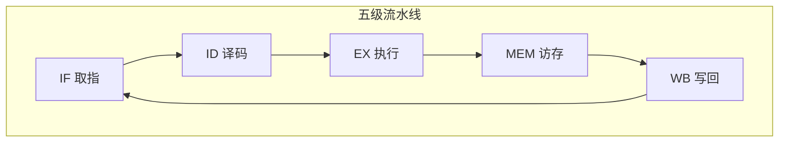

# 指令流水线与冒险

单条指令执行含取指、译码、执行等多个阶段，若串行执行则 CPU 利用率低。**指令流水线（Pipelining）** 让不同指令的阶段重叠执行，大幅提升吞吐。本文整理流水线原理、性能提升，以及三类冒险（结构/数据/控制冒险）的成因与应对。

## 一、为什么需要流水线

一条指令的完整执行可分若干阶段。若顺序执行，一条指令结束才取下一条，CPU 各部件大量空闲。流水线借鉴工厂流水作业：**多条指令的不同阶段并行进行**。

以五级流水为例：

```
IF(取指) → ID(译码) → EX(执行) → MEM(访存) → WB(写回)
```

理想情况下，每个时钟周期都有一条指令完成，**吞吐量**提升近 5 倍（注意是吞吐提升，单条指令延迟不变）。

## 二、流水线的性能

- **吞吐率**：单位时间完成的指令数。理想流水线吞吐率 = \(1/\text{时钟周期}\)，接近峰值。
- **加速比**：当指令数足够多时，理想加速比趋近流水线级数（5 级约 5 倍）。实际受冒险、分支、指令级并行度影响而降低（流水线启动阶段有填充开销，指令太少时加速比低）。

五级流水在 t4 时刻的状态示意（已取入 4 条指令，尚无指令完成）：

| 时钟 | 指令 A | 指令 B | 指令 C | 指令 D |
| --- | --- | --- | --- | --- |
| t1 | IF | | | |
| t2 | ID | IF | | |
| t3 | EX | ID | IF | |
| t4 | MEM | EX | ID | IF |

每个周期各阶段都被利用，但引入了新的问题——**冒险（Hazard）**。

流水线推进的另一种视角（每条指令流经五个阶段）：



## 三、三类冒险

### 1. 结构冒险（Structural Hazard）

多个指令在同一周期争用同一硬件资源（如同一内存端口）。

- 例：取指与访存（MEM）都要访问内存。
- 解决：
  - 硬件分离：**指令缓存与数据缓存分开**（哈佛结构思想）；
  - 插入气泡（stall）等待。

### 2. 数据冒险（Data Hazard）

后续指令依赖前面指令尚未写回的结果。

```asm
ADD R1, R2, R3   ; 写 R1
SUB R4, R1, R5   ; 读 R1 —— 依赖前一条
```

若 SUB 在 ADD 写回前就读 R1，得到旧值。解决：

- **转发（Forwarding/旁路 Bypass）**：EX 阶段算出结果后直接转给后续指令，无需等 WB。可消除多数数据冒险。
- **插入气泡**：仍有依赖无法转发时停顿。
- **编译器重排**：软件层面调整指令顺序。
- **换名（Register Renaming）**：用物理寄存器消除伪相关（WAR/WAW）。

### 3. 控制冒险（Control Hazard）

分支/跳转指令尚未确定下一指令地址，流水线已取入错误的下一条指令。

解决：

- **分支预测（Branch Prediction）**：猜测分支方向，猜对零损失，猜错清空流水线重取。
- **延迟分支（Delayed Branch）**：把分支后与分支无关的指令放入延迟槽执行。
- **分支目标缓冲（BTB）**：缓存历史分支目标地址，加快预测。

## 四、流水线的分类

- **标量流水线**：一个周期执行一条指令。
- **超标量（Superscalar）**：一个周期发射多条指令，需多个执行单元（ALU×2、Load/Store 单元等），依赖硬件资源冗余与乱序执行。

现代高性能 CPU（如 x86、ARM）普遍采用**超标量 + 乱序执行 + 分支预测**，本质是多级流水线的并发扩展。

## 五、乱序执行（Out-of-Order Execution）

为提升利用率，CPU 不再严格按程序顺序执行，而是：

1. 分析指令间依赖；
2. 无依赖的指令提前执行；
3. 通过**重排序缓冲区（ROB）**保证结果最终按程序顺序提交，维持程序语义。

乱序执行是编译器与硬件协同提升指令级并行的关键。

## 小结

- 流水线通过阶段重叠提升吞吐，理想加速比接近级数。
- 三类冒险：结构（资源争用）、数据（结果依赖）、控制（分支不确定）。
- 应对手段：硬件分离/转发/分支预测/乱序执行，以及编译器重排，共同逼近流水线峰值。
