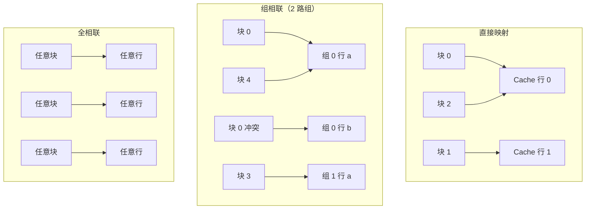

# Cache 映射、替换与写策略

前文（存储器分级）介绍了 Cache 的层级与命中率。本文深入 Cache 设计的三个核心问题：**主存块如何映射到 Cache 行（映射方式）、Cache 满时替换哪个块（替换策略）、数据修改后如何保持一致（写策略）**。

## 一、基本概念

Cache 与主存都以固定大小的**块（Block/Line）**为单位传输。Cache 的容量远小于主存，多个主存块需共享一个 Cache 行。**映射方式**决定主存块到 Cache 行的对应关系。

设 Cache 有 \(C\) 行、主存块大小为 \(B\) 字节，则主存地址可划分为：**块内偏移 + Cache 索引 + 标记（Tag）**。

## 二、三种映射方式

### 1. 直接映射（Direct Mapping）

每个主存块**只能**映射到唯一的一个 Cache 行，由索引位决定：

\[
\text{Cache 行号} = \text{块号} \bmod C
\]

- 优点：硬件简单、查找快（只需比对 Tag）。
- 缺点：**抖动（Thrashing）**严重——两个映射到同一行但都频繁使用的主存块会反复互相驱逐，命中率低。

### 2. 全相联映射（Fully Associative）

主存块可映射到**任意** Cache 行。查找需比对所有行的 Tag（并行比较）。

- 优点：无抖动，命中率最高。
- 缺点：硬件成本高（需大量比较器），仅适合小容量 Cache（如 TLB）。

### 3. 组相联映射（Set Associative）

折中方案：Cache 分成若干**组**，主存块经 `块号 mod 组数` 映射到某组，但可放在组内**任意**一行。

- **n 路组相联**：每组 n 行。n=1 退化为直接映射，n=Cache 行数退化为全相联。
- 常见 4-way / 8-way。
- 综合命中率与硬件成本，是 CPU Cache 的主流选择。

### 映射对比

| 方式 | 命中率 | 硬件成本 | 抖动 | 应用 |
| --- | --- | --- | --- | --- |
| 直接映射 | 低 | 低 | 严重 | 简单场景 |
| 全相联 | 最高 | 高 | 无 | TLB |
| 组相联 | 高 | 中 | 小 | L1/L2/L3 Cache |

三种映射方式下，主存块到 Cache 行的归属关系示意：

## 三、替换策略（Replacement Policy）

Cache 满且未命中时，需选择一行替换。前面操作系统篇的置换算法（FIFO、LRU 等）在此同样适用，但 Cache 硬件实现有其约束：

- **LRU（最近最少使用）**：硬件维护访问顺序信息，命中率最好但硬件复杂。
- **随机替换**：实现最简单，实际命中率与 LRU 差距不大，现代大容量 Cache 常用。
- **伪 LRU（Pseudo-LRU）**：用少量位近似 LRU，折中实现成本与效果。

组相联缓存因每组行数少（如 4 路），LRU 只需在组内维护顺序，硬件可控，故 4/8 路组相联 + LRU 是主流。

## 四、写策略

命中与未命中时的写处理策略：

### 写命中（Write Hit）

- **写直达（Write-Through）**：数据同时写入 Cache 与主存。
  - 优点：主存始终最新，一致性简单。
  - 缺点：每次写都访存，性能差；可配**写缓冲（Write Buffer）**缓解。
- **写回（Write-Back）**：只写 Cache，行被替换时才写回主存，用**脏位（Dirty Bit）**标记。
  - 优点：减少访存，性能好。
  - 缺点：主存可能暂时不一致，需脏位管理。

### 写未命中（Write Miss）

- **写分配（Write Allocate）**：先把块调入 Cache 再写（配合写回）。
- **非写分配（No-Write-Allocate）**：不调入 Cache，直接写主存（配合写直达）。

常见组合：**写回 + 写分配**、**写直达 + 非写分配**。

## 五、Cache 一致性（多核）

多核 CPU 各自有 L1/L2 Cache，同一主存块可能被多核缓存并修改，产生不一致。典型协议：

**MESI 协议**：每个 Cache 行有四种状态。
- **M（Modified）**：已修改，仅本核，需写回主存。
- **E（Exclusive）**：仅本核持有且未修改。
- **S（Shared）**：多核共享未修改。
- **I（Invalid）**：失效，需重新读取。

CPU 通过**总线嗅探（Bus Snooping）** 监听其他核的访问请求，配合状态转移保证多核看到一致数据。

## 小结

- 映射方式决定主存块到 Cache 行的归属：直接映射简单易抖，全相联无抖动但昂贵，组相联是主流折中。
- 替换策略在 Cache 中用 LRU/伪 LRU/随机，组相联让 LRU 硬件可控。
- 写策略权衡一致性与性能：写直达简单慢、写回快需脏位；多核用 MESI 等一致性协议。
