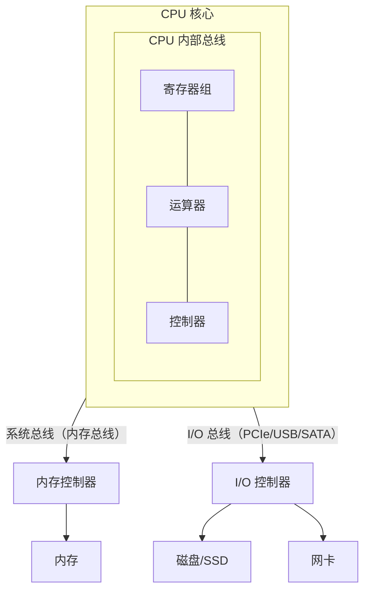

# 总线系统

总线（Bus）是连接 CPU、内存、I/O 设备之间的一组公共传输线。本文整理总线的类型、组成、时序与仲裁机制，以及总线在系统性能中的角色。

## 一、什么是总线

总线是一组共享的传输通道，用于在系统部件间传输数据、地址和控制信号。相比点对点直连，总线大幅减少了连线数量，提升了可扩展性，但也是潜在的性能瓶颈（同一时刻只能有一个设备传输）。

## 二、总线的类型

按传输内容分三类：

- **数据总线（Data Bus）**：传输数据，宽度决定一次能传多少位（如 32/64 位），双向。
- **地址总线（Address Bus）**：传输内存/设备地址，宽度决定寻址能力（32 位地址总线可寻址 \(2^{32}=4G\)），单向。
- **控制总线（Control Bus）**：传输读写、中断、时钟等控制信号。

## 三、总线的分层

现代系统用分层总线架构避免单一总线成为瓶颈：

- **CPU 内部总线**：连接寄存器、ALU、控制器，速度最快。
- **系统总线（前端总线/内存总线）**：连接 CPU 与内存控制器。
- **I/O 总线**：连接外设，如 PCIe、USB、SATA，速度较慢但可扩展。

北桥/南桥架构，以及现代 CPU 内部集成内存控制器（IMC），都是总线分层演进的体现。PCIe 采用高速串行点对点通道（Lanes），取代了并行的 PCI 总线。

分层总线架构示意：

## 四、总线的时序

总线传输需遵循**总线协议**，用时钟/握手信号协调：

- **同步总线**：由统一时钟控制，固定节奏传输。简单但所有设备需同频。
- **异步总线**：通过**握手信号**（Ready/Acknowledge）协调，无需统一时钟，可适应不同速度设备，但开销略大。

## 五、总线仲裁（Arbitration）

多个设备（如多个 DMA 控制器、多核 CPU）可能同时请求总线。**仲裁器**决定谁先使用，避免冲突。

### 仲裁方式

- **集中式仲裁**：由中央仲裁器统一裁决。
  - 链式查询（菊花链）：设备串联，优先级由位置决定。
  - 计数器定时查询：仲裁器按设备号轮流查询。
  - 独立请求：每设备独立请求线，仲裁器快速裁决，优先级可编程。
- **分布式仲裁**：无中央仲裁器，各设备通过总线上的仲裁逻辑协商（如以太网 CSMA/CD 思想）。

### 仲裁优先级策略

- **固定优先级**：实现简单，但低优先级设备可能"饿死"。
- **轮转（Round-Robin）**：循环分配，公平。
- **动态优先级**：按需调整。

## 六、总线与 DMA

DMA（直接存储器存取）控制器可在**不经过 CPU** 的情况下直接通过总线在内存与设备间传输数据。此时 DMA 控制器与 CPU 都会请求总线，需仲裁决定谁先访问内存。关于 DMA 的完整流程见 I/O 控制方式篇。

## 七、总线的性能指标

- **总线宽度**：数据线位数，决定一次传输的比特数。
- **总线频率**：每秒传输周期数。
- **带宽**：\(带宽 = 宽度 \times 频率\)。

例如 64 位宽、133MHz 的总线带宽约为 \(64/8 \times 133 \approx 1.06\ \text{GB/s}\)。

## 小结

- 总线分数据/地址/控制三类，按层级组织避免瓶颈。
- 同步总线靠时钟、异步总线靠握手协调时序。
- 多设备争用时由仲裁器裁决，策略有固定优先级、轮转等。
- 带宽 = 总线宽度 × 频率，是衡量总线性能的核心指标。
