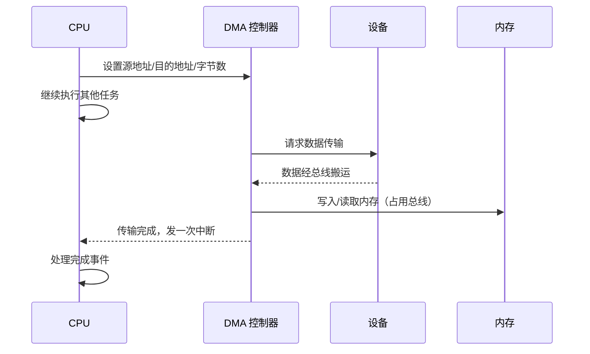

# I/O 控制方式：查询、中断、DMA 与通道

CPU 与 I/O 设备的数据交换，从"CPU 全程参与"到"设备自主搬运"，历经四种方式演进。本文整理程序查询、程序中断、DMA 与 I/O 通道的原理、优缺点与适用场景。

## 一、为什么需要 I/O 控制

外设速度远慢于 CPU 与内存，且格式各异。I/O 控制方式的核心矛盾是：**如何在不浪费 CPU 的前提下完成数据搬运**。四种方式 CPU 的参与度递减、效率递增。

## 二、程序查询方式（Polling）

CPU 不断查询设备状态寄存器，设备就绪才进行数据传送。

- 流程：CPU 发命令 → 循环查询设备状态 → 就绪后传一个数据 → 重复。
- **优点**：简单、可控，无需额外硬件。
- **缺点**：**忙等**——CPU 在查询期间无法做别的，且传输一个数据就要查一次。适合慢速、低频设备，性能差。

对应操作系统篇的"轮询"。

## 三、程序中断方式（Interrupt）

设备就绪后主动通过**中断**通知 CPU，CPU 暂停当前程序去执行中断服务程序处理 I/O，完成后返回。

- 流程：设备就绪 → 发中断请求 → CPU 响应中断 → 执行中断服务 → 数据传送 → 返回。
- **优点**：CPU 不必忙等，可并行执行其他任务，效率高于查询。
- **缺点**：每传一个数据触发一次中断，中断保存/恢复现场有开销；频繁中断会拖累性能。

中断机制细节见中断和中断向量篇。**每传一个字/一个块就中断一次**，适用于中速设备（如键盘、串口）。

## 四、DMA 方式

DMA（Direct Memory Access，直接存储器存取）让**专用 DMA 控制器**在内存与设备间直接搬运一整块数据，CPU 仅在开始设置参数、结束时处理一次中断。

- 流程：CPU 设置 DMA（源地址、目的地址、传送字节数）→ CPU 去做别的 → DMA 控制器经总线搬数据（无需 CPU 参与）→ 数据搬完发一次中断 → CPU 处理完成事件。
- **优点**：**批量传输**，CPU 几乎不参与搬运，效率高。
- **缺点**：需要 DMA 控制器硬件；搬运期间 DMA 与 CPU 争用总线（需总线仲裁）。

DMA 适用于高速、大批量设备（磁盘、网卡）。现代 SSD、GPU 都依赖 DMA。

DMA 传输的时序：

### 内存映射 I/O 与端口 I/O

DMA 涉及 CPU 如何访问设备：
- **内存映射 I/O（MMIO）**：设备寄存器映射到内存地址空间，用普通访存指令访问。
- **端口 I/O**：独立的 I/O 地址空间，用专用 IN/OUT 指令（x86）。

## 五、I/O 通道方式

**通道（Channel）**是更高级的 I/O 处理机，是一个**能执行专用通道程序的硬件**，可独立控制多台设备完成复杂的 I/O 序列，CPU 只需发一个通道指令。

- **通道程序**：描述一系列 I/O 操作（读盘→移动磁头→写另一盘等）。
- CPU 启动通道后完全放手，通道自主管理一批设备的传输，结束再中断 CPU。
- **优点**：CPU 干预最少，I/O 并行度高。
- **缺点**：硬件最复杂、成本最高，常见于大型机。

## 六、四种方式对比

| 方式 | CPU 参与度 | 传输单位 | 适用设备 | 效率 |
| --- | --- | --- | --- | --- |
| 程序查询 | 全程忙等 | 一个字 | 慢速简单设备 | 低 |
| 程序中断 | 每传一个字中断一次 | 一个字 | 中速设备（键盘/串口）| 中 |
| DMA | 开始/结束各一次 | 一个数据块 | 高速设备（磁盘/网卡）| 高 |
| 通道 | 发指令后完全放手 | 多设备多块 | 大型机批量 | 最高 |

**演进主线**：CPU 从"搬运工"逐渐变为"管理者"，把数据搬运职责下放到专用硬件。

## 小结

- 四种 I/O 控制方式按 CPU 参与度递减：查询（忙等）→ 中断（每字中断）→ DMA（整块搬运）→ 通道（批量自主）。
- DMA 是现代高速设备（磁盘/网卡）的核心机制，配合总线仲裁使用。
- 选择依据是设备速度与传输量：越高速大批量，越应降低 CPU 参与。
