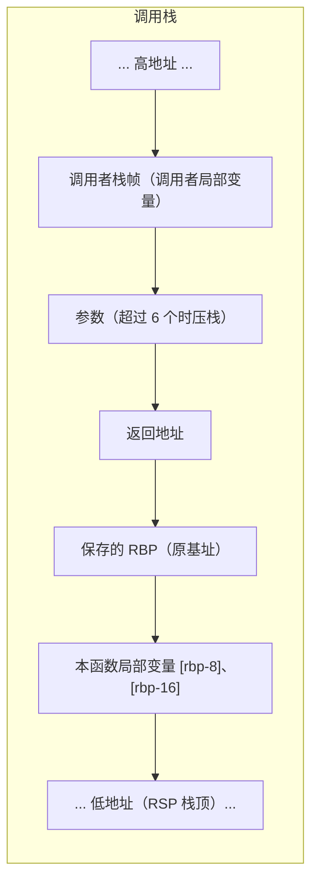

# 汇编语言基础：寄存器、指令与函数调用

汇编语言是与机器指令一一对应的符号表示，是理解编译原理、调试、性能优化与系统底层的窗口。本文以 x86-64（Intel 语法）为主线，介绍常用寄存器、指令与函数调用约定（栈帧）。

## 一、为什么学汇编

- 理解高级语言代码如何被翻译执行、性能瓶颈在哪。
- 阅读崩溃栈、反汇编、安全分析（漏洞利用、shellcode）。
- 深入操作系统启动、驱动、嵌入式开发。

## 二、x86-64 寄存器

x86-64 有 16 个通用寄存器，各有一些约定用途：

| 寄存器 | 别名/用途 |
| --- | --- |
| RAX | 累加器，常用于函数返回值、算术 |
| RBX | 通用，被调用者保存 |
| RCX | 计数器，用于移位/循环；函数第 4 个参数 |
| RDX | 数据寄存器，函数第 3 个参数 |
| RSI / RDI | 源/目的索引，函数第 2/1 个参数 |
| RBP | 栈帧基址指针 |
| RSP | 栈顶指针 |
| R8~R15 | 扩展寄存器，第 5、6 个参数等 |

**调用约定（System V AMD64，Linux/macOS）**：前 6 个整型参数依次放 RDI、RSI、RDX、RCX、R8、R9；返回值放 RAX。多出的参数压栈。

## 三、常用指令

### 数据传送

```asm
mov  rax, rbx     ; 复制 rbx → rax
mov  rax, [rsp]   ; 从内存取数（方括号表示内存地址）
lea  rax, [rsp+8] ; 计算地址（不访存）
push rax          ; 压栈（rsp -= 8 后写入）
pop  rax          ; 出栈
```

### 算术与逻辑

```asm
add  rax, 5
sub  rax, rcx
imul rax, rbx     ; 乘法
idiv rcx          ; 除法（被除数在 rdx:rax）
and / or / xor    ; 位运算
shl / shr         ; 移位
```

### 控制流

```asm
cmp  rax, rbx     ; 比较，设置标志位
je   label        ; 相等则跳转（jne/jg/jl/jge/jle 等）
jmp  label        ; 无条件跳转
call func         ; 调用函数（压返回地址）
ret               ; 返回（弹出返回地址）
```

### 数据声明与字节序

```asm
.data
msg: .byte 0x48,0x65   ; 字节序列
```

**字节序（Endianness）**：x86 是小端（Little-Endian），即数值低位存低地址。网络传输多用大端，需注意字节序转换。

## 四、函数调用与栈帧

C 函数调用对应一套固定模式（栈帧 Stack Frame）：

```asm
func:
  push rbp          ; 保存调用者基址
  mov  rbp, rsp     ; 建立新栈帧
  sub  rsp, 16      ; 为局部变量分配空间
  ; ... 函数体 ...
  mov  rax, result  ; 返回值放 rax
  leave             ; mov rsp, rbp; pop rbp
  ret
```

**栈帧结构**（栈从高地址向低地址增长）：
- 返回地址、保存的 RBP、局部变量依次排列。
- 局部变量通过 `rbp` 相对寻址访问，如 `[rbp-8]`。
- 参数超过 6 个时压栈，通过 `[rbp+16]` 等访问。

栈帧在内存中的布局（高地址在上、向低地址增长）：



## 五、C 与汇编对照

一个简单 C 函数：

```c
int add(int a, int b) { return a + b; }
```

对应汇编（System V）：

```asm
add:
  push rbp
  mov  rbp, rsp
  mov  eax, edi    ; edi = a
  add  eax, esi    ; eax = a + b（esi = b）
  pop  rbp
  ret
```

两个参数在 RDI、RSI，结果存 EAX，返回。看懂此例即理解了函数调用的核心。

## 六、编译器优化与汇编的关系

- 编译器（如 GCC `-O2`）会进行寄存器分配、指令重排、内联、消除冗余等优化，产物可能与手写思路差异很大。
- 现代 CPU 微架构（乱序执行、流水线）会进一步改变指令的实际执行方式，汇编只是"ISA 层面的顺序指令流"。

## 小结

- 汇编与机器指令一一对应，是软硬件接口的最底层体现。
- x86-64 有 16 个通用寄存器，函数调用遵循固定约定（参数寄存器、栈帧、返回 RAX）。
- 理解栈帧与调用约定，是调试崩溃栈、阅读反汇编、做底层优化的基础。
