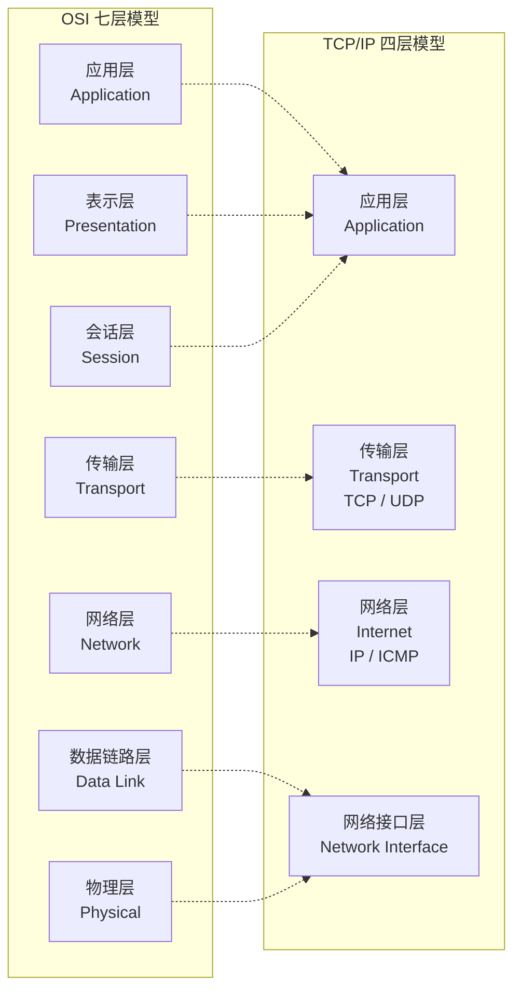
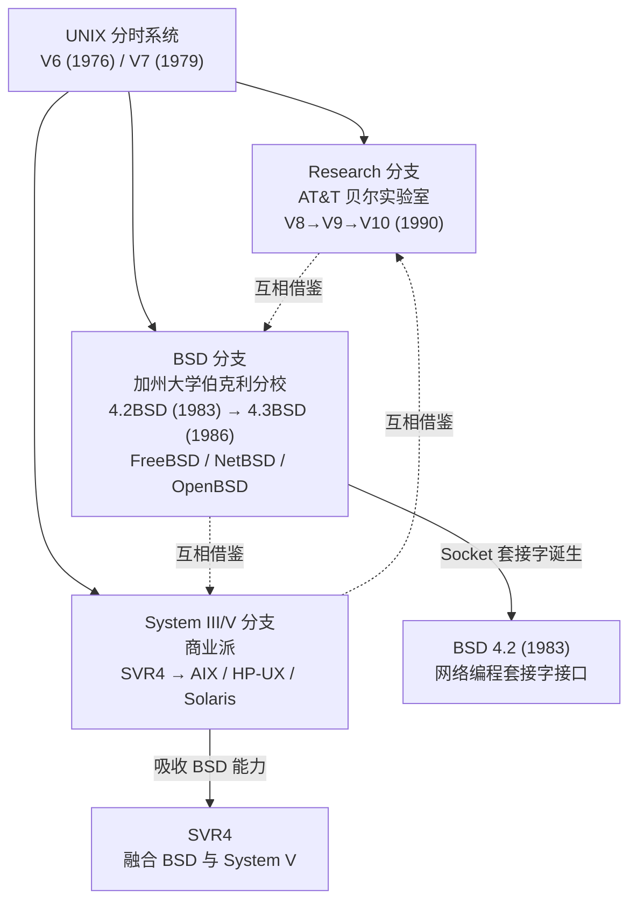
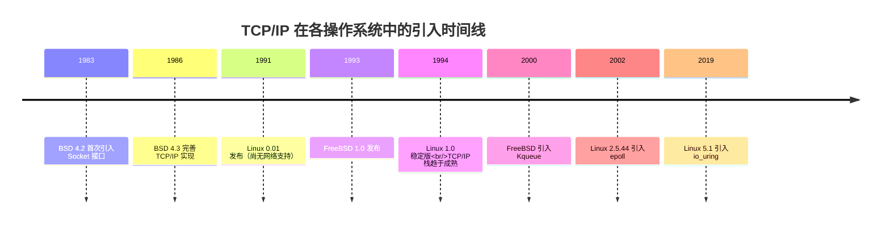

# 追古溯源：TCP/IP与Linux的发展演进

## TCP/IP 协议族的发展历程

互联网的雏形可追溯至阿帕网（ARPANET）。早期阿帕网采用网络控制协议（Network Control Protocol，NCP）作为不同计算机间的通信协议。

NCP 诞生数年后，其开发者温特·瑟夫（Vinton Cerf）与罗伯特·卡恩（Robert E. Kahn）共同开发了阿帕网的下一代协议，并于 1974 年发表了以分组交换、序列化、流量控制、超时重传与容错机制为核心的新型网络互联协议，奠定了 TCP/IP 协议的基础。

### OSI 参考模型与 TCP/IP 协议栈

TCP/IP 协议栈与 OSI 参考模型的对比如下图所示：



ISO 组织在 1984 年发布了 OSI 参考模型，然而彼时 TCP/IP 已经成为事实标准。TCP/IP 的成功归因于以下因素：

1. **开放性**：TCP/IP 以免费或少量收费的方式提供，扩大了使用人群；
2. **与 UNIX 的协同演进**：TCP/IP 搭配 UNIX 操作系统，推出了基于套接字（Socket）的实际编程接口；
3. **源于实际需求**：TCP/IP 来源于工程实践，在解决实际问题的过程中不断完善，而非先设计后实现。

OSI 七层模型的层次划分过于复杂，且缺乏参考实现，在一定程度上阻碍了其普及。然而，OSI 的层次模型对后世影响深远，业界常说的"四层"与"七层"即分别指代传输层与应用层，遵循了 OSI 模型的定义。

TCP/IP 应用层对应 OSI 的应用层、表示层和会话层；TCP/IP 网络接口层对应 OSI 的数据链路层和物理层。

## UNIX 操作系统发展历程

TCP/IP 协议的成功与 UNIX 操作系统的发展密不可分。以下为 UNIX 操作系统的主要发展分支：



### 关键 UNIX 变体

#### SVR4

SVR4（UNIX System V Release 4）是 AT&T 的 UNIX 系统实验室推出的商业产品。它融合了多个分支的特性，是后续各商业 UNIX 操作系统的先祖，包括 IBM AIX、HP-UX、SGI IRIX、Sun Solaris 等。

#### Solaris

Solaris 由 Sun Microsystems（现为 Oracle）开发，基于 SVR4。2005 年，Sun 开源了 Solaris 的大部分源代码（OpenSolaris），但相较于 Linux，其社区发展较为有限。

#### BSD

BSD（Berkeley Software Distribution）由加州大学伯克利分校的计算机系统研究组（CSRG）开发。4.2BSD（1983 年）首次引入了网络编程套接字接口，4.3BSD（1986 年）进一步完善。正是 TCP/IP 与 BSD 的结合，推动了 TCP/IP 成为事实标准。

#### macOS

macOS 基于 Darwin 内核，其血统可追溯至 BSD。macOS 已通过 POSIX 兼容性认证，属于类 UNIX 系统。若查看 macOS 的 `<sys/socket.h>` 头文件定义，可以明显看到其与 BSD 的渊源。

## Linux 操作系统

Linux 操作系统是当今互联网数据中心的基石，Android 移动操作系统亦基于 Linux 内核。Linux 的成功源于以下关键因素：

### 1. UNIX 的方向指引

Linux 诞生时，4.2/4.3 BSD 已存在近十年，为 Linux 提供了明确的发展方向。Linux 采用 C 语言开发，而 C 语言正是在 UNIX 开发过程中发明的。

### 2. POSIX 标准

POSIX（Portable Operating System Interface for Computing Systems）基于现有 UNIX 实践与经验，定义了操作系统的调用服务接口。Linux 最早的内核头文件中即包含 POSIX 宏定义：

```c
# ifndef _UNISTD_H
# define _UNISTD_H

/* ok, this may be a joke, but I'm working on it */
# define _POSIX_VERSION  198808L
# define _POSIX_CHOWN_RESTRICTED /* only root can do a chown (I think..) */
# define _POSIX_VDISABLE '\0'    /* character to disable things like ^C */
```

POSIX 为 Linux 提供了标准化的接口规范，使得不同操作系统上的应用程序可以兼容运行——macOS 与 Linux 之所以能够兼容运行大部分程序，正是因为它们遵循了同一份 POSIX 规范。

### 3. Minix 操作系统

Minix 由安德鲁·塔能鲍姆（Andy Tanenbaum）教授开发，最初用于 UNIX 教学。Linux 早期从 Minix 中借鉴了部分设计思路，包括最早的文件系统实现。

### 4. GNU 项目

GNU（GNU's Not UNIX）由理查德·斯托曼（Richard Stallman）于 1984 年发起，旨在构建一个完全自由的软件系统。GNU 项目相继推出了 GCC 编译器、GDB 调试器、Bash Shell 等核心工具，为 Linux 的诞生奠定了基础。

GNU 独缺操作系统内核。1990 年，自由软件基金会开始开发 Hurd 内核，但项目进展缓慢。1991 年 Linux 出现后，GNU 开发者转向以 Linux 作为内核，形成 GNU/Linux 体系。斯托曼主张 Linux 操作系统使用了许多 GNU 软件，正式名称应为 GNU/Linux，但这一命名主张未获 Linux 社群一致认同，形成著名的 GNU/Linux 命名争议。

GNU 与 Linux 互相成就：没有 GNU 工具链，Linux 无法诞生；没有 Linux 内核，GNU 亦无法发挥其完整价值。

## 操作系统对 TCP/IP 的支持

各主要操作系统引入 TCP/IP 网络支持的时间线如下：



## 总结

本文回顾了 TCP/IP 协议族与 Linux 操作系统的发展历程。关键要点如下：

- TCP/IP 的成功源于其开放性、与 UNIX 的协同演进以及源于实际需求的工程实践
- 套接字（Socket）接口最早由 BSD 4.2 引入（1983 年），后成为网络编程的事实标准
- Linux 的成功得益于 UNIX 方向指引、POSIX 标准化、Minix 设计借鉴以及 GNU 工具链
- Linux 网络栈经历了从基础 TCP/IP 到 epoll（2.5.44）再到 io_uring（5.1）的演进

## 版本信息

| 项目 | 版本 |
|------|------|
| 更新日期 | 2026-06-09 |
| 目标内核版本 | Linux 7.0 (Stable) |
| 参考文档 | man-pages 6.18, kernel.org |
