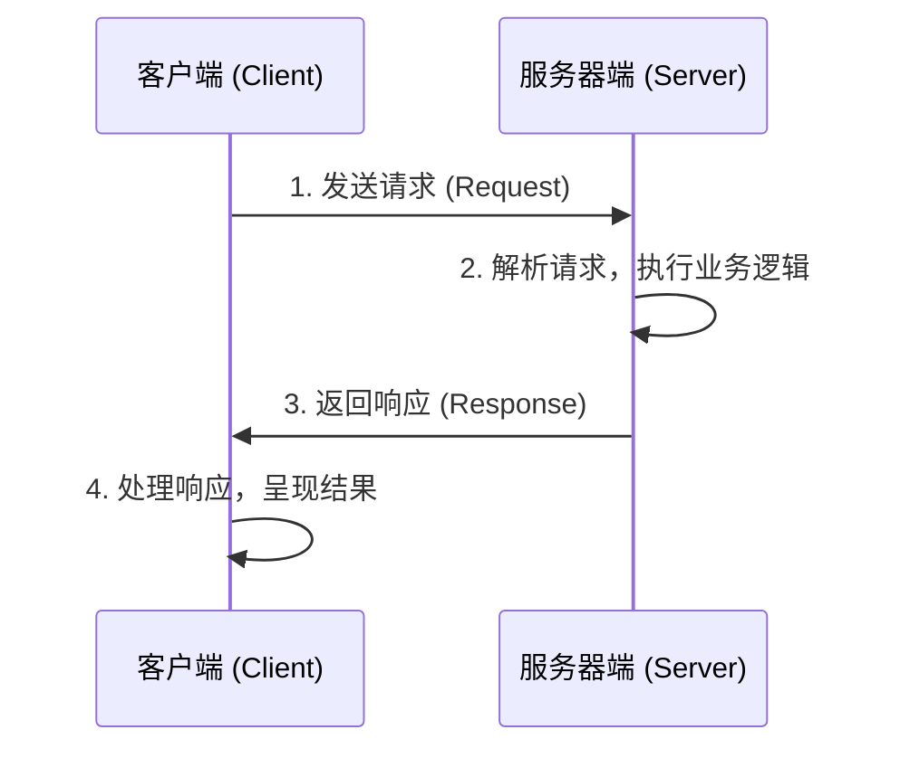
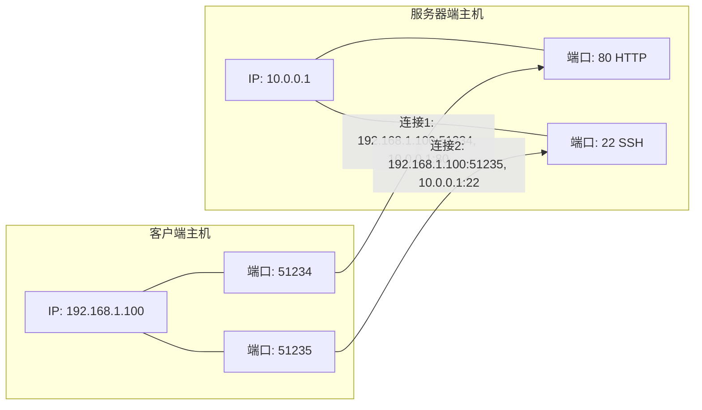
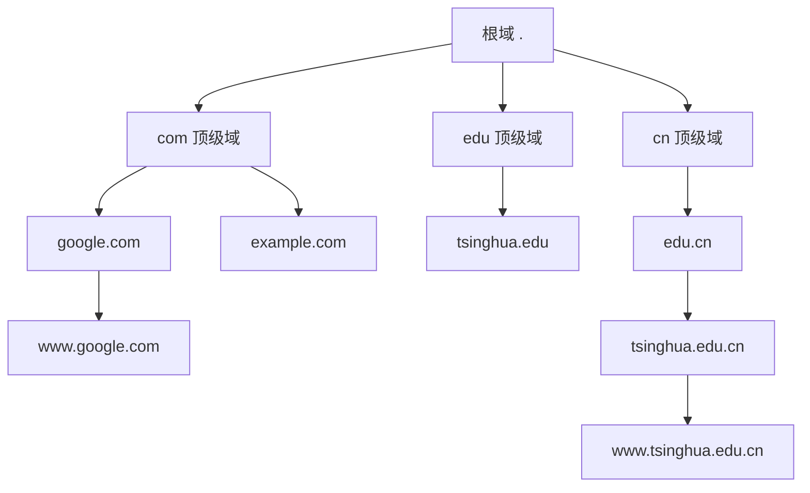
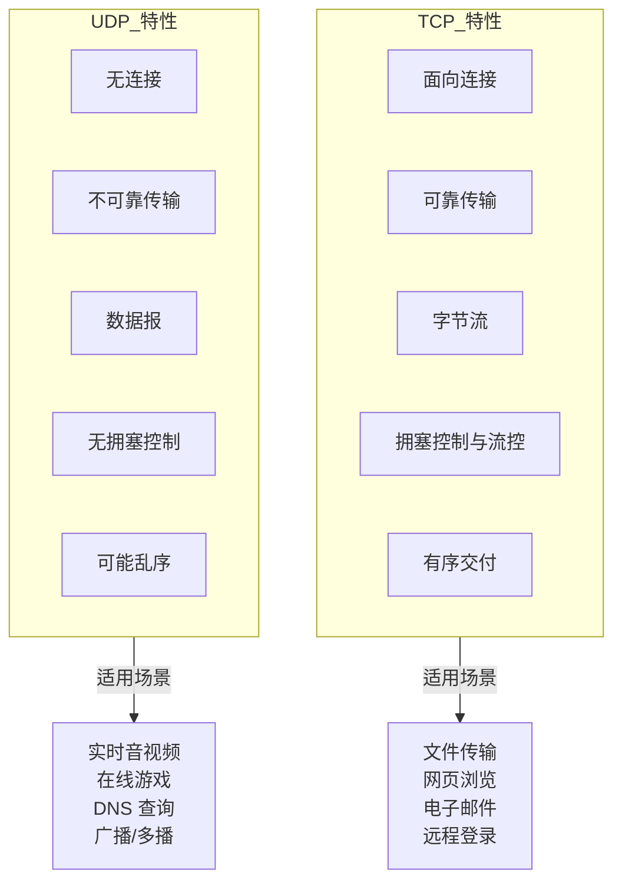

# 客户端-服务器网络编程模型与基础概念

## 客户端-服务器网络编程模型

在网络编程领域，客户端-服务器（Client-Server）模型是最基础的架构范式。该模型定义了网络通信中两个角色的职责划分：服务器端（Server）在众所周知的地址上监听，等待客户端（Client）发起请求并提供服务；客户端主动向服务器端发起连接请求，通过建立的连接通路完成数据交互。

以网络购物场景为例，用户在移动终端上的每次操作，本质上都是客户端向服务器端发送请求并接收响应的过程：

1. 客户端需要服务时（如提交购物订单），按照双方约定的协议格式向服务器端发送请求；
2. 服务器端接收请求后，按照协议格式解析请求内容，执行相应的业务逻辑（如调用数据库创建订单）；
3. 服务器端完成处理后，向客户端发送响应（如返回订单付款金额），等待客户端的后续操作；
4. 客户端接收响应并进行处理（如在终端显示付款金额，提示用户选择支付方式）。



在客户端-服务器模型中，选择传输层协议时需要区分 TCP 与 UDP：TCP 通信中由发起连接的一方标识客户端，UDP 通信中由发送报文的一方标识客户端。区分客户端与服务器端的根本原因在于二者的编程模型存在显著差异。

服务器端需要在启动时监听一个众所周知的端口，等待客户端发起连接请求。一旦连接建立，服务器端需分配计算资源为该客户端服务，且通常需要同时为大量客户端提供服务。如何保证服务器端在海量并发访问下维持高效与稳定，正是高性能网络编程的核心课题。

客户端的编程模型相对简单：向服务器端的监听端口发起连接请求，连接建立后通过该连接通路与服务器端进行数据通信。

**需要特别强调的是，无论是客户端还是服务器端，其运行的基本单位都是进程（Process），而非物理机器。** 一个客户端进程（如移动终端上的应用）可以同时建立到不同服务器的多个连接；而服务器端更可能在一台物理机器上部署运行多个服务进程，例如同时提供 SSH 服务和 HTTP 服务。

## IP 地址与端口

在 TCP/IP 协议栈中，IP 地址（IP Address）用于标识网络中的主机，相当于网络世界的寻址坐标。然而，一台主机上可能同时存在多个网络连接，因此仅凭 IP 地址无法区分不同的连接。

端口（Port）的概念正是为此而引入。端口号是一个 16 位整数，取值范围为 0~65535。当客户端发起连接请求时，客户端使用的端口号由操作系统内核临时分配，称为临时端口（Ephemeral Port）；服务器端的端口号则通常是预定义的知名端口（Well-known Port）。

一个 TCP 连接可以通过客户端与服务器端的 IP 地址和端口号唯一确定，称为套接字对（Socket Pair），以四元组表示为：

```
(clientaddr:clientport, serveraddr:serverport)
```



## 保留网段

在 IPv4 地址空间中，互联网工程任务组（IETF）通过 RFC 1918 专门划定了若干网段，这些网段不会在公网上路由，仅用于内部网络，称为保留网段（Private Address Space）或私有地址。

下表列出了三个保留网段及其可容纳的主机数量：

| 类别 | 网段 | 子网掩码 | 地址数 | 可用主机数 |
|------|------|----------|--------|-----------|
| A 类 | 10.0.0.0/8 | 255.0.0.0 | 16,777,216 | 16,777,214 |
| B 类 | 172.16.0.0/12 | 255.240.0.0 | 1,048,576 | 1,048,574 |
| C 类 | 192.168.0.0/16 | 255.255.0.0 | 65,536 | 65,534 |

不同组织使用相同的保留网段 IP 不会产生冲突，因为这些地址仅在各自内部网络中有效，通过 NAT（Network Address Translation，网络地址转换）技术实现与公网的通信。

## 子网掩码

子网掩码（Subnet Mask）用于划分 IP 地址中的网络部分与主机部分。

- **网络（Network）**：一组 IP 地址中共同的部分。例如在 192.168.1.1~192.168.1.255 范围内，共同部分为 192.168.1.0。
- **主机（Host）**：一组 IP 地址中不同的部分。上述范围中 1~255 即为主机部分，表示 254 个可用主机地址。

以 IPv4 地址 192.0.2.12 为例，若前 3 个字节为子网（Subnet），最后 1 个字节为主机，则可表示为 192.0.2.12/24，对应的子网掩码为 255.255.255.0。

### 传统网络分类

在早期的互联网设计中，IPv4 地址被划分为 A、B、C 三类网络：

- **A 类网络**：第 1 个字节为网络部分，后 3 个字节为主机部分，子网掩码 255.0.0.0，可容纳约 1600 万个主机地址。10.0.0.0/8 即为 A 类保留网段。
- **B 类网络**：前 2 个字节为网络部分，后 2 个字节为主机部分，子网掩码 255.255.0.0，可容纳 65,536 个主机地址。172.16.0.0/12 包含 16 个连续的 B 类网络。
- **C 类网络**：前 3 个字节为网络部分，最后 1 个字节为主机部分，子网掩码 255.255.255.0，可容纳 256 个主机地址。192.168.0.0/16 包含 256 个连续的 C 类网络。

### CIDR 表示法

子网掩码的格式始终为二进制中连续的 1 后跟连续的 0。为便于表示，CIDR（Classless Inter-Domain Routing，无类别域间路由，自 Linux 2.4 内核时代起广泛支持）采用斜线记法：在 IP 地址后以斜线分隔，后跟一个十进制数字表示网络位数。例如 192.0.2.12/30 表示前 30 位为网络部分，后 2 位为主机部分，最多可容纳 4 个地址（可用主机数为 2，需减去全 0 的网络地址和全 1 的广播地址）。

将 IP 地址与子网掩码进行按位与（AND）运算即可得到网络地址。例如 192.0.2.12 与 255.255.255.0 按位与的结果为 192.0.2.0，即为该网络的网络地址。

**注意：实际可用的主机数目需从地址总数中减去广播地址（主机部分全 1）和不可用的网络地址（主机部分全 0），即可用主机数 = 地址数 - 2。**

## 全球域名系统

直接使用 IP 地址访问服务既不直观也不便于记忆。域名系统（DNS，Domain Name System）正是为解决这一问题而设计的，它建立了域名与 IP 地址之间的映射关系。

全球域名按照层级结构组织，形成一棵自顶向下的树状结构。实际访问域名时，从最底层子域开始书写，例如 `www.google.com`、`www.tsinghua.edu.cn` 等。



DNS 解析过程采用递归与迭代相结合的方式：客户端向本地 DNS 服务器发起递归查询，本地 DNS 服务器再通过迭代查询依次访问根域名服务器、顶级域名服务器和权威域名服务器，最终获取目标域名对应的 IP 地址。

## 数据报与字节流

传输层提供两种截然不同的协议：TCP 和 UDP。

### TCP：字节流套接字

TCP（Transmission Control Protocol，传输控制协议）提供面向连接的、可靠的字节流传输服务，对应的套接字类型为 `SOCK_STREAM`（字节流套接字，Stream Socket）。

TCP 的可靠性通过以下机制保证：

- 连接管理（Connection Management）
- 拥塞控制（Congestion Control，自 Linux 内核持续演进，Linux 4.9 引入 BBR 算法）
- 数据流与窗口管理（Flow Control & Window Management）
- 超时重传（Timeout & Retransmission）

以字节流方式发送数据时，若以 "1-2-3" 的顺序写入，对端必定以 "1-2-3" 的顺序接收，且数据不会丢失或重复。浏览器访问网页、移动端应用购物等场景均使用 TCP 字节流套接字。

### UDP：数据报套接字

UDP（User Datagram Protocol，用户数据报协议）提供无连接的数据报传输服务，对应的套接字类型为 `SOCK_DGRAM`（数据报套接字，Datagram Socket），也称为无连接套接字（Connectionless Socket）。

UDP 不保证数据的可靠到达，也不保证顺序，但其优势在于低延迟、低开销。以下场景适合使用 UDP：

- 多人联网游戏、视频会议等实时性要求高的应用
- NTP（Network Time Protocol，网络时间协议）
- 广播（Broadcast）与多播（Multicast）通信

UDP 也可以通过应用层设计实现更高的可靠性，例如对报文编号、设计请求-确认（Request-Ack）机制、增加重传逻辑等。但这种应用层可靠性与 TCP 的内置可靠性仍有差距。

### TCP 与 UDP 对比



## 总结

本文介绍了客户端-服务器网络编程模型及若干基础概念，以下知识点需重点掌握：

1. 网络编程的核心架构是客户端-服务器模型，二者的编程方法与框架存在本质差异。
2. TCP 连接由客户端与服务器端的 IP 地址和端口号四元组唯一确定，IP 地址是主机在网络中的唯一标识。
3. 传输层提供两种协议：面向连接的字节流协议 TCP（`SOCK_STREAM`）和无连接的数据报协议 UDP（`SOCK_DGRAM`），二者在可靠性、有序性和适用场景上存在根本区别。

## 思考题

1. 保留地址中 172.16.0.0/12 描述为 16 个连续的 B 类网络，192.168.0.0/16 描述为 256 个连续的 C 类网络，如何理解这种描述？
2. 服务器端必须监听在一个众所周知的端口上，该端口应如何选择？客户端又是如何获知该端口号的？

## 版本信息

- 更新日期：2026-06-09
- 目标内核：Linux 7.0（stable）
- 参考标准：RFC 1918（私有地址分配）、RFC 9293（TCP，取代 RFC 793）、RFC 768（UDP）
