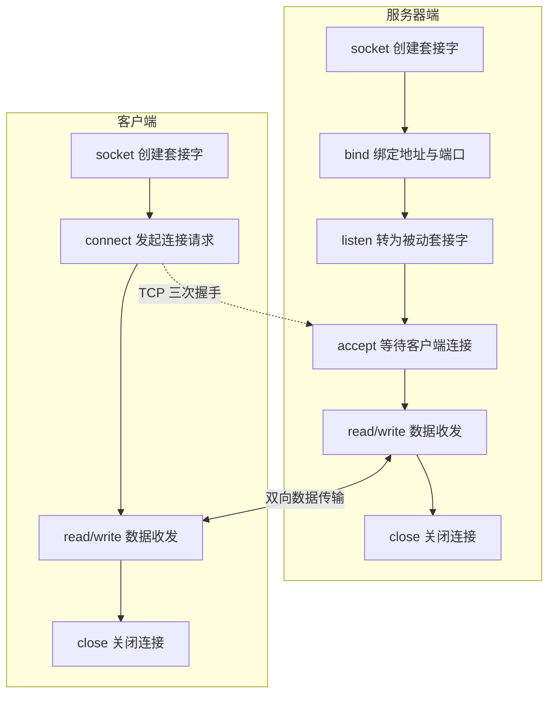
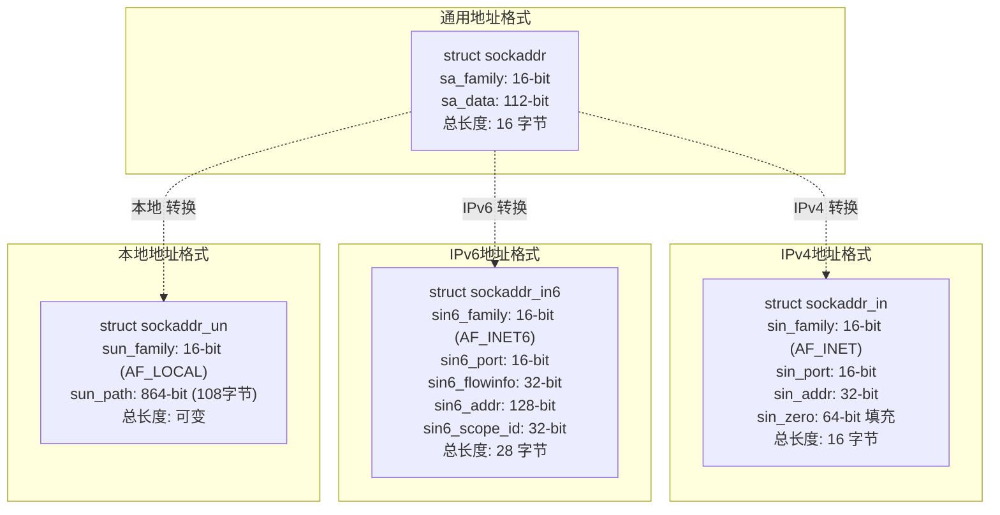

# 套接字与地址格式

在网络编程中，套接字（Socket）是最基础的核心概念。套接字是应用程序与操作系统内核网络协议栈之间的编程接口，所有网络通信操作——包括连接建立、数据收发、连接关闭——均通过套接字完成。

## 套接字的概念

### 套接字的定义

Socket 一词的原意为"插口"或"插槽"。在网络编程语境中，套接字是一种抽象的编程接口，它为应用程序提供了访问网络协议栈的统一入口。通过套接字，应用程序可以快速完成网络连接的建立与数据的收发。

套接字的概念最早由加州大学伯克利分校的研究人员在 20 世纪 80 年代初期提出，因此也称为伯克利套接字（Berkeley Socket）。其设计目标是屏蔽底层协议栈的差异，提供统一的网络编程接口。首个实现基于 TCP/IP 协议，在 BSD 4.2 Unix 内核上完成。随后，Linux 作为 Unix 的开源实现，从头实现了 TCP/IP 协议栈并完整支持套接字接口；Windows 也引入了 Winsock 以兼容套接字编程模型。如今，套接字已成为网络互联互通的标准编程接口。

### 套接字在网络编程中的角色

套接字贯穿网络通信的全生命周期。以下为客户端-服务器模型中套接字的使用流程：



服务器端首先初始化套接字，通过 `bind` 函数将套接字与一个众所周知的地址和端口绑定，然后执行 `listen` 操作将套接字转换为被动套接字，最终通过 `accept` 阻塞等待客户端连接请求。

客户端初始化套接字后，通过 `connect` 函数向服务器端的地址和端口发起连接请求，该过程即为 TCP 三次握手（Three-way Handshake）。

连接建立后进入数据传输阶段。客户端通过 `write` 操作将字节流写入内核，内核协议栈将数据通过网络设备传输至服务器端；服务器端从内核读取数据并进行业务处理，处理完成后以相同方式将结果返回客户端。**TCP 连接一旦建立，数据传输即为双向的，这是 TCP 的显著特性之一。**

当交互完成后，客户端执行 `close` 函数关闭连接，操作系统内核通过连接链路发送 FIN 包，服务器端收到后执行被动关闭，链路进入半关闭（Half-close）状态。此后服务器端也执行 `close` 函数，整个连接才完全关闭。在半关闭状态下，发起关闭请求的一方在未收到对端 FIN 包之前仍认为连接正常；在全关闭状态下，双方均感知连接已终止。

**套接字是网络编程中建立连接和传输数据的唯一途径。** 无论是客户端的 `connect`、服务器端的 `accept`，还是数据的读写操作，均通过套接字完成。

## 套接字地址格式

使用套接字进行网络通信时，首先需要解决通信双方的寻址问题。套接字地址格式定义了通信端点的标识方式，不同协议族对应不同的地址格式。

### 通用套接字地址格式

POSIX.1g 规范定义了通用的套接字地址结构：

```c
/* POSIX.1g 规范规定地址族为 2 字节值 */
typedef unsigned short int sa_family_t;

/* 通用套接字地址结构 */
struct sockaddr {
    sa_family_t sa_family;  /* 地址族，16-bit */
    char sa_data[14];       /* 地址数据，112-bit */
};
```

其中 `sa_family` 字段标识地址族（Address Family），决定地址数据的解释方式。glibc 中定义了多种地址族，常用的包括：

- `AF_LOCAL`（亦写作 `AF_UNIX`、`AF_FILE`）：本地地址，用于 Unix 域套接字，实现本地进程间通信
- `AF_INET`：IPv4 因特网地址
- `AF_INET6`：IPv6 因特网地址

`AF_` 前缀表示 Address Family（地址族），而 `PF_` 前缀表示 Protocol Family（协议族），如 `PF_INET`、`PF_INET6` 等。二者在 `<sys/socket.h>` 头文件中一一对应：`AF_xxx` 用于初始化套接字地址，`PF_xxx` 用于创建套接字（`socket` 函数的 `domain` 参数）。实际上，在 Linux 内核实现中，二者的值完全相同。

```c
/* 地址族与协议族的宏定义 */
#define AF_UNSPEC   PF_UNSPEC
#define AF_LOCAL    PF_LOCAL
#define AF_UNIX     PF_UNIX
#define AF_FILE     PF_FILE
#define AF_INET     PF_INET
#define AF_INET6    PF_INET6
```

定义通用地址结构的目的在于为 `bind`、`accept`、`connect` 等函数提供统一的参数类型。由于 BSD 套接字设计于 1982 年前后，当时的 C 语言尚不支持 `void *` 类型，因此设计了 `struct sockaddr` 作为通用地址格式。

### IPv4 套接字地址格式

IPv4 地址族对应的套接字地址结构如下：

```c
/* IPv4 地址，32-bit */
typedef uint32_t in_addr_t;
struct in_addr {
    in_addr_t s_addr;  /* 32-bit IPv4 地址 */
};

/* IPv4 套接字地址格式 */
struct sockaddr_in {
    sa_family_t sin_family;   /* 地址族，16-bit */
    in_port_t sin_port;       /* 端口号，16-bit */
    struct in_addr sin_addr;  /* IPv4 地址，32-bit */
    unsigned char sin_zero[8]; /* 填充字节，使结构体大小与 sockaddr 一致 */
};
```

该结构体各字段说明：

- `sin_family`：地址族，IPv4 取值为 `AF_INET`
- `sin_port`：端口号，16-bit 无符号整数，取值范围 0~65535。其中 0~1023 为知名端口（Well-known Port），需要 root 权限绑定；1024~49151 为注册端口（Registered Port）；49152~65535 为动态/临时端口（Dynamic/Ephemeral Port，自 RFC 6335 规范）
- `sin_addr`：32-bit IPv4 地址，最多支持 2^32（约 42 亿）个地址
- `sin_zero`：填充字段，不用于实际寻址，仅保证 `struct sockaddr_in` 与 `struct sockaddr` 大小一致

glibc 定义的保留端口枚举如下：

```c
/* Standard well-known ports */
enum {
    IPPORT_ECHO = 7,         /* Echo service */
    IPPORT_DISCARD = 9,      /* Discard service */
    IPPORT_SYSTAT = 11,      /* System status */
    IPPORT_DAYTIME = 13,     /* Time of day */
    IPPORT_NETSTAT = 15,     /* Network status */
    IPPORT_FTP = 21,         /* File Transfer Protocol */
    IPPORT_TELNET = 23,      /* Telnet protocol */
    IPPORT_SMTP = 25,        /* Simple Mail Transfer Protocol */
    IPPORT_TIMESERVER = 37,  /* Timeserver */
    IPPORT_NAMESERVER = 42,  /* Domain Name Service */
    IPPORT_WHOIS = 43,       /* Internet Whois */
    IPPORT_TFTP = 69,        /* Trivial File Transfer Protocol */
    IPPORT_FINGER = 79,      /* Finger service */

    IPPORT_RESERVED = 1024,  /* 特权端口上限 */
    IPPORT_USERRESERVED = 5000  /* 用户保留端口起始 */
};
```

### IPv6 套接字地址格式

IPv6 地址族对应的套接字地址结构如下：

```c
struct sockaddr_in6 {
    sa_family_t sin6_family;   /* 地址族，16-bit */
    in_port_t sin6_port;       /* 传输端口号，16-bit */
    uint32_t sin6_flowinfo;    /* IPv6 流控信息，32-bit */
    struct in6_addr sin6_addr; /* IPv6 地址，128-bit */
    uint32_t sin6_scope_id;    /* IPv6 作用域标识，32-bit */
};
```

该结构体总长度为 28 字节，各字段说明：

- `sin6_family`：地址族，IPv6 取值为 `AF_INET6`
- `sin6_port`：端口号，与 IPv4 相同，16-bit
- `sin6_flowinfo`：IPv6 流标签与流量类别信息（`sin6_flowinfo` 字段自 Linux 2.4 起支持）
- `sin6_addr`：128-bit IPv6 地址，地址空间为 2^128，彻底解决了 IPv4 地址不足的问题
- `sin6_scope_id`：IPv6 作用域标识，用于链路本地地址等场景（自 Linux 2.4 起支持）

### 本地套接字地址格式

本地套接字（Unix Domain Socket）用于同一主机上的进程间通信，其地址结构如下：

```c
struct sockaddr_un {
    unsigned short sun_family;  /* 固定为 AF_LOCAL */
    char sun_path[108];         /* 路径名 */
};
```

本地套接字不使用 IP 地址和端口号进行寻址，而是通过文件系统路径名标识通信端点。该路径名在文件系统中实际存在，连接关闭后需手动删除。

### 套接字地址格式比较



各地址格式的共性在于：

1. 首个字段均为 `sa_family_t` 类型的地址族标识，用于区分地址格式类型
2. 通用地址格式作为函数参数的统一类型，各具体格式通过强制类型转换传入
3. 函数实现通过读取前 2 字节判断地址族，再结合 `socklen_t` 参数确定地址的实际长度

**IPv4 和 IPv6 套接字地址结构的长度是固定的，而本地套接字地址结构的长度是可变的。** 函数调用时通过 `socklen_t` 参数传递实际地址长度，以支持可变长度的地址格式。

## 总结

本文重点阐述了套接字的概念及套接字地址格式。关键要点如下：

1. 套接字是应用程序访问网络协议栈的唯一编程接口，贯穿连接建立、数据传输、连接关闭的全过程。
2. 通用地址格式 `struct sockaddr` 为各类套接字 API 提供了统一的参数类型，各具体地址格式通过地址族字段和长度参数实现区分。
3. IPv4 地址为 32 位，IPv6 地址为 128 位，本地套接字通过文件系统路径名寻址。

## 思考题

1. IPv4、IPv6、本地套接字格式以及通用地址格式之间存在哪些共性？BSD 套接字的设计者为何采用这种设计？
2. 本地套接字格式不需要端口号，而 IPv4 和 IPv6 套接字格式却需要端口号，原因是什么？

## 版本信息

- 更新日期：2026-06-09
- 目标内核：Linux 7.0（stable）
- 参考标准：POSIX.1g、RFC 3493（IPv6 基本套接字接口）、RFC 6335（端口号分配）
