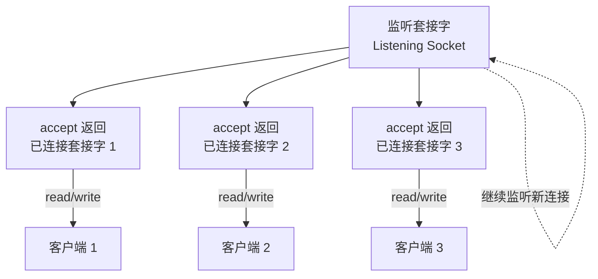
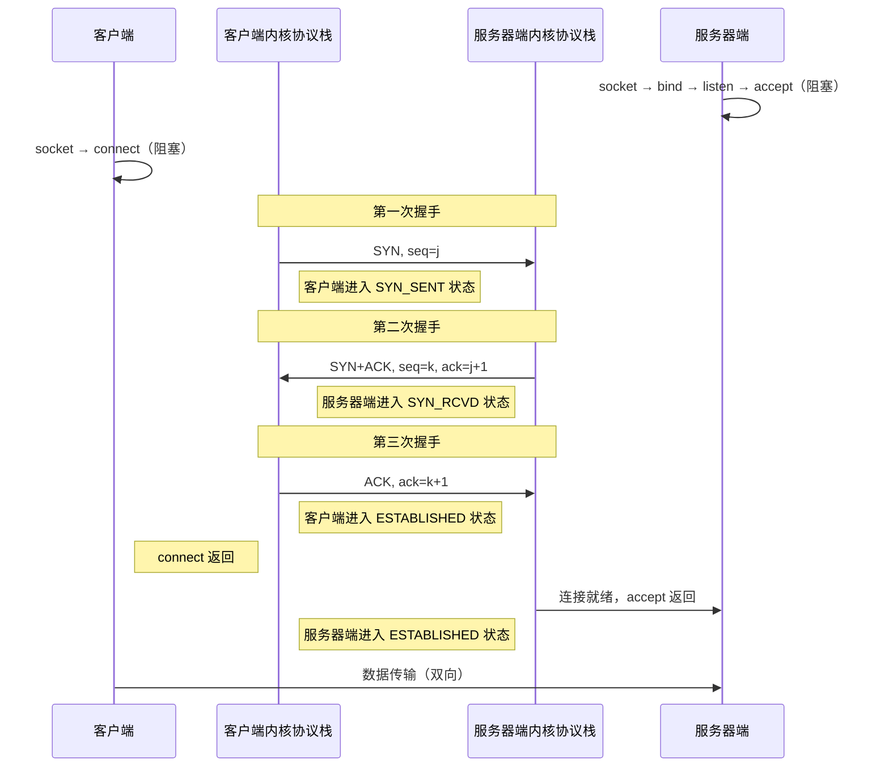
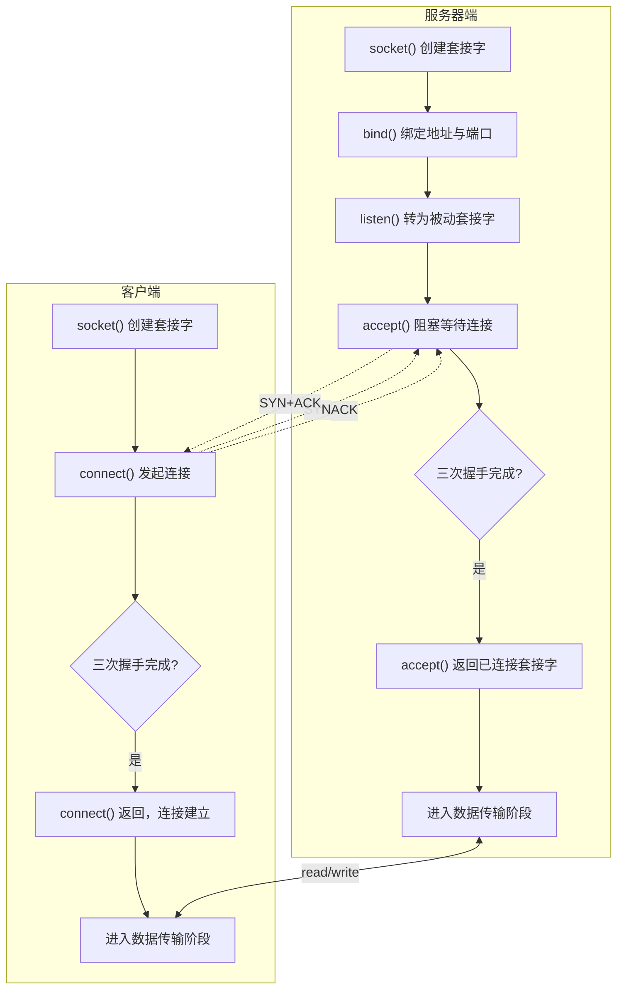

# TCP连接建立：套接字接口与三次握手

本文从服务器端和客户端两个视角，阐述如何使用套接字接口完成 TCP 连接的建立，并结合 TCP 三次握手（Three-way Handshake）的原理进行深入解析。

## 服务器端准备连接的过程

### 创建套接字

创建套接字使用 `socket` 函数：

```c
int socket(int domain, int type, int protocol);
```

**参数说明：**

- `domain`：协议族，常用值为 `PF_INET`（IPv4）、`PF_INET6`（IPv6）、`PF_LOCAL`（本地套接字）
- `type`：套接字类型，常用值为：
  - `SOCK_STREAM`：字节流套接字，对应 TCP
  - `SOCK_DGRAM`：数据报套接字，对应 UDP
  - `SOCK_RAW`：原始套接字
- `protocol`：协议编号，通常设为 0，由前两个参数隐式指定

**返回值：** 成功返回套接字描述符（非负整数），失败返回 -1 并设置 `errno`。

> **内核版本注记：** 自 Linux 2.6.27 起，`socket()` 支持 `SOCK_NONBLOCK` 和 `SOCK_CLOEXEC` 标志，可在创建时直接设置非阻塞模式和执行时关闭属性，无需额外调用 `fcntl`。

### bind：绑定地址与端口

创建的套接字需要通过 `bind` 函数与具体的套接字地址绑定，方可被其他进程访问：

```c
int bind(int fd, const struct sockaddr *addr, socklen_t len);
```

**参数说明：**

- `fd`：套接字描述符
- `addr`：指向套接字地址结构的指针，类型为通用地址格式 `struct sockaddr *`，实际传入的可能是 IPv4、IPv6 或本地套接字格式
- `len`：地址结构的长度

由于 BSD 套接字设计于 1982 年前后，当时 C 语言尚不支持 `void *`，因此设计了通用地址格式 `struct sockaddr` 作为函数参数类型。实际使用时，需将具体地址格式通过强制类型转换传入：

```c
struct sockaddr_in name;
bind(sock, (struct sockaddr *) &name, sizeof(name));
```

函数实现通过地址结构的前 2 字节判断地址族类型，再结合 `len` 参数解析地址内容。

**地址与端口的设置方式：**

- **通配地址（Wildcard Address）**：若将地址设置为 `INADDR_ANY`（IPv4）或 `in6addr_any`（IPv6），则表示绑定本机所有网络接口。例如一台机器有两个网卡（IP 分别为 202.61.22.55 和 192.168.1.11），设置通配地址后，到达任一 IP 的请求均会被该应用程序处理。

```c
struct sockaddr_in name;
name.sin_addr.s_addr = htonl(INADDR_ANY);  /* IPv4 通配地址 */
```

- **端口设置为 0**：将端口选择权交由操作系统内核，内核根据算法选择一个空闲端口完成绑定。服务器端通常不使用此方式，而是绑定到预定义的知名端口。

以下为初始化 IPv4 TCP 套接字的完整示例：

```c
#include <stdio.h>
#include <stdlib.h>
#include <sys/socket.h>
#include <netinet/in.h>

int make_socket(uint16_t port)
{
    int sock;
    struct sockaddr_in name;

    /* 创建字节流类型的 IPv4 套接字 */
    sock = socket(PF_INET, SOCK_STREAM, 0);
    if (sock < 0) {
        perror("socket");
        exit(EXIT_FAILURE);
    }

    /* 绑定到指定端口和通配地址 */
    name.sin_family = AF_INET;
    name.sin_port = htons(port);
    name.sin_addr.s_addr = htonl(INADDR_ANY);

    /* 将 IPv4 地址转换为通用地址格式并传递长度 */
    if (bind(sock, (struct sockaddr *) &name, sizeof(name)) < 0) {
        perror("bind");
        exit(EXIT_FAILURE);
    }

    return sock;
}
```

### listen：转换为被动套接字

`bind` 函数仅完成套接字与地址的关联，尚未使套接字进入可接受连接的状态。`listen` 函数将主动套接字转换为被动套接字，通知操作系统内核该套接字用于等待客户端连接请求：

```c
int listen(int socketfd, int backlog);
```

**参数说明：**

- `socketfd`：套接字描述符
- `backlog`：在 Linux 内核中，该参数表示已完成（ESTABLISHED）但尚未被 `accept` 取走的连接队列长度上限

> **内核版本注记：** Linux 2.2 之前，`backlog` 参数表示半连接队列（SYN_RCVD 状态）的长度；自 Linux 2.2 起，`backlog` 仅表示全连接队列（ESTABLISHED 状态）的长度，半连接队列长度由 `/proc/sys/net/ipv4/tcp_max_syn_backlog` 控制。

`backlog` 参数决定了服务器可瞬时接受的并发连接数，该值需根据实际负载合理设置。过大会占用过多系统资源，过小则可能导致连接被拒绝。实际的全连接队列最大长度还受 `/proc/sys/net/core/somaxconn` 的限制（原默认值为 128，自 Linux 5.4 起默认值调整为 4096）。

### accept：接受客户端连接

当客户端连接请求到达且三次握手完成后，操作系统内核通知应用程序通过 `accept` 函数获取已建立的连接：

```c
int accept(int listensockfd, struct sockaddr *cliaddr, socklen_t *addrlen);
```

**参数说明：**

- `listensockfd`：监听套接字描述符，即通过 `socket`、`bind`、`listen` 系列操作得到的套接字
- `cliaddr`：输出参数，返回客户端的地址信息
- `addrlen`：输入输出参数，传入时为 `cliaddr` 缓冲区大小，返回时为实际地址长度

**返回值：** 成功时返回一个新的已连接套接字描述符（Connected Socket），该描述符代表与客户端的连接；失败返回 -1。

> **内核版本注记：** 自 Linux 2.6.28 起，`accept4()` 系统调用可用，支持在接受连接时直接设置 `SOCK_NONBLOCK` 和 `SOCK_CLOEXEC` 标志。

此处需特别注意监听套接字与已连接套接字的区别：

- **监听套接字（Listening Socket）**：贯穿服务器生命周期，持续监听新的连接请求，为所有潜在客户端服务
- **已连接套接字（Connected Socket）**：由内核在三次握手完成后创建，专用于与特定客户端进行数据通信，服务完成后关闭

这种分离设计的根本原因在于网络程序的并发特性：服务器必须同时为多个客户端服务。若仅使用一个套接字，一旦某个连接占用了该套接字，其他客户端将无法建立新连接。通过监听套接字持续接受新连接，为每个已建立的连接分配独立的已连接套接字，服务器即可实现并发服务。



## 客户端发起连接的过程

客户端同样需要先创建套接字，然后通过 `connect` 函数向服务器端发起连接请求。

### connect：发起连接请求

```c
int connect(int sockfd, const struct sockaddr *servaddr, socklen_t addrlen);
```

**参数说明：**

- `sockfd`：套接字描述符
- `servaddr`：指向服务器端套接字地址结构的指针，必须包含服务器的 IP 地址和端口号
- `addrlen`：地址结构长度

客户端在调用 `connect` 前不必显式调用 `bind` 函数。若未绑定，内核将自动确定源 IP 地址并选择一个临时端口作为源端口。

对于 TCP 套接字，`connect` 调用将触发 TCP 三次握手过程，仅在连接建立成功或出错时返回。可能的错误情况包括：

1. **连接超时（ETIMEDOUT）**：客户端发出的 SYN 包未收到任何响应，通常原因是对端 IP 地址错误或网络不可达
2. **连接拒绝（ECONNREFUSED）**：客户端收到 RST（Reset）响应，常见原因是对端目标端口上没有正在监听的服务进程。产生 RST 的三种条件：
   - SYN 包到达某端口，但该端口无监听服务
   - TCP 需要取消已有连接
   - TCP 接收到不存在的连接上的分节
3. **目的不可达（EHOSTUNREACH / ENETUNREACH）**：SYN 包在网络上引发"destination unreachable"错误，通常原因是客户端与服务器端之间路由不通

## TCP 三次握手

TCP 三次握手是连接建立的核心过程，由操作系统内核网络协议栈自动完成。以下结合服务器端与客户端的套接字调用，详细解析三次握手的过程。

### 三次握手序列图



### 三次握手详细过程

初始状态下，服务器端通过 `socket`、`bind`、`listen` 完成被动套接字的准备工作，然后调用 `accept` 阻塞等待；客户端通过 `socket` 创建套接字后调用 `connect`，同样进入阻塞状态。后续过程由操作系统内核网络协议栈完成：

**第一次握手：** 客户端协议栈向服务器端发送 SYN 包，序号字段为 j，客户端进入 `SYN_SENT` 状态。

**第二次握手：** 服务器端协议栈收到 SYN 包后，发送 ACK 应答（确认号为 j+1）并同时发送自身 SYN 包（序号为 k），服务器端进入 `SYN_RCVD` 状态。

**第三次握手：** 客户端协议栈收到服务器端的 SYN+ACK 后，向服务器端发送 ACK 应答（确认号为 k+1），客户端进入 `ESTABLISHED` 状态，`connect` 调用返回。

当应答包到达服务器端后，服务器端协议栈进入 `ESTABLISHED` 状态，`accept` 调用返回，返回值为已连接套接字描述符。

三次握手的设计确保了通信双方均确认了对方的发送能力和接收能力，同时同步了初始序列号。这是 TCP 提供可靠传输服务的基础。

### 服务器端与客户端连接建立流程



## 总结

本文从服务器端和客户端两个角度，阐述了 TCP 连接建立过程中套接字接口的使用：

1. **服务器端**：通过 `socket` → `bind` → `listen` 完成初始化，通过 `accept` 接受连接并获取已连接套接字。
2. **客户端**：通过 `socket` → `connect` 发起连接建立请求。
3. **TCP 三次握手**由操作系统内核协议栈自动完成，确保通信双方同步初始序列号并确认彼此的收发能力。

监听套接字与已连接套接字的分离是服务器端并发处理的基础：监听套接字持续接受新连接，每个已连接套接字独立服务特定客户端。

## 思考题

1. 阻塞式套接字调用存在等待延迟，如何使用非阻塞式套接字接口？其适用场景是什么？
2. 客户端在调用 `connect` 之前，是否可以显式调用 `bind` 函数？这样做有什么效果？

## 版本信息

- 更新日期：2026-06-09
- 目标内核：Linux 7.0（stable）
- 参考标准：RFC 9293（TCP 协议规范，取代 RFC 793）、POSIX.1-2008
- 关键内核版本：Linux 2.2（backlog 语义变更）、Linux 2.6.27（socket 支持 SOCK_NONBLOCK）、Linux 2.6.28（accept4 系统调用）
