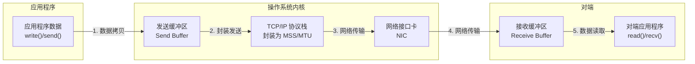
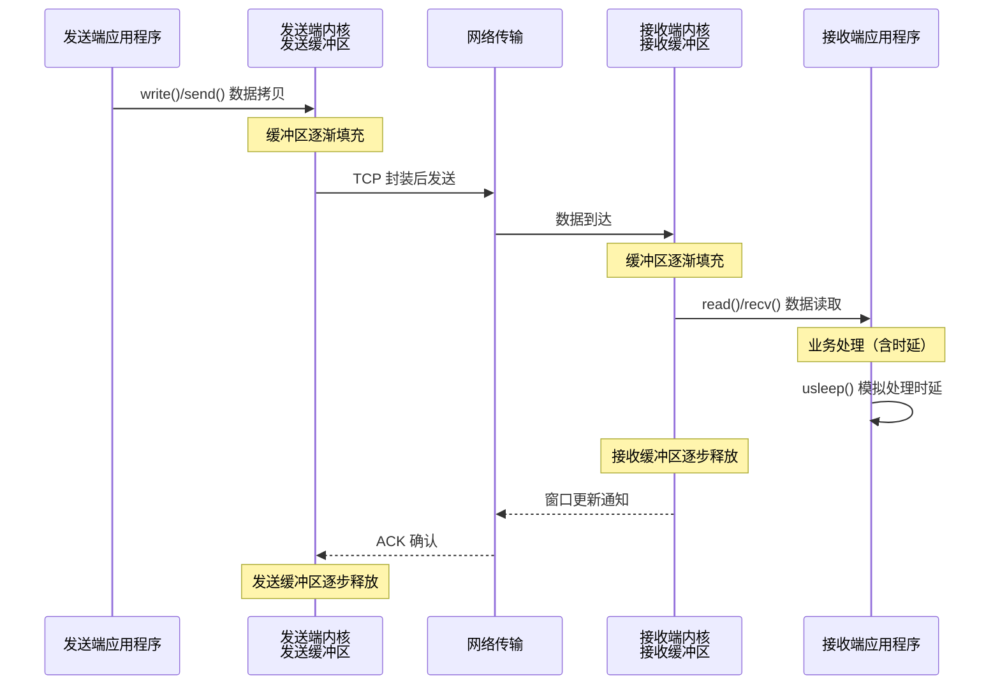

# 套接字数据读写与缓冲区机制

连接建立的根本目的是实现数据的可靠传输。本文详细阐述如何通过套接字接口进行数据收发，以及操作系统内核缓冲区（Buffer）在数据传输过程中的核心作用。

## 发送数据

TCP 套接字上发送数据常用的有三个函数：

```c
ssize_t write(int socketfd, const void *buffer, size_t size);
ssize_t send(int socketfd, const void *buffer, size_t size, int flags);
ssize_t sendmsg(int sockfd, const struct msghdr *msg, int flags);
```

三个函数的使用场景各不相同：

- `write`：通用文件写函数，将 `socketfd` 视为文件描述符进行写入操作
- `send`：在 `write` 基础上增加 `flags` 参数，支持发送带外数据（Out-of-band Data，OOB）等选项
- `sendmsg`：支持多重缓冲区（Scatter/Gather I/O）传输数据，通过 `msghdr` 结构体指定多个缓冲区

> **内核版本注记：** 自 Linux 4.14 起，`sendmsg` 支持 `MSG_ZEROCOPY` 标志，可实现零拷贝发送。自 Linux 5.1 起，`io_uring` 接口提供了异步发送机制。

### 套接字描述符与普通文件描述符的差异

套接字描述符与普通文件描述符均遵循 UNIX"万物皆文件"（Everything is a File）的设计哲学，可以传递给通用的 I/O 函数。然而，二者在写入行为上存在本质差异：

- **普通文件描述符**：`write` 调用返回的写入字节数通常等于请求的 `size`，否则表示出错
- **套接字描述符**：`write` 调用返回的写入字节数 **可能小于** 请求的 `size`，这是正常行为而非错误

产生这一差异的根本原因在于操作系统内核为套接字通信引入了发送缓冲区（Send Buffer）机制。

### 发送缓冲区

TCP 连接建立后，操作系统内核为每个连接创建配套的基础设施，其中最重要的就是发送缓冲区。

发送缓冲区的大小可通过 `SO_SNDBUF` 套接字选项查询和设置：

```c
int sndbuf_size;
socklen_t optlen = sizeof(sndbuf_size);
getsockopt(sockfd, SOL_SOCKET, SO_SNDBUF, &sndbuf_size, &optlen);
```

> **内核版本注记：** Linux 内核中发送缓冲区的默认值由 `/proc/sys/net/ipv4/tcp_wmem` 控制，该参数包含三个值：最小值、默认值和最大值。默认发送缓冲区大小为 16,384 字节（16 KB），最大值受 `/proc/sys/net/core/wmem_max` 限制。

当应用程序调用 `write` 函数时，实际操作是将数据 **从应用程序的用户空间拷贝到操作系统内核的发送缓冲区中**，而非直接通过网络发送。具体行为分为以下几种情况：

**情况一：** 发送缓冲区有足够空间容纳应用程序数据，`write` 调用立即返回，返回值等于请求写入的字节数。

**情况二：** 发送缓冲区空间不足以容纳全部应用程序数据（可能因为缓冲区中尚有未发送的数据，或缓冲区本身容量不足）。此时，对于阻塞式套接字，应用程序在 `write` 调用处阻塞，直到数据完全拷贝到发送缓冲区后才返回。

内核在 TCP 连接建立后持续运作：将发送缓冲区中的数据按照 TCP/IP 协议语义封装为 MSS（Maximum Segment Size）段和 MTU（Maximum Transmission Unit）帧，通过数据链路层发送出去。缓冲区空间因此逐步释放，应用程序的数据逐步被拷贝到缓冲区中，直至全部数据写入完成。

**关键结论：** `write` 返回成功仅表示数据已拷贝到内核发送缓冲区，并不意味着数据已发送到对端，更不意味着对端已接收。



## 读取数据

与发送数据对应，读取数据也遵循"万物皆文件"的设计原则，可以将套接字描述符传递给标准的文件读取函数。

### read 函数

`read` 函数的原型如下：

```c
ssize_t read(int socketfd, void *buffer, size_t size);
```

该函数请求操作系统内核从套接字描述符读取最多 `size` 个字节的数据，并将结果存储到 `buffer` 中。返回值含义如下：

- **返回值 > 0**：实际读取的字节数
- **返回值 = 0**：表示收到 EOF（End-of-File），对端已发送 FIN 包，连接关闭
- **返回值 = -1**：表示出错，需检查 `errno` 确定具体错误类型

> **内核版本注记：** 自 Linux 2.6.33 起，`recvmmsg()` 系统调用可用，支持一次调用接收多个消息，显著提升高并发场景下的接收性能。自 Linux 5.1 起，`io_uring` 提供了异步读取机制。

### 循环读取

`read` 函数返回的是"最多"读取 `size` 个字节，实际读取的字节数可能小于请求值。若应用程序需要确保每次读取恰好 `size` 个字节，必须编写循环读取逻辑：

```c
/* 从 socketfd 描述符中读取 size 个字节 */
size_t readn(int fd, void *buffer, size_t size) {
    char *buffer_pointer = buffer;
    int length = size;

    while (length > 0) {
        int result = read(fd, buffer_pointer, length);

        if (result < 0) {
            if (errno == EINTR)
                continue;     /* 被信号中断，重新调用 read */
            else
                return (-1);  /* 真正的错误 */
        } else if (result == 0)
            break;            /* EOF，对端关闭连接 */

        length -= result;
        buffer_pointer += result;
    }
    return (size - length);   /* 返回实际读取的字节数 */
}
```

该函数的关键处理逻辑：

1. 在未读满 `size` 个字节之前持续循环
2. `errno == EINTR` 表示读取被信号中断，需重新调用 `read`
3. 返回值为 0 表示对端发送 FIN 包（EOF），需跳出循环
4. 每次成功读取后更新剩余字节数和缓冲区指针

## 缓冲区机制实验

以下通过客户端-服务器端的实际程序，演示发送缓冲区与接收缓冲区的工作机制。客户端持续发送大量数据，服务器端每读取一段数据后休眠，模拟业务处理时延。

### 数据传输路径与缓冲区



### 服务器端读取数据程序

```c
#include "lib/common.h"

void read_data(int sockfd) {
    ssize_t n;
    char buf[1024];

    int time = 0;
    for (;;) {
        fprintf(stdout, "block in read\n");
        if ((n = readn(sockfd, buf, 1024)) == 0)
            return;

        time++;
        fprintf(stdout, "1K read for %d \n", time);
        usleep(1000);
    }
}

int main(int argc, char **argv) {
    int listenfd, connfd;
    socklen_t clilen;
    struct sockaddr_in cliaddr, servaddr;

    listenfd = socket(AF_INET, SOCK_STREAM, 0);

    bzero(&servaddr, sizeof(servaddr));
    servaddr.sin_family = AF_INET;
    servaddr.sin_addr.s_addr = htonl(INADDR_ANY);
    servaddr.sin_port = htons(12345);

    /* 绑定到本地地址，端口为 12345 */
    bind(listenfd, (struct sockaddr *) &servaddr, sizeof(servaddr));
    /* listen 的 backlog 为 1024 */
    listen(listenfd, 1024);

    /* 循环处理客户端请求 */
    for (;;) {
        clilen = sizeof(cliaddr);
        connfd = accept(listenfd, (struct sockaddr *) &cliaddr, &clilen);
        read_data(connfd);   /* 读取数据 */
        close(connfd);       /* 关闭已连接套接字（非监听套接字） */
    }
}
```

程序逻辑说明：

1. 依次创建套接字、绑定地址与端口、启动监听
2. 循环等待连接，通过 `accept` 获取已连接套接字
3. 每次读取 1 KB 数据后休眠 1 毫秒（`usleep(1000)`），模拟服务器端业务处理时延

### 客户端发送数据程序

```c
#include "lib/common.h"

#define MESSAGE_SIZE 102400

void send_data(int sockfd) {
    char *query;
    query = malloc(MESSAGE_SIZE + 1);
    for (int i = 0; i < MESSAGE_SIZE; i++) {
        query[i] = 'a';
    }
    query[MESSAGE_SIZE] = '\0';

    const char *cp;
    cp = query;
    size_t remaining = strlen(query);
    while (remaining) {
        int n_written = send(sockfd, cp, remaining, 0);
        fprintf(stdout, "send into buffer %d \n", n_written);
        if (n_written <= 0) {
            error(1, errno, "send failed");
            return;
        }
        remaining -= n_written;
        cp += n_written;
    }

    return;
}

int main(int argc, char **argv) {
    int sockfd;
    struct sockaddr_in servaddr;

    if (argc != 2)
        error(1, 0, "usage: tcpclient <IPaddress>");

    sockfd = socket(AF_INET, SOCK_STREAM, 0);

    bzero(&servaddr, sizeof(servaddr));
    servaddr.sin_family = AF_INET;
    servaddr.sin_port = htons(12345);
    inet_pton(AF_INET, argv[1], &servaddr.sin_addr);
    int connect_rt = connect(sockfd, (struct sockaddr *) &servaddr, sizeof(servaddr));
    if (connect_rt < 0) {
        error(1, errno, "connect failed");
    }
    send_data(sockfd);
    exit(0);
}
```

程序逻辑说明：

1. 创建套接字，调用 `connect` 向服务器端发起连接请求
2. 连接建立成功后，调用 `send_data` 发送数据
3. 初始化一个长度为 `MESSAGE_SIZE` 的字符串流
4. 通过循环调用 `send` 函数将全部数据发送出去

### 实验一：观察客户端数据发送行为

客户端程序发送大量字节流，运行后可观察到服务器端持续打印读取进度信息。客户端的全部字节流发送完毕后 `send` 调用才会全部返回，在此之前 `send` 一直处于阻塞状态。

**结论：** 阻塞式套接字最终发送返回的实际写入字节数与请求字节数相等。

### 实验二：服务器端处理变慢

将服务器端休眠时间调大，同时调大客户端发送数据量（如将 `MESSAGE_SIZE` 由 102400 调整为 1024000），再次运行实验。可观察到客户端很快打印完成信息，而服务器端仍在持续读取缓冲区中的数据。

**结论：** 发送成功仅表示数据已从应用程序拷贝到内核发送缓冲区，并不意味着对端已收到数据。数据何时到达对端接收缓冲区、何时被对端应用程序读取，对发送端而言完全透明。

## 数据传输的完整路径

从应用程序发送端到应用程序接收端，一段数据流经过的完整路径如下：

```mermaid
flowchart TD
    subgraph 发送端主机
        A1["1. 应用程序缓冲区<br/>用户空间"] -->|write()/send()<br/>系统调用| A2["2. 内核发送缓冲区<br/>内核空间"]
        A2 -->|TCP 封装| A3["3. TCP/IP 协议栈<br/>封装为 MSS 段"]
        A3 --> A4["4. 网络设备驱动<br/>封装为 MTU 帧"]
    end
    subgraph 网络传输
        A4 -->|物理链路| B1["5. 网络中继设备<br/>路由器/交换机"]
    end
    subgraph 接收端主机
        B1 --> B2["6. 网络设备驱动<br/>解封装"]
        B2 --> B3["7. TCP/IP 协议栈<br/>重组与确认"]
        B3 --> B4["8. 内核接收缓冲区<br/>内核空间"]
        B4 -->|read()/recv()<br/>系统调用| B5["9. 应用程序缓冲区<br/>用户空间"]
    end
```

在此路径中，数据至少经历了以下拷贝操作：

1. 应用程序缓冲区 → 内核发送缓冲区（`write` 系统调用触发）
2. 内核发送缓冲区 → 网络设备（DMA 传输，由内核协议栈触发）
3. 网络设备 → 内核接收缓冲区（DMA 传输，由网卡驱动触发）
4. 内核接收缓冲区 → 应用程序缓冲区（`read` 系统调用触发）

若使用 `MSG_ZEROCOPY` 标志（自 Linux 4.14 起可用），步骤 1 可避免数据拷贝，直接将应用程序内存页注册给内核使用。

## 总结

本文重点阐述了套接字数据读写与缓冲区机制，关键要点如下：

1. **发送端**：`write`/`send` 返回成功仅表示数据已拷贝到内核发送缓冲区，并不表示对端已成功接收。
2. **接收端**：`read` 函数返回的实际字节数可能小于请求值，需要通过循环读取确保读取完整数据，同时需正确处理 EOF（对端关闭连接）和 `EINTR`（被信号中断）等异常条件。
3. **缓冲区机制**：发送缓冲区和接收缓冲区是 TCP 数据传输的核心基础设施，内核协议栈异步地完成数据的封装、传输与确认，应用程序通过系统调用与缓冲区交互。

## 思考题

1. 既然缓冲区如此重要，是否可以将缓冲区设置得足够大以提高应用程序的吞吐量？这种方法是否可行？需要考虑哪些限制因素？
2. 一段数据流从应用程序发送端到应用程序接收端，总共经历了多少次数据拷贝？使用零拷贝技术后又如何？

## 版本信息

- 更新日期：2026-06-09
- 目标内核：Linux 7.0（stable）
- 参考标准：RFC 9293（TCP 协议规范，取代 RFC 793）、POSIX.1-2008
- 关键内核版本：Linux 4.14（MSG_ZEROCOPY 初始支持）、Linux 2.6.33（recvmmsg）、Linux 5.1（io_uring 异步 I/O）
