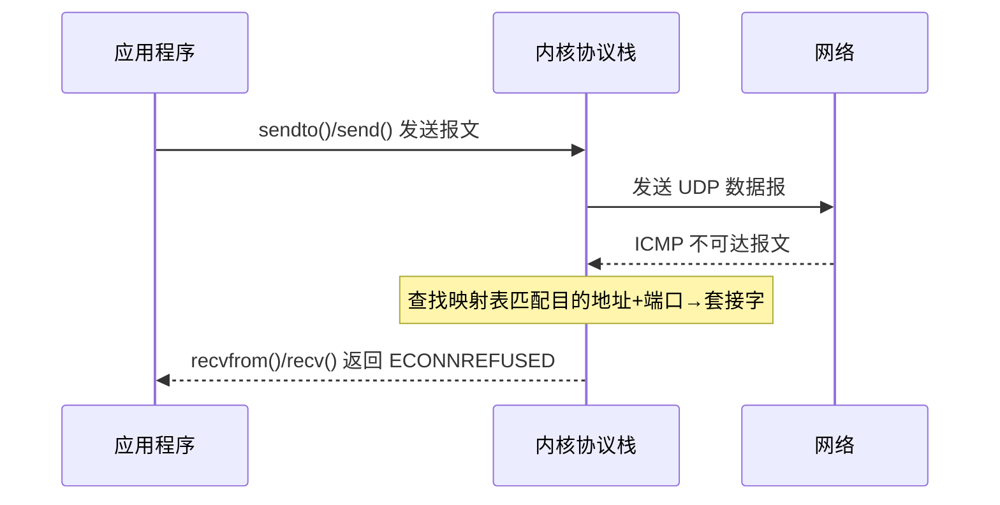

# UDP协议与套接字编程：数据报、已连接套接字与性能优化

UDP（User Datagram Protocol，用户数据报协议）是一种无连接的传输层协议，常用于对实时性要求高、可容忍少量丢包的场景。本文整合 UDP 编程的完整知识：协议特性、数据报套接字编程（`recvfrom`/`sendto`）、以及"已连接 UDP 套接字"（`connect()` 调用）的原理与性能优化。

## 第一部分 UDP 协议基础

### 1. UDP 与 TCP 协议对比

| 特性 | TCP | UDP |
|------|-----|-----|
| 连接方式 | 面向连接 | 无连接 |
| 传输单元 | 字节流（Byte Stream） | 数据报（Datagram） |
| 可靠性 | 保证数据可靠传输 | 不保证数据到达 |
| 有序性 | 保证数据顺序 | 不保证数据顺序 |
| 流量控制 | 具备滑动窗口机制 | 无流量控制 |
| 拥塞控制 | 具备拥塞控制算法 | 无拥塞控制 |
| 首部开销 | 20 字节 | 8 字节 |
| 上下文 | 维护连接状态 | 无连接状态 |

**通信模型**：TCP 类似电话通话（建立连接后确定上下文双向传输）；UDP 类似明信片投递（发送即离开，每个报文独立、可能乱序、可能丢失）。

### 2. UDP 的应用场景

- **DNS 服务**：域名解析对时延敏感，单次请求-响应无需建立连接；
- **SNMP 服务**：网络管理协议，允许少量丢包；
- **实时音视频传输**：视频会议、直播，优先保证实时性而非完整性；
- **多人在线游戏**：游戏状态同步，允许少量状态丢失；
- **IoT 设备通信**：资源受限设备，UDP 开销更小。

## 第二部分 UDP 数据报套接字编程

### 3. 核心函数：recvfrom 与 sendto

```c
ssize_t recvfrom(int sockfd, void *buff, size_t nbytes, int flags,
                 struct sockaddr *from, socklen_t *addrlen);
ssize_t sendto(int sockfd, const void *buff, size_t nbytes, int flags,
               const struct sockaddr *to, socklen_t addrlen);
```

- `recvfrom`：`from` 输出返回发送方地址，`addrlen` 输入输出地址长度；
- `sendto`：`to` 指定目标地址，`addrlen` 地址长度。

> 与 TCP 不同，UDP 每次调用 `recvfrom()` 都获取对端地址，体现数据报的无上下文特性。POSIX 标准定义，Linux 2.6+ 完全支持。

### 4. UDP 服务器端实现

```c
#include "lib/common.h"
static int count;
static void recvfrom_int(int signo) {
    printf("\nreceived %d datagrams\n", count);
    exit(0);
}

int main(int argc, char **argv) {
    int socket_fd = socket(AF_INET, SOCK_DGRAM, 0);   // SOCK_DGRAM 数据报套接字
    struct sockaddr_in server_addr;
    bzero(&server_addr, sizeof(server_addr));
    server_addr.sin_family = AF_INET;
    server_addr.sin_addr.s_addr = htonl(INADDR_ANY);
    server_addr.sin_port = htons(SERV_PORT);
    bind(socket_fd, (struct sockaddr *) &server_addr, sizeof(server_addr));

    signal(SIGINT, recvfrom_int);
    struct sockaddr_in client_addr;
    socklen_t client_len = sizeof(client_addr);
    for (;;) {
        int n = recvfrom(socket_fd, message, MAXLINE, 0,
                         (struct sockaddr *) &client_addr, &client_len);
        message[n] = 0;
        printf("received %d bytes: %s\n", n, message);
        char send_line[MAXLINE];
        sprintf(send_line, "Hi, %s", message);
        sendto(socket_fd, send_line, strlen(send_line), 0,
               (struct sockaddr *) &client_addr, client_len);
        count++;
    }
}
```

**要点**：使用 `SOCK_DGRAM` 创建数据报套接字；绑定地址；**无需 `listen()` 和 `accept()`**；注册 `SIGINT` 统计接收总数。

### 5. UDP 客户端实现

```c
int socket_fd = socket(AF_INET, SOCK_DGRAM, 0);
struct sockaddr_in server_addr;
bzero(&server_addr, sizeof(server_addr));
server_addr.sin_family = AF_INET;
server_addr.sin_port = htons(SERV_PORT);
inet_pton(AF_INET, argv[1], &server_addr.sin_addr);
socklen_t server_len = sizeof(server_addr);

while (fgets(send_line, MAXLINE, stdin) != NULL) {
    // 去掉末尾换行
    size_t rt = sendto(socket_fd, send_line, strlen(send_line), 0,
                       (struct sockaddr *) &server_addr, server_len);
    len = 0;
    n = recvfrom(socket_fd, recv_line, MAXLINE, 0, reply_addr, &len);
    recv_line[n] = 0;
    fputs(recv_line, stdout);
}
```

**要点**：创建 `SOCK_DGRAM` 套接字；初始化目标地址；**无连接过程，直接 `sendto()`**；请求-响应模式。

### 6. 运行场景与关键技术

**场景一：仅启动客户端**——服务器未启动时，客户端发送后阻塞在 `recvfrom()`。与 TCP 不同（TCP 的 `connect()` 会立即返回 "Connection refused"），UDP 无连接、无法感知服务器状态。

**场景二/三：多客户端并发**——UDP 服务器可同时处理多客户端，无需为每客户端建连接；服务器重启后可立即接收新报文（无状态特性）。

**关键技术要点**：
- **无连接特性**：无三次握手、无需 listen/accept，每数据报独立处理；
- **数据报边界保留**：一次 `sendto()` 对应一次 `recvfrom()`，与 TCP 字节流的粘包/拆包形成对比；
- **阻塞与非阻塞**：默认 `recvfrom()` 阻塞，可用 `fcntl(..., O_NONBLOCK)` 设置非阻塞；
- **数据报大小限制**：以太网 MTU 通常 1500，扣除 IP 头（20）和 UDP 头（8），**有效载荷最大 1472 字节**，超过会被 IP 层分片增加丢包风险。

## 第三部分 已连接 UDP 套接字

### 7. 什么是"已连接" UDP 套接字

虽然 UDP 是无连接协议，但 UDP 套接字可通过 `connect()` 与对端地址建立关联，即"已连接 UDP 套接字"（Connected UDP Socket）。这里的 `connect()` 语义更接近 `setpeername`——**不触发网络交互、不发送握手报文，仅在内核中建立"套接字 ↔ 目的地址+端口"的映射关系**。

```c
// 对 UDP 套接字调用 connect
if (connect(socket_fd, (struct sockaddr *) &server_addr, server_len)) {
    error(1, errno, "connect failed");
}
```

### 8. connect 的核心作用：接收异步错误

UDP `connect()` 的核心作用是**使应用程序能够接收异步错误（Asynchronous Error）信息**：



1. 应用程序发送报文，内核尝试发送到目标地址；
2. 目标不可达时，网络返回 ICMP 报文（含目的地址和端口）；
3. **未 connect**：内核无法将 ICMP 与特定 UDP 套接字关联，应用无法感知（只会阻塞等待）；
4. **已 connect**：内核从映射表定位到对应套接字，应用下次调用 `recv()`/`recvfrom()` 时收到 "Connection refused"。

> 关键现象：UDP 本是无连接协议，但已 connect 的 UDP 客户端在服务器未启动时会收到 `Connection refused` 错误——这正是 connect 的效果。

### 9. 收发函数的选择

对 UDP 套接字 `connect()` 后：

- **推荐做法**：用 `send()`/`write()` 发送、`recv()`/`read()` 接收；若用 `sendto()` 需将目标地址置零、`recvfrom()` 需将源地址置零；
- **Linux 行为**（4.4+，含 7.0）：自动忽略 to/from 地址信息；
- **macOS 行为**：需严格遵守推荐做法，否则可能异常。

出于跨平台兼容性，推荐遵循常规做法。

### 10. 服务器端 connect 场景

一般服务器端不会主动 connect（一旦连接只能与一个客户端通信），但特定场景（服务器仅需服务唯一客户端）可用。示例：服务器 `recvfrom()` 获取客户端地址后 `connect()` 绑定该客户端，后续用 `send()`/`recv()` 通信；此时其他客户端（客户端2）的报文被拒绝，返回 `Connection refused`。

### 11. 性能优化

未 connect 时每次发送需"连接套接字 → 发送 → 断开 → 重新连接"（每次需查找路由表等内核操作）；connect 后只需"连接一次 → 多次发送 → 最后断开"，**减少重复的路由查找内核开销**，获得性能提升。

> **内核版本**：Linux 2.6.33 引入 `recvmmsg()`、Linux 3.0 引入 `sendmmsg()`，支持批量收发 UDP 报文；Linux 7.0 中 UDP 的 GRO/GSO 支持更完善，配合 connect 使用效果更佳。

### 12. 已连接 vs 未连接 UDP 套接字

| 维度 | 未连接 | 已连接 |
|------|--------|--------|
| 对端映射 | 无，每次发送指定地址 | connect 建立映射 |
| 收发函数 | sendto/recvfrom | send/recv（更简洁） |
| ICMP 异步错误 | 无法感知 | 可接收（Connection refused） |
| 性能 | 每次发送查找路由 | 减少重复查找，性能更优 |
| 适用 | 与多变对端通信（服务器） | 固定对端（客户端、单对端服务器） |

## 总结

- **UDP 特性**：无连接、数据报、不保证可靠/有序/流量控制，首部 8 字节，适用于实时性要求高、可容忍丢包的场景；
- **数据报编程**：`SOCK_DGRAM` + `recvfrom()`/`sendto()`，无需 listen/accept，保留数据报边界（单次 sendto 对应单次 recvfrom），有效载荷上限 1472 字节（以太网 MTU）；
- **已连接 UDP**：`connect()` 建立"套接字 ↔ 对端地址"映射（不触发握手），核心作用是**接收 ICMP 异步错误**（如 Connection refused），并能**减少重复路由查找提升性能**、用 send/recv 简化代码；
- 服务器端 connect 后只能与唯一客户端通信，适用于单对端场景。

## 思考题

1. 仅启动客户端时 `recvfrom()` 长期阻塞，应如何优化处理？
2. UDP 请求-响应模式中数据报的最大有效载荷是多少？如何确定最优大小？
3. 是否可以对一个 UDP 套接字进行多次 `connect()` 操作？请动手验证。
4. 多播（Multicast）或广播（Broadcast）场景下应如何使用 `connect()`？

## 版本信息

| 项目 | 说明 |
|------|------|
| 更新日期 | 2026-06-09 |
| 目标内核 | Linux 7.0 |
| 关键 API | `recvfrom`/`sendto`/`connect` (POSIX.1-2008, SUSv4); `O_NONBLOCK` (Linux 2.6+); `recvmmsg` (Linux 2.6.33+)/`sendmmsg` (Linux 3.0+) |
| 备注 | Linux 7.0 中 UDP 的 GRO/GSO 支持完善，配合 connect 使用效果更佳 |

---
