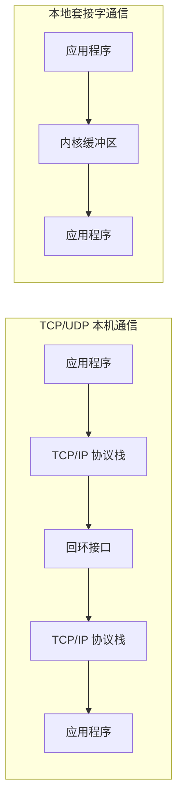
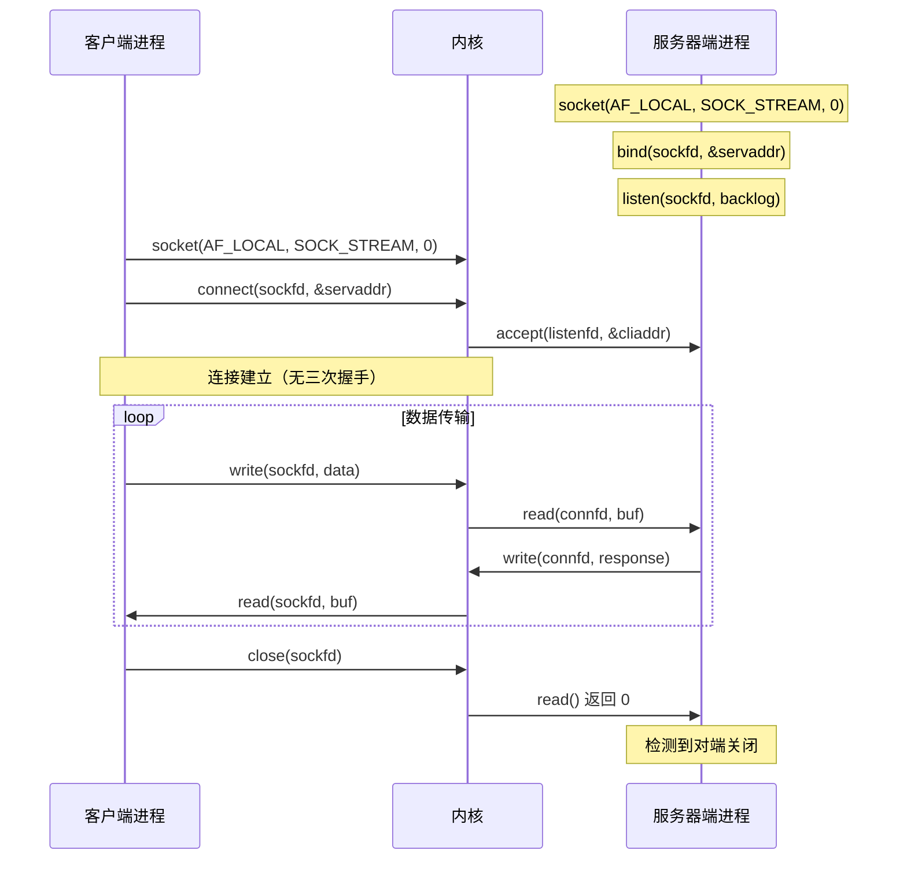

# 本地套接字（UNIX域套接字）

本文介绍本地套接字（Local Socket），也称 UNIX 域套接字（UNIX Domain Socket）的编程方法，分析其在进程间通信（IPC，Inter-Process Communication）中的应用，并对比字节流与数据报两种本地套接字的实现差异。

## 本地套接字概述

### 定义与定位

本地套接字是 IPC 的一种实现方式。除本地套接字外，管道（Pipe）、共享内存（Shared Memory）、消息队列（Message Queue）等也是进程间通信的常用机制。本地套接字因其开发便捷、接口与网络套接字一致而被广泛采用。

### 与 TCP/UDP 套接字的核心差异

TCP/UDP 套接字即使在本机通信，数据仍需经过完整的网络协议栈。而本地套接字严格意义上提供的是单主机跨进程调用机制，绕过了网络协议栈的大部分处理，因此效率显著高于 TCP/UDP 套接字。



### 性能对比

| 指标 | TCP 回环 | UDP 回环 | 本地字节流套接字 | 本地数据报套接字 |
|------|----------|----------|-----------------|-----------------|
| 吞吐量 | 中 | 中 | 高 | 高 |
| 延迟 | 较高 | 较低 | 低 | 低 |
| 协议栈开销 | 完整 | 完整 | 最小 | 最小 |
| CPU 占用 | 较高 | 中 | 低 | 低 |
| 连接建立 | 需三次握手 | 无需连接 | 无需三次握手 | 无需连接 |

### 典型应用

本地套接字在现代系统中应用广泛：

- **Docker**：通过 `/var/run/docker.sock` 提供 Docker 守护进程的 API 接口
- **Kubernetes**：kubelet 通过本地套接字与容器运行时（CRI，Container Runtime Interface）通信
- **X Window System**：本地连接使用本地套接字提升效率
- **systemd**：通过本地套接字与各服务通信
- **MySQL/PostgreSQL**：本地连接优先使用本地套接字

## 本地套接字通信流程



## 本地字节流套接字

### 服务器端实现

```c
#include "lib/common.h"

int main(int argc, char **argv) {
    if (argc != 2) {
        error(1, 0, "usage: unixstreamserver <local_path>");
    }

    int listenfd, connfd;
    socklen_t clilen;
    struct sockaddr_un cliaddr, servaddr;

    listenfd = socket(AF_LOCAL, SOCK_STREAM, 0);
    if (listenfd < 0) {
        error(1, errno, "socket create failed");
    }

    char *local_path = argv[1];
    unlink(local_path);
    bzero(&servaddr, sizeof(servaddr));
    servaddr.sun_family = AF_LOCAL;
    strcpy(servaddr.sun_path, local_path);

    if (bind(listenfd, (struct sockaddr *) &servaddr, sizeof(servaddr)) < 0) {
        error(1, errno, "bind failed");
    }

    if (listen(listenfd, LISTENQ) < 0) {
        error(1, errno, "listen failed");
    }

    clilen = sizeof(cliaddr);
    if ((connfd = accept(listenfd, (struct sockaddr *) &cliaddr, &clilen)) < 0) {
        if (errno == EINTR)
            error(1, errno, "accept failed");
        else
            error(1, errno, "accept failed");
    }

    char buf[BUFFER_SIZE];

    while (1) {
        bzero(buf, sizeof(buf));
        if (read(connfd, buf, BUFFER_SIZE) == 0) {
            printf("client quit");
            break;
        }
        printf("Receive: %s", buf);

        char send_line[MAXLINE];
        sprintf(send_line, "Hi, %s", buf);

        int nbytes = sizeof(send_line);

        if (write(connfd, send_line, nbytes) != nbytes)
            error(1, errno, "write error");
    }

    close(listenfd);
    close(connfd);

    exit(0);
}
```

**代码要点说明**：

1. **套接字类型**：使用 `AF_LOCAL`（等同于 `AF_UNIX`）地址族与 `SOCK_STREAM` 字节流类型
2. **地址结构**：使用 `sockaddr_un` 结构体，`sun_family` 设置为 `AF_LOCAL`，`sun_path` 设置为本地文件路径
3. **文件清理**：调用 `unlink()` 删除已有文件，保证幂等性
4. **连接模式**：与 TCP 一样使用 `bind()`、`listen()`、`accept()` 流程，但无三次握手
5. **数据传输**：使用 `read()` / `write()` 进行字节流读写

> **内核版本说明**：`AF_LOCAL` 和 `AF_UNIX` 在 Linux 内核中完全等价，自 Linux 2.6 起稳定支持，Linux 7.0 中保持一致。

### 客户端实现

```c
#include "lib/common.h"

int main(int argc, char **argv) {
    if (argc != 2) {
        error(1, 0, "usage: unixstreamclient <local_path>");
    }

    int sockfd;
    struct sockaddr_un servaddr;

    sockfd = socket(AF_LOCAL, SOCK_STREAM, 0);
    if (sockfd < 0) {
        error(1, errno, "create socket failed");
    }

    bzero(&servaddr, sizeof(servaddr));
    servaddr.sun_family = AF_LOCAL;
    strcpy(servaddr.sun_path, argv[1]);

    if (connect(sockfd, (struct sockaddr *) &servaddr, sizeof(servaddr)) < 0) {
        error(1, errno, "connect failed");
    }

    char send_line[MAXLINE];
    bzero(send_line, MAXLINE);
    char recv_line[MAXLINE];

    while (fgets(send_line, MAXLINE, stdin) != NULL) {
        int nbytes = sizeof(send_line);
        if (write(sockfd, send_line, nbytes) != nbytes)
            error(1, errno, "write error");

        if (read(sockfd, recv_line, MAXLINE) == 0)
            error(1, errno, "server terminated prematurely");

        fputs(recv_line, stdout);
    }

    exit(0);
}
```

**代码要点说明**：

1. **目标地址**：使用文件路径替代 IP 地址和端口号
2. **连接过程**：调用 `connect()` 发起连接，但不会进行 TCP 三次握手
3. **数据交互**：与 TCP 客户端一致的 `read()` / `write()` 模式

### 本地文件路径规范

| 规则 | 说明 |
|------|------|
| 必须使用绝对路径 | 保证程序在任何目录下均可正确启动 |
| 路径不能是目录 | bind 操作需要创建套接字文件 |
| 权限要求 | 启动用户必须对目标目录具有写权限 |
| 自动创建 | bind 时若文件不存在，将自动创建 |

## 本地数据报套接字

### 服务器端实现

```c
#include "lib/common.h"

int main(int argc, char **argv) {
    if (argc != 2) {
        error(1, 0, "usage: unixdataserver <local_path>");
    }

    int socket_fd;
    socket_fd = socket(AF_LOCAL, SOCK_DGRAM, 0);
    if (socket_fd < 0) {
        error(1, errno, "socket create failed");
    }

    struct sockaddr_un servaddr;
    char *local_path = argv[1];
    unlink(local_path);
    bzero(&servaddr, sizeof(servaddr));
    servaddr.sun_family = AF_LOCAL;
    strcpy(servaddr.sun_path, local_path);

    if (bind(socket_fd, (struct sockaddr *) &servaddr, sizeof(servaddr)) < 0) {
        error(1, errno, "bind failed");
    }

    char buf[BUFFER_SIZE];
    struct sockaddr_un client_addr;
    socklen_t client_len = sizeof(client_addr);
    while (1) {
        bzero(buf, sizeof(buf));
        if (recvfrom(socket_fd, buf, BUFFER_SIZE, 0,
                     (struct sockaddr *) &client_addr, &client_len) == 0) {
            printf("client quit");
            break;
        }
        printf("Receive: %s \n", buf);

        char send_line[MAXLINE];
        bzero(send_line, MAXLINE);
        sprintf(send_line, "Hi, %s", buf);

        size_t nbytes = strlen(send_line);
        printf("now sending: %s \n", send_line);

        if (sendto(socket_fd, send_line, nbytes, 0,
                   (struct sockaddr *) &client_addr, client_len) != nbytes)
            error(1, errno, "sendto error");
    }

    close(socket_fd);

    exit(0);
}
```

**代码要点说明**：

1. **套接字类型**：使用 `AF_LOCAL` 地址族与 `SOCK_DGRAM` 数据报类型
2. **无 listen/accept**：与 UDP 一致，绑定后直接接收数据报
3. **数据收发**：使用 `recvfrom()` / `sendto()` 进行数据报传输

### 客户端实现

```c
#include "lib/common.h"

int main(int argc, char **argv) {
    if (argc != 2) {
        error(1, 0, "usage: unixdataclient <local_path>");
    }

    int sockfd;
    struct sockaddr_un client_addr, server_addr;

    sockfd = socket(AF_LOCAL, SOCK_DGRAM, 0);
    if (sockfd < 0) {
        error(1, errno, "create socket failed");
    }

    bzero(&client_addr, sizeof(client_addr));
    client_addr.sun_family = AF_LOCAL;
    strcpy(client_addr.sun_path, tmpnam(NULL));

    if (bind(sockfd, (struct sockaddr *) &client_addr, sizeof(client_addr)) < 0) {
        error(1, errno, "bind failed");
    }

    bzero(&server_addr, sizeof(server_addr));
    server_addr.sun_family = AF_LOCAL;
    strcpy(server_addr.sun_path, argv[1]);

    char send_line[MAXLINE];
    bzero(send_line, MAXLINE);
    char recv_line[MAXLINE];

    while (fgets(send_line, MAXLINE, stdin) != NULL) {
        int i = strlen(send_line);
        if (send_line[i - 1] == '\n') {
            send_line[i - 1] = 0;
        }
        size_t nbytes = strlen(send_line);
        printf("now sending %s \n", send_line);

        if (sendto(sockfd, send_line, nbytes, 0,
                   (struct sockaddr *) &server_addr, sizeof(server_addr)) != nbytes)
            error(1, errno, "sendto error");

        int n = recvfrom(sockfd, recv_line, MAXLINE, 0, NULL, NULL);
        recv_line[n] = 0;

        fputs(recv_line, stdout);
        fputs("\n", stdout);
    }

    exit(0);
}
```

**关键差异说明**：本地数据报客户端必须调用 `bind()` 绑定本地路径，这与 UDP 客户端不同。原因是本地套接字使用文件路径寻址，服务器端回送响应时需要通过该路径找到客户端。而 UDP 可通过 IP 地址和端口自动匹配。

## 运行场景分析

### 场景一：仅启动客户端

```
$ ./unixstreamclient /tmp/unixstream.sock
connect failed: No such file or directory (2)
```

服务器端未启动时，套接字文件不存在，客户端连接立即失败。

### 场景二：服务器端权限不足

```
$ ./unixstreamserver /var/lib/unixstream.sock
bind failed: Permission denied (13)
```

使用 root 用户启动后正常运行，`bind()` 自动创建套接字文件：

```
$ ls -al /var/lib/unixstream.sock
srwxr-xr-x 1 root root 0 Jul 15 12:41 /var/lib/unixstream.sock=
```

### 场景三：正常通信

服务器端：

```
$ ./unixstreamserver /tmp/unixstream.sock
Receive: g1
Receive: g2
Receive: g3
client quit
```

客户端：

```
$ ./unixstreamclient /tmp/unixstream.sock
g1
Hi, g1
g2
Hi, g2
g3
Hi, g3
^C
```

## 本地套接字与网络套接字对比

| 对比项 | TCP 套接字 | UDP 套接字 | 本地字节流 | 本地数据报 |
|--------|-----------|-----------|-----------|-----------|
| 地址族 | AF_INET | AF_INET | AF_LOCAL | AF_LOCAL |
| 地址类型 | IP:Port | IP:Port | 文件路径 | 文件路径 |
| 连接建立 | 三次握手 | 无 | 无三次握手 | 无 |
| 流量控制 | 有 | 无 | 有 | 无 |
| 协议栈开销 | 完整 | 完整 | 最小 | 最小 |
| 跨主机通信 | 支持 | 支持 | 不支持 | 不支持 |

## 总结

本文介绍了本地套接字的编程方法，要点如下：

- 本地套接字编程接口与 IPv4/IPv6 套接字一致，支持字节流和数据报两种模式
- 本地套接字通过文件路径寻址，绕过网络协议栈，效率显著高于 TCP/UDP 回环通信
- 本地数据报客户端必须绑定本地路径，以便服务器端回送响应
- 本地套接字文件路径须使用绝对路径，且启动用户需具备相应目录权限

## 思考题

1. 若本地字节流服务器以 root 账号启动并监听 `/var/lib/unixstream.sock`，普通用户权限的客户端能否连接？原因是什么？
2. 客户端被杀死后，服务器端也正常退出，导致服务器端退出的逻辑是什么？
3. 若服务器端创建 `SOCK_DGRAM` 类型套接字，客户端却使用 `SOCK_STREAM` 类型，路径和其他参数均正确，会发生什么？

---

## 版本信息

- **更新日期**：2026-06-09
- **目标内核**：Linux 7.0
- **API 兼容性**：POSIX.1-2008, SUSv4
- **地址族说明**：`AF_LOCAL` 与 `AF_UNIX` 在 Linux 7.0 中完全等价
