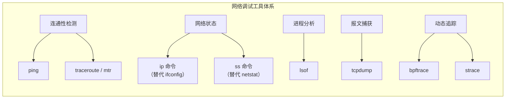
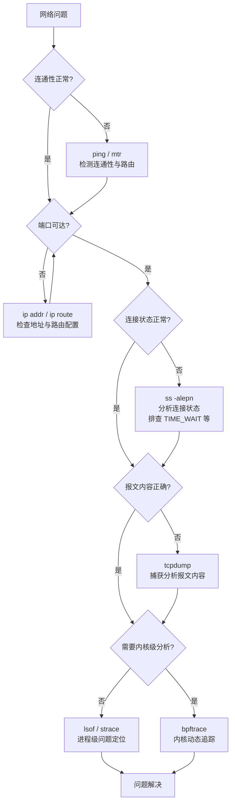

# 网络编程调试与分析工具

本文介绍 Linux 平台下网络编程常用的调试与分析工具，涵盖连通性检测、网络状态查看、连接分析、报文捕获及动态追踪等工具的使用方法与原理。

## 调试工具体系概览



## 连通性检测：ping

### 基本用法

`ping` 命令基于 ICMP（Internet Control Message Protocol，网际控制报文协议）实现网络连通性探测。其命名源自声呐探测技术。

```
$ ping www.sina.com.cn
PING www.sina.com.cn (202.102.94.124) 56(84) bytes of data.
64 bytes from www.sina.com.cn (202.102.94.124): icmp_seq=1 ttl=63 time=8.64 ms
64 bytes from www.sina.com.cn (202.102.94.124): icmp_seq=2 ttl=63 time=11.3 ms
64 bytes from www.sina.com.cn (202.102.94.124): icmp_seq=3 ttl=63 time=8.66 ms
64 bytes from www.sina.com.cn (202.102.94.124): icmp_seq=4 ttl=63 time=13.7 ms
64 bytes from www.sina.com.cn (202.102.94.124): icmp_seq=5 ttl=63 time=8.22 ms
64 bytes from www.sina.com.cn (202.102.94.124): icmp_seq=6 ttl=63 time=7.99 ms
^C
--- www.sina.com.cn ping statistics ---
6 packets transmitted, 6 received, 0% packet loss, time 5006ms
rtt min/avg/max/mdev = 7.997/9.782/13.795/2.112 ms
```

输出信息包含：

| 字段 | 说明 |
|------|------|
| icmp_seq | ICMP 序列号，用于匹配请求与应答 |
| ttl | 生存时间（Time To Live），反映报文经过的路由跳数 |
| time | 往返时延（RTT，Round-Trip Time） |
| packet loss | 丢包率 |
| rtt min/avg/max/mdev | RTT 最小值/平均值/最大值/标准差 |

### ICMP 协议原理

ICMP 是基于 IP 协议的控制协议，其报文格式如下：

| 字段 | 长度 | 说明 |
|------|------|------|
| Type | 8 bit | ICMP 类型，ping 请求为 8，应答为 0 |
| Code | 8 bit | 进一步划分 ICMP 类型，用于定位错误原因 |
| Checksum | 16 bit | 校验和，用于检测数据完整性 |
| Identifier | 16 bit | 标识符，通常为进程 ID，用于匹配请求与应答 |
| Sequence | 16 bit | 序列号，唯一标识一个报文 |

`ping` 程序组装 ICMP 报文后，通过 ARP 协议将 IP 地址解析为 MAC 地址，经数据链路层传输。目的主机按照 ICMP 协议格式应答，`ping` 通过对比序列号和计算时间戳完成统计显示。

### 路由追踪：traceroute / mtr

`traceroute` 同样基于 ICMP 协议，通过递增 TTL 值逐跳探测到目的地址的路径。`mtr`（My Traceroute）结合了 `ping` 和 `traceroute` 的功能，提供持续性的路由诊断。

```
$ mtr --report www.sina.com.cn
```

> **内核版本说明**：ICMP 协议为互联网标准协议，Linux 7.0 内核完整支持 ICMPv4 和 ICMPv6。

## 网络状态查看：ip 命令

### 替代 ifconfig

`ifconfig` 属于 `net-tools` 软件包，已被标记为废弃（deprecated）。现代 Linux 系统推荐使用 `ip` 命令（属于 `iproute2` 软件包）替代。

> **内核版本说明**：`net-tools` 自 Linux 2.0 时代存在，`iproute2` 从 Linux 2.6 起成为标准网络配置工具集，Linux 7.0 中 `ifconfig` 已不再默认安装。

### 常用命令对照

| 功能 | 旧命令（ifconfig） | 新命令（ip） |
|------|-------------------|-------------|
| 查看所有网卡 | `ifconfig` | `ip addr show` |
| 查看指定网卡 | `ifconfig eth0` | `ip addr show eth0` |
| 启用网卡 | `ifconfig eth0 up` | `ip link set eth0 up` |
| 禁用网卡 | `ifconfig eth0 down` | `ip link set eth0 down` |
| 设置 IP 地址 | `ifconfig eth0 10.0.0.1/24` | `ip addr add 10.0.0.1/24 dev eth0` |
| 删除 IP 地址 | — | `ip addr del 10.0.0.1/24 dev eth0` |
| 查看路由 | `route -n` | `ip route show` |
| 查看ARP 表 | `arp -a` | `ip neigh show` |

### ip addr 输出示例

```
$ ip addr show
1: lo: <LOOPBACK,UP,LOWER_UP> mtu 65536 qdisc noqueue state UNKNOWN
    inet 127.0.0.1/8 scope host lo
    inet6 ::1/128 scope host lo
2: eth0: <BROADCAST,MULTICAST,UP,LOWER_UP> mtu 1500 qdisc mq state UP
    inet 10.0.2.15/24 brd 10.0.2.255 scope global eth0
    inet6 fe80::54:adff:feea:602e/64 scope link eth0
```

**关键字段说明**：

| 字段 | 说明 |
|------|------|
| mtu | 最大传输单元（Maximum Transmission Unit），以太网默认 1500 字节 |
| state | 网卡状态（UP/DOWN/UNKNOWN） |
| scope | 地址作用域（host/link/global） |
| brd | 广播地址 |

## 连接状态分析：ss 命令

### 替代 netstat

`netstat` 同样属于已废弃的 `net-tools` 软件包。`ss`（Socket Statistics）命令从 Linux 2.6 起作为替代工具，性能更优，尤其在连接数较大时速度显著快于 `netstat`。

> **内核版本说明**：`ss` 命令通过 netlink 接口获取套接字信息，在 Linux 7.0 中为推荐工具。`netstat` 在高并发场景下性能极差，已不推荐使用。

### 常用命令对照

| 功能 | 旧命令（netstat） | 新命令（ss） |
|------|-------------------|-------------|
| 所有 TCP 连接 | `netstat -alepn -t` | `ss -alepn -t` |
| 所有 UDP 连接 | `netstat -alepn -u` | `ss -alepn -u` |
| UNIX 域套接字 | `netstat -alepn -x` | `ss -alepn -x` |
| 监听端口 | `netstat -lntp` | `ss -lntp` |
| TIME_WAIT 统计 | `netstat -ant | grep TIME_WAIT | wc -l` | `ss -ant state time-wait | wc -l` |

### ss 输出示例

```
$ ss -alepn -t
State   Recv-Q  Send-Q  Local Address:Port  Peer Address:Port  Process
ESTAB   0       0       127.0.0.1:2379      127.0.0.1:52464   users:(("etcd",pid=3496,fd=5))
```

输出中可清晰看到 TCP 连接的四元组（源地址、源端口、目的地址、目的端口）及关联进程信息。

### TIME_WAIT 分析

```
$ ss -ant state time-wait | wc -l
128
```

大量 TIME_WAIT 状态连接可能导致端口耗尽，影响新连接建立。可通过调整内核参数优化：

```bash
# 允许 TIME_WAIT 套接字复用（Linux 7.0 支持）
sysctl -w net.ipv4.tcp_tw_reuse=1

# 减少 TIME_WAIT 超时时间
sysctl -w net.ipv4.tcp_fin_timeout=15
```

## 进程与端口关联：lsof

`lsof`（List Open Files）用于查看进程打开的文件和套接字信息。

### 常用场景

**查找占用指定端口的进程**：

```
$ lsof -i :8080
COMMAND   PID   USER   FD   TYPE DEVICE SIZE/OFF NODE NAME
11-Nginx基础概述   12345   root    6u  IPv4  12345      0t0  TCP *:8080 (LISTEN)
```

**查找打开指定文件的进程**：

```
$ lsof /var/run/docker.sock
COMMAND   PID   USER   FD   TYPE DEVICE SIZE/OFF NODE NAME
dockerd  1400   root    3u  unix 0xffff88002beecf80      0t0  23209 /var/run/docker.sock
```

**查找指定进程的所有网络连接**：

```
$ lsof -i -a -p <PID>
```

## 报文捕获：tcpdump

### 基本用法

`tcpdump` 是网络编程中最常用的报文捕获工具，具备强大的过滤和匹配能力。

**指定网卡捕获**：

```
$ tcpdump -i eth0
```

**指定来源主机**：

```
$ tcpdump src host 192.168.1.25
```

**组合过滤条件**：

```
$ tcpdump 'tcp and port 80 and src host 192.168.1.25'
```

**捕获 TCP SYN 报文**：

```
$ tcpdump 'tcp and port 80 and tcp[13:1]&2 != 0'
```

此处 `tcp[13:1]` 表示 TCP 头部偏移 13 字节处的值，若该值与 2 进行按位与运算不为 0，则表示设置了 SYN 标志位。

### 输出格式解析

```
14:20:30.123456 IP 192.168.33.11.41388 > 192.168.33.11.6443: Flags [P], seq 1:100, ack 1, win 502, length 99
```

| 字段 | 说明 |
|------|------|
| 时间戳 | 报文捕获时间 |
| 源地址.端口 > 目的地址.端口 | 报文方向 |
| Flags | TCP 标志位 |
| seq | 序列号范围 |
| ack | 确认号 |
| win | 滑动窗口大小 |
| length | 载荷（Payload）长度 |

**常见 TCP 标志位**：

| 标志 | 含义 |
|------|------|
| [S] | SYN，连接建立请求 |
| [.] | ACK，确认报文 |
| [P] | PSH，数据推送 |
| [F] | FIN，连接关闭请求 |
| [R] | RST，连接重置 |

### 工作原理

`tcpdump` 启动时创建 `AF_PACKET` 类型套接字并向内核注册回调。网卡收到报文后，内核将报文副本传递给 `tcpdump` 的回调函数，经条件过滤后解析输出。

> **内核版本说明**：`AF_PACKET` 套接字在 Linux 7.0 中完整支持，`tcpdump` 版本 4.99+ 配合 libpcap 1.10+ 可使用 BPF（Berkeley Packet Filter）的 eBPF 后端，提升过滤性能。

## 动态追踪：bpftrace

### 概述

`bpftrace` 是基于 eBPF（Extended Berkeley Packet Filter）的现代动态追踪工具，可在不修改内核代码的情况下，对内核和应用程序进行实时追踪分析。

> **内核版本说明**：eBPF 自 Linux 3.18 引入，Linux 7.0 中 eBPF 已成为内核可编程的核心基础设施，支持复杂的网络、安全和性能分析场景。

### 常用追踪场景

**追踪 TCP 连接建立**：

```bash
# 追踪所有 TCP 连接建立事件（状态进入 ESTABLISHED，newstate == 1）
bpftrace -e 'tracepoint:sock:inet_sock_set_state /args->newstate == 1/ { printf("PID: %d, comm: %s, saddr: %s, daddr: %s\n", pid, comm, ntop(args->saddr), ntop(args->daddr)); }'
```

**追踪 TCP 重传事件**：

```bash
bpftrace -e 'tracepoint:tcp:tcp_retransmit_skb { printf("PID: %d, comm: %s, saddr: %s, daddr: %s\n", pid, comm, ntop(args->saddr), ntop(args->daddr)); }'
```

**统计系统调用分布**：

```bash
bpftrace -e 'tracepoint:syscalls:sys_enter_* { @syscall[probe] = count(); }'
```

### 与传统工具对比

| 工具 | 原理 | 开销 | 适用场景 |
|------|------|------|---------|
| strace | ptrace 系统调用 | 高（2-10x 降速） | 用户态系统调用追踪 |
| tcpdump | AF_PACKET + BPF | 中 | 网络报文捕获 |
| bpftrace | eBPF 内核注入 | 极低 | 内核/用户态动态追踪 |

## 系统调用追踪：strace

`strace` 用于追踪进程的系统调用和信号接收，在调试网络程序时尤为有用。

**追踪指定程序的网络相关系统调用**：

```
$ strace -e trace=network ./tcpserver
```

**追踪已运行进程**：

```
$ strace -e trace=network -p <PID>
```

**统计系统调用耗时**：

```
$ strace -c -e trace=network ./tcpserver
```

## 调试工作流



## 工具速查表

| 工具 | 类别 | 核心功能 | 替代关系 |
|------|------|---------|---------|
| ping | 连通性检测 | ICMP 连通性探测 | — |
| mtr | 连通性检测 | 路由追踪与统计 | 替代 traceroute |
| ip | 网络配置 | 地址/路由/邻居表管理 | 替代 ifconfig/route/arp |
| ss | 连接分析 | 套接字状态统计 | 替代 netstat |
| lsof | 进程分析 | 文件/端口/进程关联 | — |
| tcpdump | 报文捕获 | 网络报文捕获与过滤 | — |
| bpftrace | 动态追踪 | eBPF 内核/用户态追踪 | 新增 |
| strace | 系统调用 | 进程系统调用追踪 | — |

## 总结

本文介绍了 Linux 平台下网络编程调试与分析的核心工具，要点如下：

- `ping` 基于 ICMP 协议检测网络连通性，`mtr` 提供持续性路由诊断
- `ip` 命令替代已废弃的 `ifconfig`，`ss` 命令替代已废弃的 `netstat`
- `lsof` 用于关联进程与端口/文件，定位端口占用等问题
- `tcpdump` 提供强大的报文捕获与过滤能力，是网络问题排查的核心工具
- `bpftrace` 基于 eBPF 实现低开销动态追踪，适用于内核级性能分析

## 思考题

1. `tcpdump` 如何对 UDP 报文进行过滤捕获？请构造相应的过滤表达式。
2. `ss` 命令输出中，监听状态的套接字对应的 `Peer Address:Port` 显示为 `*:*`，其含义是什么？
3. 在高并发场景下，`ss` 相比 `netstat` 性能优势的原因是什么？

---

## 版本信息

- **更新日期**：2026-06-09
- **目标内核**：Linux 7.0
- **工具版本参考**：iproute2 6.x, tcpdump 4.99+, bpftrace 0.20+, lsof 4.99+
- **废弃工具**：net-tools（ifconfig/netstat/route/arp）已不再维护
