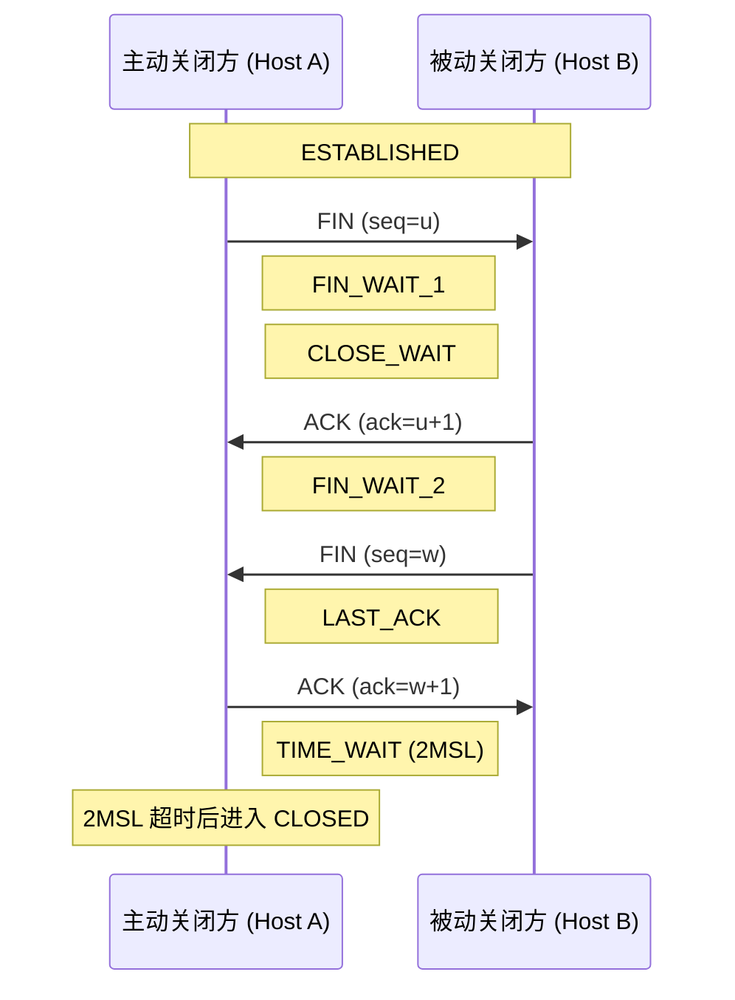

# TCP连接生命周期：关闭、TIME_WAIT与有效性检测

TCP 连接从建立、数据传输到关闭、检测，是网络编程的核心。本文整合 TCP 连接生命周期的完整知识：连接关闭（四次挥手、优雅/半关闭）、TIME_WAIT 状态的原理与优化，以及连接有效性检测（TCP Keep-Alive 与应用层心跳）。

## 第一部分 TCP 连接关闭

### 1. TCP 四次挥手与状态机

TCP 连接是全双工通道，数据在两个方向独立传输。连接终止通过四次挥手完成：



**半关闭（Half-Close）**：大多数场景并非同时关闭两个方向，而是先关闭一个方向（如客户端关闭发送方向），待另一方向数据传输完成后再关闭。典型场景：客户端 `shutdown` 写方向 → 服务器读完后检测到 EOF → 服务器处理并返回结果 → 关闭连接。

### 2. close() 与 shutdown() 的对比

| 特性 | close() | shutdown() |
|------|---------|------------|
| 资源释放 | 引用计数归零时释放套接字资源 | 不释放套接字资源 |
| 引用计数 | 受引用计数影响，可能不立即关闭 | 不受引用计数影响，立即生效 |
| FIN 报文 | 仅在引用计数归零时发送 | 总是发送 FIN 报文 |
| 单向关闭 | 不支持 | 支持（`SHUT_RD`、`SHUT_WR`） |

**close()**：套接字引用计数减一（`fork()` 时加一），归零时关闭两个方向。若对端在本地关闭后继续发送，本地回复 RST。

**shutdown()**：`howto` 参数 0=`SHUT_RD`（关闭读方向，后续读返回 EOF）、1=`SHUT_WR`（关闭写方向，发送 FIN）、2=`SHUT_RDWR`。

> **关键结论**：当需要通知对端本地已完成数据发送时，应使用 `shutdown(sockfd, SHUT_WR)` 而非 `close()`——前者保证发送 FIN，后者可能因引用计数未归零而不发送。

### 3. 优雅关闭 vs 强制关闭

- **优雅关闭（shutdown）**：客户端 shutdown 写方向 → 服务器返回剩余响应 → 服务器关闭 → 正常完成。
- **强制关闭（close 后对端继续发）**：客户端 close 关闭两个方向 → 服务器响应到达时客户端回 RST → 服务器继续发送触发 SIGPIPE，数据丢失。

### 4. SIGPIPE 信号处理

进程向已收到 RST 的套接字写入数据时，内核发送 `SIGPIPE`，默认终止进程。处理方式：

```c
signal(SIGPIPE, SIG_IGN);   // 忽略
// 或用 MSG_NOSIGNAL 标志（Linux 2.2+ 支持）
send(sockfd, buffer, len, MSG_NOSIGNAL);
```

## 第二部分 TIME_WAIT 状态

### 5. TIME_WAIT 的产生与设计目的

主动关闭方在发送最后一个 ACK 后进入 TIME_WAIT，持续 **2MSL**（Linux 将该时长硬编码为 60 秒，即按 MSL=30 秒计）。**只有主动发起关闭的一方才会进入 TIME_WAIT**。

TIME_WAIT 的两个设计目的：

1. **确保最后 ACK 的可靠送达**：若最后 ACK 丢失，被动关闭方重传 FIN；处于 TIME_WAIT 的主动方能正确识别并重发 ACK，使对端正常关闭（若无 TIME_WAIT 则回复 RST，导致对端异常终止）。
2. **防止旧连接迷走报文干扰新连接**：2MSL 保证旧连接报文在网络中自然消亡，此后同四元组的新连接不会被旧报文污染。

> 关键细节：2MSL 计时从主动方收到 FIN 并发送 ACK 开始；若期间收到重传 FIN，计时重新开始。

### 6. TIME_WAIT 过多的影响

- **端口资源耗尽**：每个连接占用一个本地端口（默认 `ip_local_port_range` 32768~60999）。高并发短连接下大量 TIME_WAIT 占满端口，导致新连接间歇性无法建立；
- **内存占用**：每个 TIME_WAIT 连接占用内核内存（连接元数据），数量极大时不可忽略。

### 7. TIME_WAIT 优化策略

| 方案 | 说明 | 评价 |
|------|------|------|
| **tcp_max_tw_buckets** | 限制 TIME_WAIT 连接数上限，超出回收 | 防御性措施，非根治 |
| **修改 TCP_TIMEWAIT_LEN** | 缩短 60 秒到 15 秒 | 需重编译内核，有旧报文风险 |
| **SO_LINGER（RST 模式）** | `l_onoff=1, l_linger=0` 立即 RST，跳过 TIME_WAIT | **强烈不推荐**，违反可靠性保证 |
| **tcp_tw_reuse** | 协议安全前提下复用 TIME_WAIT 套接字 | **推荐**，安全可控 |
| **SO_REUSEPORT** | 多 worker 绑定同端口，优化连接分发 | 高并发架构 |

**tcp_tw_reuse（推荐）**：允许复用 TIME_WAIT 套接字用于新连接。安全性依赖 TCP 时间戳（RFC 7323，原 RFC 1323；`tcp_timestamps=1` 默认开启）：通过时间戳识别并丢弃过期重复报文，消除 2MSL 等待必要性。

```bash
sysctl -w net.ipv4.tcp_tw_reuse=1   # 建议在客户端角色主机开启
sysctl net.ipv4.tcp_timestamps      # 确认时间戳已开启
```

复用条件：仅适用于连接发起方（客户端）、对应 TIME_WAIT 超过 1 秒、需开启 TCP 时间戳。

> 内核演进：Linux 4.12 起，`tcp_tw_reuse` 默认值由 0 改为 2（仅允许复用发往回环地址连接的 TIME_WAIT 套接字）；设为 `1` 可全局启用。配合时间戳使用，安全性显著提升。

**SO_LINGER 的三种模式**：

| l_onoff | l_linger | 行为 |
|---------|----------|------|
| 0 | 忽略 | 默认，close() 立即返回，内核尝试发送残留数据 |
| 非0 | 0 | **强制 RST 关闭**，跳过挥手和 TIME_WAIT，对端收到 "connection reset by peer" |
| 非0 | 非0 | close() 阻塞直到数据发送完成或超时 |

> SO_LINGER RST 模式会绕过 TCP 可靠性保证（对端数据丢失、无法正常关闭），**极其危险，不推荐**。

## 第三部分 连接有效性检测

### 8. 连接失效问题

无数据读写的"静默"连接上，TCP 无法感知连接是否有效。若对端崩溃且 FIN 未到达，本地端会长时间维护无用连接。典型故障：NATS 订阅者连接"显示正常"但已失效（服务器重启的 FIN 未到达），导致收不到消息。

### 9. TCP Keep-Alive 机制

TCP Keep-Alive 通过定期发送探测报文检测连接存活性：

| 参数 | 含义 | 默认值 |
|------|------|--------|
| `tcp_keepalive_time` | 保活时间（空闲多久后探测） | 7200 秒（2 小时） |
| `tcp_keepalive_intvl` | 探测间隔 | 75 秒 |
| `tcp_keepalive_probes` | 判定死亡前最大探测次数 | 9 次 |

**检测死亡连接最长时间**：`7200 + 75×9 = 7875 秒 ≈ 2 小时 11 分`。

**每连接覆盖默认参数**（Linux 2.4+）：通过 `SO_KEEPALIVE` + `TCP_KEEPIDLE`/`TCP_KEEPINTVL`/`TCP_KEEPCNT` 套接字选项。

**探测三种结果**：对端正常（收到 ACK，重置）、对端崩溃重启（收到 RST，连接重置）、对端不可达（无响应，探测耗尽判定死亡）。

**Keep-Alive 局限性**：检测粒度粗（仅确认协议层连通性）、参数全局性、探测报文可能被中间设备（防火墙/NAT）丢弃。

### 10. 应用层心跳机制

针对 Keep-Alive 局限，在应用层实现更灵活的心跳检测（PING/PONG）：

- **协议设计**：定义消息类型 `MSG_PING`/`MSG_PONG`；客户端空闲达到保活阈值发 PING，服务器回 PONG；客户端超时未收到响应则计数，超过最大次数判定连接死亡；
- **实现**：用 `select()` 超时作为定时器；收到响应重置计数和保活时间；
- **关键点**：心跳间隔建议 10~30 秒，多次探测（3 次）避免瞬时抖动误判。

### 11. TCP Keep-Alive vs 应用层心跳

| 特性 | TCP Keep-Alive | 应用层心跳 |
|------|----------------|------------|
| 检测层次 | 传输层（TCP 协议栈） | 应用层 |
| 检测粒度 | 仅确认协议层连通性 | 可检测应用层可用性 |
| 参数灵活性 | 系统级默认粗粒度；套接字选项可覆盖 | 完全自定义 |
| 响应内容 | 空 ACK 报文 | 可携带应用层状态信息 |
| 实现复杂度 | 内核自动处理，无额外编码 | 需设计心跳协议和定时器 |
| 防火墙穿透 | 探测报文可能被中间设备丢弃 | 与业务数据共享通道，不易被丢弃 |

**最佳实践**：启用 TCP Keep-Alive 作为基础保障 + 应用层心跳检测应用层可用性；心跳间隔 10~30 秒、多次探测后判定死亡、连接死亡后执行清理/重连/告警。

## 总结

- **连接关闭**：四次挥手 + 状态机；`shutdown(SHUT_WR)` 半关闭保证发送 FIN（区别于 close 受引用计数影响）；正确处理 SIGPIPE；
- **TIME_WAIT**：主动关闭方 2MSL，确保最后 ACK 可靠送达 + 防止旧报文干扰；过多会耗尽端口；推荐 `tcp_tw_reuse`（依赖时间戳），避免 SO_LINGER RST 模式；
- **连接检测**：TCP Keep-Alive 传输层基础检测（默认延迟过长），应用层心跳更灵活精确（PING/PONG）；生产环境组合使用；
- 三者共同构成 TCP 连接生命周期的完整管理。

## 思考题

1. 服务器端直接 `exit(0)` 即可完成 FIN 发送，原因是什么？为何无需显式 close/shutdown？
2. MSL 的时间限制如何保证报文自然消亡？RFC 7323 时间戳（原 RFC 1323）是否要求双方统一时钟？
3. 心跳检测方案基于 TCP，是否适用于 UDP？需做哪些调整？
4. 为何需多次探测才能判定连接死亡，而非一次无响应即判定？

## 版本信息

| 项目 | 说明 |
|------|------|
| 更新日期 | 2026-06-09 |
| 目标内核 | Linux 7.0 |
| 关键特性 | `TCP_KEEPIDLE`/`TCP_KEEPINTVL`/`TCP_KEEPCNT`（2.4+）、`MSG_NOSIGNAL`（2.2+）、`SO_REUSEPORT`（3.9+）、`tcp_tw_reuse`（4.12 起默认 2，仅回环复用）、BPF 套接字分发（4.5+） |

---
