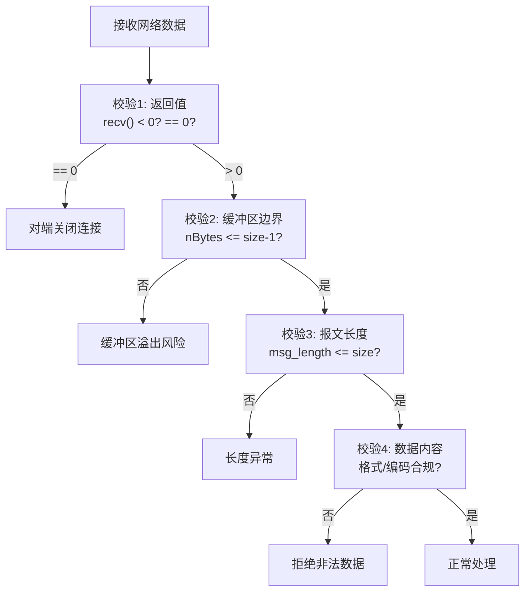

# TCP数据传输、字节流与可靠性

TCP 的数据传输并非简单的"发送即到达"。本文整合 TCP 传输核心的完整知识：流量控制与拥塞控制、小数据包优化（Nagle 算法）、字节流特性与报文边界处理、可靠性边界与故障感知、以及数据有效性校验与安全防护。

## 第一部分 流量控制与拥塞控制

### 1. 数据发送的本质

调用 `write()`/`send()` 时，数据并非立即发送，而是从应用缓冲区拷贝至内核发送缓冲区，等待 TCP 协议栈处理。**实际发送时机、速率、重传策略均由内核协议栈控制**，对应用不可见。

### 2. 流量控制：生产者-消费者模型

流量控制可类比"生产者-消费者"模型：发送端（生产者）注入数据包，接收端（消费者）受处理能力和缓冲区限制。接收端通过**接收窗口（rwnd）** 通告当前可接收的数据量。

- **发送窗口（Send Window）**：发送端未收到确认时可发送的最大数据量，受 rwnd 限制；
- **接收窗口（Receive Window）**：接收端通告的可用缓冲区大小。

若发送端忽略 rwnd 持续发送，接收端缓冲区溢出后丢弃数据、触发重传，网络效率下降甚至崩溃。

### 3. 拥塞控制：多连接共享带宽

流量控制仅考虑单条连接，而网络设备带宽有限。拥塞控制通过**拥塞窗口（cwnd）** 兼顾效率与公平。**有效发送窗口 = min(rwnd, cwnd)**。

| 特性 | 发送窗口 (rwnd) | 拥塞窗口 (cwnd) |
|------|-----------------|-----------------|
| 控制对象 | 单条连接的流量 | 多条连接的带宽共享 |
| 调整方 | 接收端通告 | 发送端独立调整 |
| 反映问题 | 接收端处理能力 | 网络拥塞程度 |

### 4. 拥塞控制算法

1. **慢启动（Slow Start）**：cwnd 从初始值指数增长，直至慢启动阈值（ssthresh）；
2. **拥塞避免（Congestion Avoidance）**：cwnd 超过 ssthresh 后线性增长，谨慎探测带宽；
3. **快速重传（Fast Retransmit）**：收到 3 个重复 ACK 立即重传，无需等待超时；
4. **快速恢复（Fast Recovery）**：快速重传后 ssthresh 和 cwnd 减半，进入拥塞避免。

| 算法 | 引入版本 | 说明 |
|------|----------|------|
| Reno | Linux 2.x 早期 | 经典算法（慢启动/拥塞避免/快速重传恢复） |
| **Cubic** | Linux 2.6.19（默认） | 适合高带宽长延迟网络，至今默认 |
| **BBR** | Linux 4.9 | 基于带宽测量（BtlBw/RTprop），不依赖丢包信号，高丢包下表现优异 |
| BBRv2 | 未合入主线（Google bbr 仓库） | 优化与 Reno/Cubic 共存，减少带宽抢占；截至 2026-09 主线内核仍为 BBRv1 |

> BBR 与传统基于丢包的算法本质区别：传统算法将丢包视为拥塞信号，丢包时降速；BBR 通过持续测量瓶颈带宽和往返传播时间建模网络路径，独立于丢包调整速率。启用 BBR：`sysctl -w net.ipv4.tcp_congestion_control=bbr`。

### 5. 小数据包优化

**糊涂窗口综合症（Silly Window Syndrome）**：接收端仅释放少量空间就通告窗口，发送端据此发小包，带宽利用率极低。应在接收端优化：等待缓冲区可用空间达到合理阈值（MSS 或一半）再通告。

**Nagle 算法**（发送端）：**任意时刻未被确认的小数据包（< MSS）不能超过一个**。发送端缓存后续小包，待前一个 ACK 到达后合并发送。

**延迟确认（Delayed ACK）**（接收端）：收到数据后等待 200~500ms，期望捎带 ACK，减少纯 ACK 报文。

**Nagle 与延迟确认的交互问题**：Nagle 阻止发送第二部分数据直到收到 ACK，而延迟确认使服务器等待 200ms 才发 ACK，两者相互阻塞导致 200ms 额外延迟。对时延敏感应用用 `TCP_NODELAY` 禁用 Nagle：

```c
int on = 1;
setsockopt(sock, IPPROTO_TCP, TCP_NODELAY, &on, sizeof(on));
```

> 除非充分理解场景，否则不建议轻易禁用 Nagle——现代系统优化成熟，盲目禁用可能导致小包泛滥。

### 6. 写操作合并

当数据分散在多个缓冲区时，用 `writev()` 合并为一次发送，避免 Nagle 延迟：

```c
struct iovec iov[2];
iov[0].iov_base = "hello,";
iov[0].iov_len = strlen("hello,");
iov[1].iov_base = buf;
// ...
writev(socket_fd, iov, 2);   // 合并 "hello," + 用户输入 一次发送
```

`TCP_INQ`（Linux 4.18+）：通过 `recvmsg()` 辅助数据获取接收缓冲区剩余未读字节数，便于流式协议解析器精确控制读取。

## 第二部分 字节流特性与报文边界

### 7. TCP 字节流特性

TCP 是面向字节流的传输协议，**不保留应用层消息的边界**。应用层"请求-响应"的假象源于网络良好且数据量小。发送端调用 `send()` 后数据进入内核缓冲区，实际传输可能合并、分割、交叉：

```
情况1: 合并为一个 TCP 分组  ...networkprogram...
情况2: 部分合并             分组1: networkpro | 分组2: gram
情况3: 交叉分割             分组1: net | 分组2: workprogram
```

**关键特性**：
1. **顺序保证**：先 `send()` 的字节必定在前，由 TCP 严格保证；
2. **可靠传输**：分组丢失时后续分组被缓存，直到重传成功再按序交付。

### 8. 网络字节序

多字节数据（如 0x0201）有两种存储方式：大端（网络字节序，高字节在低地址）和小端（常见主机）。网络协议统一使用大端。转换函数：`htons/ntohs`（16位）、`htonl/ntohl`（32位）。若主机本身为大端，这些函数为空实现。

### 9. 报文格式设计（解决边界）

由于 TCP 不保留消息边界，应用层需自行定义报文格式：

**方法一：显式编码长度**——报文头含消息长度字段：

```
+----------------+----------------+------------------+
| 消息长度 (4B)  | 消息类型 (4B)  | 消息体 (变长)    |
+----------------+----------------+------------------+
```

发送端用 `htonl` 编码长度；接收端需实现 `readn()`（读取指定字节数，不足则阻塞）和 `read_message()`（先读长度、校验、再读消息体）：

```c
size_t readn(int fd, void *buffer, size_t length) {
    size_t count = length;
    ssize_t nread;
    char *ptr = buffer;
    while (count > 0) {
        nread = read(fd, ptr, count);
        if (nread < 0) {
            if (errno == EINTR) continue;  // 处理中断
            return -1;
        } else if (nread == 0) break;      // EOF
        count -= nread;
        ptr += nread;
    }
    return length - count;
}

size_t read_message(int fd, char *buffer, size_t length) {
    u_int32_t msg_length, msg_type;
    int rc;
    rc = readn(fd, (char *) &msg_length, sizeof(msg_length));
    msg_length = ntohl(msg_length);
    rc = readn(fd, (char *) &msg_type, sizeof(msg_type));
    if (msg_length > length) return -1;   // 长度校验（防溢出）
    rc = readn(fd, buffer, msg_length);
    return rc;
}
```

**方法二：特殊字符分隔**——如 HTTP 用 `\r\n` 作边界。可用 `recv(..., MSG_PEEK)` "窥视"下一个字符（不移除），处理 `\r` 与 `\r\n` 两种情况。

## 第三部分 可靠性边界与故障感知

### 10. TCP 可靠性的局限

TCP 可靠性仅限传输层，应用层视角存在不可靠场景：
1. **发送端无法确认对端应用已处理**：`send()` 返回成功仅表示数据已拷入内核缓冲区；
2. **已 ACK 数据可能丢失**：接收端 ACK 后数据仍在缓冲区，应用崩溃则丢失；
3. **异常感知能力有限**：TCP 设计为自我恢复，异常感知仅通过 `read()`/`write()`。

### 11. 故障场景与感知方式

| 故障场景 | FIN 包 | 感知方式 | 错误 |
|---------|--------|---------|------|
| 网络中断 | 无 | read 阻塞 / write 超时 | ETIMEDOUT |
| 系统崩溃（断电） | 无 | read 阻塞 / write 超时 | ETIMEDOUT |
| 系统崩溃后重启 | 无 | read/write 返回错误 | ECONNRESET |
| 对端 close/shutdown | 有 | read 返回 0 | EOF |
| 对端崩溃（内核发 FIN） | 有 | read 返回 0 | EOF |
| 收到 FIN 后继续 write | - | write 返回错误 | EPIPE / SIGPIPE |

**关键机制**：收到 FIN 仅表示对端不再发送，不表示不再接收。TCP 双向，收到 FIN 后仍可写入；但当数据到达对端已关闭套接字时对端返回 RST，此时 `write()` 返回 EPIPE/SIGPIPE。

> 内核版本差异：Linux 上 `send()` 收到 RST 后返回 `ECONNRESET`（前提是已忽略 SIGPIPE），macOS 则在二次 write 触发 SIGPIPE。建议始终为 SIGPIPE 注册处理函数确保跨平台兼容。

### 12. 对端异常检测方法

- **EOF 感知**：`recv()` 返回 0 表示对端关闭；
- **设置接收超时**：`setsockopt(SO_RCVTIMEO)`，超时后 `recv()` 返回 -1 且 errno 为 EAGAIN/EWOULDBLOCK；
- **Keep-Alive/心跳**：检测连接活性（见 TCP 连接生命周期篇）；
- **I/O 多路复用超时**：`select()`/`epoll_wait()` 超时参数。

## 第四部分 数据有效性校验与安全防护

### 13. 缓冲区安全

设计良好的网络程序应在随机输入下保持稳定，且能抵御恶意攻击（构造协议包触发缓冲区溢出、指针异常）。

**示例一：缓冲区越界写入**：`recv()` 读满 128 字节后 `buffer[128]='\0'` 越界。修复：`recv(connfd, buffer, sizeof(buffer)-1, 0)` 预留终止符空间；发送端用 `strlen(Response)` 而非 `sizeof`（避免含 `'\0'` 语义不一致）。

**示例二：报文长度校验缺失**：`read_message()` 若不做 `msg_length > length` 校验，攻击者可声明极大长度（如 65535）但实际发送少量数据，导致服务器阻塞在 `read()` 等待永远不到的数据，或产生缓冲区溢出。

**示例三：readline 边界**：`while (length-- > 0)` 在读到 `\n` 时 `length` 为 1，写入 `'\0'` 越界。修复：`while (--length > 0)` 先递减再判断，预留终止符空间。

### 14. 数据有效性校验流程



### 15. 现代网络安全防护

- **TLS/SSL**：加密传输防窃听、证书验证防伪造、完整性校验防篡改。Linux 4.13+ 引入 kTLS（记录层处理卸载到内核，减少切换开销）；
- **输入验证**：对所有网络输入严格格式和范围校验；
- **最小权限原则**：网络服务以最低必要权限运行；
- **ASLR**：现代操作系统默认启用，增加溢出攻击难度；
- **栈保护（Stack Canary）**：`-fstack-protector` 检测栈溢出；
- **安全编码规范**：用 `strncpy`/`snprintf` 替代 `strcpy`/`sprintf`。

## 总结

- **流量控制**（rwnd）：单连接点对点，接收端通告；**拥塞控制**（cwnd）：多连接带宽公平；有效发送窗口 = min(rwnd, cwnd)；
- **拥塞算法**：慢启动→拥塞避免→快速重传/恢复；Cubic 默认，BBR 高丢包下更优；
- **小数据包**：Nagle（发送端）+ 延迟确认（接收端）可能交互延迟，用 `TCP_NODELAY` 或 `writev()` 合并规避；
- **字节流**：TCP 不保留消息边界，应用层用"长度字段"或"分隔符"定义报文格式，配合 `readn`/`read_message`；
- **可靠性边界**：TCP 可靠性仅限传输层，应用层需通过超时、心跳、EOF/RST 感知异常；
- **安全**：缓冲区边界校验（预留终止符、报文长度校验）、输入验证、TLS、纵深防御。

## 思考题

1. `writev()` 的 `iovcnt` 在 Linux 是否有上限？由哪个内核参数决定？
2. TCP 拥塞控制还有哪些值得关注的算法？各自解决什么问题？
3. 为何需要同时处理仅有 `\r` 和 `\r\n` 两种情况？
4. 应用程序接收缓冲区大小设置应考虑哪些因素？

## 版本信息

| 项目 | 说明 |
|------|------|
| 更新日期 | 2026-06-09 |
| 目标内核 | Linux 7.0 |
| 关键特性 | Cubic（2.6.19+ 默认）、BBR（4.9+）、BBRv2（未合入主线，Google bbr 仓库）、`TCP_NODELAY`、`TCP_INQ`（4.18+）、`SO_RCVTIMEO`、kTLS（4.13+）、`MSG_BATCH`（4.14+） |

---
