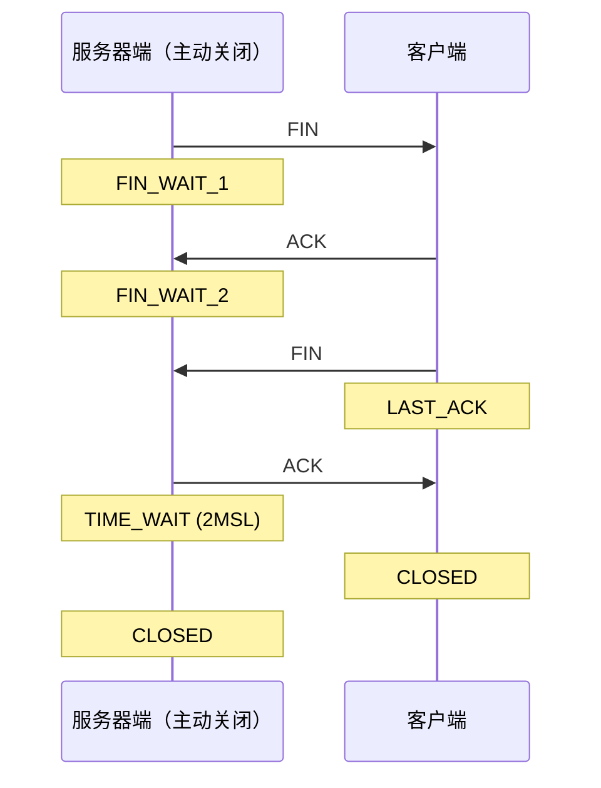
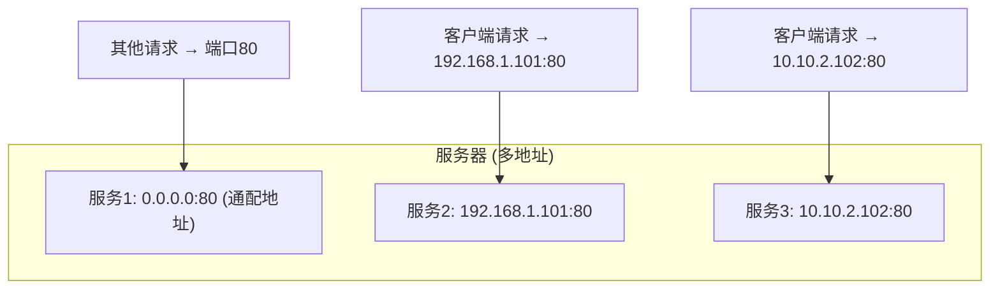
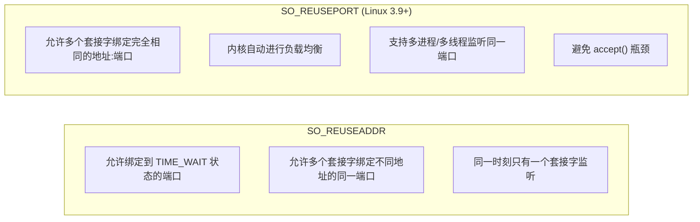
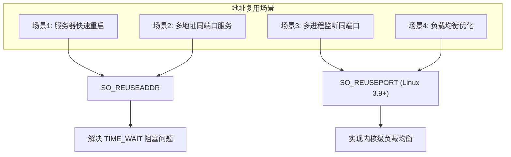

# 地址复用：SO_REUSEADDR与SO_REUSEPORT

在网络编程实践中，服务器程序重启时常遇到 "Address already in use" 错误，导致服务无法快速恢复。本文将深入分析该问题的成因，并介绍 `SO_REUSEADDR` 和 `SO_REUSEPORT` 套接字选项的原理与应用。

## 问题复现

以下是一个典型的 TCP 服务器端程序：

```
static int count;

static void sig_int(int signo) {
    printf("\nreceived %d datagrams\n", count);
    exit(0);
}

int main(int argc, char **argv) {
    int listenfd;
    listenfd = socket(AF_INET, SOCK_STREAM, 0);

    struct sockaddr_in server_addr;
    bzero(&server_addr, sizeof(server_addr));
    server_addr.sin_family = AF_INET;
    server_addr.sin_addr.s_addr = htonl(INADDR_ANY);
    server_addr.sin_port = htons(SERV_PORT);

    int rt1 = bind(listenfd, (struct sockaddr *) &server_addr, sizeof(server_addr));
    if (rt1 < 0) {
        error(1, errno, "bind failed ");
    }

    int rt2 = listen(listenfd, LISTENQ);
    if (rt2 < 0) {
        error(1, errno, "listen failed ");
    }

    signal(SIGPIPE, SIG_IGN);

    int connfd;
    struct sockaddr_in client_addr;
    socklen_t client_len = sizeof(client_addr);

    if ((connfd = accept(listenfd, (struct sockaddr *) &client_addr, &client_len)) < 0) {
        error(1, errno, "accept failed ");
    }

    char message[MAXLINE];
    count = 0;

    for (;;) {
        int n = read(connfd, message, MAXLINE);
        if (n < 0) {
            error(1, errno, "error read");
        } else if (n == 0) {
            error(1, 0, "client closed \n");
        }
        message[n] = 0;
        printf("received %d bytes: %s\n", n, message);
        count++;
    }
}

```

### 正常关闭场景

启动服务器，使用 Telnet 连接并输入数据，然后正常关闭连接：

```
$ ./addressused
received 9 bytes: network
received 6 bytes: good
client closed
$ ./addressused  # 重启成功
```

### 异常关闭场景

若在服务器端使用 Ctrl+C 强制关闭连接，再尝试重启：

```
$ ./addressused
received 9 bytes: network
received 6 bytes: good
^C
$ ./addressused
bind failed: Address already in use(98)
```

## TIME_WAIT 状态回顾

当连接的主动关闭方收到对端 FIN 并发出最后一个 ACK 后，会进入 TIME_WAIT 状态，持续时间约为 2MSL（Maximum Segment Lifetime）。



使用 `netstat` 查看连接状态：

```
Proto Recv-Q Send-Q Local Address     Foreign Address   State
tcp        0      0 127.0.0.1:9527    127.0.0.1:36650   TIME_WAIT
```

服务器端主动关闭连接后，该连接进入 TIME_WAIT 状态，导致重启时 `bind()` 失败。

## SO_REUSEADDR 套接字选项

TCP 连接通过四元组（源地址、源端口、目的地址、目的端口）唯一标识。现代 Linux 内核对此进行了优化：

1. **序列号区分**：新连接 SYN 的初始序列号一定大于 TIME_WAIT 连接的末序列号；
2. **时间戳区分**：开启 `tcp_timestamps` 后，新连接的时间戳大于旧连接。

基于这些优化，`SO_REUSEADDR` 选项允许新连接复用 TIME_WAIT 状态的端口。

### 使用方法

```
int on = 1;
setsockopt(listenfd, SOL_SOCKET, SO_REUSEADDR, &on, sizeof(on));
```

修改后的服务器端程序：

```
int main(int argc, char **argv) {
    int listenfd;
    listenfd = socket(AF_INET, SOCK_STREAM, 0);

    struct sockaddr_in server_addr;
    bzero(&server_addr, sizeof(server_addr));
    server_addr.sin_family = AF_INET;
    server_addr.sin_addr.s_addr = htonl(INADDR_ANY);
    server_addr.sin_port = htons(SERV_PORT);

    int on = 1;
    setsockopt(listenfd, SOL_SOCKET, SO_REUSEADDR, &on, sizeof(on));

    int rt1 = bind(listenfd, (struct sockaddr *) &server_addr, sizeof(server_addr));
    if (rt1 < 0) {
        error(1, errno, "bind failed ");
    }

    int rt2 = listen(listenfd, LISTENQ);
    if (rt2 < 0) {
        error(1, errno, "listen failed ");
    }

    signal(SIGPIPE, SIG_IGN);

    int connfd;
    struct sockaddr_in client_addr;
    socklen_t client_len = sizeof(client_addr);

    if ((connfd = accept(listenfd, (struct sockaddr *) &client_addr, &client_len)) < 0) {
        error(1, errno, "accept failed ");
    }

    char message[MAXLINE];
    count = 0;

    for (;;) {
        int n = read(connfd, message, MAXLINE);
        if (n < 0) {
            error(1, errno, "error read");
        } else if (n == 0) {
            error(1, 0, "client closed \n");
        }
        message[n] = 0;
        printf("received %d bytes: %s\n", n, message);
        count++;
    }
}

```

重新编译后，即使服务器端异常关闭，也能快速重启：

```
$ ./addressused2
received 9 bytes: network
received 6 bytes: good
^C
$ ./addressused2  # 重启成功
```

### SO_REUSEADDR 的其他用途

`SO_REUSEADDR` 还支持在同一主机多个地址上使用相同端口提供服务：



## SO_REUSEPORT 套接字选项

> **内核版本注记**：`SO_REUSEPORT` 从 Linux 3.9 开始引入，在 Linux 7.0 中已成为高并发服务器的重要优化手段。

`SO_REUSEPORT` 允许多个套接字绑定到完全相同的地址和端口组合，实现真正的端口复用。与 `SO_REUSEADDR` 的关键区别如下：



### SO_REUSEPORT 的优势

1. **负载均衡**：内核自动将新连接分配给不同套接字，避免单点瓶颈；
2. **多进程架构支持**：每个工作进程可独立创建套接字并绑定同一端口；
3. **平滑重启**：新进程启动后再关闭旧进程，实现零停机部署。

### 使用示例

```
int optval = 1;
setsockopt(sockfd, SOL_SOCKET, SO_REUSEPORT, &optval, sizeof(optval));
```

多进程监听同一端口的典型架构：

```
// 主进程创建多个子进程，每个子进程独立绑定同一端口
for (int i = 0; i < worker_count; i++) {
    if (fork() == 0) {
        int sockfd = socket(AF_INET, SOCK_STREAM, 0);
        int optval = 1;
        setsockopt(sockfd, SOL_SOCKET, SO_REUSEPORT, &optval, sizeof(optval));
        setsockopt(sockfd, SOL_SOCKET, SO_REUSEADDR, &optval, sizeof(optval));
        
        bind(sockfd, (struct sockaddr *)&addr, sizeof(addr));
        listen(sockfd, SOMAXCONN);
        
        // 每个进程独立 accept
        while (1) {
            int clientfd = accept(sockfd, NULL, NULL);
            handle_client(clientfd);
        }
    }
}
```

> **内核版本注记**：Linux 4.5+ 为 `SO_REUSEPORT` 增加了 BPF（Berkeley Packet Filter）扩展（`SO_ATTACH_REUSEPORT_CBPF`/`SO_ATTACH_REUSEPORT_EBPF`），允许以 BPF 程序自定义连接分发策略。

## 地址复用场景对比



## SO_REUSEADDR 与 tcp_tw_reuse 的区别

| 特性 | SO_REUSEADDR | tcp_tw_reuse |
|------|--------------|--------------|
| 类型 | 套接字选项（用户态） | 内核参数 |
| 适用方 | 连接的服务方 | 连接的发起方 |
| 作用 | 复用 TIME_WAIT 状态的端口 | 复用 TIME_WAIT 状态的连接 |
| 条件 | 端口处于 TIME_WAIT 状态 | TIME_WAIT 状态超过 1 秒 |

## 最佳实践

1. **所有 TCP 服务器程序都应设置 `SO_REUSEADDR`**，以便服务端程序能够快速重启；
2. **高并发服务器应考虑使用 `SO_REUSEPORT`**（Linux 3.9+），实现多进程/多线程监听同一端口；
3. **`SO_REUSEADDR` 和 `SO_REUSEPORT` 可以同时设置**，以获得最佳兼容性和性能。

安全性说明：单独使用 `SO_REUSEADDR` 不会产生安全问题。TCP 连接通过四元组唯一区分，即使客户端使用相同源端口，内核也能通过序列号或时间戳区分新旧连接。TCP 机制不允许在相同地址和端口上绑定不同的服务器实例。

## 总结

本文分析了 "Address already in use" 错误的成因及解决方案：

- **`SO_REUSEADDR`**：允许绑定处于 TIME_WAIT 状态的端口，实现服务器快速重启；
- **`SO_REUSEPORT`**（Linux 3.9+）：允许多个套接字绑定完全相同的地址:端口，实现内核级负载均衡。

**核心建议**：在所有 TCP 服务器程序中，调用 `bind()` 之前设置 `SO_REUSEADDR` 套接字选项；对于高并发场景，考虑使用 `SO_REUSEPORT` 实现多进程监听。

## 思考题

1. 对 UDP 套接字设置 `SO_REUSEADDR` 有哪些应用场景和优势？
2. 在服务器端程序中，为什么需要在 `bind()` 之前对监听套接字设置 `SO_REUSEADDR`，而不是对已连接套接字设置？

## 版本信息

- 更新日期：2026-06-09
- 目标内核：Linux 7.0
