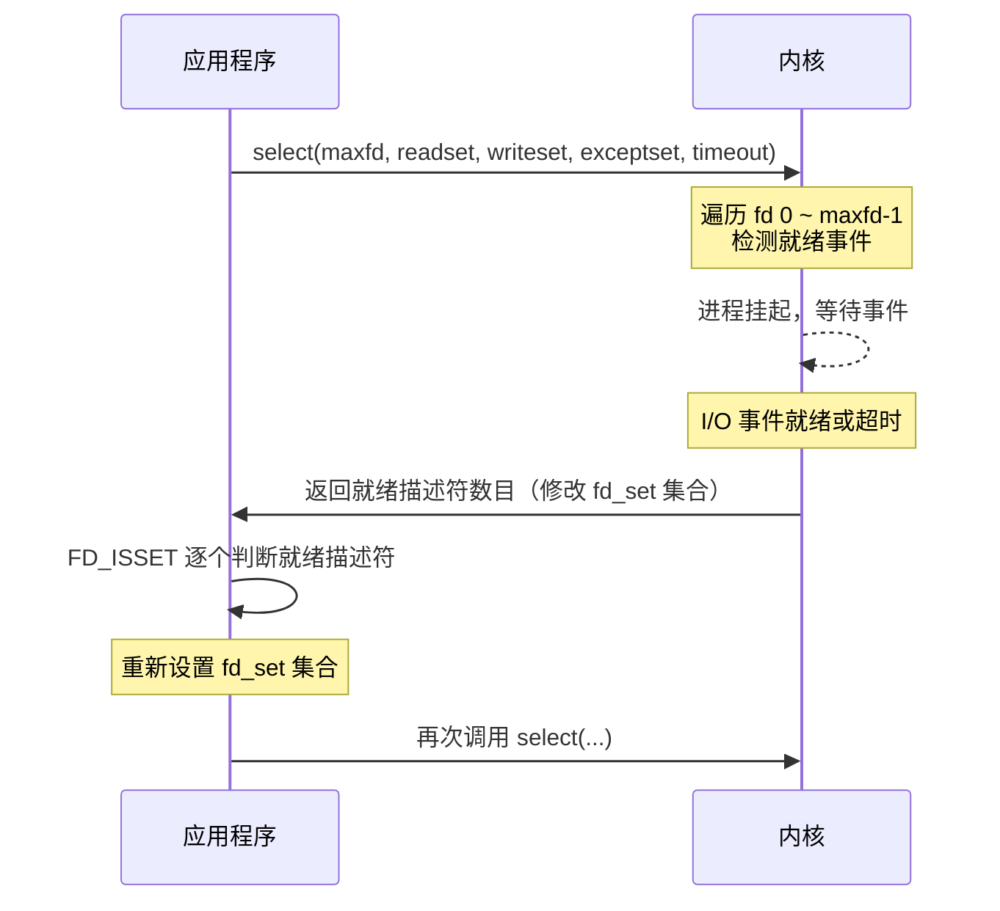
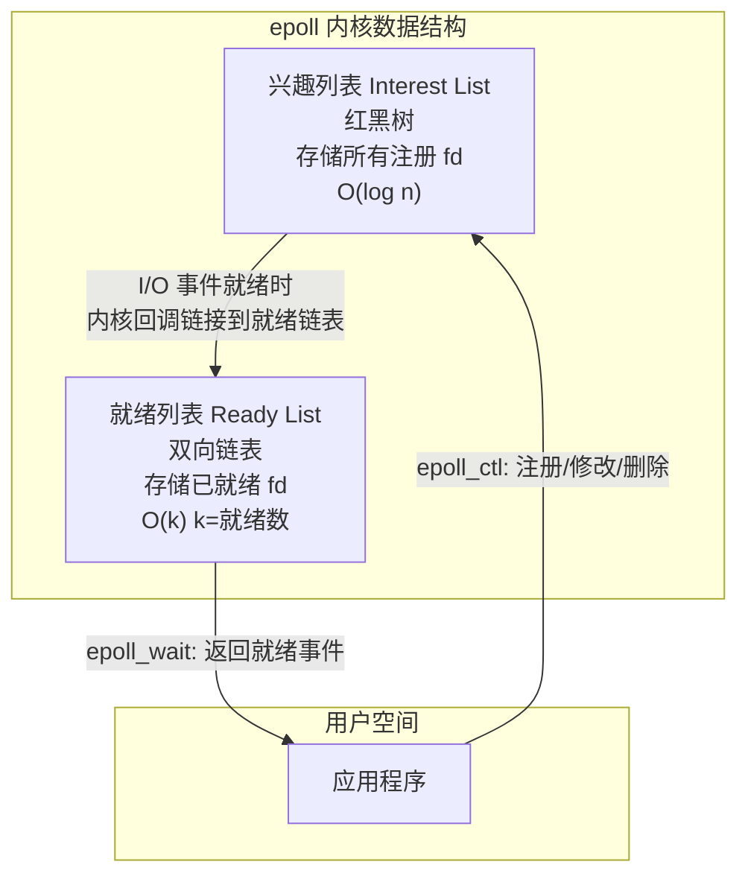

# I/O多路复用：select、poll与epoll详解

I/O 多路复用（I/O Multiplexing）让单个线程同时监控多个 I/O 事件，是高并发网络编程的核心。本文整合 Linux 三大 I/O 多路复用机制：最早的 **select**、改进的 **poll**，以及高性能的 **epoll**，从原理、API、实现到对比全面剖析。

## 第一部分 select 机制

### 1. 什么是 I/O 多路复用

若使用 `fgets` 等待标准输入，则无法在套接字有数据时及时读取；若使用 `read` 等待套接字数据，则无法在标准输入有数据时及时处理。这种互斥等待的问题，正是 I/O 多路复用技术所要解决的。

I/O 多路复用的核心思想：将标准输入、套接字等视为独立的 I/O 通道（路），当任何一路 I/O 发生事件时，由内核通知应用程序进行相应处理，从而使单个线程能够同时监控多个 I/O 事件。

I/O 事件的典型类型：
- 标准输入文件描述符准备好可以读
- 监听套接字上有新的连接已完成建立
- 已连接套接字准备好可以写
- I/O 等待超过指定时间，发生超时事件

### 2. select 函数接口

```c
int select(int maxfd, fd_set *readset, fd_set *writeset,
           fd_set *exceptset, const struct timeval *timeout);
/* 返回值：就绪描述符数目；超时返回0；出错返回-1 */
```

- **maxfd**：待测试的最大描述符编号加 1（如描述符集合 `{0,1,4}` 则 maxfd 为 5），内核需遍历从 0 到 maxfd-1 的描述符位。
- **readset/writeset/exceptset**：三个描述符集合，分别检测可读、可写、异常事件。

**fd_set 操作宏**（fd_set 本质是位图，一位对应一个文件描述符）：

```c
void FD_ZERO(fd_set *fdset);        /* 将集合所有位清零 */
void FD_SET(int fd, fd_set *fdset); /* 将 fd 对应位置1 */
void FD_CLR(int fd, fd_set *fdset); /* 将 fd 对应位清零 */
int  FD_ISSET(int fd, fd_set *fdset);/* 检测 fd 对应位是否为1 */
```

一个 32 位整型可表示 32 个描述符。**`FD_SETSIZE` 限制**：在 Linux 中编译时固定为 1024，意味着 select 最多只能监控 1024 个文件描述符，且无法在运行时修改（不推荐重新编译调整）。

**timeout 参数的三种设置**：

| 设置方式 | 行为 |
|---------|------|
| `NULL` | 无 I/O 事件时永久阻塞 |
| 非零值 | 等待指定时间后返回 |
| `tv_sec = tv_usec = 0` | 立即返回，非阻塞轮询 |

### 3. select 工作流程



**套接字描述符就绪条件**：

- **可读就绪**：接收缓冲区有数据（`read` 不阻塞）、对端发送 FIN（`read` 返回 0）、监听套接字有已完成连接（`accept` 不阻塞）、套接字有错误（`read` 返回 -1）。
- **可写就绪**：发送缓冲区有足够空间（`write` 不阻塞）、连接的写半边已关闭（继续写产生 `SIGPIPE`）、套接字有错误。

**关键实现要点**：
1. 初始化描述符集合（`FD_ZERO` + `FD_SET`）；
2. **每次循环重置集合**（`readmask = allreads`）——select 返回后内核会修改 fd_set 仅保留就绪位，因此每次调用前必须从原始集合恢复；
3. 描述符基数 = 最大描述符编号 + 1。

### 4. select 的局限性

1. **描述符数量限制**：`FD_SETSIZE` 通常为 1024，无法运行时扩展；
2. **线性扫描**：内核遍历 0 到 maxfd-1，时间复杂度 O(n)；
3. **数据拷贝开销**：每次调用需将 fd_set 从用户态拷到内核态，返回再拷回；
4. **集合修改**：返回后内核修改 fd_set，应用必须重置。

这些局限性正是 poll 和 epoll 被引入的原因。

## 第二部分 poll 机制

### 5. poll 函数接口

```c
int poll(struct pollfd *fds, unsigned long nfds, int timeout);
/* 返回值：就绪描述符数目；超时返回0；出错返回-1 */
```

```c
struct pollfd {
    int    fd;       /* 文件描述符 */
    short  events;   /* 待检测的事件（输入） */
    short  revents;  /* 返回的事件（输出） */
};
```

与 select 的关键区别：poll 将输入（`events`）和输出（`revents`）分离，内核仅修改 `revents`，**无需每次调用前重置**。若将 `fd` 设为负值，poll 忽略该条目（`revents` 置 0），可临时屏蔽描述符。

**timeout**：`<0` 永久等待、`0` 立即返回、`>0` 等待指定毫秒数。

**事件类型**：
- 可读：`POLLIN`（有可读数据）、`POLLPRI`（带外数据）、`POLLRDNORM`、`POLLRDBAND`；
- 可写：`POLLOUT`、`POLLWRNORM`、`POLLWRBAND`；
- 错误（仅 revents 返回）：`POLLERR`（错误）、`POLLHUP`（挂起）、`POLLNVAL`（描述符无效）。

### 6. poll 与 select 对比

| 对比维度 | select | poll |
|---------|--------|------|
| 数据结构 | `fd_set` 位图 | `pollfd` 结构体数组 |
| 描述符上限 | `FD_SETSIZE`（通常 1024） | 受系统资源限制（`ulimit -n`） |
| 事件分离 | 输入输出共用同一集合 | `events`/`revents` 分离 |
| 重置需求 | 每次调用后必须重置 | 无需重置 |
| 屏蔽描述符 | 不支持 | `fd = -1` 即可屏蔽 |
| 跨平台 | POSIX 兼容 | POSIX 兼容 |

### 7. 基于 poll 的回显服务器

```c
#define INIT_SIZE 128
int main(int argc, char **argv) {
    int listen_fd, connected_fd, socket_fd;
    int ready_number;
    ssize_t n;
    char buf[MAXLINE];
    struct sockaddr_in client_addr;
    listen_fd = tcp_server_listen(SERV_PORT);

    struct pollfd event_set[INIT_SIZE];
    event_set[0].fd = listen_fd;
    event_set[0].events = POLLRDNORM;
    for (int i = 1; i < INIT_SIZE; i++) event_set[i].fd = -1;

    for (;;) {
        if ((ready_number = poll(event_set, INIT_SIZE, -1)) < 0)
            error(1, errno, "poll failed ");
        if (event_set[0].revents & POLLRDNORM) {
            connected_fd = accept(listen_fd, ...);
            for (int i = 1; i < INIT_SIZE; i++) {  /* 找空闲槽位 */
                if (event_set[i].fd < 0) {
                    event_set[i].fd = connected_fd;
                    event_set[i].events = POLLRDNORM;
                    break;
                }
            }
            if (--ready_number <= 0) continue;
        }
        for (int i = 1; i < INIT_SIZE; i++) {  /* 已连接套接字 */
            if ((socket_fd = event_set[i].fd) < 0) continue;
            if (event_set[i].revents & (POLLRDNORM | POLLERR)) {
                if ((n = read(socket_fd, buf, MAXLINE)) > 0)
                    write(socket_fd, buf, n);
                else if (n == 0 || errno == ECONNRESET) {
                    close(socket_fd);
                    event_set[i].fd = -1;
                }
                if (--ready_number <= 0) break;
            }
        }
    }
}
```

要点：监听套接字放入数组首元素、空闲槽位 `fd=-1` 由 poll 忽略、事件用位与判断、`ready_number` 提前退出优化。

**poll 的局限**：仍存在与 select 相似的性能瓶颈——每次调用需将整个 pollfd 数组在用户态/内核态间拷贝，内核仍线性扫描所有描述符（O(n)）。大规模并发下 epoll 更优。

## 第三部分 epoll 机制

### 8. epoll 内部架构

epoll 的高性能源于其内核数据结构设计：



- **兴趣列表**：红黑树存储所有注册的 fd 及其事件，查找/插入/删除 O(log n)；
- **就绪列表**：双向链表存储已就绪 fd，`epoll_wait` 仅需遍历就绪链表 O(k)。

这避免了 select/poll 的全量扫描，仅处理实际发生事件的描述符。

### 9. epoll API 详解

**epoll_create / epoll_create1**：

```c
int epoll_create(int size);
int epoll_create1(int flags);
```

`epoll_create1()`（Linux 2.6.27+）推荐使用，`EPOLL_CLOEXEC` 标志防止 fd 在 exec 时泄漏到子进程。

**epoll_ctl**：

```c
int epoll_ctl(int epfd, int op, int fd, struct epoll_event *event);
```

| 操作 | 说明 |
|------|------|
| `EPOLL_CTL_ADD` | 注册 fd 及其事件 |
| `EPOLL_CTL_MOD` | 修改已注册 fd 的事件 |
| `EPOLL_CTL_DEL` | 删除 fd 及其事件 |

**关键事件**：

| 事件 | 说明 | 引入版本 |
|------|------|---------|
| `EPOLLIN` / `EPOLLOUT` | 可读 / 可写 | Linux 2.6 |
| `EPOLLRDHUP` | 对端关闭或半关闭 | Linux 2.6.17 |
| `EPOLLHUP` | 描述符挂起 | Linux 2.6 |
| `EPOLLET` | 边缘触发模式 | Linux 2.6 |
| `EPOLLONESHOT` | 一次性事件，需重新武装 | Linux 2.6.2 |
| `EPOLLEXCLUSIVE` | 排他唤醒，避免惊群 | Linux 4.5 |

> **EPOLLONESHOT**：触发一次后自动禁用，需 `EPOLL_CTL_MOD` 重新武装，适用多线程场景避免竞态。
> **EPOLLEXCLUSIVE**：多个进程/线程共享监听同一 fd 时仅唤醒一个等待者，缓解 accept 惊群；多进程 accept 负载均衡的另一路线是 `SO_REUSEPORT`（各进程独立监听同一端口、内核按哈希分配连接，Nginx 采用后者），二者互为替代。

**epoll_wait / epoll_pwait / epoll_pwait2**：

```c
int epoll_wait(int epfd, struct epoll_event *events, int maxevents, int timeout);
int epoll_pwait(int epfd, ..., const sigset_t *sigmask);        /* Linux 2.6.19+ */
int epoll_pwait2(int epfd, ..., const struct timespec *timeout, const sigset_t *sigmask); /* Linux 5.11+ */
```

与 select/poll 关键区别：**仅返回就绪事件**，应用无需遍历所有注册描述符。`epoll_pwait` 增加信号掩码（原子替换避免竞态）；`epoll_pwait2` 提供纳秒级超时精度。

**epoll 资源限制**：`/proc/sys/fs/epoll/max_user_watches`（单用户可注册的监控总数）、`max_user_instances`（单用户可创建的 epoll 实例数，默认通常 128）。

### 10. 边缘触发（ET）与条件触发（LT）

| 维度 | 条件触发 (LT) | 边缘触发 (ET) |
|------|-------------|-------------|
| 触发条件 | 只要缓冲区非空就持续触发 | 仅在状态从"空"变为"非空"时触发一次 |
| 数据读取 | 可部分读取 | 必须循环读取直到 `EAGAIN` |
| 编程复杂度 | 较低 | 较高，需确保数据不遗漏 |
| 性能 | 略低（可能多次不必要的唤醒） | 更高（减少不必要的唤醒次数） |
| 与 select/poll 关系 | 行为一致 | epoll 独有 |
| 适用场景 | 通用场景，从 select/poll 迁移 | 高并发、低延迟场景 |

> 实践建议：ET 性能更优但编程要求高（必须循环读取直到 `EAGAIN`）；LT 编程简单，与 select/poll 行为一致。**Nginx 默认用 ET，Redis 用 LT**，均取得优异性能。

**基于 epoll 的服务器**：创建 epoll 实例 → 注册监听套接字（`EPOLLIN|EPOLLET`）→ 事件循环处理 → 边缘触发模式下必须在循环内持续读取直到 `EAGAIN` 避免丢数据。

### 11. epoll 的历史

Windows 1994 年引入 IOCP，FreeBSD 2000 年引入 Kqueue。Linux 2002 年在 2.5.44 引入 epoll。epoll 作者 Davide Libenzi 将接口设计为 `epoll_ctl` 和 `epoll_wait` 两个独立调用，并增加 `epoll_create`（区别于 Kqueue 的单一 `kevent` 接口）；Linus 对此表示认同，认为"数组方式可取、队列方式不可取"。epoll 在 2.6 系列趋于稳定，为 Linux 高性能网络 I/O 奠定基础。

### 12. Busy Poll 机制

对于极低延迟场景，Linux 提供 Busy Poll，允许在 `epoll_wait` 返回前主动轮询网卡 NAPI 队列，跳过中断处理。系统级配置 `/proc/sys/net/core/busy_poll`；Linux 6.9+ 增加针对单个 epoll 实例的 ioctl 接口（`EPIOCSPARAMS`/`EPIOCGPARAMS`），支持按 epoll 上下文配置 busy poll 参数。以 CPU 使用率为代价换取更低延迟，适用高频交易等场景。

## 总结

**select**：`fd_set` 位图 + 线性扫描，受 `FD_SETSIZE`（1024）限制，每次需重置集合；就绪条件是"调用 read/write 不阻塞"。

**poll**：`pollfd` 数组 + `events`/`revents` 分离，突破 1024 限制，无需重置；但仍线性扫描 + 全量拷贝。

**epoll**：红黑树兴趣列表 + 就绪链表回调，O(1) 事件通知，仅返回就绪事件；支持边缘/条件触发，无描述符硬限制（受 `max_user_watches` 约束）。

选择建议：小规模、简单场景 select/poll 够用；高并发（C10K）场景用 epoll。ET 性能更高但编程复杂，LT 与 select/poll 行为一致便于迁移。

## 思考题

1. select 能否对 UNIX 管道（pipe）进行检测？其就绪条件是什么？
2. 修改 select 示例不调用 read，观察 select 行为——select 是边缘触发还是条件触发？（对比 poll、epoll）
3. 基于 poll 的回显服务器如何实现 pollfd 数组的动态扩展？

## 版本信息

| 项目 | 说明 |
|------|------|
| 更新日期 | 2026-06-09 |
| 目标内核 | Linux 7.0 |
| select | POSIX.1-2001；FD_SETSIZE=1024（编译时固定） |
| poll | POSIX.1-2001；描述符上限受 RLIMIT_NOFILE |
| epoll_create | Linux 2.6；size 自 2.6.8 忽略 |
| epoll_create1 | Linux 2.6.27；支持 EPOLL_CLOEXEC |
| EPOLLONESHOT | Linux 2.6.2 |
| EPOLLEXCLUSIVE | Linux 4.5 |
| EPOLLRDHUP | Linux 2.6.17 |
| epoll_pwait / epoll_pwait2 | Linux 2.6.19 / 5.11 |
| Busy Poll | Linux 3.11 全局 sysctl；Linux 6.9 per-epoll ioctl |

---
