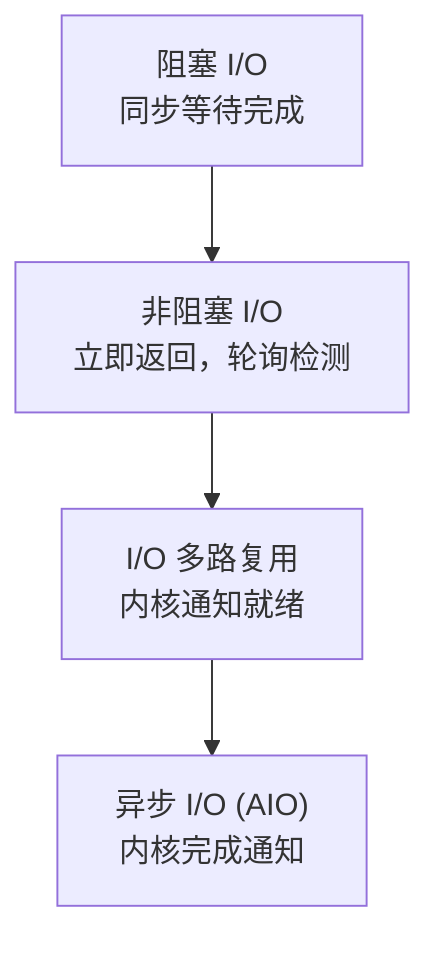
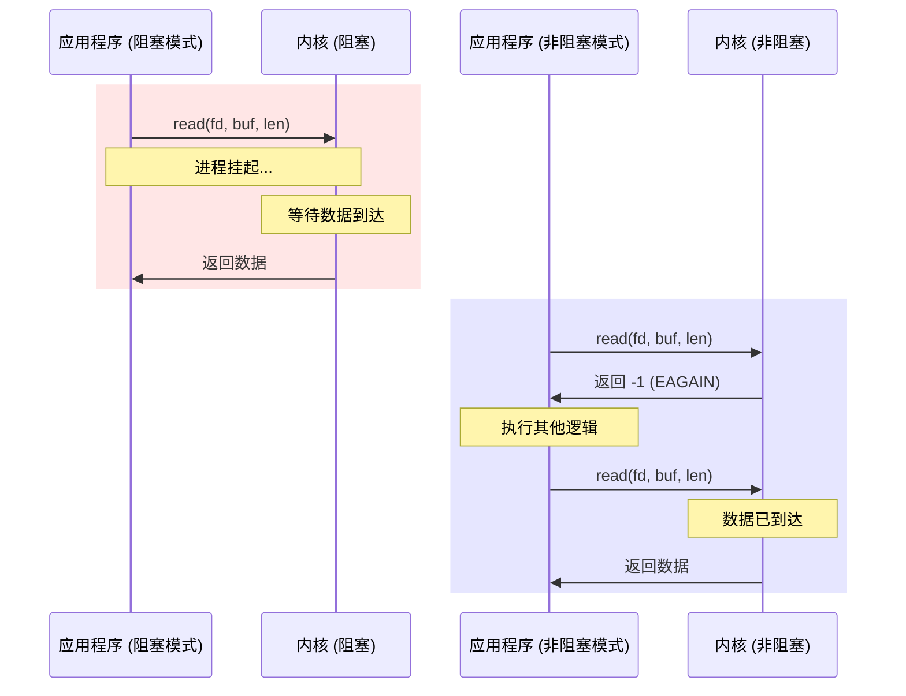
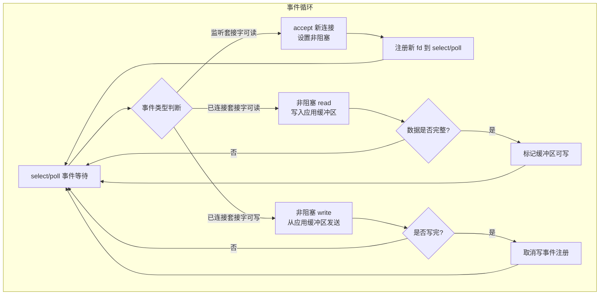

# 非阻塞I/O模型

在上一讲中，介绍了 select 和 poll 两种 I/O 多路复用技术。本文讨论非阻塞 I/O（Non-blocking I/O）模型。非阻塞 I/O 配合 I/O 多路复用，是高性能网络编程中的核心组合技术。

## 阻塞 I/O 与非阻塞 I/O

### 概念对比

当应用程序调用阻塞 I/O 执行某个操作时，若内核尚未完成该操作，应用程序将被挂起，CPU 时间被调度给其他进程。此时网络应用程序无法执行任何有效工作。

非阻塞 I/O 则不同：当应用程序调用非阻塞 I/O 执行某个操作时，若操作无法立即完成，内核立即返回一个错误码（`EAGAIN` 或 `EWOULDBLOCK`），应用程序不会被挂起，可以继续执行其他逻辑或轮询重试。

### I/O 模型演进



四种 I/O 模型的行为类比：

| 模型 | 类比 | 特征 |
|------|------|------|
| 阻塞 I/O | 在书店等待直到找到书 | 同步等待，进程挂起让出 CPU |
| 非阻塞 I/O | 反复去书店询问是否有书 | 轮询检测，CPU 消耗高 |
| I/O 多路复用 | 留电话，到货通知 | 内核通知，高效等待 |
| 异步 I/O | 留地址，到货直接寄到家中 | 内核完成全部操作后通知 |

### 阻塞 vs 非阻塞 I/O 行为对比



## 非阻塞 I/O 的应用场景

非阻塞 I/O 可应用于读操作、写操作、接收连接和发起连接四种场景。

### 读操作（read）

若套接字接收缓冲区无数据可读，非阻塞模式下 `read` 调用立即返回 -1，`errno` 设为 `EWOULDBLOCK` 或 `EAGAIN`。应用程序需正确处理此错误码，择机再次调用 `read`，而非将其视为致命错误。

### 写操作（write）

在阻塞模式下，`write` 函数返回的字节数通常等于请求写入的字节数——这意味着阻塞模式下 `write` 会等待直到所有数据被拷贝到发送缓冲区。

在非阻塞模式下，若发送缓冲区空间不足，内核会尽可能多地拷贝数据，并返回实际写入的字节数。可能的情况包括：一个字节也未拷贝（返回 -1，`EAGAIN`），或部分数据被拷贝（返回值小于请求长度）。

两种模式的核心差异：

- **阻塞 I/O**：拷贝 -> 等待所有数据拷贝完成 -> 返回
- **非阻塞 I/O**：拷贝 -> 立即返回实际写入量 -> 再次拷贝未完成部分 -> 返回

实际编程中，可通过统一的循环写入函数（如 `writen`）处理两种模式：

```c
/* 向文件描述符 fd 写入 n 字节数据 */
ssize_t writen(int fd, const void * data, size_t n)
{
    size_t      nleft;
    ssize_t     nwritten;
    const char  *ptr;

    ptr = data;
    nleft = n;
    while (nleft > 0) {
        if ((nwritten = write(fd, ptr, nleft)) <= 0) {
            /* 非阻塞模式下 EAGAIN 表示需再次调用 */
            if (nwritten < 0 && errno == EAGAIN)
                nwritten = 0;
            else
                return -1;         /* 出错退出 */
        }

        nleft -= nwritten;
        ptr   += nwritten;
    }
    return n;
}
```

### read/write 行为总结

| 操作 | 缓冲区状态 | 阻塞模式行为 | 非阻塞模式行为 |
|------|-----------|-------------|---------------|
| `read` | 接收缓冲区有数据 | 立即返回，返回实际读取字节数 | 立即返回，返回实际读取字节数 |
| `read` | 接收缓冲区为空 | 阻塞等待数据到达 | 立即返回 -1，`EAGAIN` |
| `write` | 发送缓冲区充足 | 拷贝全部数据后返回 | 拷贝全部数据后返回 |
| `write` | 发送缓冲区不足 | 阻塞等待空间可用 | 尽可能拷贝，返回实际写入字节数 |
| `write` | 对端已关闭 | 返回实际写入字节数，再次写入返回 -1 | 同左 |

关于 `read` 和 `write` 的关键结论：

1. `read` 在接收缓冲区有数据时立即返回，不会等待缓冲区填满。当接收缓冲区为空时，阻塞模式等待，非阻塞模式立即返回 -1 并置 `EAGAIN`。
2. 阻塞模式下，`write` 仅在发送缓冲区足以容纳全部输出字节时才返回；非阻塞模式下，则尽可能写入并返回实际写入字节数。
3. 若对端关闭连接，阻塞模式的 `write` 仍会立即返回实际写入字节数；再次写入则返回 -1。

### accept 操作

当 `accept` 与 select、poll 等 I/O 多路复用配合使用时，若监听套接字触发可读事件，调用 `accept` 通常可以成功返回已连接套接字。但存在一种边界情况：在 select/poll 返回就绪通知与 `accept` 调用之间的时间窗口内，客户端可能发送了 RST 分节，导致内核将已完成连接从队列中移除，此时 `accept` 在阻塞模式下将无限期阻塞，线程无法继续处理其他 I/O 事件。

以下客户端代码可触发此场景——设置 `SO_LINGER` 选项使连接关闭时发送 RST：

```c
struct linger ling;
ling.l_onoff = 1;
ling.l_linger = 0;
setsockopt(socket_fd, SOL_SOCKET, SO_LINGER, &ling, sizeof(ling));
close(socket_fd);
```

服务器端若在监听套接字就绪后延迟调用 `accept`（模拟高并发场景），RST 分节可能导致已完成队列为空：

```c
if (FD_ISSET(listen_fd, &readset)) {
    printf("listening socket readable\n");
    sleep(5);  /* 模拟处理延迟 */
    struct sockaddr_storage ss;
    socklen_t slen = sizeof(ss);
    int fd = accept(listen_fd, (struct sockaddr *) &ss, &slen);
```

**解决方案**：将监听套接字设置为非阻塞模式。此时 `accept` 在无已完成连接时立即返回 -1 并置 `EAGAIN`，应用程序可安全忽略此错误码并继续事件循环。

> **实践建议**：在高性能网络编程中，监听套接字和已连接套接字均应设置为非阻塞模式。

### connect 操作

在非阻塞 TCP 套接字上调用 `connect`，会立即返回 `EINPROGRESS` 错误，表示连接正在建立中。TCP 三次握手在后台继续进行，应用程序可并行执行其他初始化工作。连接建立成功或失败后，通过 select、poll 等 I/O 多路复用机制检测连接状态。

## 非阻塞 I/O + select 多路复用架构



以下是一个非阻塞 I/O 配合 select 多路复用的完整服务器示例：

```c
#define MAX_LINE 1024
#define FD_INIT_SIZE 128

char rot13_char(char c) {
    if ((c >= 'a' && c <= 'm') || (c >= 'A' && c <= 'M'))
        return c + 13;
    else if ((c >= 'n' && c <= 'z') || (c >= 'N' && c <= 'Z'))
        return c - 13;
    else
        return c;
}

/* 数据缓冲区结构 */
struct Buffer {
    int connect_fd;           /* 连接描述符 */
    char buffer[MAX_LINE];    /* 实际缓冲 */
    size_t writeIndex;        /* 缓冲写入位置 */
    size_t readIndex;         /* 缓冲读取位置 */
    int readable;             /* 是否可读 */
};

struct Buffer *alloc_Buffer() {
    struct Buffer *buffer = malloc(sizeof(struct Buffer));
    if (!buffer)
        return NULL;
    buffer->connect_fd = 0;
    buffer->writeIndex = buffer->readIndex = buffer->readable = 0;
    return buffer;
}

void free_Buffer(struct Buffer *buffer) {
    free(buffer);
}

int onSocketRead(int fd, struct Buffer *buffer) {
    char buf[1024];
    int i;
    ssize_t result;
    while (1) {
        result = recv(fd, buf, sizeof(buf), 0);
        if (result <= 0)
            break;

        for (i = 0; i < result; ++i) {
            if (buffer->writeIndex < sizeof(buffer->buffer))
                buffer->buffer[buffer->writeIndex++] = rot13_char(buf[i]);
            if (buf[i] == '\n') {
                buffer->readable = 1;  /* 标记缓冲区可读 */
            }
        }
    }

    if (result == 0) {
        return 1;
    } else if (result < 0) {
        if (errno == EAGAIN)
            return 0;
        return -1;
    }

    return 0;
}

int onSocketWrite(int fd, struct Buffer *buffer) {
    while (buffer->readIndex < buffer->writeIndex) {
        ssize_t result = send(fd, buffer->buffer + buffer->readIndex,
                              buffer->writeIndex - buffer->readIndex, 0);
        if (result < 0) {
            if (errno == EAGAIN)
                return 0;
            return -1;
        }

        buffer->readIndex += result;
    }

    if (buffer->readIndex == buffer->writeIndex)
        buffer->readIndex = buffer->writeIndex = 0;

    buffer->readable = 0;

    return 0;
}

int main(int argc, char **argv) {
    int listen_fd;
    int i, maxfd;

    struct Buffer *buffer[FD_INIT_SIZE];
    for (i = 0; i < FD_INIT_SIZE; ++i) {
        buffer[i] = alloc_Buffer();
    }

    listen_fd = tcp_nonblocking_server_listen(SERV_PORT);

    fd_set readset, writeset, exset;
    FD_ZERO(&readset);
    FD_ZERO(&writeset);
    FD_ZERO(&exset);

    while (1) {
        maxfd = listen_fd;

        FD_ZERO(&readset);
        FD_ZERO(&writeset);
        FD_ZERO(&exset);

        /* 监听套接字加入 readset */
        FD_SET(listen_fd, &readset);

        for (i = 0; i < FD_INIT_SIZE; ++i) {
            if (buffer[i]->connect_fd > 0) {
                if (buffer[i]->connect_fd > maxfd)
                    maxfd = buffer[i]->connect_fd;
                FD_SET(buffer[i]->connect_fd, &readset);
                if (buffer[i]->readable) {
                    FD_SET(buffer[i]->connect_fd, &writeset);
                }
            }
        }

        if (select(maxfd + 1, &readset, &writeset, &exset, NULL) < 0) {
            error(1, errno, "select error");
        }

        if (FD_ISSET(listen_fd, &readset)) {
            printf("listening socket readable\n");
            sleep(5);
            struct sockaddr_storage ss;
            socklen_t slen = sizeof(ss);
            int fd = accept(listen_fd, (struct sockaddr *) &ss, &slen);
            if (fd < 0) {
                error(1, errno, "accept failed");
            } else if (fd > FD_INIT_SIZE) {
                error(1, 0, "too many connections");
                close(fd);
            } else {
                make_nonblocking(fd);
                if (buffer[fd]->connect_fd == 0) {
                    buffer[fd]->connect_fd = fd;
                } else {
                    error(1, 0, "too many connections");
                }
            }
        }

        for (i = 0; i < maxfd + 1; ++i) {
            int r = 0;
            if (i == listen_fd)
                continue;

            if (FD_ISSET(i, &readset)) {
                r = onSocketRead(i, buffer[i]);
            }
            if (r == 0 && FD_ISSET(i, &writeset)) {
                r = onSocketWrite(i, buffer[i]);
            }
            if (r) {
                buffer[i]->connect_fd = 0;
                close(i);
            }
        }
    }
}
```

### 关键实现要点

**1. 设置非阻塞模式**

```c
fcntl(fd, F_SETFL, O_NONBLOCK);
```

使用 `fcntl` 系统调用将套接字设置为非阻塞模式。

**2. 应用层缓冲区**

本程序抽象了 `Buffer` 结构体，使用 `readIndex` 和 `writeIndex` 分别标识缓冲区的读写位置，解决非阻塞 I/O 中数据可能不完整的问题。

**3. 按需注册写事件**

仅在缓冲区有数据待发送时（`readable == 1`），才将连接套接字注册到 `writeset`。这避免了不必要的可写事件触发——当发送缓冲区未满时，套接字几乎始终可写，持续注册写事件将导致 busy-loop。

**4. 非阻塞读写的错误处理**

`onSocketRead` 和 `onSocketWrite` 中，对 `EAGAIN` 错误码做特殊处理——返回 0 表示暂无数据可读/写，而非错误。这是非阻塞 I/O 编程的标准模式。

## 实验

启动服务器：

```
$ ./nonblockingserver
```

使用多个 telnet 客户端连接验证：

```
$ telnet 127.0.0.1 43211
Trying 127.0.0.1...
Connected to localhost.
Escape character is '^]'.
fasfasfasf
snfsnfsnfs
```

## 总结

非阻塞 I/O 适用于 read、write、accept、connect 等多种操作场景。单独使用非阻塞 I/O 时，轮询方式会导致 CPU 占用率过高；因此，非阻塞 I/O 通常与 select、poll 等 I/O 多路复用机制配合使用——由多路复用机制负责等待事件就绪，事件就绪后执行非阻塞 I/O 操作。这种组合模式是 Linux 高性能网络编程的基础范式：

- **监听套接字必须设为非阻塞**，防止 `accept` 在边界情况下无限阻塞
- **已连接套接字应设为非阻塞**，避免 `read`/`write` 阻塞整个事件循环
- **应用层需要维护缓冲区**，处理非阻塞 I/O 中数据不完整的情况
- **按需注册写事件**，避免可写事件导致的 busy-loop

## 思考题

1. 程序中以下判断的含义是什么？如何改进？

```c
else if (fd > FD_INIT_SIZE) {
    error(1, 0, "too many connections");
    close(fd);
```

2. 本程序使用单个 `Buffer` 对象管理读写，而非分离的读写缓冲区。这种设计的目的和权衡是什么？

## 版本信息

| 项目 | 说明 |
|------|------|
| 更新日期 | 2026-06-09 |
| 目标内核 | Linux 7.0 |
| 关键接口 | `fcntl(F_SETFL, O_NONBLOCK)` — POSIX.1-2001 |
| 错误码 | `EAGAIN` / `EWOULDBLOCK` — POSIX.1-2001 |
| 非阻塞 accept | 建议 `listen_fd` 始终设为非阻塞模式 |
