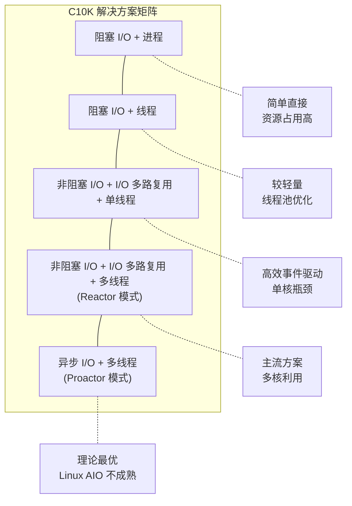
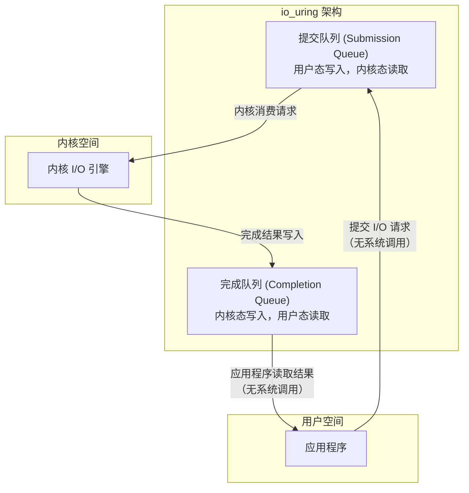
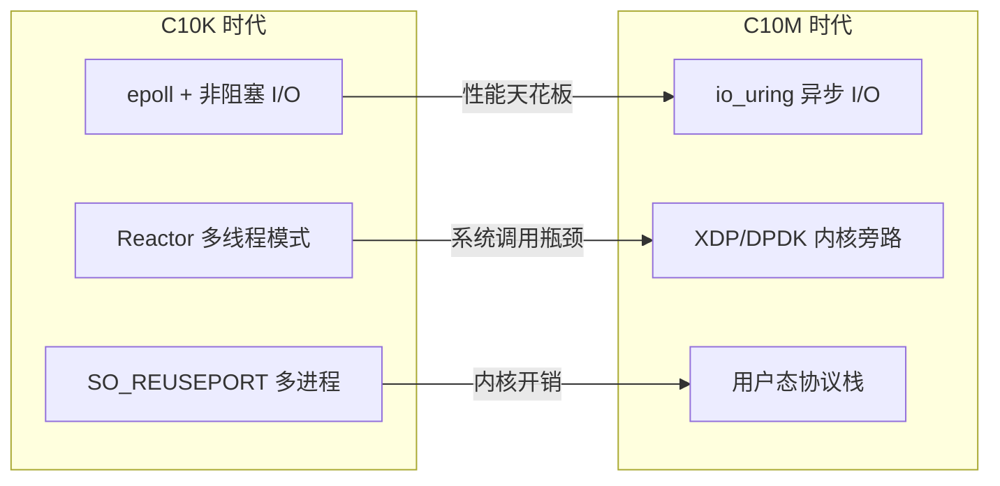

# 高并发网络模型：从C10K到C10M

在前两讲中，陆续介绍了 select、poll、epoll 等 I/O 多路复用技术以及非阻塞 I/O 模型，为高性能网络编程提供了必要的知识储备。本文从历史上著名的 C10K 问题出发，系统梳理高性能网络编程的方法论，并展望 C10M 时代的挑战与解决方案。

## C10K 问题

### 问题背景

随着互联网的蓬勃发展，如何在单台物理服务器上以最低成本满足高性能、高并发的需求，成为计算机工业界面临的核心挑战。2000 年前后，互联网用户数量急剧增长，单机服务用户数从百级跃升至万级。若仍沿用传统的单机架构，服务成本将远超预期。

C10K 问题的定义：**如何在一台物理服务器上同时服务 10000 个并发连接？** 其中 C 表示 Concurrency（并发），10K 等于 10000。

得益于操作系统与编程框架的发展，当前使用 Java Netty、libevent 等框架即可轻松编写支持万级并发的服务器程序，经优化后可达十万乃至百万级并发。但在二十年前，突破 C10K 是一项重要的技术里程碑。

C10K 问题由工程师 Dan Kegel 提出并归纳，详细信息可参考 [The C10K Problem](http://www.kegel.com/c10k.html)。

## 操作系统层面的资源分析

C10K 问题本质上是一个操作系统层面的问题。在一台主机上同时支持 10000 个连接，需要评估以下资源维度。

### 文件描述符（File Descriptor）

每个客户端连接对应一个文件描述符。若文件描述符不足，新连接将被拒绝：

```
Socket/File: Can't open so many files
```

Linux 下单个进程可打开的文件描述符数默认限制为 1024：

```
$ ulimit -n
1024
```

可通过修改 `/etc/sysctl.conf` 提升系统级限制：

```
fs.file-max = 100000
net.ipv4.ip_conntrack_max = 100000
```

同时需调整进程级限制：

```
# 临时调整
ulimit -n 100000

# 永久调整（/etc/security/limits.conf）
* soft nofile 100000
* hard nofile 100000
```

### 系统内存

每个 TCP 连接除套接字外，还需占用发送缓冲区（Send Buffer）和接收缓冲区（Receive Buffer）。以下为 Linux 7.0 内核下的默认缓冲区参数：

```
$ cat /proc/sys/net/ipv4/tcp_wmem
4096	16384	4194304
$ cat /proc/sys/net/ipv4/tcp_rmem
4096	87380	6291456
```

三个值分别表示最小分配值、默认分配值和最大分配值（单位：字节）。按默认值计算，10000 个连接的内存消耗：

```
发送缓冲区：16384 × 10000 ≈ 160 MB
接收缓冲区：87380 × 10000 ≈ 880 MB
```

应用程序本身也需要缓冲区进行数据收发。假设每个连接需要 128 KB 应用层缓冲，10000 个连接约需 1.2 GB。

**结论**：支持 10000 个并发连接，内存并非瓶颈。

### 网络带宽

假设 10000 个连接，每个连接每秒传输约 1 KB 数据：

```
10000 × 1 KB/s × 8 = 80 Mbps
```

在万兆网卡（10 Gbps）普及的当下，80 Mbps 的带宽需求微不足道。

## C10K 解决方案

通过资源分析可知，C10K 在系统资源层面是可行的。但资源充足并不意味着程序能高效利用——设计不当的程序在低并发下表现良好，高并发时性能可能呈指数级下降。例如，基于 select 的经典程序在单台服务器上可处理 1000 并发，但在性能翻倍的服务器上往往无法处理 2000 并发。

解决 C10K 问题需从两个维度统筹考虑：

1. **I/O 事件感知**：应用程序如何与操作系统配合，高效感知上万个套接字上的 I/O 事件？
2. **计算资源分配**：应用程序如何分配进程、线程资源来服务上万个连接？

两个维度的组合形成了以下解决方案：



### 方案一：阻塞 I/O + 进程

每个连接通过 `fork` 派生一个子进程处理。由于独立子进程负责该连接的所有 I/O，即使使用阻塞 I/O，多个连接之间也不会互相影响。

```c
do {
    accept connections
    fork for connected connection fd
    process_run(fd)
} while(true)
```

此方案实现简单，但进程创建和切换开销大，扩展性差，资源占用率高。适用于连接数较少的场景。

### 方案二：阻塞 I/O + 线程

线程是比进程更轻量的资源模型。为每个连接创建独立线程，可达到与进程模型类似的效果：

```c
do {
    accept connections
    pthread_create for connected connection fd
    thread_run(fd)
} while(true)
```

由于线程创建仍有开销，且并非每个连接时刻都需要服务，更优的做法是使用线程池（Thread Pool）在多个连接间复用线程：

```c
create thread pool
do {
    accept connections
    get connection fd
    push_queue(fd)
} while(true)
```

### 方案三：非阻塞 I/O + I/O 多路复用 + 单线程

应用程序可轮询套接字集合以检测 I/O 事件：

```c
for fd in fdset {
    if (is_readable(fd) == true) {
        handle_read(fd)
    } else if (is_writeable(fd) == true) {
        handle_write(fd)
    }
}
```

但轮询 10000 个描述符将消耗大量 CPU 时间，且极可能在一个循环内无任何描述符就绪。

更高效的方式是让操作系统通知哪些套接字就绪，在此之前将 CPU 控制权交出——即 select、poll 等 I/O 多路复用机制：

```c
do {
    poller.dispatch()
    for fd in registered_fdset {
        if (is_readable(fd) == true) {
            handle_read(fd)
        } else if (is_writeable(fd) == true) {
            handle_write(fd)
        }
    }
} while(true)
```

但此方式在 dispatch 返回后仍需逐个排查所有注册的描述符。若仅返回有 I/O 事件的描述符，效率将大幅提升——这正是 epoll 的设计：

```c
do {
    poller.dispatch()
    for fd_event in active_event_set {
        if (is_readable_event(fd_event) == true) {
            handle_read(fd_event)
        } else if (is_writeable_event(fd_event) == true) {
            handle_write(fd_event)
        }
    }
} while(true)
```

Linux 是互联网服务器的基石，epoll 成为解决 C10K 问题的核心机制。FreeBSD 的 Kqueue、Windows 的 IOCP、Solaris 的 `/dev/poll` 均为各操作系统对同类问题的解决方案。

### 方案四：非阻塞 I/O + I/O 多路复用 + 多线程（Reactor 模式）

单线程方案无法利用多核 CPU。引入多线程后，每个核心可作为独立的 I/O 分发器，形成主从 Reactor（Master-Slave Reactor）模式。

基于 epoll/poll/select 的 I/O 事件分发器称为 Reactor，也称为事件驱动（Event-Driven）或事件循环（Event Loop）。

> **SO_REUSEPORT**（Linux 3.9+）：此套接字选项允许多个进程/线程绑定同一端口，内核自动在多个监听套接字间分配新连接，避免了单点 accept 瓶颈和惊群效应。这是多进程 Reactor 模式的重要优化：

```c
int optval = 1;
setsockopt(listen_fd, SOL_SOCKET, SO_REUSEPORT, &optval, sizeof(optval));
```

`SO_REUSEPORT` 的关键特性：

| 特性 | 说明 |
|------|------|
| 连接分配 | 内核按哈希算法将新连接分配到各监听套接字 |
| 惊群避免 | 仅唤醒一个进程处理新连接 |
| 负载均衡 | 内核级分配，比应用层 accept 锁更高效 |
| 热升级 | 新进程可绑定同一端口，实现零停机部署 |

### 方案五：异步 I/O + 多线程（Proactor 模式）

异步非阻塞 I/O 模型中，调用立即返回，操作系统在后台完成 I/O 操作，完成后通过信号或回调函数通知应用程序。

Linux 下的 AIO 机制在文件 I/O 场景有一定应用，但网络 I/O 的 AIO 支持长期不完善。传统 Linux AIO（`io_submit` 系列接口）存在诸多限制，而 io_uring 的出现为 Linux 异步 I/O 带来了根本性变革。

## 从 C10K 到 C10M

### C10M 问题的定义

C10M 问题：**如何在单台物理服务器上同时服务 1000 万（10M）个并发连接？**

C10K 到 C10M 不仅是数量级的提升，更涉及架构范式的根本转变。C10K 时代的关键瓶颈在 I/O 多路复用效率，而 C10M 时代的瓶颈则转移到内核协议栈开销和系统调用成本。

### C10M 的核心瓶颈

| 瓶颈 | 说明 |
|------|------|
| 系统调用开销 | 每次读写需用户态-内核态切换，千万级连接下开销巨大 |
| 内核协议栈处理 | TCP/IP 协议栈的内存拷贝、中断处理成为瓶颈 |
| 中断处理 | 网卡中断集中在少数 CPU 核心，形成热点 |
| 内存带宽 | 千万级连接的缓冲区数据搬移消耗大量内存带宽 |

### io_uring：C10M 时代的解决方案

io_uring 是 Linux 5.1（2019 年）引入的全新异步 I/O 接口，由 Jens Axboe 设计。它通过共享环形缓冲区（Ring Buffer）实现用户态与内核态的零拷贝通信，从根本上减少了系统调用开销。



io_uring 的核心优势：

| 优势 | 说明 |
|------|------|
| 零系统调用 | 通过共享内存提交请求和获取结果，批量操作仅需一次 `io_uring_enter` |
| 批量提交 | 一次提交多个 I/O 请求，减少上下文切换 |
| 异步模型 | 真正的异步 I/O，无需轮询 |
| 支持网络 I/O | 支持 accept、read、write、connect 等网络操作 |
| 可扩展性 | 随连接数增长性能下降极小 |

> **内核版本注记**：io_uring 自 Linux 5.1 引入，在 5.x 系列中持续增强。Linux 7.0 中 io_uring 已高度成熟，支持网络 I/O、文件 I/O、超时、信号等多种操作，是构建 C10M 级网络服务的推荐接口。

### C10M 的其他关键技术

| 技术 | 说明 | 引入版本 |
|------|------|---------|
| XDP (eXpress Data Path) | 在网卡驱动层处理数据包，绕过内核协议栈 | Linux 4.8 |
| DPDK | 用户态网卡驱动，完全绕过内核 | 第三方库 |
| SO_REUSEPORT | 多进程/线程绑定同一端口，内核级负载均衡 | Linux 3.9 |
| RPS/RFS | 将网卡中断分发到多核处理 | Linux 2.6.35 |
| io_uring | 零系统调用异步 I/O | Linux 5.1 |

### C10K 与 C10M 方案对比



## 总结

C10K 问题的解决需从两个维度考虑：

- **I/O 事件感知**：如何高效感知上万个套接字的 I/O 事件
- **计算资源分配**：如何分配进程、线程资源服务上万个连接

在 Linux 下，解决 C10K 的主流方案是 **非阻塞 I/O + epoll + 多线程（Reactor 模式）**，辅以 `SO_REUSEPORT` 实现多进程负载均衡。

从 C10K 迈向 C10M，核心瓶颈从 I/O 多路复用效率转移到系统调用开销和内核协议栈处理。io_uring 通过共享环形缓冲区实现零系统调用的异步 I/O，XDP/DPDK 通过内核旁路消除协议栈开销，是 C10M 时代的关键技术。

## 思考题

1. 著名的 Netty 网络编程框架采用的是哪种 C10K 解决方案？其线程模型是如何设计的？

2. C10M 问题中，io_uring 相比 epoll 的核心优势是什么？在什么场景下 epoll 仍然是更优的选择？

## 版本信息

| 项目 | 说明 |
|------|------|
| 更新日期 | 2026-06-09 |
| 目标内核 | Linux 7.0 |
| SO_REUSEPORT | Linux 3.9 — 多进程/线程绑定同一端口 |
| io_uring | Linux 5.1 — 零系统调用异步 I/O |
| XDP | Linux 4.8 — 网卡驱动层数据包处理 |
| RPS/RFS | Linux 2.6.35 — 网卡中断多核分发 |
| tcp_wmem 默认值 | 4096 / 16384 / 4194304（min/default/max） |
| tcp_rmem 默认值 | 4096 / 87380 / 6291456（min/default/max） |
