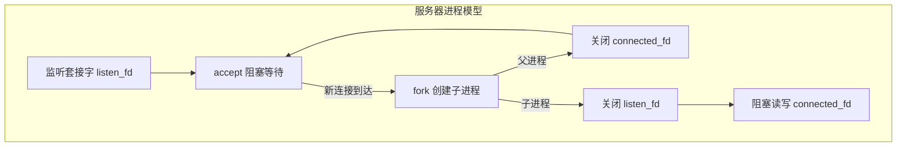
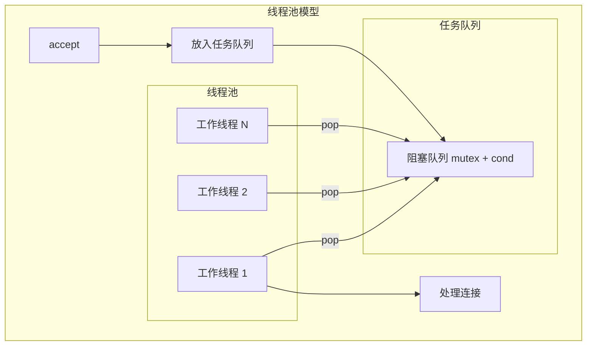

# 阻塞I/O并发模型：进程与线程

C10K 问题（Concurrent 10K Connections）推动了对并发模型的探索。最直接有效的方案之一是为每个连接创建独立的进程或线程进行服务。本文整合阻塞 I/O 的两大并发模型：**fork 进程模型**（process-per-connection）与 **POSIX 线程模型**（thread-per-connection / 线程池），从原理、API、实现到对比全面剖析。

## 第一部分 进程模型（process-per-connection）

### 1. fork 创建子进程

进程是操作系统资源分配的最小单位，拥有独立地址空间、程序计数器等运行时上下文。Linux 通过 `fork()` 创建新进程：

```c
pid_t fork(void);
// 返回值：子进程中返回 0，父进程中返回子进程 PID，出错返回 -1
```

`fork()` 调用一次，在父进程和子进程中各返回一次：父进程获得子进程 PID，子进程获得 0。`fork()` 执行时内核将父进程完整运行状态克隆至子进程（地址空间、打开的文件描述符、程序计数器等）。经典范式：

```c
if (fork() == 0) {
    do_child_process();  // 子进程执行路径
} else {
    do_parent_process(); // 父进程执行路径
}
```

### 2. 僵尸进程与资源回收

子进程退出后，内核仍保留其退出状态等部分信息，直至父进程通过 `wait()`/`waitpid()` 读取。若父进程未回收，子进程变成**僵尸进程**，占用内核进程表项与内存资源。

```c
pid_t wait(int *statloc);              // 阻塞等待任意子进程终止
pid_t waitpid(pid_t pid, int *statloc, int options);  // 支持指定 PID 和 WNOHANG
```

生产环境通常注册 `SIGCHLD` 信号处理函数异步回收：

```c
void sigchld_handler(int sig) {
    while (waitpid(-1, 0, WNOHANG) > 0);  // 循环回收，WNOHANG 非阻塞
}
signal(SIGCHLD, sigchld_handler);
```

> 必须用**循环**调用 `waitpid`（而非单次）：多个子进程可能同时退出，单次调用只能回收一个；`WNOHANG` 保证没有已终止子进程时立即返回而非阻塞。

### 3. 进程模型架构

主进程在监听套接字上阻塞等待新连接，每接受一个连接便 `fork()` 出子进程专门处理该连接，主进程继续监听：



**关键设计**：
- 子进程关闭不需要的监听套接字，专注 connected_fd 的 I/O；
- 父进程关闭连接套接字，专注接受新连接；
- **文件描述符引用计数**：`fork()` 后所有打开 fd 引用计数 +1，`close()` 使计数 -1，归零才真正释放。若不关闭不需要的 fd，会导致套接字资源泄漏。

### 4. 进程模型服务器实现

```c
void child_run(int fd) {
    char outbuf[MAX_LINE + 1];
    size_t outbuf_used = 0;
    ssize_t result;
    while (1) {
        char ch;
        result = recv(fd, &ch, 1, 0);
        if (result == 0) break;
        else if (result == -1) break;
        if (outbuf_used < sizeof(outbuf)) outbuf[outbuf_used++] = rot13_char(ch);
        if (ch == '\n') { send(fd, outbuf, outbuf_used, 0); outbuf_used = 0; continue; }
    }
}

int main(int c, char **v) {
    int listener_fd = tcp_server_listen(SERV_PORT);
    signal(SIGCHLD, sigchld_handler);
    while (1) {
        struct sockaddr_storage ss;
        socklen_t slen = sizeof(ss);
        int fd = accept(listener_fd, (struct sockaddr *) &ss, &slen);
        if (fork() == 0) {
            close(listener_fd);   // 子进程关闭监听套接字
            child_run(fd);        // 处理连接
            exit(0);
        } else {
            close(fd);            // 父进程关闭连接套接字
        }
    }
}
```

### 5. 进程模型评估

| 维度 | 评估 |
|------|------|
| 实现复杂度 | 低，编程模型直观 |
| 隔离性 | 高，进程间地址空间独立 |
| 资源开销 | 高，每个进程占用独立地址空间 |
| 可扩展性 | 差，进程创建与上下文切换代价高 |
| 适用场景 | 并发量较低、对隔离性要求高的服务 |

## 第二部分 线程模型（thread-per-connection）

### 6. 线程与进程比较

线程是运行于进程内部的逻辑流，由内核调度。同进程内线程共享虚拟地址空间，通信效率远高于进程间通信（IPC）。

| 特性 | 进程 | 线程 |
|------|------|------|
| 创建开销 | 高（需复制地址空间） | 低（共享地址空间） |
| 上下文切换 | 高（需切换地址空间） | 低（仅切换寄存器/栈） |
| 内存隔离 | 完全隔离 | 共享地址空间 |
| 通信机制 | IPC（管道、共享内存等） | 直接访问共享变量 |
| 崩溃影响 | 独立，不影响其他进程 | 可能导致整个进程崩溃 |

### 7. POSIX 线程核心 API

| API | 作用 |
|-----|------|
| `pthread_create(&tid, attr, func, arg)` | 创建线程，`tid` 返回标识符 |
| `pthread_self()` | 获取自身 tid |
| `pthread_exit(status)` | 终止当前线程 |
| `pthread_cancel(tid)` | 请求终止指定线程 |
| `pthread_join(tid, ret)` | 阻塞等待目标线程终止并回收 |
| `pthread_detach(tid)` | 分离线程，终止后自动回收 |

> **数据竞争**：多线程并发修改共享变量未加同步会产生 data race，结果不确定。高并发服务器中每连接独立线程时，常在子线程入口调用 `pthread_detach(pthread_self())` 实现自动回收。

### 8. 每连接一线程模型

```c
void *thread_run(void *arg) {
    pthread_detach(pthread_self());
    int fd = (int)(intptr_t) arg;   // fd 通过 intptr_t 安全转换
    loop_echo(fd);                  // 阻塞 I/O 读写
    return NULL;
}

int main(int c, char **v) {
    int listener_fd = tcp_server_listen(SERV_PORT);
    pthread_t tid;
    while (1) {
        int fd = accept(listener_fd, NULL, NULL);
        if (fd >= 0) {
            pthread_create(&tid, NULL, &thread_run, (void *)(intptr_t) fd);
        }
    }
}
```

**局限**：线程创建/销毁开销大、大量线程占栈空间（默认每线程 8MB）、调度负担重。

### 9. 线程池模型

预创建固定数量的工作线程 + 线程安全的任务队列，主线程接受连接后放入队列，工作线程取出处理：



**阻塞队列实现**（核心是 mutex + cond 同步）：

```c
typedef struct {
    int number;              // 容量
    int *fd;                 // 文件描述符数组
    int front, rear;         // 队头/队尾
    pthread_mutex_t mutex;   // 互斥锁
    pthread_cond_t cond;     // 条件变量
} block_queue;

void block_queue_push(block_queue *q, int fd) {
    pthread_mutex_lock(&q->mutex);
    q->fd[q->rear] = fd;
    if (++q->rear == q->number) q->rear = 0;
    pthread_cond_signal(&q->cond);   // 唤醒等待的工作线程
    pthread_mutex_unlock(&q->mutex);
}

int block_queue_pop(block_queue *q) {
    pthread_mutex_lock(&q->mutex);
    while (q->front == q->rear) {          // 队列空则阻塞等待
        pthread_cond_wait(&q->cond, &q->mutex);
    }
    int fd = q->fd[q->front];
    if (++q->front == q->number) q->front = 0;
    pthread_mutex_unlock(&q->mutex);
    return fd;
}
```

**同步机制**：`pthread_mutex_lock/unlock` 保护队列操作原子性；`pthread_cond_wait` 队列空时阻塞；`pthread_cond_signal` 新任务入队时唤醒。

**线程池服务器**：启动时 `pthread_create` 预创建 N 个工作线程（入口循环 `block_queue_pop` + `loop_echo`），主线程 `accept` 后 `block_queue_push`。

### 10. 线程模型评估

| 维度 | 每连接一线程 | 线程池 |
|------|--------------|--------|
| 线程创建开销 | 高（每次连接） | 低（启动时预创建） |
| 资源可控性 | 差（线程数不可控） | 好（固定线程数） |
| 响应延迟 | 低（立即处理） | 可能排队等待 |
| 适用场景 | 连接数适中 | 高并发、短连接 |

> 线程池配合阻塞 I/O 仍有瓶颈：所有线程都处理长连接时，新连接得不到及时服务。要实现极致高并发，需结合 I/O 多路复用（见 Reactor 篇）。

## 总结

**进程模型**（process-per-connection）：`fork()` 每连接一进程，隔离性好、实现简单，但创建/切换开销大、扩展性差；需通过 `SIGCHLD` + `waitpid` 循环回收僵尸进程，注意关闭不需要的 fd 避免资源泄漏。

**线程模型**：`pthread_create` 每连接一线程更轻量；线程池（预创建 + 阻塞队列 + mutex/cond）降低创建开销、控制资源；但共享内存需同步（数据竞争），阻塞 I/O 下高并发受限。

| 对比维度 | 进程模型 | 线程模型（线程池） |
|---------|---------|-------------------|
| 创建/切换开销 | 高 | 低 |
| 隔离性 | 高 | 低（共享内存） |
| 同步复杂度 | 低（无共享） | 高（需锁/条件变量） |
| 僵尸/资源回收 | 需 SIGCHLD 回收 | pthread_detach 自动回收 |
| 高并发能力 | 差 | 中（结合 I/O 多路复用更强） |

## 思考题

1. 有哪些知名生产级程序采用 process-per-connection 模型？分析其合理性。
2. `sigchld_handler` 中循环调用 `waitpid` 而非单次的原因？单次调用会怎样？
3. 阻塞队列未处理"队列满"情况，`block_queue_push()` 应如何改进？
4. 两个线程并发修改共享变量，为何"结果正确纯属巧合"？如何修复数据竞争？

## 版本信息

| 项目 | 说明 |
|------|------|
| 更新日期 | 2026-06-09 |
| 目标内核 | Linux 7.0 |
| 关键 API | `fork()`/`wait()`/`waitpid()`/`SIGCHLD` (POSIX.1); `pthread_*` (POSIX.1, Linux 2.0+); `pidfd` (Linux 5.4+); `futex_waitv` (Linux 5.16+) |
| 备注 | Linux 7.0 中 pthread 基于 NPTL 实现 1:1 线程模型；`pidfd` 提供更安全的进程管理；`futex_waitv`（futex2 方案落地的首个系统调用）支持一次等待多个 futex，改善用户态同步原语 |

---
