# 网络-协议与分层

## 章节导言

在前面的章节中，我们讨论的始终是**单机**内部的计算与存储问题：CPU 如何执行指令、内存如何管理、文件系统如何组织外存、数据库如何索引与查询。然而，现代计算机系统几乎不存在完全孤立的单机——**连接**是计算机系统的本质需求。

从[14丨存储与数据库：RAID]到[16丨存储与数据库：SQL]，我们构建了完整的存储与查询能力，但这些能力若仅限于单机，则无法应对分布式场景下的数据共享与协作。网络正是打破单机边界的基础设施——它使得进程间通信不再局限于同一台机器，而是扩展到全球范围。

然而，网络通信面临的核心挑战是**异构性**：不同的物理介质、不同的操作系统、不同的应用需求。协议与分层正是应对异构性的核心架构思想——通过**分层解耦**将复杂问题分解为可独立演进的层次，每层只需关心相邻层的接口。

本节的核心问题是：**为什么网络协议必须分层？各层解决了什么问题？数据如何在协议栈中逐层封装与解封？**

## 核心概念与原理

### 分层架构的本质

分层的本质是**关注点分离**（Separation of Concerns），其核心思想：

1. **每层只解决一个维度的问题**：物理层管信号、链路层管帧、网络层管路由、传输层管端到端可靠传输、应用层管业务语义
2. **层间通过接口交互**：上层调用下层的服务接口（SAP），下层对上层透明
3. **同层通过协议通信**：对等层之间的通信规则即为协议（Protocol）

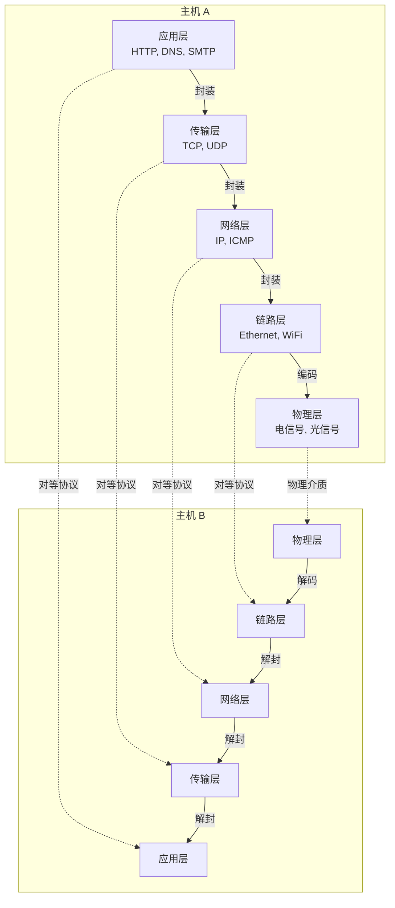

### OSI 七层模型 vs TCP/IP 四层模型

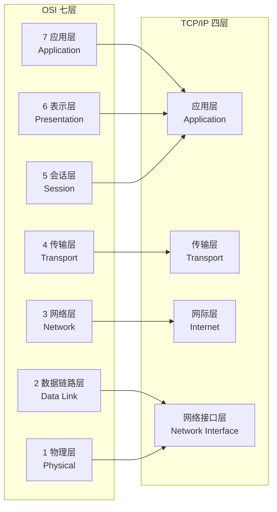

| OSI 层次 | TCP/IP 对应 | 功能 | 协议示例 | PDU 名称 |
|---------|------------|------|---------|---------|
| 应用层 | 应用层 | 为应用程序提供网络服务 | HTTP, DNS, SMTP, FTP | 数据/消息 |
| 表示层 | 应用层 | 数据格式转换、加密压缩 | TLS/SSL, JPEG, ASCII | 数据 |
| 会话层 | 应用层 | 建立/管理/终止会话 | RPC, NetBIOS | 数据 |
| 传输层 | 传输层 | 端到端可靠传输 | TCP, UDP, SCTP | 段 (Segment) |
| 网络层 | 网际层 | 寻址与路由选择 | IP, ICMP, OSPF, BGP | 包 (Packet) |
| 数据链路层 | 网络接口层 | 相邻节点间的帧传输 | Ethernet, WiFi, PPP | 帧 (Frame) |
| 物理层 | 网络接口层 | 比特流传输 | RS-232, 802.3 | 比特 (Bit) |

**关键洞察**：OSI 模型是**理论标准**，TCP/IP 模型是**事实标准**。实际网络协议栈按 TCP/IP 四层实现，但分析时常用 OSI 七层作为参考框架。

### 数据封装与解封装

数据在协议栈中逐层封装，每层添加自己的协议头部：

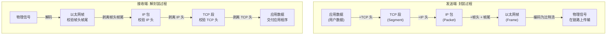

**以太网帧结构示例**：

```text
+--------+--------+---------+----------+--------+---------+--------+
| 前导码  | 帧起始  | 目的MAC  | 源MAC    | 类型   | 数据     | FCS    |
| 7B     | 定界符  | 6B      | 6B      | 2B    | 46-1500B | 4B     |
+--------+--------+---------+----------+--------+---------+--------+
                          ↑ 帧头 (14B) ↑       ↑ 帧尾 (4B) ↑
```

**IP 包结构示例**：

```text
+---------+--------+----------+-------------------+
| 版本/   | 服务   | 总长度    | 标识/标志/片偏移    |
| 首部长度 | 类型   |          |                   |
+---------+--------+----------+-------------------+
| TTL     | 协议   | 首部校验和 | 源 IP 地址        |
+---------+--------+----------+-------------------+
| 目的 IP 地址                                |
+--------------------------------------------+
| 选项 (可选)                                  |
+--------------------------------------------+
| 数据 (TCP 段)                                |
+--------------------------------------------+
```

**TCP 段结构示例**：

```text
+----------------+----------------+------------------+
| 源端口 (16bit)  | 目的端口 (16bit) |                  |
+----------------+----------------+------------------+
| 序号 (32bit)                                     |
+--------------------------------------------------+
| 确认号 (32bit)                                    |
+--------+------+--------+-------------------------+
| 首部长度| 保留  | U A P R S F | 窗口大小              |
|        |      | R C S S Y I |                      |
|        |      | G K H T N N |                      |
+--------+------+--------+-------------------------+
| 校验和          | 紧急指针  |                        |
+----------------+----------+-------------------------+
| 选项 (可选)                                       |
+--------------------------------------------------+
| 数据 (应用数据)                                    |
+--------------------------------------------------+
```

### 各层核心机制详解

#### 物理层：比特的传输

物理层解决的核心问题：**如何在物理介质上传输比特流**。

- **编码方式**：NRZ、曼彻斯特编码、4B/5B 等——解决时钟同步与信号恢复
- **调制方式**：调幅 (AM)、调频 (FM)、调相 (PM)——将数字信号映射到模拟载波
- **传输介质**：铜线（电信号）、光纤（光信号）、无线（电磁波）
- **关键指标**：带宽 (Hz)、吞吐量 (bps)、延迟、误码率

**奈奎斯特定理与香农定理**界定了信道的理论传输上限。

#### 链路层：帧的传输

链路层解决的核心问题：**相邻节点间如何可靠地传输帧**。

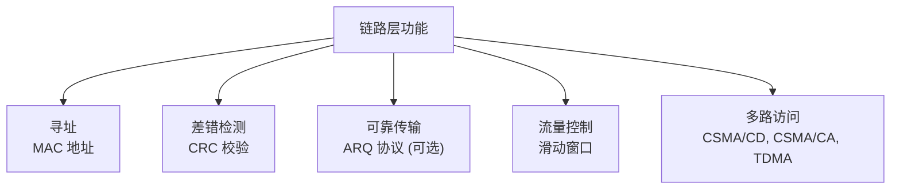

- **MAC 地址**：48 位硬件地址，全球唯一（烧录在 NIC 中），仅在局域网内有意义
- **ARP 协议**：IP 地址 → MAC 地址的映射，是链路层与网络层之间的桥梁
- **CSMA/CD**：以太网的冲突检测机制（"先听后发，边发边听，冲突停止，随机重试"）
- **交换机**：二层设备，根据 MAC 地址表转发帧，隔离冲突域

#### 网络层：包的路由

网络层解决的核心问题：**如何跨越多个异构网络将包从源地址送达目的地址**。

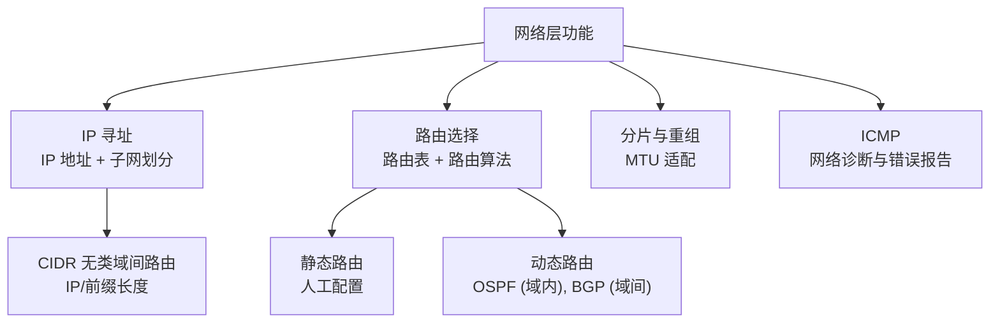

**IP 地址的演进**：

| 阶段 | 方案 | 特点 |
|------|------|------|
| 分类地址 | A/B/C/D/E 类 | 固定前缀长度，地址浪费严重 |
| 子网划分 | 子网掩码 | 内部灵活划分，但对外仍为分类 |
| CIDR | IP/前缀长度 | 无类地址，路由聚合，缓解地址枯竭 |
| NAT | 私有地址 + 地址转换 | 内网用私有地址，出口做转换，延缓 IPv4 枯竭 |
| IPv6 | 128 位地址 | 彻底解决地址空间问题 |

**路由选择的核心——路由表**：

```text
目的网络          下一跳          接口
10.0.0.0/24     192.168.1.1    eth0
172.16.0.0/16   10.0.0.1       eth1
0.0.0.0/0       192.168.1.254  eth0    ← 默认路由
```

路由选择基于**最长前缀匹配**原则。

#### 传输层：端到端通信

传输层解决的核心问题：**主机上的哪个进程应该接收这个数据**。

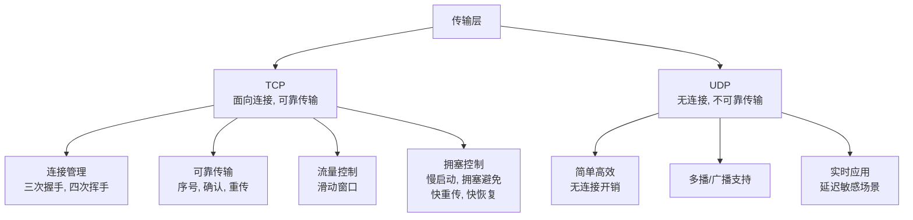

**TCP 三次握手**：

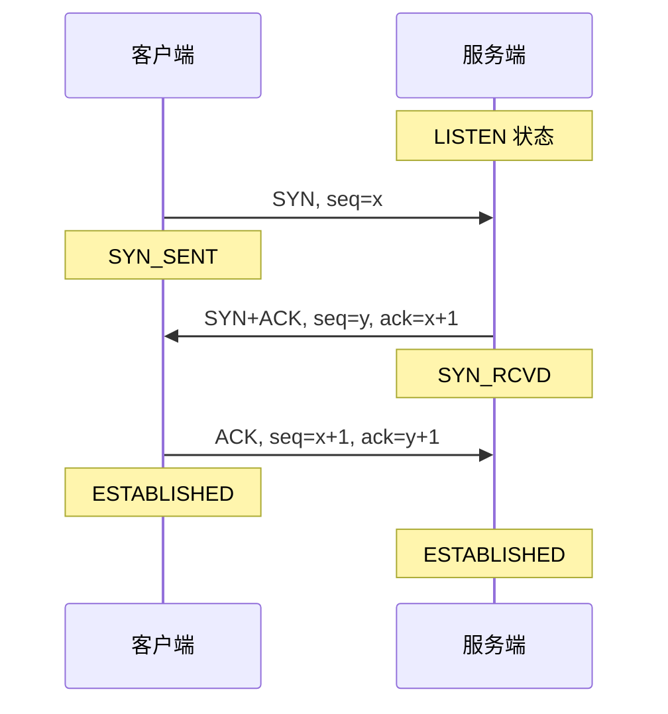

**为什么是三次而非两次？** 两次握手无法防止历史重复 SYN 导致的无效连接。第三次 ACK 确认了客户端确实发起了本次连接请求，而非延迟的旧请求。

**TCP 四次挥手**：

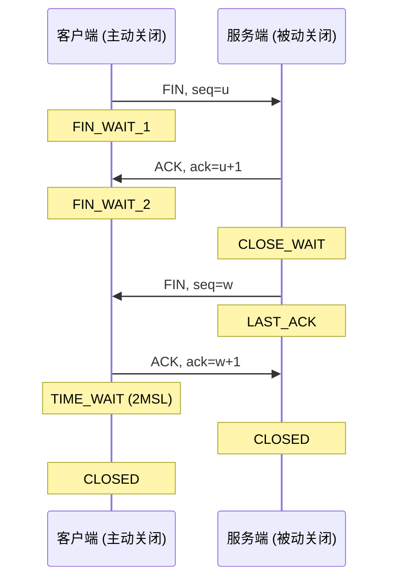

**为什么需要 TIME_WAIT？**

1. 确保最后一个 ACK 能到达对方（若丢失，对方会重发 FIN）
2. 等待网络中滞留的旧报文消亡，避免新连接收到旧数据

**TCP 拥塞控制**：

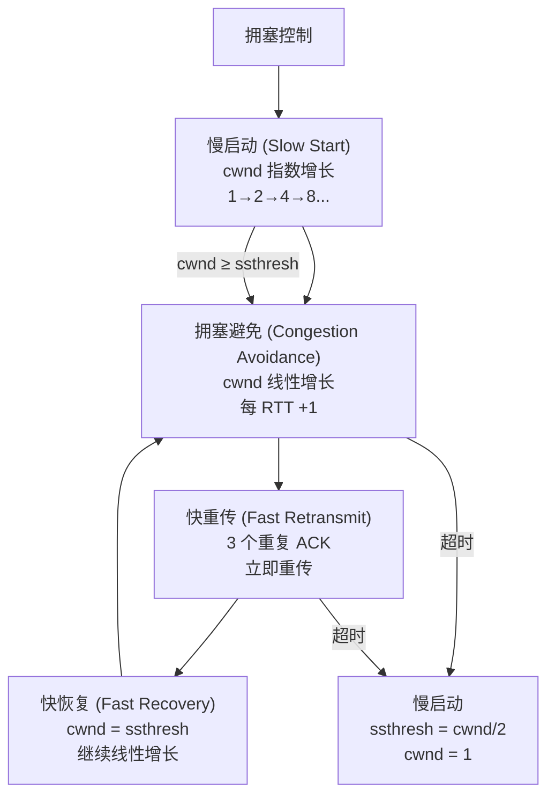

#### 应用层：业务语义

应用层解决的核心问题：**如何为具体应用提供网络服务**。

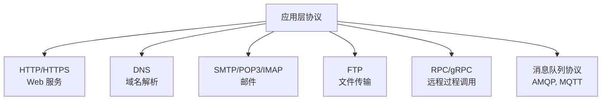

DNS 是应用层最关键的基础设施——它将人类可读的域名映射为 IP 地址，是所有网络应用的起点。

## 设计原则与权衡（Trade-off 分析）

### 端到端原则（End-to-End Principle）

端到端原则是互联网架构最根本的设计哲学：

> **功能应在能完整实现该功能的最高层实现，低层只提供通用的、被广泛需要的服务。**

这意味着：

- **可靠性由端点（传输层）保证，而非网络（网络层）**：IP 不保证可靠传输，TCP 在端点做重传
- **安全性由端点保证**：IPSec 是可选的，TLS 在端点实现
- **拥塞控制由端点执行**：路由器不告诉 TCP 该减速，TCP 通过丢包推断拥塞

**权衡**：端到端原则使网络核心保持简单，但代价是**网络无法提供 QoS 保证**——这是互联网"尽力而为"（Best-Effort）模型的根源。

### 可靠性 vs 效率

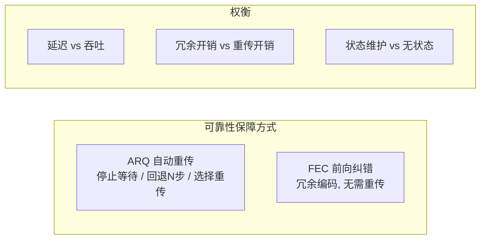

| 方案 | 延迟 | 开销 | 适用场景 |
|------|------|------|---------|
| 停止等待 ARQ | 高（每帧等 ACK） | 低 | 简单链路 |
| 回退 N 步 ARQ | 中 | 中（可能重传已收到帧） | 卫星链路 |
| 选择重传 ARQ | 低 | 低（仅重传丢失帧） | 高延迟链路 |
| FEC | 最低（无需等反馈） | 高（固定冗余） | 实时音视频 |

### 虚电路 vs 数据报

网络层有两种根本不同的设计哲学：

| 维度 | 虚电路 (VC) | 数据报 (Datagram) |
|------|------------|-------------------|
| 连接建立 | 需要（信令协议） | 不需要 |
| 路由 | 沿固定路径 | 每包独立路由 |
| 顺序保证 | 保证 | 不保证 |
| 状态 | 交换机维护连接状态 | 交换机无状态 |
| 故障恢复 | 断连，需重建 | 自动绕行 |
| 代表 | ATM, MPLS, X.25 | **IP（互联网选择）** |

互联网选择数据报模型的原因：**无状态的核心网络更具弹性和可扩展性**。路由器无需维护连接状态，故障时自动绕行，扩展时只需更新路由表。这与端到端原则一脉相承。

### 分层的代价

分层并非没有代价：

1. **封装开销**：每层添加头部，以太网帧 14B + IP 头 20B + TCP 头 20B = 54B，对于小包（如 TCP ACK）开销占比极大
2. **跨层信息缺失**：严格的分层阻止了层间信息共享（如 TCP 无法感知无线链路的丢包原因），导致次优决策
3. **Head-of-Line Blocking**：TCP 的严格有序传输导致前一个包丢失时后续包被阻塞——这是 HTTP/2 和 QUIC 要解决的核心问题

## 实践案例与反模式

### 案例 1：一次 HTTP 请求的完整旅程

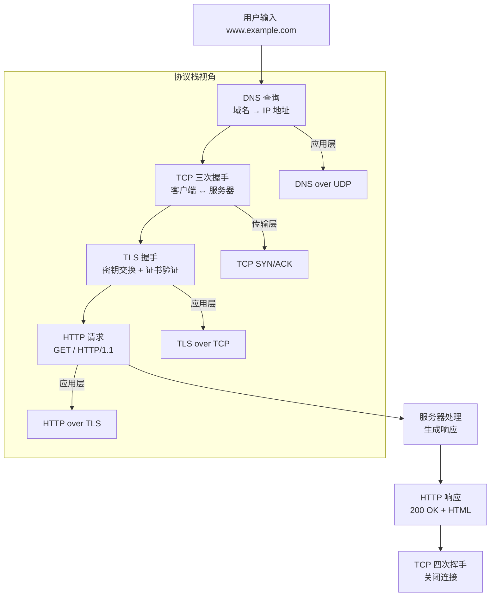

这个案例展示了分层架构的实际运作：每一层只关心自己的协议，下层为上层提供透明服务。

### 案例 2：NAT 与端到端原则的冲突

NAT（Network Address Translation）修改了 IP 包的源地址/端口，破坏了端到端原则：

- **P2P 连接受阻**：NAT 后的主机无法被外部主动连接
- **协议兼容性问题**：某些协议（如 FTP 主动模式）在 IP 包载荷中嵌入地址，NAT 无法正确翻译
- **解决方案**：STUN/TURN/ICE 穿透、NAT 打洞、IPv6

NAT 是地址空间枯竭的临时解决方案，但因其广泛部署已成为事实上的"中间层"——这违背了端到端原则，却是务实的工程妥协。

### 案例 3：QUIC — 重新审视分层

QUIC（Quick UDP Internet Connections）是 HTTP/3 的传输层协议，它对传统分层提出了挑战：

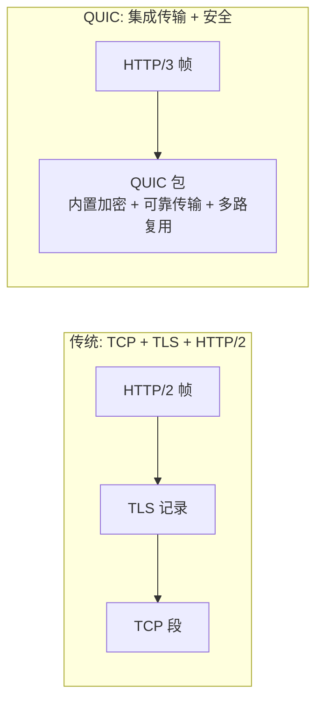

QUIC 的突破：

1. **解决 TCP Head-of-Line Blocking**：多流独立传输，一条流丢包不影响其他流
2. **连接迁移**：基于 Connection ID 而非四元组，网络切换不断连
3. **0-RTT 握手**：TLS 与传输握手合并，减少延迟
4. **用户态实现**：绕过内核 TCP 栈，迭代更快

QUIC 本质上是在 UDP 之上重新实现了传输层功能，是对"严格分层"的反思——**当分层的代价超过收益时，跨层融合是合理的工程选择**。

### 反模式 1：忽视 MTU 导致的分片

IP 分片对性能有严重影响：

- 每个分片独立路由，任一片丢失整个包重传
- 分片重组消耗接收端内存和时间
- 安全设备可能拦截分片包

**正确做法**：通过 Path MTU Discovery 避免分片，设置 DF（Don't Fragment）标志，在发送端将包调整到合适的尺寸。

### 反模式 2：TCP 短连接滥用

每次请求都建立/拆除 TCP 连接：

- 三次握手 + TLS 握手 = 首字节时间（TTFB）高
- TIME_WAIT 状态占用端口和内核资源
- 慢启动导致有效吞吐低

**正确做法**：使用连接池（Connection Pool）或 Keep-Alive 长连接复用 TCP 连接。HTTP/1.1 默认 Keep-Alive，HTTP/2 多路复用更进一步。

### 反模式 3：忽视拥塞控制的生态影响

在数据中心内部使用 TCP 做大规模数据传输（如分布式存储的副本同步），TCP 拥塞控制的慢启动会导致：

- 短流（查询请求）被长流（数据同步）挤占带宽
- Incast 问题：多对一通信时交换机缓冲区溢出

**正确做法**：数据中心内部可考虑 DCTCP 等数据中心专用拥塞控制算法，或使用 RDMA 绕过 TCP 栈。

## 小结与关键要点

1. **分层是应对网络异构性的核心架构思想**：每层解决一个维度的问题，层间通过接口交互，同层通过协议通信
2. **OSI 七层是理论参考，TCP/IP 四层是事实标准**：实际协议栈按 TCP/IP 实现，分析时可用 OSI 框架
3. **数据在协议栈中逐层封装与解封装**：每层添加头部（链路层还有尾部），接收端逐层剥离
4. **网络层选择数据报而非虚电路**：无状态核心网络更具弹性和可扩展性，与端到端原则一致
5. **传输层是端到端可靠性的保障**：TCP 的三次握手、拥塞控制、流量控制是互联网可靠传输的基石
6. **端到端原则是互联网的根本设计哲学**：功能在最高层实现，网络核心保持简单——但这也导致了 QoS 保障的缺失
7. **分层有代价**：封装开销、跨层信息缺失、Head-of-Line Blocking——QUIC 等新协议正在重新审视分层的边界
8. **NAT 是端到端原则的务实妥协**：地址转换破坏了端到端语义，但在 IPv4 地址枯竭的现实中不可或缺

> **延伸阅读**：本节建立了网络协议分层的整体框架。在[14丨IP 网络：连接世界的桥梁]中，许式伟对 IP 网络做了更深入的讨论；在[15丨可编程的互联网世界]中，讨论了互联网应用层的技术演进。从存储（[14丨RAID]、[15丨B+树]、[16丨SQL]）到网络（本节），我们完成了基础平台篇中计算、存储、网络三大支柱的全部构建。这些知识将在[03丨服务端开发篇]中组合为完整的分布式系统架构。
