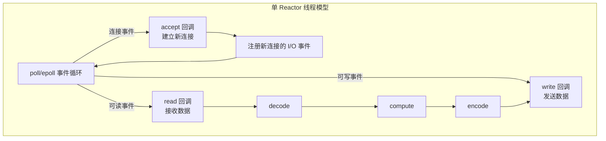
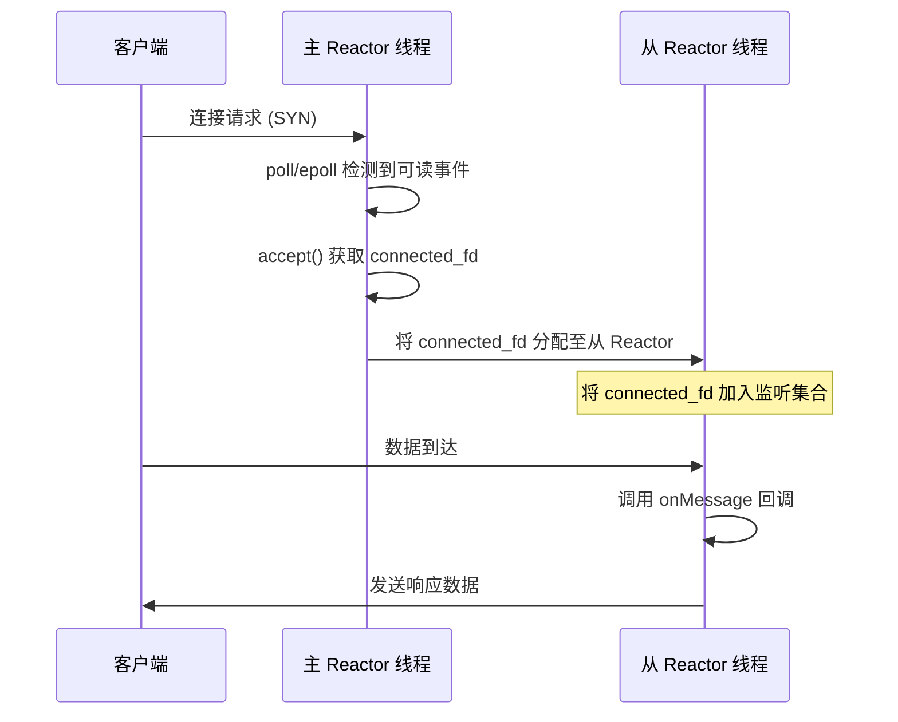

# Reactor模式：单线程与主从多线程并发模型

使用 `fork()` 进程和 `pthread` 线程处理并发连接，实现简单但性能随并发数增长而快速下降。本文系统阐述 **Reactor 模式**（反应堆模式 / Event Loop 模式）：从事件驱动模型入手，讲解单 Reactor 线程模型与主从 Reactor 多线程模型，并结合 Worker 线程池，最后给出基于 poll/epoll 的实现与 Netty 参考。

## 一、事件驱动模型与 Reactor 原理

### 1. 事件驱动的基本原理

事件驱动（event-driven）模型具有资源占用少、效率高、可扩展性强的特点，是支持高性能高并发的核心范式。在 GUI 编程中，程序为按钮点击、文本输入等控件操作注册回调函数（callback），后台运行无限循环的事件分发线程（event dispatch thread），持续从事件队列取出事件、查找并执行回调。网络编程中，通过 `poll()`/`epoll()` 等 I/O 多路复用技术，可将套接字事件抽象为事件驱动模型。

### 2. Reactor 模式核心

Reactor 模式包含两个核心要素：

1. **事件分发线程**（Reactor 线程 / Event Loop 线程）：运行无限循环，通过 `poll()`/`epoll()` 检测就绪事件；
2. **事件回调机制**：每个 I/O 事件注册对应回调，事件就绪时由 Reactor 线程调用处理。

典型事件：Acceptor 上的连接建立事件、已连接套接字上的数据可读/可写事件、通信管道（pipe）上的数据到达事件。

### 3. I/O 模型与线程模型对比

网络程序的处理流程可抽象为五个阶段：**read → decode → compute → encode → send**。其中 `read`/`send` 与套接字直接相关（I/O 密集），`decode`/`compute`/`encode` 属于业务逻辑（CPU 密集）。不同并发模型对这些阶段的处理方式各异。

| 模型 | 资源占用 | 空闲连接 | 扩展性 |
|------|---------|---------|--------|
| fork 进程 | 高（每连接一个进程） | 仍占用进程资源 | 差 |
| pthread 线程 | 中（每连接一个线程） | 仍占用线程资源 | 中 |
| **单 Reactor 线程** | 低（空闲连接不占线程） | 不占用 | 受单核限制 |
| **主从 Reactor 多线程** | 低 | 不占用 | 多核并行，强 |

## 二、单 Reactor 线程模型

### 4. 架构

单 Reactor 线程同时负责 Acceptor 连接建立事件和已连接套接字的 I/O 事件分发：



### 5. 单 Reactor + Worker 线程池

单 Reactor 线程中，业务逻辑（decode/compute/encode）与 I/O 分发在同一线程。XML 解析、数据库查询等 CPU 密集操作会阻塞 Reactor 线程。解决：将业务逻辑拆分为独立任务，提交至 **Worker 线程池**执行，与 Reactor 线程解耦。Reactor 线程仅负责 I/O，计算结果交回 Reactor 线程发送。

### 6. 实现样例（poll 单线程）

课程定制的网络编程框架中，Reactor 核心对象是 `event_loop`，`acceptor` 封装监听套接字，`TCPServer` 整合三者。线程数参数为 0 时采用单线程模式：

```c
#include <lib/event_loop.h>
#include "lib/tcp_server.h"

// rot13 字符变换回调、onConnectionCompleted/onMessage/onWriteCompleted/onConnectionClosed 四个回调
int main(int c, char **v) {
    struct event_loop *eventLoop = event_loop_init();   // Reactor 对象
    struct acceptor *acceptor = acceptor_init(SERV_PORT); // 监听套接字
    // 线程数 0 = 单线程：同时处理 Acceptor 连接事件与已连接套接字 I/O 事件
    struct TCPserver *tcpServer = tcp_server_init(eventLoop, acceptor,
        onConnectionCompleted, onMessage, onWriteCompleted, onConnectionClosed, 0);
    tcp_server_start(tcpServer);
    event_loop_run(eventLoop);  // 无限循环分发事件
    return 0;
}
```

**回调函数**：框架通过四个回调暴露业务接口——`onConnectionCompleted`（新连接建立）、`onMessage`（数据读取至缓冲区）、`onWriteCompleted`（数据发送完成）、`onConnectionClosed`（连接关闭）。

**模型评估**：

| 维度 | 评估 |
|------|------|
| 实现复杂度 | 中等，需理解事件驱动范式 |
| 资源利用率 | 高，空闲连接不占用线程资源 |
| 单线程瓶颈 | 业务逻辑阻塞将影响所有连接的事件分发 |
| 可扩展性 | 受限于单核 CPU 处理能力 |
| 适用场景 | I/O 密集型、业务逻辑轻量的服务 |

## 三、主从 Reactor 多线程模型

### 7. 架构设计

单 Reactor 线程在连接请求密集时连接成功率会显著下降，且无法利用多核。主从 Reactor 模式核心是**职责分离**：

- **主 Reactor（Main Reactor）**：仅负责分发 Acceptor 上的连接建立事件，通过 `accept()` 获取已连接套接字；
- **从 Reactor（Sub Reactor）**：负责分发已连接套接字上的 I/O 事件（可读、可写等），数量按 CPU 核数配置。

同一套接字的 I/O 事件始终由同一个从 Reactor 线程处理，避免多线程并发访问同一套接字的锁开销。



### 8. 跨线程连接分配

主 Reactor 获取已连接套接字后，需分配至某个从 Reactor。从 Reactor 可能正处于 `poll()`/`epoll_wait()` 阻塞状态，跨线程传递数据需唤醒机制：

| 方案 | 说明 |
|------|------|
| **self-pipe trick** | 从 Reactor 创建管道，主线程写入字节唤醒 |
| **eventfd** | Linux 2.6.22+ 轻量级事件通知，比 pipe 高效 |
| **epoll 的 EPOLL_CTL_MOD** | 通过修改 fd 事件掩码触发唤醒 |

### 9. 主从 Reactor + Worker 线程池

生产环境广泛采用的完整架构：主 Reactor 专注连接、从 Reactor 专注 I/O、Worker 线程池处理 CPU 密集的 decode/compute/encode。三者解耦，各司其职。

### 10. Netty 实现参考

Netty 是该模式的典型实现：`bossGroup` 对应主 Reactor（仅 Acceptor），`workerGroup` 对应从 Reactor（已连接套接字 I/O 分发）。

```java
EventLoopGroup bossGroup = new NioEventLoopGroup(1);    // 主 Reactor
EventLoopGroup workerGroup = new NioEventLoopGroup();   // 从 Reactor
ServerBootstrap b = new ServerBootstrap();
b.group(bossGroup, workerGroup)
 .channel(NioServerSocketChannel.class)
 .handler(new LoggingHandler(LogLevel.INFO))
 .childHandler(new TelnetServerInitializer());
b.bind(PORT).sync().channel().closeFuture().sync();
```

> 注意：Netty 文档中的 `workerGroup` 对应从 Reactor 线程，负责 I/O 事件分发，**并非**业务逻辑处理线程。业务逻辑应通过 `ChannelHandler` 在独立线程中处理。

### 11. 实现（线程数参数驱动）

仅需修改线程数参数即可从单线程切换到主从 Reactor：

```c
// 线程数设为 4：1 个主 Reactor 线程 + 4 个从 Reactor 线程
struct TCPserver *tcpServer = tcp_server_init(eventLoop, acceptor,
    onConnectionCompleted, onMessage, onWriteCompleted, onConnectionClosed, 4);
```

**模型评估对比**：

| 维度 | 单 Reactor 线程 | 主从 Reactor 多线程 |
|------|-----------------|---------------------|
| 连接处理能力 | 受限于单线程 | 主 Reactor 专注 accept，吞吐量高 |
| I/O 并行度 | 单线程串行 | 多线程并行处理 |
| CPU 利用率 | 单核 | 多核充分利用 |
| 锁开销 | 无 | 低（同套接字仅一个线程处理） |
| 实现复杂度 | 中等 | 较高（需处理跨线程通信） |
| 适用场景 | I/O 密集、轻量业务 | 高并发、多核服务器 |

## 四、基于 epoll 的主从 Reactor

### 12. epoll 多线程实现

主从 Reactor 同样可基于 epoll 实现（Linux 高并发场景的标准选择）。与 poll 实现相比，仅底层事件分发机制不同：epoll 仅返回就绪事件（O(k)）、支持边缘触发（ET），在大规模连接下性能更优。框架通过配置选择 `poll` 或 `epoll` 作为事件分发器（dispatcher），**上层业务代码完全不变**——这正是框架抽象的价值。

**多线程 Reactor 实现要点**：

- 每个线程绑定独立的 `event_loop`（内含 epoll 实例）；
- 主 Reactor 的 epoll 监听监听套接字，从 Reactor 的 epoll 监听各自分配的已连接套接字；
- 跨线程唤醒使用 `eventfd` 或 self-pipe；
- 采用 **EPOLLONESHOT** 防止多线程竞争同一 fd（可选，视事件分发粒度而定）。

### 13. 框架的 poll/epoll 可切换设计

网络编程框架通过宏 `EPOLL_ENABLE` 控制选择哪种分发机制（`event_loop_init_with_name` 函数）：

```c
#ifdef EPOLL_ENABLE
    eventLoop->eventDispatcher = &epoll_dispatcher;
#else
    eventLoop->eventDispatcher = &poll_dispatcher;
#endif
```

CMakeLists.txt 通过 `CheckSymbolExists` 检测系统是否支持 `epoll_create`，自动决定是否开启 `EPOLL_ENABLE`：

```cmake
include(CheckSymbolExists)
check_symbol_exists(epoll_create "sys/epoll.h" EPOLL_EXISTS)
if (EPOLL_EXISTS)
    set(EPOLL_ENABLE 1 CACHE INTERNAL "enable epoll")
endif ()
```

如此在 Linux 下默认使用 epoll，如需对比测试可强制设为 poll。

### 14. 缓冲区对象（Buffer）的设计意义

网络编程框架应对应用封装套接字读写细节，转而提供基于 **buffer 对象**的读写操作。从套接字接收数据、处理异常、发送数据等操作均由 buffer 对象封装，应用仅需从 buffer 中获取字节流做应用层处理（如 `buffer_read_char` 逐字节读取）；发送时先生成 buffer、填充编码后数据，再调用 `tcp_connection_send_buffer` 发送。

回调函数（`onMessage`/`onConnectionClosed` 等）运行在 Sub-Reactor 线程中，生成 buffer、执行 encode 的代码均在 Sub-Reactor 线程执行。回调仅提供 Handler 逻辑，具体执行由事件分发线程发起。应用开发者只需关注回调函数，套接字、字节流等底层细节完全由框架处理。

### 15. epoll 性能分析

epoll 的性能优势可从两个维度理解：

| 维度 | poll / select | epoll |
|------|--------------|-------|
| **事件集合管理** | 每次调用传入完整 fd 集合，内核重新构建 | 红黑树持久维护，增量更新，减少拷贝与分配 |
| **就绪列表返回** | 返回全部集合，应用自行扫描过滤 | 仅返回活跃事件，应用直接处理 |
| 时间复杂度 | O(n)（全量扫描） | O(1)（活跃事件数） |
| 最大 fd 数 | 受 FD_SETSIZE 限制（select） | 无硬性限制 |
| 触发模式 | 仅条件触发（LT） | 支持 LT 和 ET |

- **事件集合管理**：select/poll 每次调用前需准备完整事件集合并传入内核构建数据结构；epoll 通过 epoll 句柄对红黑树集合增量增删改，事件集合变化幅度有限时，避免每次重新扫描和构建内核结构，显著减少内核/用户空间数据拷贝与内存分配。
- **就绪列表**：select/poll 返回后应用需扫描整个集合找活跃事件，当列表增长到 10K 以上时扫描损耗可观（实际活跃可能仅数个）；epoll 直接返回活跃事件列表，免除无效扫描。

### 16. 边缘触发（ET）与条件触发（LT）场景

epoll 的 ET/LT 区别（与第 15 篇"I/O 多路复用"中的 epoll 机制相呼应，此处用具体场景说明）：

- 若套接字有 100 字节可读，ET 和 LT 都会产生 read ready 事件；
- 若应用只读取了 50 字节：
  - **ET**：不再产生新事件通知，直到有新的数据到达；
  - **LT**：因还有 50 字节未读取，持续产生 read ready 事件。

在 LT 模式下，若套接字缓冲区可写，会无限次返回 write ready 事件——若应用未准备好发送数据，必须解除该套接字的可写事件注册，否则导致 **CPU 空转**。

## 总结

- **事件驱动模型**：注册回调 + 事件分发线程无限循环，是高性能并发的核心范式；
- **单 Reactor 线程**：同时处理连接建立与 I/O 分发，资源占用低但受单核限制；可配合 Worker 线程池分离业务逻辑；
- **主从 Reactor 多线程**：主 Reactor 专注 accept，从 Reactor 并行处理 I/O，多核充分利用，是高并发生产环境的标准架构；
- **跨线程通信**：self-pipe trick、eventfd、EPOLL_CTL_MOD；
- **结合 Worker 线程池**：I/O 线程与 CPU 密集业务解耦；
- **Netty 参考**：`bossGroup`=主 Reactor，`workerGroup`=从 Reactor；
- epoll 版本主从 Reactor 是大规模高并发（C10K/C10M）的标准选择。

## 思考题

1. 单 Reactor 线程中 decode-compute-encode 在哪个执行上下文运行？如何将业务逻辑与 I/O 逻辑解耦？
2. 主 Reactor 首先加入 `fd==4`（监听套接字），随后又加入 `fd==7`。`fd==7` 的用途是什么？它与跨线程通信有何关系？
3. 主从 Reactor 中，如何保证"同一套接字始终由同一个从 Reactor 线程处理"？

## 版本信息

| 项目 | 说明 |
|------|------|
| 更新日期 | 2026-06-09 |
| 目标内核 | Linux 7.0 |
| 关键 API | `poll()` (POSIX.1-2001); `epoll_create/ctl/wait` (Linux 2.5.44+); `pthread_create` (POSIX.1); `eventfd` (Linux 2.6.22+) |
| 备注 | Linux 7.0 中 `io_uring` 提供内核侧异步 I/O，可作为 Reactor 的替代或补充；`SO_INCOMING_CPU`（Linux 3.19+）支持连接与 CPU 核亲和性绑定，优化负载均衡 |

---
