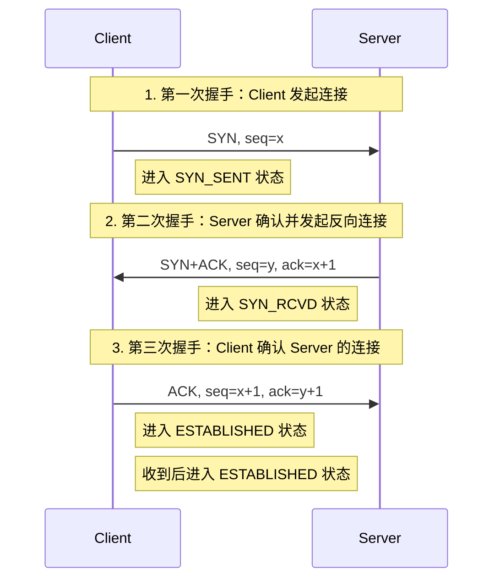
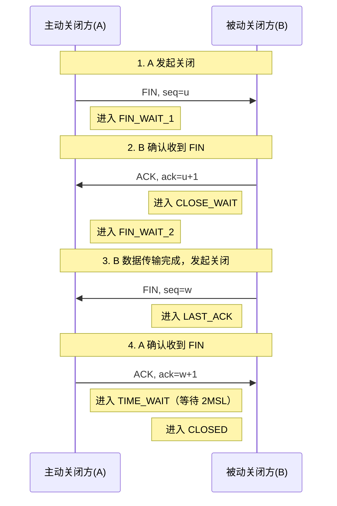
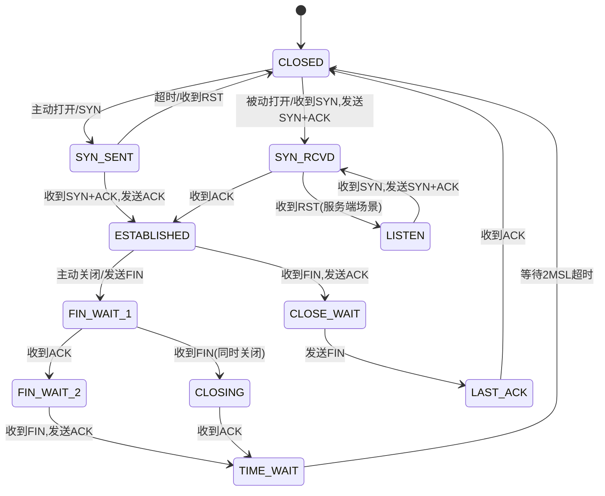
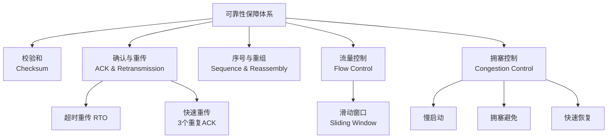
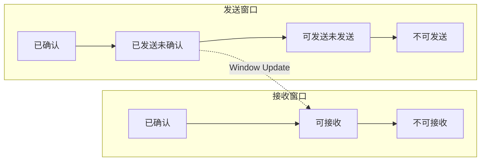
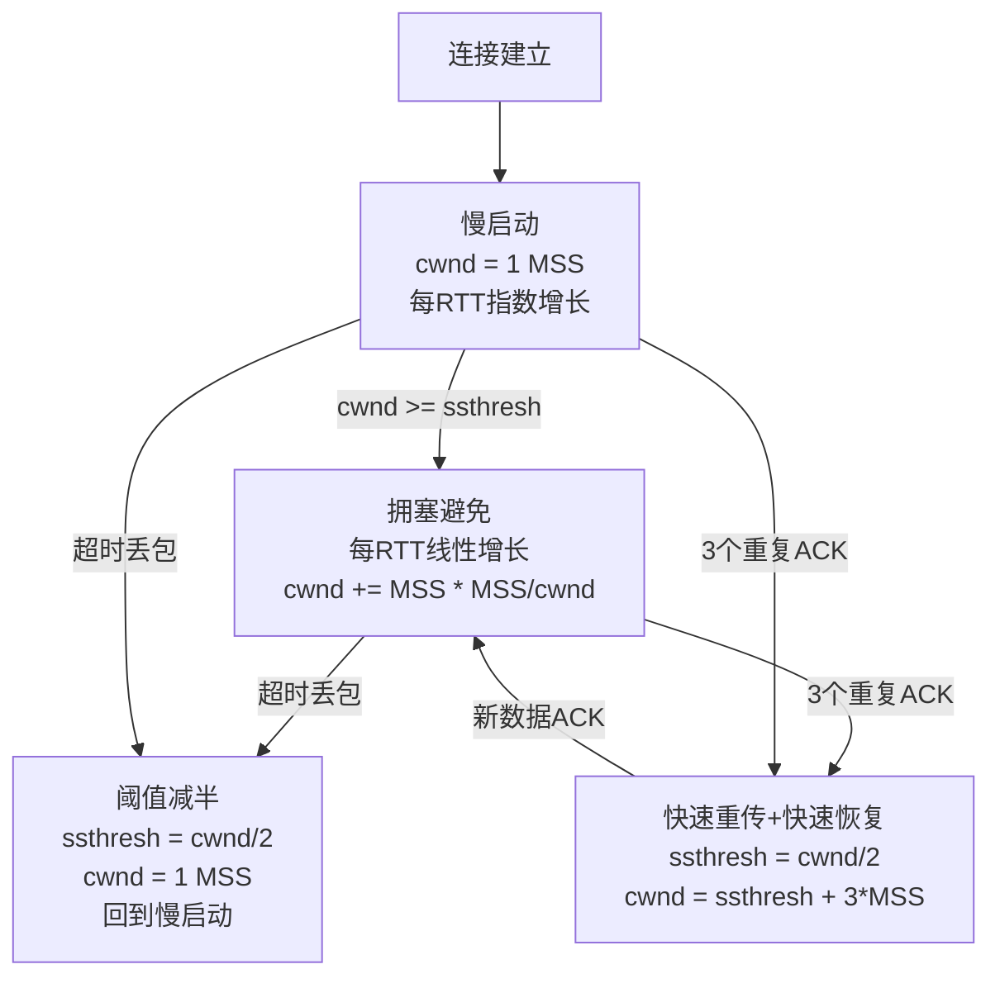

# 网络-TCP与可靠传输

## 章节导言

在上一节"[19-网络-协议与分层](19-网络-协议与分层.md)"中，我们提到：IP 网络解决的是网如何通的问题，而传输层解决的是如何让互联网通讯可信赖的问题。IP 协议本身是无连接的、尽力交付（Best-Effort）的——它不保证数据到达，不保证到达顺序，不保证不重复。这意味着，如果应用层直接基于 IP 协议编程，就必须自行处理丢包重传、乱序重组、流量控制等一系列可靠性问题。

TCP（Transmission Control Protocol，传输控制协议）正是为解决这一问题而生。它是互联网体系中最为精巧的协议之一，其核心命题可以凝练为一句话：**在不可靠的 IP 网络之上，构建可靠的字节流传输服务。**

理解 TCP，不仅是理解网络传输的根基，更是理解分布式系统设计中"可靠性"这一核心命题的起点。

---

## 核心概念与原理

### TCP 的本质：端到端的可靠字节流

TCP 的设计目标并非简单的"可靠数据报"，而是**可靠的、有序的、双向的字节流**。这一抽象至关重要：

- **字节流而非消息流**：TCP 不维护应用层消息边界。发送方调用两次 Write（分别写入 10 字节和 20 字节），接收方可能通过一次 Read 读取 30 字节，也可能分三次读取各 10 字节。消息边界的维护是应用层的责任。
- **端到端（End-to-End）**：可靠性由通信两端保证，中间路由器不承担任何可靠性责任。这是互联网设计哲学的核心原则——复杂度向边缘推移，核心网络保持简单。
- **全双工（Full-Duplex）**：一条 TCP 连接上可以同时进行双向数据传输，两个方向彼此独立。

### TCP 报文段结构

TCP 报文段（Segment）是 TCP 传输的基本单位，其结构如下：

```text
 0                   1                   2                   3
 0 1 2 3 4 5 6 7 8 9 0 1 2 3 4 5 6 7 8 9 0 1 2 3 4 5 6 7 8 9 0 1
+-+-+-+-+-+-+-+-+-+-+-+-+-+-+-+-+-+-+-+-+-+-+-+-+-+-+-+-+-+-+-+-+
|          Source Port          |       Destination Port        |
+-+-+-+-+-+-+-+-+-+-+-+-+-+-+-+-+-+-+-+-+-+-+-+-+-+-+-+-+-+-+-+-+
|                        Sequence Number                        |
+-+-+-+-+-+-+-+-+-+-+-+-+-+-+-+-+-+-+-+-+-+-+-+-+-+-+-+-+-+-+-+-+
|                    Acknowledgment Number                      |
+-+-+-+-+-+-+-+-+-+-+-+-+-+-+-+-+-+-+-+-+-+-+-+-+-+-+-+-+-+-+-+-+
|  Data |           |U|A|P|R|S|F|                               |
| Offset| Reserved  |R|C|S|S|Y|I|            Window             |
|       |           |G|K|H|T|N|N|                               |
+-+-+-+-+-+-+-+-+-+-+-+-+-+-+-+-+-+-+-+-+-+-+-+-+-+-+-+-+-+-+-+-+
|           Checksum            |         Urgent Pointer        |
+-+-+-+-+-+-+-+-+-+-+-+-+-+-+-+-+-+-+-+-+-+-+-+-+-+-+-+-+-+-+-+-+
|                    Options                    |    Padding    |
+-+-+-+-+-+-+-+-+-+-+-+-+-+-+-+-+-+-+-+-+-+-+-+-+-+-+-+-+-+-+-+-+
|                             data                              |
+-+-+-+-+-+-+-+-+-+-+-+-+-+-+-+-+-+-+-+-+-+-+-+-+-+-+-+-+-+-+-+-+
```

关键字段解析：

| 字段 | 作用 |
|------|------|
| Sequence Number | 字节流中该报文段数据起始位置的字节编号，非报文段编号 |
| Acknowledgment Number | 期望收到的下一个字节的编号，确认号 = 已收到的最后一个字节 + 1 |
| Window | 接收窗口大小，用于流量控制，告知对端当前可接收的数据量 |
| Flags（SYN/ACK/FIN/RST） | 控制连接的建立、确认、终止与重置 |

**关键洞察**：TCP 的 Sequence Number 是面向字节的，而非面向报文段的。这是实现字节流抽象的基础——接收方根据序号将数据重组为连续字节流，无论报文段如何乱序到达。

### 连接管理：三次握手与四次挥手

TCP 是面向连接的协议。连接管理是其可靠性的前提——双方在传输数据前，必须先协商初始序号、交换能力参数，建立共享状态。

#### 三次握手（Three-Way Handshake）



**为什么是三次而非两次？** 核心原因有两个：

1. **防止历史连接（陈旧 SYN）的初始化**：如果 Client 发出的旧 SYN 因网络延迟迟迟到达 Server，两次握手会让 Server 误建连接。三次握手中，Client 可以通过 ACK 中的确认号识别这是旧 SYN，发送 RST 终止。
2. **双方确认彼此的初始序号**：SYN 消耗一个序号。三次交互确保双方都确认了对方的初始序号（ISN），否则可能出现数据无法正确排序的隐患。

#### 四次挥手（Four-Way Handshake）



**为什么需要四次而非三次？** 因为 TCP 是全双工的。当 A 发送 FIN 时，仅表示 A 不再发送数据，但 B 仍可继续向 A 发送数据（半关闭状态，Half-Close）。B 的 ACK 和 B 自己的 FIN 之间可能间隔大量数据传输，因此无法合并。

**TIME_WAIT 状态的意义**：主动关闭方在发送最后一个 ACK 后进入 TIME_WAIT，等待 2MSL（Maximum Segment Lifetime，最大报文段生存时间）。原因有二：

1. 确保最后的 ACK 能到达对方。如果 ACK 丢失，对方会重发 FIN，TIME_WAIT 期间可以重发 ACK。
2. 等待网络中残留的迟延报文段消亡，防止新连接收到旧连接的过期数据。

#### TCP 状态机



### 可靠性机制：TCP 如何保证可靠传输

TCP 的可靠性不是由单一机制实现的，而是由四个机制协同工作：



#### 1. 校验和（Checksum）

TCP 报文段包含一个 16 位校验和字段，覆盖 TCP 报文头和数据部分。计算时还会加上一个伪首部（包含源/目的 IP 地址、协议号、TCP 长度），以防止报文段被错误地交付到错误的目的地。

**局限**：校验和是弱校验（16 位求和取反），只能检测随机错误，无法抵御蓄意篡改。对数据完整性的强保障需依赖上层（如 TLS，参见源课程"[20 | 安全：攻击与防御]"一讲）。

#### 2. 确认与重传机制

TCP 采用**累积确认（Cumulative ACK）**策略：确认号表示该编号之前的所有数据均已正确收到。例如，ACK=1001 表示 1000 号及之前的字节均已收到。

**超时重传（RTO, Retransmission Timeout）**：发送方在发送数据后启动定时器。若超时未收到 ACK，则重传。RTO 的值需要动态估算——过大则延迟高，过小则导致不必要的重传。TCP 采用 Jacobson/Karels 算法基于 RTT（Round-Trip Time）的方差动态调整 RTO。

**快速重传（Fast Retransmit）**：超时重传的代价较大（RTO 通常远大于 RTT）。TCP 引入了快速重传机制——当发送方连续收到三个重复 ACK（即对同一序号的第四次确认），不等待超时，立即重传对应的报文段。三个重复 ACK 强烈暗示该报文段已丢失（后续报文段已到达接收方，触发了重复确认）。

#### 3. 序号与重组

TCP 的序号机制确保：

- **按序交付**：接收方根据序号将数据重组为连续字节流，交付给应用层。
- **去重**：重复的序号数据被丢弃。
- **间隙检测**：接收方发现序号不连续时，通过重复 ACK 通知发送方数据缺失。

#### 4. 流量控制：滑动窗口

TCP 使用滑动窗口机制实现端到端的流量控制，防止发送方发送速度过快导致接收方缓冲区溢出。



接收方在每个 ACK 中携带 Window 字段，告知发送方当前可接收的数据量（即接收缓冲区剩余空间）。发送方据此调整发送窗口大小。

**零窗口问题**：当接收方缓冲区满时，Window=0，发送方暂停发送。接收方在缓冲区释放后通过 Window Update 通知发送方恢复。但若 Window Update 丢失，双方将死锁。TCP 引入了**持续计时器（Persist Timer）**——发送方在收到零窗口后定期发送 1 字节的探测报文，迫使接收方回复当前窗口大小。

### 拥塞控制：全局视角的流量调节

流量控制解决的是**接收方**的处理能力问题，拥塞控制解决的是**网络**的承载能力问题。二者协同工作：发送窗口 = min(接收窗口, 拥塞窗口)。

拥塞控制的核心挑战在于：网络拥塞的信号是隐式的——没有路由器会主动告诉 TCP "我拥塞了"。TCP 只能通过丢包（超时或重复 ACK）这一间接信号推断拥塞的发生。



#### 慢启动（Slow Start）

连接建立时，拥塞窗口（cwnd）初始化为 1 MSS（Maximum Segment Size，通常约 1460 字节）。每收到一个 ACK，cwnd 增加 1 MSS——这意味着每个 RTT cwnd 翻倍，呈指数增长。虽然名为"慢启动"，实际上是指数级快速探测可用带宽。

#### 拥塞避免（Congestion Avoidance）

当 cwnd 达到慢启动阈值（ssthresh）后，进入拥塞避免阶段。cwnd 每个RTT增加 1 MSS，即线性增长。增长变缓是为了谨慎接近网络容量上限。

#### 快速恢复（Fast Recovery）

快速重传后，TCP 并非回到慢启动（cwnd=1），而是将 cwnd 设为 ssthresh + 3 MSS（3 MSS 是因为已收到 3 个重复 ACK，说明已有 3 个报文段离开网络），然后进入快速恢复阶段。收到新数据的 ACK 后，将 cwnd 设为 ssthresh，进入拥塞避免。

**设计权衡**：快速恢复避免了超时丢包后的激进退避，是对"三个重复 ACK 意味着轻度拥塞"这一判断的优化响应。

### TCP 与 UDP 的本质差异

| 维度 | TCP | UDP |
|------|-----|-----|
| 连接性 | 面向连接，需要建立/释放连接 | 无连接 |
| 可靠性 | 可靠传输，保证到达、有序、不重复 | 不可靠，尽力交付 |
| 传输模式 | 字节流 | 数据报（保留消息边界） |
| 流量控制 | 滑动窗口 | 无 |
| 拥塞控制 | 完整的拥塞控制算法 | 无 |
| 头部开销 | 20 字节（不含选项） | 8 字节 |
| 适用场景 | 文件传输、Web、邮件 | 音视频流、DNS、游戏 |

**架构师视角**：TCP 并非总是正确选择。在实时音视频场景中，TCP 的重传机制可能导致延迟累积，反而加剧拥塞（参见[19-网络-协议与分层](19-网络-协议与分层.md)中的讨论）。UDP + 应用层可靠性协议（如 QUIC/WebRTC）是更优的架构选择。

---

## 设计原则与权衡（Trade-off 分析）

### 原则一：端到端原则（End-to-End Principle）

TCP 将可靠性置于端系统而非网络中间节点。这一设计遵循了 Saltzer、Reed 和 Clark 1984 年提出的端到端原则：**功能应尽可能在端到端层面实现，而非在网络内部**。

**Trade-off**：中间节点不参与可靠性保证，简化了网络核心的设计和部署，但代价是端系统必须承担更复杂的状态管理和计算负担。如果中间节点也提供可靠性，会导致功能冗余和语义混乱。

### 原则二：保守响应拥塞、激进探测可用带宽

TCP 拥塞控制的核心策略是：**在不确定网络容量的情况下，从低速开始快速探测（慢启动的指数增长）；一旦检测到拥塞，立即退避（窗口减半）**。这是经典的 Additive Increase / Multiplicative Decrease（AIMD）策略。

**Trade-off**：AIMD 是公平且稳定的，但带宽利用率并非最优。在高延迟、高带宽的长肥网络（LFN, Long Fat Network）中，TCP 的线性增长阶段恢复带宽的速度很慢。BBR（Bottleneck Bandwidth and RTT）等新型拥塞控制算法尝试通过带宽探测模型替代丢包信号模型来改善这一问题。

### 原则三：连接状态与资源消耗

TCP 是有状态的协议——维护连接状态需要内存（发送缓冲区、接收缓冲区、重传队列等）。一条 TCP 连接至少需要几 KB 的内核内存。

**Trade-off**：有状态带来了可靠性和流量控制能力，但也使 TCP 成为 DDoS 攻击的天然目标（SYN Flood，详见源课程"[20 | 安全：攻击与防御]"一讲）。SYN Cookie 技术通过不在 SYN_RCVD 状态分配资源来缓解这一问题，但牺牲了部分功能（如无法使用 TCP 选项）。

### 原则四：队头阻塞（Head-of-Line Blocking）

TCP 的字节流抽象意味着：一个报文段丢失会阻塞后续所有已到达的报文段交付给应用层，直到重传成功。这就是 TCP 的队头阻塞问题。

**Trade-off**：有序交付是字节流抽象的必然要求，但在多路复用场景（如 HTTP/2 的多个流共享一条 TCP 连接）下，一条流的丢包会阻塞所有流。这正是 QUIC 协议选择基于 UDP 实现独立流可靠性的核心动机。

---

## 实践案例与反模式

### 案例：SYN Flood 攻击与 SYN Cookie

**攻击原理**：攻击者发送大量伪造源 IP 的 SYN 报文，服务器为每个 SYN 分配资源进入 SYN_RCVD 状态，并回复 SYN+ACK。由于源 IP 是伪造的，ACK 永远不会到来，服务器资源被耗尽。

**SYN Cookie 方案**：服务器不在 SYN_RCVD 状态分配任何资源，而是将状态信息编码在 SYN+ACK 的初始序号中（基于时间戳、MSS、源/目的 IP 和端口的哈希）。当收到合法的 ACK 时，从确认号反算出连接参数，直接进入 ESTABLISHED 状态。

**代价**：SYN Cookie 无法使用 TCP 选项（如 Window Scale、SACK），因为初始序号的空间已被状态编码占用。因此，SYN Cookie 通常仅在检测到攻击时启用。

### 反模式：忽视 TCP_NODELAY 与 Nagle 算法

Nagle 算法为减少小报文段而设计：当有一个未确认的小报文段时，缓存后续小数据直到收到 ACK 或积累到足够数据量。但在交互式应用（如 SSH、游戏）中，Nagle 算法可能与 TCP 延迟确认（Delayed ACK，通常 200ms）产生交互，导致高达 200ms 的额外延迟。

**解决方案**：对延迟敏感的应用应设置 TCP_NODELAY 选项禁用 Nagle 算法，并确保应用层一次性写入完整消息以避免小报文段。

### 案例：从 TCP 到 QUIC 的架构演进

QUIC（Quick UDP Internet Connections）是 Google 主导设计的传输协议，已被 HTTP/3 采纳。其核心改进：

1. **消除队头阻塞**：每条流独立可靠传输，一条流的丢包不影响其他流。
2. **连接迁移**：基于 Connection ID 而非四元组（源/目的 IP+端口）标识连接，网络切换（如 WiFi 切 4G）无需重建连接。
3. **0-RTT 连接建立**：复用先前连接的密钥材料，首次数据包即可携带应用数据。
4. **内核无关**：实现在用户空间，迭代速度不受操作系统内核发布周期限制。

**架构启示**：QUIC 的设计证明了 TCP 的内核实现在灵活性和演进速度上的局限。将传输协议从内核移至用户空间，是以"性能换迭代速度"的架构决策。

---

## 小结与关键要点

1. **TCP 的核心使命**：在不可靠的 IP 网络上构建可靠字节流。可靠性由校验和、确认重传、序号重组、流量控制四个机制协同保障。
2. **三次握手的本质**：双方交换并确认初始序号，同时防止陈旧连接请求的误建立。
3. **TIME_WAIT 的意义**：确保最后 ACK 到达和残留报文消亡，2MSL 等待是可靠性保障的关键一环。
4. **拥塞控制是 TCP 的灵魂**：AIMD 策略在探测带宽和响应拥塞之间取得平衡，是互联网稳定运行的基石。
5. **TCP 的结构性局限**：队头阻塞、连接建立延迟、内核态实现——这些是驱动 QUIC 等新协议出现的根本原因。
6. **选择 TCP 还是 UDP**：取决于应用场景对可靠性、延迟、有序性的需求优先级。不存在万能方案，只有适合的权衡。

**延伸阅读**：
- 14 | IP 网络：连接世界的桥梁——理解 TCP 之下的 IP 网络基础
- [19-网络-协议与分层](19-网络-协议与分层.md)——协议分层、封装与网络架构设计权衡
- [20 | 安全：攻击与防御]——TCP 层面的攻击与防御（SYN Flood、会话劫持）
