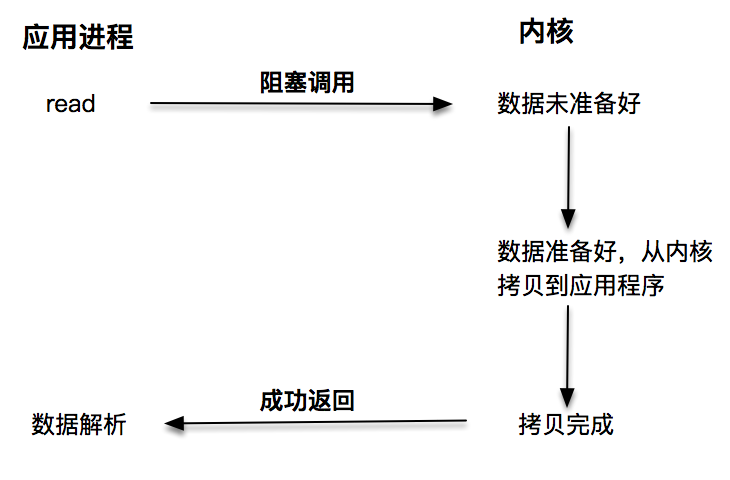
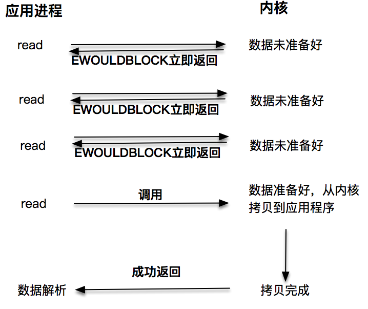
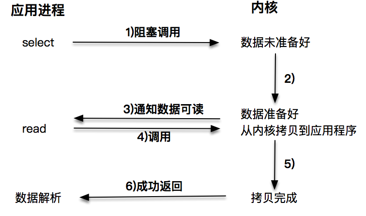
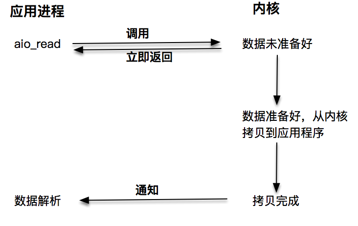
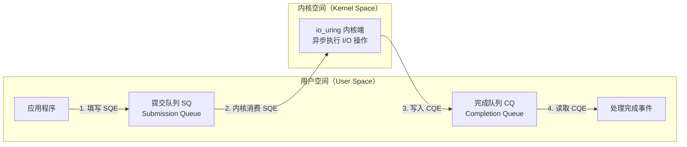
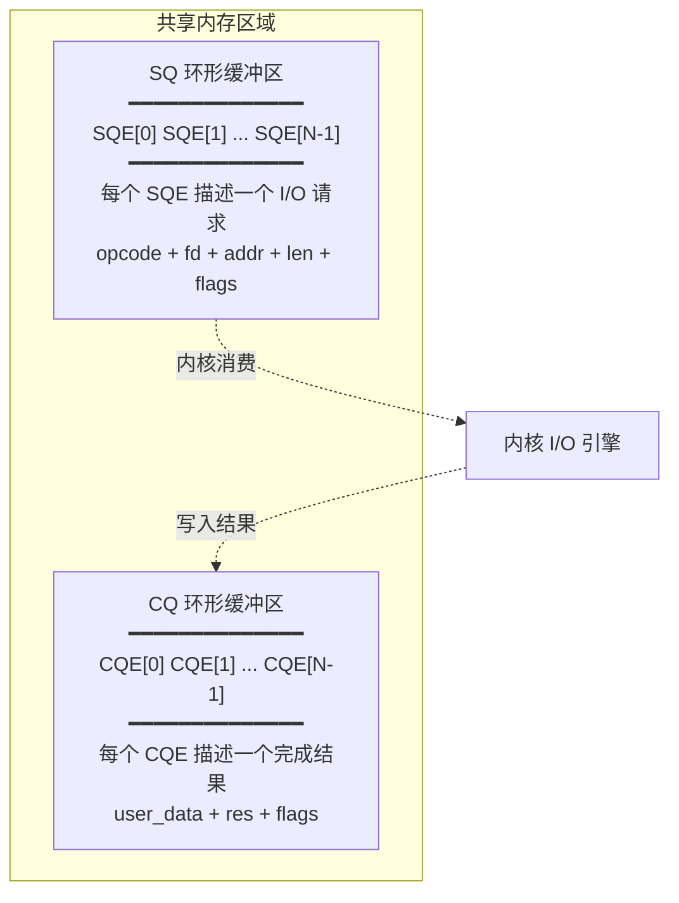

# 异步I/O机制：从POSIX AIO到io_uring

在性能篇的前几讲中，我们讨论了阻塞 I/O（Blocking I/O）、非阻塞 I/O（Non-blocking I/O）以及 select、poll、epoll 等 I/O 多路复用（I/O Multiplexing）技术，并在此基础上结合线程技术实现了以事件分发为核心的 Reactor 反应堆模式。此外还存在一种称为 Proactor 的网络事件驱动模式。Proactor 模式与 Reactor 模式的本质区别是什么？本文将从异步 I/O 的基本概念出发，先阐述 POSIX AIO 的局限性，再重点介绍 Linux 5.1 引入的革命性异步 I/O 机制——io_uring，最后揭开 Proactor 模式的面纱。

## 阻塞/非阻塞 VS 同步/异步

为避免概念混淆，首先梳理阻塞、非阻塞、同步、异步这四个核心概念。

### 阻塞 I/O（Blocking I/O）

阻塞 I/O 发起的 read 请求会使线程挂起，直到内核数据准备就绪并将数据从内核空间拷贝到应用程序缓冲区，read 调用才返回。此后应用程序方可对缓冲区数据进行解析。



### 非阻塞 I/O（Non-blocking I/O）

非阻塞的 read 请求在数据未准备好时立即返回，应用程序可不断轮询内核，直到数据准备就绪，内核将数据拷贝到应用程序缓冲区并完成 read 调用。注意，最后一次 read 调用获取数据的过程**是一个同步过程——即内核空间到用户空间的数据拷贝是在 read 函数中同步完成的**。



### I/O 多路复用（I/O Multiplexing）

让应用程序轮询内核的 I/O 是否准备就绪并不经济，因为轮询期间应用进程无法执行其他工作。select、poll、epoll 等 I/O 多路复用技术通过事件分发机制，在内核数据准备就绪时通知应用程序进行操作，显著提升了 CPU 利用率。

注意，此处 read 调用获取数据的过程**同样是一个同步过程**。



### 异步 I/O（Asynchronous I/O）

以上三种 I/O 模型均为同步调用技术。同步与异步的区别在于**获取数据的过程**：前三种模型中，read 调用时内核将数据从内核空间拷贝到应用程序空间，该过程在 read 函数中同步进行；若内核拷贝效率低下，read 调用将在该同步过程中消耗较长时间。

真正的异步 I/O 则不同：发起 `aio_read` 后立即返回，内核自动将数据从内核空间拷贝到应用程序空间，该拷贝过程由内核异步完成，应用程序无需主动发起拷贝动作。



### I/O 模型对比总结

| I/O 模型 | 数据准备阶段 | 数据拷贝阶段 | 是否阻塞 |
|----------|------------|------------|---------|
| 阻塞 I/O | 阻塞 | 阻塞 | 是 |
| 非阻塞 I/O | 非阻塞（轮询） | 阻塞 | 部分 |
| I/O 多路复用 | 阻塞（事件通知） | 阻塞 | 部分 |
| 异步 I/O | 非阻塞 | 非阻塞（内核完成） | 否 |

> **关键区分**：阻塞/非阻塞描述的是调用方在等待数据准备期间的行为；同步/异步描述的是数据拷贝阶段是否由调用方主动完成。

## POSIX AIO：用户空间的异步模拟

### aio_read 与 aio_write 的用法

POSIX 定义了 aio 系列函数作为异步操作接口。以下是一个使用示例：

```c
#include "lib/common.h"
#include <aio.h>

const int BUF_SIZE = 512;

int main() {
    int err;
    int result_size;

    // 创建一个临时文件
    char tmpname[256];
    snprintf(tmpname, sizeof(tmpname), "/tmp/aio_test_%d", getpid());
    unlink(tmpname);
    int fd = open(tmpname, O_CREAT | O_RDWR | O_EXCL, S_IRUSR | S_IWUSR);
    if (fd == -1) {
        error(1, errno, "open file failed ");
    }

    char buf[BUF_SIZE];
    struct aiocb aiocb;

    // 初始化 buf 缓冲，写入数据 0xfafa
    memset(buf, 0xfa, BUF_SIZE);
    memset(&aiocb, 0, sizeof(struct aiocb));
    aiocb.aio_fildes = fd;
    aiocb.aio_buf = buf;
    aiocb.aio_nbytes = BUF_SIZE;

    // 开始异步写
    if (aio_write(&aiocb) == -1) {
        printf(" Error at aio_write(): %s\n", strerror(errno));
        close(fd);
        exit(1);
    }

    // 轮询等待异步写完成
    while (aio_error(&aiocb) == EINPROGRESS) {
        printf("writing... \n");
    }

    // 判断写入结果
    err = aio_error(&aiocb);
    result_size = aio_return(&aiocb);
    if (err != 0 || result_size != BUF_SIZE) {
        printf(" aio_write failed() : %s\n", strerror(err));
        close(fd);
        exit(1);
    }

    // 准备异步读
    char buffer[BUF_SIZE];
    struct aiocb cb;
    cb.aio_nbytes = BUF_SIZE;
    cb.aio_fildes = fd;
    cb.aio_offset = 0;
    cb.aio_buf = buffer;

    // 开始异步读
    if (aio_read(&cb) == -1) {
        printf(" aio_read failed() : %s\n", strerror(err));
        close(fd);
    }

    // 轮询等待异步读完成
    while (aio_error(&cb) == EINPROGRESS) {
        printf("Reading... \n");
    }

    // 判断读结果
    int numBytes = aio_return(&cb);
    if (numBytes != -1) {
        printf("Success.\n");
    } else {
        printf("Error.\n");
    }

    close(fd);
    return 0;
}
```

该程序展示了 aio 系列函数的基本用法：

- `aio_write`：向内核提交异步写操作
- `aio_read`：向内核提交异步读操作
- `aio_error`：获取当前异步操作的状态
- `aio_return`：获取异步操作读写的字节数

核心数据结构 `aiocb` 是应用程序与操作系统内核之间传递异步请求的载体：

```c
struct aiocb {
   int       aio_fildes;       /* File descriptor */
   off_t     aio_offset;       /* File offset */
   volatile void  *aio_buf;     /* Location of buffer */
   size_t    aio_nbytes;       /* Length of transfer */
   int       aio_reqprio;      /* Request priority offset */
   struct sigevent    aio_sigevent;     /* Signal number and value */
   int       aio_lio_opcode;       /* Operation to be performed */
};
```

### POSIX AIO 的根本局限

aio 系列函数由 POSIX 标准定义，但 Linux 下的实现存在根本性缺陷：

**Linux 的 POSIX AIO 并非真正的操作系统级异步 I/O，而是由 GNU glibc 在用户空间通过 pthread 线程池模拟实现的，且仅支持磁盘类 I/O，不支持套接字（Socket）I/O。**

这意味着：
1. 每个 `aio_read`/`aio_write` 调用实际上由 glibc 创建的后台线程以同步阻塞方式执行
2. 线程池规模有限，大量并发请求会导致线程资源耗尽
3. 套接字 I/O 完全不支持，无法用于网络编程
4. 轮询 `aio_error` 的方式效率低下

历史上，Ben LaHaise 曾将内核级 aio 实现合并到 Linux 2.5.32 中，但该实现仅支持 `O_DIRECT` 方式的磁盘 I/O，不支持套接字。此后虽有 KAIO（Kernel AIO）等补丁，但始终未能提供完整的异步套接字 I/O 支持。

> **结论**：Linux POSIX AIO 本质上是用户空间的线程池模拟，并非真正的内核级异步 I/O。这也是 Linux 下高性能网络编程长期依赖 epoll + 非阻塞 I/O 的根本原因。

## io_uring：Linux 真正的内核级异步 I/O

### 历史背景

Linux 内核社区长期面临异步 I/O 支持不足的问题。2019 年，Jens Axboe 在 Linux 5.1 中引入了 io_uring，这是一个全新的、真正由内核支持的异步 I/O 机制。io_uring 的设计目标是提供统一的异步 I/O 接口，同时支持文件 I/O 和套接字 I/O，且具备极低的性能开销。

> **内核版本注记**：io_uring 自 Linux 5.1 引入，在 Linux 5.5-5.19 及 6.x/7.x 系列中持续增强，新增了 SQPOLL、registered buffers、fixed files、timeout、cancel、link 等特性。Linux 7.0 中 io_uring 已高度成熟，是 Linux 异步 I/O 的首选方案。

### io_uring 核心架构

io_uring 的核心设计基于两个共享环形缓冲区（Ring Buffer）：提交队列（Submission Queue，SQ）和完成队列（Completion Queue，CQ）。应用程序与内核通过这两个环形缓冲区进行通信，**全程无需系统调用**（在 SQPOLL 模式下），实现了真正的零系统调用开销。



**工作流程**：

1. **提交请求**：应用程序将 I/O 请求封装为提交队列条目（Submission Queue Entry，SQE），写入 SQ
2. **内核处理**：内核从 SQ 中读取 SQE，异步执行对应的 I/O 操作
3. **完成通知**：I/O 操作完成后，内核将结果封装为完成队列条目（Completion Queue Entry，CQE），写入 CQ
4. **结果处理**：应用程序从 CQ 中读取 CQE，获取操作结果

### io_uring Ring Buffer 详细结构



### io_uring 关键特性

| 特性 | 说明 | 引入版本 |
|------|------|---------|
| **批量提交（Batched Submission）** | 一次 `io_uring_enter` 调用可提交多个 SQE，减少系统调用次数 | Linux 5.1+ |
| **SQPOLL** | 内核线程轮询 SQ，应用程序无需调用 `io_uring_enter`，实现零系统调用 | Linux 5.1+ |
| **Registered Buffers** | 预注册缓冲区，内核可直接访问，避免页表映射开销 | Linux 5.1+ |
| **Fixed Files** | 预注册文件描述符，避免每次操作的 fd 查找开销 | Linux 5.1+ |
| **Linked SQEs** | SQE 之间可建立依赖关系，前一个完成后才执行下一个 | Linux 5.3+ |
| **Timeout & Cancel** | 支持超时控制和请求取消 | Linux 5.4+（timeout）/ 5.5+（cancel） |
| **Send/Recv ZC** | 零拷贝网络发送/接收 | Linux 6.0+ |

### io_uring 编程示例（liburing）

liburing 是 io_uring 的高层封装库，简化了编程接口。以下是一个基于 io_uring 的 TCP Echo 服务器示例：

```c
#include <liburing.h>
#include <netinet/in.h>
#include <stdio.h>
#include <stdlib.h>
#include <string.h>
#include <unistd.h>
#include <arpa/inet.h>

#define ENTRIES_LENGTH  4096
#define BUFFER_SIZE     2048

// 为每个连接维护的读缓冲区
struct conn_info {
    int fd;
    struct iovec iov;
};

int main(int argc, char *argv[]) {
    unsigned short port = 43211;
    int sockfd = socket(AF_INET, SOCK_STREAM, 0);

    struct sockaddr_in addr;
    memset(&addr, 0, sizeof(addr));
    addr.sin_family = AF_INET;
    addr.sin_port = htons(port);
    addr.sin_addr.s_addr = htonl(INADDR_ANY);

    bind(sockfd, (struct sockaddr *)&addr, sizeof(addr));
    listen(sockfd, 1024);

    // 初始化 io_uring 实例
    struct io_uring ring;
    io_uring_queue_init(ENTRIES_LENGTH, &ring, 0);

    // 注册 accept 请求
    struct io_uring_sqe *sqe = io_uring_get_sqe(&ring);
    io_uring_prep_accept(sqe, sockfd, NULL, NULL, 0);
    io_uring_submit(&ring);

    char buffers[ENTRIES_LENGTH][BUFFER_SIZE];
    struct conn_info conns[ENTRIES_LENGTH];

    while (1) {
        struct io_uring_cqe *cqe;
        io_uring_wait_cqe(&ring, &cqe);

        struct conn_info *conn_i = (struct conn_info *)io_uring_cqe_get_data(cqe);

        if (conn_i == NULL) {
            // accept 完成，获取新连接
            int connfd = cqe->res;
            io_uring_cqe_seen(&ring, cqe);

            // 继续注册 accept
            sqe = io_uring_get_sqe(&ring);
            io_uring_prep_accept(sqe, sockfd, NULL, NULL, 0);
            io_uring_submit(&ring);

            // 注册新连接的 recv 请求
            int bid = connfd;
            conns[bid].fd = connfd;
            conns[bid].iov.iov_base = buffers[bid];
            conns[bid].iov.iov_len = BUFFER_SIZE;

            sqe = io_uring_get_sqe(&ring);
            io_uring_prep_recv(sqe, connfd, buffers[bid], BUFFER_SIZE, 0);
            io_uring_sqe_set_data(sqe, &conns[bid]);
            io_uring_submit(&ring);
        } else {
            // recv 完成
            int n = cqe->res;
            io_uring_cqe_seen(&ring, cqe);

            if (n <= 0) {
                close(conn_i->fd);
                continue;
            }

            // 注册 send 请求（Echo 回写）
            sqe = io_uring_get_sqe(&ring);
            io_uring_prep_send(sqe, conn_i->fd, conn_i->iov.iov_base, n, 0);
            io_uring_sqe_set_data(sqe, conn_i);
            io_uring_submit(&ring);

            // 再次注册 recv
            sqe = io_uring_get_sqe(&ring);
            io_uring_prep_recv(sqe, conn_i->fd, conn_i->iov.iov_base, BUFFER_SIZE, 0);
            io_uring_sqe_set_data(sqe, conn_i);
            io_uring_submit(&ring);
        }
    }

    io_uring_queue_exit(&ring);
    return 0;
}
```

该示例展示了 io_uring 的核心编程模式：

1. **初始化**：`io_uring_queue_init` 创建 io_uring 实例
2. **提交请求**：`io_uring_get_sqe` 获取 SQE，`io_uring_prep_*` 系列函数填充请求参数，`io_uring_submit` 提交
3. **等待完成**：`io_uring_wait_cqe` 等待 CQE，`io_uring_cqe_seen` 标记已处理
4. **零系统调用**：在 SQPOLL 模式下，提交请求无需 `io_uring_submit` 系统调用

### Reactor（epoll）vs Proactor（io_uring）模式对比

```mermaid
graph TB
    subgraph "Reactor 模式（epoll）"
        R1[epoll_wait 返回可读事件] --> R2[应用程序调用 read]
        R2 --> R3[内核执行数据拷贝]
        R3 --> R4[read 返回，应用处理数据]
        R4 --> R5[应用程序调用 write]
        R5 --> R6[内核执行数据拷贝]
    end

    subgraph "Proactor 模式（io_uring）"
        P1[应用提交 recv SQE] --> P2[内核异步执行 recv + 数据拷贝]
        P2 --> P3[CQ 返回完成事件 + 数据]
        P3 --> P4[应用处理数据]
        P4 --> P5[应用提交 send SQE]
        P5 --> P6[内核异步执行 send + 数据拷贝]
        P6 --> P7[CQ 返回完成事件]
    end

```



**核心区别**：

- **Reactor 模式**：基于待完成的 I/O 事件通知。epoll 通知应用程序"数据已就绪，可以读/写了"，应用程序仍需主动调用 read/write 完成数据拷贝。
- **Proactor 模式**：基于已完成的 I/O 事件通知。io_uring 在内核完成数据拷贝后通知应用程序"数据已读取完毕/已发送完毕"，应用程序直接处理结果。

### io_uring vs epoll 对比

| 维度 | epoll | io_uring |
|------|-------|----------|
| **I/O 模型** | 同步非阻塞（Reactor） | 真正异步（Proactor） |
| **系统调用开销** | 每次 epoll_wait/epoll_ctl 均需系统调用 | 批量提交，SQPOLL 模式下零系统调用 |
| **数据拷贝** | 应用程序主动 read/write，涉及内核-用户空间拷贝 | 内核异步完成拷贝，registered buffers 支持零拷贝 |
| **事件通知** | 通知"可读/可写"（就绪通知） | 通知"读/写完成"（完成通知） |
| **文件 I/O** | 不支持（文件始终视为就绪） | 完整支持 |
| **套接字 I/O** | 完整支持 | 完整支持 |
| **批量操作** | 单次 epoll_wait 返回多个事件，但 read/write 逐个调用 | 批量提交 SQE，批量收割 CQE |
| **编程复杂度** | 较低，模型成熟 | 较高，需理解 SQ/CQ 机制 |
| **内核版本要求** | Linux 2.5.44+ | Linux 5.1+（完整特性需 5.10+） |
| **生态成熟度** | 极高，Nginx/Redis 等广泛使用 | 快速增长，Linux 7.0 已高度成熟 |

## Windows 下的 IOCP 和 Proactor 模式

与 Linux 不同，Windows 实现了一套完整的支持套接字的异步编程接口——I/O Completion Port（IOCP），由此产生了基于 IOCP 的 Proactor 模式。

与 Reactor 模式类似，Proactor 模式也存在一个无限循环运行的 event loop 线程，但该线程不负责处理 I/O 调用，仅负责在 read/write 操作完成后分发完成事件。

以 HTTP 服务请求为例，Proactor 模式的工作流程如下：

1. 客户端发起 GET 请求
2. 内核异步读取完整的请求字节流，将完成事件放入完成队列
3. Proactor 线程从完成队列获取事件，分发到对应的处理函数（如 HTTP handler 的 onMessage）
4. HTTP request 解析函数完成报文解析
5. 业务逻辑处理（如数据库查询）
6. 业务逻辑处理完成，编码后发起异步写操作
7. 内核异步执行写操作，完成后将完成事件放入完成队列
8. Proactor 线程获取完成事件，分发到 HTTP handler 的 onWriteCompleted 方法

由于系统内核提供了真正的异步操作，Proactor 不再像 Reactor 那样在感知事件后调用 read/write 完成数据读写，它只负责感知事件完成，I/O 读写操作由系统内核完成。应用程序需传入数据缓冲区地址等信息，以便内核自动完成数据读写。

> **重要更新**：随着 io_uring 的引入和成熟，Linux 现已具备与 Windows IOCP 对等的真正内核级异步 I/O 能力。基于 io_uring 的 Proactor 模式已成为 Linux 高性能网络编程的新选择。

## 总结

本文从阻塞/非阻塞与同步/异步的概念辨析出发，梳理了四种 I/O 模型的本质区别。POSIX AIO 在 Linux 下仅为用户空间的 pthread 模拟，不支持套接字 I/O，并非真正的内核级异步 I/O。io_uring 自 Linux 5.1 引入，通过共享环形缓冲区（SQ + CQ）实现了真正的内核级异步 I/O，同时支持文件 I/O 和套接字 I/O，并提供零拷贝、批量提交、SQPOLL 等高级特性。

Reactor 模式基于待完成的 I/O 事件（epoll），Proactor 模式基于已完成的 I/O 事件（io_uring/IOCP），两者的本质都是借由事件分发的思想，设计出可兼容、可扩展、接口友好的程序框架。在主流的 6.x 内核时代，io_uring 为 Proactor 模式提供了坚实的内核级支持，开发者可根据场景选择 Reactor（epoll）或 Proactor（io_uring）模式。

## 思考题

1. io_uring 的 SQPOLL 模式如何实现零系统调用？在何种场景下应启用 SQPOLL，何种场景下应使用默认的 `io_uring_enter` 提交方式？
2. 在 POSIX AIO 示例中，`aio_error` 轮询方式效率低下，io_uring 通过什么机制避免了这一问题？
3. 若需将现有的基于 epoll 的 Reactor 框架迁移至 io_uring，需要关注哪些架构层面的变化？

## 版本信息

- 更新日期：2026-06-09
- 目标内核：Linux 6.x（截至 2026-09 主流）
- 关键 API 版本：io_uring 自 Linux 5.1 引入；SQPOLL 自 Linux 5.1 引入；registered buffers 自 Linux 5.1 引入；linked SQEs 自 Linux 5.3 引入；send/recv zero-copy 自 Linux 6.0 引入；POSIX AIO（glibc 用户空间实现）无内核版本依赖
