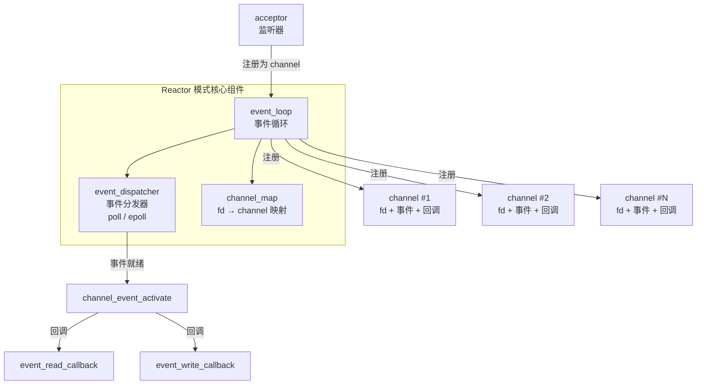
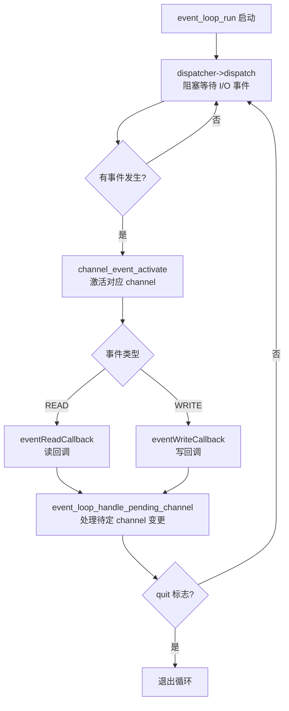

# 高性能HTTP服务器设计（一）：架构与Reactor模式

从本文开始，进入实战篇，逐步构建一个高性能 HTTP 服务器。

在编写高性能 HTTP 服务器之前，首先需要构建一个支持 TCP 的高性能网络编程框架。完成 TCP 高性能网络框架后，再增加 HTTP 特性支持即可快速开发出高性能 HTTP 服务器程序。

## 设计需求

综合性能篇中的使用经验，TCP 高性能网络框架需满足以下三项核心需求：

1. **采用 Reactor 模式**：可灵活选用 poll 或 epoll 作为事件分发实现
2. **支持多线程**：既可运行于单线程单 Reactor 模式，也可运行于多线程主从 Reactor（Master-Slave Reactor）模式，将套接字上的 I/O 事件分离到多个线程
3. **封装读写操作到 Buffer 对象**：对应用程序屏蔽套接字读写细节

对应以上三项需求，整体设计思路分为三块：Reactor 模式设计、I/O 模型与多线程模型设计、数据读写封装与 Buffer。本文重点阐述主要设计思路、数据结构以及 Reactor 模式设计。

## 主要设计思路

### Reactor 模式架构

Reactor 模式的核心是基于事件分发和回调的反应堆框架。以下架构图展示了核心组件及其交互关系：



该框架中的主要对象包括：

#### event_loop

`event_loop` 是与线程绑定的无限事件循环。它是一个持续运行的事件分发器，一旦有事件发生，便回调预先定义的处理函数完成事件处理。

具体而言，`event_loop` 使用 poll 或 epoll 方法将线程阻塞，等待各类 I/O 事件的发生。

#### channel

对注册到 `event_loop` 上的对象统一抽象为 channel，例如监听事件、套接字读写事件等。channel 是框架与事件分发机制交互的核心结构。

#### acceptor

`acceptor` 对象表示服务器端监听器，最终会作为一个 channel 对象注册到 `event_loop` 上，以便进行连接完成的事件分发和检测。

#### event_dispatcher

`event_dispatcher` 是对事件分发机制的抽象。可实现基于 poll 的 `poll_dispatcher`，也可实现基于 epoll 的 `epoll_dispatcher`。通过统一的 `event_dispatcher` 结构体抽象这些行为，实现策略模式（Strategy Pattern）。

#### channel_map

`channel_map` 保存文件描述符到 channel 的映射，当事件发生时，可根据套接字描述符快速定位对应的 channel 对象及其事件处理函数。

### I/O 模型和多线程模型设计

I/O 线程与多线程模型主要解决 `event_loop` 的线程运行问题，以及事件分发和回调的线程执行问题。

#### thread_pool

`thread_pool` 维护一个 Sub-Reactor 线程列表。当新连接建立时，主 Reactor 线程从线程池中选取一个线程，将新连接套接字的 read/write 事件注册到该线程的 `event_loop` 上，实现 I/O 线程与主 Reactor 线程的分离。

#### event_loop_thread

`event_loop_thread` 是 Reactor 的线程实现，连接套接字的 read/write 事件检测均在此线程中完成。

### Buffer 和数据读写

#### buffer

`buffer` 对象屏蔽了对套接字的读写操作。若无 buffer 对象，连接套接字的 read/write 事件需直接与字节流交互，编程接口不够友好。`buffer` 对象用于表示从连接套接字接收的数据，以及应用程序即将发送的数据。

#### tcp_connection

`tcp_connection` 描述已建立的 TCP 连接，其属性包括接收缓冲区、发送缓冲区、channel 对象等，是一个 TCP 连接的天然属性集合。

`tcp_connection` 是大部分应用程序与框架交互的数据结构。设计该对象的目的是避免将底层的 channel 对象直接暴露给应用程序——channel 对象不仅可表示 `tcp_connection`，还可表示监听套接字、唤醒 socketpair 等。`tcp_connection` 提供了更清晰的编程入口。

## Reactor 模式设计

### event_loop 运行流程

以下流程图展示了 `event_loop` 的完整运行机制：



当 `event_loop_run` 完成后，线程进入循环，首先执行 dispatch 事件分发。一旦有事件发生，调用 `channel_event_activate` 函数，在该函数中完成读/写回调函数的调用。最后执行 `event_loop_handle_pending_channel` 修改当前监听的事件列表，完成后再进入下一轮事件分发循环。

### event_loop 数据结构分析

`event_loop` 是整个 Reactor 模式设计的核心。其数据结构如下：

```c
struct event_loop {
    int quit;
    const struct event_dispatcher *eventDispatcher;

    /** 对应的 event_dispatcher 的数据 */
    void *event_dispatcher_data;
    struct channel_map *channelMap;

    int is_handle_pending;
    struct channel_element *pending_head;
    struct channel_element *pending_tail;

    pthread_t owner_thread_id;
    pthread_mutex_t mutex;
    pthread_cond_t cond;
    int socketPair[2];
    char *thread_name;
};
```

关键字段说明：

- **eventDispatcher**：最重要的字段，可理解为 poll 或 epoll，使线程挂起等待事件发生
- **event_dispatcher_data**：定义为 `void *` 类型，可根据不同实现（poll/epoll）放置不同的数据对象
- **owner_thread_id**：每个 event loop 的线程 ID，用于多线程同步
- **mutex / cond**：线程同步原语
- **socketPair**：父线程通知子线程有新事件需处理的管道对
- **pending_head / pending_tail**：子线程内待处理的新事件链表

### event_loop_run 方法

`event_loop_run` 是一个无限 while 循环，不断分发事件：

```c
/**
 * 1. 参数验证
 * 2. 调用 dispatcher 进行事件分发，分发完回调事件处理函数
 */
int event_loop_run(struct event_loop *eventLoop) {
    assert(eventLoop != NULL);

    struct event_dispatcher *dispatcher = eventLoop->eventDispatcher;

    if (eventLoop->owner_thread_id != pthread_self()) {
        exit(1);
    }

    yolanda_msgx("event loop run, %s", eventLoop->thread_name);
    struct timeval timeval;
    timeval.tv_sec = 1;

    while (!eventLoop->quit) {
        // 阻塞等待 I/O 事件，获取活跃 channel
        dispatcher->dispatch(eventLoop, &timeval);

        // 处理待定的 channel 变更
        event_loop_handle_pending_channel(eventLoop);
    }

    yolanda_msgx("event loop end, %s", eventLoop->thread_name);
    return 0;
}
```

循环体中调用 `dispatcher` 对象的 `dispatch` 方法等待事件发生，返回后处理 pending channel 列表。

### event_dispatcher 结构体

为支持不同的事件分发机制，将 poll、epoll 等抽象为 `event_dispatcher` 结构体，采用策略模式实现多态。具体实现包括 `poll_dispatcher` 和 `epoll_dispatcher` 两种。

```c
/** 抽象的 event_dispatcher 结构体，对应实现如 select、poll、epoll 等 I/O 复用 */
struct event_dispatcher {
    /** 对应实现名称 */
    const char *name;

    /** 初始化函数 */
    void *(*init)(struct event_loop * eventLoop);

    /** 通知 dispatcher 新增一个 channel 事件 */
    int (*add)(struct event_loop * eventLoop, struct channel * channel);

    /** 通知 dispatcher 删除一个 channel 事件 */
    int (*del)(struct event_loop * eventLoop, struct channel * channel);

    /** 通知 dispatcher 更新 channel 对应的事件 */
    int (*update)(struct event_loop * eventLoop, struct channel * channel);

    /** 实现事件分发，然后调用 event_loop 的 event_activate 方法执行 callback */
    int (*dispatch)(struct event_loop * eventLoop, struct timeval *);

    /** 清除数据 */
    void (*clear)(struct event_loop * eventLoop);
};
```

### channel 对象

channel 是与 `event_dispatcher` 交互的核心结构体，抽象了事件分发。一个 channel 对应一个文件描述符，描述符上可以有 READ 可读事件或 WRITE 可写事件。channel 绑定了事件处理函数 `event_read_callback` 和 `event_write_callback`。

```c
typedef int (*event_read_callback)(void *data);

typedef int (*event_write_callback)(void *data);

struct channel {
    int fd;
    int events;   // 表示 event 类型

    event_read_callback eventReadCallback;
    event_write_callback eventWriteCallback;
    void *data; // callback data，可能是 event_loop、tcp_server 或 tcp_connection
};
```

### channel_map 对象

`event_dispatcher` 获取活动事件列表后，需通过文件描述符找到对应的 channel，进而回调事件处理函数。为此设计了 `channel_map` 对象。

```c
/**
 * channel 映射表，key 为对应的 socket 描述字
 */
struct channel_map {
    void **entries;

    /* The number of entries available in entries */
    int nentries;
};
```

`channel_map` 本质上是一个指针数组，数组下标为描述符，元素为 channel 对象的地址。例如描述符 3 对应的 channel 可直接获取：

```c
struct channel * channel = map->entries[3];
```

### channel_event_activate 实现

当 `event_dispatcher` 需要回调 channel 上的读写函数时，调用 `channel_event_activate`：

```c
int channel_event_activate(struct event_loop *eventLoop, int fd, int revents) {
    struct channel_map *map = eventLoop->channelMap;
    yolanda_msgx("activate channel fd == %d, revents=%d, %s", fd, revents, eventLoop->thread_name);

    if (fd < 0)
        return 0;

    if (fd >= map->nentries)return (-1);

    struct channel *channel = map->entries[fd];
    assert(fd == channel->fd);

    if (revents & (EVENT_READ)) {
        if (channel->eventReadCallback) channel->eventReadCallback(channel->data);
    }
    if (revents & (EVENT_WRITE)) {
        if (channel->eventWriteCallback) channel->eventWriteCallback(channel->data);
    }

    return 0;
}
```

此处使用 `EVENT_READ` 和 `EVENT_WRITE` 抽象了 poll 和 epoll 的所有读写事件类型。

### 增加、删除、修改 channel event

以下函数用于增加、删除和修改 channel event 事件：

```c
int event_loop_add_channel_event(struct event_loop *eventLoop, int fd, struct channel *channel1);

int event_loop_remove_channel_event(struct event_loop *eventLoop, int fd, struct channel *channel1);

int event_loop_update_channel_event(struct event_loop *eventLoop, int fd, struct channel *channel1);
```

以上三个函数提供入口能力，真正的实现由以下三个函数完成：

```c
int event_loop_handle_pending_add(struct event_loop *eventLoop, int fd, struct channel *channel);

int event_loop_handle_pending_remove(struct event_loop *eventLoop, int fd, struct channel *channel);

int event_loop_handle_pending_update(struct event_loop *eventLoop, int fd, struct channel *channel);
```

以 `event_loop_handle_pending_add` 为例：在当前 `event_loop` 的 `channel_map` 中增加 key-value 对（key 为文件描述符，value 为 channel 对象地址），之后调用 `event_dispatcher` 的 add 方法增加 channel event 事件。此方法始终在当前 I/O 线程中执行。

```c
// in the i/o thread
int event_loop_handle_pending_add(struct event_loop *eventLoop, int fd, struct channel *channel) {
    yolanda_msgx("add channel fd == %d, %s", fd, eventLoop->thread_name);
    struct channel_map *map = eventLoop->channelMap;

    if (fd < 0)
        return 0;

    if (fd >= map->nentries) {
        if (map_make_space(map, fd, sizeof(struct channel *)) == -1)
            return (-1);
    }

    // 首次创建，增加
    if ((map)->entries[fd] == NULL) {
        map->entries[fd] = channel;
        // add channel
        struct event_dispatcher *eventDispatcher = eventLoop->eventDispatcher;
        eventDispatcher->add(eventLoop, channel);
        return 1;
    }

    return 0;
}
```

## 总结

本文介绍了高性能网络编程框架的主要设计思路、基本数据结构以及 Reactor 模式设计的具体实现。核心设计要点包括：

- **event_loop** 作为事件循环的核心，绑定线程、管理事件分发
- **event_dispatcher** 通过策略模式抽象 poll/epoll 等不同事件分发机制
- **channel** 统一抽象事件注册与回调
- **channel_map** 提供描述符到 channel 的高效映射

后续章节将继续阐述框架的线程模型以及读写 Buffer 部分。

## 思考题

1. 若有兴趣，可实现一个 `select_dispatcher` 对象，用 select 方法实现 `event_dispatcher` 接口。
2. 仔细研读 `channel_map` 实现中的 `map_make_space` 部分，阐述其内存管理策略的设计考量。

## 版本信息

- 更新日期：2026-06-09
- 目标内核：Linux 7.0
- 关键 API 版本：poll 自 POSIX.1-2001；epoll 自 Linux 2.5.44 引入；`eventfd` 自 Linux 2.6.22 引入（可替代 socketpair 作为唤醒机制）
