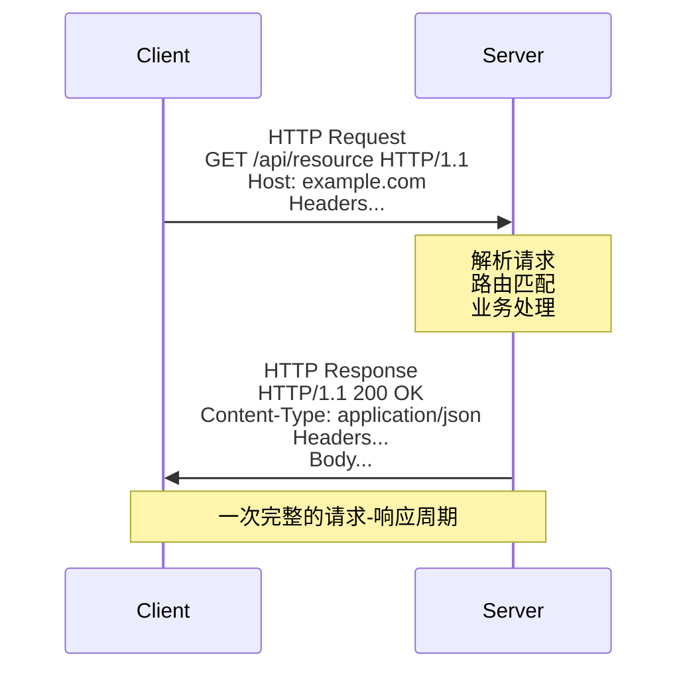
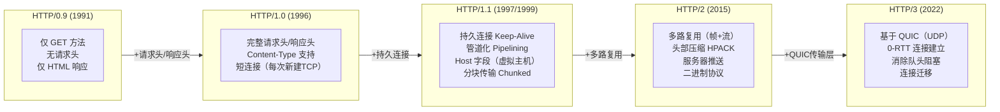
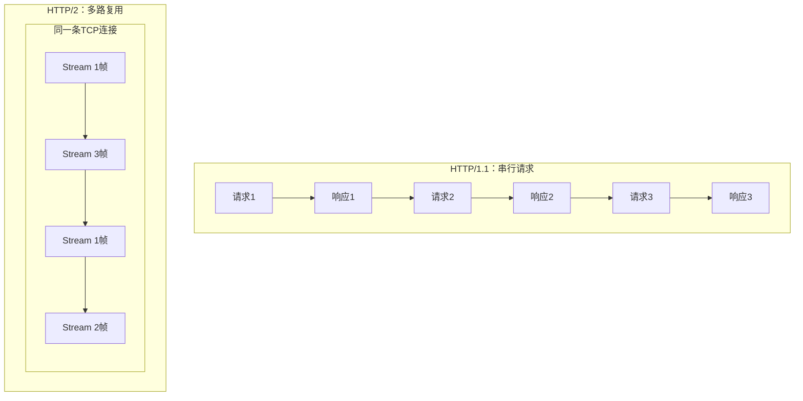
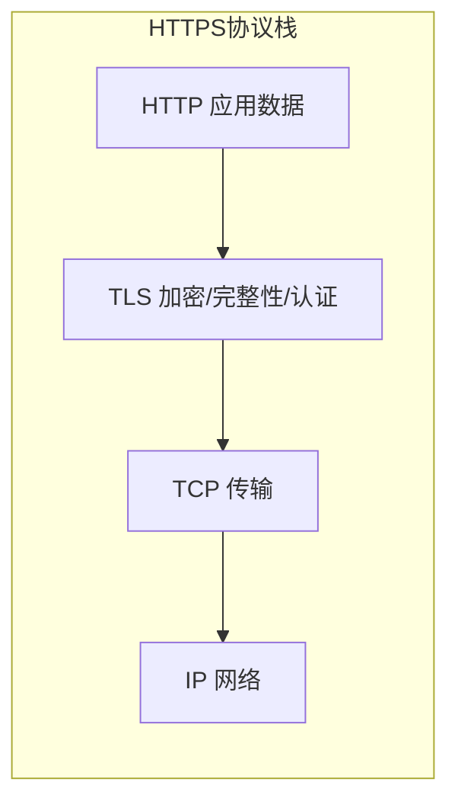
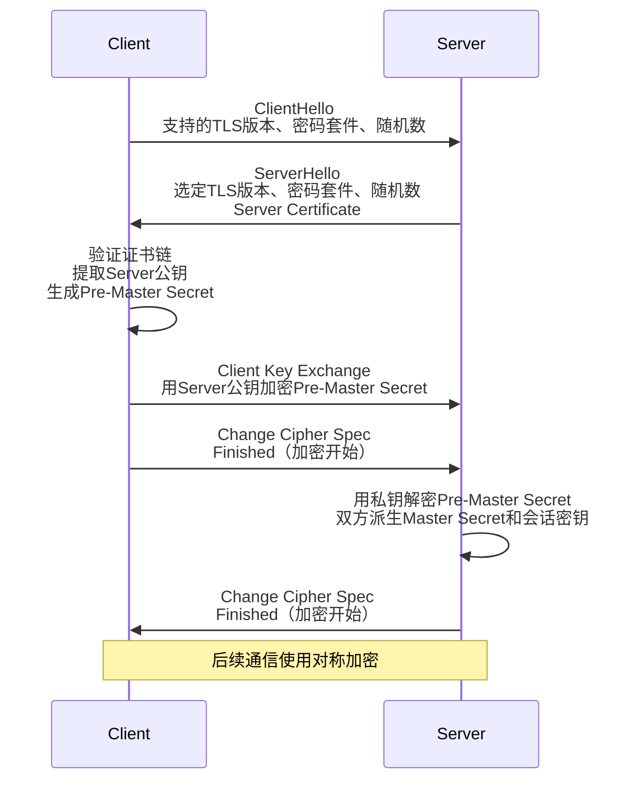
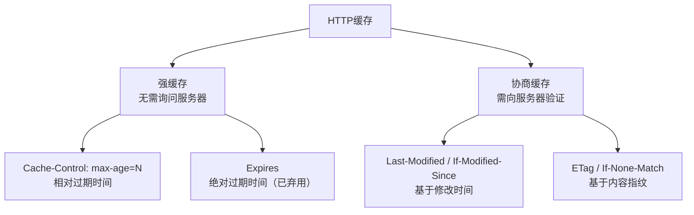

# 网络-HTTP协议

## 章节导言

在上一节"[21-网络-TCP与可靠传输](21-网络-TCP与可靠传输.md)"中，我们深入剖析了 TCP 如何在不可靠的 IP 网络上构建可靠字节流。TCP 解决了传输的可靠性问题，但它提供的是通用的字节流抽象——应用层仍需自行定义数据的格式与语义。

HTTP（HyperText Transfer Protocol，超文本传输协议）正是应用层对这一问题的回答。正如许式伟在"[19-网络-协议与分层](19-网络-协议与分层.md)"中所指出的：HTTP 协议因万维网而生，冲着传输静态网页而去，但由于设计上的开放性，几经演进到今天，已俨然成为一个通用传输协议。

HTTP 的成功并非偶然。它的协议头设计极其开放，规范了业务的表达范式（资源 + CRUD），统一了应用层的路由方式（域名 + 资源路径）。这些特性使 HTTP 成为互联网应用层协议的事实标准。

---

## 核心概念与原理

### HTTP 的本质：请求-响应模型

HTTP 采用经典的**请求-响应（Request-Response）模型**：客户端发起请求，服务器返回响应。这一模型简洁而强大，但也意味着 HTTP 天然是**客户端驱动的**——服务器无法主动向客户端推送数据（HTTP/2 的 Server Push 和 WebSocket 是对此的补充）。



### HTTP 报文结构

HTTP 报文分为请求报文和响应报文，结构高度对称：

**请求报文**：
```text
<method> <request-target> <version>       ← 请求行
<field-name>: <field-value>               ← 请求头
<field-name>: <field-value>
                                           ← 空行（CRLF）
<message-body>                             ← 请求体（可选）
```

**响应报文**：
```text
<version> <status-code> <reason-phrase>   ← 状态行
<field-name>: <field-value>               ← 响应头
<field-name>: <field-value>
                                           ← 空行（CRLF）
<message-body>                             ← 响应体（可选）
```

#### 请求方法（Method）

HTTP 方法定义了对资源的操作语义：

| 方法 | 语义 | 幂等性 | 安全性 |
|------|------|--------|--------|
| GET | 获取资源表示 | 幂等 | 安全 |
| HEAD | 获取资源元信息（无 Body） | 幂等 | 安全 |
| POST | 创建资源 / 提交数据处理 | 非幂等 | 非安全 |
| PUT | 替换资源（全量更新） | 幂等 | 非安全 |
| PATCH | 修改资源（增量更新） | 非幂等 | 非安全 |
| DELETE | 删除资源 | 幂等 | 非安全 |
| OPTIONS | 查询支持的通信选项 | 幂等 | 安全 |

**幂等性（Idempotency）** 是 HTTP 语义的核心概念：同一请求执行一次与执行多次的效果相同。GET、PUT、DELETE 是幂等的，POST 不是。这一特性在分布式系统中至关重要——网络超时后重试幂等操作是安全的，重试非幂等操作可能导致重复创建。

#### 状态码（Status Code）

状态码是 HTTP 响应的语义核心，由三位数字组成：

| 范围 | 类别 | 典型状态码 |
|------|------|-----------|
| 1xx | 信息性 | 100 Continue |
| 2xx | 成功 | 200 OK, 201 Created, 204 No Content |
| 3xx | 重定向 | 301 Moved Permanently, 302 Found, 304 Not Modified |
| 4xx | 客户端错误 | 400 Bad Request, 401 Unauthorized, 403 Forbidden, 404 Not Found |
| 5xx | 服务器错误 | 500 Internal Server Error, 502 Bad Gateway, 503 Service Unavailable |

**架构师关注点**：状态码不仅是给客户端看的，更是给中间基础设施（网关、负载均衡、CDN）看的。例如，503 告知负载均衡器后端不可用，应摘除节点；304 告知 CDN 缓存仍然有效。滥用状态码（如所有错误都返回 200 + 自定义错误码）会破坏 HTTP 生态的协同能力。

#### 关键请求头字段

| 字段 | 作用 | 示例 |
|------|------|------|
| Host | 目标主机域名（HTTP/1.1 唯一必需字段） | `Host: api.example.com` |
| Content-Type | 请求体的媒体类型 | `Content-Type: application/json` |
| Content-Length | 请求体的字节长度 | `Content-Length: 128` |
| Authorization | 认证凭据 | `Authorization: Bearer <token>` |
| Accept | 客户端期望的响应格式 | `Accept: application/json` |
| Cache-Control | 缓存指令 | `Cache-Control: no-cache` |
| If-Modified-Since / If-None-Match | 条件请求 | `If-None-Match: "etag-value"` |

### HTTP 版本演进

HTTP 协议经历了从 0.9 到 3.0 的重大演进，每一代都在解决上一代的核心性能瓶颈：



#### HTTP/1.0：短连接的代价

HTTP/1.0 默认使用短连接——每个请求/响应完成后关闭 TCP 连接。一个包含 10 个资源的网页需要建立 10 次 TCP 连接，每次都要经历三次握手和慢启动。这极大地浪费了网络资源。

#### HTTP/1.1：持久连接与管道化

HTTP/1.1 引入了两个关键改进：

1. **持久连接（Persistent Connection）**：默认 `Connection: keep-alive`，TCP 连接在请求/响应完成后不关闭，可复用于后续请求。这消除了重复的连接建立开销。

2. **管道化（Pipelining）**：允许客户端在收到前一个响应之前发送下一个请求。但管道化存在严重的队头阻塞——服务器必须按请求顺序返回响应，先到的请求如果处理慢，会阻塞后续所有响应。因此，管道化在实践中几乎未被启用。

**HTTP/1.1 的核心瓶颈**：虽然连接可复用，但请求-响应仍是串行的。浏览器通常对同一域名开放 6 个并发连接来缓解，但这引入了额外的连接开销和连接间竞争。

#### HTTP/2：多路复用与二进制帧

HTTP/2 对协议进行了根本性重构：

**二进制分帧层**：HTTP/2 将所有信息分割为更小的帧（Frame），并采用二进制编码。帧类型包括 HEADERS、DATA、SETTINGS、PING 等。

**流（Stream）**：每个请求/响应对应一个流，流内通过流 ID 标识。多个流的帧可以在同一条 TCP 连接上交错传输——这就是**多路复用**。



**头部压缩（HPACK）**：HTTP/1.1 的请求头是纯文本且大量重复（如 Cookie、User-Agent 每次请求都携带）。HPACK 使用静态表、动态表和哈夫曼编码，可将头部大小压缩 80% 以上。

**服务器推送（Server Push）**：服务器可以主动向客户端推送资源（如客户端请求 HTML 时，服务器同时推送 CSS 和 JS），减少往返延迟。

**HTTP/2 的遗留问题**：多路复用消除了应用层的队头阻塞，但 TCP 层的队头阻塞仍然存在——一个 TCP 报文段丢失会阻塞所有流的数据交付。这正是 HTTP/3 选择 QUIC 的根本原因（参见[21-网络-TCP与可靠传输](21-网络-TCP与可靠传输.md)中关于队头阻塞的讨论）。

#### HTTP/3：基于 QUIC 的传输革新

HTTP/3 将传输层从 TCP 替换为 QUIC（基于 UDP），核心收益：

1. **消除传输层队头阻塞**：QUIC 的每条流独立可靠传输，一条流的丢包不影响其他流。
2. **更快的连接建立**：QUIC 将传输层握手和 TLS 握手合并，首次连接 1-RTT，重连 0-RTT。
3. **连接迁移**：基于 Connection ID 而非四元组标识连接，网络切换不断连。

### HTTPS：HTTP 的安全层

HTTP 协议本身是明文传输，存在窃听、篡改和钓鱼三大风险（参见[20 | 安全：攻击与防御](../../07-架构与工程/02-架构设计/04-许式伟架构课/09-安全-攻击与防御.md)）。HTTPS = HTTP + TLS（Transport Layer Security），在传输层和应用层之间插入安全层。



**TLS 握手过程**（TLS 1.2）：



**TLS 1.3 的改进**：将握手从 2-RTT 缩减为 1-RTT，重连时支持 0-RTT。移除了不安全的密码套件（如 RC4、3DES、SHA-1），仅保留 AEAD 加密（AES-GCM、ChaCha20-Poly1305）。

### HTTP 缓存机制

缓存是 HTTP 性能优化的核心机制，分为两类：



**强缓存**：浏览器在缓存有效期内直接使用本地副本，不发送任何请求。通过 `Cache-Control: max-age` 或 `Expires` 控制。

**协商缓存**：缓存过期后，浏览器向服务器发送条件请求（携带 `If-Modified-Since` 或 `If-None-Match`）。若资源未变化，服务器返回 304 Not Modified（无 Body），浏览器继续使用本地缓存；若资源已变化，返回 200 和新资源。

**架构师关注点**：缓存策略的选择取决于资源的变更频率和一致性要求。静态资源（JS/CSS/图片）适合长期强缓存 + 内容哈希文件名（如 `app.3a7b.js`）；API 响应通常不适合缓存或仅使用协商缓存。

---

## 设计原则与权衡（Trade-off 分析）

### 原则一：通用性优先于效率

HTTP 的设计哲学是"通用协议"——它不针对任何特定业务场景优化，而是提供足够通用的语义框架。RESTful API 正是这一哲学的体现：用统一的资源 + CRUD 语义表达千变万化的业务。

**Trade-off**：通用性意味着 HTTP 在特定场景下效率不如专用协议。例如，实时双向通信用 HTTP 轮询效率极低，WebSocket 是更好的选择；高性能 RPC 场景，gRPC 基于 HTTP/2 但使用 Protobuf 而非 JSON，以效率换取通用性。

### 原则二：无状态与有状态的权衡

HTTP/1.0 和 HTTP/1.1 被设计为无状态协议——每个请求独立，服务器不保留客户端状态。这带来了水平扩展的便利性：任何请求可以被路由到任意服务器实例。

**Trade-off**：无状态意味着每次请求都需携带完整的上下文信息（如认证 Token、Cookie），增加了带宽消耗。会话状态被迫移至客户端（Cookie）或外部存储（Redis Session），引入了额外的复杂度。

### 原则三：文本协议 vs 二进制协议

HTTP/1.x 是文本协议，可读性好，调试方便（curl 一条命令即可测试）。HTTP/2 转向二进制帧，解析效率更高，头部压缩更有效，但可读性丧失。

**Trade-off**：文本协议降低了开发和调试门槛，但解析效率低、头部冗余大。二进制协议性能更优，但需要专用工具调试。HTTP/2 的选择反映了协议成熟后效率优先的演进方向。

### 原则四：请求-响应模型的局限

HTTP 的请求-响应模型天然不支持服务器主动推送。SSE（Server-Sent Events）实现了单向的服务器推送，WebSocket 实现了全双工通信，但它们都是对 HTTP 模型的补充而非替代。

**Trade-off**：请求-响应模型简单、可缓存、与现有基础设施（代理、CDN、网关）兼容。全双工模型功能更强，但放弃了缓存和中间件支持。架构师需根据场景选择。

---

## 实践案例与反模式

### 案例：RESTful API 设计

REST（Representational State Transfer）是 HTTP 协议语义的最佳实践范式：

- **资源定位**：URL 标识资源，`/users/123/orders` 表示用户 123 的订单集合
- **统一接口**：GET 查询、POST 创建、PUT 替换、PATCH 修改、DELETE 删除
- **状态转移**：客户端通过请求驱动资源状态变化，服务端无状态

**反模式**：将 HTTP 当作 RPC 传输通道——`POST /getUserById`、`POST /updateUserName`。这浪费了 HTTP 的语义能力，使 URL 丧失资源含义，状态码形同虚设。

### 反模式：大请求体与分页缺失

未实现分页的 API（如 `GET /users` 返回全量数据）在数据量增长后会导致严重的性能问题：响应体过大、传输耗时长、内存占用高。

**正确做法**：实现分页（`GET /users?page=1&size=20`），使用 Link Header 或自定义分页字段告知客户端总页数和下一页链接。

### 案例：HTTP/2 优先级与依赖

HTTP/2 允许客户端为流设置优先级和依赖关系。例如，HTML 文档的流优先级最高，CSS 次之，JS 再次，图片最低。服务器据此调度资源发送顺序，优化页面加载体验。

**实践问题**：许多 HTTP/2 实现和中间件未正确处理优先级，导致优先级信息被忽略。HTTP/3 进一步简化了优先级模型（引入 urgency 和 incremental 两个维度）。

### 案例：CDN 与 HTTP 缓存协同

CDN（Content Delivery Network）是 HTTP 缓存机制在基础设施层面的延伸。CDN 节点作为反向代理，根据 `Cache-Control` 和 `Vary` 头决定是否缓存及缓存变体。

**关键配置**：`Vary: Accept-Encoding` 告知 CDN 为不同的内容编码（gzip/br/identity）缓存不同版本。遗漏 `Vary` 可能导致 CDN 将压缩版本返回给不支持解压的客户端。

---

## 小结与关键要点

1. **HTTP 的成功源于设计开放性**：开放的协议头、规范的资源 + CRUD 范式、统一的路由方式，使其从超文本传输协议演变为通用应用层协议。
2. **版本演进的核心驱动力是性能**：HTTP/1.0 的短连接 → HTTP/1.1 的持久连接 → HTTP/2 的多路复用 → HTTP/3 的 QUIC 传输，每一代都在消除上一代的性能瓶颈。
3. **HTTP/2 未完全解决队头阻塞**：应用层队头阻塞已消除，但 TCP 层队头阻塞仍在。HTTP/3 基于 QUIC 彻底解决此问题。
4. **HTTPS 是现代 Web 的底线**：TLS 提供加密、完整性和认证，是 HTTP 安全传输的基础保障。
5. **缓存是 HTTP 性能优化的核心**：强缓存与协商缓存各有适用场景，合理的缓存策略可大幅减少网络请求。
6. **HTTP 语义的完整性至关重要**：正确使用方法、状态码、请求头，不仅是对规范的尊重，更是与整个 HTTP 基础设施生态协同的前提。

**延伸阅读**：
- 14 | IP 网络：连接世界的桥梁——HTTP 之下的网络基础
- [19-网络-协议与分层](19-网络-协议与分层.md)——HTTP 协议概要与编程接口
- [21-网络-TCP与可靠传输](21-网络-TCP与可靠传输.md)——HTTP 依赖的传输层机制
- [20 | 安全：攻击与防御](../../07-架构与工程/02-架构设计/04-许式伟架构课/09-安全-攻击与防御.md)——HTTPS 与 Web 安全
- [21 | 安全：认证与授权](../../07-架构与工程/02-架构设计/04-许式伟架构课/10-安全-认证与授权.md)——HTTP 认证机制与 OAuth
