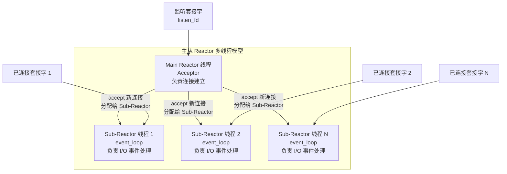
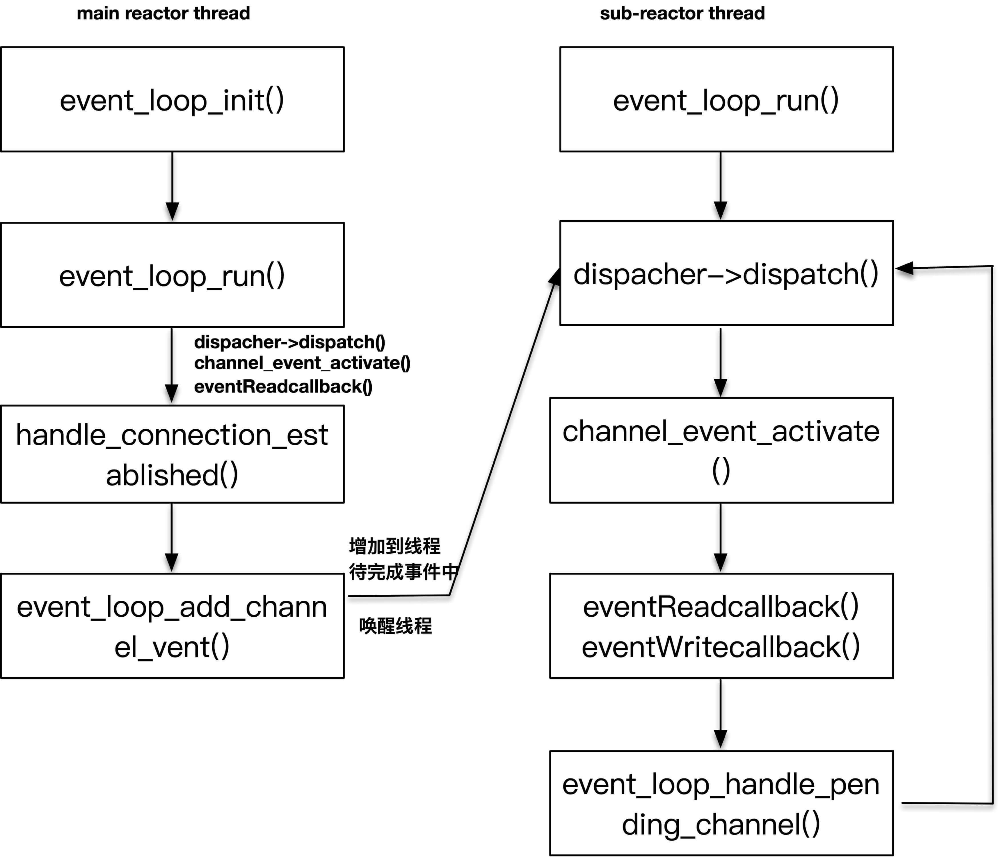
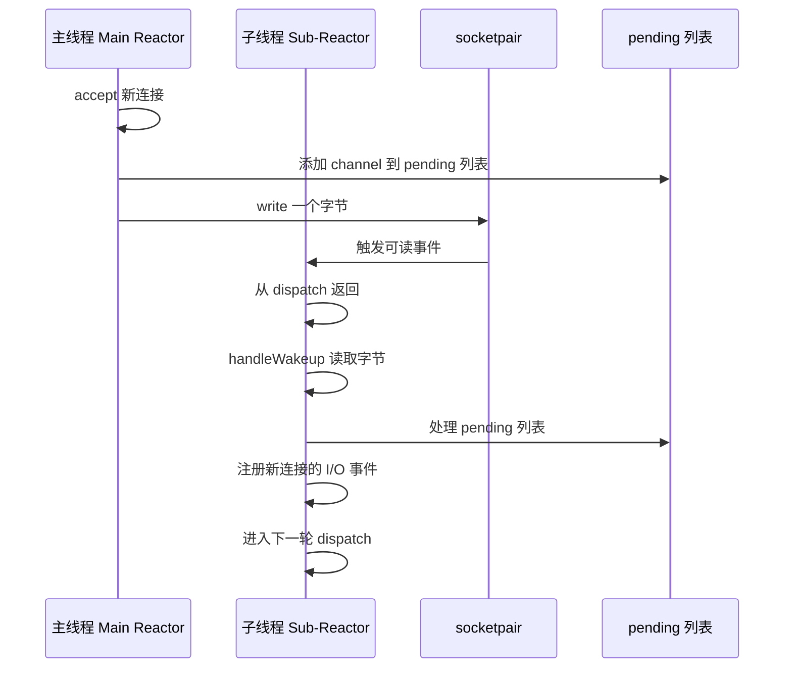

# 高性能HTTP服务器设计（二）：I/O模型与多线程实现

本文延续上一篇《高性能HTTP服务器设计（一）：架构与Reactor模式》，深入解析高性能网络编程框架的 I/O 模型和多线程模型设计部分。

## 多线程设计的核心问题

在本框架的设计中，Main Reactor 线程是一个 acceptor 线程，创建后以 `event_loop` 形式阻塞在 `event_dispatcher` 的 `dispatch` 方法上，等待监听套接字上的连接完成事件。一旦有连接完成，便创建 `tcp_connection` 对象和 channel 对象。

多线程设计需要解决两个核心问题：

1. **主线程如何判断子线程已完成初始化并启动？** 当用户期望使用多个 Sub-Reactor 子线程时，主线程创建子线程后需等待其初始化完成再继续执行。
2. **主线程如何通知阻塞在事件分发中的子线程有新事件加入？** Sub-Reactor 线程阻塞在 `dispatch` 上，主线程需协调数据传递。

子线程作为 `event_loop` 线程，阻塞在 `dispatch` 上，一旦有事件发生便查找 `channel_map`，找到对应的处理函数并执行，之后增加、删除或修改 pending 事件，再次进入下一轮 `dispatch`。



主线程与 Sub-Reactor 线程对应的函数执行流程如下图所示：



## 主线程等待 Sub-Reactor 子线程初始化完成

主线程需等待子线程完成初始化，获取子线程对应数据的反馈。子线程初始化也是对该部分数据进行初始化，这本质上是一个多线程同步通知问题。采用 mutex 和 condition 两个同步原语解决。

以下代码由主线程发起子线程创建，调用 `event_loop_thread_init` 对每个子线程初始化，之后调用 `event_loop_thread_start` 启动子线程。若线程池大小为 0，则直接返回——acceptor 和 I/O 事件均在同一个主线程中处理，退化为单 Reactor 模式。

```c
// 由 main thread 发起
void thread_pool_start(struct thread_pool *threadPool) {
    assert(!threadPool->started);
    assertInSameThread(threadPool->mainLoop);

    threadPool->started = 1;
    void *tmp;

    if (threadPool->thread_number <= 0) {
        return;
    }

    threadPool->eventLoopThreads = malloc(threadPool->thread_number * sizeof(struct event_loop_thread));
    for (int i = 0; i < threadPool->thread_number; ++i) {
        event_loop_thread_init(&threadPool->eventLoopThreads[i], i);
        event_loop_thread_start(&threadPool->eventLoopThreads[i]);
    }
}
```

`event_loop_thread_start` 方法由主线程调用，通过 `pthread_create` 创建子线程，子线程立即执行 `event_loop_thread_run` 进行初始化。该方法的核心是使用 `pthread_mutex_lock`/`pthread_mutex_unlock` 加解锁，并通过 `pthread_cond_wait` 等待 `eventLoopThread` 中 `eventLoop` 变量的初始化完成。

```c
// 由主线程调用，初始化一个子线程并使其开始运行 event_loop
struct event_loop *event_loop_thread_start(struct event_loop_thread *eventLoopThread) {
    pthread_create(&eventLoopThread->thread_tid, NULL, &event_loop_thread_run, eventLoopThread);

    assert(pthread_mutex_lock(&eventLoopThread->mutex) == 0);

    while (eventLoopThread->eventLoop == NULL) {
        assert(pthread_cond_wait(&eventLoopThread->cond, &eventLoopThread->mutex) == 0);
    }
    assert(pthread_mutex_unlock(&eventLoopThread->mutex) == 0);

    yolanda_msgx("event loop thread started, %s", eventLoopThread->thread_name);
    return eventLoopThread->eventLoop;
}
```

子线程的执行函数 `event_loop_thread_run` 同样先加锁，初始化 `event_loop` 对象后调用 `pthread_cond_signal` 通知阻塞在 `pthread_cond_wait` 上的主线程。主线程从 wait 中苏醒，代码继续执行。子线程本身通过调用 `event_loop_run` 进入无限循环的事件分发执行体。

```c
void *event_loop_thread_run(void *arg) {
    struct event_loop_thread *eventLoopThread = (struct event_loop_thread *) arg;

    pthread_mutex_lock(&eventLoopThread->mutex);

    // 初始化 event loop，之后通知主线程
    eventLoopThread->eventLoop = event_loop_init();
    yolanda_msgx("event loop thread init and signal, %s", eventLoopThread->thread_name);
    pthread_cond_signal(&eventLoopThread->cond);

    pthread_mutex_unlock(&eventLoopThread->mutex);

    // 子线程 event loop run
    eventLoopThread->eventLoop->thread_name = eventLoopThread->thread_name;
    event_loop_run(eventLoopThread->eventLoop);
}
```

### 同步机制详解

主线程与子线程共享的变量是每个 `event_loop_thread` 的 `eventLoop` 对象。该对象初始化时为 NULL，子线程完成初始化后变为非 NULL 值——这是子线程完成初始化的标志，也是条件变量守护的变量。

```c
struct event_loop_thread {
    struct event_loop *eventLoop;
    pthread_t thread_tid;        /* thread ID */
    pthread_mutex_t mutex;
    pthread_cond_t cond;
    char * thread_name;
    long thread_count;    /* # connections handled */
};
```

```mermaid
sequenceDiagram
    participant Main as 主线程
    participant Child as 子线程
    participant Mutex as 互斥锁
    participant Cond as 条件变量

    Main->>Mutex: pthread_mutex_lock
    Main->>Child: pthread_create (创建子线程)
    activate Child
    Child->>Mutex: pthread_mutex_lock (等待锁)
    Main->>Cond: pthread_cond_wait (释放锁并等待)
    deactivate Main
    Child->>Child: event_loop_init (初始化)
    Child->>Cond: pthread_cond_signal (通知主线程)
    Child->>Mutex: pthread_mutex_unlock
    activate Main
    Main->>Cond: pthread_cond_wait 返回 (重新获取锁)
    Main->>Mutex: pthread_mutex_unlock
    deactivate Main
    Child->>Child: event_loop_run (进入事件循环)
    deactivate Child
```

**关于第二个子线程已初始化完成的场景**：主线程进入第二次循环等待时，若第二个子线程已完成初始化，由于主线程持有锁，发现 `eventLoop` 已为非 NULL 值，即可确定该线程已初始化，直接释放锁继续执行。

**关于 `pthread_cond_wait` 与锁的关系**：父线程调用 `pthread_cond_wait` 后立即进入睡眠并释放互斥锁；从 `pthread_cond_wait` 返回时（被子线程的 `pthread_cond_signal` 通知），该线程再次持有锁。

> **内核版本注记**：`pthread_create`、`pthread_cond_wait`、`pthread_mutex_lock` 等 POSIX 线程接口自 POSIX.1-2001 标准化，在 Linux 上通过 NPTL（Native POSIX Thread Library）实现，自 Linux 2.6 起成为默认线程库。Linux 7.0 中 NPTL 已高度成熟，支持线程优先级、CPU 亲和性等高级特性。

## 增加已连接套接字事件到 Sub-Reactor 线程

主线程（Main Reactor）负责检测监听套接字上的连接建立事件。当有多个 Sub-Reactor 子线程时，需将已连接套接字的 I/O 事件交给 Sub-Reactor 处理。这种分工的优势在于：Main Reactor 仅负责连接建立，可维持极高的处理效率；多个 Sub-Reactor 在多核环境下充分利用并行处理能力。

### 核心问题

Sub-Reactor 线程是无限循环的 `event_loop` 执行体，在没有已注册事件时阻塞在 `event_dispatcher` 的 `dispatch` 上（可视为阻塞在 poll 调用或 `epoll_wait` 上）。主线程如何将已连接套接字交给 Sub-Reactor 子线程？

### 解决方案：socketpair 唤醒机制

若能使 Sub-Reactor 线程从 `dispatch` 返回，并在返回后注册新的已连接套接字事件，问题即可解决。

使 Sub-Reactor 线程从 `dispatch` 返回的方法：构建一个管道描述符，让 `event_dispatcher` 注册该管道描述符。当需要唤醒 Sub-Reactor 线程时，向管道写入一个字节即可。

在 `event_loop_init` 函数中，通过 `socketpair` 创建套接字对。向套接字对的一端写入数据，另一端即可感知到读事件。此处也可使用 UNIX pipe 管道，作用相同。

> **内核版本注记**：`eventfd` 自 Linux 2.6.22 引入，相比 socketpair 具有更低的内核开销，是现代事件通知机制的推荐方案。本框架使用 socketpair 以保持兼容性，生产环境建议使用 `eventfd`。

```c
struct event_loop *event_loop_init() {
    ...
    // 创建套接字对，用于唤醒子线程
    eventLoop->owner_thread_id = pthread_self();
    if (socketpair(AF_UNIX, SOCK_STREAM, 0, eventLoop->socketPair) < 0) {
        LOG_ERR("socketpair set failed");
    }
    eventLoop->is_handle_pending = 0;
    eventLoop->pending_head = NULL;
    eventLoop->pending_tail = NULL;
    eventLoop->thread_name = "main thread";

    struct channel *channel = channel_new(eventLoop->socketPair[1], EVENT_READ, handleWakeup, NULL, eventLoop);
    event_loop_add_channel_event(eventLoop, eventLoop->socketPair[1], channel);

    return eventLoop;
}
```

关键代码：注册 `socketPair[1]` 描述符上的 READ 事件，事件发生时调用 `handleWakeup` 函数。

```c
struct channel *channel = channel_new(eventLoop->socketPair[1], EVENT_READ, handleWakeup, NULL, eventLoop);
```

`handleWakeup` 函数从 `socketPair[1]` 读取一个字节，使子线程从 `dispatch` 的阻塞中苏醒：

```c
int handleWakeup(void * data) {
    struct event_loop *eventLoop = (struct event_loop *) data;
    char one;
    ssize_t n = read(eventLoop->socketPair[1], &one, sizeof one);
    if (n != sizeof one) {
        LOG_ERR("handleWakeup  failed");
    }
    yolanda_msgx("wakeup, %s", eventLoop->thread_name);
}
```

### 新连接的处理流程

当新连接产生时，主线程在 `handle_connection_established` 中通过 accept 获取已连接套接字，设置为非阻塞模式，从线程池中获取一个 `event_loop`，创建 `tcp_connection` 对象。

```c
// 处理连接已建立的回调函数
int handle_connection_established(void *data) {
    struct TCPserver *tcpServer = (struct TCPserver *) data;
    struct acceptor *acceptor = tcpServer->acceptor;
    int listenfd = acceptor->listen_fd;

    struct sockaddr_in client_addr;
    socklen_t client_len = sizeof(client_addr);
    // 获取已连接套接字，设置为非阻塞
    int connected_fd = accept(listenfd, (struct sockaddr *) &client_addr, &client_len);
    make_nonblocking(connected_fd);

    yolanda_msgx("new connection established, socket == %d", connected_fd);

    // 从线程池中选取一个 event_loop 服务新连接
    struct event_loop *eventLoop = thread_pool_get_loop(tcpServer->threadPool);

    // 创建 tcp_connection 对象，设置应用程序回调
    struct tcp_connection *tcpConnection = tcp_connection_new(connected_fd, eventLoop,
        tcpServer->connectionCompletedCallBack,
        tcpServer->connectionClosedCallBack,
        tcpServer->messageCallBack,
        tcpServer->writeCompletedCallBack);
    if (tcpServer->data != NULL) {
        tcpConnection->data = tcpServer->data;
    }
    return 0;
}
```

`tcp_connection_new` 创建 channel 对象并注册 READ 事件，调用 `event_loop_add_channel_event` 将 channel 对象添加到子线程：

```c
struct tcp_connection *tcp_connection_new(int connected_fd, struct event_loop *eventLoop,
                   connection_completed_call_back connectionCompletedCallBack,
                   connection_closed_call_back connectionClosedCallBack,
                   message_call_back messageCallBack, write_completed_call_back writeCompletedCallBack) {
    ...
    // 为新连接对象创建可读事件
    struct channel *channel1 = channel_new(connected_fd, EVENT_READ, handle_read, handle_write, tcpConnection);
    tcpConnection->channel = channel1;

    // 连接完成回调
    if (tcpConnection->connectionCompletedCallBack != NULL) {
        tcpConnection->connectionCompletedCallBack(tcpConnection);
    }

    // 将 channel 对象注册到子线程的 event_loop 上
    event_loop_add_channel_event(tcpConnection->eventLoop, connected_fd, tcpConnection->channel);
    return tcpConnection;
}
```

### 跨线程事件注册机制

以上操作均在主线程中执行。`event_loop_do_channel_event` 实现了跨线程的事件注册：

1. 获取锁后，调用 `event_loop_channel_buffer_nolock` 将 channel event 对象添加到子线程的 pending 列表
2. 若当前操作非 `event_loop` 所属线程（即主线程发起），调用 `event_loop_wakeup` 唤醒子线程（向 `socketPair[0]` 写入一个字节）
3. 若为当前 `event_loop` 线程自身发起，直接调用 `event_loop_handle_pending_channel` 处理

```c
int event_loop_do_channel_event(struct event_loop *eventLoop, int fd, struct channel *channel1, int type) {
    // 获取锁
    pthread_mutex_lock(&eventLoop->mutex);
    assert(eventLoop->is_handle_pending == 0);
    // 往该线程的 channel 列表增加新的 channel
    event_loop_channel_buffer_nolock(eventLoop, fd, channel1, type);
    // 释放锁
    pthread_mutex_unlock(&eventLoop->mutex);
    // 若为主线程发起，唤醒子线程
    if (!isInSameThread(eventLoop)) {
        event_loop_wakeup(eventLoop);
    } else {
        // 若为子线程自身，直接操作
        event_loop_handle_pending_channel(eventLoop);
    }

    return 0;
}
```

子线程被唤醒后，在 `event_loop_run` 的循环体中也会执行 `event_loop_handle_pending_channel`：

```c
int event_loop_run(struct event_loop *eventLoop) {
    assert(eventLoop != NULL);

    struct event_dispatcher *dispatcher = eventLoop->eventDispatcher;

    if (eventLoop->owner_thread_id != pthread_self()) {
        exit(1);
    }

    yolanda_msgx("event loop run, %s", eventLoop->thread_name);
    struct timeval timeval;
    timeval.tv_sec = 1;

    while (!eventLoop->quit) {
        // 阻塞等待 I/O 事件，获取活跃 channel
        dispatcher->dispatch(eventLoop, &timeval);

        // 处理 pending channel，子线程被唤醒后也会立即执行此处
        event_loop_handle_pending_channel(eventLoop);
    }

    yolanda_msgx("event loop end, %s", eventLoop->thread_name);
    return 0;
}
```

`event_loop_handle_pending_channel` 遍历当前 `event_loop` 中 pending 的 channel event 列表，将其与 `event_dispatcher` 关联，修改感兴趣的事件集合。



> **重要设计考量**：`event_loop` 线程获得活动事件后会回调事件处理函数，`onMessage` 等应用程序代码也在 `event_loop` 线程中执行。若业务逻辑过于复杂，将导致 `event_loop_handle_pending_channel` 执行时间偏后，影响 I/O 检测的及时性。因此，将 I/O 线程与业务逻辑线程隔离——I/O 线程仅负责 I/O 交互，业务线程处理业务逻辑——是较为常见的优化做法。

## 总结

本文重点阐述了框架中涉及多线程的两个核心问题及其解决方案：

1. **主线程等待子线程初始化完成**：通过 mutex + condition 变量实现同步。子线程初始化完成后通过 `pthread_cond_signal` 通知主线程，主线程从 `pthread_cond_wait` 中苏醒后继续执行。
2. **通知阻塞在事件分发中的子线程有新事件加入**：通过 `socketpair` 创建管道对，将管道一端注册为 channel 到 `event_loop` 中。主线程通过向管道写入字节唤醒子线程，子线程苏醒后处理 pending channel 列表。

这两个机制共同支撑了主从 Reactor 多线程模型的运行，使得 Main Reactor 专注于连接建立，Sub-Reactor 线程专注于 I/O 事件处理，充分发挥多核 CPU 的并行能力。

## 思考题

1. 修改代码，使 Sub-Reactor 默认线程数为 `cpu_count * 2`。
2. 当前线程选择算法为 Round-Robin，分析其不足之处，并提出改进方案。

## 版本信息

| 项目 | 说明 |
|------|------|
| 更新日期 | 2026-06-09 |
| 目标内核 | Linux 7.0 |
| pthread_create | POSIX.1-2001，Linux NPTL 自 2.6 起为默认实现 |
| pthread_cond_wait | POSIX.1-2001，条件变量同步原语 |
| socketpair | POSIX.1-2001，创建套接字对 |
| eventfd | Linux 2.6.22 — 推荐替代 socketpair 的事件通知机制 |
| SO_REUSEPORT | Linux 3.9 — 支持多进程/线程 accept 负载均衡 |
