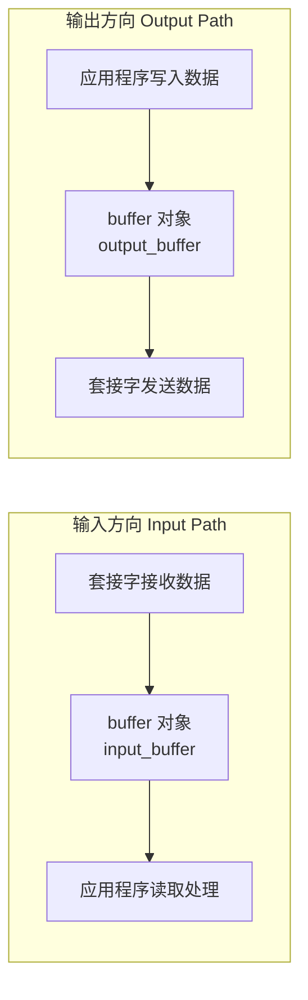
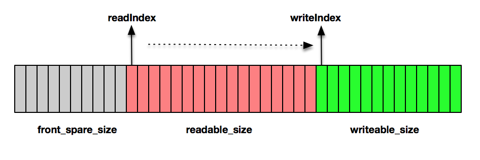
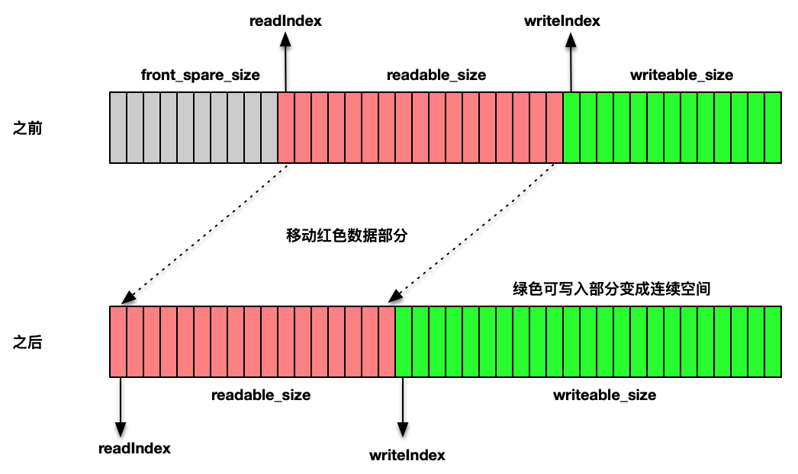
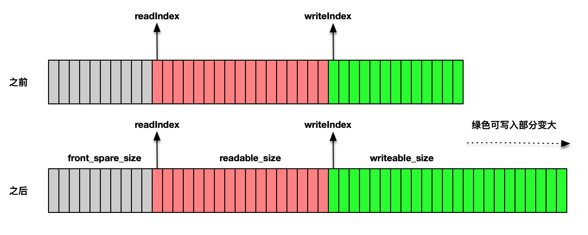
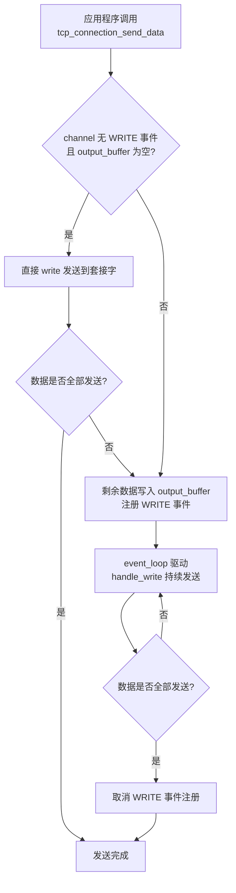
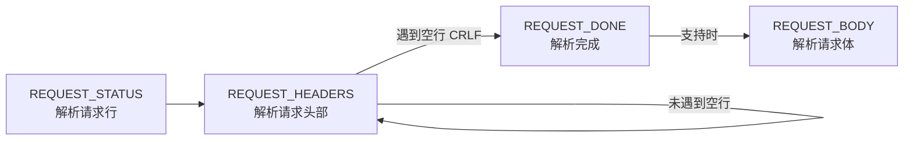

# 高性能HTTP服务器设计（三）：TCP字节流处理与HTTP协议

本文延续上一篇《高性能HTTP服务器设计（二）：I-O模型与多线程实现》，深入解析高性能网络编程框架的字节流处理机制，并在此基础上实现 HTTP 协议解析，完成 HTTP 高性能服务器的编写。

## Buffer 对象

Buffer 对象（缓冲区对象）是网络编程框架的核心数据结构之一，缓存了从套接字接收的数据以及需要发往套接字的数据。

对于输入方向，事件处理回调函数不断向 buffer 对象追加数据，同时应用程序不断从 buffer 对象中读取并处理数据，释放已处理数据的空间以容纳更多数据。

对于输出方向，应用程序不断向 buffer 对象追加编码后的数据，同时事件处理回调函数不断调用套接字发送函数将数据发出，减少 buffer 对象中的待发送数据。

可见，buffer 对象同时承担输入缓冲（Input Buffer）和输出缓冲（Output Buffer）两个角色，区别在于两个方向上写入和读出的对象不同。



下图描述了 buffer 对象的设计：



以下是 buffer 对象的数据结构定义：

```c
// 数据缓冲区
struct buffer {
    char *data;          // 实际缓冲区
    int readIndex;       // 缓冲读取位置
    int writeIndex;      // 缓冲写入位置
    int total_size;      // 总大小
};
```

buffer 对象中的 `writeIndex` 标识当前可写入的位置；`readIndex` 标识当前可读出数据的位置。图中红色部分（从 `readIndex` 到 `writeIndex` 的区域）是需要读出的数据，绿色部分（从 `writeIndex` 到缓冲区末尾的区域）是可写入的空间。

### 缓冲区空间整理：make_room

随着数据的读写推进，`readIndex` 和 `writeIndex` 逐渐靠近缓冲区尾端，而前方已读取的空闲区域（`front_spare_size`）变得越来越大。此时需调整 buffer 对象的结构：将有效数据向左移动，使后方形成连续的可写空间。

`make_room` 函数实现了此逻辑：若右侧连续空间不足以容纳新数据，但左侧空闲空间与右侧可写空间之和足够，则触发数据搬移，将有效数据移至最左端，右侧成为连续可写空间。若总空间不足，则通过 `realloc` 扩容。



```c
void make_room(struct buffer *buffer, int size) {
    if (buffer_writeable_size(buffer) >= size) {
        return;
    }
    // 如果 front_spare 和 writeable 的大小加起来可以容纳数据，则把可读数据往前面拷贝
    if (buffer_front_spare_size(buffer) + buffer_writeable_size(buffer) >= size) {
        int readable = buffer_readable_size(buffer);
        int i;
        for (i = 0; i < readable; i++) {
            memcpy(buffer->data + i, buffer->data + buffer->readIndex + i, 1);
        }
        buffer->readIndex = 0;
        buffer->writeIndex = readable;
    } else {
        // 扩大缓冲区
        void *tmp = realloc(buffer->data, buffer->total_size + size);
        if (tmp == NULL) {
            return;
        }
        buffer->data = tmp;
        buffer->total_size += size;
    }
}
```

当有效数据占据过大空间，可写部分不足以容纳新数据时，触发缓冲区扩容操作，通过 `realloc` 函数完成。



> **优化说明**：上述 `make_room` 实现中逐字节 `memcpy` 的方式效率较低。生产环境中应使用单次 `memmove` 调用替代循环拷贝，`memmove` 能正确处理源地址和目标地址重叠的情况。

## 套接字接收数据处理

套接字接收数据在 `tcp_connection.c` 的 `handle_read` 函数中完成。该函数通过 `buffer_socket_read` 接收来自套接字的数据流，缓冲到 buffer 对象中，随后将 buffer 对象和 `tcp_connection` 对象传递给应用程序的消息处理回调函数 `messageCallBack` 进行报文解析。

```c
int handle_read(void *data) {
    struct tcp_connection *tcpConnection = (struct tcp_connection *) data;
    struct buffer *input_buffer = tcpConnection->input_buffer;
    struct channel *channel = tcpConnection->channel;

    if (buffer_socket_read(input_buffer, channel->fd) > 0) {
        // 应用程序真正读取 Buffer 里的数据
        if (tcpConnection->messageCallBack != NULL) {
            tcpConnection->messageCallBack(input_buffer, tcpConnection);
        }
    } else {
        handle_connection_closed(tcpConnection);
    }
}
```

在 `buffer_socket_read` 函数中，调用 `readv` 向两个缓冲区写入数据：一个是 buffer 对象本身，另一个是栈上的 `additional_buffer`。使用 `readv` 的原因是：若来自套接字的数据流超过 buffer 对象的当前可写空间，无法直接触发扩容操作（因为 `readv` 需预先指定缓冲区地址和长度）。通过额外的栈缓冲区接收溢出数据，再通过 `buffer_append` 触发 `make_room` 扩容，即可解决此问题。

```c
int buffer_socket_read(struct buffer *buffer, int fd) {
    char additional_buffer[INIT_BUFFER_SIZE];
    struct iovec vec[2];
    int max_writable = buffer_writeable_size(buffer);
    vec[0].iov_base = buffer->data + buffer->writeIndex;
    vec[0].iov_len = max_writable;
    vec[1].iov_base = additional_buffer;
    vec[1].iov_len = sizeof(additional_buffer);
    int result = readv(fd, vec, 2);
    if (result < 0) {
        return -1;
    } else if (result <= max_writable) {
        buffer->writeIndex += result;
    } else {
        buffer->writeIndex = buffer->total_size;
        buffer_append(buffer, additional_buffer, result - max_writable);
    }
    return result;
}
```

> **内核版本注记**：`readv` 属于 Scatter-Gather I/O（分散-聚集 I/O）接口，自 POSIX.1-2001 标准化。Linux 4.14 引入的 `preadv2`/`pwritev2` 支持 `RWF_NOWAIT` 标志，可实现非阻塞的向量读写操作，在高性能场景中可进一步减少系统调用次数。

## 套接字发送数据处理

当应用程序完成 read-decode-compute-encode 流程后，将编码后的数据写入 buffer 对象，调用 `tcp_connection_send_buffer`，通过套接字缓冲区发送出去。

```c
int tcp_connection_send_buffer(struct tcp_connection *tcpConnection, struct buffer *buffer) {
    int size = buffer_readable_size(buffer);
    int result = tcp_connection_send_data(tcpConnection, buffer->data + buffer->readIndex, size);
    buffer->readIndex += size;
    return result;
}
```

发送策略采用**直接发送优先、框架缓冲兜底**的方式：若当前 channel 未注册 WRITE 事件且 `output_buffer` 无待发送数据，则直接调用 `write` 将数据发送到套接字缓冲区；若一次发送不完，则将剩余数据拷贝到 `output_buffer`，并向 `event_loop` 注册 WRITE 事件，由框架事件驱动机制负责后续发送。

```c
// 应用层调用入口
int tcp_connection_send_data(struct tcp_connection *tcpConnection, void *data, int size) {
    ssize_t nwrited = 0;
    size_t nleft = size;
    int fault = 0;

    struct channel *channel = tcpConnection->channel;
    struct buffer *output_buffer = tcpConnection->output_buffer;

    // 先往套接字尝试发送数据
    if (!channel_write_event_registered(channel) && buffer_readable_size(output_buffer) == 0) {
        nwrited = write(channel->fd, data, size);
        if (nwrited >= 0) {
            nleft = nleft - nwrited;
        } else {
            nwrited = 0;
            if (errno != EWOULDBLOCK) {
                if (errno == EPIPE || errno == ECONNRESET) {
                    fault = 1;
                }
            }
        }
    }

    if (!fault && nleft > 0) {
        // 拷贝到 Buffer 中，Buffer 的数据由框架接管
        buffer_append(output_buffer, data + nwrited, nleft);
        if (!channel_write_event_registered(channel)) {
            channel_write_event_add(channel);
        }
    }

    return nwrited;
}
```



## HTTP 协议实现

在 TCP 层面的字节流处理基础上，本节为框架增加 HTTP 协议支持。

### http_server 结构

首先定义 `http_server` 结构，其本质是一个 TCPServer，但暴露给应用程序的回调接口更为简洁——仅需处理 `http_request` 和 `http_response` 结构。

```c
typedef int (*request_callback)(struct http_request *httpRequest, struct http_response *httpResponse);

struct http_server {
    struct TCPserver *tcpServer;
    request_callback requestCallback;
};
```

### 报文解析流程

在 `http_server` 中，核心工作是完成 HTTP 报文解析，将解析结果转化为 `http_request` 对象。此功能通过 `http_onMessage` 回调函数实现，内部调用 `parse_http_request` 完成报文解析。

```c
// buffer 是框架构建好的，已经收到部分数据
// 注意：可能尚未收到完整报文，需处理数据不完整的情形
int http_onMessage(struct buffer *input, struct tcp_connection *tcpConnection) {
    yolanda_msgx("get message from tcp connection %s", tcpConnection->name);

    struct http_request *httpRequest = (struct http_request *) tcpConnection->request;
    struct http_server *httpServer = (struct http_server *) tcpConnection->data;

    if (parse_http_request(input, httpRequest) == 0) {
        char *error_response = "HTTP/1.1 400 Bad Request\r\n\r\n";
        tcp_connection_send_data(tcpConnection, error_response, strlen(error_response));
        tcp_connection_shutdown(tcpConnection);
    }

    // 处理完所有 request 数据后，进行编码和发送
    if (http_request_current_state(httpRequest) == REQUEST_DONE) {
        struct http_response *httpResponse = http_response_new();

        // httpServer 暴露的 requestCallback 回调
        if (httpServer->requestCallback != NULL) {
            httpServer->requestCallback(httpRequest, httpResponse);
        }

        // 将 httpResponse 编码并发送到套接字发送缓冲区
        struct buffer *buffer = buffer_new();
        http_response_encode_buffer(httpResponse, buffer);
        tcp_connection_send_buffer(tcpConnection, buffer);

        if (http_request_close_connection(httpRequest)) {
            tcp_connection_shutdown(tcpConnection);
        }
        http_request_reset(httpRequest);
    }
}
```

### HTTP 报文解析状态机

HTTP 协议以 CRLF（`\r\n`）作为报文行边界。`parse_http_request` 的核心思路是定位报文边界，同时维护解析状态。

根据解析的前后顺序，将报文解析分为四个阶段，构成一个有限状态机（Finite State Machine, FSM）：



- **REQUEST_STATUS**：解析请求行（Request Line），通过定位 CRLF 圈定请求行范围，再以空格字符分隔方法（Method）、URL 和版本（Version）。
- **REQUEST_HEADERS**：解析请求头部（Headers），通过 CRLF 圈定每组 key-value 对，以冒号字符分隔键和值。若未找到冒号，说明头部解析完成。
- **REQUEST_BODY**：解析请求体（Body），本实现中暂未完整实现。
- **REQUEST_DONE**：解析完成。

```c
int parse_http_request(struct buffer *input, struct http_request *httpRequest) {
    int ok = 1;
    while (httpRequest->current_state != REQUEST_DONE) {
        if (httpRequest->current_state == REQUEST_STATUS) {
            char *crlf = buffer_find_CRLF(input);
            if (crlf) {
                int request_line_size = process_status_line(input->data + input->readIndex, crlf, httpRequest);
                if (request_line_size) {
                    input->readIndex += request_line_size;  // request line size
                    input->readIndex += 2;  // CRLF size
                    httpRequest->current_state = REQUEST_HEADERS;
                }
            }
        } else if (httpRequest->current_state == REQUEST_HEADERS) {
            char *crlf = buffer_find_CRLF(input);
            if (crlf) {
                /**
                 *    <start>-------<colon>:-------<crlf>
                 */
                char *start = input->data + input->readIndex;
                int request_line_size = crlf - start;
                char *colon = memmem(start, request_line_size, ": ", 2);
                if (colon != NULL) {
                    char *key = malloc(colon - start + 1);
                    strncpy(key, start, colon - start);
                    key[colon - start] = '\0';
                    char *value = malloc(crlf - colon - 2 + 1);
                    strncpy(value, colon + 2, crlf - colon - 2);
                    value[crlf - colon - 2] = '\0';

                    http_request_add_header(httpRequest, key, value);

                    input->readIndex += request_line_size;  // request line size
                    input->readIndex += 2;  // CRLF size
                } else {
                    // 未找到冒号，说明此行是空行，头部解析完成
                    input->readIndex += 2;  // CRLF size
                    httpRequest->current_state = REQUEST_DONE;
                }
            }
        }
    }
    return ok;
}
```

### HTTP 响应编码

报文解析完成后，创建 `http_response` 对象，调用应用程序提供的 `requestCallback` 进行业务处理，随后通过 `http_response_encode_buffer` 将 `http_response` 按 HTTP 协议格式编码为字节流。

```c
void http_response_encode_buffer(struct http_response *httpResponse, struct buffer *output) {
    char buf[32];
    snprintf(buf, sizeof buf, "HTTP/1.1 %d ", httpResponse->statusCode);
    buffer_append_string(output, buf);
    buffer_append_string(output, httpResponse->statusMessage);
    buffer_append_string(output, "\r\n");

    if (httpResponse->keep_connected) {
        buffer_append_string(output, "Connection: close\r\n");
    } else {
        snprintf(buf, sizeof buf, "Content-Length: %zd\r\n", strlen(httpResponse->body));
        buffer_append_string(output, buf);
        buffer_append_string(output, "Connection: Keep-Alive\r\n");
    }

    if (httpResponse->response_headers != NULL && httpResponse->response_headers_number > 0) {
        for (int i = 0; i < httpResponse->response_headers_number; i++) {
            buffer_append_string(output, httpResponse->response_headers[i].key);
            buffer_append_string(output, ": ");
            buffer_append_string(output, httpResponse->response_headers[i].value);
            buffer_append_string(output, "\r\n");
        }
    }

    buffer_append_string(output, "\r\n");
    buffer_append_string(output, httpResponse->body);
}
```

## 完整的 HTTP 服务器示例

基于上述框架，编写一个 HTTP 服务器变得非常简洁。核心是 `onRequest` 回调函数：在 `parse_http_request` 完成后，根据 `http_request` 的信息进行业务处理。示例程序根据请求的 URL 路径返回不同的 HTTP 响应。

```c
#include <lib/acceptor.h>
#include <lib/http_server.h>
#include "lib/common.h"
#include "lib/event_loop.h"

// 数据读到 buffer 之后的 callback
int onRequest(struct http_request *httpRequest, struct http_response *httpResponse) {
    char *url = httpRequest->url;
    char *question = memmem(url, strlen(url), "?", 1);
    char *path = NULL;
    if (question != NULL) {
        path = malloc(question - url);
        strncpy(path, url, question - url);
    } else {
        path = malloc(strlen(url));
        strncpy(path, url, strlen(url));
    }

    if (strcmp(path, "/") == 0) {
        httpResponse->statusCode = OK;
        httpResponse->statusMessage = "OK";
        httpResponse->contentType = "text/html";
        httpResponse->body = "<html><head><title>This is network programming</title></head><body><h1>Hello, network programming</h1></body></html>";
    } else if (strcmp(path, "/network") == 0) {
        httpResponse->statusCode = OK;
        httpResponse->statusMessage = "OK";
        httpResponse->contentType = "text/plain";
        httpResponse->body = "hello, network programming";
    } else {
        httpResponse->statusCode = NotFound;
        httpResponse->statusMessage = "Not Found";
        httpResponse->keep_connected = 1;
    }

    return 0;
}

int main(int c, char **v) {
    // 主线程 event_loop
    struct event_loop *eventLoop = event_loop_init();

    // 初始化 http_server，指定线程数目
    // 线程数为 0：acceptor + I/O 均在主线程（单 Reactor 模式）
    // 线程数为 N：1 个 Main Reactor + N 个 Sub-Reactor
    struct http_server *httpServer = http_server_new(eventLoop, SERV_PORT, onRequest, 2);
    http_server_start(httpServer);

    // 主线程运行 acceptor
    event_loop_run(eventLoop);
}
```

运行程序后，可通过浏览器和 curl 命令访问，验证高并发处理能力：

```
$ curl -v http://127.0.0.1:43211/
*   Trying 127.0.0.1...
* TCP_NODELAY set
* Connected to 127.0.0.1 (127.0.0.1) port 43211 (#0)
> GET / HTTP/1.1
> Host: 127.0.0.1:43211
> User-Agent: curl/7.54.0
> Accept: */*
>
< HTTP/1.1 200 OK
< Content-Length: 116
< Connection: Keep-Alive
<
* Connection #0 to host 127.0.0.1 left intact
<html><head><title>This is network programming</title></head><body><h1>Hello, network programming</h1></body></html>%
```


## 总结

本文重点阐述了网络编程框架的字节流处理能力和 HTTP 协议实现：

- **buffer 对象**：支持输入/输出双向缓冲，通过 `readIndex`/`writeIndex` 管理数据区域，`make_room` 实现空间整理和扩容。
- **接收处理**：使用 `readv` 向主缓冲区和额外缓冲区同时写入，解决缓冲区空间不足时的数据接收问题。
- **发送处理**：直接发送优先，框架缓冲兜底。数据优先直接写入套接字，发送不完时由 `output_buffer` 和 WRITE 事件驱动机制保证数据完整发送。
- **HTTP 协议**：通过有限状态机（REQUEST_STATUS -> REQUEST_HEADERS -> REQUEST_DONE）实现报文解析，`http_response_encode_buffer` 完成响应编码。

## 思考题

1. 在 HTTP 服务器中增加 MIME（Multipurpose Internet Mail Extensions）类型处理能力，当用户请求 `/photo` 路径时返回一张图片。
2. 本框架中存在大量面向对象的设计模式，分析代码中对象之间的关系（如 `tcp_connection` 与 `channel` 的组合关系），并说明这种设计的优势。

## 版本信息

| 项目 | 说明 |
|------|------|
| 更新日期 | 2026-06-09 |
| 目标内核 | Linux 7.0 |
| readv/writev | POSIX.1-2001 — Scatter-Gather I/O |
| preadv2/pwritev2 | Linux 4.14 — 支持 RWF_NOWAIT 非阻塞标志 |
| memmove | ISO C99 — 带重叠检测的内存搬移，应替代逐字节 memcpy |
