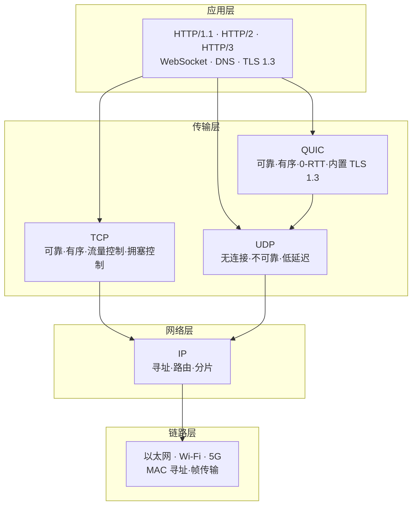
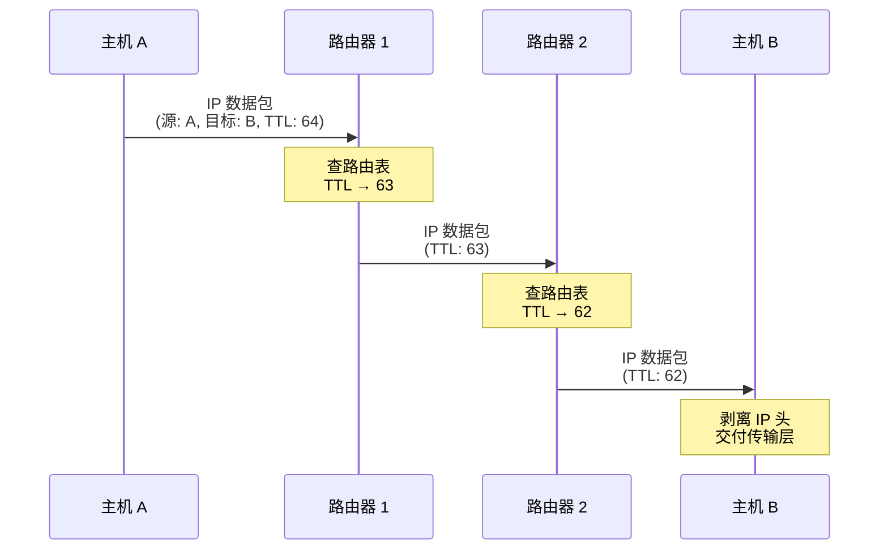
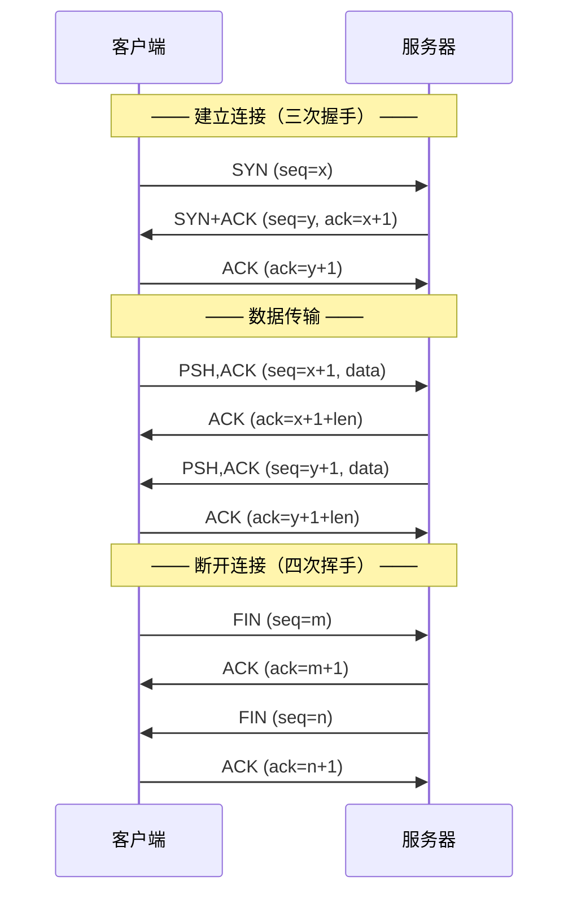
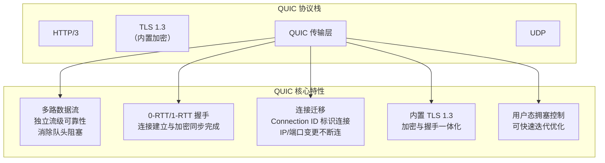
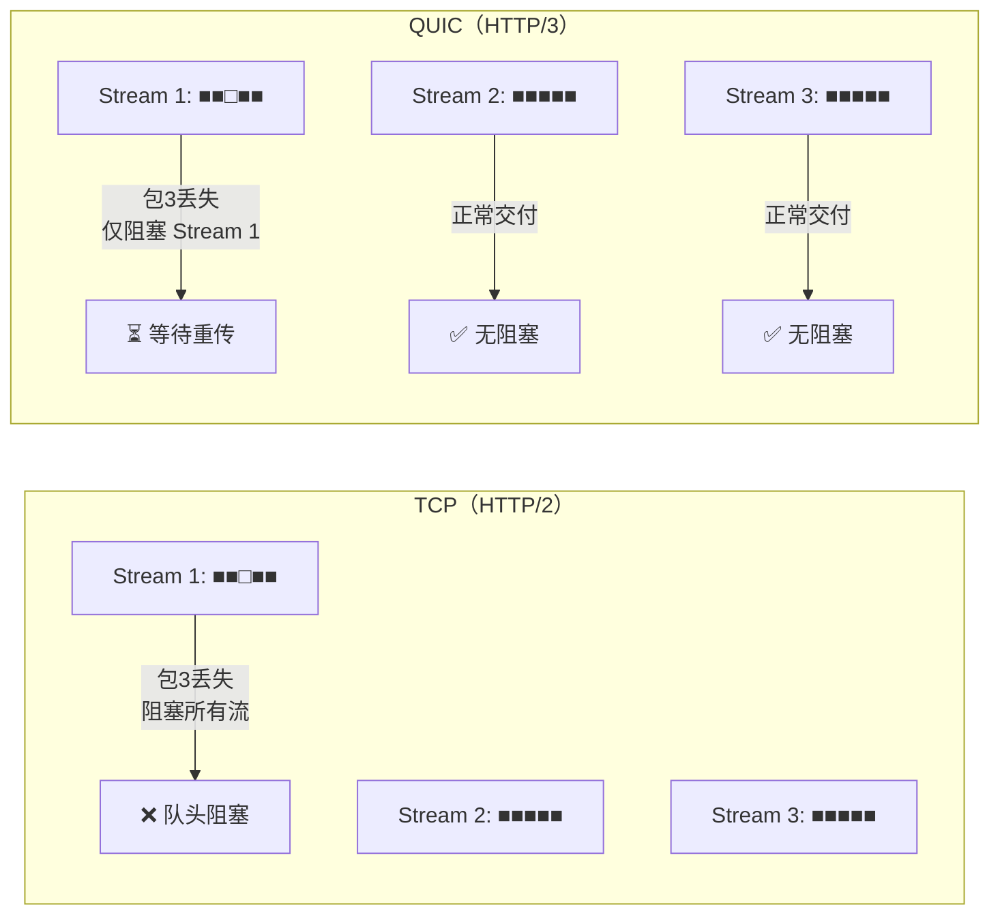
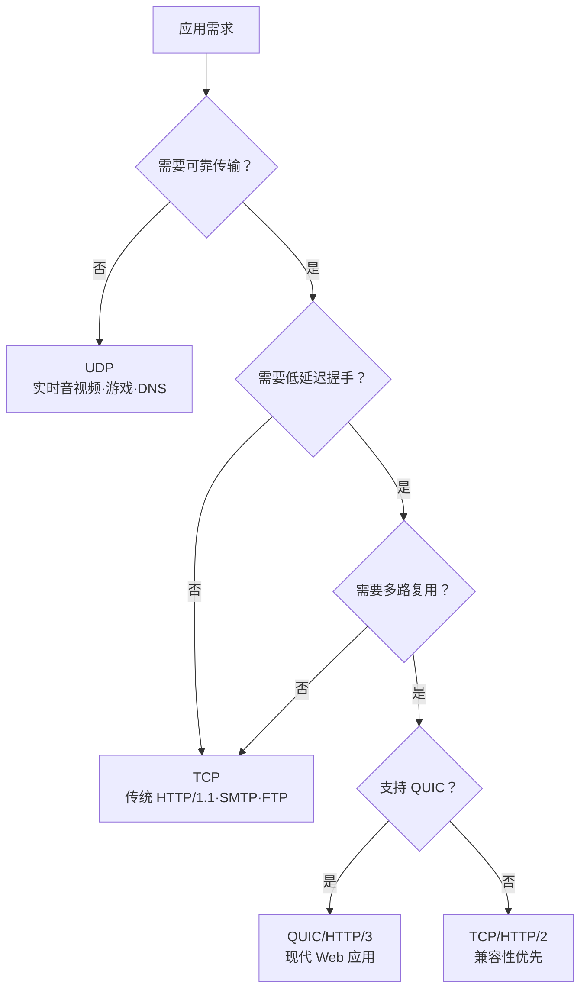

# 传输层协议：TCP/UDP与QUIC的设计哲学

## 概述

Web 页面性能的核心指标之一是**首次绘制时间（First Paint, FP）**，即从发起页面请求到浏览器首次渲染像素的时间。FP 直接受网络加载速度影响，而网络加载速度取决于传输层协议的效率与可靠性。

本文将从数据包传输的视角，系统性地分析 IP、UDP、TCP 三层协议的工作机制，并延伸至 QUIC 协议——HTTP/3 的传输层基础，阐述其如何解决 TCP 的固有缺陷。

---

## 1 互联网数据传输模型

### 1.1 分层架构

互联网协议栈采用分层设计，每层负责不同的抽象层级：



> **关键认知**：HTTP/3 的 QUIC 协议在 UDP 之上实现了 TCP 的可靠性语义，而非在 IP 之上定义新协议。这一设计选择源于 TCP 协议僵化问题（详见第 4 节）。

### 1.2 数据包封装

数据在协议栈中逐层封装，每层添加自身的头部信息：

```
┌─────────────────────────────────────────────┐
│                    帧头                      │  ← 链路层
├─────────────────────────────────────────────┤
│                   IP 头                      │  ← 网络层
│  (源IP · 目标IP · TTL · 协议号 · 分片信息)    │
├─────────────────────────────────────────────┤
│               TCP/UDP/QUIC 头                │  ← 传输层
│  (源端口 · 目标端口 · 序列号 · 确认号 · 窗口)  │
├─────────────────────────────────────────────┤
│              应用数据（Payload）              │  ← 应用层
└─────────────────────────────────────────────┘
```

---

## 2 IP：数据包送达目的主机

### 2.1 网际协议

**网际协议（Internet Protocol, IP）** 负责将数据包从源主机路由至目标主机。IP 是无连接、不可靠的协议——它尽力投递（best-effort delivery），但不保证数据包到达、有序或无重复。

IP 头的关键字段：

| 字段 | 长度 | 功能 |
|------|------|------|
| 版本（Version） | 4 bit | IPv4 (4) 或 IPv6 (6) |
| 源地址（Source IP） | 32/128 bit | 发送方 IP 地址 |
| 目标地址（Destination IP） | 32/128 bit | 接收方 IP 地址 |
| 生存时间（TTL） | 8 bit | 每经路由器减 1，归零则丢弃（防环路） |
| 协议号（Protocol） | 8 bit | 上层协议标识：TCP=6, UDP=17 |

### 2.2 数据包路由过程



IP 仅解决"数据包如何送达目标主机"的问题，但目标主机上运行着多个网络应用，IP 无法区分数据包应交付哪个应用——这由传输层协议解决。

---

## 3 UDP：数据包送达应用程序

### 3.1 用户数据报协议

**用户数据报协议（User Datagram Protocol, UDP）** 在 IP 之上增加端口号机制，实现进程级的数据交付。UDP 头仅 8 字节，是传输层最轻量的协议：

```
 0      7 8     15 16    23 24    31
┌────────┬────────┬────────┬────────┐
│  源端口  │ 目标端口 │  长度   │ 校验和  │
└────────┴────────┴────────┴────────┘
```

| 特性 | 说明 |
|------|------|
| **无连接** | 发送前无需建立连接，直接发送数据报 |
| **不可靠** | 不保证到达、不保证有序、不重传丢失数据包 |
| **低延迟** | 无握手开销，无拥塞控制，发送速率不受限 |
| **轻量** | 头部仅 8 字节（TCP 头部 20—60 字节） |

### 3.2 UDP 的适用场景

UDP 适用于对实时性要求高、可容忍少量丢包的场景：

- **实时音视频**：WebRTC、VoIP（丢包可容忍，延迟不可容忍）
- **在线游戏**：状态同步（旧状态可丢弃，只关心最新状态）
- **DNS 查询**：简单请求-响应模式（超时重传即可）
- **QUIC 底层**：HTTP/3 在 UDP 之上自建可靠性机制

### 3.3 UDP 的局限性

对于浏览器请求、邮件等要求数据完整性的场景，UDP 存在两个根本性缺陷：

1. **无重传机制**：数据包丢失后无法恢复，导致文件不完整
2. **无排序机制**：大文件拆分的数据包经不同路由到达，无法重组为正确顺序

---

## 4 TCP：可靠的数据传输

### 4.1 传输控制协议

**传输控制协议（Transmission Control Protocol, TCP）** 是面向连接的、可靠的、基于字节流的传输层协议。TCP 通过以下机制解决 UDP 的可靠性缺陷：

| 机制 | 功能 |
|------|------|
| **三次握手** | 建立连接，协商初始序列号和窗口大小 |
| **确认重传（ARQ）** | 接收方确认每个数据包，超时未确认则重传 |
| **序列号排序** | 按序列号重组乱序数据包 |
| **流量控制** | 滑动窗口机制，防止发送方淹没接收方 |
| **拥塞控制** | 慢启动、拥塞避免、快速重传、快速恢复 |

### 4.2 TCP 连接生命周期



**三次握手**消耗 1.5 个 RTT（Round-Trip Time），若叠加 TLS 1.2 握手（1—2 RTT），HTTPS 连接建立需 3—4 个 RTT。在跨洲际链路中（RTT ≈ 200ms），握手阶段即消耗 600—800ms。

### 4.3 TCP 的固有缺陷

尽管 TCP 提供了可靠的传输保障，但其设计于 1970 年代的机制在现代 Web 场景中暴露了三个核心问题：

#### 4.3.1 队头阻塞（Head-of-Line Blocking）

TCP 保证数据按序交付。若序列号为 N 的数据包丢失，即使 N+1、N+2 已到达接收端，TCP 也必须等待 N 重传成功后才能向上层交付——后续数据被阻塞。

在 HTTP/2 多路复用场景下，此问题尤为严重：多个 HTTP 流共享一条 TCP 连接，一个流的丢包将阻塞所有流。

#### 4.3.2 慢启动（Slow Start）

TCP 连接建立后，拥塞窗口（cwnd）从初始值（通常 10 个 MSS）开始指数增长，直至达到阈值或发生丢包。Web 页面的关键资源（HTML、CSS、JS）通常较小（数十 KB），在慢启动阶段即需传输，无法充分利用带宽。

#### 4.3.3 协议僵化（Protocol Ossification）

TCP 协议由操作系统内核实现，应用程序无法修改其行为。中间网络设备（路由器、防火墙、NAT）对 TCP 数据包的识别和干预基于固定模式，任何对 TCP 头部或行为的修改都可能导致数据包被丢弃。

这意味着：
- **无法在 TCP 层面修复缺陷**：如队头阻塞、握手延迟
- **新功能部署困难**：如 TCP Fast Open、Multipath TCP 的普及率极低
- **创新被迫绕过 TCP**：QUIC 选择 UDP 正是因此

---

## 5 QUIC：下一代传输协议

### 5.1 设计动机

HTTP/2 虽解决了应用层队头阻塞，但 TCP 层的队头阻塞依然存在。由于 TCP 协议僵化，无法在 TCP 层面修复此问题。QUIC（Quick UDP Internet Connections）选择在 UDP 之上重新实现可靠传输，绕过协议僵化困境。

### 5.2 QUIC 核心特性



#### 5.2.1 流级多路复用

QUIC 实现了**流级**的独立可靠性：每个 QUIC 流（Stream）独立进行序列号管理和重传，一个流的丢包不影响其他流的数据交付。



#### 5.2.2 快速握手

QUIC 将传输层握手与 TLS 握手合并，首次连接仅需 **1-RTT**，恢复连接可实现 **0-RTT**：

| 场景 | TCP + TLS 1.3 | QUIC + TLS 1.3 |
|------|---------------|----------------|
| 首次连接 | 1.5 RTT (TCP) + 1 RTT (TLS) = **2.5 RTT** | **1 RTT**（合并握手） |
| 恢复连接 | 1.5 RTT (TCP) + 0 RTT (TLS) = **1.5 RTT** | **0 RTT**（0-RTT 恢复） |

#### 5.2.3 连接迁移

TCP 连接由四元组（源 IP、源端口、目标 IP、目标端口）标识。网络切换（如 Wi-Fi → 4G）导致 IP 变更，TCP 连接必须断开重建。

QUIC 使用 **Connection ID（CID）** 标识连接，CID 由通信双方各自生成，与 IP/端口无关。网络切换后，客户端只需在新的路径上发送携带相同 CID 的数据包，连接即可无缝迁移。

#### 5.2.4 用户态实现

QUIC 在用户态实现拥塞控制算法，无需修改操作系统内核。这使得：
- 新算法可快速部署（如 BBRv2、Cubic 变体）
- 不同服务可使用不同拥塞控制策略
- 绕过内核 TCP 栈的更新滞后问题

### 5.3 QUIC 的标准化与部署

| 里程碑 | 时间 | 事件 |
|--------|------|------|
| RFC 9000 | 2021.05 | IETF 发布 QUIC 核心规范 |
| RFC 9114 | 2022.06 | HTTP/3 标准正式发布 |
| Chrome 稳定支持 | 2022 | 默认启用 HTTP/3 Alt-Svc 协商 |
| Cloudflare 全面支持 | 2022 | 边缘网络默认提供 HTTP/3 |
| 主流 CDN 支持 | 2023—2024 | Akamai、Fastly、AWS CloudFront 相继支持 |
| 移动端普及 | 2024—2025 | Android Chrome、iOS Safari 支持 HTTP/3 |

截至 2025 年，HTTP/3 的全球使用率已超过 30%（据 Cloudflare 雷达数据），且持续增长。

### 5.4 QUIC 面临的挑战

| 挑战 | 根因 | 现状 |
|------|------|------|
| **UDP 优化不足** | 操作系统对 UDP 的内核优化远不及 TCP | Linux 5.x 已大幅改善 UDP 性能 |
| **中间设备干扰** | 部分防火墙/运营商限制或 QoS 降级 UDP 流量 | QUIC 伪装与回退机制缓解 |
| **0-RTT 重放攻击** | 0-RTT 数据可能被重放 | 应用层需实现幂等性保护 |
| **调试困难** | 加密 + 用户态实现使抓包分析更复杂 | qlog 标准化改善可观测性 |

---

## 6 协议选择策略

不同应用场景应选择不同的传输层协议：



---

## 7 总结

| 协议 | 可靠性 | 连接建立 | 队头阻塞 | 加密 | 连接迁移 |
|------|--------|----------|----------|------|----------|
| **IP** | 不可靠 | 无连接 | N/A | 无 | N/A |
| **UDP** | 不可靠 | 无连接 | 无 | 无 | N/A |
| **TCP** | 可靠 | 1.5 RTT | 严重 | 无（需 TLS） | 不支持 |
| **QUIC** | 可靠 | 0—1 RTT | 流级消除 | 内置 TLS 1.3 | 支持 |

传输层协议的演进逻辑清晰：IP 解决寻址，UDP 解决端口复用，TCP 解决可靠性，QUIC 在可靠性的基础上解决延迟、队头阻塞和协议僵化问题。理解这一演进路径，是掌握 HTTP/1.1 → HTTP/2 → HTTP/3 协议栈升级的必要前提。

---

## 参考文献

1. RFC 791: Internet Protocol
2. RFC 768: User Datagram Protocol
3. RFC 793: Transmission Control Protocol
4. RFC 9000: QUIC: A UDP-Based Multiplexed and Secure Transport
5. RFC 9114: HTTP/3
6. Cloudflare Radar: [HTTP/3 Adoption Statistics](https://radar.cloudflare.com/)
