# HTTP请求流程：缓存策略与连接优化

## 概述

HTTP 请求从浏览器发起到获得响应，经历构建请求、缓存查询、DNS 解析、连接建立、数据传输等多个阶段。其中，**缓存机制**是决定"第二次访问为何更快"的核心因素——通过在客户端与中间节点存储资源副本，缓存消除了重复的网络往返，将资源获取延迟从数百毫秒降至接近零。

截至 2026 年，HTTP 缓存体系已从单纯的 HTTP 层强缓存/协商缓存，演化为涵盖 Service Worker Cache、103 Early Hints、资源提示（Preconnect/Prefetch/Preload）、HTTP/3 协商（Alt-Svc）的**多层次、多协议协同优化架构**。与此同时，隐私保护需求催生了 Storage Partitioning，对传统缓存模型产生了根本性影响。

本文将从 HTTP 请求的完整生命周期出发，系统阐述缓存策略、连接优化与隐私约束的交互机制。

---

## 1 HTTP 请求完整生命周期

### 1.1 请求阶段总览

浏览器发起一次 HTTP 请求，经历以下阶段：

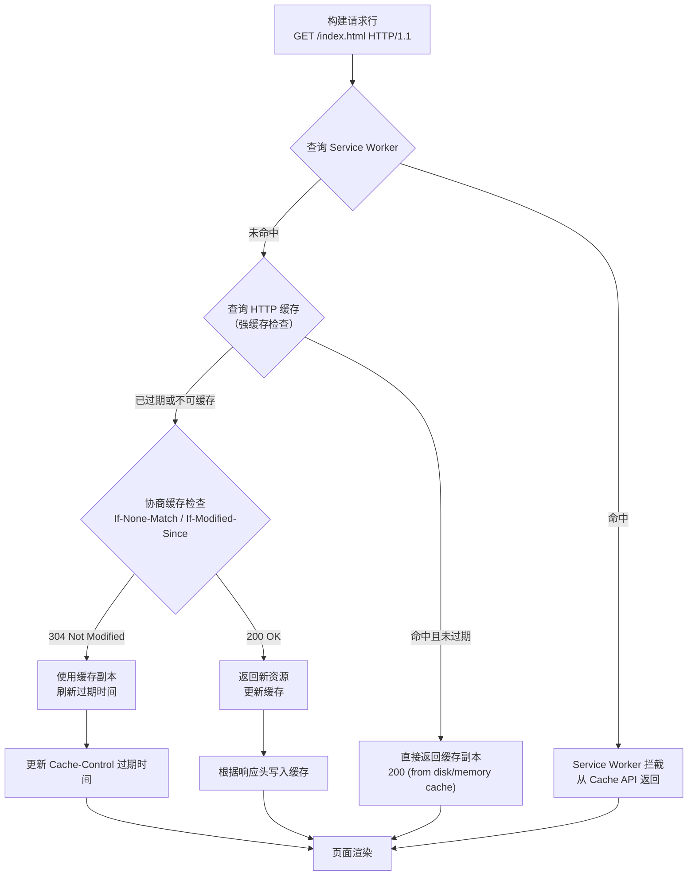

### 1.2 各阶段职责

| 阶段 | 核心操作 | 典型耗时 | 优化手段 |
|------|---------|---------|---------|
| 构建请求 | 解析 URL，生成请求行与请求头 | < 1 ms | — |
| 缓存查询 | Service Worker → HTTP Cache 逐层检查 | 1-5 ms | 合理配置 Cache-Control |
| DNS 解析 | 域名 → IP 地址 | 20-120 ms | DNS 预解析、DNS 缓存 |
| 连接建立 | TCP 握手 / TLS 握手 / QUIC 握手 | 1-3 RTT | 连接复用、TLS 1.3 0-RTT、HTTP/3 |
| 请求发送 | 传输 HTTP 请求报文 | 0.5-1 RTT | 请求合并、Early Hints |
| 响应接收 | 传输 HTTP 响应报文 | 取决于资源大小 | 压缩、分块传输、流式加载 |

> **关键认知**：第二次访问之所以更快，本质上是缓存命中消除了 DNS 解析、连接建立和数据传输这三个耗时阶段，同时 Service Worker 可在主线程之外提供更细粒度的缓存控制。

---

## 2 HTTP 缓存机制详解

### 2.1 缓存分层模型

浏览器缓存并非单一机制，而是一个多层决策系统：

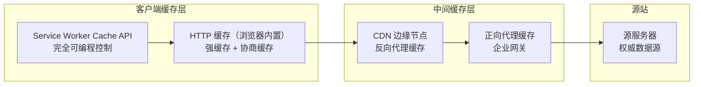

每一层均有独立的缓存策略与失效机制。本文聚焦客户端侧的两个核心缓存层：Service Worker Cache 与 HTTP 缓存。

### 2.2 强缓存（Strong Cache）

强缓存是指在缓存未过期时，浏览器**直接使用本地副本**，不向服务器发送任何请求。判断强缓存命中的依据是响应头中的缓存指令。

#### 2.2.1 Cache-Control 指令体系

`Cache-Control` 是 HTTP/1.1 引入的缓存控制头（RFC 9111），其指令体系如下：

| 指令 | 作用域 | 含义 |
|------|--------|------|
| `max-age=<seconds>` | 响应 | 资源在 N 秒内被视为新鲜，无需重新验证 |
| `s-maxage=<seconds>` | 响应 | 仅对共享缓存（CDN/代理）生效的 max-age，覆盖 max-age |
| `no-cache` | 请求/响应 | **并非"不缓存"**——允许缓存存储，但每次使用前必须向源服务器验证 |
| `no-store` | 请求/响应 | 禁止任何缓存存储该响应，适用于敏感数据（银行余额、验证码） |
| `public` | 响应 | 允许中间缓存存储（默认行为） |
| `private` | 响应 | 仅允许浏览器私有缓存存储，中间缓存不得保存 |
| `must-revalidate` | 响应 | 一旦过期，必须向源服务器验证，禁止使用过期副本 |
| `proxy-revalidate` | 响应 | 仅对共享缓存生效的 must-revalidate |
| `immutable` | 响应 | 资源在新鲜期内不会被更新，即使用户主动刷新也不发验证请求 |
| `stale-while-revalidate=<seconds>` | 响应 | 允许在过期后 N 秒内先返回过期副本，同时后台异步重新验证 |
| `stale-if-error=<seconds>` | 响应 | 当源服务器不可达时，允许在过期后 N 秒内继续使用过期副本 |

#### 2.2.2 immutable 指令：消除不必要的验证

`immutable` 指令解决了一个长期存在的性能问题：用户按 F5 刷新页面时，浏览器会对所有缓存资源发起条件验证请求——即使资源的 `max-age` 尚未过期。对于内容不会变化的资源（如带哈希指纹的 JS/CSS 文件），这些验证请求完全是浪费。

```http
Cache-Control: max-age=31536000, immutable
```

上述配置表示：该资源一年内不会变化，即使用户刷新页面也不发起验证请求。Chrome 和 Firefox 均已支持此指令。典型的应用场景是构建工具（Webpack、Vite、Rollup）生成的带内容哈希的文件名：

```
/app.3a7b2c1d.js    ← 文件名包含哈希，内容变化时文件名随之变化
/styles.e5f8a9b0.css
```

#### 2.2.3 stale-while-revalidate：无感更新

`stale-while-revalidate` 实现了"先返回旧数据，后台异步更新"的模式，消除了协商缓存导致的延迟：

```http
Cache-Control: max-age=600, stale-while-revalidate=3600
```

这意味着：
- 资源在 600 秒内完全新鲜，直接使用缓存
- 600-4200 秒之间，浏览器先返回过期副本，同时在后台发起异步验证请求
- 超过 4200 秒，必须等待验证完成才能返回数据

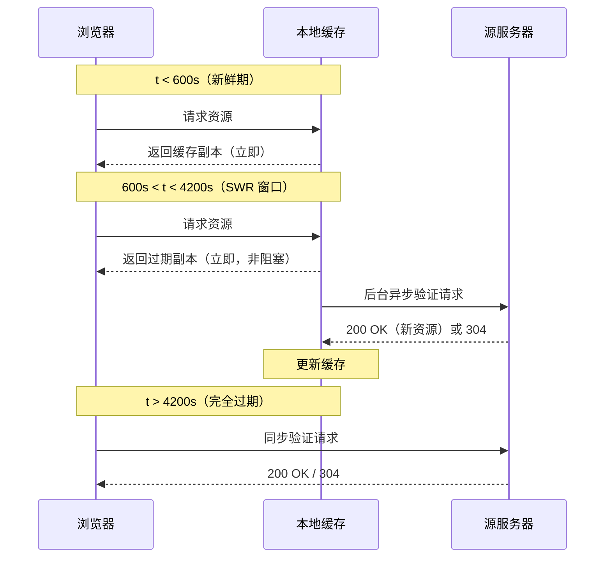

此指令在 Chrome、Firefox、Edge 中均已支持，适用于需要快速响应但能容忍短暂数据陈旧的场景（如新闻列表、社交动态）。

#### 2.2.4 Expires 与 Cache-Control 的优先级

`Expires` 是 HTTP/1.0 的遗留头部，通过绝对时间戳指定过期时刻：

```http
Expires: Thu, 01 Dec 2026 16:00:00 GMT
```

当 `Cache-Control: max-age` 与 `Expires` 同时存在时，**`Cache-Control` 优先**。现代 Web 应用应统一使用 `Cache-Control`，仅在对 HTTP/1.0 兼容性有严格要求时保留 `Expires`。

### 2.3 协商缓存（Conditional Cache）

当强缓存未命中（缓存过期或设置了 `no-cache`），浏览器向源服务器发起**条件验证请求**，由服务器决定是返回新资源还是告知客户端继续使用缓存。

#### 2.3.1 验证机制：ETag 与 Last-Modified

协商缓存依赖两组验证头部：

| 验证方式 | 请求头 | 响应头 | 比较粒度 | 精确度 |
|---------|--------|--------|---------|--------|
| 实体标签 | `If-None-Match` | `ETag` | 内容哈希/版本标识 | 高（字节级） |
| 修改时间 | `If-Modified-Since` | `Last-Modified` | 秒级时间戳 | 低（1 秒内变化无法区分） |

**ETag** 是资源的唯一标识符，通常由文件内容的哈希值生成。当两者同时存在时，**ETag 优先级高于 Last-Modified**——服务器先验证 `If-None-Match`，仅当 ETag 匹配时才检查 `If-Modified-Since`。

#### 2.3.2 强 ETag 与弱 ETag

```
ETag: "33a64df551425fcc55e4d42a148795d9f25f89d4"    ← 强 ETag
ETag: W/"0815"                                        ← 弱 ETag
```

- **强 ETag**：资源每一个字节都相同才视为匹配。用于需要精确字节一致性验证的场景（如增量更新、Range 请求）。
- **弱 ETag**（`W/` 前缀）：语义等价即可，允许资源在格式化（空白字符、注释）上存在差异。适用于页面级缓存验证。

#### 2.3.3 协商缓存交互流程

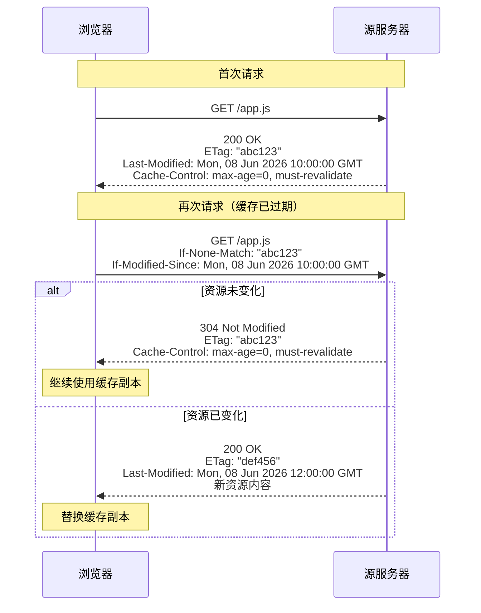

304 响应仅包含头部，无响应体，因此即使需要网络往返，其开销也远小于完整资源传输。

### 2.4 启发式缓存

当响应头中既无 `Cache-Control` 也无 `Expires` 时，浏览器会执行**启发式缓存**（Heuristic Caching），根据 `Last-Modified` 推算一个缓存有效期：

```
启发式缓存寿命 = (当前时间 - Last-Modified 时间) × 10%
```

例如，一个资源的 `Last-Modified` 是 100 天前，则浏览器可能为其分配约 10 天的缓存有效期。此行为在 RFC 9111 中有定义但未强制具体算法，各浏览器实现不同。**生产环境应避免依赖启发式缓存**——始终显式设置 `Cache-Control`。

---

## 3 Service Worker Cache 与 HTTP Cache 的关系

### 3.1 架构层级

Service Worker 运行在独立于主线程的 Worker 线程中，作为浏览器与网络之间的可编程代理。其缓存策略优先于 HTTP 缓存：

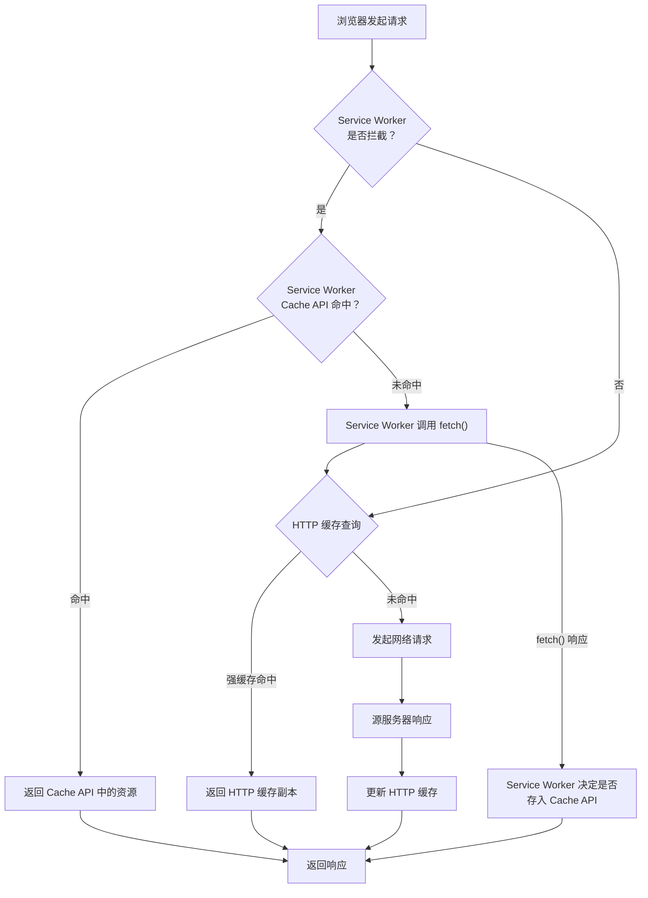

### 3.2 两层缓存的关键差异

| 特性 | HTTP Cache | Service Worker Cache |
|------|-----------|---------------------|
| 控制粒度 | 由响应头声明式控制 | 由 JavaScript 代码命令式控制 |
| 缓存策略 | 固定（强缓存/协商缓存） | 完全自定义（Cache First / Network First / Stale While Revalidate 等） |
| 过期机制 | 基于 Cache-Control 自动管理 | 需手动实现过期逻辑 |
| 请求拦截 | 不拦截，仅存储和返回 | 拦截所有 fetch 请求 |
| 离线能力 | 无（过期即失败） | 有（可完全离线工作） |
| 存储容量 | 浏览器自动管理 | 受 Storage API 配额限制 |
| 作用域 | 同源所有页面 | 仅注册范围内的页面 |

### 3.3 Service Worker 缓存策略模式

Workbox 库封装了五种核心缓存策略：

```javascript
// 1. Cache First：优先缓存，缓存未命中才请求网络
// 适用于不常变化的资源（字体、图片）
registerRoute(
  ({ request }) => request.destination === 'font',
  new CacheFirst({ cacheName: 'fonts', plugins: [expirationPlugin] })
);

// 2. Network First：优先网络，网络失败才回退缓存
// 适用于频繁更新的资源（API 响应、HTML）
registerRoute(
  ({ url }) => url.pathname.startsWith('/api/'),
  new NetworkFirst({ cacheName: 'api', networkTimeoutSeconds: 3 })
);

// 3. Stale While Revalidate：返回缓存同时后台更新
// 适用于可容忍短暂陈旧的数据
registerRoute(
  ({ request }) => request.destination === 'image',
  new StaleWhileRevalidate({ cacheName: 'images' })
);

// 4. Cache Only：仅使用缓存
// 适用于预缓存的 App Shell
registerRoute(
  ({ url }) => url.pathname === '/app-shell',
  new CacheOnly({ cacheName: 'app-shell' })
);

// 5. Network Only：仅使用网络
// 适用于非 GET 请求或必须实时获取的数据
registerRoute(
  ({ request }) => request.method !== 'GET',
  new NetworkOnly()
);
```

### 3.4 fetch() 与 HTTP Cache 的交互

Service Worker 中调用 `fetch()` 时，默认仍会经过 HTTP 缓存。若需绕过 HTTP 缓存强制请求网络，须显式设置：

```javascript
// 绕过 HTTP 缓存，强制请求网络
const response = await fetch(request, { cache: 'no-cache' });

// 或使用 cache: 'reload' 强制刷新
const response = await fetch(request, { cache: 'reload' });
```

`cache` 选项的可选值：`default`（遵循 HTTP 缓存规则）、`no-store`（完全跳过缓存）、`reload`（强制请求网络并刷新缓存）、`no-cache`（使用缓存前先验证）、`force-cache`（优先使用缓存即使过期）、`only-if-cached`（仅使用缓存不请求网络）。

---

## 4 资源提示与 Early Hints

### 4.1 资源提示（Resource Hints）

资源提示通过 `<link>` 标签或 `Link` 响应头，指示浏览器提前执行某些耗时的准备工作：

| 提示类型 | 语法 | 作用 | 触发时机 |
|---------|------|------|---------|
| `dns-prefetch` | `<link rel="dns-prefetch" href="//cdn.example.com">` | 提前执行 DNS 解析 | 最早，仅需域名 |
| `preconnect` | `<link rel="preconnect" href="https://cdn.example.com">` | 完成 DNS + TCP + TLS 握手 | 建立完整连接 |
| `prefetch` | `<link rel="prefetch" href="/next-page.js">` | 低优先级预取资源，缓存到 HTTP Cache | 空闲时下载 |
| `preload` | `<link rel="preload" href="/critical.js" as="script">` | 高优先级预加载当前页面必需资源 | 立即下载 |
| `modulepreload` | `<link rel="modulepreload" href="/app.mjs">` | 预加载 ES Module 及其依赖图 | 立即下载并解析依赖 |
| `fetchpriority` | `<link rel="preload" href="/hero.jpg" fetchpriority="high">` | 修饰 preload/prefetch 的优先级 | 调整调度优先级 |

#### 4.1.1 preconnect 与 dns-prefetch 的选择

```
preconnect = DNS 解析 + TCP 连接 + TLS 握手
dns-prefetch = 仅 DNS 解析
```

对于**确定会使用**的第三方域，使用 `preconnect`（如 CDN 域、API 域）；对于**可能使用**的域，使用 `dns-prefetch`——因为 `preconnect` 会建立完整连接，占用 socket 资源，过度使用反而会损害性能。

Chrome 对 `preconnect` 的上限约为 6 个连接，超出部分会被降级为 `dns-prefetch`。

#### 4.1.2 preload 与 prefetch 的区别

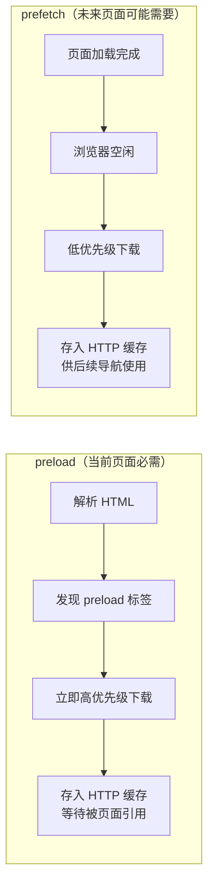

关键差异：
- **优先级**：`preload` 为最高优先级（`Highest`），`prefetch` 为最低优先级（`Lowest`）
- **生命周期**：`preload` 的资源若 3 秒内未被页面使用，Chrome 会在控制台发出警告
- **缓存行为**：两者均存入 HTTP 缓存，但 `prefetch` 的缓存可被浏览器在内存压力下清除
- **`as` 属性**：`preload` 必须指定 `as` 属性（如 `script`/`style`/`font`/`image`），用于确定请求优先级、CORS 策略和 Content-Type 校验

### 4.2 103 Early Hints

#### 4.2.1 机制原理

RFC 8297 定义的 **103 Early Hints** 允许服务器在最终响应就绪之前，先向客户端发送一组提示信息。浏览器收到 103 响应后，可立即开始预连接和资源预加载，无需等待服务器完成动态内容生成。

```mermaid
sequenceDiagram
    participant B as 浏览器
    participant S as 源服务器

    B->>S: GET /index.html

    Note over S: 服务器开始处理请求<br/>（数据库查询、模板渲染等）

    S-->>B: 103 Early Hints<br/>Link: </css/critical.css>; rel=preload; as=style<br/>Link: <https://cdn.example.com>; rel=preconnect

    Note over B: 收到 103 后立即开始<br/>1. 预连接 cdn.example.com<br/>2. 预加载 critical.css

    Note over S: 服务器完成处理

    S-->>B: 200 OK<br/>Content-Type: text/html<br/>（HTML 内容）
```

#### 4.2.2 典型部署场景

103 Early Hints 最适用于服务器处理时间较长（100ms-2s）的场景：

- **SSR（服务端渲染）**：服务器在查询数据库和渲染 HTML 期间，先发送 103 让浏览器预加载关键 CSS/JS
- **CDN 边缘节点**：CDN 可在回源等待期间发出 103，利用边缘到客户端的带宽提前推送资源提示
- **动态 API 网关**：API 网关在等待上游服务响应时，先发送 103 提示客户端预连接下游服务

截至 2026 年，Chrome、Firefox、Edge 均已支持 103 Early Hints 对 `preload` 和 `preconnect` 的处理。

#### 4.2.3 103 与 HTTP/2 Server Push 的区别

| 特性 | HTTP/2 Server Push | 103 Early Hints |
|------|-------------------|-----------------|
| 推送内容 | 资源本身（响应体） | 仅提示信息（Link 头） |
| 缓存风险 | 高（可能推送已缓存资源） | 无（浏览器自行判断是否需要） |
| 实现复杂度 | 高（需管理推送状态） | 低（仅发送额外头部） |
| 浏览器支持 | Chrome 已移除支持 | 全面支持 |
| 协议要求 | 仅 HTTP/2 | HTTP/1.1、HTTP/2、HTTP/3 均可 |

Chrome 于 2022 年正式移除 HTTP/2 Server Push 支持，103 Early Hints 成为其事实上的替代方案。

---

## 5 连接层优化

### 5.1 连接复用与并发限制

#### 5.1.1 HTTP/1.1 持久连接

HTTP/1.1 默认启用持久连接（`Connection: keep-alive`），允许在同一 TCP 连接上串行发送多个请求。但 HTTP/1.1 存在**队头阻塞（Head-of-Line Blocking）**问题——前一个请求未完成时，后续请求必须等待。

Chrome 对 HTTP/1.1 的并发连接限制为**每域名 6 个 TCP 连接**（RFC 7230 建议值为 2，浏览器实际放宽至 6-8）。

#### 5.1.2 HTTP/2 多路复用

HTTP/2 在单个 TCP 连接上实现多路复用，通过二进制帧（Frame）和流（Stream）标识符消除应用层队头阻塞：

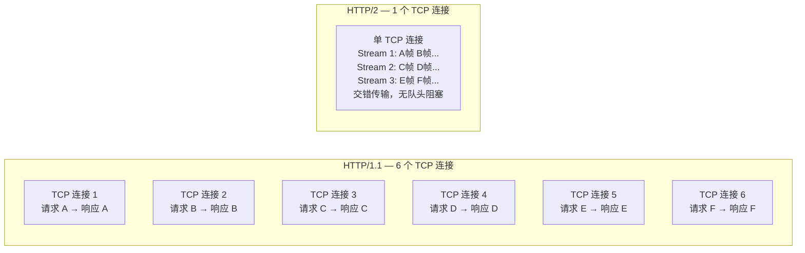

HTTP/2 的关键特性：
- **流优先级**：客户端可为每个流设置权重和依赖关系，指导服务器调度资源分配
- **服务器推送**：服务器可主动推送资源（但已逐渐被 103 Early Hints 取代）
- **头部压缩**：HPACK 算法压缩 HTTP 头部，减少冗余传输

> **注意**：HTTP/2 仍存在 TCP 层的队头阻塞——单个 TCP 连接上的丢包会阻塞所有流。

### 5.2 Alt-Svc 与 HTTP/3 协商

#### 5.2.1 HTTP/3 与 QUIC

HTTP/3 基于 QUIC 协议（运行于 UDP 之上），解决了 TCP 层的队头阻塞问题：

| 特性 | HTTP/2 over TCP | HTTP/3 over QUIC |
|------|----------------|------------------|
| 传输层 | TCP | QUIC (UDP) |
| 队头阻塞 | TCP 层丢包阻塞所有流 | 单流丢包仅影响该流 |
| 连接建立 | TCP 1-RTT + TLS 1.3 1-RTT = 2-RTT | QUIC 内置 TLS 1.3 = 1-RTT（0-RTT 恢复） |
| 连接迁移 | 不支持（四元组标识） | 支持（Connection ID 标识） |
| 拥塞控制 | 内核态 TCP | 用户态 QUIC，可快速迭代 |

#### 5.2.2 Alt-Svc 协商机制

`Alt-Svc`（Alternative Services，RFC 7838）允许服务器告知客户端：相同资源可通过替代协议/主机/端口获取。这是 HTTP/3 部署的核心协商机制：

```http
HTTP/1.1 200 OK
Alt-Svc: h3=":443"; ma=86400; persist=1
```

各字段含义：
- `h3=":443"`：替代协议为 HTTP/3，端口 443
- `ma=86400`：此替代服务信息缓存 86400 秒（24 小时）
- `persist=1`：即使网络变化也不丢弃此替代服务信息

协商流程：

```mermaid
sequenceDiagram
    participant B as 浏览器
    participant S as 服务器（HTTP/2）

    Note over B,S: 首次连接
    B->>S: GET / （HTTP/2 over TCP）
    S-->>B: 200 OK<br/>Alt-Svc: h3=":443"; ma=86400

    Note over B: 缓存 Alt-Svc 信息<br/>下次尝试 HTTP/3

    Note over B,S: 后续连接
    B->>S: GET / （HTTP/3 over QUIC）
    Note over B,S: 若 HTTP/3 连接成功，后续请求均使用 HTTP/3
```

浏览器收到 `Alt-Svc` 后，会在**后台**尝试建立 QUIC 连接。若 QUIC 连接成功，后续请求自动升级为 HTTP/3；若失败，继续使用 HTTP/2。这一"竞速"机制确保了协议升级的无感切换。

Chrome 自版本 87 起默认支持 `Alt-Svc` 协商至 HTTP/3；Firefox 和 Edge 也已支持。

### 5.3 TLS 1.3 与 0-RTT 恢复

TLS 1.3 将握手从 2-RTT 缩短至 1-RTT，并支持 **0-RTT（Early Data）** 恢复：

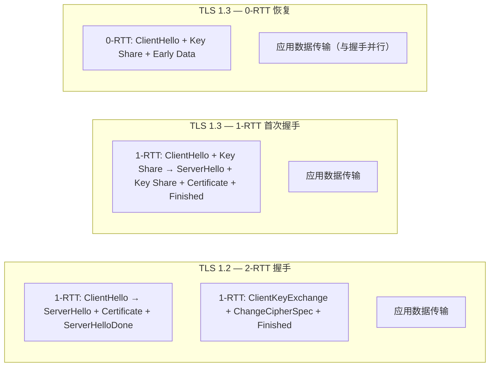

0-RTT 的工作原理：客户端缓存之前的 PSK（Pre-Shared Key）会话票据，在后续连接中随 ClientHello 一起发送加密的早期数据。服务器验证票据有效后，立即处理早期数据。

> **安全注意**：0-RTT 数据不具备**前向安全性（Forward Secrecy）**，且易受**重放攻击**。服务器应仅对幂等操作（GET 请求）接受 0-RTT 数据，对有副作用的操作（POST/PUT）应拒绝。

---

## 6 Privacy Sandbox 对缓存的影响

### 6.1 问题背景：跨站追踪与缓存

传统浏览器缓存是**全局共享**的：同一个资源 URL 在不同站点中被引用时，浏览器仅存储一份副本，所有站点共享。这一设计带来了隐私风险——第三方可以通过检测资源是否在缓存中来推断用户的浏览历史，这种技术称为**缓存探测（Cache Probing）**。

### 6.2 Storage Partitioning（存储分区）

Chrome 自 2023 年（Chrome 115）起全面实施 **Storage Partitioning**，将所有浏览器存储（包括 HTTP 缓存、Service Worker Cache、IndexedDB、localStorage、Cookie 等）按**顶级站点 + 来源站点**的组合进行分区，Cookie 侧配套的 CHIPS（Cookies Having Independent Partitioned State）机制见下节：

```
传统模型（全局共享）:
  缓存键 = 资源 URL

分区模型（Storage Partitioning）:
  缓存键 = (顶级站点 eTLD+1, 来源站点 eTLD+1, 资源 URL)
```

具体影响：

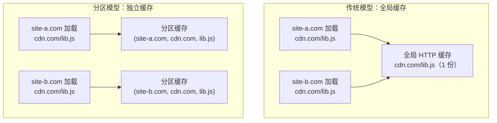

| 维度 | 传统模型 | Storage Partitioning |
|------|---------|---------------------|
| 缓存命中率 | 高（跨站共享） | 降低（每站独立存储） |
| 隐私保护 | 弱（可跨站追踪） | 强（分区隔离） |
| 存储开销 | 低（1 份副本） | 增加（N 个站点 × N 份副本） |
| CDN 效率 | 高（边缘命中率高） | 降低 |

### 6.3 CHIPS 与分区 Cookie

`Set-Cookie` 新增 `Partitioned` 属性，与 Storage Partitioning 协同工作：

```http
Set-Cookie: __cf_bm=abc123; Secure; Path=/; SameSite=None; Partitioned
```

分区 Cookie 的存储键为 `(顶级站点, Cookie 来源站点, Cookie 名称)`，仅在对应的顶级站点上下文中可见。这解决了第三方 Cookie 被全面禁用后，合法的嵌入式服务（如第三方评论、支付、地图）无法维持会话状态的问题。

### 6.4 对 Web 开发的影响

1. **CDN 缓存命中率下降**：同一资源在不同站点需独立下载，首次访问延迟增加
2. **Service Worker 作用域变化**：第三方 iframe 中的 Service Worker 按分区隔离
3. **性能指标影响**：LCP（Largest Contentful Paint）等指标在跨站资源场景下可能劣化
4. **缓解策略**：使用 `SameSite=Strict` 或 `SameSite=Lax` 的第一方 Cookie 不受影响；对第三方场景，采用 `Partitioned` 属性替代传统第三方 Cookie

---

## 7 Cookie 安全演进

### 7.1 SameSite 属性演进时间线

Cookie 的 `SameSite` 属性经历了从可选到强制的演进过程：

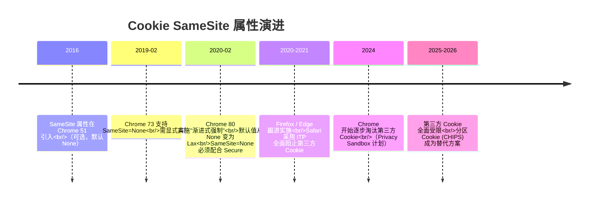

### 7.2 SameSite 三种模式

| 值 | 行为 | 典型场景 |
|----|------|---------|
| `Strict` | 仅在同站请求中发送。用户从外部站点点击链接进入时不发送 Cookie | 银行、支付等高安全场景 |
| `Lax` | 同站请求 + 顶级导航的 GET 请求中发送。POST 表单、iframe、Ajax 等跨站请求不发送 | **默认值**（2020 年后），适用于大多数场景 |
| `None` | 所有请求均发送，**必须同时设置 `Secure`**（仅 HTTPS） | 第三方登录、嵌入式支付等跨站场景 |

### 7.3 SameSite=Lax 的具体行为

2020 年 Chrome 将默认值从 `None` 改为 `Lax` 后，以下跨站场景的 Cookie 将**不被发送**：

- `<iframe src="https://other-site.com">` 中的请求
- `fetch()` / `XMLHttpRequest` 跨站请求
- `<form method="POST" action="https://other-site.com">` 提交
- 使用 `<link rel="prefetch">` 预取的跨站资源

以下场景仍**会发送** Lax Cookie：

- 用户点击 `<a href="https://other-site.com">` 顶级导航链接
- `<form method="GET" action="https://other-site.com">` 提交

### 7.4 第三方 Cookie 的终结与替代

Chrome 计划逐步淘汰第三方 Cookie（截至 2026 年持续推进中），替代方案包括：

1. **CHIPS（Partitioned Cookie）**：分区 Cookie，仅在特定顶级站点上下文中可见
2. **Storage Access API**：允许跨站 iframe 请求用户授权访问其第一方 Cookie
3. **FedCM（Federated Credential Management）**：联邦身份管理，替代跨站 SSO 登录
4. **Topics API / Attribution Reporting**：替代广告追踪场景下的第三方 Cookie

---

## 8 完整请求流程综合分析

### 8.1 首次访问与二次访问对比

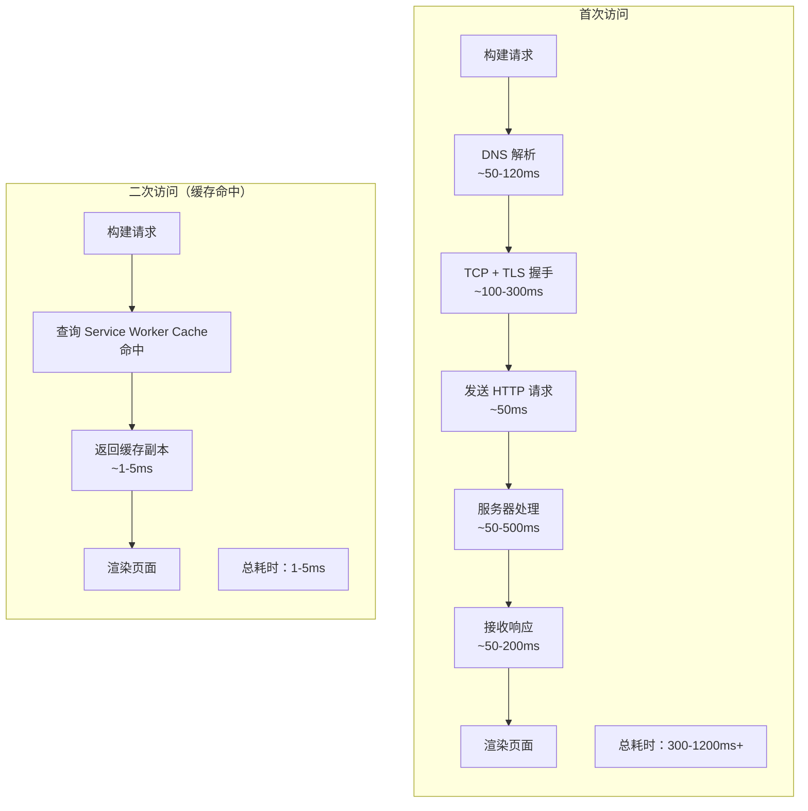

二次访问加速的具体来源：

| 加速来源 | 首次耗时 | 二次耗时 | 节省 |
|---------|---------|---------|------|
| DNS 解析 | 20-120 ms | 0 ms（DNS 缓存） | 100% |
| TCP 连接 | 1-RTT | 0 ms（连接复用 / 已有持久连接） | 100% |
| TLS 握手 | 1-2 RTT | 0 ms（会话复用 / 0-RTT） | 100% |
| 资源传输 | 50-500 ms | 0 ms（HTTP 缓存命中） | 100% |
| 服务器处理 | 50-500 ms | 0 ms（304 响应 / 缓存命中） | ~95% |

### 8.2 多层缓存协同决策流程

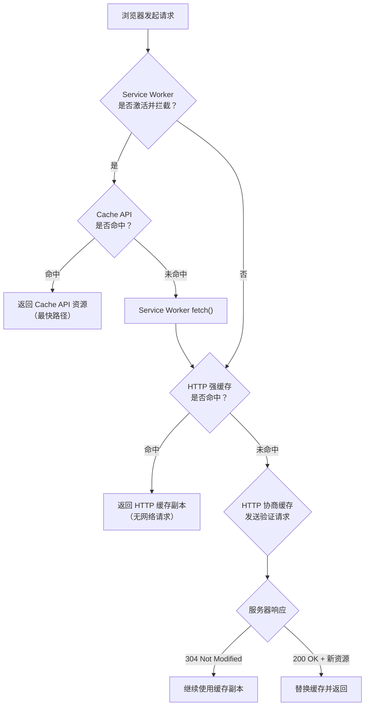

---

## 9 缓存策略最佳实践

### 9.1 不同资源类型的缓存配置

| 资源类型 | 特征 | 推荐 Cache-Control | 示例 |
|---------|------|-------------------|------|
| 带哈希的 JS/CSS | 文件名含内容哈希，内容变则文件名变 | `max-age=31536000, immutable` | `app.3a7b2c1d.js` |
| 不带哈希的 JS/CSS | 文件名固定，内容可能更新 | `no-cache` | `analytics.js` |
| HTML 文档 | 页面入口，需保持最新 | `no-cache` 或 `max-age=0, must-revalidate` | `index.html` |
| API 响应 | 数据可能实时变化 | `no-cache` 或 `max-age=0, stale-while-revalidate=60` | `/api/user` |
| 字体文件 | 极少变化 | `max-age=31536000, immutable` | `font.woff2` |
| 图片资源 | 视更新频率而定 | `max-age=86400, stale-while-revalidate=604800` | `/images/hero.webp` |
| 用户隐私数据 | 不得缓存 | `no-store` | `/api/balance` |

### 9.2 缓存与版本更新策略

对于 SPA 应用，典型的缓存更新策略为：

1. HTML 入口文件设置 `no-cache`，确保每次访问都验证最新版本
2. JS/CSS 文件使用内容哈希命名 + `immutable`，通过 HTML 中的引用路径变化触发更新
3. Service Worker 使用 `skipWaiting()` + `clients.claim()` 确保新版本立即生效

```
用户访问 → 请求 index.html (no-cache) → 获取最新 HTML
→ HTML 引用 app.v2.js → 浏览器发现新 URL → 请求并缓存
→ 旧 app.v1.js 在缓存中自然过期淘汰
```

### 9.3 缓存调试

Chrome DevTools 中缓存相关的关键检查点：

- **Network 面板**：`Size` 列显示 `from disk cache` / `from memory cache` / `from service worker` / 实际大小
- **Application 面板** → **Cache Storage**：查看 Service Worker Cache API 中的缓存条目
- **Application 面板** → **Storage**：查看 HTTP 缓存的占用空间
- **Lighthouse**：检测缓存策略是否合理，识别"可缓存但未缓存"的资源

---

## 10 总结

HTTP 请求的性能优化是一个**多层次、多协议**的协同工程：

1. **缓存层**：HTTP 强缓存提供零延迟的本地响应，协商缓存以最小开销验证新鲜度，Service Worker Cache 提供完全可编程的离线缓存能力
2. **预加载层**：`preconnect` 消除连接建立延迟，`preload` 提前获取关键资源，103 Early Hints 在服务器处理期间启动预加载
3. **协议层**：HTTP/2 多路复用消除应用层队头阻塞，HTTP/3 + QUIC 消除传输层队头阻塞，TLS 1.3 0-RTT 实现连接恢复零延迟
4. **隐私约束层**：Storage Partitioning 从根本上改变了第三方缓存的存储模型，Cookie 的 SameSite 默认值变更和第三方 Cookie 淘汰重塑了会话管理方式

第二次访问速度快的根本原因，是缓存命中消除了 DNS 解析、连接建立、TLS 握手和资源传输四个耗时阶段。在 2026 年的技术栈中，这一加速效应被 Service Worker Cache、103 Early Hints、HTTP/3 等新机制进一步放大——但同时也受到 Privacy Sandbox 存储分区的约束，需要在性能与隐私之间寻求平衡。
