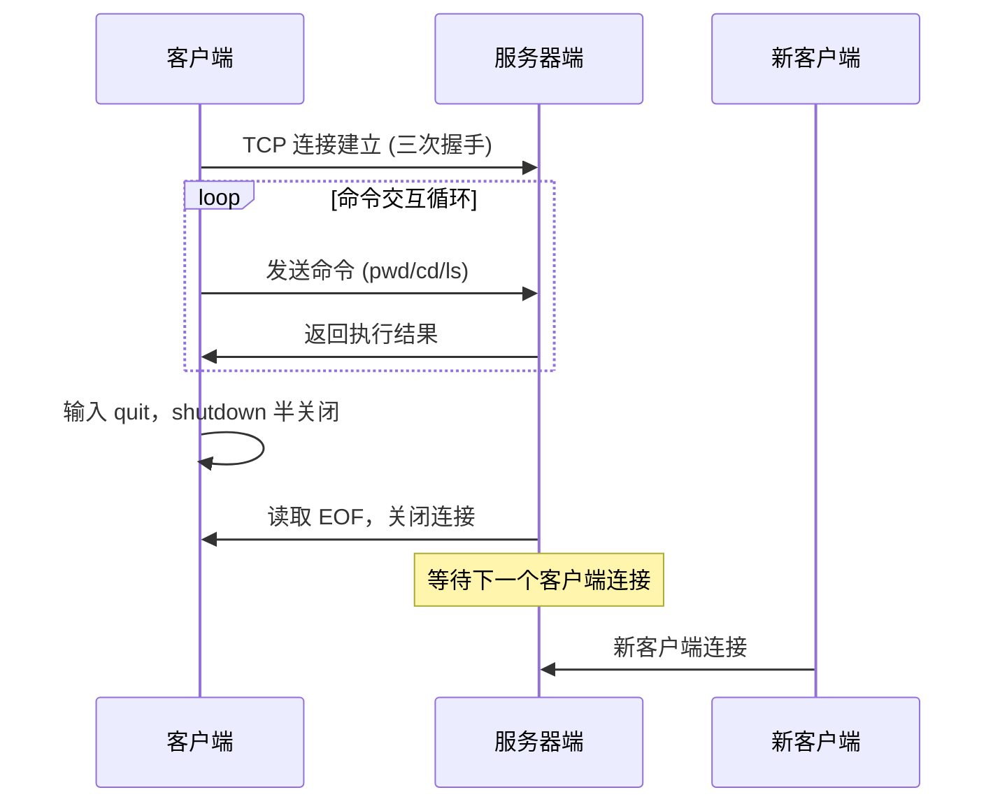
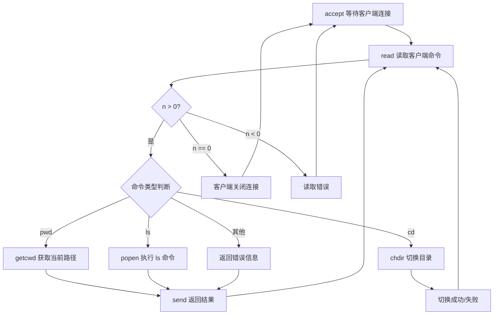

# 网络编程实战：期中大作业与解答剖析

在完成基础篇和提升篇的学习后，安排了期中实践项目，旨在将理论知识转化为实际编程能力。网络编程的核心特征在于理论与实践的高度耦合：仅理解协议规范和 API 语义不足以应对实际工程需求，必须通过编写和调试代码，才能对 TCP、UDP、套接字（Socket）等核心概念形成深入认知。本文整合大作业的题目要求与完整解答剖析，作为阶段性实战检验。

## 一、实践目标与题目

本项目要求实现一个基于 TCP 的客户端-服务器（Client-Server）交互程序，重点考察以下能力：

- **客户端**：使用 `select` 实现 I/O 多路复用（I/O Multiplexing），同时处理标准输入和套接字读写；使用 `shutdown` 实现半关闭（Half-Close）
- **服务器端**：套接字读写能力，以及对端连接关闭时的异常处理能力



**题干**：请分别编写一个客户端程序和服务器程序，客户端连接服务器后，通过命令行与服务器进行交互，支持的交互命令包括：

- **pwd**：显示服务器应用程序启动时的当前工作路径
- **cd**：改变服务器应用程序的当前工作路径
- **ls**：显示服务器应用程序当前路径下的文件列表
- **quit**：客户端进程退出，服务器端不退出，后续客户端可再次连接

**客户端程序要求**：可指定待连接的服务器端 IP 地址和端口；输入命令后按回车发送，等待服务器端返回执行结果并显示在屏幕上。

**服务器程序要求**：暂不考虑多客户端并发，每次仅服务一个客户端连接；将命令执行结果返回给已连接的客户端；服务器端不能因客户端退出而终止运行。

**关键技术要点**：

| 技术点 | 说明 |
|--------|------|
| `select` 多路复用 | 同时监听标准输入与套接字的可读事件 |
| `shutdown` 半关闭 | 客户端退出时关闭写端，保留读端 |
| `read` 返回 0 | 检测对端关闭连接的 EOF 条件 |
| `SIGPIPE` 信号 | 服务器端需忽略该信号，防止写入已关闭套接字时进程终止 |

## 二、客户端程序实现与解析

```c
#include "lib/common.h"
#define  MAXLINE     1024

int main(int argc, char **argv) {
    if (argc != 3) {
        error(1, 0, "usage: tcp_client <IPaddress> <port>");
    }
    int port = atoi(argv[2]);
    int socket_fd = tcp_client(argv[1], port);

    char recv_line[MAXLINE], send_line[MAXLINE];
    int n;

    fd_set readmask;
    fd_set allreads;
    FD_ZERO(&allreads);
    FD_SET(0, &allreads);
    FD_SET(socket_fd, &allreads);

    for (;;) {
        readmask = allreads;
        int rc = select(socket_fd + 1, &readmask, NULL, NULL, NULL);

        if (rc <= 0) {
            error(1, errno, "select failed");
        }

        if (FD_ISSET(socket_fd, &readmask)) {
            n = read(socket_fd, recv_line, MAXLINE);
            if (n < 0) {
                error(1, errno, "read error");
            } else if (n == 0) {
                printf("server closed \n");
                break;
            }
            recv_line[n] = 0;
            fputs(recv_line, stdout);
            fputs("\n", stdout);
        }

        if (FD_ISSET(STDIN_FILENO, &readmask)) {
            if (fgets(send_line, MAXLINE, stdin) != NULL) {
                int i = strlen(send_line);
                if (send_line[i - 1] == '\n') {
                    send_line[i - 1] = 0;
                }

                if (strncmp(send_line, "quit", strlen(send_line)) == 0) {
                    if (shutdown(socket_fd, 1)) {
                        error(1, errno, "shutdown failed");
                    }
                }

                size_t rt = write(socket_fd, send_line, strlen(send_line));
                if (rt < 0) {
                    error(1, errno, "write failed ");
                }
            }
        }
    }

    exit(0);
}
```

**客户端代码解析**：客户端核心设计是使用 `select` 同时处理标准输入和套接字两类 I/O 事件：

1. **标准输入事件**：当 `select` 检测到标准输入有可读事件时，通过 `fgets` 读取用户输入，再通过 `write` 发送至服务器。若输入为 `quit`，则调用 `shutdown(socket_fd, 1)` 关闭写端（半关闭），通知服务器客户端已完成发送。

2. **套接字事件**：当 `select` 检测到套接字有可读事件时，通过 `read` 接收服务器返回的数据，并输出至标准输出。若 `read` 返回 0（收到 EOF），表示服务器已关闭连接，客户端退出循环。

> **设计要点**：部分实现使用 `fgets` 循环阻塞等待用户输入，再通过套接字发送。这种方式无法及时响应来自服务端的返回数据，因此推荐使用 `select` 实现对两个文件描述符的同时监听。

## 三、服务器端程序实现与解析

```c
#include "lib/common.h"
static int count;

static void sig_int(int signo) {
    printf("\nreceived %d datagrams\n", count);
    exit(0);
}

char *run_cmd(char *cmd) {
    char *data = malloc(16384);
    bzero(data, sizeof(data));
    FILE *fdp;
    const int max_buffer = 256;
    char buffer[max_buffer];
    fdp = popen(cmd, "r");
    char *data_index = data;
    if (fdp) {
        while (!feof(fdp)) {
            if (fgets(buffer, max_buffer, fdp) != NULL) {
                int len = strlen(buffer);
                memcpy(data_index, buffer, len);
                data_index += len;
            }
        }
        pclose(fdp);
    }
    return data;
}

int main(int argc, char **argv) {
    int listenfd;
    listenfd = socket(AF_INET, SOCK_STREAM, 0);

    struct sockaddr_in server_addr;
    bzero(&server_addr, sizeof(server_addr));
    server_addr.sin_family = AF_INET;
    server_addr.sin_addr.s_addr = htonl(INADDR_ANY);
    server_addr.sin_port = htons(SERV_PORT);

    int on = 1;
    setsockopt(listenfd, SOL_SOCKET, SO_REUSEADDR, &on, sizeof(on));

    int rt1 = bind(listenfd, (struct sockaddr *) &server_addr, sizeof(server_addr));
    if (rt1 < 0) {
        error(1, errno, "bind failed ");
    }

    int rt2 = listen(listenfd, LISTENQ);
    if (rt2 < 0) {
        error(1, errno, "listen failed ");
    }

    signal(SIGPIPE, SIG_IGN);

    int connfd;
    struct sockaddr_in client_addr;
    socklen_t client_len = sizeof(client_addr);

    char buf[256];
    count = 0;

    while (1) {
        if ((connfd = accept(listenfd, (struct sockaddr *) &client_addr, &client_len)) < 0) {
            error(1, errno, "bind failed ");
        }

        while (1) {
            bzero(buf, sizeof(buf));
            int n = read(connfd, buf, sizeof(buf));
            if (n < 0) {
                error(1, errno, "error read message");
            } else if (n == 0) {
                printf("client closed \n");
                close(connfd);
                break;
            }
            count++;
            buf[n] = 0;
            if (strncmp(buf, "ls", n) == 0) {
                char *result = run_cmd("ls");
                if (send(connfd, result, strlen(result), 0) < 0)
                    return 1;
                free(result);
            } else if (strncmp(buf, "pwd", n) == 0) {
                char buf[256];
                char *result = getcwd(buf, 256);
                if (send(connfd, result, strlen(result), 0) < 0){
                    return 1;
                 }
            } else if (strncmp(buf, "cd ", 3) == 0) {
                char target[256];
                bzero(target, sizeof(target));
                memcpy(target, buf + 3, strlen(buf) - 3);
                if (chdir(target) == -1) {
                    printf("change dir failed, %s\n", target);
                }
            } else {
                char *error = "error: unknown input type";
                if (send(connfd, error, strlen(error), 0) < 0)
                    return 1;
            }
        }
    }
    exit(0);
}
```

**服务器端程序解析**：采用两层循环架构。



**外层循环（连接管理）**：通过 `accept` 阻塞等待客户端连接，每次获得一个已连接套接字后进入内层循环。当前实现为迭代式服务器（Iterative Server），每次仅服务一个客户端连接。

**内层循环（命令处理）**：通过 `read` 从套接字读取客户端命令，根据命令类型执行不同处理：

| 命令 | 实现方式 | 说明 |
|------|----------|------|
| `pwd` | `getcwd()` | C 标准库函数，获取当前工作目录 |
| `cd` | `chdir()` | C 标准库函数，切换工作目录 |
| `ls` | `popen("ls", "r")` | 通过管道执行 shell 命令，读取输出结果 |
| 未知命令 | `send()` 返回错误信息 | 向客户端反馈命令不识别 |

> **缓冲区管理**：每次读取前需调用 `bzero` 清空缓冲区，避免残留数据干扰。部分实现中遗漏了此步骤，可能导致数据解析错误。

> **`SIGPIPE` 处理**：服务器端必须通过 `signal(SIGPIPE, SIG_IGN)` 忽略 SIGPIPE 信号，否则当向已关闭的套接字写入数据时，默认行为将终止进程。

> **`ls` 命令的两种实现**：除 `popen` 方式外，也可使用 `scandir()` 系统调用获取文件列表并格式化输出，后者不依赖 shell 命令，更为规范和安全。

## 四、运行验证

客户端连接服务器后，命令交互的典型输出如下（服务器为 `/home/vagrant/shared/Code/network/yolanda/build/bin` 启动）：

```text
$ ./telnet-client 127.0.0.1 43211
pwd
/home/vagrant/shared/Code/network/yolanda/build/bin
cd ..
pwd
/home/vagrant/shared/Code/network/yolanda/build
ls
bin  chap-11  lib  CMakeLists.txt  mid-homework  ...
quit

// 再次连接服务器，服务器不退出
$ ./telnet-client 127.0.0.1 43211
pwd
/home/vagrant/shared/Code/network/yolanda/build
quit
```

可见服务器端在客户端 `quit` 后并未退出，而是继续等待下一个客户端连接，符合题目要求。

## 五、小结

本次期中大作业的核心考察点：

- **客户端**：`select` I/O 多路复用同时处理标准输入与套接字、`shutdown` 半关闭
- **服务器端**：套接字读写、对端连接关闭的异常处理、`SIGPIPE` 信号处理

当前服务器端程序为迭代式设计，仅支持单客户端顺序服务。如何构建支持高并发连接的服务器端程序，是后续性能篇的核心议题，将深入讨论基于 I/O 多路复用的事件驱动模型（Event-Driven Model），并设计高并发网络编程框架。参考代码已推送至 [GitHub 仓库](https://github.com/froghui/yolanda/tree/master/mid-homework)。

## 版本信息

| 项目 | 说明 |
|------|------|
| 更新日期 | 2026-06-09 |
| 目标内核 | Linux 7.0 |
| I/O 模型参考 | select, epoll, io_uring |
| 编译工具链 | GCC 14+, Clang 18+ |

---
