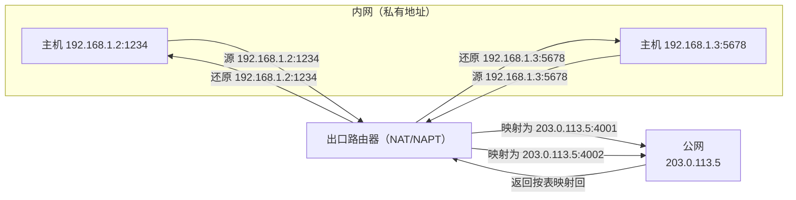

# 网络层与 IP 编址：IPv4、IPv6、子网与 NAT

网络层负责**端到端**的数据传输（Host-to-Host），核心是 IP 协议。本文整理 IPv4/IPv6 地址结构、子网划分与掩码、NAT 地址转换，以及 IP 数据报格式与分片，作为理解路由（另篇）的基础。

## 一、网络层的职责

网络层向上为传输层提供服务，向下屏蔽底层链路差异。核心功能：

- **寻址（Addressing）**：用 IP 地址标识主机。
- **路由（Routing）**：决定数据包从源到目的走哪条路径（见路由算法篇）。
- **转发（Forwarding）**：根据路由表将数据包转发到下一跳。

数据在传输层被分成段（Segment），网络层封装为**数据报（Datagram）**。

## 二、IPv4 地址

IPv4 用 32 位（4 字节）标识主机，点分十进制表示：`192.168.1.1`。

地址由**网络号 + 主机号**组成，通过网络掩码区分。

### 分类编址（Classful）

早期按首位划分 A-E 类：

| 类别 | 首字节 | 默认掩码 | 网络/主机 |
| --- | --- | --- | --- |
| A | 1-126 | /8 | 大网络，主机多 |
| B | 128-191 | /16 | 中网络 |
| C | 192-223 | /24 | 小网络，主机少 |
| D | 224-239 | - | 组播 |
| E | 240-255 | - | 保留 |

### 无类别域间路由（CIDR）

现代用 **CIDR（Classless Inter-Domain Routing）**，以 `/前缀长度` 表示网络位，如 `192.168.1.0/24` 表示前 24 位是网络号。

## 三、子网划分与掩码

**子网掩码（Subnet Mask）** 用于区分网络位与主机位。与 IP 地址按位"与"得到网络号。

例：`192.168.1.10/24`，掩码 `255.255.255.0`：
- 网络号 = `192.168.1.0`
- 主机号 = `.10`

**子网划分**：把一个大网段切成多个子网，提升地址利用与隔离。主机位再借若干位作子网号。

例：`192.168.1.0/24` 借 2 位主机位划 4 个子网：
- `192.168.1.0/26`、`.64/26`、`.128/26`、`.192/26`
- 每个子网可用主机数 = 2⁶ − 2 = 62（减去网络号与广播地址）。

**特殊地址**：
- 网络号（主机位全 0）：网络本身。
- 广播地址（主机位全 1）：向该网络所有主机广播。
- `127.0.0.1`：回环地址（localhost）。
- **私有地址**：`10.0.0.0/8`、`172.16.0.0/12`、`192.168.0.0/16`，仅局域网内使用。

## 四、IPv6

IPv4 地址已耗尽，IPv6 用 **128 位**，冒号十六进制表示：

```
2001:0db8:85a3:0000:0000:8a2e:0370:7334
```

- 地址容量巨大（约 3.4×10³⁸）。
- 取消广播，用组播与任播。
- **自动配置（SLAAC）**：无 DHCP 也可自动获取地址。
- 简化报头、内建安全与移动支持。
- 双栈/隧道技术实现 IPv4/IPv6 过渡。

## 五、IP 数据报格式

IPv4 报头关键字段：

- **版本（4bit）**：IPv4=4。
- **首部长度（4bit）**。
- **总长度（16bit）**：整个数据报字节数。
- **标识/标志/片偏移**：用于**分片与重组**。
- **TTL（Time To Live）**：最大跳数，防止无限循环（每经过一跳减 1，为 0 丢弃）。
- **协议**：指明上层协议（TCP=6，UDP=17，ICMP=1）。
- **首部校验和**。
- **源/目的 IP 地址**。

### 分片与重组

当数据报超过底层链路 MTU（最大传输单元，如以太网 1500 字节）时，路由器将其**分片**，到达目的后按标识与偏移**重组**。IPv6 由发送方分片，中间路由器不再分片。

## 六、NAT（网络地址转换）

**NAT** 让内网私有地址通过一个公网 IP 访问互联网。

- 内网主机用私有 IP；出口路由器做 **NAPT（网络地址端口转换）**，把私有 IP+端口映射为公网 IP+新端口，并维护转换表。
- 返回包按表反向映射回内网主机。

**优点**：缓解 IPv4 地址短缺、隐藏内网结构（一定程度的安全性）。
**缺点**：破坏端到端模型，对点对点通信（P2P、内网穿透）不友好。

NAT 地址转换示意（内网多主机共享一个公网 IP）：



## 小结

- 网络层用 IP 地址做端到端寻址与转发。
- IPv4 用 CIDR+子网掩码划分网络，IPv6 以 128 位解决地址枯竭。
- IP 数据报含 TTL、分片字段等关键信息。
- NAT 将私有地址映射为公网地址，缓解地址短缺但影响端到端连接。
