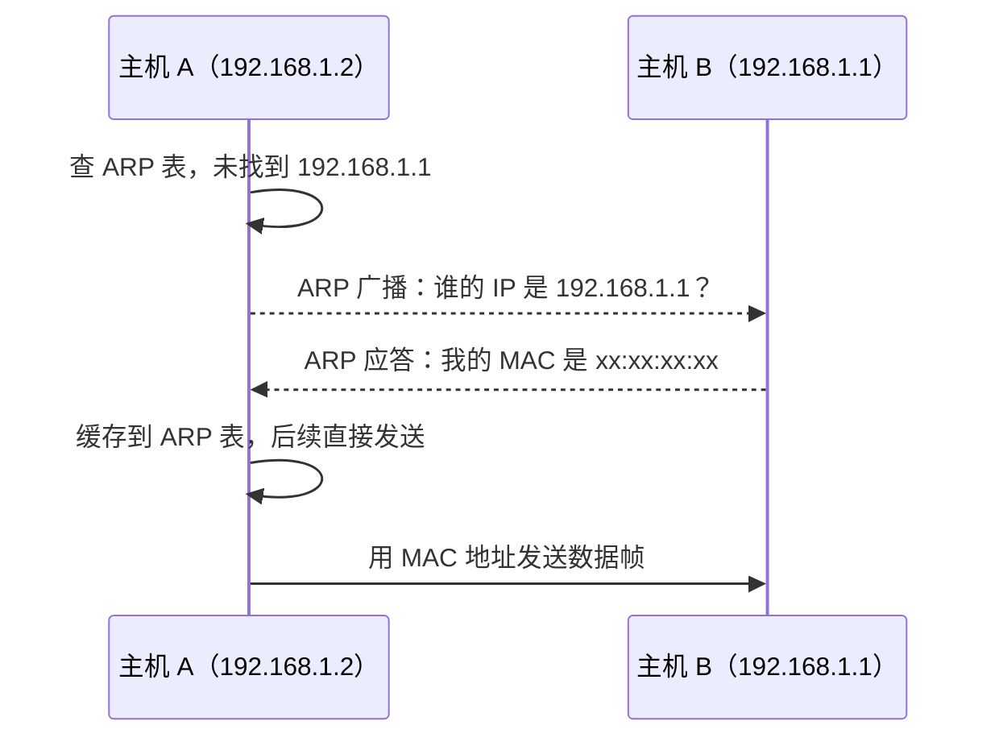

# 路由算法：静态、动态、距离向量与链路状态

路由器通过**路由算法**决定数据包从源到目的的最佳路径。本文整理静态与动态路由，重点讲解**距离向量（RIP）**与**链路状态（OSPF）**两类动态算法的原理，并介绍 BGP 与 ARP。

## 一、路由 vs 转发

- **路由（Routing）**：决定"走哪条路"，基于全网拓扑计算路径，结果写入路由表。
- **转发（Forwarding）**：数据包到达后，查路由表把包发往下一跳（局部操作）。

路由算法关注"如何算路"，转发关注"如何查表"。

## 二、静态路由与动态路由

- **静态路由**：管理员手动配置路由表，简单、可控、安全，但不适应网络变化，适合小型/稳定网络。
- **动态路由**：路由器间交换信息，自动计算并更新路由，适应拓扑变化，适合大型网络。

## 三、距离向量算法（Distance Vector）：RIP

**原理**：每个路由器维护一张表，记录到每个目的地的**距离（跳数）**与**下一跳**。周期性与邻居交换自己的距离向量，按 Bellman-Ford 思想更新：

```text
dist(u, v) = min{ dist(u, w) + dist(w, v) }   其中 w 取 u 的所有邻居 N(u)
```

**RIP（Routing Information Protocol）**：
- 以**跳数**为距离，最大 15 跳（16 表示不可达）。
- 周期性广播（每 30 秒）自己的距离向量。
- 实现简单，适合小网络。

**问题**：
- **收敛慢**：链路故障时"计数到无穷"（Count to Infinity），需靠最大跳数兜底。
- **环路**：可通过**水平分割（Split Horizon）**、**毒性逆转（Poison Reverse）**、**触发更新**缓解。

## 四、链路状态算法（Link State）：OSPF

**原理**：每个路由器**洪泛（Flood）**自己的链路状态（与哪些邻居相连、代价），全网每台路由器收集完整拓扑，再用**Dijkstra 最短路径算法**独立计算到所有目的地的最短路径树。

**OSPF（Open Shortest Path First）**：
- 代价通常与带宽相关（`cost = 10^8/带宽`）。
- 通过 LSA（链路状态通告）洪泛，用区域（Area）分层，减少洪泛范围。
- **收敛快**：每台路由器有全网视图，故障后快速重算。
- 支持等代价多路径（ECMP）负载均衡。

**对比**：
- 距离向量：只知邻居信息，全局收敛慢，适合小网（RIP）。
- 链路状态：知全网拓扑，收敛快，适合大型网络（OSPF）。

## 五、域间路由：BGP

自治系统（AS）之间的路由由 **BGP（Border Gateway Protocol）** 负责，是互联网的"胶水"。

- **路径向量（Path Vector）**：记录到目的地的完整 AS 路径，可避免环路并支持策略。
- 路由器间通过 TCP 建立 BGP 会话，交换可达性信息。
- 可配置策略（如选路偏好、禁止经过某 AS），不仅基于跳数/带宽，还基于商业与政治因素。

## 六、ARP 与地址解析

**ARP（Address Resolution Protocol）** 将 IP 地址解析为同一链路内的 MAC 地址（见数据链路层篇）：

1. 主机发 ARP 广播："谁的 IP 是 192.168.1.1？请告诉我 MAC。"
2. 目标主机应答自己的 MAC。
3. 发送方缓存 ARP 表，后续直接发送。



ARP 是网络层与数据链路层协作的关键。

## 七、路由表与最长前缀匹配

路由器转发时用**最长前缀匹配（Longest Prefix Match）**：在路由表中找与目的 IP 前缀匹配最长（最具体）的条目。查表常用 **trie（前缀树）** 加速。

## 小结

- 路由算法分静态/动态；动态主流是距离向量（RIP，跳数）与链路状态（OSPF，全网拓扑+Dijkstra）。
- BGP 用路径向量处理 AS 间路由，支持策略。
- ARP 解析 IP→MAC，是跨层协作关键；转发用最长前缀匹配查表。
