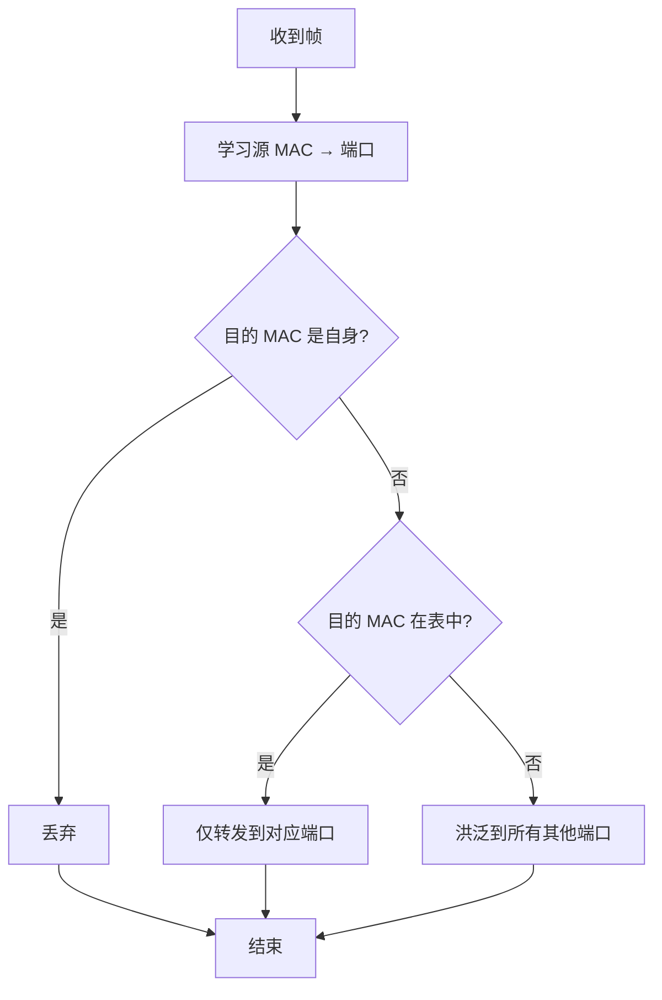

# 数据链路层与以太网：MAC、帧与交换

数据链路层负责**同一链路内**（相邻节点间）的可靠传输。本文整理链路层的功能、MAC 地址、以太网帧结构、CSMA/CD 介质访问控制，以及交换机的转发与 VLAN。

## 一、数据链路层的职责

链路层向上屏蔽物理传输差异，为网络层提供"点对点"传输服务。核心功能：

- **组帧（Framing）**：把网络层数据报封装成帧，加首尾与校验。
- **差错检测**：用校验和/CRC 检测传输错误，丢弃或重传。
- **介质访问控制（MAC）**：协调共享介质上多设备如何发送（如以太网、Wi-Fi）。
- **可靠传输（可选）**：部分链路协议提供确认与重传。

## 二、MAC 地址

**MAC 地址**是设备网卡的**物理地址**，48 位（6 字节），十六进制表示：

```
3C-97-0E-4A-8B-2F
```

- 前 3 字节为厂商组织唯一标识（OUI），后 3 字节由厂商分配。
- 同一链路内用 MAC 标识设备（局域网内寻址）。
- 与 IP 地址的关系：IP 跨网络寻址，MAC 在链路内寻址；路由器转发时每跳改写 MAC，IP 不变。

**帧结构（以太网）**：

| 前导码 | 目的 MAC | 源 MAC | 类型/长度 | 数据 | FCS(CRC) |
| --- | --- | --- | --- | --- | --- |

- **类型/长度**：指示上层协议（如 IP=0x0800）。
- **FCS**：帧校验序列（CRC），用于检错。

## 三、介质访问控制：CSMA/CD

早期以太网是**共享总线**介质，多设备共享同一条线路，需要介质访问控制避免冲突。

**CSMA/CD（载波监听多路访问/冲突检测）**：
1. **载波监听（CS）**：发送前先监听信道，空闲才发。
2. **多路访问（MA）**：多站点共享介质。
3. **冲突检测（CD）**：发送时监听是否冲突，冲突则停止并随机退避（二进制指数退避）后重发。

**冲突域**：发生冲突的范围。共享式以太网所有站点在同一冲突域，效率低。

现代以太网采用**交换式**（点对点全双工），交换机隔离冲突域，站点间不再共享介质，CSMA/CD 基本不再使用。

## 四、以太网交换机

**交换机（Switch）**工作在链路层，根据**目的 MAC 地址**转发帧：

- 维护 **MAC 地址表**（学习：记录源 MAC 与端口的映射）。
- 收到帧查表：
  - 已知目的端口：仅向该端口转发；
  - 未知：**洪泛（Flood）**到所有其他端口；
  - 目的地址是自身：丢弃。
- 隔离冲突域，全双工，提升性能。

交换机转发决策流程：



**交换 vs 路由**：交换机按 MAC 转发（链路层，局域网内），路由器按 IP 转发（网络层，跨网络）。

## 五、VLAN（虚拟局域网）

**VLAN** 在物理交换机上划分逻辑隔离的广播域：

- 不同 VLAN 的帧不能直接互通，需三层设备（路由器/三层交换机）转发。
- 隔离广播域、增强安全、简化管理。
- 帧上打 **802.1Q VLAN 标签**（4 字节），跨交换机传递 VLAN 信息。

## 六、链路层的其他协议

- **PPP（点对点协议）**：拨号、点对点链路的封装，含认证（PAP/CHAP）。
- **Wi-Fi（IEEE 802.11）**：无线链路层，用 **CSMA/CA（冲突避免）**（无线难以检测冲突，故用避免策略 + 确认机制）。
- **VLAN、隧道**：实现虚拟化与扩展。

## 小结

- 链路层负责组帧、检错与介质访问控制，用 MAC 地址做局域网内寻址。
- 以太网帧含目的/源 MAC、类型、数据与 CRC。
- 共享介质用 CSMA/CD 避免冲突；现代交换式以太网用 MAC 地址表转发并隔离冲突域。
- VLAN 划分逻辑隔离的广播域，需三层设备跨 VLAN 通信。
