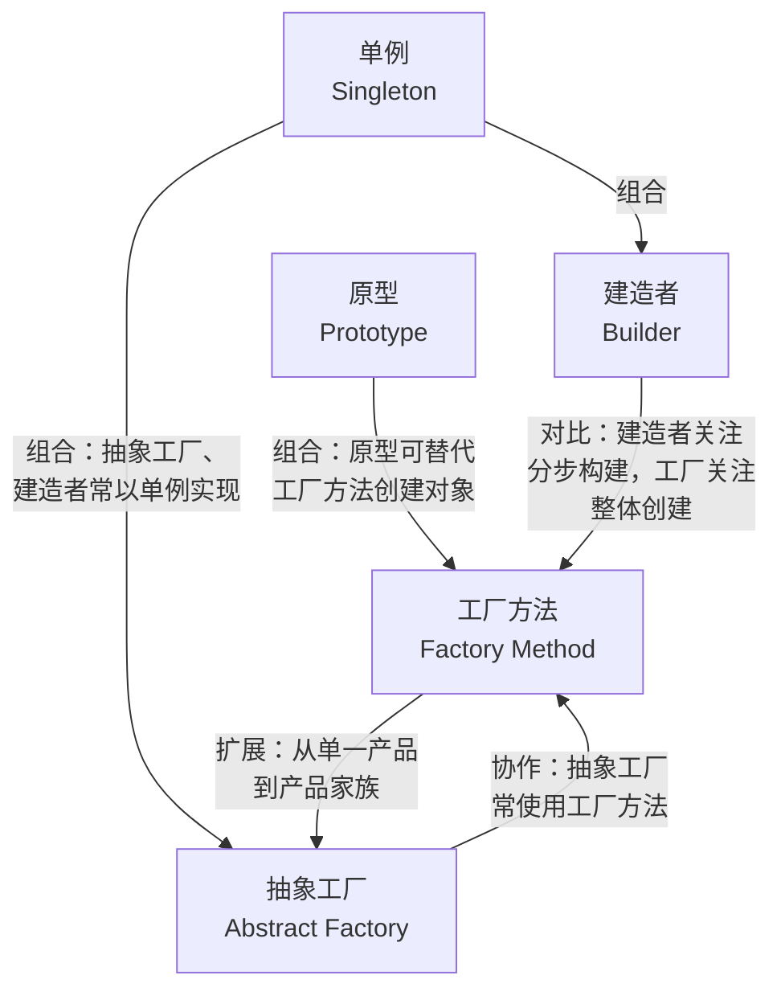
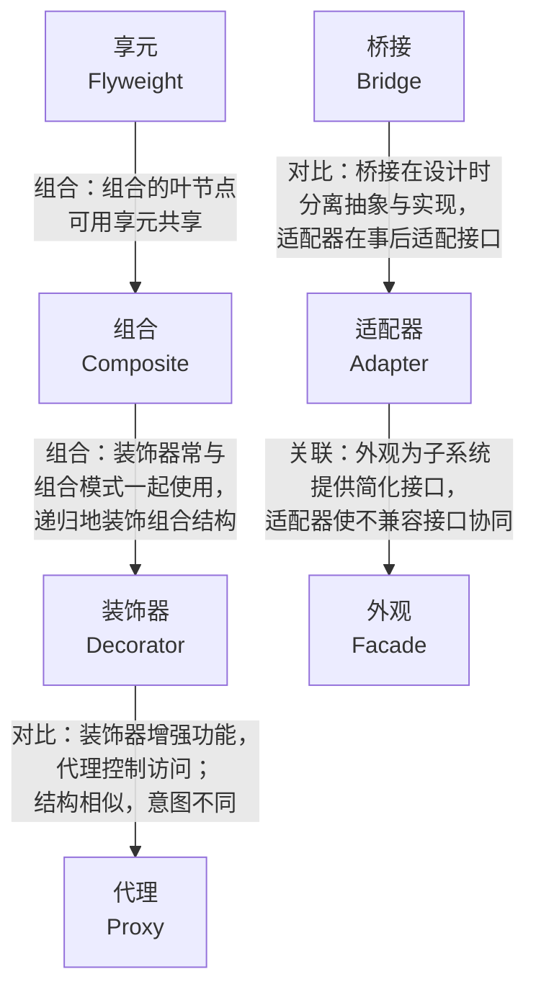
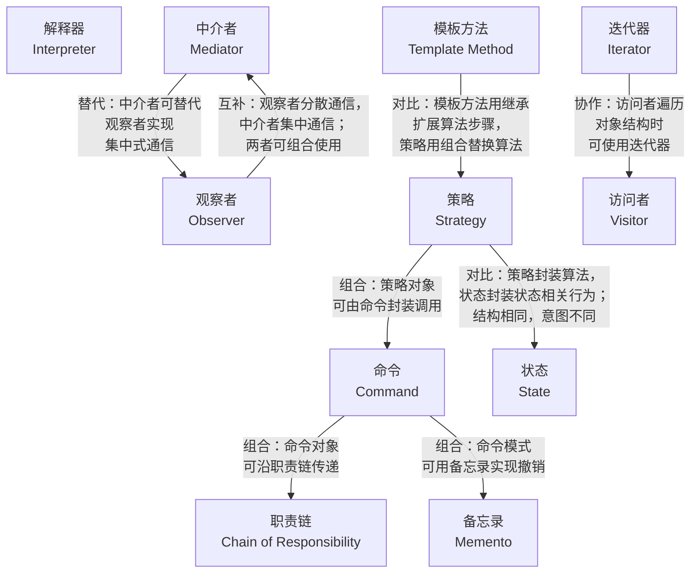
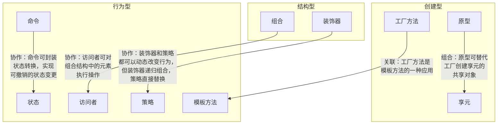

# GoF 23 模式分类总览

GoF 将 23 种设计模式按用途分为三大类：创建型（5 种）、结构型（7 种）、行为型（11 种）。

## 1. 创建型模式（Creational Patterns）—— 5 种

创建型模式抽象了对象的创建过程，将对象的创建与使用分离，使客户端不需要知道具体创建了哪个类的实例。

| 模式 | 一句话描述 |
|------|-----------|
| **单例（Singleton）** | 确保一个类只有一个实例，并提供全局访问点 |
| **工厂方法（Factory Method）** | 定义创建对象的接口，让子类决定实例化哪个类 |
| **抽象工厂（Abstract Factory）** | 创建一系列相关或相互依赖的对象家族，而无需指定具体类 |
| **建造者（Builder）** | 将复杂对象的构建与其表示分离，使同样的构建过程可以创建不同的表示 |
| **原型（Prototype）** | 用原型实例指定创建对象的种类，通过拷贝原型创建新对象 |

## 2. 结构型模式（Structural Patterns）—— 7 种

结构型模式关注类和对象的组合，用于处理类或对象的组成关系，形成更大的结构。

| 模式 | 一句话描述 |
|------|-----------|
| **适配器（Adapter）** | 将一个类的接口转换成客户端期望的另一个接口 |
| **桥接（Bridge）** | 将抽象部分与实现部分分离，使它们可以独立变化 |
| **组合（Composite）** | 将对象组合成树形结构以表示"部分-整体"的层次结构 |
| **装饰器（Decorator）** | 动态地给对象添加额外的职责 |
| **外观（Facade）** | 为子系统中的一组接口提供一个一致的界面 |
| **享元（Flyweight）** | 运用共享技术有效支持大量细粒度的对象 |
| **代理（Proxy）** | 为其他对象提供一种代理以控制对这个对象的访问 |

## 3. 行为型模式（Behavioral Patterns）—— 11 种

行为型模式关注对象之间的职责分配和通信方式，描述了类或对象怎样交互以及怎样分配职责。

| 模式 | 一句话描述 |
|------|-----------|
| **职责链（Chain of Responsibility）** | 使多个对象都有机会处理请求，避免请求的发送者和接收者耦合 |
| **命令（Command）** | 将请求封装成对象，以便使用不同的请求参数化其他对象 |
| **解释器（Interpreter）** | 给定一门语言，定义它的文法表示，并定义一个解释器 |
| **迭代器（Iterator）** | 提供一种方法顺序访问一个聚合对象中的各个元素 |
| **中介者（Mediator）** | 用一个中介对象来封装一系列的对象交互 |
| **备忘录（Memento）** | 在不破坏封装的前提下捕获并外部化一个对象的内部状态 |
| **观察者（Observer）** | 定义对象间一对多的依赖关系，当一个对象改变时通知所有依赖者 |
| **状态（State）** | 允许对象在内部状态改变时改变它的行为 |
| **策略（Strategy）** | 定义一系列算法，把它们一个个封装起来，并使它们可相互替换 |
| **模板方法（Template Method）** | 定义一个操作中的算法骨架，将一些步骤延迟到子类 |
| **访问者（Visitor）** | 表示一个作用于某对象结构中各元素的操作，使你可以在不改变各元素类的前提下定义新操作 |

## 4. 模式关系图

GoF 23 种模式之间并非孤立存在，它们有着丰富的关联关系。某些模式是其他模式的变体或扩展，某些模式常常组合使用，还有些模式看似相似实则解决不同问题。

### 4.1 创建型模式关系

### 4.2 结构型模式关系

### 4.3 行为型模式关系

### 4.4 跨类别关系

## 5. 分类小结

掌握这 23 种模式，重点在于理解三大类的分工：

- **创建型**解决"怎么创建对象"——把对象的创建与使用分离，降低耦合；
- **结构型**解决"怎么组合对象"——把类或对象组合成更大的结构；
- **行为型**解决"对象之间怎么协作"——分配职责、组织通信与流程控制。

这三类从"对象生命周期（创建）"到"静态结构（组合）"再到"运行时协作（行为）"，覆盖了面向对象设计的完整维度。配合每种模式的具体概念与多语言实现文档，可以构建完整的设计模式知识体系。
