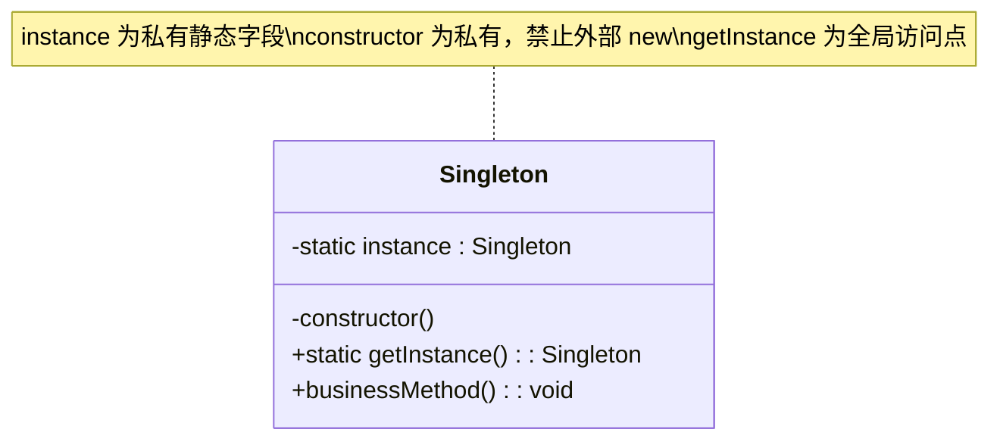
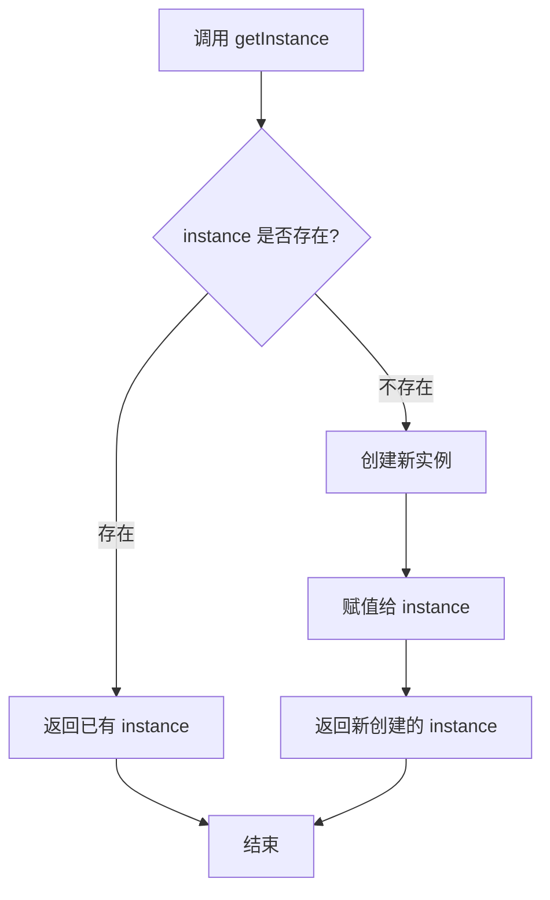

# 单例模式

## 1. 定义与意图

> 确保一个类仅有一个实例，并提供一个访问它的全局访问点。——GoF

单例模式的核心思想包含三个要素：第一，将构造函数私有化，阻止外部通过 `new` 随意创建实例；第二，在类内部持有一个指向自身唯一实例的静态引用；第三，提供一个静态方法作为全局访问点，让所有使用者获取的都是同一个对象。

在前端领域，单例模式具有特殊的天然优势。JavaScript 中全局变量本身就是一种"朴素的单例"——任何挂在 `window` 或 `globalThis` 上的变量都可以被全局访问。然而，全局变量缺少封装性，容易被意外覆盖或篡改，因此并非工程化的单例。更值得关注的是，ES Module 模块系统为单例模式提供了语言级支持：一个模块无论被 `import` 多少次，其顶层代码只会执行一次，导出的对象在所有导入者之间共享同一个引用。这意味着在现代前端开发中，我们无需手动实现单例的很多基础设施，模块本身就承担了保证唯一性的职责。

理解单例模式的关键在于区分"需要唯一实例"和"需要全局访问"两个动机。前者是资源约束（如数据库连接池只能有一个），后者是架构约束（如配置对象需要在各处读取）。在实际工程中，这两个动机往往同时出现。

---

## 2. UML类图



---

## 3. 核心角色与职责

| 角色 | 职责 |
|------|------|
| Singleton | 持有私有静态实例字段 `instance`，封装私有构造函数阻止外部实例化，暴露静态方法 `getInstance()` 作为唯一获取入口，同时承载业务方法 |

单例模式只有一个角色，这是它与其他创建型模式的显著区别。该角色同时承担了"实例管理"和"业务逻辑"两项职责，这也正是其违反单一职责原则的根源。

---

## 4. 应用场景

### 4.1 通用场景

#### 全局配置管理

应用中通常只需要一份配置，且需要在各处读取。单例模式确保配置对象唯一，避免不同模块持有配置副本导致不一致。

#### 日志记录器

日志系统需要在整个应用中统一格式、统一输出目标，单例模式保证所有模块写入同一个日志管道。

#### 数据库连接池

在 Node.js 后端服务中，数据库连接是有限资源，连接池需要全局唯一以统一管理连接的获取与释放。

### 4.2 前端框架实战

#### Vuex/Pinia Store：全局状态管理器天然是单例

Vue 的状态管理库（Vuex 和 Pinia）在架构层面就是单例模式的典型应用。Vuex 通过 `Vue.use(Vuex)` 注册插件时，`install` 方法会将 Store 实例挂载到所有 Vue 组件的 `$store` 属性上，确保整个应用共享同一个 Store。

#### React Context：全局 Provider 的单例语义

React Context 的设计理念与单例模式高度吻合：一个 `Provider` 在组件树中提供的数据，其下所有消费者获取的都是同一个引用。虽然 React 没有在语言层面强制单例，但在组件树的语义上，一个 Provider 就是一个单例数据源。

#### WebSocket 连接管理：确保同一端点只有一个连接实例

在即时通讯、实时数据推送等场景中，同一 WebSocket 端点必须只有一个活跃连接，否则会导致消息重复、连接资源浪费、状态不一致等问题。

---

## 5. Mermaid流程图



该流程图揭示了单例模式的核心判断逻辑：每次获取实例时，先检查静态字段中是否已存在实例。若存在则直接返回，避免重复创建；若不存在则创建新实例并存储后再返回。这个"检查-创建-缓存"的三步流程就是单例模式的全部控制逻辑。

---

## 6. 优缺点分析

| 优点 | 缺点 |
|------|------|
| 提供全局访问点，协调共享资源 | 违反单一职责原则（同时管理实例创建和业务逻辑） |
| 节约系统资源，避免重复创建昂贵对象 | 隐藏依赖关系，代码中直接调用 `getInstance()` 使得依赖不可见 |
| 延迟初始化，按需创建 | 难以单元测试（全局状态在测试用例间泄漏） |
| 保证状态一致性，避免多实例导致的数据冲突 | 扩展困难，单例类通常不支持继承或替换 |
| 初始化可控，可在应用启动时统一配置 | 并发场景下需额外处理竞态条件 |

针对缺点的缓解策略：

- **隐藏依赖**：通过依赖注入将单例实例作为参数传入，而非在类内部直接调用 `getInstance()`。
- **测试困难**：为单例类提供 `reset()` 或 `destroy()` 静态方法，在测试的 `beforeEach` 中调用以隔离状态。
- **扩展困难**：使用泛型单例工厂，将单例逻辑与业务逻辑分离，业务类可以正常继承和扩展。

---

## 7. 相关模式对比

| 对比维度 | 单例模式 | 工厂方法模式 |
|----------|---------|-------------|
| 创建控制 | 保证唯一实例 | 由子类决定实例化哪个类 |
| 使用动机 | 全局唯一访问点 | 解耦对象的创建与使用 |
| 实例数量 | 严格限制为 1 | 可创建多个 |
| 扩展性 | 差（难以继承替换） | 好（新增子类即可扩展） |
| 客户端感知 | 知道使用的是单例 | 不知道具体创建了哪个类 |
| 设计原则倾向 | 集中控制 | 开闭原则 |

单例模式与工厂方法模式可以组合使用：工厂方法负责创建对象，而工厂本身可以是单例。例如前文的 `createSingleton` 泛型工厂，其返回的获取器函数本身就是一个单例控制点。

此外，单例模式与静态类的对比也值得关注。静态类提供类级别的属性和方法，无需实例化，天然只有一个"实例"（类本身）。但静态类不支持延迟初始化，不支持实现接口，不利于多态和测试替身。单例模式通过实例化提供了更大的灵活性。

---

## 8. 总结

单例模式是最简单的创建型模式，也是最容易被滥用的模式。它的核心要点可以归纳为三条：

第一，**三要素缺一不可**：私有构造函数、静态实例字段、静态获取方法。缺少任何一项都无法真正保证唯一实例。

第二，**前端有天然优势**：ES Module 的单次求值特性使得 `export default new Xxx()` 成为最简洁的单例实现方式。在不需要延迟初始化的场景下，应优先使用模块天然单例，而非手动实现。

第三，**谨慎使用，优先替代**。单例模式引入了全局状态，增加了耦合，降低了可测试性。在现代前端架构中，很多传统上需要单例的场景（状态管理、依赖注入）已经有更优雅的解决方案：Pinia/Vuex 通过框架机制管理全局状态，React Context 通过组件树传递共享数据，依赖注入容器通过配置管理对象生命周期。只有当问题域本身要求"全局唯一"（如 WebSocket 端点连接、浏览器 localStorage 封装）时，单例模式才是合理的选择。

实践建议：能用模块单例就不用类单例，能用依赖注入就不用全局访问点，能用不可变数据就不用可变全局状态。单例是工具而非默认选项。

---

## 9. 面试真题

### 真题一：实现一个单例 Storage

> 实现 Storage，使得该对象为单例，基于 localStorage 进行封装。实现方法 `setItem(key, value)` 和 `getItem(key)`。

**实现思路**：拿到单例模式面试题，首先回忆 `getInstance` 方法和 `instance` 变量的作用。判断逻辑可以写入静态方法或构造函数里，最好也能写出闭包版本。

**静态方法版**：

**闭包版**：

### 真题二：实现全局唯一 Modal 弹框

> 实现一个全局唯一的 Modal 弹框。

**实现思路**：这是单例模式在前端领域最经典的体现。牢记 `getInstance`、`instance` 变量、闭包和静态方法，除了多写点 HTML/CSS，思路与 Storage 完全一致。

```html
<style>
  #modal {
    height: 200px;
    width: 200px;
    line-height: 200px;
    position: fixed;
    left: 50%;
    top: 50%;
    transform: translate(-50%, -50%);
    border: 1px solid black;
    text-align: center;
  }
</style>
<button id="open">打开弹框</button>
<button id="close">关闭弹框</button>
<script>
  // 核心逻辑：闭包实现单例
  const Modal = (function () {
    let modal = null
    return function () {
      if (!modal) {
        modal = document.createElement('div')
        modal.innerHTML = '我是一个全局唯一的Modal'
        modal.id = 'modal'
        modal.style.display = 'none'
        document.body.appendChild(modal)
      }
      return modal
    }
  })()

  document.getElementById('open').addEventListener('click', function () {
    const modal = new Modal()
    modal.style.display = 'block'
  })

  document.getElementById('close').addEventListener('click', function () {
    const modal = new Modal()
    if (modal) {
      modal.style.display = 'none'
    }
  })
</script>
```

> 面试技巧：设计模式相关面试题的特点是"牢记核心思路，即可举一反三"。拿到题目先回忆模式的核心结构（如单例的 `getInstance` + 唯一 `instance`），再套用到具体业务场景。

---

## TypeScript 实现

### 基础实现

#### 闭包实现单例（经典JS方式转TS）

闭包是 JavaScript 最原生的封装手段，通过 IIFE 创建词法作用域来隐藏实例变量。这种方式在 TypeScript 中同样适用，且可以通过类型注解获得完整的类型推导。

```typescript
interface SingletonInstance {
  name: string;
  getData(): string;
  setData(key: string, value: string): void;
}

const Singleton = ((): {
  getInstance: () => SingletonInstance;
} => {
  let instance: SingletonInstance | null = null;

  function createInstance(): SingletonInstance {
    return {
      name: "singleton",
      getData(): string {
        return JSON.stringify(this);
      },
      setData(key: string, value: string): void {
        (this as any)[key] = value;
      }
    };
  }

  return {
    getInstance(): SingletonInstance {
      if (!instance) {
        instance = createInstance();
      }
      return instance;
    }
  };
})();

// 使用
const a = Singleton.getInstance();
a.setData("theme", "dark");
const b = Singleton.getInstance();
console.log(a === b); // true
console.log(b.getData()); // {"name":"singleton","theme":"dark"}
```

#### 惰性单例（延迟创建）

惰性单例的核心价值在于：实例只在真正需要时才创建，避免应用启动时不必要的资源消耗。对于初始化成本高的对象（如建立 WebSocket 连接、加载大型配置文件），延迟创建是必要的。

```typescript
class LazySingleton {
  private static instance: LazySingleton | null = null;
  private static constructing = false;

  private readonly createdAt: number;
  private heavyResource: unknown;

  private constructor() {
    if (!LazySingleton.constructing) {
      throw new Error("请使用 LazySingleton.getInstance() 获取实例");
    }
    this.createdAt = Date.now();
    this.heavyResource = this.initHeavyResource();
  }

  private initHeavyResource(): unknown {
    console.log("初始化重型资源...");
    return { loadedAt: this.createdAt };
  }

  public static getInstance(): LazySingleton {
    if (!LazySingleton.instance) {
      // 先置 constructing 为 true，再构造，防止构造过程中重入
      LazySingleton.constructing = true;
      LazySingleton.instance = new LazySingleton();
      LazySingleton.constructing = false;
    }
    return LazySingleton.instance;
  }
}

// 实例在调用 getInstance 时才被创建
const s1 = LazySingleton.getInstance(); // 控制台输出: 初始化重型资源...
const s2 = LazySingleton.getInstance(); // 不会再次初始化
console.log(s1 === s2); // true
```

#### 透明单例（用户无感知，代理构造函数）

透明单例让使用者像操作普通类一样使用 `new`，而无须关心内部是否为单例。实现思路是：用一个代理构造函数替换原始构造函数，在代理中控制实例的创建。

```typescript
interface DatabaseConfig {
  host: string;
  port: number;
  database: string;
}

class Database {
  public readonly config: DatabaseConfig;
  private connected = false;

  constructor(config: DatabaseConfig) {
    this.config = config;
    this.connected = true;
    console.log(`已连接到 ${config.host}:${config.port}`);
  }
}

// 透明单例工厂：用代理构造函数拦截 new
function createTransparentSingleton<T extends new (...args: any[]) => any>(ctor: T): T {
  let instance: InstanceType<T> | null = null;
  return new Proxy(ctor, {
    construct(target, args) {
      if (!instance) {
        instance = new target(...args);
      }
      return instance!;
    }
  });
}

const SingletonDatabase = createTransparentSingleton(Database);

const db1 = new SingletonDatabase({ host: "localhost", port: 3306, database: "app" });
const db2 = new SingletonDatabase({ host: "other-host", port: 5432, database: "other" });
console.log(db1 === db2); // true -- 第二次构造参数被忽略
```

### 现代TypeScript实现

#### 泛型单例工厂

泛型单例工厂将单例逻辑从业务类中彻底剥离，任何类都可以通过该工厂获得单例语义，且不影响原始类的定义。

```typescript
function createSingleton<T>(ctor: new () => T): () => T {
  let instance: T | null = null;

  return (): T => {
    if (!instance) {
      instance = new ctor();
    }
    return instance;
  };
}

// 业务类保持纯粹，无单例逻辑
class Config {
  public readonly apiUrl: string;
  constructor() {
    this.apiUrl = "https://api.example.com";
  }
}

class EventManager {
  private listeners: Record<string, Function[]> = {};
  on(event: string, fn: Function) {
    (this.listeners[event] ??= []).push(fn);
  }
}

const getConfig = createSingleton(Config);
const config1 = getConfig();
const config2 = getConfig();
console.log(config1 === config2); // true

const getEventManager = createSingleton(EventManager);
const em1 = getEventManager();
const em2 = getEventManager();
console.log(em1 === em2); // true
```

#### 使用 Symbol 防篡改

Symbol 作为属性键具有唯一性，外部代码无法轻易猜到并修改内部实例引用，从而提升防篡改能力。

```typescript
const INSTANCE_KEY = Symbol.for("__singleton_instance__");

class SecureSingleton {
  private constructor() {}

  public static getInstance(): SecureSingleton {
    const ctor = this as unknown as {
      [INSTANCE_KEY]?: SecureSingleton;
    };

    if (!ctor[INSTANCE_KEY]) {
      Object.defineProperty(ctor, INSTANCE_KEY, {
        value: new SecureSingleton(),
        writable: false, // 不可重新赋值
        enumerable: false,
        configurable: false
      });
    }
    return ctor[INSTANCE_KEY]!;
  }

  public businessMethod(): string {
    return "secure singleton works";
  }
}

const instance = SecureSingleton.getInstance();
console.log(instance.businessMethod());

// 即使知道 Symbol.for 的 key 也无法覆盖
// Object.defineProperty(SecureSingleton, INSTANCE_KEY, { value: {} });
// TypeError: Cannot redefine property: Symbol(__singleton_instance__)
```

#### ES Module 天然单例

ES Module 规范保证：一个模块只会被求值一次，多次 `import` 得到的是同一个模块命名空间对象。这使得模块级导出天然就是单例。

```typescript
// app-config.ts
interface ConfigMap {
  apiUrl: string;
  timeout: number;
  debug: boolean;
}

class AppConfig {
  private config: ConfigMap = {
    apiUrl: "https://api.example.com",
    timeout: 5000,
    debug: false,
  };

  public get<K extends keyof ConfigMap>(key: K): ConfigMap[K] {
    return this.config[key];
  }

  public set<K extends keyof ConfigMap>(key: K, value: ConfigMap[K]): void {
    this.config[key] = value;
  }

  public getAll(): Readonly<ConfigMap> {
    return { ...this.config };
  }
}

// 模块级实例 -- 天然单例
export const appConfig = new AppConfig();
export default appConfig;
```

```typescript
// module-a.ts
import { appConfig } from "./app-config";
appConfig.set("debug", true);

// module-b.ts
import { appConfig } from "./app-config";
console.log(appConfig.get("debug")); // true -- 与 module-a 共享同一个实例
```

需要强调的是，模块天然单例不支持延迟初始化——模块在被首次导入时就会执行顶层代码并创建实例。如果需要延迟创建，应改用 `getInstance()` 静态方法的模式。

#### 使用 Proxy 拦截构造函数实现透明单例

与前文透明单例类似，这里给出一个更完善的 Proxy 实现，支持带参数的构造函数以及实例重置。

```typescript
interface SingletonProxyOptions {
  allowRecreate?: boolean;
}

function singletonProxy<T extends new (...args: any[]) => any>(
  Ctor: T,
  options: SingletonProxyOptions = {}
): T & { resetInstance(): void } {
  let instance: InstanceType<T> | null = null;
  let initialized = false;

  const ProxyClass = new Proxy(Ctor, {
    construct(target, args) {
      if (!initialized) {
        instance = new target(...args);
        initialized = true;
      } else if (options.allowRecreate) {
        instance = new target(...args);
      }
      return instance!;
    }
  });

  // 附加重置方法
  (ProxyClass as any).resetInstance = () => {
    instance = null;
    initialized = false;
  };

  return ProxyClass as T & { resetInstance(): void };
}

// 使用示例
class Cache {
  private data = new Map();
  constructor(private ttl: number) {}
  set(key: string, value: unknown) { this.data.set(key, value); }
  get(key: string) { return this.data.get(key); }
}

const SingletonCache = singletonProxy(Cache);
const c1 = new SingletonCache(30000);
c1.set("user", { name: "Alice" });
const c2 = new SingletonCache(60000);
console.log(c2.get("user")); // { name: "Alice" } -- 第二次构造参数被忽略

// 需要重建实例时
SingletonCache.resetInstance();
const c3 = new SingletonCache(60000); // 新实例
console.log(c1 === c3); // false
```

---

```typescript
interface AppConfigSchema {
  apiBaseUrl: string;
  timeout: number;
  retryCount: number;
  locale: string;
  theme: "light" | "dark";
}

class AppConfig {
  private static instance: AppConfig | null = null;
  private config: Partial<AppConfigSchema> = {};
  private frozen = false;

  private constructor() {}

  public static getInstance(): AppConfig {
    if (!AppConfig.instance) {
      AppConfig.instance = new AppConfig();
    }
    return AppConfig.instance;
  }

  public load(config: Partial<AppConfigSchema>): void {
    if (this.frozen) throw new Error("配置已冻结，无法修改");
    Object.assign(this.config, config);
  }

  public get<K extends keyof AppConfigSchema>(key: K): AppConfigSchema[K] | undefined {
    return this.config[key] as AppConfigSchema[K] | undefined;
  }

  public freeze(): void {
    this.frozen = true;
  }
}

const config = AppConfig.getInstance();
config.load({ apiBaseUrl: "https://api.production.com", theme: "dark" });
config.freeze(); // 冻结配置，后续不可修改

// 其他模块中读取
console.log(config.get("apiBaseUrl")); // https://api.production.com
```

```typescript
type LogLevel = "debug" | "info" | "warn" | "error";

interface LogEntry {
  timestamp: string;
  level: LogLevel;
  message: string;
  meta?: Record<string, unknown>;
}

type LogHandler = (entry: LogEntry) => void;

class Logger {
  private static instance: Logger | null = null;
  private handlers: LogHandler[] = [];
  private level: LogLevel = "info";

  private constructor() {}

  public static getInstance(): Logger {
    if (!Logger.instance) {
      Logger.instance = new Logger();
    }
    return Logger.instance;
  }

  public setLevel(level: LogLevel): void {
    this.level = level;
  }

  public addHandler(handler: LogHandler): Logger {
    this.handlers.push(handler);
    return this;
  }

  public info(message: string, meta?: Record<string, unknown>): void {
    this.log("info", message, meta);
  }

  public error(message: string, meta?: Record<string, unknown>): void {
    this.log("error", message, meta);
  }

  private log(level: LogLevel, message: string, meta?: Record<string, unknown>): void {
    const entry: LogEntry = { timestamp: new Date().toISOString(), level, message, meta };
    this.handlers.forEach((handler) => handler(entry));
  }
}

// 使用
const logger = Logger.getInstance()
  .addHandler((entry) => {
    console.log(`[${entry.timestamp}] [${entry.level.toUpperCase()}] ${entry.message}`);
  });

logger.info("应用启动", { version: "2.0.0" });
logger.error("请求失败", { statusCode: 500, url: "/api/users" });
```

```typescript
interface Connection {
  id: string;
  query(sql: string): Promise<unknown[]>;
  release(): void;
}

class DatabasePool {
  private static instance: DatabasePool | null = null;
  private pool: Connection[] = [];
  private activeCount = 0;
  private readonly maxConnections = 10;
  private waitQueue: Array<(conn: Connection) => void> = [];

  private constructor() {}

  public static getInstance(): DatabasePool {
    if (!DatabasePool.instance) {
      DatabasePool.instance = new DatabasePool();
    }
    return DatabasePool.instance;
  }

  public async acquire(): Promise<Connection> {
    if (this.pool.length > 0) {
      this.activeCount++;
      return this.pool.pop()!;
    }
    if (this.activeCount < this.maxConnections) {
      this.activeCount++;
      return this.createConnection();
    }
    // 超出连接上限，进入等待队列
    return new Promise((resolve) => {
      this.waitQueue.push((conn) => resolve(conn));
    });
  }

  public release(conn: Connection): void {
    const waiter = this.waitQueue.shift();
    if (waiter) {
      // 有等待者时将释放的连接直接转交，避免销毁重建，保持 activeCount 不变
      waiter(conn);
    } else {
      this.activeCount--;
      this.pool.push(conn);
    }
  }

  private createConnection(): Connection {
    return {
      id: `conn-${Math.random().toString(36).slice(2)}`,
      async query(sql: string) { return []; },
      release() {}
    };
  }

  public getStats() {
    return {
      active: this.activeCount,
      idle: this.pool.length,
      waiting: this.waitQueue.length,
    };
  }
}
```

```typescript
// Vuex 的 install 方法核心逻辑（简化版）
class VuexStore<S> {
  private static installed = false;
  private static store: VuexStore<unknown> | null = null;

  // Vuex 插件的 install 方法，由 Vue.use(Vuex) 调用
  public static install(Vue: any): void {
    if (VuexStore.installed) {
      return; // 防止重复安装
    }
    VuexStore.installed = true;
    VuexStore.store = new VuexStore();
    // 将唯一的 Store 挂载到 Vue 原型上，所有组件共享
    Vue.prototype.$store = VuexStore.store;
  }
}

// Pinia 同样通过 defineStore 保证 Store 唯一
// 在任意组件中调用 useCounterStore() 都返回同一个 Store 实例
// 这正是单例模式的框架级体现
```

```typescript
import React, { createContext, useContext, useReducer, type ReactNode } from "react";

// 定义全局状态类型
interface AppState {
  user: { name: string; id: string } | null;
  theme: "light" | "dark";
  locale: string;
}

type AppAction =
  | { type: "SET_USER"; payload: AppState["user"] }
  | { type: "SET_THEME"; payload: AppState["theme"] }
  | { type: "SET_LOCALE"; payload: AppState["locale"] };

function appReducer(state: AppState, action: AppAction): AppState {
  switch (action.type) {
    case "SET_USER": return { ...state, user: action.payload };
    case "SET_THEME": return { ...state, theme: action.payload };
    case "SET_LOCALE": return { ...state, locale: action.payload };
    default: return state;
  }
}

// 全局唯一的 Context Provider
const AppContext = createContext<{ state: AppState; dispatch: React.Dispatch<AppAction> } | null>(null);

export function AppProvider({ children }: { children: ReactNode }) {
  const [state, dispatch] = useReducer(appReducer, { user: null, theme: "light", locale: "zh" });
  return <AppContext.Provider value={{ state, dispatch }}>{children}</AppContext.Provider>;
}

// 使用
function LoginButton() {
  const { dispatch } = useContext(AppContext)!;
  return (
    <div>
      <button onClick={() => dispatch({ type: "SET_USER", payload: { name: "Alice", id: "1" } })}>
        登录
      </button>
    </div>
  );
}
```

```typescript
type MessageHandler = (data: unknown) => void;

interface WSConnection {
  send(data: unknown): void;
  close(): void;
  onMessage(handler: MessageHandler): () => void;
  readonly readyState: number;
}

class WebSocketManager {
  private static instance: WebSocketManager | null = null;
  private connections = new Map<string, WSConnection>();

  private constructor() {}

  public static getInstance(): WebSocketManager {
    if (!WebSocketManager.instance) {
      WebSocketManager.instance = new WebSocketManager();
    }
    return WebSocketManager.instance;
  }

  // 同一端点只创建一个连接
  public getConnection(url: string): WSConnection {
    if (!this.connections.has(url)) {
      this.connections.set(url, this.createConnection(url));
    }
    return this.connections.get(url)!;
  }

  private createConnection(url: string): WSConnection {
    const ws = new WebSocket(url);
    const handlers = new Set<MessageHandler>();
    ws.onmessage = (event) => handlers.forEach((h) => h(JSON.parse(event.data)));
    return {
      send(data) { ws.send(JSON.stringify(data)); },
      close() { ws.close(); },
      onMessage(handler) {
        handlers.add(handler);
        return () => handlers.delete(handler);
      },
      get readyState() { return ws.readyState; }
    };
  }
}

const manager = WebSocketManager.getInstance();
const chat1 = manager.getConnection("wss://chat.example.com");
const chat2 = manager.getConnection("wss://chat.example.com");
console.log(chat1 === chat2); // true

chat1.onMessage((data) => {
  console.log("收到消息:", data);
});
chat1.send({ type: "ping" });
```

```js
class Storage {
  static getInstance() {
    if (!Storage.instance) {
      Storage.instance = new Storage()
    }
    return Storage.instance
  }
  getItem(key) {
    return localStorage.getItem(key)
  }
  setItem(key, value) {
    return localStorage.setItem(key, value)
  }
}

const storage1 = Storage.getInstance()
const storage2 = Storage.getInstance()
storage1.setItem('name', '李雷')
storage1.getItem('name') // 李雷
storage2.getItem('name') // 也是李雷
storage1 === storage2 // true
```

```js
function StorageBase() {}
StorageBase.prototype.getItem = function (key) {
  return localStorage.getItem(key)
}
StorageBase.prototype.setItem = function (key, value) {
  return localStorage.setItem(key, value)
}

const Storage = (function () {
  let instance = null
  return function () {
    if (!instance) {
      instance = new StorageBase()
    }
    return instance
  }
})()

const storage1 = new Storage()
const storage2 = new Storage()
storage1 === storage2 // true
```

---

## Java 实现

### 饿汉式（线程安全，类加载即初始化）

```java
public class EagerSingleton {
    // 类加载时就创建实例，天然线程安全
    private static final EagerSingleton INSTANCE = new EagerSingleton();

    private EagerSingleton() {
        // 私有构造，禁止外部 new
    }

    public static EagerSingleton getInstance() {
        return INSTANCE;
    }
}
```

### 懒汉式 + 双重检查锁（DCL）

```java
public class LazySingleton {
    // volatile 防止指令重排，保证多线程下可见性与有序性
    private static volatile LazySingleton instance;

    private LazySingleton() {
    }

    public static LazySingleton getInstance() {
        if (instance == null) {                // 第一次检查，避免不必要的加锁
            synchronized (LazySingleton.class) {
                if (instance == null) {        // 第二次检查，防止重复创建
                    instance = new LazySingleton();
                }
            }
        }
        return instance;
    }
}
```

### 静态内部类（推荐，延迟加载 + 线程安全）

```java
public class HolderSingleton {
    private HolderSingleton() {
    }

    // 静态内部类只在首次访问时被加载，实现延迟初始化
    private static class Holder {
        private static final HolderSingleton INSTANCE = new HolderSingleton();
    }

    public static HolderSingleton getInstance() {
        return Holder.INSTANCE;
    }
}
```

### 枚举单例（最简洁，且防反射/防序列化破坏）

```java
public enum EnumSingleton {
    INSTANCE;

    public void businessMethod() {
        System.out.println("enum singleton works");
    }
}
```

> 枚举单例由 JVM 保证单例性，且天然抵御反射 `newInstance` 与序列化破坏，是 Java 中最严谨的单例写法。

## Python 实现

### 模块级单例（利用 import 缓存）

```python
# singleton.py —— Python 模块天然单例
class Database:
    def __init__(self):
        self.connected = False

    def connect(self):
        self.connected = True
        return self

# 模块顶层只执行一次，多次导入共享同一实例
database = Database()
```

```python
# main.py —— 多次 import 得到同一对象
from singleton import database

db1 = database
db2 = database
assert db1 is db2  # True，同一实例
```

### `__new__` 拦截实现单例

```python
class Singleton:
    _instance = None

    def __new__(cls, *args, **kwargs):
        if cls._instance is None:
            cls._instance = super().__new__(cls)
        return cls._instance
```

### 元类单例（控制类实例化）

```python
class SingletonMeta(type):
    _instances = {}

    def __call__(cls, *args, **kwargs):
        if cls not in cls._instances:
            cls._instances[cls] = super().__call__(*args, **kwargs)
        return cls._instances[cls]

class Config(metaclass=SingletonMeta):
    def __init__(self):
        self.debug = False
```

### 装饰器单例

```python
from functools import wraps

def singleton(cls):
    instance = None

    @wraps(cls)
    def get_instance(*args, **kwargs):
        nonlocal instance
        if instance is None:
            instance = cls(*args, **kwargs)
        return instance

    return get_instance

@singleton
class Logger:
    def __init__(self):
        self.level = "info"
```

> 现代 Python 中，模块单例与装饰器单例是最简洁的写法；若需延迟初始化或控制实例创建，用 `__new__` 或元类方案。

