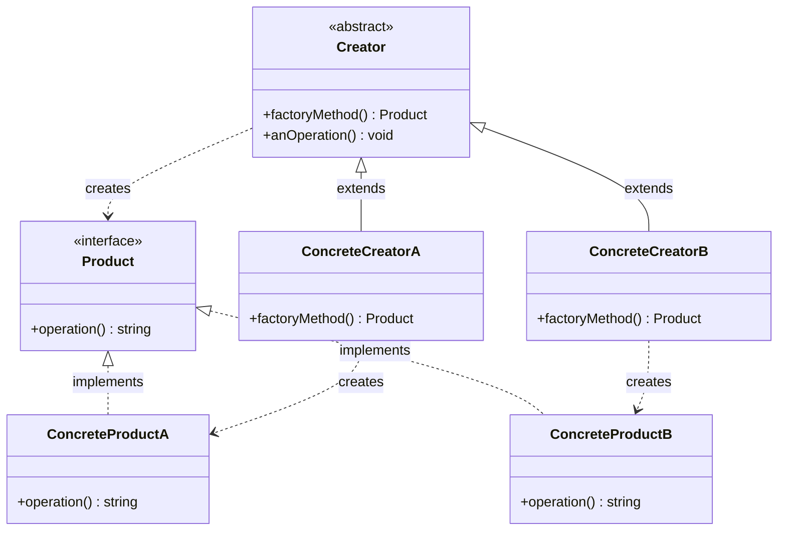
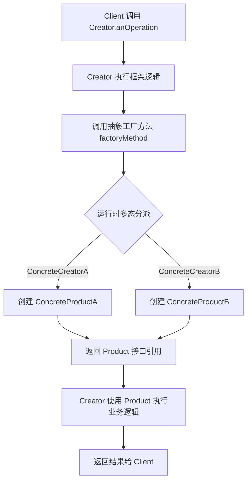

# 工厂方法模式

> 定义一个用于创建对象的接口，让子类决定实例化哪一个类。工厂方法使一个类的实例化延迟到其子类。——GoF

---

## 1. 定义与意图

工厂方法模式（Factory Method Pattern）是一种创建型设计模式，其核心在于将"变与不变"分离：对象的使用逻辑是不变的，而对象的创建逻辑是可变的。通过将创建逻辑委托给子类或独立函数，客户端代码无需关心具体实例化的类型，只需面向抽象接口编程。

### "变与不变"的核心理念

```
┌─────────────────────────────────────────────────────────────┐
│                  工厂方法：变与不变的分离                     │
├─────────────────────────────────────────────────────────────┤
│                                                             │
│  不变的部分（客户端/Creator 框架逻辑）                       │
│  ─────────────────────────────                              │
│  • 使用 Product 接口进行操作                                 │
│  • Creator 中的业务流程（anOperation）                       │
│  • 对产品的校验、缓存、日志等横切逻辑                        │
│                                                             │
│  变化的部分（子类/ConcreteCreator 创建逻辑）                 │
│  ─────────────────────────────                              │
│  • 具体实例化哪个 Product                                   │
│  • 创建参数的组装方式                                       │
│  • 创建时机的选择                                           │
│                                                             │
│  分离效果：                                                 │
│  ─────────────────────────────                              │
│  新增产品类型 → 只需新增 ConcreteCreator                    │
│  修改创建逻辑 → 不影响客户端使用代码                        │
│  复用框架逻辑 → Creator 基类统一管理                        │
│                                                             │
└─────────────────────────────────────────────────────────────┘
```

### 意图精解

| 维度 | 说明 |
|------|------|
| **核心意图** | 让子类决定创建哪个对象，而非在父类中硬编码 |
| **解决痛点** | 客户端与具体产品类紧耦合，每新增产品就要修改客户端 |
| **实现手段** | 在父类中声明抽象工厂方法，由子类实现具体创建 |
| **延迟实例化** | 将 new 操作从编译期绑定推迟到运行时多态分派 |

---

## 2. UML类图



### 类图要点说明

- **Product**：定义产品的统一接口，客户端仅依赖此接口
- **ConcreteProductA/B**：具体产品实现，各自提供不同的行为
- **Creator**：声明抽象工厂方法 `factoryMethod()`，并包含依赖该方法的框架逻辑 `anOperation()`
- **ConcreteCreatorA/B**：实现工厂方法，返回对应的具体产品实例
- 虚线箭头表示 Creator 通过多态创建 Product，而非直接依赖具体类

---

## 3. 核心角色与职责

| 角色 | 职责 | 关键特征 |
|------|------|----------|
| **Product** | 定义产品接口，声明业务方法 | 面向接口编程的基石 |
| **ConcreteProduct** | 具体产品实现，提供真实行为 | 实现Product接口 |
| **Creator** | 声明工厂方法，包含框架逻辑 | 可提供默认实现或保持抽象 |
| **ConcreteCreator** | 实现工厂方法，返回具体产品 | 决定实例化哪个类 |

### 角色协作流程

```
┌─────────────────────────────────────────────────────────────┐
│                    角色协作时序                              │
├─────────────────────────────────────────────────────────────┤
│                                                             │
│  Client                  Creator              Product       │
│    │                        │                     │         │
│    │  new ConcreteCreator   │                     │         │
│    │───────────────────────>│                     │         │
│    │                        │                     │         │
│    │  anOperation()         │                     │         │
│    │───────────────────────>│                     │         │
│    │                        │                     │         │
│    │                        │  factoryMethod()    │         │
│    │                        │────────────────────>│         │
│    │                        │                     │         │
│    │                        │  new ConcreteProduct│         │
│    │                        │────────────────────>│         │
│    │                        │                     │         │
│    │                        │  product.operation()│         │
│    │                        │────────────────────>│         │
│    │                        │                     │         │
│    │  返回结果              │                     │         │
│    │<───────────────────────│                     │         │
│                                                             │
└─────────────────────────────────────────────────────────────┘
```

---

## 4. 应用场景

### 4.1 通用场景

#### 日志记录器

#### 数据库连接

### 4.2 前端框架实战

#### React 组件工厂

根据配置动态创建不同类型的 React 组件，实现组件的按需渲染与类型安全。

#### UI 组件库——ConfigProvider + 组件工厂

模拟 Ant Design 的 ConfigProvider 机制，通过工厂方法实现组件的主题定制与按需创建。

#### 表单控件工厂

根据字段类型（text/number/select/date/range）动态生成对应的表单控件，实现配置驱动的表单渲染。

---

## 5. Mermaid流程图



### 流程要点

1. **Client** 仅依赖 Creator 的接口，不关心具体产品类型
2. **Creator** 的框架逻辑（anOperation）是稳定的，不随产品变化而修改
3. **factoryMethod** 是多态分派点，由具体子类决定创建哪个产品
4. 返回的始终是 **Product 接口**引用，保证客户端代码的通用性
5. 新增产品只需新增 ConcreteCreator，无需修改已有代码

---

## 6. 优缺点分析

| 优点 | 缺点 |
|------|------|
| **符合开闭原则**：新增产品只需新增 Creator 子类，无需修改已有代码 | **类数量增加**：每新增一种产品就要新增一个 Creator 类 |
| **解耦创建与使用**：客户端仅依赖 Product 接口，不依赖具体产品类 | **增加系统抽象性**：引入额外的抽象层，理解成本上升 |
| **符合单一职责**：产品创建逻辑集中在 Creator 子类中 | **简单场景过度设计**：产品种类少且固定时，直接 new 更简洁 |
| **框架逻辑复用**：Creator 基类可封装通用的创建后处理逻辑 | **产品族扩展困难**：只能处理单一产品维度，多产品族需抽象工厂 |
| **支持运行时动态切换**：通过注入不同 Creator 实现运行时替换 | **并行类层次**：Creator 与 Product 形成平行的继承结构 |

### 适用性判断

```
┌─────────────────────────────────────────────────────────────┐
│              何时使用工厂方法模式？                           │
├─────────────────────────────────────────────────────────────┤
│                                                             │
│  1. 类无法预知要创建的对象类型                               │
│     → 如：框架需要由用户子类决定创建哪种文档                │
│                                                             │
│  2. 希望将对象创建逻辑集中管理                               │
│     → 如：日志系统需要统一管理不同 Logger 的创建            │
│                                                             │
│  3. 希望复用创建后的通用逻辑                                 │
│     → 如：创建后需要校验、缓存、日志等横切关注点            │
│                                                             │
│  4. 产品类型经常扩展                                         │
│     → 如：支付系统需要频繁接入新的支付渠道                  │
│                                                             │
│  不适用场景：                                               │
│  • 产品种类固定且极少（1-2种）→ 简单工厂或直接 new          │
│  • 需要创建产品族（多维度关联产品）→ 抽象工厂               │
│  • 创建过程极其复杂（多步骤构建）→ 建造者模式               │
│                                                             │
└─────────────────────────────────────────────────────────────┘
```

---

## 7. 相关模式对比

| 对比维度 | 简单工厂 | 工厂方法 | 抽象工厂 |
|----------|---------|---------|---------|
| **结构** | 一个工厂类 | 工厂层次结构（Creator + 子类） | 工厂层次结构 + 产品族 |
| **OCP** | 违反（需修改 switch-case） | 符合（新增子类即可） | 符合（新增工厂类即可） |
| **产品维度** | 单一产品 | 单一产品 | 产品族（多维度关联产品） |
| **工厂方法数量** | 一个 create 方法 | 一个 factoryMethod | 多个 create 方法 |
| **客户端耦合** | 依赖工厂类和参数 | 依赖 Creator 抽象类 | 依赖 AbstractFactory 接口 |
| **扩展产品** | 修改工厂类 | 新增 Creator 子类 | 新增 AbstractFactory 子类 |
| **扩展产品族** | 不支持 | 不支持 | 新增 AbstractFactory 子类 |
| **复杂度** | 低 | 中 | 高 |
| **典型场景** | 配置解析、日志创建 | 插件系统、支付渠道 | 跨平台UI、数据库适配器 |

### 工厂方法 vs 简单工厂：演进路径

### 工厂方法 vs 抽象工厂：维度差异

### 工厂方法与其他创建型模式的关系

| 模式 | 关系 |
|------|------|
| **模板方法** | 工厂方法常作为模板方法的一个步骤，Creator.anOperation 就是模板方法 |
| **原型** | 工厂方法可返回克隆对象而非新实例，将工厂方法与原型结合 |
| **单例** | ConcreteCreator 可确保只创建一个产品实例，工厂方法 + 单例 |
| **建造者** | 工厂方法关注"创建什么"，建造者关注"如何创建"，可组合使用 |
| **策略** | 工厂方法决定创建哪个策略对象，客户端通过策略模式使用 |

---

## 8. 总结

工厂方法模式是创建型模式中最具代表性的"开闭原则"实践。其核心价值在于：

1. **将创建逻辑与使用逻辑分离**：客户端仅依赖 Product 接口，不关心具体实例化哪个类
2. **通过多态延迟实例化决策**：由子类在运行时决定创建哪个产品，而非在父类中硬编码
3. **框架逻辑复用**：Creator 基类可封装创建后的通用处理（校验、缓存、日志等），子类只需关注创建本身
4. **渐进式演进**：从简单工厂起步，当产品种类增长导致 switch-case 膨胀时，自然演进为工厂方法

在实际项目中，应避免过度设计：产品种类少且稳定时，简单工厂甚至直接 new 即可；产品种类频繁扩展时，工厂方法是最优选择；需要创建多维度关联产品族时，应升级为抽象工厂。选择的关键在于识别"变"的部分，并确保"变"的影响范围被最小化。

---

## TypeScript 实现

### 简单工厂（静态工厂方法）及其局限性

简单工厂并非严格意义上的设计模式，而是一种编程习惯。它通过一个工厂类的静态方法，根据参数决定创建哪种产品。

```typescript
// ---- 产品接口与实现 ----
interface Logger {
  log(message: string): void;
}

class FileLogger implements Logger {
  log(message: string): void {
    console.log(`[File] ${message}`);
  }
}

class ConsoleLogger implements Logger {
  log(message: string): void {
    console.log(`[Console] ${message}`);
  }
}

// ---- 简单工厂（静态方法） ----
class SimpleLoggerFactory {
  static create(type: string): Logger {
    switch (type) {
      case 'file':
        return new FileLogger();
      case 'console':
        return new ConsoleLogger();
      default:
        throw new Error(`未知的 Logger 类型: ${type}`);
    }
  }
}

// 使用
const logger = SimpleLoggerFactory.create('console');
logger.log('Application started');
```

**局限性分析**：简单工厂违反开闭原则（OCP）。每新增一种 Logger，必须修改 `SimpleLoggerFactory.create()` 中的 switch-case 分支。当产品种类持续增长时，工厂类将不断膨胀，维护成本急剧上升。

```
┌─────────────────────────────────────────────────────────────┐
│              简单工厂的 OCP 违反问题                         │
├─────────────────────────────────────────────────────────────┤
│                                                             │
│  新增 RemoteLogger 时：                                     │
│                                                             │
│  class SimpleLoggerFactory {                                │
│    static create(type) {                                    │
│      switch (type) {                                        │
│        case 'file':    return new FileLogger();             │
│        case 'console': return new ConsoleLogger();          │
│        case 'remote':  return new RemoteLogger(); // 修改!  │
│        // 每次新增都要改这里...                              │
│      }                                                      │
│    }                                                        │
│  }                                                          │
│                                                             │
│  问题：修改已封闭的工厂类，违反"对修改关闭"原则             │
│                                                             │
└─────────────────────────────────────────────────────────────┘
```

### 工厂方法模式——通过子类化解 switch-case

工厂方法模式将创建逻辑下放到子类，每个子类只负责创建一种具体产品，从而在不修改已有代码的前提下扩展新产品。

```typescript
// ---- 产品接口与实现 ----
interface Document {
  open(): void;
  save(): void;
  getType(): string;
}

class PdfDocument implements Document {
  open(): void {
    console.log('Opening PDF document with PDF viewer');
  }
  save(): void {
    console.log('Saving PDF document in PDF format');
  }
  getType(): string { return 'PDF'; }
}

class WordDocument implements Document {
  open(): void {
    console.log('Opening Word document with text editor');
  }
  save(): void {
    console.log('Saving Word document in DOCX format');
  }
  getType(): string { return 'Word'; }
}

// ---- 抽象 Creator ----
abstract class DocumentCreator {
  // 工厂方法：延迟到子类实现
  abstract createDocument(): Document;

  // 框架逻辑：依赖工厂方法创建产品并操作
  openDocument(): void {
    const doc = this.createDocument();
    console.log(`--- Working with ${doc.getType()} document ---`);
    doc.open();
    doc.save();
    console.log('--- Operation complete ---');
  }
}

// ---- 具体 Creator ----
class PdfCreator extends DocumentCreator {
  createDocument(): Document { return new PdfDocument(); }
}
class WordCreator extends DocumentCreator {
  createDocument(): Document { return new WordDocument(); }
}

// ---- 客户端 ----
function clientCode(creator: DocumentCreator): void {
  creator.openDocument();
}

clientCode(new PdfCreator());
clientCode(new WordCreator());
// --- Working with Word document ---
// Opening Word document with text editor
// Saving Word document in DOCX format
// --- Operation complete ---
```

**关键改进**：新增 MarkdownDocument 时，只需新增 `MarkdownCreator` 类，无需修改 `DocumentCreator` 基类或任何已有子类，完全符合开闭原则。

### 现代TypeScript实现

#### 泛型工厂

利用泛型参数将工厂方法抽象为通用基类，避免为每种产品重复编写 Creator 子类。

```typescript
// ---- 泛型工厂基类 ----
abstract class Factory<T> {
  abstract create(): T;

  // 可复用的框架逻辑
  createAndLog(label: string): T {
    const instance = this.create();
    console.log(`[${label}] Instance created: ${(instance as object).constructor.name}`);
    return instance;
  }
}

// ---- 产品接口 ----
interface Cache {
  set(key: string, value: unknown): void;
  get(key: string): unknown;
}

// ---- 具体工厂子类 ----
class MemoryCacheFactory extends Factory<Cache> {
  create(): Cache {
    const store = new Map<string, unknown>();
    return {
      set(key, value) { store.set(key, value); },
      get(key) { return store.get(key); },
    };
  }
}

class RedisCacheFactory extends Factory<Cache> {
  create(): Cache {
    return {
      set(key, value) { console.log(`[Redis] SET ${key} = ${JSON.stringify(value)}`); },
      get(key) { console.log(`[Redis] GET ${key}`); return null; },
    };
  }
}

// 使用
const cacheFactory = new RedisCacheFactory();
const cache = cacheFactory.createAndLog('Cache');
cache.set('user:1', { name: 'Alice' });
```

#### 映射类型自动注册产品

利用 TypeScript 映射类型（Mapped Types）实现类型安全的产品注册与创建，消除手动编写 Creator 子类的样板代码。

```typescript
// ---- 产品接口 ----
interface PaymentProcessor {
  process(amount: number): string;
}

class AlipayProcessor implements PaymentProcessor {
  process(amount: number): string {
    return `Alipay: processed ${amount} CNY`;
  }
}

class WechatProcessor implements PaymentProcessor {
  process(amount: number): string {
    return `Wechat: processed ${amount} CNY`;
  }
}

// ---- 产品注册表（映射类型 + 工厂方法） ----
const paymentMap = {
  alipay: () => new AlipayProcessor(),
  wechat: () => new WechatProcessor(),
} as const;

type PaymentType = keyof typeof paymentMap;

// 类型安全的工厂：返回类型由入参自动推导
const PaymentFactory = {
  create<T extends PaymentType>(type: T): ReturnType<typeof paymentMap[T]> {
    return paymentMap[type]() as ReturnType<typeof paymentMap[T]>;
  },
};

// 使用——返回类型自动推导为具体产品类型
const alipay = PaymentFactory.create('alipay'); // 类型: AlipayProcessor
const wechat = PaymentFactory.create('wechat'); // 类型: WechatProcessor

console.log(alipay.process(100));
console.log(wechat.process(200));
```

#### 高阶工厂函数

利用函数式编程思想，将工厂方法实现为高阶函数，进一步减少类的数量。

```typescript
// ---- 高阶工厂函数 ----
function createFactory<T, A extends unknown[] = []>(
  constructor: new (...args: A) => T,
  ...defaultArgs: A
): (...args: Partial<A>) => T {
  return (...args): T => {
    const mergedArgs = defaultArgs.map(
      (val, idx) => (args[idx] !== undefined ? args[idx] : val)
    ) as A;
    return new constructor(...mergedArgs);
  };
}

// ---- 产品类 ----
class ApiClient {
  constructor(
    public baseURL: string,
    public timeout: number,
    public retries: number,
  ) {}

  request(path: string): string {
    return `Requesting ${this.baseURL}${path} (timeout: ${this.timeout}ms, retries: ${this.retries})`;
  }
}

// 使用高阶工厂创建带默认参数的 ApiClient
const createApiClient = createFactory(ApiClient, 'https://api.example.com', 5000, 3);
const apiClient = createApiClient();

// 也可覆盖部分默认参数
const customClient = createApiClient('https://custom.api.com' as any);

console.log(apiClient.request('/users'));
// Requesting https://api.example.com/users (timeout: 5000ms, retries: 3)
```

#### 参数化工厂方法

工厂方法可接受参数，由子类根据参数决定创建策略，同时保持框架逻辑不变。

```typescript
// ---- 产品接口 ----
interface Notification {
  send(recipient: string, content: string): void;
}

class EmailNotification implements Notification {
  constructor(private smtpHost: string) {}

  send(recipient: string, content: string): void {
    console.log(`[Email via ${this.smtpHost}] To: ${recipient}, Content: ${content}`);
  }
}

class SmsNotification implements Notification {
  constructor(private provider: string) {}
  send(recipient: string, content: string): void {
    console.log(`[SMS via ${this.provider}] To: ${recipient}, Content: ${content}`);
  }
}

// ---- 抽象 Creator：参数化工厂方法 ----
interface NotificationOptions {
  channel?: 'email' | 'sms';
  smtpHost?: string;
  provider?: string;
}

abstract class NotificationCreator {
  abstract createNotification(options: NotificationOptions): Notification;

  // 框架逻辑：根据参数选择产品
  sendNotification(recipient: string, content: string, options: NotificationOptions = {}): void {
    const notification = this.createNotification(options);
    notification.send(recipient, content);
  }
}

// ---- 具体 Creator ----
class DefaultNotificationCreator extends NotificationCreator {
  createNotification(options: NotificationOptions): Notification {
    if (options.channel === 'sms') {
      return new SmsNotification(options.provider ?? 'default');
    }
    return new EmailNotification(options.smtpHost ?? 'smtp.example.com');
  }
}

// 使用
const emailCreator = new DefaultNotificationCreator();
emailCreator.sendNotification('user@example.com', 'Welcome!', {
  smtpHost: 'smtp.gmail.com',
});
```

---

```typescript
// ---- 产品接口 ----
interface AppLogger {
  info(message: string): void;
  error(message: string): void;
  warn(message: string): void;
}

class FileAppLogger implements AppLogger {
  private filePath: string;

  constructor(filePath: string) {
    this.filePath = filePath;
  }

  info(message: string): void { console.log(`[File:${this.filePath}] INFO: ${message}`); }
  error(message: string): void { console.log(`[File:${this.filePath}] ERROR: ${message}`); }
  warn(message: string): void { console.log(`[File:${this.filePath}] WARN: ${message}`); }
}

// ---- 抽象工厂 ----
interface LoggerFactory {
  getLogger(): AppLogger;
}

class FileLoggerFactory implements LoggerFactory {
  getLogger(): AppLogger { return new FileAppLogger('/var/log/app.log'); }
}

class ConsoleLoggerFactory implements LoggerFactory {
  getLogger(): AppLogger {
    return {
      info: (m) => console.log(`[Console] INFO: ${m}`),
      error: (m) => console.log(`[Console] ERROR: ${m}`),
      warn: (m) => console.log(`[Console] WARN: ${m}`),
    };
  }
}

// 使用
const factory: LoggerFactory = new FileLoggerFactory();
const logger = factory.getLogger();
logger.error('Database connection failed');
```

```typescript
// ---- 产品接口 ----
interface DatabaseConnection {
  connect(): Promise<void>;
  query(sql: string): Promise<unknown[]>;
  close(): Promise<void>;
}

class MySQLConnection implements DatabaseConnection {
  async connect(): Promise<void> {
    console.log('MySQL: Establishing connection...');
  }
  async query(sql: string): Promise<unknown[]> {
    console.log(`MySQL: Executing query: ${sql}`);
    return [];
  }
  async close(): Promise<void> {
    console.log('MySQL: Closing connection...');
  }
}

class PostgreSQLConnection implements DatabaseConnection {
  async connect(): Promise<void> {
    console.log('PostgreSQL: Establishing connection...');
  }
  async query(sql: string): Promise<unknown[]> {
    console.log(`PostgreSQL: Executing query: ${sql}`);
    return [];
  }
  async close(): Promise<void> {
    console.log('PostgreSQL: Closing connection...');
  }
}

// ---- 抽象工厂：包含框架逻辑 ----
interface DatabaseFactory {
  createConnection(): DatabaseConnection;
  // 框架逻辑：创建 + 健康检查
  createAndHealthCheck(): Promise<DatabaseConnection>;
}

class MySQLDatabaseFactory implements DatabaseFactory {
  createConnection(): DatabaseConnection { return new MySQLConnection(); }
  async createAndHealthCheck(): Promise<DatabaseConnection> {
    const db = this.createConnection();
    await db.connect();
    console.log('MySQL: Health check passed');
    return db;
  }
}

class PostgreSQLDatabaseFactory implements DatabaseFactory {
  createConnection(): DatabaseConnection { return new PostgreSQLConnection(); }
  async createAndHealthCheck(): Promise<DatabaseConnection> {
    const db = this.createConnection();
    await db.connect();
    console.log('PostgreSQL: Health check passed');
    return db;
  }
}

// 使用
async function main(): Promise<void> {
  const dbFactory: DatabaseFactory = new PostgreSQLDatabaseFactory();
  const db = await dbFactory.createAndHealthCheck();
  await db.query('SELECT * FROM users');
  await db.close();
}
void main();
```

```typescript
import React, { ReactElement } from 'react';

// ---- 产品接口（Widget 组件类型） ----
type WidgetType = 'chart' | 'table' | 'stat' | 'timeline';

interface WidgetProps {
  data: unknown;
  title: string;
}

// ---- 具体产品（Widget 组件） ----
const ChartWidget: React.FC<WidgetProps> = ({ data, title }) => (
  <div className="widget-chart"><h3>{title}</h3><div>Chart: {JSON.stringify(data)}</div></div>
);

const TableWidget: React.FC<WidgetProps> = ({ data, title }) => (
  <div className="widget-table"><h3>{title}</h3><table><tbody>{/* 表格渲染 */}</tbody></table></div>
);

const StatWidget: React.FC<WidgetProps> = ({ data, title }) => (
  <div className="widget-stat"><h3>{title}</h3><strong>{String(data)}</strong></div>
);

const TimelineWidget: React.FC<WidgetProps> = ({ data, title }) => (
  <div className="widget-timeline"><h3>{title}</h3><ul>{/* 时间线渲染 */}</ul></div>
);

// ---- 组件工厂（映射类型） ----
const widgetRegistry = {
  chart: ChartWidget,
  table: TableWidget,
  stat: StatWidget,
  timeline: TimelineWidget,
} as const;

type WidgetKey = keyof typeof widgetRegistry;

function createWidget(type: WidgetKey, props: WidgetProps): ReactElement {
  const Component = widgetRegistry[type];
  return <Component {...props} />;
}

// ---- 使用：根据配置动态渲染 ----
const dashboardConfig = [
  { type: 'stat', title: 'Total Users', data: 12580 },
  { type: 'chart', title: 'Revenue Trend', data: [100, 200, 150, 300] },
  { type: 'table', title: 'Recent Orders', data: [{ id: 1, name: 'Order A' }] },
  { type: 'timeline', title: 'Activity Log', data: [{ time: '10:00', event: 'Login' }] },
];
```

```typescript
// ---- 主题配置 ----
interface ThemeConfig {
  primaryColor: string;
  borderRadius: number;
  fontSize: number;
}

// ---- 产品接口 ----
interface UIComponent {
  render(): string;
}

// ---- 具体产品 ----
class Button implements UIComponent {
  constructor(private label: string, private theme: ThemeConfig) {}
  render(): string {
    return `<button style="background:${this.theme.primaryColor};border-radius:${this.theme.borderRadius}px;font-size:${this.theme.fontSize}px">${this.label}</button>`;
  }
}

class Input implements UIComponent {
  constructor(private placeholder: string, private theme: ThemeConfig) {}
  render(): string {
    return `<input placeholder="${this.placeholder}" style="border-radius:${this.theme.borderRadius}px">`;
  }
}

// ---- 主题工厂 ----
interface ComponentFactory {
  createButton(label: string): UIComponent;
  createInput(placeholder: string): UIComponent;
}

class LightComponentFactory implements ComponentFactory {
  private theme: ThemeConfig = { primaryColor: '#1677ff', borderRadius: 6, fontSize: 14 };
  createButton(label: string): UIComponent { return new Button(label, this.theme); }
  createInput(placeholder: string): UIComponent { return new Input(placeholder, this.theme); }
}

class DarkComponentFactory implements ComponentFactory {
  private theme: ThemeConfig = { primaryColor: '#1668dc', borderRadius: 6, fontSize: 14 };
  createButton(label: string): UIComponent { return new Button(label, this.theme); }
  createInput(placeholder: string): UIComponent { return new Input(placeholder, this.theme); }
}

// ---- ConfigProvider：根据主题提供对应工厂 ----
class ConfigProvider {
  private static theme: 'light' | 'dark' = 'light';
  static setTheme(theme: 'light' | 'dark'): void { this.theme = theme; }
  static getFactory(): ComponentFactory {
    return this.theme === 'dark' ? new DarkComponentFactory() : new LightComponentFactory();
  }
}

// 使用
ConfigProvider.setTheme('dark');
const factory = ConfigProvider.getFactory();
const btn = factory.createButton('Submit');
const input = factory.createInput('Enter your name');
console.log(btn.render());
console.log(input.render());
```

```typescript
// ---- 产品接口 ----
interface FormControl {
  render(): string;
  validate(value: unknown): string | null;
  getValue(): unknown;
}

// ---- 具体产品 ----
class TextControl implements FormControl {
  private value = '';

  constructor(private name: string, private label: string) {}

  render(): string { return `<input name="${this.name}" label="${this.label}">`; }
  validate(value: unknown): string | null {
    return value === '' || value == null ? `${this.label} is required` : null;
  }
  getValue(): unknown { return this.value; }
}

// ---- 表单控件工厂 ----
class FormControlFactory {
  static create(field: FormField): FormControl {
    switch (field.type) {
      case 'text': return new TextControl(field.name, field.label);
      case 'number': return new NumberControl(field.name, field.label);
      case 'select': return new SelectControl(field.name, field.label, field.options ?? []);
      case 'date': return new DateControl(field.name, field.label);
      case 'range': return new RangeControl(field.name, field.label);
      default: throw new Error(`未知控件类型: ${field.type}`);
    }
  }
}

// 简化的其他控件（省略内部实现）
class NumberControl implements FormControl {
  constructor(private name: string, private label: string) {}
  render() { return `<input type="number" name="${this.name}">`; }
  validate(v: unknown) { return isNaN(Number(v)) ? `${this.label} 必须是数字` : null; }
  getValue() { return 0; }
}
class SelectControl implements FormControl {
  constructor(private name: string, private label: string, private options: Array<{ label: string; value: string }>) {}
  render() { return `<select name="${this.name}">${this.options.map(o => `<option value="${o.value}">${o.label}</option>`).join('')}</select>`; }
  validate(_v: unknown) { return null; }
  getValue() { return ''; }
}
class DateControl implements FormControl {
  constructor(private name: string, private label: string) {}
  render() { return `<input type="date" name="${this.name}">`; }
  validate(_v: unknown) { return null; }
  getValue() { return ''; }
}
class RangeControl implements FormControl {
  constructor(private name: string, private label: string) {}
  render() { return `<input type="range" name="${this.name}">`; }
  validate(_v: unknown) { return null; }
  getValue() { return 0; }
}

// ---- 表单渲染器：配置驱动 ----
interface FormField {
  type: 'text' | 'number' | 'select' | 'date' | 'range';
  name: string;
  label: string;
  options?: Array<{ label: string; value: string }>;
}

class FormRenderer {
  private fields: FormControl[] = [];
  addField(field: FormField): this {
    this.fields.push(FormControlFactory.create(field));
    return this;
  }
  render(): string {
    return this.fields.map(f => f.render()).join('\n');
  }
}

// 使用
const renderer = new FormRenderer();
renderer.addField({ type: 'text', name: 'username', label: 'Username' });
renderer.addField({
  type: 'select', name: 'role', label: 'Role',
  options: [
  { label: 'Admin', value: 'admin' },
  { label: 'User', value: 'user' },
]});
renderer.addField({ type: 'date', name: 'birthday', label: 'Birthday' });

console.log(renderer.render());
```

```typescript
// ---- 阶段一：简单工厂（产品少时足够） ----
{
  class SimpleParserFactory {
    static create(type: 'json' | 'xml'): Parser {
      switch (type) {
        case 'json': return new JsonParser();
        case 'xml':  return new XmlParser();
      }
    }
  }
}

// ---- 阶段二：产品增多，switch-case 膨胀 ----
{
  class SimpleParserFactory {
    static create(type: string): Parser {
      switch (type) {
        case 'json': return new JsonParser();
        case 'xml':  return new XmlParser();
        case 'yaml': return new YamlParser(); // 每次新增都要改这里
        // ...
        default: throw new Error(`未知类型: ${type}`);
      }
    }
  }
}

// ---- 阶段三：重构为工厂方法模式 ----
interface Parser { parse(text: string): unknown; }
class JsonParser implements Parser { parse(t: string): unknown { return JSON.parse(t); } }
class XmlParser implements Parser { parse(t: string): unknown { return t; } }
class YamlParser implements Parser { parse(t: string): unknown { return t; } }
class TomlParser implements Parser { parse(t: string): unknown { return t; } }

abstract class ParserFactory {
  abstract createParser(): Parser;
  // 框架逻辑
  parse(text: string): unknown {
    return this.createParser().parse(text);
  }
}

// 新增解析器：只需新增 Factory 子类，无需修改已有代码
class TomlParserFactory extends ParserFactory {
  createParser(): Parser { return new TomlParser(); }
}
```

```typescript
// 产品接口示意（省略具体实现）
interface Button { render(): void; }
interface Checkbox { render(): void; }
interface Input { render(): void; }

// ---- 工厂方法：单一产品维度 ----
abstract class ButtonFactory {
  abstract createButton(): Button;  // 只创建一种产品
}

// ---- 抽象工厂：产品族（多维度关联产品） ----
abstract class UIFactory {
  abstract createButton(): Button;     // 产品1
  abstract createCheckbox(): Checkbox; // 产品2
  abstract createInput(): Input;       // 产品3
  // 产品之间有关联性：同一主题的 Button + Checkbox + Input
}
```

---

## Java 实现

### 简单工厂（静态工厂方法）

```java
// 产品接口
interface Product {
    void use();
}

class ConcreteProductA implements Product {
    public void use() { System.out.println("use A"); }
}

class ConcreteProductB implements Product {
    public void use() { System.out.println("use B"); }
}

// 简单工厂：集中创建逻辑，但新增产品需修改工厂（违反开闭原则）
class SimpleFactory {
    public static Product create(String type) {
        return switch (type) {
            case "A" -> new ConcreteProductA();
            case "B" -> new ConcreteProductB();
            default -> throw new IllegalArgumentException("未知类型: " + type);
        };
    }
}
```

### 工厂方法模式（通过子类化解 switch-case）

```java
// 抽象工厂（工厂方法模式核心）：定义创建对象的接口
interface ProductFactory {
    Product create();
}

// 每个产品对应一个工厂子类，新增产品只需新增子类，无需修改已有代码
class ProductAFactory implements ProductFactory {
    public Product create() { return new ConcreteProductA(); }
}

class ProductBFactory implements ProductFactory {
    public Product create() { return new ConcreteProductB(); }
}

// 客户端只依赖抽象工厂，与具体产品解耦
public class Client {
    public static void main(String[] args) {
        ProductFactory factory = new ProductAFactory();
        Product p = factory.create();
        p.use();
    }
}
```

> 工厂方法将"创建对象的逻辑"推迟到子类，符合开闭原则；简单工厂则把所有创建逻辑集中在一个静态方法，适合产品种类少且稳定的场景。

## Python 实现

### 简单工厂

```python
class Product:
    def use(self):
        raise NotImplementedError

class ConcreteProductA(Product):
    def use(self):
        print("use A")

class ConcreteProductB(Product):
    def use(self):
        print("use B")

class SimpleFactory:
    @staticmethod
    def create(product_type: str) -> Product:
        if product_type == "A":
            return ConcreteProductA()
        if product_type == "B":
            return ConcreteProductB()
        raise ValueError(f"未知类型: {product_type}")
```

### 工厂方法模式

```python
from abc import ABC, abstractmethod

class ProductFactory(ABC):
    @abstractmethod
    def create(self) -> Product:
        """工厂方法：子类决定实例化哪个具体产品"""
        pass

class ProductAFactory(ProductFactory):
    def create(self) -> Product:
        return ConcreteProductA()

class ProductBFactory(ProductFactory):
    def create(self) -> Product:
        return ConcreteProductB()

# 客户端
factory = ProductAFactory()
product = factory.create()
product.use()
```

> Python 中工厂方法常用 `abc` 抽象基类定义接口，子类重写 `create()`。由于鸭子类型，产品无需强制继承基类。

