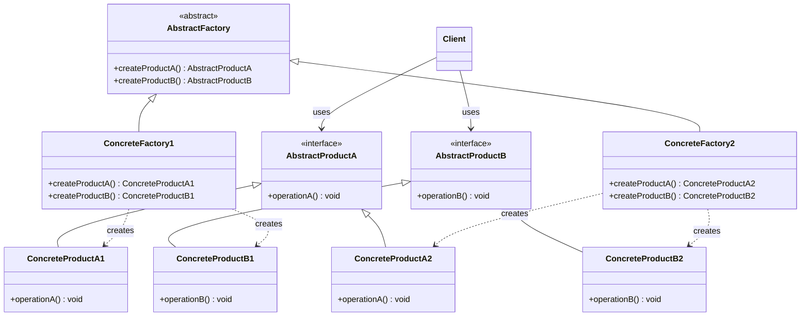
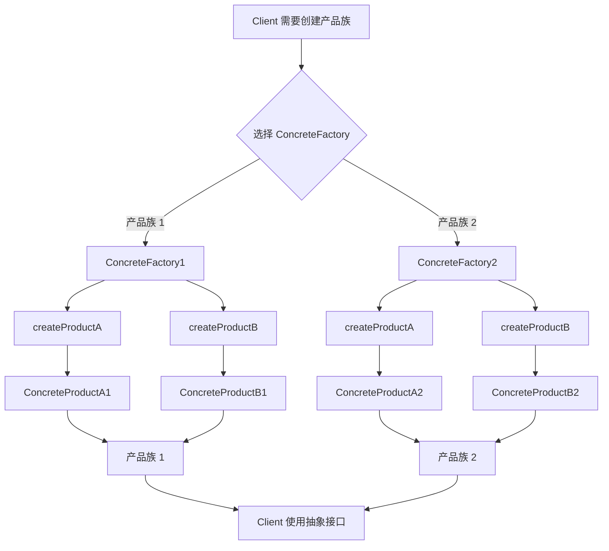

# 抽象工厂模式

> 提供一个创建一系列相关或相互依赖对象的接口，而无需指定它们具体的类。——GoF

---

## 1. 定义与意图

抽象工厂模式（Abstract Factory Pattern）是一种创建型设计模式，它围绕一个超级工厂构建其他工厂。该超级工厂又称为工厂的工厂，其核心意图在于：当系统需要独立于其产品的创建、组合和表示方式时，提供一个统一的抽象层来管理一系列相关产品的创建。

### 开放封闭原则在抽象工厂中的体现

抽象工厂模式对开放封闭原则（OCP）的体现具有明显的**不对称性**，这是理解该模式的关键：

**新增产品族 -- 容易（符合OCP）**

当需要支持一组新的产品族时，只需新增一个 ConcreteFactory 类及其对应的具体产品类，无需修改已有的抽象工厂接口和任何已有代码。例如，已有 Windows 和 Mac 两个产品族，现在要新增 Linux 产品族，只需添加 LinuxFactory、LinuxButton、LinuxCheckbox，对现有代码零侵入。

**新增产品类型 -- 困难（违反OCP）**

当需要新增一种产品维度时，必须修改 AbstractFactory 接口，添加新的工厂方法签名。这意味着所有已有的 ConcreteFactory 都必须实现这个新方法，对已有代码造成了大规模的修改。例如，已有 Button 和 Checkbox 两种产品，现在要新增 TextInput，则 AbstractFactory 必须新增 createTextInput 方法，所有已有工厂类都要同步修改。

这种不对称性并非设计缺陷，而是有意为之的权衡：抽象工厂模式假定产品族的结构在系统设计阶段已经稳定，而产品族的扩展是频繁的。如果产品类型频繁变化，应当考虑使用工厂方法模式或其他更灵活的创建型模式。

```
┌─────────────────────────────────────────────────────────────┐
│              抽象工厂与开放封闭原则                          │
├─────────────────────────────────────────────────────────────┤
│                                                             │
│  扩展方向            操作                OCP符合性           │
│  ─────────          ─────              ───────────          │
│                                                             │
│  新增产品族          新增 ConcreteFactory    符合 OCP       │
│  (Windows/Mac/Linux) 无需修改已有代码                       │
│                                                             │
│  新增产品类型        修改 AbstractFactory    违反 OCP       │
│  (Button/Checkbox/   所有 ConcreteFactory                   │
│   TextInput)         必须同步修改                            │
│                                                             │
└─────────────────────────────────────────────────────────────┘
```

---

## 2. UML类图



---

## 3. 核心角色与职责

| 角色 | 职责 |
|------|------|
| AbstractFactory | 声明创建抽象产品对象的操作接口，包含一组工厂方法，每个方法对应一种产品类型 |
| ConcreteFactory | 实现抽象工厂接口，创建具体的产品对象，每个具体工厂对应一个产品族 |
| AbstractProduct | 声明产品的接口，定义该类产品的行为契约 |
| ConcreteProduct | 定义具体产品，实现对应的抽象产品接口，由对应的具体工厂创建 |
| Client | 仅使用抽象工厂和抽象产品接口，与具体类完全解耦 |

### 角色关系说明

```
┌─────────────────────────────────────────────────────────────┐
│                    角色协作关系                              │
├─────────────────────────────────────────────────────────────┤
│                                                             │
│  Client ──────────▶ AbstractFactory                        │
│    │                     │                                  │
│    │  持有抽象工厂       │  声明创建方法                     │
│    │  引用               │                                  │
│    │                     ▼                                  │
│    │              ConcreteFactory1 / ConcreteFactory2       │
│    │                     │                                  │
│    │                     │  实例化                           │
│    │                     ▼                                  │
│    └─────────────▶ AbstractProductA / AbstractProductB     │
│                          │                                  │
│                          ▼                                  │
│                   ConcreteProductA1/A2/B1/B2               │
│                                                             │
│  核心约束：                                                  │
│  1. Client 从不直接创建具体产品                              │
│  2. Client 从不引用具体工厂或具体产品类                      │
│  3. 同一 ConcreteFactory 创建的产品属于同一产品族            │
│  4. 产品族内的产品之间可以安全协作                           │
│                                                             │
└─────────────────────────────────────────────────────────────┘
```

---

## 4. 应用场景

### 4.1 通用场景

#### 跨平台UI组件

抽象工厂最经典的应用场景。不同操作系统或平台有各自的UI风格规范，同一应用在不同平台上需要渲染风格一致的组件族。

#### 多主题系统

不同主题下，组件的颜色、圆角、阴影等视觉属性不同，但行为一致。抽象工厂保证同一主题下所有组件风格统一。

### 4.2 前端框架实战

#### React Native + Web 跨平台

一套业务代码，不同平台渲染不同组件。抽象工厂封装平台差异，业务层只操作抽象接口。

#### Ant Design 主题定制

不同主题（默认/暗色/紧凑）产生不同风格的组件，抽象工厂确保同一主题下所有组件风格一致。

#### 微前端框架

不同子应用使用不同的组件工厂，保证各子应用的组件风格隔离，同时主框架通过统一抽象接口管理所有子应用。

---

## 5. Mermaid流程图



流程说明：

1. Client 根据配置或运行时条件选择对应的 ConcreteFactory。
2. ConcreteFactory 实现抽象工厂接口，创建属于同一产品族的具体产品。
3. 具体产品实现抽象产品接口，Client 仅通过抽象接口使用产品，不感知具体类型。
4. 产品族一致性由 ConcreteFactory 保证：同一工厂创建的所有产品属于同一产品族，可以安全协作。

---

## 6. 优缺点分析

| 优点 | 缺点 |
|------|------|
| **产品族一致性**：同一工厂创建的产品保证属于同一族，避免混用不兼容产品 | **新增产品类型困难**：新增产品维度需修改抽象工厂接口和所有具体工厂 |
| **符合OCP（产品族维度）**：新增产品族只需添加新的具体工厂，无需修改已有代码 | **类爆炸**：每增加一个产品族，需增加 N 个产品类（N 为产品类型数） |
| **解耦客户端与具体类**：客户端只依赖抽象接口，不依赖具体实现 | **复杂度高**：引入大量抽象层和工厂类，增加系统理解成本 |
| **切换产品族容易**：只需替换工厂实例即可切换整组产品 | **过度设计风险**：产品维度单一或产品族极少时，使用抽象工厂属于过度设计 |
| **统一管理创建逻辑**：所有产品的创建逻辑集中在工厂中 | **运行时类型信息丢失**：客户端只持有抽象接口，有时需要向下转型 |

### 适用性判断

```
┌─────────────────────────────────────────────────────────────┐
│              何时使用抽象工厂模式？                          │
├─────────────────────────────────────────────────────────────┤
│                                                             │
│  1. 系统需要独立于产品的创建、组合和表示？                   │
│     └─ 是 → 继续                                           │
│                                                             │
│  2. 系统需要配置多个产品族中的一个？                         │
│     └─ 是 → 继续                                           │
│                                                             │
│  3. 需要保证产品族内产品的一致性（不能混用）？               │
│     └─ 是 → 继续                                           │
│                                                             │
│  4. 产品族结构稳定，但产品族数量可能增长？                   │
│     └─ 是 → 适合抽象工厂                                   │
│                                                             │
│  不适合的场景：                                              │
│  - 只有一种产品类型（用工厂方法即可）                       │
│  - 产品类型频繁变化（抽象工厂维护成本高）                   │
│  - 不需要保证产品族一致性（简单工厂或工厂方法更合适）       │
│                                                             │
└─────────────────────────────────────────────────────────────┘
```

---

## 7. 相关模式对比

| 对比维度 | 工厂方法 | 抽象工厂 |
|----------|---------|---------|
| **产品维度** | 一种产品，一个工厂方法创建一种产品 | 产品族，一个工厂创建多种相关产品 |
| **工厂结构** | 继承体系，子类覆盖工厂方法 | 组合关系，客户端持有抽象工厂引用 |
| **扩展方向** | 新增产品类型容易，新增产品族需修改 | 新增产品族容易，新增产品类型需修改 |
| **产品数量** | 每个具体工厂只创建一种产品 | 每个具体工厂创建一组产品 |
| **抽象层级** | 工厂方法是抽象工厂的基础构件 | 抽象工厂通常用工厂方法实现 |
| **典型场景** | 框架扩展点、插件系统 | 跨平台UI、多主题、数据库适配器 |

### 模式关系详解

```
┌─────────────────────────────────────────────────────────────┐
│                  抽象工厂与其他模式的关系                     │
├─────────────────────────────────────────────────────────────┤
│                                                             │
│  抽象工厂 + 工厂方法                                        │
│  ─────────────────                                          │
│  抽象工厂接口中的每个方法本质上就是一个工厂方法。            │
│  抽象工厂是工厂方法的组合与升华。                            │
│                                                             │
│  抽象工厂 + 单例                                            │
│  ───────────────                                            │
│  具体工厂通常只需要一个实例，可设计为单例。                  │
│  因为工厂本身无状态，创建逻辑固定。                          │
│                                                             │
│  抽象工厂 + 原型                                            │
│  ───────────────                                            │
│  当产品族中产品种类极多时，可用原型模式克隆产品，            │
│  避免为每个产品类型编写工厂方法。                            │
│                                                             │
│  抽象工厂 + 建造者                                          │
│  ────────────────                                           │
│  当具体产品构造复杂时，工厂内部可委托建造者构建产品。        │
│  工厂负责"创建什么"，建造者负责"如何创建"。               │
│                                                             │
└─────────────────────────────────────────────────────────────┘
```

---

## 8. 总结

抽象工厂模式是创建型模式中处理产品族问题的核心方案。其价值在于：

1. **保证产品族一致性**：同一工厂创建的产品天然属于同一族，客户端不会意外混用不兼容的产品。这是抽象工厂最核心的价值主张。

2. **解耦客户端与具体实现**：客户端只依赖抽象工厂和抽象产品接口，具体的产品创建细节完全封装在具体工厂内部。这使得产品实现可以独立变化，不影响客户端代码。

3. **符合开放封闭原则（产品族维度）**：新增产品族只需添加新的具体工厂，对已有代码零侵入。但需注意，新增产品类型时需要修改抽象工厂接口，这是该模式固有的局限性。

4. **TypeScript 的类型系统天然适配**：泛型抽象工厂、条件类型、映射类型等高级特性可以在编译期保证产品族的类型安全，将运行时错误前移为编译时错误。

使用时的关键决策点：

- 产品族结构是否稳定？如果不稳定，抽象工厂的维护成本会很高。
- 是否确实需要保证产品族一致性？如果产品之间不存在协作约束，可能不需要抽象工厂。
- 产品维度和产品族数量是否足够多？如果只有单一产品维度，工厂方法更简洁。

在实际前端开发中，抽象工厂模式常见于跨平台组件库、多主题系统、微前端架构等场景。理解其"新增产品族容易、新增产品类型困难"的不对称性，是正确应用该模式的前提。

---

> 抽象工厂的核心价值在于保证产品族一致性，而非简单的对象创建。当系统中存在多组相关产品且需要保证同族产品配合使用时，抽象工厂是最合适的选择。但务必评估产品族结构的稳定性，避免在产品类型频繁变化的场景中引入沉重的修改负担。

---

## TypeScript 实现

### 基础实现

跨平台UI组件库：Button + Checkbox 两个产品维度，Windows / Mac 两个产品族。

```typescript
// ============================================================
// 抽象产品：Button
// ============================================================
interface IButton {
  readonly platform: string;
  render(): string;
  onClick(handler: () => void): void;
}

// ============================================================
// 抽象产品：Checkbox
// ============================================================
interface ICheckbox {
  readonly platform: string;
  render(): string;
  toggle(): void;
}

// ============================================================
// 抽象工厂
// ============================================================
interface IUIFactory {
  createButton(): IButton;
  createCheckbox(): ICheckbox;
}

// ============================================================
// 产品族 1：Windows
// ============================================================
class WindowsButton implements IButton {
  readonly platform = 'Windows';
  render(): string { return '[Windows] Rendering button with native style'; }
  onClick(handler: () => void): void { /* 绑定点击 */ }
}
class WindowsCheckbox implements ICheckbox {
  readonly platform = 'Windows';
  render(): string { return '[Windows] Rendering checkbox with native style'; }
  toggle(): void { /* 切换 */ }
}

// ============================================================
// 产品族 2：macOS
// ============================================================
class MacButton implements IButton {
  readonly platform = 'macOS';
  render(): string { return '[macOS] Rendering button with Cocoa native style'; }
  onClick(handler: () => void): void { /* 绑定点击 */ }
}
class MacCheckbox implements ICheckbox {
  readonly platform = 'macOS';
  render(): string { return '[macOS] Rendering checkbox with Cocoa native style'; }
  toggle(): void { /* 切换 */ }
}

// ============================================================
// 具体工厂
// ============================================================
class WindowsFactory implements IUIFactory {
  createButton(): IButton { return new WindowsButton(); }
  createCheckbox(): ICheckbox { return new WindowsCheckbox(); }
}
class MacFactory implements IUIFactory {
  createButton(): IButton { return new MacButton(); }
  createCheckbox(): ICheckbox { return new MacCheckbox(); }
}

// ============================================================
// 工厂选择器
// ============================================================
function createUIFactory(platform: 'Windows' | 'macOS'): IUIFactory {
  return platform === 'Windows' ? new WindowsFactory() : new MacFactory();
}

// ============================================================
// 客户端
// ============================================================
class Application {
  private button!: IButton;
  private checkbox!: ICheckbox;
  constructor(private factory: IUIFactory) {}

  wireEvents(): void {
    this.button = this.factory.createButton();
    this.checkbox = this.factory.createCheckbox();
  }
  renderUI(): string[] {
    return [this.button.render(), this.checkbox.render()];
  }
}

// ============================================================
// 使用
// ============================================================
const platform: 'Windows' | 'macOS' = 'macOS';
const factory = createUIFactory(platform);
const app = new Application(factory);
app.wireEvents();
const rendered = app.renderUI();
// [ '[macOS] Rendering button with Cocoa native style',
//   '[macOS] Rendering checkbox with Cocoa native style' ]
```

### 现代TypeScript实现

利用泛型、条件类型和映射类型，实现类型安全的抽象工厂，在编译期即可保证产品族的正确性。

```typescript
// ============================================================
// 品牌类型定义
// ============================================================
type Brand = 'Windows' | 'Mac' | 'Linux';

// ============================================================
// 产品类型标记（用于条件类型分发）
// ============================================================
interface ProductBrand<B extends Brand> {
  readonly __brand: B;
}

// 品牌化产品接口
interface IBrandButton<B extends Brand> extends ProductBrand<B> {
  render(): string;
}
interface IBrandCheckbox<B extends Brand> extends ProductBrand<B> {
  render(): string;
}

// ============================================================
// 具体产品
// ============================================================
class WindowsBrandButton implements IBrandButton<'Windows'> {
  readonly __brand = 'Windows' as const;
  render(): string { return '[Windows] Button'; }
}
class WindowsBrandCheckbox implements IBrandCheckbox<'Windows'> {
  readonly __brand = 'Windows' as const;
  render(): string { return '[Windows] Checkbox'; }
}
class MacBrandButton implements IBrandButton<'Mac'> {
  readonly __brand = 'Mac' as const;
  render(): string { return '[Mac] Button'; }
}
class MacBrandCheckbox implements IBrandCheckbox<'Mac'> {
  readonly __brand = 'Mac' as const;
  render(): string { return '[Mac] Checkbox'; }
}

// ============================================================
// 产品集合
// ============================================================
interface UIComponentSet<B extends Brand> {
  button: IBrandButton<B>;
  checkbox: IBrandCheckbox<B>;
}

// ============================================================
// 抽象工厂
// ============================================================
interface IUIBrandFactory<B extends Brand> {
  createUIComponentSet(): UIComponentSet<B>;
}

class WindowsBrandFactory implements IUIBrandFactory<'Windows'> {
  createUIComponentSet(): UIComponentSet<'Windows'> {
    return { button: new WindowsBrandButton(), checkbox: new WindowsBrandCheckbox() };
  }
}
class MacBrandFactory implements IUIBrandFactory<'Mac'> {
  createUIComponentSet(): UIComponentSet<'Mac'> {
    return { button: new MacBrandButton(), checkbox: new MacBrandCheckbox() };
  }
}

// ============================================================
// 注册表
// ============================================================
const UIFactoryRegistry = {
  // Linux 产品族暂未定义，注册表中先以 Windows 工厂占位
  factories: { Windows: new WindowsBrandFactory(), Mac: new MacBrandFactory(), Linux: new WindowsBrandFactory() } as Record<Brand, IUIBrandFactory<any>>,
  getFactory<B extends Brand>(brand: B): IUIBrandFactory<B> {
    return this.factories[brand] as IUIBrandFactory<B>;
  },
};

// ============================================================
// 类型推断：factory 的类型为 MacBrandFactory
const factory = UIFactoryRegistry.getFactory('Mac');
const uiSet = factory.createUIComponentSet();
// uiSet.button.__brand === 'Mac'  -- 编译期即可确认
// uiSet.checkbox.__brand === 'Mac'
```

#### 映射类型自动生成工厂方法签名

```typescript
// ============================================================
// 通过映射类型从产品接口自动推导工厂接口
// ============================================================

// 产品接口集合
interface ProductInterfaces<B extends Brand> {
  button: IBrandButton<B>;
  checkbox: IBrandCheckbox<B>;
}

// 映射类型：将产品接口集合转换为工厂方法集合
type FactoryMethods<B extends Brand> = {
  [K in keyof ProductInterfaces<B>]: () => ProductInterfaces<B>[K];
};

// 动态工厂：由工厂方法映射驱动，无需为每个品牌手写工厂类
class DynamicUIFactory<B extends Brand> implements IUIBrandFactory<B> {
  constructor(
    private readonly brand: B,
    private readonly methods: FactoryMethods<B>
  ) {}

  createUIComponentSet(): UIComponentSet<B> {
    return {
      button: this.methods.button(),
      checkbox: this.methods.checkbox(),
    };
  }
}

// 动态创建工厂
const dynamicMacFactory = new DynamicUIFactory('Mac', {
  button: () => new MacBrandButton(),
  checkbox: () => new MacBrandCheckbox(),
});
```

---

```typescript
interface IPlatformComponentFactory {
  createButton(): IPlatformButton;
  createInput(): IPlatformInput;
  createDialog(): IPlatformDialog;
}

interface IPlatformButton {
  render(): HTMLElement;
  setLabel(text: string): void;
}

interface IPlatformInput {
  render(): HTMLElement;
  setPlaceholder(text: string): void;
}

interface IPlatformDialog {
  render(): HTMLElement;
  show(): void;
}

class MobileDialog implements IPlatformDialog {
  private el: HTMLElement | null = null;
  render(): HTMLElement {
    if (!this.el) {
      this.el = document.createElement('div');
      this.el.className = 'mobile-dialog';
    }
    return this.el;
  }
  show(): void { /* 弹出对话框 */ }
}

// 具体工厂：移动端
class MobileComponentFactory implements IPlatformComponentFactory {
  createButton(): IPlatformButton {
    const btn = document.createElement('button');
    return { render: () => btn, setLabel: (t) => { btn.textContent = t; } };
  }
  createInput(): IPlatformInput {
    const input = document.createElement('input');
    return { render: () => input, setPlaceholder: (t) => { input.placeholder = t; } };
  }

  createDialog(): IPlatformDialog {
    return new MobileDialog();
  }
}
```

```typescript
// 主题令牌
interface IThemeTokens {
  primaryColor: string;
  backgroundColor: string;
  textColor: string;
  borderRadius: string;
  shadow: string;
  fontSize: {
    sm: string;
    md: string;
    lg: string;
  };
}

// 主题工厂：抽象工厂的一种变体
interface IThemeFactory {
  createTokens(): IThemeTokens;
  createComponent(): IThemedComponent;
}

interface IThemedComponent {
  render(): string;
}

// 亮色主题工厂
class LightThemeFactory implements IThemeFactory {
  createTokens(): IThemeTokens {
    return { primaryColor: '#1976d2', backgroundColor: '#fff', textColor: '#212121', borderRadius: '4px', shadow: '0 1px 3px rgba(0,0,0,0.2)', fontSize: { sm: '12px', md: '14px', lg: '18px' } };
  }
  createComponent(): IThemedComponent {
    return { render: () => '<div class="light-card">Light</div>' };
  }
}

// 暗色主题工厂
class DarkThemeFactory implements IThemeFactory {
  createTokens(): IThemeTokens {
    return { primaryColor: '#90caf9', backgroundColor: '#121212', textColor: '#e0e0e0', borderRadius: '4px', shadow: '0 1px 3px rgba(255,255,255,0.1)', fontSize: { sm: '12px', md: '14px', lg: '18px' } };
  }
  createComponent(): IThemedComponent {
    return { render: () => '<div class="dark-card">Dark</div>' };
  }
}

// 主题注册表
const factories: Record<string, () => IThemeFactory> = {
  light: () => new LightThemeFactory(),
  dark: () => new DarkThemeFactory(),
};

function getThemeFactory(theme: string): IThemeFactory {
  const creator = factories[theme];
  if (!creator) {
    throw new Error(`Unknown theme: ${theme}`);
  }
  return creator();
}
```

```typescript
import type React from 'react';
// NativeButton/FlatList/NativeText/NativeImage 在真实项目中从 'react-native' 包导入
import { Button as NativeButton, FlatList, Text as NativeText, Image as NativeImage } from 'react-native';

// ============================================================
// 抽象产品：跨平台组件接口
// ============================================================
interface ICrossPlatformButton {
  render(onPress: () => void, label: string): React.ReactNode;
}

interface ICrossPlatformList {
  render(items: Array<{ id: string; title: string }>): React.ReactNode;
}

interface ICrossPlatformImage {
  render(src: string): React.ReactNode;
}

interface ICrossPlatformFactory {
  createButton(): ICrossPlatformButton;
  createList(): ICrossPlatformList;
  createImage(): ICrossPlatformImage;
}

// Web 平台工厂
class WebFactory implements ICrossPlatformFactory {
  createButton(): ICrossPlatformButton {
    return { render: (onPress, label) => <button onClick={onPress}>{label}</button> };
  }
  createList(): ICrossPlatformList {
    return { render: (items) => <ul>{items.map((i) => <li key={i.id}>{i.title}</li>)}</ul> };
  }
  createImage(): ICrossPlatformImage {
    return { render: (src) =>  };
  }
}

// Native 平台工厂
class NativeFactory implements ICrossPlatformFactory {
  createButton(): ICrossPlatformButton {
    return { render: (onPress, label) => <NativeButton onPress={onPress} title={label} /> };
  }
  createList(): ICrossPlatformList {
    return { render: (items) => <FlatList data={items} renderItem={({ item }) => <NativeText>{item.title}</NativeText>} /> };
  }
  createImage(): ICrossPlatformImage {
    return { render: (src) => <NativeImage source={{ uri: src }} /> };
  }
}

// 平台工厂选择
function getPlatformFactory(platform: 'web' | 'native'): ICrossPlatformFactory {
  return platform === 'web' ? new WebFactory() : new NativeFactory();
}

// 使用
function SettingsScreen() {
  const factory = getPlatformFactory('web');
  const button = factory.createButton();
  const list = factory.createList();
  const image = factory.createImage();
  const items = [
    { id: '1', title: 'Settings' },
    { id: '2', title: 'About' },
  ];

  return { button, list, image, items } as unknown as React.ReactNode;
}
```

```typescript
import type React from 'react';

// ============================================================
// Ant Design 主题令牌
// ============================================================
interface IAntDesignTokens {
  colorPrimary: string;
  colorBgContainer: string;
  colorText: string;
  borderRadius: number;
  controlHeight: number;
  fontSize: number;
}

interface IAntDesignFactory {
  createTokens(): IAntDesignTokens;
  createButton(): { render(): React.ReactNode };
}

// 默认主题工厂
class AntdDefaultFactory implements IAntDesignFactory {
  createTokens(): IAntDesignTokens {
    return { colorPrimary: '#1677ff', colorBgContainer: '#ffffff', colorText: 'rgba(0,0,0,0.88)', borderRadius: 6, controlHeight: 32, fontSize: 14 };
  }
  createButton() { return { render: () => <button className="ant-btn-default">默认按钮</button> }; }
}

// 暗色主题工厂
class AntdDarkFactory implements IAntDesignFactory {
  createTokens(): IAntDesignTokens {
    return { colorPrimary: '#1668dc', colorBgContainer: '#141414', colorText: 'rgba(255,255,255,0.85)', borderRadius: 6, controlHeight: 32, fontSize: 14 };
  }
  createButton() { return { render: () => <button className="ant-btn-dark">暗色按钮</button> }; }
}

// 紧凑主题工厂
class AntdCompactFactory implements IAntDesignFactory {
  createTokens(): IAntDesignTokens {
    return { colorPrimary: '#1677ff', colorBgContainer: '#ffffff', colorText: 'rgba(0,0,0,0.88)', borderRadius: 2, controlHeight: 24, fontSize: 12 };
  }
  createButton() { return { render: () => <button className="ant-btn-compact">紧凑按钮</button> }; }
}

// 主题工厂选择
function createAntdFactory(theme: string): IAntDesignFactory {
  const map: Record<string, () => IAntDesignFactory> = {
    default: () => new AntdDefaultFactory(),
    dark: () => new AntdDarkFactory(),
    compact: () => new AntdCompactFactory(),
  };
  const creator = map[theme];
  if (!creator) {
    throw new Error(`Unknown theme: ${theme}`);
  }
  return creator();
}
```

```typescript
// ============================================================
// 微前端组件抽象
// ============================================================
interface IMicroAppButton {
  mount(container: HTMLElement): void;
  unmount(): void;
}

interface IMicroAppModal {
  mount(container: HTMLElement): void;
  unmount(): void;
}

interface IMicroAppFactory {
  createButton(): IMicroAppButton;
  createModal(): IMicroAppModal;
}

// 子应用 A 的工厂
class AppAFactory implements IMicroAppFactory {
  createButton(): IMicroAppButton {
    return { mount: (c) => { c.innerHTML = '<button class="app-a-btn">App A</button>'; }, unmount: () => {} };
  }
  createModal(): IMicroAppModal {
    return { mount: (c) => { c.innerHTML = '<div class="app-a-modal">A Modal</div>'; }, unmount: () => {} };
  }
}

// 子应用 B 的工厂
class AppBFactory implements IMicroAppFactory {
  createButton(): IMicroAppButton {
    return { mount: (c) => { c.innerHTML = '<button class="app-b-btn">App B</button>'; }, unmount: () => {} };
  }
  createModal(): IMicroAppModal {
    return { mount: (c) => { c.innerHTML = '<div class="app-b-modal">B Modal</div>'; }, unmount: () => {} };
  }
}

// 主框架：注册并管理各子应用工厂
class MicroFrontendHost {
  private factories = new Map<string, IMicroAppFactory>();
  registerApp(name: string, factory: IMicroAppFactory): void {
    this.factories.set(name, factory);
  }
  getFactory(name: string): IMicroAppFactory {
    const factory = this.factories.get(name);
    if (!factory) throw new Error(`未注册的子应用: ${name}`);
    return factory;
  }
}

const host = new MicroFrontendHost();
host.registerApp('dashboard', new AppAFactory());
host.registerApp('settings', new AppBFactory());

// 使用
const dashboardFactory = host.getFactory('dashboard');
const dashboardBtn = dashboardFactory.createButton();
dashboardBtn.mount(document.body);
```

```typescript
// 抽象工厂与工厂方法的关系示例

// 工厂方法：每个方法只创建一种产品
interface IDocumentFactory {
  createDocument(): IDocument; // 这就是一个工厂方法
}

// 抽象工厂：组合多个工厂方法
interface IOfficeSuiteFactory {
  createDocument(): IDocument;   // 工厂方法 1
  createSpreadsheet(): ISpreadsheet; // 工厂方法 2
  createPresentation(): IPresentation; // 工厂方法 3
}

interface IDocument { open(): void; }
interface ISpreadsheet { calculate(): void; }
interface IPresentation { start(): void; }

// 具体工厂：实现一组工厂方法，构成完整产品族
class MicrosoftOfficeFactory implements IOfficeSuiteFactory {
  createDocument(): IDocument { return { open: () => console.log('打开 Word 文档') }; }
  createSpreadsheet(): ISpreadsheet { return { calculate: () => console.log('Excel 计算') }; }
  createPresentation(): IPresentation { return { start: () => console.log('启动 PPT 演示') }; }
}

// 对比：仅创建单一产品的工厂（工厂方法）
interface ICheckbox {
  render(): string;
}
class WindowsCheckbox implements ICheckbox {
  render(): string { return '[Windows] Checkbox'; }
}
interface ICheckboxFactory {
  createCheckbox(): ICheckbox; // 只有一个工厂方法
}
class WindowsUIElementFactory implements ICheckboxFactory {
  createCheckbox(): ICheckbox {
    return new WindowsCheckbox();
  }
}
```

---

## Java 实现

### 抽象工厂（产品族）

```java
// 抽象产品：按钮
interface Button {
    void render();
}

// 抽象产品：文本框
interface TextBox {
    void render();
}

// 具体产品：暗色主题
class DarkButton implements Button {
    public void render() { System.out.println("暗色按钮"); }
}
class DarkTextBox implements TextBox {
    public void render() { System.out.println("暗色文本框"); }
}

// 具体产品：亮色主题
class LightButton implements Button {
    public void render() { System.out.println("亮色按钮"); }
}
class LightTextBox implements TextBox {
    public void render() { System.out.println("亮色文本框"); }
}

// 抽象工厂：创建一族相关产品
interface UIFactory {
    Button createButton();
    TextBox createTextBox();
}

// 具体工厂：暗色主题一族
class DarkFactory implements UIFactory {
    public Button createButton() { return new DarkButton(); }
    public TextBox createTextBox() { return new DarkTextBox(); }
}

// 具体工厂：亮色主题一族
class LightFactory implements UIFactory {
    public Button createButton() { return new LightButton(); }
    public TextBox createTextBox() { return new LightTextBox(); }
}

// 客户端只依赖抽象工厂，切换主题只需换工厂
public class Client {
    public static void main(String[] args) {
        UIFactory factory = new DarkFactory();
        Button btn = factory.createButton();
        TextBox tb = factory.createTextBox();
        btn.render();
        tb.render();
    }
}
```

> 抽象工厂确保一个族内的产品相互配套（暗色按钮配暗色文本框），解决"产品族一致性"问题；缺点是不易扩展新产品类型（需改所有工厂接口）。

## Python 实现

### 抽象工厂（产品族）

```python
from abc import ABC, abstractmethod

class Button(ABC):
    @abstractmethod
    def render(self):
        pass

class TextBox(ABC):
    @abstractmethod
    def render(self):
        pass

class DarkButton(Button):
    def render(self):
        print("暗色按钮")

class DarkTextBox(TextBox):
    def render(self):
        print("暗色文本框")

class LightButton(Button):
    def render(self):
        print("亮色按钮")

class LightTextBox(TextBox):
    def render(self):
        print("亮色文本框")

class UIFactory(ABC):
    @abstractmethod
    def create_button(self) -> Button:
        pass

    @abstractmethod
    def create_textbox(self) -> TextBox:
        pass

class DarkFactory(UIFactory):
    def create_button(self) -> Button:
        return DarkButton()

    def create_textbox(self) -> TextBox:
        return DarkTextBox()

class LightFactory(UIFactory):
    def create_button(self) -> Button:
        return LightButton()

    def create_textbox(self) -> TextBox:
        return LightTextBox()

# 客户端：切换主题只需换工厂实例
factory = DarkFactory()
btn = factory.create_button()
tb = factory.create_textbox()
btn.render()
tb.render()
```

> Python 用 `abc.ABC` + `@abstractmethod` 定义抽象工厂与抽象产品。抽象工厂适合需要保证"产品族一致性"的场景。

