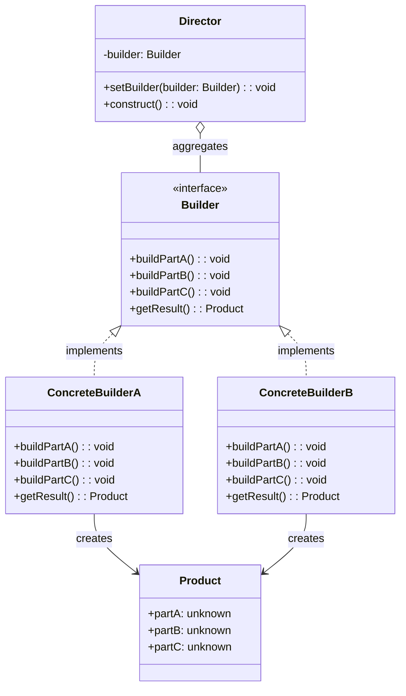
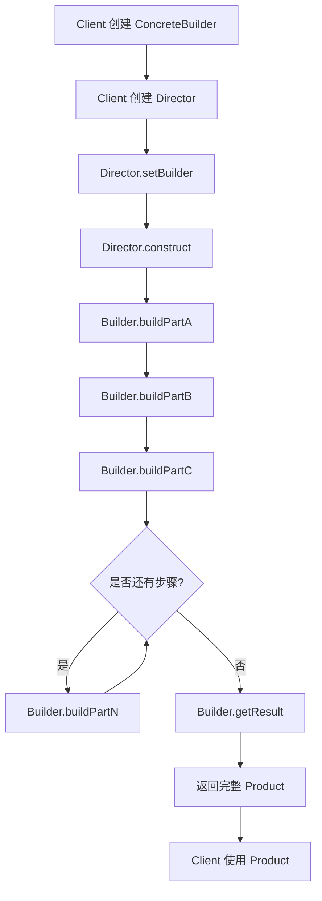

# 建造者模式

> 将一个复杂对象的构建与它的表示分离，使得同样的构建过程可以创建不同的表示。——GoF

---

## 1. 定义与意图

建造者模式（Builder Pattern）是一种创建型设计模式，它将复杂对象的构建过程与最终表示解耦。客户端无需了解对象内部的组成细节，只需通过统一的构建步骤即可获得完整的产品实例。同一个 Director 指挥流程，搭配不同的 ConcreteBuilder，可以产出结构相同但细节各异的产品。

核心解决的问题：

- 构造函数参数过多，调用时难以记忆参数顺序与含义
- 可选参数组合复杂，需要大量重载或条件判断
- 对象需要分步构建，且构建过程需要稳定顺序
- 同一构建流程需要产出不同表示形式的产品

```
┌─────────────────────────────────────────────────────────────┐
│                   建造者模式核心思想                        │
├─────────────────────────────────────────────────────────────┤
│                                                             │
│   传统构造方式                    建造者模式                │
│   ─────────────                  ─────────────              │
│                                                             │
│   new Request(                   new RequestBuilder()       │
│     'POST',                        .setMethod('POST')       │
│     '/api/users',                  .setUrl('/api/users')    │
│     { 'Content-Type': 'json' },    .setHeaders({...})       │
│     { name: 'test' },              .setBody({...})          │
│     5000,                          .setTimeout(5000)        │
│     true                           .build()                 │
│   )                                                         │
│                                                             │
│   参数顺序难记忆                  链式调用，语义清晰        │
│   可选参数需传null                只设置需要的属性          │
│   构建逻辑与表示耦合              构建与表示分离            │
│                                                             │
└─────────────────────────────────────────────────────────────┘
```

---

## 2. UML类图



---

## 3. 核心角色与职责

| 角色 | 职责 |
|------|------|
| Director | 安排构建顺序，调用 Builder 的各步骤方法，隔离客户端与构建细节 |
| Builder | 定义构建步骤的抽象接口，声明 buildPartA/B/C 和 getResult 方法 |
| ConcreteBuilder | 实现具体构建步骤，组装产品内部表示，提供获取最终产品的方法 |
| Product | 被构建的复杂对象，包含多个组成部分，由 ConcreteBuilder 逐步装配 |

```
┌─────────────────────────────────────────────────────────────┐
│                     角色协作流程                            │
├─────────────────────────────────────────────────────────────┤
│                                                             │
│   Client                                                    │
│     │                                                       │
│     │ 1. 创建 ConcreteBuilder                               │
│     │ 2. 传给 Director                                      │
│     │ 3. Director.construct()                               │
│     │       │                                               │
│     │       ├─ builder.buildPartA()                         │
│     │       ├─ builder.buildPartB()                         │
│     │       └─ builder.buildPartC()                         │
│     │                                                       │
│     │ 4. builder.getResult() → Product                      │
│     │                                                       │
│     ▼                                                       │
│   获得完整产品                                              │
│                                                             │
└─────────────────────────────────────────────────────────────┘
```

---

## 4. 应用场景

### 4.1 通用场景

#### SQL 查询构建器

#### 配置对象构建

### 4.2 前端框架实战

#### Vue 表单构建器

#### React 组件配置构建器

#### Axios 请求构建器

---

## 5. Mermaid流程图



---

## 6. 优缺点分析

| 优点 | 缺点 |
|------|------|
| 分步构建复杂对象，避免构造函数参数爆炸 | 类数量增加，每个产品需要对应的 Builder |
| 链式调用可读性好，语义清晰 | 简单对象使用建造者属于过度设计 |
| 构建逻辑与表示分离，同一流程可产出不同产品 | Builder 需了解 Product 内部结构，违反最少知识原则 |
| 可精细控制构建过程，支持条件构建和延迟构建 | 增加系统抽象性和理解难度 |
| 产品本身与建造者解耦，可复用已有建造者 | Director 和 Builder 的职责边界有时模糊 |
| 支持不可变对象的创建，build() 返回冻结对象 | 构建步骤固定后不易动态调整顺序 |

---

## 7. 相关模式对比

| 对比维度 | 建造者 | 工厂方法 | 抽象工厂 | 原型 |
|----------|-------|---------|---------|------|
| 关注点 | 构建过程与步骤 | 创建哪个对象 | 创建产品家族 | 克隆已有对象 |
| 对象复杂度 | 复杂对象，多部件 | 简单到中等 | 产品族，多关联 | 任意复杂度 |
| 返回时机 | 分步构建后返回 | 一步创建返回 | 一步创建返回 | 一步克隆返回 |
| 构建方式 | 逐步装配 | 直接实例化 | 直接实例化 | 复制已有实例 |
| 是否需要Director | 通常需要 | 不需要 | 不需要 | 不需要 |
| 链式调用 | 天然支持 | 不适用 | 不适用 | 不适用 |
| 典型场景 | SQL构建器、表单构建 | 日志工厂、支付工厂 | 跨平台UI工厂 | 对象缓存与复制 |

建造者与工厂方法的核心区别：

建造者常与组合模式结合使用，构建树形结构：

---

## 8. 总结

建造者模式在前端开发中应用广泛，其核心价值在于将复杂对象的构建过程从客户端代码中剥离，通过链式调用提供清晰的语义化 API。TypeScript 的类型系统为建造者模式带来了额外的安全保障：泛型建造者可以约束产品结构，分步构建通过不同 Builder 类型强制调用顺序，Proxy 可以动态生成链式方法。

关键实践原则：

- 对象构造参数超过 4 个或存在大量可选参数时，考虑引入建造者
- 优先使用链式调用风格，每个方法返回 this
- 对于不可变对象，在 build() 中返回深拷贝或 Object.freeze 的结果
- 当构建流程可复用时，引入 Director 封装标准构建步骤
- 简单对象不要过度设计，直接使用构造函数或对象字面量即可
- 嵌套建造者适合处理树形或层级结构的产品

---

## TypeScript 实现

### 基础实现

以 HTTP 请求构建器为例，演示 method -> url -> headers -> body -> build() 的标准建造者流程。

```typescript
// Product: HTTP 请求对象
interface HttpRequest {
  method: string;
  url: string;
  headers: Record<string, string>;
  body: unknown;
  timeout: number;
}

// Builder 接口
interface HttpRequestBuilder {
  setMethod(method: string): HttpRequestBuilder;
  setUrl(url: string): HttpRequestBuilder;
  setHeaders(headers: Record<string, string>): HttpRequestBuilder;
  setBody(body: unknown): HttpRequestBuilder;
  setTimeout(timeout: number): HttpRequestBuilder;
  build(): HttpRequest;
}

// 具体建造者
class DefaultHttpRequestBuilder implements HttpRequestBuilder {
  private request: HttpRequest = {
    method: 'GET', url: '', headers: {}, body: null, timeout: 0
  };

  setMethod(method: string): HttpRequestBuilder {
    this.request.method = method;
    return this;
  }
  setUrl(url: string): HttpRequestBuilder {
    this.request.url = url;
    return this;
  }
  setHeaders(headers: Record<string, string>): HttpRequestBuilder {
    this.request.headers = { ...this.request.headers, ...headers };
    return this;
  }
  setBody(body: unknown): HttpRequestBuilder {
    this.request.body = body;
    return this;
  }
  setTimeout(timeout: number): HttpRequestBuilder {
    this.request.timeout = timeout;
    return this;
  }
  build(): HttpRequest {
    return { ...this.request };
  }
}

// 使用
const request = new DefaultHttpRequestBuilder()
  .setMethod('PUT')
  .setUrl('/api/users/1')
  .setHeaders({ 'Content-Type': 'application/json', Authorization: 'Bearer xyz' })
  .setBody({ name: 'Bob' })
  .setTimeout(5000)
  .build();
```

### 现代TypeScript实现

#### 泛型建造者：支持链式调用

```typescript
// 泛型建造者基类
class GenericBuilder<T extends object> {
  private product: Partial<T> = {};

  with<K extends keyof T>(key: K, value: T[K]): this {
    this.product[key] = value;
    return this;
  }

  build(): T {
    return this.product as T;
  }
}

// 具名方法扩展：提供类型安全的语义化方法
interface AdminUser {
  email: string;
  isAdmin: boolean;
  theme: string;
  language: string;
  notificationsEnabled: boolean;
}

class UserBuilder extends GenericBuilder<AdminUser> {
  withEmail(email: string): this {
    return this.with('email', email);
  }
  asAdmin(): this {
    return this.with('isAdmin', true);
  }
  withTheme(theme: string): this {
    return this.with('theme', theme);
  }
  withLanguage(language: string): this {
    return this.with('language', language);
  }
  enableNotifications(): this {
    return this.with('notificationsEnabled', true);
  }
}

const user = new UserBuilder()
  .withEmail('admin@example.com')
  .asAdmin()
  .withTheme('dark')
  .withLanguage('zh-CN')
  .enableNotifications()
  .build();
```

#### 类型安全的分步构建

通过让每个构建步骤返回不同的 Builder 类型，在编译期强制调用顺序，确保必要属性必须被设置。

```typescript
// 最终产品
interface CompleteUser {
  id: string;
  name: string;
  email: string;
  age: number;
  address?: string;
}

// 第一步：必须设置 id
class UserBuilderStep1 {
  withId(id: string): UserBuilderStep2 {
    return new UserBuilderStep2(id);
  }
}

// 第二步：必须设置 name 和 email
class UserBuilderStep2 {
  constructor(private id: string) {}
  withName(name: string): UserBuilderStep3 {
    return new UserBuilderStep3(this.id, name);
  }
}

// 第三步：可选属性 + 最终 build
class UserBuilderStep3 {
  constructor(private id: string, private name: string) {}
  withEmail(email: string): this {
    (this as any)._email = email;
    return this;
  }
  withAge(age: number): this {
    (this as any)._age = age;
    return this;
  }
  withAddress(address: string): this {
    (this as any)._address = address;
    return this;
  }
  build(): CompleteUser {
    return {
      id: this.id,
      name: this.name,
      email: (this as any)._email ?? '',
      age: (this as any)._age ?? 0,
      address: (this as any)._address
    };
  }
}

// 合法链式调用
const user1 = new UserBuilderStep1()
  .withId('1')
  .withName('Alice')
  .withEmail('alice@example.com')
  .withAge(30)
  .withAddress('Shanghai')
  .build();

// 以下代码在编译期报错，因为缺少必要步骤
// new UserBuilderStep1().build();             // Error: build 不存在（必须先调用 withId）
// new UserBuilderStep1().withId('1').build(); // Error: build 不存在于 UserBuilderStep2（还缺 name）
```

#### 使用 Proxy 实现动态链式调用

```typescript
// 动态建造者：通过 Proxy 拦截属性访问，自动生成链式方法
class ProxyBuilder<T extends object> {
  private state: Partial<T> = {};

  static create<T extends object>(): ProxyBuilder<T> & {
    [K in keyof T as `with${Capitalize<string & K>}`]: (value: T[K]) => any;
  } & { build: () => T } {
    const builder = new ProxyBuilder<T>();
    // 用变量保存 Proxy 实例，使 with 方法能返回自身实现链式调用
    let proxy: any;
    proxy = new Proxy(builder, {
      get(target: ProxyBuilder<T>, prop: string | symbol) {
        if (prop === 'build') {
          return () => target.state as T;
        }
        if (typeof prop === 'string' && prop.startsWith('with')) {
          return (value: unknown) => {
            const key = prop.slice(4).replace(/^./, (c) => c.toLowerCase());
            target.state[key as keyof T] = value as T[keyof T];
            return proxy; // 返回 Proxy 本身，实现链式
          };
        }
        return Reflect.get(target, prop);
      },
    });
    return proxy;
  }
}

// 使用：数据库连接配置
interface DbConfig {
  host: string;
  database: string;
  username: string;
  password: string;
  ssl: boolean;
  poolSize: number;
}

const dbConfig = ProxyBuilder.create<DbConfig>()
  .withHost('localhost')
  .withDatabase('myapp')
  .withUsername('admin')
  .withPassword('secret')
  .withSsl(true)
  .withPoolSize(10)
  .build();
```

---

```typescript
// SQL 查询产品
interface SqlQuery {
  sql: string;
  params: unknown[];
}

// SQL 建造者
class SqlBuilder {
  private selectFields: string[] = [];
  private tableName: string = '';
  private whereClauses: string[] = [];
  private whereParams: unknown[] = [];
  private joinClauses: string[] = [];
  private orderByClause: string = '';
  private limitClause: number | null = null;
  private offsetClause: number | null = null;

  from(table: string): this {
    this.tableName = table;
    return this;
  }
  select(...fields: string[]): this {
    this.selectFields.push(...fields);
    return this;
  }
  join(table: string, condition: string): this {
    this.joinClauses.push(`JOIN ${table} ON ${condition}`);
    return this;
  }
  where(condition: string, param?: unknown): this {
    this.whereClauses.push(condition);
    if (param !== undefined) this.whereParams.push(param);
    return this;
  }
  orderBy(field: string, direction: 'ASC' | 'DESC' = 'ASC'): this {
    this.orderByClause = `ORDER BY ${field} ${direction}`;
    return this;
  }
  limit(n: number): this { this.limitClause = n; return this; }
  offset(n: number): this { this.offsetClause = n; return this; }

  build(): SqlQuery {
    const select = `SELECT ${this.selectFields.join(', ') || '*'}`;
    const joins = this.joinClauses.join(' ');
    const where = this.whereClauses.length ? `WHERE ${this.whereClauses.join(' AND ')}` : '';
    const order = this.orderByClause;
    const limit = this.limitClause !== null ? `LIMIT ${this.limitClause}` : '';
    const offset = this.offsetClause !== null ? `OFFSET ${this.offsetClause}` : '';
    const sql = [select, `FROM ${this.tableName}`, joins, where, order, limit, offset].filter(Boolean).join(' ');
    return { sql, params: this.whereParams };
  }
}

// 使用
const query = new SqlBuilder()
  .from('users u')
  .select('u.id', 'u.name', 'o.total')
  .join('orders o', 'u.id = o.user_id')
  .where('u.status = ?', 'active')
  .where('o.created_at > ?', '2024-01-01')
  .orderBy('u.name', 'ASC')
  .limit(50)
  .offset(0)
  .build();

// sql: "SELECT u.id, u.name, o.total FROM users u JOIN orders o ON u.id = o.user_id WHERE u.status = ? AND o.created_at > ? ORDER BY u.name ASC LIMIT 50 OFFSET 0"
// params: ['active', '2024-01-01']
```

```typescript
// 应用配置产品
interface AppConfig {
  appName: string;
  version: string;
  env: 'development' | 'staging' | 'production';
  database: {
    host: string;
    port: number;
    name: string;
  };
  cache: {
    enabled: boolean;
    ttlSeconds: number;
    maxSize: number;
  }
}

// 建造者接口：声明各环境的构建方法
interface ConfigBuilder {
  buildDevelopmentConfig(): AppConfig;
  buildStagingConfig(): AppConfig;
  buildProductionConfig(): AppConfig;
}

// 具体建造者
class AppConfigBuilder implements ConfigBuilder {
  private config: Partial<AppConfig> = {};
  private buildFor(env: AppConfig['env']): AppConfig {
    return {
      appName: 'my-app',
      version: '1.0.0',
      env,
      database: env === 'production'
        ? { host: 'prod-db.example.com', port: 5432, name: 'app' }
        : { host: 'localhost', port: 5432, name: 'app_dev' },
      cache: { enabled: true, ttlSeconds: env === 'production' ? 3600 : 60, maxSize: 1024 }
    };
  }
  buildDevelopmentConfig(): AppConfig { return this.buildFor('development'); }
  buildStagingConfig(): AppConfig { return this.buildFor('staging'); }
  buildProductionConfig(): AppConfig { return this.buildFor('production'); }
}

// Director：封装标准构建流程
class ConfigDirector {
  constructor(private builder: ConfigBuilder) {}
  buildDevelopmentConfig(): AppConfig { return this.builder.buildDevelopmentConfig(); }
  buildProductionConfig(): AppConfig { return this.builder.buildProductionConfig(); }
}

// 使用示例
const devConfig = new ConfigDirector(new AppConfigBuilder()).buildDevelopmentConfig();
const prodConfig = new ConfigDirector(new AppConfigBuilder()).buildProductionConfig();
```

```typescript
// 表单字段定义
interface FormField {
  name: string;
  label: string;
  type: 'text' | 'password' | 'email' | 'select' | 'textarea' | 'number' | 'checkbox';
  placeholder?: string;
  defaultValue?: unknown;
  options?: Array<{ label: string; value: unknown }>;
  rules: Array<{
    type: 'required' | 'minLength' | 'maxLength' | 'pattern' | 'custom';
    value?: unknown;
    message: string;
  }>;
}

// 字段构建器
class FormFieldBuilder {
  private field: Partial<FormField>;
  constructor(name: string, label: string, type: FormField['type']) {
    this.field = { name, label, type, rules: [] };
  }
  withPlaceholder(text: string): this { this.field.placeholder = text; return this; }
  withDefaultValue(value: unknown): this { this.field.defaultValue = value; return this; }
  withOptions(options: Array<{ label: string; value: unknown }>): this {
    this.field.options = options; return this;
  }
  addRule(type: FormField['rules'][number]['type'], message: string, value?: unknown): this {
    this.field.rules!.push({ type, message, value }); return this;
  }
  // 提交字段到父建造者，并返回父建造者以便链式继续 addField
  done(): FormBuilder {
    const formBuilder = (this as any).__formBuilder as FormBuilder;
    formBuilder.collect(this.field as FormField);
    return formBuilder;
  }
}

// 表单建造者
class FormBuilder {
  private fields: FormField[] = [];
  addField(name: string, label: string, type: FormField['type']): FormFieldBuilder {
    const fieldBuilder = new FormFieldBuilder(name, label, type);
    // 保存父建造者引用，供 done() 提交并返回后继续链式调用
    (fieldBuilder as any).__formBuilder = this;
    return fieldBuilder;
  }
  // 由 FormFieldBuilder.done() 提交完成的字段
  collect(field: FormField): void { this.fields.push(field); }
  build(): FormField[] { return this.fields; }
}

// 使用
const loginForm = new FormBuilder()
  .addField('username', 'Username', 'text')
    .addRule('required', 'Username is required')
    .done()
  .addField('password', 'Password', 'password')
    .addRule('minLength', 'At least 6 characters', 6)
    .done()
  .addField('rememberMe', 'Remember me', 'checkbox')
    .withDefaultValue(false)
    .done()
  .build();
```

```typescript
// 组件配置产品
interface ComponentConfig {
  component: string;
  props: Record<string, unknown>;
  children: ComponentConfig[];
  events: Record<string, Function>;
  styles: Record<string, string>;
  visible: boolean;
  condition?: (context: Record<string, unknown>) => boolean;
}

// 组件配置建造者
class ComponentConfigBuilder {
  private config: Partial<ComponentConfig> = {};

  type(name: string): this { this.config.component = name; return this; }
  withProps(props: Record<string, unknown>): this { this.config.props = props; return this; }
  withChildren(children: ComponentConfig[]): this { this.config.children = children; return this; }
  withEvents(events: Record<string, Function>): this { this.config.events = events; return this; }
  withStyles(styles: Record<string, string>): this { this.config.styles = styles; return this; }
  visible(): this { this.config.visible = true; return this; }
  hidden(): this { this.config.visible = false; return this; }
  when(condition: (context: Record<string, unknown>) => boolean): this {
    this.config.condition = condition; return this;
  }
  addChild(builder: ComponentConfigBuilder): this {
    const child = builder.build();
    (this.config.children ??= []).push(child);
    return this;
  }

  build(): ComponentConfig {
    return {
      component: this.config.component ?? 'div',
      props: this.config.props ?? {},
      children: this.config.children ?? [],
      events: this.config.events ?? {},
      styles: this.config.styles ?? {},
      visible: this.config.visible ?? true,
      condition: this.config.condition
    };
  }
}

// Director：构建预定义布局
class PageLayoutDirector {
  constructor(private builder: ComponentConfigBuilder) {}
  buildDashboardLayout(): ComponentConfig {
    return this.builder
      .type('Layout')
      .withProps({ sidebar: true })
      .addChild(
        new ComponentConfigBuilder()
          .type('Header')
          .withProps({ title: 'Dashboard' })
      )
      .addChild(
        new ComponentConfigBuilder()
          .type('Chart')
          .withProps({ type: 'line' })
          .withStyles({ height: '300px' })
      )
      .build();
  }
}

// 使用示例
const dashboard = new PageLayoutDirector(new ComponentConfigBuilder()).buildDashboardLayout();
```

```typescript
// Axios 请求配置产品
interface AxiosRequestConfig {
  method: 'GET' | 'POST' | 'PUT' | 'DELETE' | 'PATCH';
  baseURL: string;
  url: string;
  headers: Record<string, string>;
  params: Record<string, unknown>;
  data: unknown;
  timeout: number;
  withCredentials: boolean;
  responseType: 'json' | 'blob' | 'text' | 'arraybuffer';
  transformResponse: Array<(data: unknown) => unknown>;
}

// Axios 请求建造者
class AxiosRequestBuilder {
  private config: Partial<AxiosRequestConfig> = {};
  private _baseURL: string = '';

  baseURL(url: string): this { this._baseURL = url; return this; }
  method(m: AxiosRequestConfig['method']): this { this.config.method = m; return this; }
  url(u: string): this { this.config.url = u; return this; }
  headers(h: Record<string, string>): this { this.config.headers = h; return this; }
  params(p: Record<string, unknown>): this { this.config.params = p; return this; }
  data(d: unknown): this { this.config.data = d; return this; }
  timeout(t: number): this { this.config.timeout = t; return this; }
  withCredentials(): this { this.config.withCredentials = true; return this; }
  responseType(t: AxiosRequestConfig['responseType']): this { this.config.responseType = t; return this; }
  transform(fn: (data: unknown) => unknown): this {
    (this.config.transformResponse ??= []).push(fn);
    return this;
  }

  build(): AxiosRequestConfig {
    return {
      method: this.config.method ?? 'GET',
      baseURL: this._baseURL,
      url: this.config.url ?? '',
      headers: this.config.headers ?? {},
      params: this.config.params ?? {},
      data: this.config.data,
      timeout: this.config.timeout ?? 10000,
      withCredentials: this.config.withCredentials ?? false,
      responseType: this.config.responseType ?? 'json',
      transformResponse: this.config.transformResponse ?? [(d) => d]
    };
  }
}

// Director：封装通用 API 请求模板
class ApiDirector {
  constructor(private builder: AxiosRequestBuilder, private baseUrl: string) {}

  buildListRequest(resource: string, page: number, pageSize: number): AxiosRequestConfig {
    return this.builder
      .baseURL(this.baseUrl)
      .method('GET')
      .url(`/${resource}`)
      .params({ page, pageSize })
      .timeout(5000)
      .build();
  }
  buildCreateRequest(resource: string, body: unknown, token: string): AxiosRequestConfig {
    return this.builder
      .baseURL(this.baseUrl)
      .method('POST')
      .url(`/${resource}`)
      .data(body)
      .headers({ Authorization: `Bearer ${token}`, 'Content-Type': 'application/json' })
      .timeout(10000)
      .build();
  }
}

// 使用示例：每个请求使用独立的建造者，避免上一次构建的状态残留
const listRequest = new ApiDirector(new AxiosRequestBuilder(), 'https://api.example.com')
  .buildListRequest('users', 1, 20);
const createRequest = new ApiDirector(new AxiosRequestBuilder(), 'https://api.example.com')
  .buildCreateRequest('users', { name: 'Alice', email: 'alice@test.com' }, 'my-token');
```

```typescript
// 工厂方法：一步创建，关注"创建什么"
const productA = Factory.create('typeA');

// 建造者：分步构建，关注"如何构建"
const productB = new Builder()
  .setPartA('value1')
  .setPartB('value2')
  .setPartC('value3')
  .build();
```

```typescript
// 组合建造者：构建嵌套的树形结构
class TreeNodeBuilder {
  private node: { name: string; children: TreeNodeBuilder[]; attributes: Record<string, string> };

  constructor(name: string) {
    this.node = { name, children: [], attributes: {} };
  }

  withAttribute(key: string, value: string): this {
    this.node.attributes[key] = value;
    return this;
  }

  withChild(childBuilder: TreeNodeBuilder): this {
    this.node.children.push(childBuilder);
    return this;
  }

  build(): { name: string; attributes: Record<string, string>; children: unknown[] } {
    return {
      name: this.node.name,
      attributes: this.node.attributes,
      children: this.node.children.map(c => c.build()),
    };
  }
}
```

---

## Java 实现

### 建造者模式（分步构建复杂对象）

```java
public class Computer {
    private final String cpu;
    private final String gpu;
    private final int ram;
    private final int storage;

    private Computer(Builder builder) {
        this.cpu = builder.cpu;
        this.gpu = builder.gpu;
        this.ram = builder.ram;
        this.storage = builder.storage;
    }

    // 静态内部建造者：链式调用分步设置可选参数
    public static class Builder {
        private String cpu;
        private String gpu;
        private int ram;
        private int storage;

        public Builder cpu(String cpu) { this.cpu = cpu; return this; }
        public Builder gpu(String gpu) { this.gpu = gpu; return this; }
        public Builder ram(int ram) { this.ram = ram; return this; }
        public Builder storage(int storage) { this.storage = storage; return this; }

        public Computer build() {
            if (cpu == null) throw new IllegalStateException("CPU 必填");
            return new Computer(this);
        }
    }
}

// 使用
public class Client {
    public static void main(String[] args) {
        Computer pc = new Computer.Builder()
                .cpu("i7")
                .gpu("RTX 4070")
                .ram(32)
                .storage(1024)
                .build();
    }
}
```

> 建造者模式将"复杂对象的构建过程"与"对象本身"分离。Java 中最经典的用法是 Lombok 的 `@Builder`。相比构造器重载，建造者能灵活处理大量可选参数且可读性好。

## Python 实现

### 建造者模式

```python
class Computer:
    def __init__(self, cpu: str, gpu: str = "", ram: int = 8, storage: int = 256):
        self.cpu = cpu
        self.gpu = gpu
        self.ram = ram
        self.storage = storage

    def __repr__(self):
        return f"Computer(cpu={self.cpu}, gpu={self.gpu}, ram={self.ram}, storage={self.storage})"

class ComputerBuilder:
    def __init__(self):
        self._cpu = None
        self._gpu = ""
        self._ram = 8
        self._storage = 256

    def cpu(self, value: str):
        self._cpu = value
        return self

    def gpu(self, value: str):
        self._gpu = value
        return self

    def ram(self, value: int):
        self._ram = value
        return self

    def storage(self, value: int):
        self._storage = value
        return self

    def build(self) -> Computer:
        if self._cpu is None:
            raise ValueError("CPU 必填")
        return Computer(self._cpu, self._gpu, self._ram, self._storage)

# 使用
pc = ComputerBuilder().cpu("i7").gpu("RTX 4070").ram(32).storage(1024).build()
print(pc)
```

> Python 中若不需要强约束，可直接用关键字参数 + 默认值代替建造者。当参数极多且存在必填/可选组合时，建造者让构建过程清晰可读。

