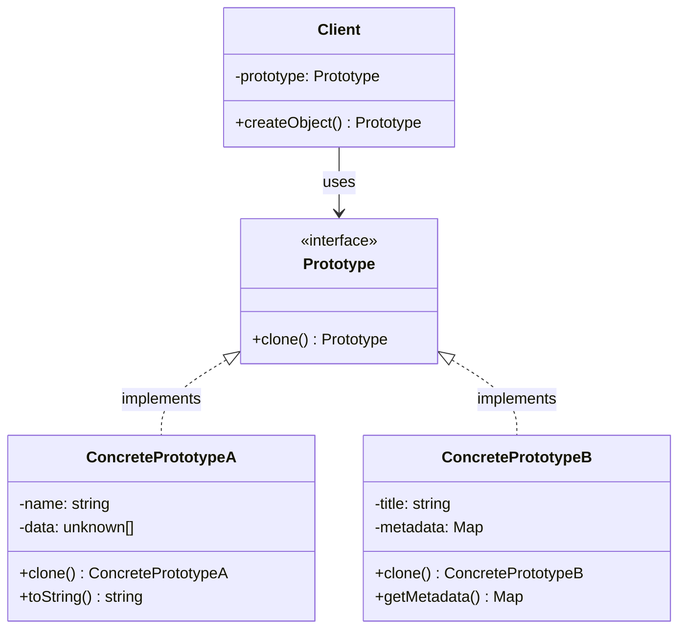
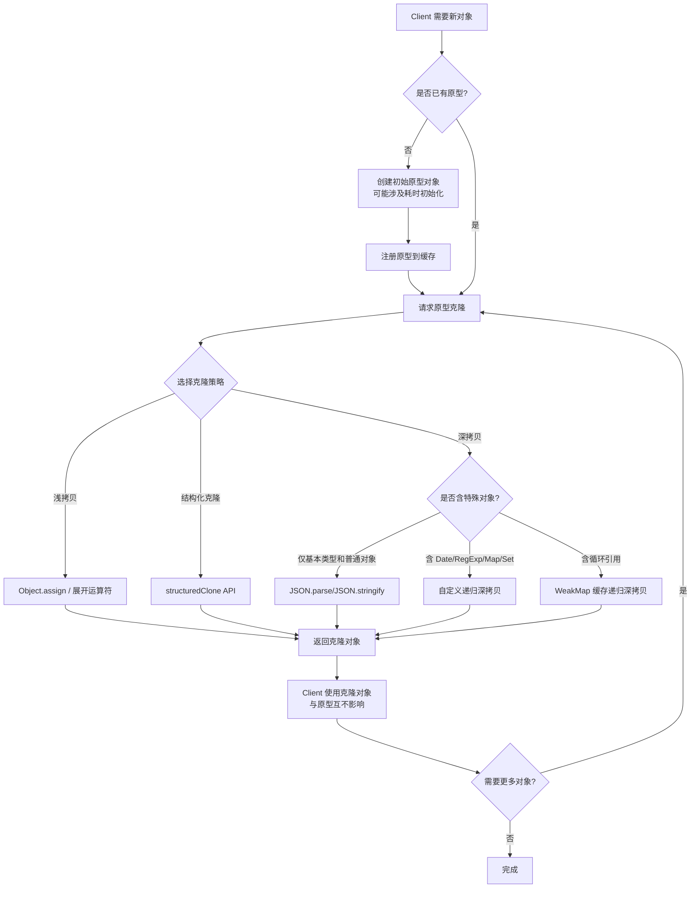

# 原型模式

## 1. 定义与意图

> 用原型实例指定创建对象的种类，并且通过拷贝这些原型创建新的对象。——GoF

原型模式（Prototype Pattern）是一种创建型设计模式，其核心思想是：通过复制一个已有对象来创建新对象，而非通过 `new` 关键字从头构造。

在 JavaScript 中，原型模式具有极其特殊的地位。JavaScript 是一门基于原型的语言（prototype-based language），而非基于类的语言（class-based language）。ES6 引入的 `class` 语法本质上是原型继承的语法糖。理解原型模式，就是理解 JavaScript 对象系统的 DNA。

**关键认知**：

- Java/C++ 中，原型模式是一种设计选择；在 JavaScript 中，原型模式是语言的基础机制
- JavaScript 的原型链（prototype chain）本身就是原型模式的运行时实现
- `Object.create()` 是语言层面提供的原型克隆原语
- 每一个 JavaScript 对象都有一个隐式引用指向其原型对象，这条链路构成了属性查找的基石

**原型模式 vs 原型继承**：

原型模式关注的是"通过克隆创建新对象"这一创建型模式意图；原型继承关注的是"对象之间的委托关系"这一复用机制。两者在 JavaScript 中交织在一起，但概念上应当区分清楚。

## 2. UML类图



**类图说明**：

- `Prototype` 接口声明了 `clone()` 方法，这是原型模式的核心契约
- `ConcretePrototypeA` 和 `ConcretePrototypeB` 是具体原型，各自实现深拷贝或浅拷贝策略
- `Client` 持有一个原型引用，通过调用 `clone()` 来获取新对象，无需关心具体类

## 3. 核心角色与职责

| 角色 | 职责 | JavaScript 中的体现 |
|------|------|---------------------|
| Prototype | 声明克隆接口，定义 `clone()` 契约 | TypeScript 中的 `Cloneable` 接口 |
| ConcretePrototype | 实现具体的克隆方法，完成对象的浅拷贝或深拷贝 | 实现了 `clone()` 方法的具体类 |
| Client | 通过请求原型克隆来创建新对象，无需知道具体类 | 持有原型引用的消费者代码 |

**职责边界**：

- Prototype 仅定义"可克隆"这一能力，不关心克隆的具体实现策略
- ConcretePrototype 决定采用浅拷贝还是深拷贝，这是实现细节而非接口契约
- Client 只依赖 Prototype 接口，对克隆的内部机制一无所知

## 4. 应用场景

### 4.1 通用场景

#### 对象缓存与复用

#### 性能优化

### 4.2 前端框架实战

#### React 状态不可变更新

React 要求状态更新必须是不可变的，其本质就是原型模式中"通过拷贝创建新对象"的应用。React 通过引用比较（`===`）判断状态是否变化，如果直接修改原对象，React 无法检测到变化。

#### Vue 组件复用

#### Immutable.js 结构共享

Immutable.js 的结构共享（Structural Sharing）是原型模式的一种高效变体。它不是完整克隆整棵对象树，而是只克隆修改路径上的节点，未修改的子树通过引用共享。

## 5. Mermaid流程图



## 6. 优缺点分析

| 优点 | 缺点 |
|------|------|
| 无需知道具体类即可创建对象，降低耦合 | 深拷贝循环引用需要额外处理（WeakMap 缓存） |
| 克隆性能优于 new 构造（跳过初始化逻辑） | 复杂对象的克隆实现可能非常复杂 |
| 简化对象创建过程，尤其适合初始化成本高的对象 | 特殊类型（Date、RegExp、Map、Set 等）需要逐一处理 |
| 动态增减原型，运行时配置灵活 | 浅拷贝可能导致意外的数据污染 |
| 与 JavaScript 原型机制天然契合 | 对象中包含函数时克隆策略需要谨慎选择 |
| 支持运行时动态构建对象结构 | 调试困难，原型链可能隐藏错误来源 |

**深度分析 -- 浅拷贝的隐患**：

浅拷贝是最简单的克隆方式，但它只复制对象的直接属性值。对于引用类型的属性（对象、数组、Map 等），浅拷贝后新旧对象共享同一份引用数据。这在多人协作或大型项目中尤其危险：一个开发者修改了克隆对象中的嵌套数据，另一个开发者使用的原型对象也受到了影响，而这种 bug 往往难以追踪。

**深度分析 -- 克隆中的函数问题**：

函数在 JavaScript 中是一等公民，但克隆函数存在语义上的歧义。是克隆函数的闭包环境？还是仅仅复制函数引用？当前主流实践是：函数不参与克隆，新旧对象共享同一函数引用。这在绝大多数场景下是合理的，因为函数本身通常是不可变的。

## 7. 相关模式对比

| 对比维度 | 原型模式 | 工厂方法模式 | 抽象工厂模式 |
|----------|---------|-------------|-------------|
| 创建方式 | 克隆已有对象 | 子类决定创建哪个类 | 组合多个工厂创建产品族 |
| 性能 | 更好（跳过初始化） | 一般 | 一般 |
| 适用场景 | 初始化成本高的对象 | 需要灵活创建不同对象 | 需要创建一组相关对象 |
| 对象状态 | 克隆携带当前状态 | 总是创建初始状态 | 总是创建初始状态 |
| 复杂度 | 低（克隆即可） | 中（需要子类体系） | 高（需要工厂体系） |

| 对比维度 | 原型模式 | 建造者模式 |
|----------|---------|-----------|
| 创建关注点 | 从已有对象复制 | 分步骤构建复杂对象 |
| 对象复杂度 | 任意 | 通常非常复杂 |
| 过程控制 | 一次性克隆 | 分步构建，可暂停 |
| 适用场景 | 需要快速复制 | 需要精细控制创建过程 |

**核心差异总结**：

- 原型模式 vs 工厂方法：原型模式通过克隆创建，无需知道具体类；工厂方法通过子类化创建，需要知道产品层级结构
- 原型模式 vs 建造者模式：原型模式是"一锤子买卖"，一次克隆完成；建造者模式是"精雕细琢"，分步构建
- 在 JavaScript 中，原型模式是首选的创建型模式，因为语言本身就基于原型

## 8. 总结

原型模式在 JavaScript 中具有超越一般设计模式的特殊地位。它不仅是一种创建型设计模式，更是 JavaScript 对象系统的基石。

**核心要点回顾**：

1. **语言DNA**：JavaScript 是基于原型的语言，`Object.create()`、原型链、`__proto__` 这些机制都是原型模式在语言层面的体现。理解原型模式，就是理解 JavaScript 对象模型的核心。

2. **克隆策略选择**：浅拷贝（展开运算符、`Object.assign`）适合扁平对象；深拷贝（自定义递归、`structuredClone`）适合嵌套对象。在 2024 年后的项目中，`structuredClone` 应当是深拷贝的首选方案。

3. **循环引用是深拷贝的核心难题**：使用 `WeakMap` 缓存已克隆对象是解决循环引用的标准方案。`structuredClone` 原生支持循环引用，但自定义深拷贝实现必须自行处理。

4. **前端框架中的原型模式无处不在**：React 的不可变状态更新、Vue 的组件变体复用、Immutable.js 的结构共享，这些前端核心概念背后都有原型模式的身影。

5. **与 JavaScript 原型继承的关系**：原型模式（创建型设计模式）和原型继承（对象委托机制）在概念上是不同的，但在 JavaScript 中它们共享同一套运行时基础设施。理解这种联系，有助于在框架设计和性能优化中做出更好的决策。

**实践建议**：

- 优先使用 `structuredClone()` 进行深拷贝，它是浏览器原生实现，性能和正确性都有保障
- 对于包含函数的对象，采用"浅拷贝 + 手动处理特定字段"的策略
- 在 React 等要求不可变性的框架中，使用 immer 等工具简化不可变更新，避免手动深拷贝的繁琐和出错
- 在设计原型缓存系统时，注意区分"原型"和"实例"的生命周期，避免意外修改原型

---

## TypeScript 实现

### 基础实现

#### Object.create() 实现原型继承

`Object.create()` 是 JavaScript 原生提供的原型克隆原语，它创建一个新对象并将其原型指向指定对象。

```typescript
// 定义原型接口
interface Cloneable<T> {
  clone(): T;
}

// 使用 Object.create() 实现原型链委托
interface ShapePrototype {
  type: string;
  color: string;
  draw(): string;
}

// 原型对象（共享方法）
const shapePrototype: ShapePrototype = {
  type: '',
  color: '',
  draw() {
    return `Drawing a ${this.color} ${this.type}`;
  },
};

// 通过原型创建实例（克隆原型并覆盖数据）
const circle = Object.create(shapePrototype);
circle.type = 'circle';
circle.color = 'red';

const rectangle = Object.create(shapePrototype);
rectangle.type = 'rectangle';
rectangle.color = 'blue';

console.log(circle.draw());     // "Drawing a red circle"
console.log(rectangle.draw());  // "Drawing a blue rectangle"

// 验证原型链关系
console.log(Object.getPrototypeOf(circle) === shapePrototype);  // true
console.log(Object.getPrototypeOf(rectangle) === shapePrototype); // true
```

#### 手动实现浅拷贝与深拷贝

```typescript
// 浅拷贝：只复制一层属性
class ShallowDocument implements Cloneable<ShallowDocument> {
  constructor(
    public title: string,
    public tags: string[],
    public author: { name: string; email: string },
  ) {}

  clone(): ShallowDocument {
    // 方式一：Object.assign 浅拷贝（引用类型的属性仍指向同一份底层数据）
    // return Object.assign(new ShallowDocument('', [], { name: '', email: '' }), this);

    // 方式二：逐个复制属性值（同样只复制一层）
    return new ShallowDocument(
      this.title,
      this.tags,       // 复制数组引用，新旧对象共享同一个数组
      this.author      // 复制对象引用，内部字段仍是共享的
    );
  }
}

const original = new ShallowDocument('Design Patterns', ['GoF', 'Creational'], { name: 'Erich Gamma', email: 'gof@example.com' });
const shallowCopy = original.clone();
shallowCopy.tags.push('Prototype');       // 修改了共享的 tags 数组
shallowCopy.author.name = 'Changed';      // 修改了共享的 author 对象

console.log(original.tags);               // ['GoF', 'Creational', 'Prototype'] -- 被污染!
console.log(original.author.name);        // 'Changed' -- 被污染!
```

```typescript
// 深拷贝：递归复制所有层级
class DeepDocument implements Cloneable<DeepDocument> {
  constructor(
    public title: string,
    public tags: string[],
    public author: { name: string; email: string },
    public createdAt: Date,
  ) {}

  clone(): DeepDocument {
    return new DeepDocument(
      this.title,
      [...this.tags],                        // 复制数组元素
      { ...this.author },                    // 复制对象字段
      new Date(this.createdAt.getTime()),    // 复制 Date
    );
  }
}

const deepOriginal = new DeepDocument('Creational Patterns', ['Creational', 'Clone'], { name: 'John Vlissides', email: 'jv@example.com' }, new Date('2024-01-01'));
const deepCopy = deepOriginal.clone();
deepCopy.tags.push('Deep Clone');
deepCopy.author.name = 'Modified';

console.log(deepOriginal.tags);           // ['Creational', 'Clone'] -- 未被污染
console.log(deepOriginal.author.name);    // 'John Vlissides' -- 未被污染
```

#### JSON 序列化深拷贝的局限性

```typescript
// JSON 序列化深拷贝 -- 简单但有严重局限
function jsonClone<T>(obj: T): T {
  return JSON.parse(JSON.stringify(obj));
}

// 局限性一：丢失函数和 undefined
const withFunction = {
  name: 'test',
  method: () => 'hello',
  value: undefined,
};
const cloned = jsonClone(withFunction);
console.log(cloned.method); // undefined -- 函数丢失
console.log(cloned.value);  // undefined -- undefined 属性丢失

// 局限性二：Date 变成字符串
const withDate = { createdAt: new Date('2024-01-01') };
const dateCloned = jsonClone(withDate);
console.log(dateCloned.createdAt instanceof Date); // false -- 变成字符串

// 局限性三：Map/Set 变成空对象
const withMap = { data: new Map([['k', 'v']]) };
const mapCloned = jsonClone(withMap);
console.log(mapCloned.data); // {} -- Map 丢失

// 局限性四：RegExp 变成空对象
const withRegex = { pattern: /clone/gi };
const regexCloned = jsonClone(withRegex);
console.log(regexCloned.pattern); // {} -- RegExp 丢失

// 局限性五：循环引用导致栈溢出
const cyclic: Record<string, unknown> = { name: 'test' };
cyclic.self = cyclic;
try {
  jsonClone(cyclic); // TypeError: Converting circular structure to JSON
} catch (e) {
  console.log('循环引用会抛出异常');
}

// 局限性六：Symbol 键丢失
const withSymbol = { [Symbol('id')]: 123, name: 'test' };
const symCloned = jsonClone(withSymbol);
console.log(Object.getOwnPropertySymbols(symCloned).length); // 0 -- Symbol 键丢失
```

### 现代TypeScript实现

#### structuredClone() API

`structuredClone()` 是 Web API 提供的原生深拷贝方法，从 2022 年起已被所有主流浏览器和 Node.js 17+ 支持。

```typescript
// structuredClone 支持的类型远超 JSON 序列化
const complexObject = {
  // 基本类型
  name: 'Prototype Pattern',
  version: 2,

  // Date -- 正确保留
  createdAt: new Date('2024-01-01'),

  // RegExp -- 正确保留
  pattern: /clone/gi,

  // Map -- 正确保留
  metadata: new Map([['author', 'GoF']]),

  // Set -- 正确保留
  tags: new Set(['creational', 'prototype']),

  // ArrayBuffer -- 正确保留
  buffer: new Uint8Array([1, 2, 3]),
};

const cloned = structuredClone(complexObject);

// 验证类型保留
console.log(cloned.createdAt instanceof Date);        // true
console.log(cloned.pattern instanceof RegExp);        // true
console.log(cloned.metadata instanceof Map);           // true
console.log(cloned.tags instanceof Set);               // true
```

```typescript
// structuredClone 的局限
// 1. 不支持函数
const withFn = { method: () => 'hello' };
try {
  structuredClone(withFn); // DataCloneError
} catch {
  console.log('structuredClone 不支持函数');
}

// 2. 不支持 DOM 节点
try {
  structuredClone({ node: document.body }); // DataCloneError
} catch {
  console.log('structuredClone 不支持 DOM 节点');
}

// 3. 不保留自定义类的原型，实例会被克隆为普通对象
class Counter {
  count = 1;
}
const counterClone = structuredClone(new Counter());
console.log(counterClone instanceof Counter); // false -- 原型链丢失

// 4. 循环引用 -- structuredClone 支持!
const cyclic: Record<string, unknown> = { name: 'cyclic' };
cyclic.self = cyclic;
const cyclicClone = structuredClone(cyclic);
console.log(cyclicClone === cyclicClone.self); // true -- 正确处理循环引用
```

#### 泛型克隆工具类

```typescript
// 克隆策略枚举
enum CloneStrategy {
  Shallow = 'shallow',
  Deep = 'deep',
  Structured = 'structured',
  Custom = 'custom',
}

// 自定义克隆器类型
type CustomCloner<T> = (source: T) => T;

// 克隆工厂：根据策略选择克隆方式
class CloneFactory {
  static clone<T>(source: T, strategy: CloneStrategy, custom?: CustomCloner<T>): T {
    switch (strategy) {
      case CloneStrategy.Shallow:
        return { ...source };
      case CloneStrategy.Deep:
        return JSON.parse(JSON.stringify(source));
      case CloneStrategy.Structured:
        return structuredClone(source);
      case CloneStrategy.Custom:
        if (!custom) throw new Error('Custom 策略需要提供克隆函数');
        return custom(source);
    }
  }
}

// 使用
interface PrototypeConfig {
  name: string;
  features: string[];
}
const prototypeConfig: PrototypeConfig = { name: 'base', features: ['a', 'b'] };

// 自定义克隆
const custom = CloneFactory.clone(prototypeConfig, CloneStrategy.Custom, (src) => {
  const result = structuredClone(src);
  result.name = 'custom-clone';
  return result;
});
```

#### 深拷贝完整实现

```typescript
// 完整的深拷贝工具，处理所有已知的边界情况
class DeepCloner {
  private cache: WeakMap<object, unknown> = new WeakMap();

  clone<T>(source: T): T {
    this.cache = new WeakMap(); // 每次克隆使用新的缓存
    return this._clone(source);
  }

  private _clone<T>(source: T): T {
    // 原始类型和函数直接返回
    if (source === null || typeof source !== 'object') {
      return source;
    }

    // 处理循环引用
    if (this.cache.has(source)) {
      return this.cache.get(source) as T;
    }

    // Date
    if (source instanceof Date) {
      return new Date(source.getTime()) as unknown as T;
    }
    // RegExp
    if (source instanceof RegExp) {
      return new RegExp(source.source, source.flags) as unknown as T;
    }
    // Map
    if (source instanceof Map) {
      const clonedMap = new Map();
      this.cache.set(source, clonedMap);
      (source as unknown as Map<unknown, unknown>).forEach((value, key) => {
        clonedMap.set(this._clone(key), this._clone(value));
      });
      return clonedMap as unknown as T;
    }
    // Set
    if (source instanceof Set) {
      const clonedSet = new Set();
      this.cache.set(source, clonedSet);
      (source as unknown as Set<unknown>).forEach((value) => {
        clonedSet.add(this._clone(value));
      });
      return clonedSet as unknown as T;
    }
    // 数组
    if (Array.isArray(source)) {
      const clonedArr = new Array(source.length);
      this.cache.set(source, clonedArr);
      source.forEach((item, index) => {
        clonedArr[index] = this._clone(item);
      });
      return clonedArr as unknown as T;
    }
    // 普通对象：保留原型
    const clonedObj = Object.create(Object.getPrototypeOf(source));
    this.cache.set(source, clonedObj);
    Reflect.ownKeys(source as object).forEach((key) => {
      (clonedObj as Record<PropertyKey, unknown>)[key] = this._clone(
        (source as Record<PropertyKey, unknown>)[key]
      );
    });
    return clonedObj as T;
  }
}

// 使用
class UserEntity {
  constructor(public name: string) {}
  greet(): string { return `Hello, I'm ${this.name}`; }
}
const user = new UserEntity('Bob');
const profile = new Map();
profile.set('owner', user);
const userObj = { name: 'Alice', profile };
const deepCloner = new DeepCloner();
const clonedUser = deepCloner.clone(userObj) as { name: string; profile: Map<string, unknown> };

// 验证 Map 内的对象被克隆为独立副本
const clonedOwner = clonedUser.profile.get('owner') as UserEntity;
console.log(clonedOwner.name); // 'Bob'

// 验证原型链保持（克隆保留 UserEntity 原型）
console.log(clonedOwner instanceof UserEntity);  // true
console.log(clonedOwner.greet());                // "Hello, I'm Bob"
```

```typescript
// 预构建对象原型缓存，避免重复初始化开销
interface EmailTemplate {
  subject: string;
  body: string;
  recipients: string[];
  headers: Map<string, string>;
  attachments: Array<{ name: string; size: number }>;
}

class EmailTemplateRegistry {
  private prototypes: Map<string, EmailTemplate> = new Map();

  register(name: string, template: EmailTemplate): void {
    this.prototypes.set(name, template);
  }

  // 克隆原型创建新实例，避免共享可变引用
  create(name: string): EmailTemplate {
    const proto = this.prototypes.get(name);
    if (!proto) throw new Error(`未注册的模板: ${name}`);
    return structuredClone(proto);
  }
}

// 使用
const registry = new EmailTemplateRegistry();
registry.register('welcome', {
  subject: 'Welcome!',
  body: 'Thanks for joining.',
  recipients: [],
  headers: new Map([['X-Type', 'welcome']]),
  attachments: [],
});

const email1 = registry.create('welcome');
const email2 = registry.create('welcome');
email1.recipients.push('user1@example.com');
email2.recipients.push('user2@example.com');

console.log(email1.recipients);  // ['user1@example.com']
console.log(email2.recipients);  // ['user2@example.com']
```

```typescript
// 大型配置对象的克隆 vs 重新构建
interface ServerConfig {
  routes: Array<{
    path: string;
    method: string;
    middleware: string[];
    handler: string;
  }>;
  plugins: Map<string, Record<string, unknown>>;
  cors: {
    origins: string[];
    methods: string[];
  };
}

// 预构建一次原型
function createBaseConfig(): ServerConfig {
  return {
    routes: Array.from({ length: 1000 }, (_, i) => ({
      path: `/api/r${i}`,
      method: 'GET',
      middleware: ['auth', 'log', 'rate-limit'],
      handler: `handler_${i}`,
    })),
    plugins: new Map([['compression', { level: 6 }]]),
    cors: { origins: ['*'], methods: ['GET', 'POST'] },
  };
}

const prototypeConfig = createBaseConfig();

// 方式一：克隆原型（跳过初始化逻辑）
const cloneStart = performance.now();
const configA = structuredClone(prototypeConfig);
const cloneTime = performance.now() - cloneStart;

// 方式二：从源码重新构建（完整走一遍创建流程）
function buildConfigFromSource(): ServerConfig { return createBaseConfig(); }
const buildStart = performance.now();
const rebuiltConfig = buildConfigFromSource();
const buildTime = performance.now() - buildStart;

console.log(`Clone time: ${cloneTime.toFixed(2)}ms`);
console.log(`Build time: ${buildTime.toFixed(2)}ms`);
// 克隆的优势取决于原型的构建成本：构建越昂贵，克隆收益越大；
// 对简单字面量对象，重新构建往往更快，具体需以实测为准
```

```typescript
import { useState, useCallback } from 'react';

// React 状态的不可变更新本质上是原型模式的应用
interface TodoItem {
  id: number;
  text: string;
  completed: boolean;
  subTasks: Array<{ id: number; text: string; done: boolean }>;
}

// 错误示范：直接修改（违反不可变原则）
function useTodoWrong() {
  const [todos, setTodos] = useState<TodoItem[]>([]);
  const toggleSubTask = useCallback((todoId: number, subTaskId: number) => {
    // ❌ 直接修改原对象：React 无法检测到变化
    setTodos((prev) => {
      const todo = prev.find((t) => t.id === todoId)!;
      todo.subTasks = todo.subTasks.map((st) =>
        st.id === subTaskId ? { ...st, done: !st.done } : st
      );
      return prev; // 返回相同引用，React 不会重新渲染
    });
  }, []);

  return { todos, toggleSubTask };
}

// ✅ 正确示范：沿修改路径拷贝 + 不可变更新
function useTodoCorrect() {
  const [todos, setTodos] = useState<TodoItem[]>([]);
  const toggleSubTask = useCallback((todoId: number, subTaskId: number) => {
    // 沿修改路径拷贝相关节点，再修改目标节点，返回新引用
    setTodos((prev) =>
      prev.map((todo) =>
        todo.id === todoId
          ? {
              ...todo,
              subTasks: todo.subTasks.map((st) =>
                st.id === subTaskId ? { ...st, done: !st.done } : st
              ),
            }
          : todo,
      ),
    );
  }, []);

  return { todos, toggleSubTask };
}
```

```typescript
// Vue 组件通过原型创建变体
import { defineComponent, type PropType } from 'vue';

// 基础按钮原型配置
const baseButtonOptions = {
  props: {
    size: {
      type: String as PropType<'small' | 'medium' | 'large'>,
      default: 'medium',
    },
    disabled: {
      type: Boolean,
      default: false,
    },
  },
  emits: ['click'],
  template: `
    <button
      :class="['base-btn', 'btn-' + size]"
      :disabled="disabled"
      @click="$emit('click')"
    >
      <slot />
    </button>
  `,
};

// 基于原型创建变体：克隆 baseButtonOptions 并扩展
const primaryButton = defineComponent({
  ...baseButtonOptions,
  props: {
    ...baseButtonOptions.props,
    variant: { type: String as PropType<'primary' | 'ghost'>, default: 'primary' },
  },
  template: `
    <button
      :class="['base-btn', 'btn-' + size, 'btn-' + variant]"
      :disabled="disabled"
      @click="$emit('click')"
    >
      <slot />
    </button>
  `,
});
```

```typescript
// 结构共享原理示意（简化版）
class ImmutableMap<K, V> {
  private constructor(
    private data: Map<K, V>,
    private parent: ImmutableMap<K, V> | null = null,
  ) {}

  static from<K, V>(entries: ReadonlyArray<readonly [K, V]>): ImmutableMap<K, V> {
    return new ImmutableMap(new Map(entries));
  }

  // set 操作不修改原 Map，而是创建新 Map，未修改的值仍共享引用
  set(key: K, value: V): ImmutableMap<K, V> {
    const newData = new Map(this.data);
    newData.set(key, value);
    return new ImmutableMap(newData, this);
  }

  get(key: K): V | undefined {
    // 当前层找不到时沿 parent 链向上查找（原型链委托）
    if (this.data.has(key)) return this.data.get(key);
    return this.parent?.get(key);
  }
}

// 使用：结构共享
const map1 = ImmutableMap.from([
  ['name', 'Alice'],
  ['age', '30'],
  ['city', 'Beijing'],
] as ReadonlyArray<readonly [string, string]>);

// set 只创建一个新的浅 Map，未修改的值仍共享引用
const map2 = map1.set('age', '31');

console.log(map1.get('age')); // '30' -- 原版不变
console.log(map2.get('age')); // '31' -- 新版已更新
console.log(map2.get('name')); // 'Alice' -- 共享引用，零拷贝开销
```

---

## Java 实现

### 原型模式（克隆复制对象）

```java
import java.util.HashMap;
import java.util.Map;

// 实现 Cloneable 并重写 clone()，通过复制而非 new 创建对象
public class Shape implements Cloneable {
    private String type;
    private Map<String, Object> properties = new HashMap<>();

    public Shape(String type) {
        this.type = type;
    }

    public void set(String key, Object value) {
        properties.put(key, value);
    }

    public String getType() { return type; }
    public Map<String, Object> getProperties() { return properties; }

    @Override
    public Shape clone() {
        try {
            Shape copy = (Shape) super.clone();
            // 深拷贝可变引用，避免浅拷贝共享 properties
            copy.properties = new HashMap<>(this.properties);
            return copy;
        } catch (CloneNotSupportedException e) {
            throw new AssertionError(e);
        }
    }
}

// 原型注册表：缓存原型，clone 出副本
public class ShapeRegistry {
    private static final Map<String, Shape> registry = new HashMap<>();

    static {
        Shape circle = new Shape("circle");
        circle.set("radius", 10);
        registry.put("circle", circle);
    }

    public static Shape getClone(String type) {
        return registry.get(type).clone();
    }
}

// 使用
public class Client {
    public static void main(String[] args) {
        Shape s1 = ShapeRegistry.getClone("circle");
        Shape s2 = ShapeRegistry.getClone("circle");
        System.out.println(s1 != s2);   // true，两个不同对象
        s1.set("color", "red");         // 修改 s1 不影响 s2
    }
}
```

> 原型模式通过克隆代替 `new` 创建对象，适合"对象创建成本高"或"需要保留对象某时刻状态"的场景。注意浅拷贝与深拷贝的区别——可变成员需深拷贝。

## Python 实现

### 原型模式（copy 模块）

```python
import copy

class Shape:
    def __init__(self, shape_type: str):
        self.type = shape_type
        self.properties = {}

    def set(self, key: str, value):
        self.properties[key] = value

    def clone(self) -> "Shape":
        # copy.deepcopy 实现深拷贝，避免副本共享 properties
        return copy.deepcopy(self)

# 原型注册表
class ShapeRegistry:
    _registry = {}

    @classmethod
    def register(cls, shape_type: str, shape: Shape):
        cls._registry[shape_type] = shape

    @classmethod
    def get_clone(cls, shape_type: str) -> Shape:
        return cls._registry[shape_type].clone()

# 初始化原型
circle = Shape("circle")
circle.set("radius", 10)
ShapeRegistry.register("circle", circle)

# 使用
s1 = ShapeRegistry.get_clone("circle")
s2 = ShapeRegistry.get_clone("circle")
assert s1 is not s2        # True，两个不同对象
s1.set("color", "red")     # 修改 s1 不影响 s2
```

> Python 的 `copy.copy`（浅拷贝）与 `copy.deepcopy`（深拷贝）天然支持原型模式。若对象只含不可变成员，浅拷贝即可；含可变容器需用 `deepcopy`。

