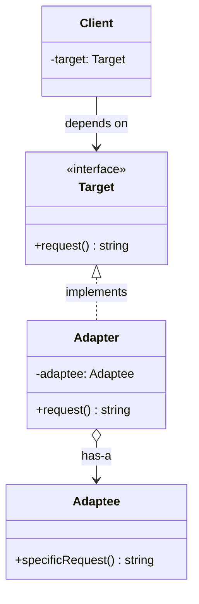
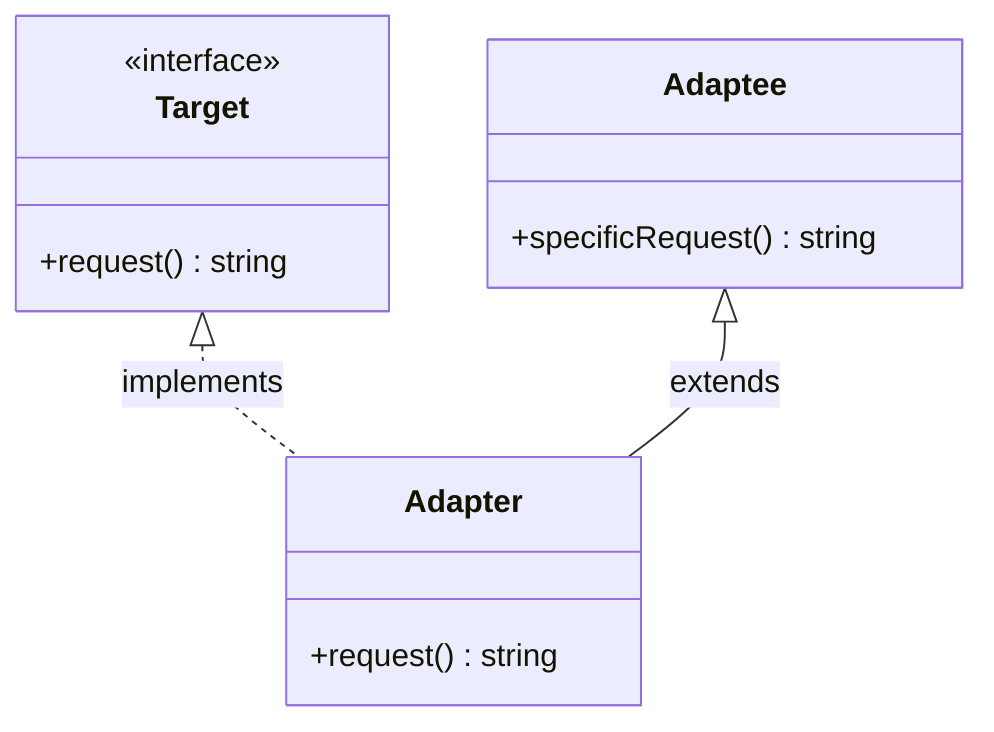
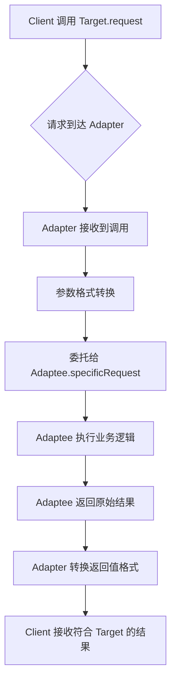
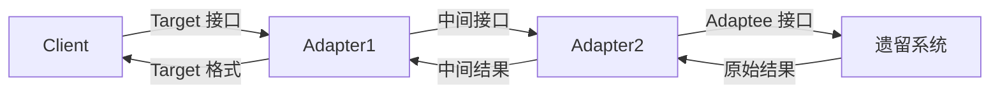

# 适配器模式

## 1. 定义与意图

> 将一个类的接口转换成客户希望的另外一个接口。适配器模式使得原本由于接口不兼容而不能一起工作的那些类可以一起工作。——GoF

适配器模式（Adapter Pattern）又称包装器模式（Wrapper Pattern），是一种结构型设计模式。其核心思想是：当现有类的接口与客户端期望的接口不一致时，不修改原有代码，而是引入一个适配器类，在两者之间做接口转换，从而使不兼容的对象能够协同工作。

适配器模式在软件开发中的价值体现在三个层面：

- **复用已有资产**：当系统中存在成熟但接口不符的组件时，适配器允许在不修改源码的前提下将其纳入新体系
- **隔离变化**：客户端仅依赖目标接口，被适配类的内部变化被适配器吸收，客户端代码无需调整
- **平滑过渡**：在系统演进过程中，适配器充当新旧接口之间的桥梁，避免大规模重构

从工程实践角度看，适配器模式本质上是对"接口不一致"问题的妥协方案。如果项目处于早期设计阶段，应当优先统一接口规范而非依赖适配器；适配器更适合在接口已固化、无法修改源码或改造成本过高的场景下使用。

## 2. UML类图



类适配器变体（通过继承实现）：



## 3. 核心角色与职责

| 角色 | 职责 | 典型实现方式 |
|------|------|-------------|
| Target | 定义客户端期望的接口，是适配器最终暴露的契约 | TypeScript interface 或 abstract class |
| Adapter | 将 Adaptee 的接口转换为 Target 接口，是模式的核心 | 类适配器（继承 + 实现）或对象适配器（组合 + 委托） |
| Adaptee | 已有的、接口不兼容的类，包含可复用的业务逻辑 | 旧版 API、第三方库、遗留系统 |
| Client | 仅通过 Target 接口与对象交互，对适配过程无感知 | 业务层调用代码 |

角色间的协作流程：

1. Client 调用 Target 接口上的方法
2. Adapter 接收到调用后，将请求委托给 Adaptee
3. Adaptee 执行自身逻辑并返回结果
4. Adapter 将 Adaptee 的结果转换为 Target 接口约定的格式
5. Client 接收到符合 Target 接口的返回值

## 4. 应用场景

### 4.1 通用场景

#### 旧版 API 兼容

在系统迭代过程中，新旧接口并存是常见问题。适配器可以在不修改旧代码的前提下，让旧实现满足新接口契约。

#### 第三方库接口统一

当项目中使用多个功能相似但接口不同的第三方库时，适配器可以统一它们的调用方式。

### 4.2 前端框架实战

#### 旧版 REST API 适配 GraphQL

在从 REST 迁移到 GraphQL 的过渡期，适配器让旧代码无需立即改写即可对接新的 GraphQL 后端。

#### 第三方支付 SDK 适配

不同支付渠道的 SDK 接口千差万别，适配器将它们统一为一致的支付接口。

#### Vue 2 -> Vue 3 迁移适配器

`@vue/compat` 的核心原理就是适配器模式：它将 Vue 2 的 API 行为包装为 Vue 3 兼容的形式，同时输出废弃警告。

## 5. Mermaid流程图



多层适配器嵌套流程（极端场景）：



## 6. 优缺点分析

| 优点 | 缺点 |
|------|------|
| 复用已有类，无需修改源码 | 过多适配器使系统凌乱，增加理解成本 |
| 符合开闭原则（OCP），对扩展开放 | 增加间接调用层次，影响性能 |
| 解耦客户端与被适配类 | 可能掩盖根本的设计问题，推迟正确的重构 |
| 提供透明切换实现的能力 | 类适配器受限于单继承（TypeScript/Java） |
| 支持渐进式迁移，降低迁移风险 | 适配器本身可能引入 bug，需要充分测试 |

### 使用决策参考

```
是否应该使用适配器模式？

[接口不一致] --> 能否修改源码？
  |-- 能 --> 直接修改接口，不使用适配器
  |-- 不能 --> 是否为过渡期？
       |-- 是 --> 使用适配器，制定迁移计划
       |-- 否 --> 是否第三方库？
            |-- 是 --> 使用适配器封装
            |-- 否 --> 考虑重构统一接口
```

## 7. 相关模式对比

| 对比维度 | 适配器模式 | 装饰器模式 | 代理模式 | 外观模式 |
|----------|-----------|-----------|---------|---------|
| 意图 | 接口转换，使不兼容类协同工作 | 动态增强功能，不改变接口 | 控制对象访问，不改变接口 | 简化子系统接口 |
| 接口变化 | 是（转换接口） | 否（保持原接口） | 否（保持原接口） | 是（提供新简化接口） |
| 对象创建 | 适配已有对象 | 包装已有对象 | 代表已有对象 | 聚合多个对象 |
| 客户端感知 | 感知新接口 | 不感知（透明增强） | 不感知（透明代理） | 感知新简化接口 |
| 典型场景 | 旧版 API 兼容 | 日志/缓存/权限增强 | 延迟加载/访问控制 | 复杂子系统简化 |
| 对象数量 | 一对一 | 一对一 | 一对一 | 多对一 |

适配器与外观模式的关键区别：适配器关注接口转换，使一个已有类适配新接口；外观模式关注简化，为多个子系统提供统一的高层入口。适配器通常一对一，外观通常多对一。

## 8. 总结

适配器模式是处理接口不一致问题的标准方案，其核心价值在于：在不修改源码的前提下，让不兼容的对象协同工作。

**何时使用适配器模式：**

- 需要使用已有类，但其接口与所需接口不匹配
- 需要创建可复用的类，该类与不相关或不可预见的类协同工作
- 需要使用多个已有子类，但通过对每个子类进行子类化来适配它们的接口是不现实的
- 在系统迁移过渡期，需要保持新旧接口同时可用

**何时不应使用适配器模式：**

- 在项目早期设计阶段，应优先统一接口规范
- 接口不一致问题可以通过简单重构解决时
- 仅仅为了方便而引入适配器，掩盖了设计上的根本问题

**TypeScript 实现要点：**

- 优先使用对象适配器（组合优于继承），灵活性更高
- 利用泛型适配器工厂减少重复代码，提升类型安全性
- Proxy 可以实现运行时动态适配，适合属性/方法名映射场景
- 适配器应当仅做接口转换，不应包含业务逻辑
- 在适配器中添加充分的日志，便于排查接口转换问题

适配器模式是软件演进过程中的"润滑剂"，它不是设计的终点，而是通向更好设计的过渡手段。在合适的时机用适配器解决眼前问题，同时规划好最终的接口统一方案，才是工程实践中最务实的做法。

---

## 9. 实战案例：旧请求库迁移与 axios 适配器

### 场景：将旧的 Ajax 请求迁移到新的 fetch 封装

假设新项目封装了一个基于 fetch 的 `HttpUtils` 工具库：

而公司早期基于 `XMLHttpRequest` 封装的 `Ajax` 方法，接口名和入参方式都与新库完全不同：

旧代码调用方式是 `Ajax('get', url, data, successCb, failCb)`。要将其迁移到新的 `HttpUtils`，**不需要挨个修改每一次调用**，只需要编写一个适配器函数承接旧接口参数，内部转发给新接口：

这样只需编写一个 `AjaxAdapter` 适配器，就能实现新旧接口的无缝衔接，避免了大规模改动存量业务代码。

### axios 的适配器机制

axios 之所以能同时运行在浏览器和 Node 环境并抹平两者的 API 差异，正是对适配器模式的灵活运用。

在 axios 核心逻辑中，派发请求的是 `dispatchRequest` 方法，它主要做两件事：

1. **数据转换**：转换请求体/响应体（数据层面的适配）
2. **调用适配器**：根据运行环境选择对应的 `http`（Node）或 `xhr`（浏览器）适配器

axios 通过适配器模式，将"发起网络请求"这一差异极大的底层操作抽象为统一的适配器接口，上层 API 完全一致，这正是适配器模式抹平平台差异的经典实践。

---

## TypeScript 实现

### 基础实现

#### 类适配器（继承 Adaptee，实现 Target）

类适配器通过同时继承 Adaptee 并实现 Target 接口来完成适配。在 TypeScript 中，由于只支持单继承，类适配器只能适配一个 Adaptee。

```typescript
// ==================== 类适配器 ====================

/** Target - 客户端期望的日志接口 */
interface ILogger {
  log(level: 'info' | 'warn' | 'error', message: string): void;
}

/** Adaptee - 旧版日志系统，接口与新系统不兼容 */
class LegacyLogger {
  /** 旧版只提供按类型写入的方法，且方法签名不同 */
  writeInfo(msg: string): void {
    console.log(`[INFO] ${msg}`);
  }
  writeWarn(msg: string): void {
    console.log(`[WARN] ${msg}`);
  }
  writeError(msg: string): void {
    console.log(`[ERROR] ${msg}`);
  }
}

/** ClassAdapter - 继承 Adaptee，实现 Target 接口 */
class LegacyLoggerClassAdapter extends LegacyLogger implements ILogger {
  log(level: 'info' | 'warn' | 'error', message: string): void {
    switch (level) {
      case 'info': this.writeInfo(message); break;
      case 'warn': this.writeWarn(message); break;
      case 'error': this.writeError(message); break;
    }
  }
}

// 使用示例
const classAdapter: ILogger = new LegacyLoggerClassAdapter();
classAdapter.log('info', '服务启动成功');
classAdapter.log('error', '数据库连接失败');
```

#### 对象适配器（组合 Adaptee，实现 Target）

对象适配器通过组合持有 Adaptee 实例，将调用委托给它。这种方式更灵活，支持适配多个 Adaptee，且符合组合优于继承的原则。

```typescript
// ==================== 对象适配器 ====================

/** Target - 统一日志接口 */
interface ILogger {
  log(level: 'info' | 'warn' | 'error', message: string): void;
}

/** Adaptee - 旧版日志系统 */
class LegacyLogger {
  writeInfo(msg: string): void {
    console.log(`[INFO] ${msg}`);
  }
  writeWarn(msg: string): void {
    console.log(`[WARN] ${msg}`);
  }
  writeError(msg: string): void {
    console.log(`[ERROR] ${msg}`);
  }
}

/** ObjectAdapter - 组合 Adaptee，实现 Target 接口 */
class LegacyLoggerAdapter implements ILogger {
  constructor(private legacy: LegacyLogger) {}
  log(level: 'info' | 'warn' | 'error', message: string): void {
    switch (level) {
      case 'info': this.legacy.writeInfo(message); break;
      case 'warn': this.legacy.writeWarn(message); break;
      case 'error': this.legacy.writeError(message); break;
    }
  }
}

// 使用示例
const legacyLogger = new LegacyLogger();
const objectAdapter: ILogger = new LegacyLoggerAdapter(legacyLogger);
objectAdapter.log('warn', '内存使用率超过 80%');
```

#### 类适配器 vs 对象适配器对比

| 对比维度 | 类适配器 | 对象适配器 |
|----------|---------|-----------|
| 实现方式 | 继承 Adaptee | 组合 Adaptee |
| 灵活性 | 低，只能适配一个 Adaptee | 高，可适配多个 Adaptee |
| 重写 Adaptee 行为 | 可以（继承优势） | 不可以（黑盒复用） |
| 对 Adaptee 子类的适配 | 不支持（绑定单一父类） | 自动支持（可传入任意子类实例） |
| 推荐度 | 较低 | 较高（组合优于继承） |

### 现代 TypeScript 实现

#### 泛型适配器工厂

利用 TypeScript 泛型与类型系统，可以构建通用的适配器工厂函数，将任意 Source 类型适配为 Target 类型。

```typescript
// ==================== 泛型适配器工厂 ====================

/**
 * 泛型适配器工厂
 * 通过映射函数将 Source 接口转换为 Target 接口
 */
function createAdapter<Target, Source>(
  source: Source,
  mapping: {
    [K in keyof Target]: (source: Source) => Target[K];
  }
): Target {
  const adapter = {} as Target;
  for (const key in mapping) {
    adapter[key] = mapping[key](source) as unknown as Target[typeof key];
  }
  return adapter;
}

// ==================== 使用：旧用户服务适配新接口 ====================
interface LegacyUserService {
  fetchUser(id: string): Promise<{ uid: string; displayName: string }>;
  modifyUser(id: string, data: Record<string, unknown>): Promise<boolean>;
}

interface ModernUserService {
  getUser(id: string): Promise<{ id: string; name: string }>;
  updateUser(id: string, data: { name: string }): Promise<boolean>;
}

const legacyService: LegacyUserService = {
  async fetchUser(id) { return { uid: id, displayName: '张三' }; },
  async modifyUser() { return true; },
};

// 通过适配器工厂将旧服务转换为新接口
const newUserService = createAdapter<ModernUserService, LegacyUserService>(
  legacyService,
  {
    getUser: (s) => async (id: string) => {
      const u = await s.fetchUser(id);
      return { id: u.uid, name: u.displayName };
    },
    updateUser: (s) => async (id: string, data: { name: string }) => {
      return s.modifyUser(id, data);
    },
  }
);

async function clientCode(service: ModernUserService) {
  const user = await service.getUser('1001');
  console.log('用户信息:', user);
  await service.updateUser('1001', { name: '李四' });
}

clientCode(newUserService);
```

#### 类型映射实现接口转换

利用 TypeScript 的条件类型与映射类型，可以在类型层面完成接口适配，并在运行时通过 Proxy 实现透明的属性访问转换。

```typescript
// ==================== 类型映射适配 ====================

/** 字段映射配置类型：从 SourceKey 映射到 TargetKey */
type FieldMapping<TSource, TTarget> = {
  [K in keyof TTarget]: keyof TSource | ((source: TSource) => TTarget[K]);
};

/**
 * 基于字段映射的适配器
 * 支持简单字段映射（字符串键）与转换函数映射
 */
function createFieldAdapter<TSource extends object, TTarget extends object>(
  source: TSource,
  mapping: FieldMapping<TSource, TTarget>
): TTarget {
  const adapter = {} as TTarget;
  (Object.keys(mapping) as Array<keyof TTarget>).forEach((key) => {
    const m = mapping[key];
    adapter[key] = (
      typeof m === 'function'
        ? (m as (s: TSource) => unknown)(source)
        : source[m as keyof TSource]
    ) as TTarget[keyof TTarget];
  });
  return adapter;
}

// ==================== 使用：商品数据适配 ====================
interface ApiProduct {
  product_id: string;
  product_name: string;
  product_status: '1' | '0';
}
interface ViewProduct {
  id: string;
  name: string;
  status: string;
}

const apiProduct: ApiProduct = { product_id: '2001', product_name: 'TypeScript 高级编程', product_status: '1' };

const product = createFieldAdapter<ApiProduct, ViewProduct>(apiProduct, {
  id: 'product_id',
  name: 'product_name',
  status: (src) => (src.product_status === '1' ? 'available' : 'unavailable'),
});

console.log(product.id);     // "2001"
console.log(product.name);   // "TypeScript 高级编程"
console.log(product.status); // "available"
```

#### Proxy 动态适配

利用 ES6 Proxy 可以在不修改原对象的前提下，拦截所有属性访问和方法调用，实现运行时动态适配。

```typescript
// ==================== Proxy 动态适配 ====================

/**
 * 方法重命名适配器
 * 将旧对象的方法名映射到新接口的方法名
 */
function createMethodRenameAdapter<TSource extends object, TTarget extends object>(
  source: TSource,
  methodMap: Record<string, string>
): TTarget {
  return new Proxy(source, {
    get(target, prop: string) {
      // 将新方法名映射到旧方法名
      const mapped = methodMap[prop];
      if (mapped) {
        const fn = (target as Record<string, unknown>)[mapped];
        return typeof fn === 'function' ? fn.bind(target) : fn;
      }
      return (target as Record<string, unknown>)[prop];
    }
  }) as unknown as TTarget;
}

// ==================== 使用：旧存储适配现代接口 ====================
interface LegacyStorage {
  setItem(key: string, value: string): void;
  getItem(key: string): string | null;
  removeItem(key: string): void;
}

interface ModernStorage {
  write(key: string, value: string): void;
  read(key: string): string | null;
  delete(key: string): void;
}

const legacyStorage: LegacyStorage = {
  setItem: (k, v) => localStorage.setItem(k, v),
  getItem: (k) => localStorage.getItem(k),
  removeItem: (k) => localStorage.removeItem(k),
};

const modernStorage = createMethodRenameAdapter<LegacyStorage, ModernStorage>(legacyStorage, {
  write: 'setItem',
  read: 'getItem',
  delete: 'removeItem',
});

modernStorage.write('token', 'abc123');  // 调用 legacyStorage.setItem
modernStorage.read('token');             // 调用 legacyStorage.getItem
modernStorage.delete('token');           // 调用 legacyStorage.removeItem
```

```typescript
// ==================== 旧版 API 兼容示例 ====================

/** 新版通知接口 */
interface INotificationService {
  send(recipient: string, title: string, body: string): Promise<boolean>;
}

/** 旧版邮件发送器 */
class LegacyEmailSender {
  async sendEmail(to: string, subject: string, content: string): Promise<number> {
    console.log(`发送邮件至 ${to}: [${subject}] ${content}`);
    return 1; // 返回发送状态码
  }
}

class LegacySmsSender {
  async sendSms(phone: string, message: string): Promise<number> {
    console.log(`发送短信至 ${phone}: ${message}`);
    return 1;
  }
}

/** 邮件适配器：旧邮件发送器 -> 新通知接口 */
class EmailSenderAdapter implements INotificationService {
  constructor(private legacy: LegacyEmailSender) {}
  async send(recipient: string, title: string, body: string): Promise<boolean> {
    const code = await this.legacy.sendEmail(recipient, title, body);
    return code === 1;
  }
}

/** 短信适配器：旧短信发送器 -> 新通知接口 */
class SmsSenderAdapter implements INotificationService {
  constructor(private legacy: LegacySmsSender) {}
  async send(recipient: string, _title: string, body: string): Promise<boolean> {
    const code = await this.legacy.sendSms(recipient, body);
    return code === 1;
  }
}

// 统一调用
const services: INotificationService[] = [
  new EmailSenderAdapter(new LegacyEmailSender()),
  new SmsSenderAdapter(new LegacySmsSender()),
];

for (const service of services) {
  service.send('user@example.com', '系统通知', '您的订单已发货');
}
```

```typescript
// ==================== 第三方库接口统一示例 ====================

/** 统一的日期格式化接口 */
interface IDateFormatter {
  format(date: Date, pattern: string): string;
}

/** 第三方库 A：dayjs 风格 */
class DayjsLib {
  format(date: Date, fmt: string): string {
    const map: Record<string, string> = {
      YYYY: String(date.getFullYear()),
      MM: String(date.getMonth() + 1).padStart(2, '0'),
      DD: String(date.getDate()).padStart(2, '0'),
    };
    return fmt.replace(/YYYY|MM|DD/g, (token) => map[token]);
  }
}

/** 第三方库 B：moment 风格 */
class MomentLib {
  formatDate(timestamp: number, pattern: string): string {
    const date = new Date(timestamp);
    return pattern
      .replace(/YYYY/g, String(date.getFullYear()))
      .replace(/MM/g, String(date.getMonth() + 1).padStart(2, '0'))
      .replace(/DD/g, String(date.getDate()).padStart(2, '0'));
  }
}

/** moment 适配器：转换为统一日期格式化接口 */
class MomentAdapter implements IDateFormatter {
  constructor(private readonly lib: MomentLib) {}

  format(date: Date, pattern: string): string {
    return this.lib.formatDate(date.getTime(), pattern);
  }
}
```

```typescript
// ==================== REST API 适配 GraphQL ====================

/** 旧版 REST 风格接口 */
interface IRestApiClient {
  getUser(id: string): Promise<{ id: string; name: string; email: string }>;
  getPosts(userId: string): Promise<Array<{ id: string; title: string }>>;
}

/** 新版 GraphQL 客户端 */
class GraphQLClient {
  async query<T>(queryStr: string, variables: Record<string, unknown>): Promise<T> {
    console.log(`GraphQL Query: ${queryStr}`, variables);
    return {} as T;
  }
}

/** 适配器：将 GraphQL 客户端转换为 REST 风格接口 */
class GraphQLToRestAdapter implements IRestApiClient {
  constructor(private gql: GraphQLClient) {}

  async getUser(id: string): Promise<{ id: string; name: string; email: string }> {
    return this.gql.query(
      'query ($id: ID!) { user(id: $id) { id name email } }',
      { id }
    );
  }
  async getPosts(userId: string): Promise<Array<{ id: string; title: string }>> {
    return this.gql.query(
      'query ($uid: ID!) { posts(userId: $uid) { id title } }',
      { uid: userId }
    );
  }
}

// 旧代码无需修改，透明切换到 GraphQL
const restClient: IRestApiClient = new GraphQLToRestAdapter(new GraphQLClient());
restClient.getUser('1');
restClient.getPosts('1');
```

```typescript
// ==================== 第三方支付 SDK 适配 ====================

/** 统一支付接口 */
interface IPaymentService {
  createOrder(orderId: string, amount: number, currency: string): Promise<string>;
  queryOrder(orderId: string): Promise<'pending' | 'paid' | 'failed' | 'refunded'>;
  refund(orderId: string, amount: number): Promise<boolean>;
}

/** 微信支付 SDK（模拟） */
class WechatPaySDK {
  async unifiedOrder(params: { outTradeNo: string; totalFee: number; currency: string }) {
    console.log('微信支付统一下单:', params);
    return { prepayId: 'wx-' + params.outTradeNo };
  }
  async queryOrder(outTradeNo: string) { return { tradeState: 'SUCCESS' }; }
  async refund(outTradeNo: string, amount: number) { return { refundId: 'rf-' + outTradeNo }; }
}

/** 支付宝 SDK（模拟） */
class AlipaySDK {
  async createOrder(params: { orderId: string; amount: number; currency: string }) {
    console.log('支付宝创建订单:', params);
    return { tradeNo: 'alipay-' + params.orderId };
  }
  async queryOrder(orderId: string) { return { tradeStatus: 'TRADE_SUCCESS' }; }
  async refund(orderId: string, amount: number) { return { success: true }; }
}

/** 微信支付适配器 */
class WechatPayAdapter implements IPaymentService {
  constructor(private sdk: WechatPaySDK) {}
  async createOrder(orderId: string, amount: number, currency: string): Promise<string> {
    const res = await this.sdk.unifiedOrder({ outTradeNo: orderId, totalFee: Math.round(amount * 100), currency });
    return res.prepayId;
  }
  async queryOrder(orderId: string): Promise<'pending' | 'paid' | 'failed' | 'refunded'> {
    const res = await this.sdk.queryOrder(orderId);
    return res.tradeState === 'SUCCESS' ? 'paid' : 'pending';
  }
  async refund(orderId: string, amount: number): Promise<boolean> {
    return !!(await this.sdk.refund(orderId, amount)).refundId;
  }
}

/** 支付宝适配器 */
class AlipayAdapter implements IPaymentService {
  constructor(private sdk: AlipaySDK) {}
  async createOrder(orderId: string, amount: number, currency: string): Promise<string> {
    return (await this.sdk.createOrder({ orderId, amount, currency })).tradeNo;
  }
  async queryOrder(orderId: string): Promise<'pending' | 'paid' | 'failed' | 'refunded'> {
    return (await this.sdk.queryOrder(orderId)).tradeStatus === 'TRADE_SUCCESS' ? 'paid' : 'pending';
  }
  async refund(orderId: string, amount: number): Promise<boolean> {
    return (await this.sdk.refund(orderId, amount)).success;
  }
}

/** 支付服务工厂 */
function createPaymentService(channel: 'wechat' | 'alipay'): IPaymentService {
  if (channel === 'wechat') {
    return new WechatPayAdapter(new WechatPaySDK());
  } else {
    return new AlipayAdapter(new AlipaySDK());
  }
}

const payment = createPaymentService('wechat');
payment.createOrder('ORD-20240101-001', 99.9, 'CNY');
```

```typescript
// ==================== Vue 2 -> Vue 3 适配器原理 ====================

/** Vue 2 风格的组件选项 API */
interface Vue2ComponentOptions {
  data(): Record<string, unknown>;
  methods?: Record<string, (...args: unknown[]) => unknown>;
  computed?: Record<string, { get(): unknown; set?(v: unknown): void }>;
  mounted?(): void;
  beforeDestroy?(): void;
}

/** Vue 3 Composition API 的 setup 函数签名 */
type SetupFunction = (
  props: Record<string, unknown>,
  ctx: { emit: (event: string, ...args: unknown[]) => void }
) => Record<string, unknown>;

/** 适配器：将 Vue 2 Options API 转换为 Vue 3 setup 函数 */
class VueCompatAdapter {
  static adaptOptionsToSetup(options: Vue2ComponentOptions): SetupFunction {
    return function setup(_props, ctx) {
      const exposed: Record<string, unknown> = {};
      const state = options.data() as Record<string, unknown>;

      // 将 data 暴露为 ref 语义
      Object.keys(state).forEach((key) => { exposed[key] = state[key]; });

      // 将 methods 暴露为普通方法
      if (options.methods) {
        Object.assign(exposed, options.methods);
      }

      // 将 computed 暴露为 getter
      if (options.computed) {
        Object.keys(options.computed).forEach((key) => {
          Object.defineProperty(exposed, key, {
            get: options.computed![key].get,
            set: options.computed![key].set,
            enumerable: true,
          });
        });
      }

      // 生命周期映射：mounted -> onMounted，beforeDestroy -> onBeforeUnmount
      if (options.mounted) ctx.emit('mounted');
      if (options.beforeDestroy) ctx.emit('beforeUnmount');

      return exposed;
    };
  }
}

// 使用
const vue2Component: Vue2ComponentOptions = {
  data() { return { count: 0 }; },
  methods: { increment() { (this as any).count++; } },
  computed: { double: { get() { return (this as any).count * 2; } } },
  mounted() { console.log('mounted'); },
};

const setupFn = VueCompatAdapter.adaptOptionsToSetup(vue2Component);
const exposed = setupFn({}, { emit: () => {} });
console.log('适配后的 setup 返回值:', exposed);
```

```js
export default class HttpUtils {
  // get 方法
  static get(url) {
    return new Promise((resolve, reject) => {
      fetch(url)
        .then(response => response.json())
        .then(result => resolve(result))
        .catch(error => reject(error))
    })
  }

  // post 方法，data 以 object 形式传入
  static post(url, data) {
    return new Promise((resolve, reject) => {
      fetch(url, {
        method: 'POST',
        headers: {
          Accept: 'application/json',
          'Content-Type': 'application/x-www-form-urlencoded'
        },
        body: HttpUtils.changeData(data)
      })
        .then(response => response.json())
        .then(result => resolve(result))
        .catch(error => reject(error))
    })
  }

  // body 请求体的格式化方法
  static changeData(obj) {
    let str = ''
    let i = 0
    for (const prop in obj) {
      if (!prop) return
      str += (i === 0 ? '' : '&') + prop + '=' + obj[prop]
      i++
    }
    return str
  }
}
```

```js
function Ajax(type, url, data, success, failed) {
  const xhr = new XMLHttpRequest()
  const method = type.toUpperCase()

  if (method === 'GET') {
    xhr.open('GET', url + (data ? '?' + data : ''), true)
    xhr.send()
  } else if (method === 'POST') {
    xhr.open('POST', url, true)
    xhr.setRequestHeader('Content-type', 'application/x-www-form-urlencoded')
    xhr.send(data)
  }

  xhr.onreadystatechange = function () {
    if (xhr.readyState === 4) {
      if (xhr.status === 200) success(xhr.responseText)
      else if (failed) failed(xhr.status)
    }
  }
}
```

```js
// Ajax 适配器：入参与旧接口保持一致，内部转发到新的 HttpUtils
async function AjaxAdapter(type, url, data, success, failed) {
  const method = type.toUpperCase()
  let result
  try {
    if (method === 'GET') {
      result = await HttpUtils.get(data ? url + '?' + data : url) || {}
    } else if (method === 'POST') {
      result = await HttpUtils.post(url, data) || {}
    }
    result.statusCode === 1 ? success(result) : failed(result.statusCode)
  } catch (error) {
    if (failed) failed(error.statusCode)
  }
}

// 用适配器承接旧的 Ajax 方法，旧代码无需修改
async function Ajax(type, url, data, success, failed) {
  await AjaxAdapter(type, url, data, success, failed)
}
```

```js
// 简化示意：axios 根据环境选择适配器
function getDefaultAdapter() {
  let adapter
  // Node 环境使用 http 适配器
  if (typeof process !== 'undefined' && Object.prototype.toString.call(process) === '[object process]') {
    adapter = require('./adapters/http')
  } else {
    // 浏览器环境使用 xhr 适配器
    adapter = require('./adapters/xhr')
  }
  return adapter
}

async function dispatchRequest(config) {
  // 1. 数据转换（请求体/响应体适配）
  config.data = transformRequestData(config)

  // 2. 调用环境适配器发起请求
  const adapter = getDefaultAdapter()
  return adapter(config).then((response) => {
    // 响应数据转换
    return transformResponseData(response)
  })
}
```

---

## Java 实现

### 适配器模式（让不兼容接口协同工作）

```java
// 目标接口：客户端期望的接口
interface MediaPlayer {
    void play(String audioType, String fileName);
}

// 被适配者：已有但不兼容的实现
class Mp4Player {
    public void playMp4(String fileName) {
        System.out.println("播放 MP4: " + fileName);
    }
}

// 适配器：实现目标接口，内部委托给被适配者
class MediaAdapter implements MediaPlayer {
    private final Mp4Player mp4Player;

    public MediaAdapter(String audioType) {
        // 针对不同格式创建对应的被适配者
        this.mp4Player = new Mp4Player();
    }

    @Override
    public void play(String audioType, String fileName) {
        if ("mp4".equalsIgnoreCase(audioType)) {
            mp4Player.playMp4(fileName);
        }
    }
}

// 客户端：使用适配器扩展播放能力
class AudioPlayer implements MediaPlayer {
    private final MediaAdapter adapter = new MediaAdapter("mp4");

    @Override
    public void play(String audioType, String fileName) {
        if ("mp3".equalsIgnoreCase(audioType)) {
            System.out.println("播放 MP3: " + fileName);
        } else if ("mp4".equalsIgnoreCase(audioType)) {
            adapter.play(audioType, fileName);
        }
    }
}

// 使用
public class Client {
    public static void main(String[] args) {
        AudioPlayer player = new AudioPlayer();
        player.play("mp3", "song.mp3");
        player.play("mp4", "video.mp4");
    }
}
```

> 适配器模式通过一个包装类（适配器），把不兼容的接口转换成客户端期望的接口。Java 中常见于 JDBC（统一数据库驱动）、`Arrays.asList`、`InputStreamReader` 等。

## Python 实现

### 适配器模式

```python
# 目标接口
class MediaPlayer:
    def play(self, audio_type: str, file_name: str):
        raise NotImplementedError

# 被适配者
class Mp4Player:
    def play_mp4(self, file_name: str):
        print(f"播放 MP4: {file_name}")

# 适配器：实现目标接口，委托给被适配者
class MediaAdapter(MediaPlayer):
    def __init__(self, audio_type: str):
        self._mp4_player = Mp4Player()

    def play(self, audio_type: str, file_name: str):
        if audio_type.lower() == "mp4":
            self._mp4_player.play_mp4(file_name)

# 客户端
class AudioPlayer(MediaPlayer):
    _adapter = MediaAdapter("mp4")

    def play(self, audio_type: str, file_name: str):
        if audio_type.lower() == "mp3":
            print(f"播放 MP3: {file_name}")
        elif audio_type.lower() == "mp4":
            self._adapter.play(audio_type, file_name)

player = AudioPlayer()
player.play("mp3", "song.mp3")
player.play("mp4", "video.mp4")
```

> Python 凭借鸭子类型，适配器只需实现目标接口的方法并委托给被适配者。Python 标准库中 `itertools`、`asyncio` 的很多封装都体现了适配思想。

