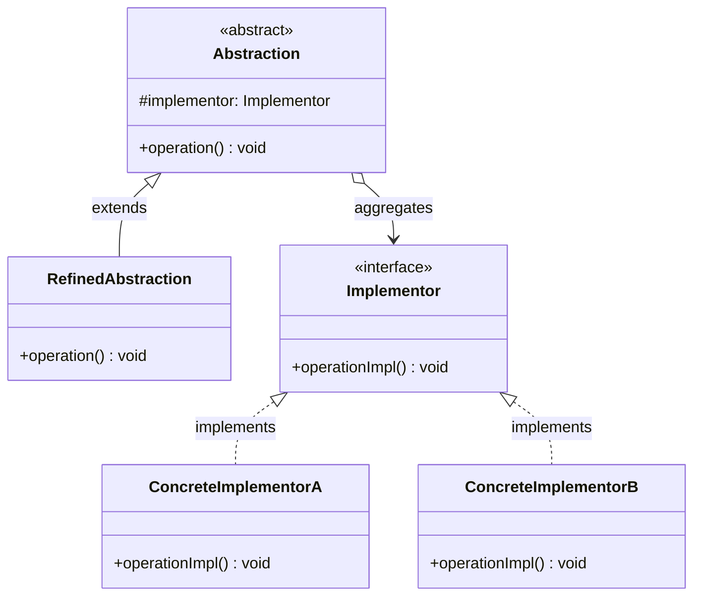
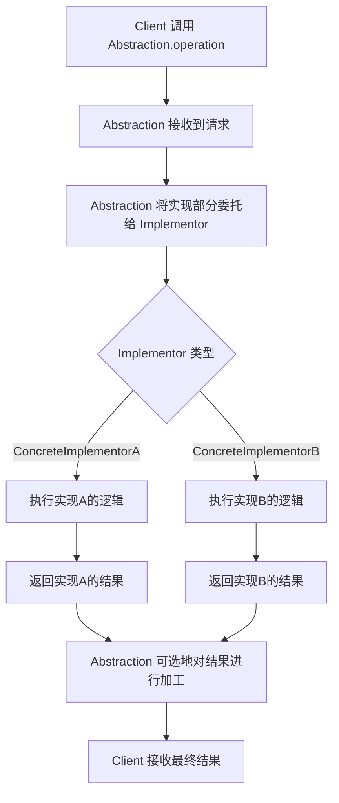
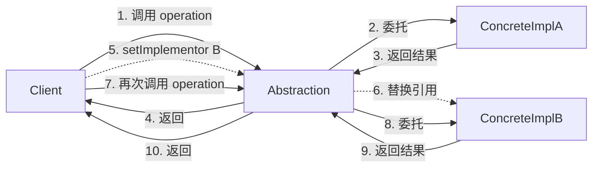

# 桥接模式

## 1. 定义与意图

> 将抽象部分与它的实现部分分离，使它们都可以独立地变化。——GoF

桥接模式（Bridge Pattern）是一种结构型设计模式，其核心思想是：当一个类存在两个或多个独立变化的维度时，通过将这两个维度分离为独立的类层次结构，并在它们之间建立聚合关系（而非继承关系），从而使两个维度可以各自独立扩展而不相互影响。

传统继承方案下，两个变化维度会产生笛卡尔积式的子类爆炸问题。例如，若形状有 3 种、渲染器有 4 种，继承方案需要 3 × 4 = 12 个子类；而桥接模式只需 3 + 4 = 7 个类。当维度增加时，这一优势会进一步扩大（n × m 对 n + m）。

桥接模式在软件开发中的价值体现在三个层面：

- **解耦变化维度**：将两个独立变化的维度分离为各自的类层次，避免继承带来的强耦合
- **独立扩展**：抽象维度和实现维度可以各自新增子类，无需修改对方层次结构的代码
- **运行时切换**：实现部分可以在运行时动态替换，赋予系统更高的灵活性

从工程实践角度看，桥接模式的关键前提是准确识别系统中独立变化的维度。如果在设计阶段无法明确哪些维度会独立变化，过早引入桥接模式反而会增加不必要的复杂度。桥接模式更适合那些维度变化已可预见、且需要频繁组合的场景。

## 2. UML类图



Abstraction 与 Implementor 之间是聚合关系（而非继承），这是桥接模式的核心特征。Abstraction 持有 Implementor 的引用，将与实现相关的操作委托给 Implementor 完成。两个维度通过聚合连接，而非通过继承耦合。

## 3. 核心角色与职责

| 角色 | 职责 | 典型实现方式 |
|------|------|-------------|
| Abstraction | 定义抽象接口，持有 Implementor 引用，将与实现相关的操作委托给 Implementor | TypeScript abstract class |
| RefinedAbstraction | 扩展 Abstraction 的接口，添加特化行为 | 继承 Abstraction 的具体类 |
| Implementor | 定义实现接口，提供基本操作的原语声明 | TypeScript interface |
| ConcreteImplementor | 实现 Implementor 接口，提供具体平台或场景的实现 | 实现 Implementor 的具体类 |

角色间的协作流程：

1. Client 向 Abstraction 对象发送请求
2. Abstraction 将与实现相关的操作转发给 Implementor 引用
3. ConcreteImplementor 执行具体实现并返回结果
4. Abstraction 可选择对结果进行二次加工后返回给 Client
5. 运行时可替换 Implementor 引用，实现动态切换

## 4. 应用场景

### 4.1 通用场景

#### 跨平台 UI 控件

控件类型（按钮、输入框、下拉框）与渲染引擎（Windows、macOS、Linux）是两个独立变化的维度。桥接模式让新增控件或新增平台时无需修改已有代码。

#### 消息通知系统

通知类型（验证码、营销、告警）与发送渠道（邮件、短信、站内信）是两个独立变化的维度。桥接模式使得新增通知类型或渠道时互不影响。

### 4.2 前端框架实战

#### React 跨平台渲染

React 的架构是桥接模式的经典应用。React 组件树（抽象维度）与渲染器（实现维度）完全分离：同一套组件代码可以渲染到 DOM（React DOM）、原生组件（React Native）或 3D 场景（React Three Fiber）。

#### 主题系统

组件（抽象维度）与主题（实现维度）独立变化。新增组件无需关心主题逻辑，新增主题无需修改组件代码。

#### 图表库

图表类型（折线图、柱状图、饼图）与渲染器（Canvas、SVG、WebGL）是两个独立变化的维度。桥接模式让新增图表类型无需关心底层渲染，新增渲染器无需修改已有图表。

## 5. Mermaid流程图



运行时切换实现的流程：



## 6. 优缺点分析

| 优点 | 缺点 |
|------|------|
| 分离抽象与实现，两个维度独立变化 | 增加系统复杂度，引入额外的类和接口 |
| 独立扩展，新增维度不影响另一维度 | 需要准确识别独立变化的维度，误判导致设计偏差 |
| 符合开闭原则（OCP），对扩展开放 | 简单场景下使用桥接属于过度设计 |
| 运行时动态切换实现，灵活性高 | 客户端需要理解两个维度的组合关系 |
| 避免继承带来的类爆炸问题 | 增加了间接调用层次，略微影响性能 |
| 符合单一职责原则，抽象与实现职责分离 | 需要额外的胶水代码将两个维度关联 |

### 使用决策参考

```
是否应该使用桥接模式？

[两个独立变化维度] --> 维度之间是否需要多种组合？
  |-- 否 --> 使用简单继承即可
  |-- 是 --> 维度是否都可能扩展？
       |-- 否 --> 变化少的维度用继承
       |-- 是 --> 是否需要运行时切换实现？
            |-- 是 --> 使用桥接模式
            |-- 否 --> 桥接模式仍然适用，但可简化为策略组合
```

## 7. 相关模式对比

| 对比维度 | 桥接模式 | 适配器模式 | 策略模式 | 抽象工厂模式 |
|----------|---------|-----------|---------|-------------|
| 使用时机 | 设计阶段，预见到多维度变化 | 事后兼容，接口已固化 | 算法族切换，单一维度 | 创建产品族，多个关联对象 |
| 意图 | 分离独立变化维度 | 转换接口使不兼容类协同 | 封装可互换的算法 | 创建一系列相关对象 |
| 接口变化 | 两侧均定义接口 | 转换已有接口 | 不改变接口，替换实现 | 不改变接口，创建产品族 |
| 关系类型 | 聚合（Abstraction 持有 Implementor） | 组合（Adapter 持有 Adaptee） | 组合（Context 持有 Strategy） | 创建（Factory 创建 Product） |
| 变化维度 | 两个维度独立扩展 | 通常是事后补救 | 一个维度（算法） | 产品族维度 |
| 典型场景 | 跨平台渲染、主题系统 | 旧版API兼容 | 排序算法、压缩策略 | 跨数据库组件 |

桥接模式与适配器模式的关键区别：桥接模式在设计阶段使用，目的是分离两个独立变化的维度；适配器模式在事后使用，目的是让已有但不兼容的接口能够协同工作。桥接模式的两个维度在设计之初就已明确，而适配器模式面对的是接口不一致的既成事实。

桥接模式与策略模式的结构高度相似，都通过组合持有实现引用。核心区别在于：桥接模式侧重于两个维度的长期独立扩展，Implementor 接口通常更稳定；策略模式侧重于算法的运行时切换，策略接口通常更灵活。实践中，当两个维度都需要独立扩展时使用桥接，当仅需替换算法时使用策略。

## 8. 总结

桥接模式是处理多维度独立变化问题的标准方案，其核心价值在于：通过将两个独立变化的维度分离为各自的类层次结构，并以聚合关系连接，避免继承带来的类爆炸和强耦合问题。

**何时使用桥接模式：**

- 系统中存在两个或多个独立变化的维度，且这些维度需要多种组合方式
- 需要在运行时动态切换实现，而非编译期静态绑定
- 希望避免永久性地绑定抽象与实现之间的问题（如跨平台场景）
- 类的继承层次过多，且子类呈笛卡尔积式增长
- 需要在多个对象间共享实现，且实现可能变化

**何时不应使用桥接模式：**

- 系统中不存在明显的独立变化维度
- 维度之间的组合方式固定且不会扩展
- 简单场景下引入桥接会增加不必要的复杂度
- 无法确定哪些维度会独立变化时，应推迟决策

**TypeScript 实现要点：**

- 优先使用接口定义 Implementor，保持抽象侧与实现侧的松耦合
- 利用泛型桥接器增强类型安全性，在编译期检查维度组合的合法性
- 依赖注入容器可以管理抽象与实现之间的绑定，支持运行时动态切换
- 桥接模式与策略模式结构相似，但意图不同：桥接关注多维度分离，策略关注算法替换
- Abstraction 中仅包含与实现无关的逻辑，将与实现相关的操作全部委托给 Implementor
- 通过 setImplementor 方法支持运行时切换实现，但需注意状态一致性问题

桥接模式的本质是"组合优于继承"原则的结构化实践。当继承层次过深、子类过多时，应当审视是否存在多个独立变化的维度，若存在则用桥接模式将维度分离，用聚合替代继承，使系统获得更好的可扩展性和可维护性。

---

## TypeScript 实现

### 基础实现

#### 跨平台渲染引擎：Shape（抽象）x Renderer（实现）

Shape 维度负责形状的几何属性（名称、尺寸等），Renderer 维度负责具体的渲染方式（Canvas、SVG、WebGL）。两个维度独立变化，通过桥接模式组合。

```typescript
// ==================== 桥接模式基础实现 ====================

/** Implementor - 渲染器接口 */
interface IRenderer {
  renderCircle(x: number, y: number, radius: number): void;
  renderRectangle(x: number, y: number, width: number, height: number): void;
  renderTriangle(x1: number, y1: number, x2: number, y2: number, x3: number, y3: number): void;
}

/** ConcreteImplementorA - Canvas 渲染器 */
class CanvasRenderer implements IRenderer {
  renderCircle(x: number, y: number, radius: number): void {
    console.log(`[Canvas] 绘制圆形: 圆心(${x}, ${y}), 半径 ${radius}`);
  }
  renderRectangle(x: number, y: number, width: number, height: number): void {
    console.log(`[Canvas] 绘制矩形: 位置(${x}, ${y}), 尺寸 ${width}x${height}`);
  }
  renderTriangle(x1: number, y1: number, x2: number, y2: number, x3: number, y3: number): void {
    console.log(`[Canvas] 绘制三角形: (${x1},${y1}), (${x2},${y2}), (${x3},${y3})`);
  }
}

// ---- 抽象侧 ----
abstract class Shape {
  constructor(protected renderer: IRenderer) {}
  abstract draw(): void;
}

class Circle extends Shape {
  constructor(renderer: IRenderer, private x: number, private y: number, private radius: number) {
    super(renderer);
  }
  draw(): void { this.renderer.renderCircle(this.x, this.y, this.radius); }
}

class Rectangle extends Shape {
  constructor(renderer: IRenderer, private x: number, private y: number, private w: number, private h: number) {
    super(renderer);
  }
  draw(): void { this.renderer.renderRectangle(this.x, this.y, this.w, this.h); }
}

class Triangle extends Shape {
  constructor(renderer: IRenderer,
    private x1: number, private y1: number,
    private x2: number, private y2: number,
    private x3: number, private y3: number) { super(renderer); }
  draw(): void { this.renderer.renderTriangle(this.x1, this.y1, this.x2, this.y2, this.x3, this.y3); }
}

const canvasRenderer = new CanvasRenderer();
const shapes: Shape[] = [
  new Circle(canvasRenderer, 50, 50, 30),
  new Rectangle(canvasRenderer, 10, 20, 200, 100),
  new Triangle(canvasRenderer, 0, 0, 100, 0, 50, 80),
];

shapes.forEach((shape) => shape.draw());
```

### 现代 TypeScript 实现

#### 泛型桥接

通过泛型约束，建立抽象与实现之间的类型安全桥梁，确保编译期即可检查维度组合的合法性。

```typescript
// ==================== 泛型桥接 ====================

/**
 * 泛型桥接器
 * TAbstraction 定义抽象侧的接口，TImplementation 定义实现侧的接口
 * 桥接器持有实现侧的引用，抽象侧通过委托调用实现侧
 */
class Bridge<TAbstraction, TImplementation> {
  private implementation: TImplementation;

  constructor(
    implementation: TImplementation,
    private readonly adapter: (impl: TImplementation) => TAbstraction
  ) {
    this.implementation = implementation;
  }

  get(): TAbstraction {
    return this.adapter(this.implementation);
  }
}

// ==================== 使用 ====================
interface IStorage {
  read(key: string): unknown;
  write(key: string, value: unknown): void;
}

class LocalStorageImpl implements IStorage {
  read(key: string): unknown { return localStorage.getItem(key); }
  write(key: string, value: unknown): void { localStorage.setItem(key, String(value)); }
}

const storageBridge = new Bridge(new LocalStorageImpl(), (impl) => ({
  read: (key: string) => impl.read(key),
  write: (key: string, value: unknown) => impl.write(key, value)
}));

class DataRepository<T> {
  constructor(private storage: { read(key: string): unknown; write(key: string, v: unknown): void }, private prefix: string) {}
  save(id: string, data: T) { this.storage.write(`${this.prefix}:${id}`, data); }
  load(id: string): unknown { return this.storage.read(`${this.prefix}:${id}`); }
}

const repo = new DataRepository<object>(storageBridge.get(), 'myapp');
```

#### 依赖注入实现桥接

利用依赖注入容器管理抽象与实现的绑定关系，在运行时动态解析实现，实现完全解耦。

```typescript
// ==================== 依赖注入桥接 ====================

/** 简易依赖注入容器 */
class DIContainer {
  private bindings: Map<string, { factory: () => unknown; singleton: boolean }> = new Map();
  private instances: Map<string, unknown> = new Map();

  /** 绑定接口到工厂函数 */
  bind<T>(token: string, factory: () => T, singleton: boolean = true): void {
    this.bindings.set(token, { factory, singleton });
  }

  /** 重新绑定（运行时切换实现） */
  rebind<T>(token: string, factory: () => T): void {
    this.bindings.set(token, { factory, singleton: true });
    this.instances.delete(token);
  }

  /** 解析实例 */
  resolve<T>(token: string): T {
    const binding = this.bindings.get(token);
    if (!binding) throw new Error(`未绑定的依赖: ${token}`);
    if (binding.singleton) {
      if (!this.instances.has(token)) {
        this.instances.set(token, binding.factory());
      }
      return this.instances.get(token) as T;
    }
    return binding.factory() as T;
  }
}

// ==================== 使用 ====================
interface IMessageChannel {
  deliver(target: string, content: string): void;
}

class EmailChannel implements IMessageChannel {
  deliver(target: string, content: string): void { console.log(`[邮件] ${target}: ${content}`); }
}
class SmsChannel implements IMessageChannel {
  deliver(target: string, content: string): void { console.log(`[短信] ${target}: ${content}`); }
}

abstract class Notification {
  constructor(protected channel: IMessageChannel) {}
  abstract notify(target: string, payload: unknown): void;
}

class VerificationCodeNotification extends Notification {
  notify(target: string, payload: unknown): void {
    this.channel.deliver(target, `验证码: ${(payload as any).code}`);
  }
}

const container = new DIContainer();
container.bind<IMessageChannel>('MessageChannel', () => new EmailChannel());
container.bind<Notification>('AlertNotification', () => new VerificationCodeNotification(container.resolve<IMessageChannel>('MessageChannel')));

const verification = container.resolve<Notification>('AlertNotification');
verification.notify('user@example.com', { code: '836492' });

// 运行时切换为短信渠道
container.rebind<IMessageChannel>('MessageChannel', () => new SmsChannel());
const alert = container.resolve<Notification>('AlertNotification');
alert.notify('13800138000', { level: '严重', message: 'CPU使用率超过95%' });
```

#### 策略模式组合实现桥接

桥接模式与策略模式结构相似，都通过组合持有实现引用。利用策略模式的思想，可以让桥接的实现切换更加灵活和可配置。

```typescript
// ==================== 策略模式组合桥接 ====================

/** Implementor - 数据加密策略接口 */
interface IEncryptionStrategy {
  encrypt(plaintext: string): string;
  decrypt(ciphertext: string): string;
  getName(): string;
}

/** ConcreteImplementorA - AES 加密 */
class AesEncryption implements IEncryptionStrategy {
  encrypt(plaintext: string): string {
    return `AES(${plaintext})`;
  }
  decrypt(ciphertext: string): string {
    return ciphertext.replace(/^AES\(|\)$/g, "");
  }
  getName(): string { return "AES"; }
}

/** ConcreteImplementorB - RSA 加密 */
class RsaEncryption implements IEncryptionStrategy {
  encrypt(plaintext: string): string {
    return `RSA(${plaintext})`;
  }
  decrypt(ciphertext: string): string {
    return ciphertext.replace(/^RSA\(|\)$/g, "");
  }
  getName(): string { return "RSA"; }
}

/** 抽象侧：带加密能力的文本通道 */
class SecureTextChannel {
  constructor(private encryption: IEncryptionStrategy) {}
  setEncryption(encryption: IEncryptionStrategy) { this.encryption = encryption; }
  send(content: string): string {
    const encrypted = this.encryption.encrypt(content);
    console.log(`[${this.encryption.getName()}] 发送: ${encrypted}`);
    return encrypted;
  }
  receive(ciphertext: string): string {
    return this.encryption.decrypt(ciphertext);
  }
}

const textChannel = new SecureTextChannel(new AesEncryption());
textChannel.send('Sensitive Data'); // AES 加密

// 切换为 RSA 加密
textChannel.setEncryption(new RsaEncryption());
const encrypted = textChannel.send('Top Secret');
textChannel.receive(encrypted);
```

```typescript
// ==================== 跨平台 UI 控件 ====================

/** Implementor - 平台渲染接口 */
interface IPlatformRenderer {
  renderButton(label: string, onClick: () => void): HTMLElement;
  renderInput(placeholder: string, onChange: (value: string) => void): HTMLElement;
  renderSelect(options: string[], onSelect: (value: string) => void): HTMLElement;
}

/** ConcreteImplementorA - Windows 风格 */
class WindowsRenderer implements IPlatformRenderer {
  renderButton(label: string, onClick: () => void): HTMLElement {
    const btn = document.createElement('button');
    btn.textContent = label;
    btn.className = 'win-btn';
    btn.addEventListener('click', onClick);
    return btn;
  }
  renderInput(placeholder: string, onChange: (value: string) => void): HTMLElement {
    const input = document.createElement('input');
    input.placeholder = placeholder;
    input.className = 'win-input';
    input.addEventListener('input', (e) => onChange((e.target as HTMLInputElement).value));
    return input;
  }
  renderSelect(options: string[], onSelect: (value: string) => void): HTMLElement {
    const select = document.createElement('select');
    options.forEach((opt) => { const o = document.createElement('option'); o.textContent = opt; select.appendChild(o); });
    select.addEventListener('change', (e) => onSelect((e.target as HTMLSelectElement).value));
    return select;
  }
}

// ---- 抽象侧 ----
abstract class UIWidget {
  constructor(protected renderer: IPlatformRenderer) {}
  abstract render(): HTMLElement;
}

class Button extends UIWidget {
  constructor(renderer: IPlatformRenderer, private label: string, private onClick: () => void) { super(renderer); }
  render(): HTMLElement { return this.renderer.renderButton(this.label, this.onClick); }
}

class InputField extends UIWidget {
  constructor(renderer: IPlatformRenderer, private placeholder: string, private onChange: (v: string) => void) { super(renderer); }
  render(): HTMLElement { return this.renderer.renderInput(this.placeholder, this.onChange); }
}

const windowsUI: UIWidget[] = [
  new Button(new WindowsRenderer(), 'Submit', () => console.log('clicked')),
  new InputField(new WindowsRenderer(), 'Enter name', (v) => console.log(v)),
];

windowsUI.forEach((widget) => document.body.appendChild(widget.render()));
```

```typescript
// ==================== 消息通知系统 ====================

/** Implementor - 发送渠道接口 */
interface ISendChannel {
  deliver(target: string, subject: string, body: string): Promise<void>;
}

/** ConcreteImplementorA - 邮件 */
class EmailSendChannel implements ISendChannel {
  async deliver(target: string, subject: string, body: string): Promise<void> {
    console.log(`[邮件] 发至: ${target}, 主题: ${subject}, 内容: ${body}`);
  }
}

/** ConcreteImplementorB - 短信 */
class SmsSendChannel implements ISendChannel {
  async deliver(target: string, subject: string, body: string): Promise<void> {
    console.log(`[短信] 发至: ${target}, 内容: ${body}`);
  }
}

// ---- 抽象侧 ----
abstract class Notification {
  constructor(protected channel: ISendChannel) {}
  abstract send(target: string, payload: Record<string, unknown>): Promise<void>;
}

class VerificationCodeNotification extends Notification {
  async send(target: string, payload: Record<string, unknown>): Promise<void> {
    await this.channel.deliver(target, '验证码', `您的验证码是 ${payload.code}`);
  }
}

class PromoNotification extends Notification {
  async send(target: string, payload: Record<string, unknown>): Promise<void> {
    await this.channel.deliver(target, payload.title as string, payload.detail as string);
  }
}

// 同一通知类型切换渠道
const promoByEmail = new PromoNotification(new EmailSendChannel());
promoByEmail.send('user@example.com', { title: '双11特惠', detail: '全场5折起' });

const promoBySms = new PromoNotification(new SmsSendChannel());
promoBySms.send('13800138000', { title: '双11特惠', detail: '全场5折起' });
```

```typescript
// ==================== React 跨平台渲染桥接原理 ====================

/** Implementor - 渲染器接口（模拟 React Reconciler） */
interface IReactRenderer {
  createElement(type: string, props: Record<string, unknown>): unknown;
  insertNode(parent: unknown, node: unknown, before?: unknown): void;
  removeNode(parent: unknown, node: unknown): void;
  updateNode(node: unknown, oldProps: Record<string, unknown>, newProps: Record<string, unknown>): void;
}

/** ConcreteImplementorA - DOM 渲染器 */
class DomRenderer implements IReactRenderer {
  createElement(type: string, props: Record<string, unknown>): unknown {
    const el = document.createElement(type);
    Object.entries(props).forEach(([k, v]) => el.setAttribute(k, String(v)));
    return el;
  }
  insertNode(parent: unknown, node: unknown): void {
    (parent as HTMLElement).appendChild(node as HTMLElement);
  }
  removeNode(parent: unknown, node: unknown): void {
    (parent as HTMLElement).removeChild(node as HTMLElement);
  }
  updateNode(node: unknown, oldProps: Record<string, unknown>, newProps: Record<string, unknown>): void {
    const el = node as HTMLElement;
    Object.keys(oldProps).forEach((k) => el.removeAttribute(k));
    Object.entries(newProps).forEach(([k, v]) => el.setAttribute(k, String(v)));
  }
}

// ---- 抽象侧：跨平台组件 ----
abstract class Component {
  constructor(protected renderer: IReactRenderer) {}
  abstract mount(parent: unknown): void;
}

class ViewComponent extends Component {
  constructor(renderer: IReactRenderer, private text: string) { super(renderer); }
  mount(parent: unknown): void {
    const node = this.renderer.createElement('div', {});
    (node as HTMLElement).textContent = this.text;
    this.renderer.insertNode(parent, node);
  }
}

const domRenderer = new DomRenderer();
const domView = new ViewComponent(domRenderer, 'Hello DOM');
domView.mount(document.body);

/** ConcreteImplementorB - Native 渲染器（模拟 React Native） */
class NativeRenderer implements IReactRenderer {
  createElement(type: string, props: Record<string, unknown>): unknown {
    return { type, props, children: [] as unknown[] };
  }
  insertNode(parent: unknown, node: unknown): void {
    (parent as { children: unknown[] }).children.push(node);
  }
  removeNode(parent: unknown, node: unknown): void {
    const children = (parent as { children: unknown[] }).children;
    const index = children.indexOf(node);
    if (index >= 0) children.splice(index, 1);
  }
  updateNode(node: unknown, oldProps: Record<string, unknown>, newProps: Record<string, unknown>): void {
    Object.assign(node as Record<string, unknown>, { props: newProps });
  }
}

// Native 渲染
const nativeRoot = { type: 'RootView', props: {}, children: [] };
const nativeView = new ViewComponent(new NativeRenderer(), 'Hello Native');
nativeView.mount(nativeRoot);
```

```typescript
// ==================== 主题系统桥接 ====================

/** Implementor - 主题接口 */
interface ITheme {
  colors: {
    primary: string;
    secondary: string;
    background: string;
    surface: string;
    text: string;
    error: string;
  };
  name: string;
}

/** ConcreteImplementorA - 亮色主题 */
class LightTheme implements ITheme {
  name = 'light';
  colors = { primary: '#1976d2', secondary: '#dc004e', background: '#fafafa', surface: '#ffffff', text: '#212121', error: '#d32f2f' };
}

/** ConcreteImplementorB - 暗色主题 */
class DarkTheme implements ITheme {
  name = 'dark';
  colors = { primary: '#90caf9', secondary: '#f48fb1', background: '#121212', surface: '#1e1e1e', text: '#e0e0e0', error: '#f44336' };
}

// ---- 抽象侧 ----
abstract class ThemedComponent {
  constructor(protected theme: ITheme) {}
  setTheme(theme: ITheme) { this.theme = theme; }
  abstract render(): string;
}

class CardComponent extends ThemedComponent {
  constructor(theme: ITheme, private title: string, private content: string) { super(theme); }
  render(): string {
    const c = this.theme.colors;
    return `<div style="background:${c.surface};color:${c.text};border:1px solid ${c.primary}">
      <h3>${this.title}</h3><p>${this.content}</p></div>`;
  }
}

// 使用示例
const card = new CardComponent(new LightTheme(), '欢迎', '这是卡片内容');
console.log(card.render());

card.setTheme(new DarkTheme());
console.log(card.render());
```

```typescript
// ==================== 图表库桥接 ====================

/** Implementor - 图表渲染器接口 */
interface IChartRenderer {
  drawLine(points: Array<{ x: number; y: number }>, color: string, width: number): void;
  drawRect(x: number, y: number, width: number, height: number, color: string): void;
  drawArc(cx: number, cy: number, radius: number, startAngle: number, endAngle: number, color: string): void;
  clear(): void;
  getName(): string;
}

/** ConcreteImplementorA - Canvas 渲染器 */
class CanvasChartRenderer implements IChartRenderer {
  drawLine(points: Array<{ x: number; y: number }>, color: string, width: number): void {
    console.log(`[Canvas] 折线: ${points.length} 点, ${color}, 宽 ${width}`);
  }
  drawRect(x: number, y: number, width: number, height: number, color: string): void {
    console.log(`[Canvas] 矩形: (${x},${y}) ${width}x${height}, ${color}`);
  }
  drawArc(cx: number, cy: number, radius: number, start: number, end: number, color: string): void {
    console.log(`[Canvas] 弧线: 圆心(${cx},${cy}) 半径${radius}, ${color}`);
  }
  clear(): void { console.log('[Canvas] 清空画布'); }
  getName(): string { return 'Canvas'; }
}

/** ConcreteImplementorB - SVG 渲染器 */
class SvgChartRenderer implements IChartRenderer {
  drawLine(points: Array<{ x: number; y: number }>, color: string, width: number): void {
    console.log(`[SVG] 折线: ${points.length} 点, ${color}, 宽 ${width}`);
  }
  drawRect(x: number, y: number, width: number, height: number, color: string): void {
    console.log(`[SVG] 矩形: (${x},${y}) ${width}x${height}, ${color}`);
  }
  drawArc(cx: number, cy: number, radius: number, start: number, end: number, color: string): void {
    console.log(`[SVG] 弧线: 圆心(${cx},${cy}) 半径${radius}, ${color}`);
  }
  clear(): void { console.log('[SVG] 清空'); }
  getName(): string { return 'SVG'; }
}

// ---- 抽象侧 ----
abstract class Chart {
  constructor(protected renderer: IChartRenderer) {}
  setRenderer(renderer: IChartRenderer) { this.renderer = renderer; }
  abstract render(data: unknown): void;
}

class BarChart extends Chart {
  render(data: unknown): void {
    this.renderer.clear();
    this.renderer.drawRect(0, 0, 100, 50, '#1976d2');
    console.log('渲染柱状图数据:', data);
  }
}

class LineChart extends Chart {
  render(data: unknown): void {
    this.renderer.clear();
    this.renderer.drawLine([{ x: 0, y: 0 }, { x: 100, y: 80 }], '#000', 2);
    console.log('渲染折线图数据:', data);
  }
}

const data = [10, 20, 15, 30];
const barChart = new BarChart(new SvgChartRenderer());
barChart.render(data);

// 运行时切换渲染器
const lineChart = new LineChart(new CanvasChartRenderer());
lineChart.setRenderer(new SvgChartRenderer());
lineChart.render(data);
```

---

## Java 实现

### 桥接模式（抽象与实现分离，独立变化）

```java
// 实现维度：设备
interface Device {
    void enable();
    void disable();
    boolean isEnabled();
}

// 具体实现：电视、收音机
class TV implements Device {
    private boolean on = false;
    public void enable() { on = true; System.out.println("电视开机"); }
    public void disable() { on = false; System.out.println("电视关机"); }
    public boolean isEnabled() { return on; }
}

class Radio implements Device {
    private boolean on = false;
    public void enable() { on = true; System.out.println("收音机开机"); }
    public void disable() { on = false; System.out.println("收音机关机"); }
    public boolean isEnabled() { return on; }
}

// 抽象维度：遥控器，持有设备引用（桥接点）
abstract class Remote {
    protected Device device;

    protected Remote(Device device) {
        this.device = device;
    }

    public abstract void power();
}

// 扩展抽象：高级遥控器
class AdvancedRemote extends Remote {
    public AdvancedRemote(Device device) {
        super(device);
    }

    @Override
    public void power() {
        if (device.isEnabled()) device.disable();
        else device.enable();
    }

    public void mute() {
        System.out.println("静音");
    }
}

// 使用：遥控器与设备两个维度可自由组合
public class Client {
    public static void main(String[] args) {
        Device tv = new TV();
        Remote remote = new AdvancedRemote(tv);   // 遥控器控制电视
        remote.power();

        Device radio = new Radio();
        Remote radioRemote = new AdvancedRemote(radio); // 同一遥控器控制收音机
        radioRemote.power();
    }
}
```

> 桥接模式用"组合"代替"继承"，将"抽象"与"实现"两个独立维度解耦，各自可独立扩展。相比为每种组合建一个类（电视遥控、收音机遥控…），桥接避免类爆炸。

## Python 实现

### 桥接模式

```python
from abc import ABC, abstractmethod

# 实现维度：设备
class Device(ABC):
    @abstractmethod
    def enable(self):
        pass

    @abstractmethod
    def disable(self):
        pass

    @abstractmethod
    def is_enabled(self) -> bool:
        pass

class TV(Device):
    def __init__(self):
        self._on = False

    def enable(self):
        self._on = True
        print("电视开机")

    def disable(self):
        self._on = False
        print("电视关机")

    def is_enabled(self) -> bool:
        return self._on

class Radio(Device):
    def __init__(self):
        self._on = False

    def enable(self):
        self._on = True
        print("收音机开机")

    def disable(self):
        self._on = False
        print("收音机关机")

    def is_enabled(self) -> bool:
        return self._on

# 抽象维度：遥控器，持有设备引用
class Remote(ABC):
    def __init__(self, device: Device):
        self._device = device

    @abstractmethod
    def power(self):
        pass

class AdvancedRemote(Remote):
    def power(self):
        if self._device.is_enabled():
            self._device.disable()
        else:
            self._device.enable()

    def mute(self):
        print("静音")

# 使用：两维度自由组合
tv = TV()
AdvancedRemote(tv).power()

radio = Radio()
AdvancedRemote(radio).power()
```

> Python 用 `abc.ABC` 定义抽象接口。桥接模式的核心是"组合优于继承"，将多维度的变化解耦，避免笛卡尔积式的类膨胀。

