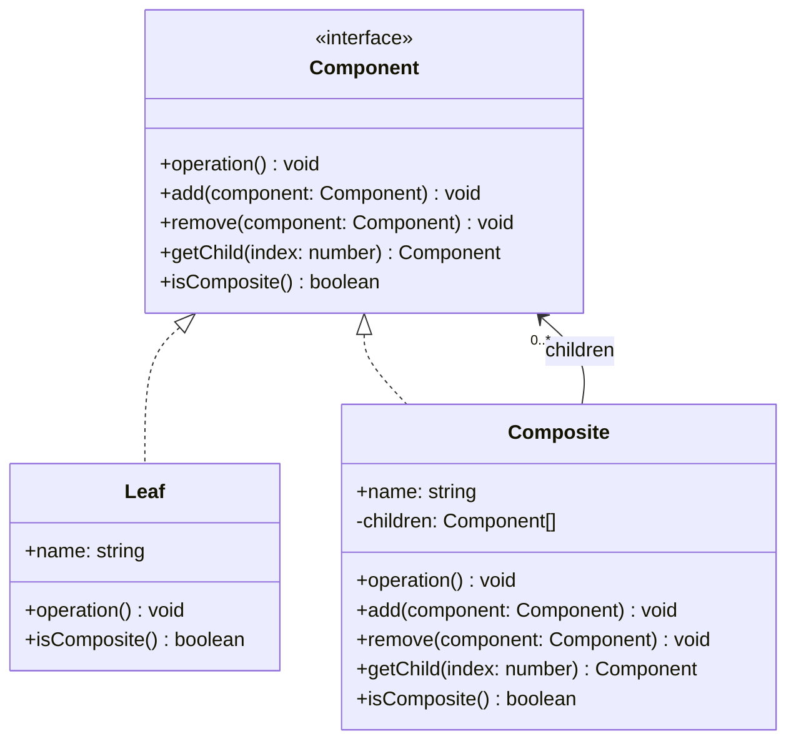
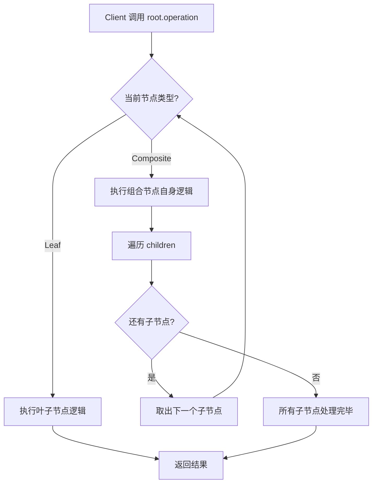

# 组合模式

## 1. 定义与意图

> 将对象组合成树形结构以表示"部分-整体"的层次结构。组合模式使得用户对单个对象和组合对象的使用具有一致性。-- GoF

组合模式（Composite Pattern）是一种结构型设计模式，核心思想在于：客户端无需关心处理的是单个对象（Leaf）还是组合对象（Composite），两者共享统一接口，递归组合即可构建任意深度的树形结构。

**三个关键前提：**

1. 系统中存在明显的"部分-整体"层次关系
2. 希望统一对待单个对象与组合对象，消除 if/else 类型判断
3. 树形结构相对稳定，不频繁变更节点类型

---

## 2. UML 类图



**结构说明：**

- `Component` 声明统一接口，Leaf 与 Composite 均实现该接口
- `Leaf` 不含子节点，`add` / `remove` / `getChild` 抛出异常或空操作
- `Composite` 持有 `children: Component[]`，将操作委托给所有子节点

---

## 3. 核心角色与职责

| 角色 | 职责 |
|------|------|
| Component（组件） | 声明叶子与容器的公共接口，定义操作子节点的方法（add/remove/getChild）以及业务操作（operation） |
| Leaf（叶子） | 无子节点，实现 Component 的业务操作；add/remove 通常抛出异常或空操作 |
| Composite（复合节点） | 持有子节点集合，实现统一接口并递归委托给所有子节点 |

## 4. 应用场景

### 4.1 通用场景

#### 4.1.1 文件系统

文件与目录共享 `FileSystemNode` 接口，客户端统一调用 `getSize()` 和 `display()`，无需区分文件还是目录。

#### 4.1.2 组织架构

### 4.2 前端框架实战

#### 4.2.1 React 组件树

React 组件架构天然符合组合模式：每个组件都是 Component，可以嵌套子组件。容器组件对应 Composite，纯展示组件对应 Leaf。

#### 4.2.2 Vue 虚拟 DOM

Vue 的 VNode 树形结构是组合模式的经典体现：文本节点为 Leaf，元素节点为 Composite。

#### 4.2.3 菜单系统

菜单项为 Leaf，菜单组（含子菜单）为 Composite。

#### 4.2.4 表单验证

单个验证规则为 Leaf，验证规则组为 Composite。统一接口 `validate(): ValidationResult`。

---

## 5. Mermaid 流程图

组合模式树形遍历的完整流程：



**遍历策略对比：**

| 策略 | 数据结构 | 适用场景 | 时间复杂度 |
|------|----------|----------|------------|
| 深度优先（DFS） | 栈 / 递归 | 需要完整路径、层级优先 | O(n) |
| 广度优先（BFS） | 队列 | 同层节点优先处理 | O(n) |

---

## 6. 优缺点分析

| 优点 | 缺点 |
|------|------|
| 统一处理单个和组合对象，消除类型判断 | 难以限制组合中的组件类型（运行时才能校验） |
| 简化客户端代码，新增组件无需修改调用方 | 增加设计复杂度，需精心设计 Component 接口 |
| 易于新增组件类型，符合开闭原则 | 运行时类型检查困难，透明式下 Leaf 调用 add 会抛异常 |
| 天然支持递归结构，与树形数据高度契合 | 深层嵌套可能导致栈溢出，需迭代替代递归 |

---

## 7. 相关模式对比

| 对比维度 | 组合模式 | 装饰器模式 |
|----------|----------|------------|
| **结构** | 树形（一个 Composite 含多个子 Component） | 链式（一个 Decorator 包裹一个 Component） |
| **意图** | 表示"部分-整体"层次结构 | 动态增强单个对象功能 |
| **子节点数量** | 多个子节点 | 恰好一个被装饰对象 |
| **典型场景** | 文件系统、UI 组件树 | 日志装饰、缓存装饰、权限装饰 |
| **接口一致性** | Leaf 与 Composite 共享接口 | Decorator 与 Component 共享接口 |

**其他相关模式：**

| 模式 | 与组合模式的关系 |
|------|------------------|
| **迭代器模式** | 可为组合结构提供 DFS / BFS 遍历迭代器，隐藏递归细节 |
| **访问者模式** | 在不修改 Component 的前提下为树形结构添加新操作 |
| **建造者模式** | 分步构建复杂组合结构，提供流畅 API |
| **命令模式** | 宏命令（MacroCommand）是组合模式与命令模式的结合 |

---

## 8. 总结

组合模式的本质是**用统一接口抹平"单个对象"与"对象集合"的差异**，使客户端代码无需关心当前操作的是 Leaf 还是 Composite。这一特性使其在以下场景中具有不可替代的价值：

1. **文件系统 / 组织架构**：天然树形结构，递归聚合计算（大小、人数、预算）
2. **React / Vue 组件树**：容器组件与叶子组件共享渲染接口，递归构建 Virtual DOM
3. **菜单系统**：菜单项与菜单组统一 display / execute 接口
4. **表单验证**：单条规则与规则组统一 validate 接口，递归收集错误

**设计决策要点：**

- 选择透明式还是安全式，取决于客户端是否需要区分 Leaf 与 Composite
- 深层树结构应使用迭代代替递归，避免栈溢出
- 泛型接口 `CompositeComponent<T>` 可提升复用性，配合 Iterator 可实现多种遍历策略
- Discriminated Union 可在 TypeScript 层面实现编译期类型安全

> 组合模式是结构型模式中与前端开发关联最紧密的模式之一。理解其"统一接口 + 递归委托"的核心机制，是掌握 React 组件树、Vue VNode 树、DOM 树等前端基础设施的关键。

---

## TypeScript 实现

### 基础实现 -- 文件系统

以文件系统为经典场景：File 为 Leaf，Directory 为 Composite，统一接口 getSize() 与 display()。

```typescript
// ---- Component 接口 ----
interface FileSystemNode {
  readonly name: string;
  getSize(): number;
  display(indent?: number): void;
}

// ---- Leaf: 文件 ----
class File implements FileSystemNode {
  constructor(public readonly name: string, private readonly size: number) {}

  getSize(): number {
    return this.size;
  }

  display(indent: number = 0): void {
    const prefix = '  '.repeat(indent);
    console.log(`${prefix}- ${this.name} [${this.size} KB]`);
  }
}

// ---- Composite: 目录 ----
class Directory implements FileSystemNode {
  private children: FileSystemNode[] = [];

  constructor(public readonly name: string) {}

  add(node: FileSystemNode): this {
    this.children.push(node);
    return this;
  }

  getSize(): number {
    return this.children.reduce((sum, child) => sum + child.getSize(), 0);
  }

  display(indent: number = 0): void {
    const prefix = '  '.repeat(indent);
    console.log(`${prefix}+ ${this.name}/ [${this.getSize()} KB]`);
    this.children.forEach((child) => child.display(indent + 1));
  }
}

// ---- 使用 ----
const root = new Directory('src')
  .add(new File('index.ts', 3))
  .add(new File('App.tsx', 8))
  .add(
    new Directory('components')
      .add(new File('Button.tsx', 5))
      .add(new File('Input.tsx', 4))
  );

root.display();
// + src/ [20 KB]
//   - index.ts [3 KB]
//   - App.tsx [8 KB]
//   + components/ [9 KB]
//     - Button.tsx [5 KB]
//     - Input.tsx [4 KB]

console.log(`Total size: ${root.getSize()} KB`); // Total size: 20 KB
```

### 现代 TypeScript 实现

#### 4.2.1 泛型组合接口

```typescript
interface CompositeComponent<T> {
  readonly data: T;
  readonly children: ReadonlyArray<CompositeComponent<T>>;
  readonly parent: CompositeComponent<T> | null;
  addChild(node: CompositeComponent<T>): void;
  removeChild(node: CompositeComponent<T>): boolean;
  traverse(callback: (node: CompositeComponent<T>, depth: number) => void): void;
  find(predicate: (node: CompositeComponent<T>) => boolean): CompositeComponent<T> | null;
}
```

#### 4.2.2 递归类型实现树形结构

```typescript
type TreeNode<T> = {
  readonly id: string;
  readonly data: T;
  readonly children: TreeNode<T>[];
};

// 递归构建辅助函数
function createTreeNode<T>(id: string, data: T, children: TreeNode<T>[] = []): TreeNode<T> {
  return { id, data, children };
}

// 递归遍历
function traverseTree<T>(node: TreeNode<T>, callback: (node: TreeNode<T>, depth: number) => void, depth = 0): void {
  callback(node, depth);
  node.children.forEach((child) => traverseTree(child, callback, depth + 1));
}

// ---- 使用：组织架构 ----
type DepartmentData = { name: string; headcount: number };
const orgTree: TreeNode<DepartmentData> = createTreeNode('root', { name: '总公司', headcount: 0 }, [
  createTreeNode('eng', { name: '研发部', headcount: 50 }, [
    createTreeNode('fe', { name: '前端组', headcount: 20 }),
    createTreeNode('be', { name: '后端组', headcount: 30 }),
  ]),
  createTreeNode('mkt', { name: '市场部', headcount: 40 }),
  createTreeNode('hr', { name: '人事部', headcount: 27 }),
]);

// 计算总人数
let totalHeadcount = 0;
traverseTree(orgTree, (node) => {
  totalHeadcount += node.data.headcount;
});
console.log(`Total headcount: ${totalHeadcount}`); // Total headcount: 167
```

#### 4.2.3 Iterator 实现组合遍历

```typescript
// 深度优先迭代器
class DepthFirstIterator<T> implements Iterator<CompositeComponent<T>> {
  private readonly stack: Array<{ node: CompositeComponent<T>; childIndex: number }>;

  constructor(root: CompositeComponent<T>) {
    this.stack = [{ node: root, childIndex: 0 }];
  }

  next(): IteratorResult<CompositeComponent<T>> {
    while (this.stack.length > 0) {
      const top = this.stack[this.stack.length - 1];
      const { node, childIndex } = top;

      // 当前节点子节点未遍历完，压入下一个子节点
      if (childIndex < node.children.length) {
        top.childIndex++;
        this.stack.push({ node: node.children[childIndex], childIndex: 0 });
      } else {
        // 子节点遍历完毕，弹出并返回当前节点
        this.stack.pop();
        return { value: node, done: false };
      }
    }
    return { value: undefined as unknown, done: true };
  }

  [Symbol.iterator]() { return this; }
}

// 广度优先迭代器
class BreadthFirstIterator<T> implements Iterator<CompositeComponent<T>> {
  private readonly queue: Array<CompositeComponent<T>> = [];
  constructor(root: CompositeComponent<T>) { this.queue.push(root); }

  next(): IteratorResult<CompositeComponent<T>> {
    const node = this.queue.shift();
    if (!node) return { value: undefined as unknown, done: true };
    node.children.forEach((child) => this.queue.push(child));
    return { value: node, done: false };
  }

  [Symbol.iterator]() { return this; }
}

// 为组合节点附加迭代器支持
class IterableComposite<T> implements CompositeComponent<T> {
  readonly data: T;
  readonly children: CompositeComponent<T>[] = [];
  readonly parent: CompositeComponent<T> | null = null;
  constructor(data: T, parent: CompositeComponent<T> | null = null) { this.data = data; this.parent = parent; }
  addChild(node: CompositeComponent<T>): void { this.children.push(node); }
  removeChild(node: CompositeComponent<T>): boolean {
    const idx = this.children.indexOf(node);
    if (idx >= 0) { this.children.splice(idx, 1); return true; }
    return false;
  }
  traverse(callback: (node: CompositeComponent<T>, depth: number) => void): void {
    const walk = (node: CompositeComponent<T>, depth: number) => {
      callback(node, depth);
      node.children.forEach((child) => walk(child, depth + 1));
    };
    walk(this, 0);
  }
  find(predicate: (node: CompositeComponent<T>) => boolean): CompositeComponent<T> | null {
    let found: CompositeComponent<T> | null = null;
    this.traverse((node) => { if (!found && predicate(node)) found = node; });
    return found;
  }

  // 获取 BFS 迭代器
  bfs(): Iterator<CompositeComponent<T>> {
    return new BreadthFirstIterator(this);
  }
}
```

#### 4.2.4 类型安全的 Discriminated Union 实现

```typescript
// 使用 discriminated union 实现类型安全的组合
type NodeType = 'leaf' | 'composite';

interface BaseNode {
  readonly type: NodeType;
  readonly name: string;
  execute(): void;
}

interface LeafNode extends BaseNode {
  readonly type: 'leaf';
}

interface CompositeNode extends BaseNode {
  readonly type: 'composite';
  readonly children: Node[];
}

type Node = LeafNode | CompositeNode;

// 类型守卫
function isComposite(node: Node): node is CompositeNode {
  return node.type === 'composite';
}

// 工厂函数
function createLeaf(name: string, execute: () => void): LeafNode {
  return { type: 'leaf', name, execute };
}

function createComposite(name: string, children: Node[]): CompositeNode {
  return { type: 'composite', name, execute: () => children.forEach((c) => c.execute()), children };
}

function processNode(node: Node): void {
  node.execute();
  if (isComposite(node)) {
    node.children.forEach(processNode);
  }
}
```

---

```typescript
interface OrgComponent {
  readonly name: string;
  getHeadcount(): number;
  getBudget(): number;
  print(indent?: number): void;
}

class Employee implements OrgComponent {
  constructor(
    public readonly name: string,
    private readonly title: string,
    private readonly salary: number
  ) {}

  getHeadcount(): number { return 1; }
  getBudget(): number { return this.salary; }
  print(indent: number = 0): void {
    console.log(`${'  '.repeat(indent)}- ${this.name} (${this.title})`);
  }
}

// ---- Composite: 部门 ----
class Department implements OrgComponent {
  private members: OrgComponent[] = [];
  constructor(public readonly name: string) {}

  add(member: OrgComponent): this {
    this.members.push(member);
    return this;
  }
  getHeadcount(): number {
    return this.members.reduce((sum, m) => sum + m.getHeadcount(), 0);
  }
  getBudget(): number {
    return this.members.reduce((sum, m) => sum + m.getBudget(), 0);
  }
  print(indent: number = 0): void {
    console.log(`${'  '.repeat(indent)}+ ${this.name} [${this.getHeadcount()}人]`);
    this.members.forEach((m) => m.print(indent + 1));
  }
}

// ---- 使用 ----
const company = new Department('总公司');
const eng = new Department('研发部');
const mkt = new Department('市场部');
eng.add(new Employee('李雷', '前端工程师', 20000)).add(new Employee('韩梅梅', '后端工程师', 25000));
mkt.add(new Employee('Tom', '市场专员', 15000));
company.add(eng).add(mkt);

company.print();
console.log(`Total headcount: ${company.getHeadcount()}`);
console.log(`Total budget: ${company.getBudget()}`);
```

```typescript
import React, { ReactNode, Children, isValidElement } from 'react';

// 组合模式在 React 中的体现
// 1. 容器组件（Composite）：接受 children，负责布局和状态分发
// 2. 叶子组件（Leaf）：纯展示，不接受 children

// 容器组件：统一遍历与操作子组件
function CompositeContainer({
  children,
  onChildRender,
}: {
  children: ReactNode;
  onChildRender?: (child: ReactNode) => ReactNode;
}) {
  // 遍历所有子元素，允许统一包装或增强
  const processed = Children.map(children, (child, index) =>
    onChildRender ? onChildRender(child) : <section key={index}>{child}</section>
  );
  return <div className="container">{processed}</div>;
}

// 叶子组件：纯展示，不接受 children
function LeafItem({ label }: { label: string }) {
  return <div className="leaf-item">{label}</div>;
}

// 组合使用
function App() {
  return (
    <CompositeContainer>
      <LeafItem label="Root" />
      <CompositeContainer>
        <LeafItem label="Sub-A" />
        <LeafItem label="Sub-B" />
      </CompositeContainer>
    </CompositeContainer>
  );
}
```

```typescript
// 简化的 VNode 类型
interface VNode {
  tag: string | null;       // null 表示文本节点
  data: Record<string, any> | null;
  children: VNode[] | null;
  text: string | null;
  elm: Element | null;      // 真实 DOM 引用
}

// 创建文本节点（Leaf）
function createTextVNode(text: string): VNode {
  return { tag: null, data: null, children: null, text, elm: null };
}

// 创建元素节点（Composite）
function createElementVNode(tag: string, data: Record<string, any> | null, children: VNode[]): VNode {
  return { tag, data, children, text: null, elm: null };
}

// 渲染 VNode 为真实 DOM（递归处理子节点）
function renderVNode(vnode: VNode): Element | Text {
  if (vnode.text !== null) {
    return document.createTextNode(vnode.text);
  }
  const el = document.createElement(vnode.tag!);
  vnode.children?.forEach((child) => el.appendChild(renderVNode(child)));
  vnode.elm = el;
  return el;
}

// ---- 使用 ----
const vnode = createElementVNode('ul', null, [
  createElementVNode('li', null, [createTextVNode('Item 1')]),
  createElementVNode('li', null, [createTextVNode('Item 2')]),
]);

// document.body.appendChild(renderVNode(vnode));
```

```typescript
interface MenuNode {
  readonly label: string;
  readonly enabled: boolean;
  execute(): void;
  display(indent?: number): void;
}

class MenuItem implements MenuNode {
  constructor(
    public readonly label: string,
    public readonly enabled: boolean = true,
    private readonly action?: () => void,
    private readonly shortcut?: string
  ) {}

  execute(): void {
    if (this.enabled) this.action?.();
  }
  display(indent: number = 0): void {
    console.log(`${'  '.repeat(indent)}- ${this.label}${this.shortcut ? ` (${this.shortcut})` : ''}`);
  }
}

// ---- Composite: 菜单组 ----
class MenuGroup implements MenuNode {
  private items: MenuNode[] = [];
  constructor(public readonly label: string, public readonly enabled: boolean = true) {}

  add(item: MenuNode): this {
    this.items.push(item);
    return this;
  }
  execute(): void { this.items.forEach((item) => item.execute()); }
  display(indent: number = 0): void {
    console.log(`${'  '.repeat(indent)}+ ${this.label}`);
    this.items.forEach((item) => item.display(indent + 1));
  }
}

// ---- 使用 ----
const menuBar = new MenuGroup('菜单栏');
const fileMenu = new MenuGroup('文件')
  .add(new MenuItem('新建', true, () => console.log('新建'), 'Ctrl+N'))
  .add(new MenuItem('打开', true, () => console.log('打开'), 'Ctrl+O'))
  .add(new MenuItem('保存', true, () => console.log('保存'), 'Ctrl+S'));
const editMenu = new MenuGroup('编辑')
  .add(new MenuItem('Undo', true, () => console.log('undo'), 'Ctrl+Z'))
  .add(new MenuItem('Redo', true, () => console.log('redo'), 'Ctrl+Y'));

menuBar.add(fileMenu).add(editMenu);
menuBar.display();
```

```typescript
interface ValidationResult {
  readonly valid: boolean;
  readonly errors: string[];
}

interface Validator extends ValidationResult {
  readonly label: string;
  validate(): ValidationResult;
}

// Leaf: 单个验证规则
class RequiredValidator implements Validator {
  readonly label: string;
  readonly valid: boolean;
  readonly errors: string[];
  constructor(private value: unknown, label = '字段') {
    this.label = label;
    this.valid = this.value !== null && this.value !== undefined && this.value !== '';
    this.errors = this.valid ? [] : [`${label} is required`];
  }
  validate(): ValidationResult { return { valid: this.valid, errors: this.errors }; }
}

// ---- Composite: 表单验证器 ----
class FormValidator implements Validator {
  readonly label = 'form';
  readonly valid: boolean;
  readonly errors: string[];
  private validators: Validator[] = [];

  constructor() {
    this.valid = true;
    this.errors = [];
  }

  add(validator: Validator): this {
    this.validators.push(validator);
    return this;
  }
  validate(): ValidationResult {
    const results = this.validators.map((v) => v.validate());
    const errors = results.flatMap((r) => r.errors);
    return { valid: errors.length === 0, errors };
  }
}

// ---- 使用 ----
const formValidator = new FormValidator();
const nameValidator = new RequiredValidator('李雷', 'Name');
const emailValidator = new RequiredValidator('', 'Email');

formValidator.add(nameValidator).add(emailValidator);

const result = formValidator.validate();
console.log(result);
// { valid: false, errors: ['Email is required'] }
```

---

## Java 实现

### 组合模式（树形结构的统一处理）

```java
import java.util.ArrayList;
import java.util.List;

// 组件接口：叶子与容器统一处理
interface FileSystemNode {
    void display(String indent);
}

// 叶子节点：文件
class FileNode implements FileSystemNode {
    private final String name;

    public FileNode(String name) {
        this.name = name;
    }

    @Override
    public void display(String indent) {
        System.out.println(indent + "📄 " + name);
    }
}

// 容器节点：目录，可包含文件与子目录
class DirectoryNode implements FileSystemNode {
    private final String name;
    private final List<FileSystemNode> children = new ArrayList<>();

    public DirectoryNode(String name) {
        this.name = name;
    }

    public void add(FileSystemNode node) {
        children.add(node);
    }

    @Override
    public void display(String indent) {
        System.out.println(indent + "📁 " + name);
        for (FileSystemNode child : children) {
            child.display(indent + "  ");
        }
    }
}

// 使用：客户端无需区分叶子还是容器
public class Client {
    public static void main(String[] args) {
        DirectoryNode root = new DirectoryNode("src");
        DirectoryNode main = new DirectoryNode("main");
        main.add(new FileNode("Main.java"));
        root.add(main);
        root.add(new FileNode("pom.xml"));
        root.display("");
    }
}
```

> 组合模式让客户端用一致的方式处理单个对象与对象集合（树形结构）。Java 中 `java.awt.Container`、`javax.swing` 组件树、`java.nio.file.Path` 都体现了组合模式。

## Python 实现

### 组合模式

```python
from abc import ABC, abstractmethod

class FileSystemNode(ABC):
    @abstractmethod
    def display(self, indent: str):
        pass

# 叶子节点
class FileNode(FileSystemNode):
    def __init__(self, name: str):
        self.name = name

    def display(self, indent: str):
        print(f"{indent}📄 {self.name}")

# 容器节点
class DirectoryNode(FileSystemNode):
    def __init__(self, name: str):
        self.name = name
        self.children = []

    def add(self, node: FileSystemNode):
        self.children.append(node)

    def display(self, indent: str):
        print(f"{indent}📁 {self.name}")
        for child in self.children:
            child.display(indent + "  ")

# 使用：客户端无需区分叶子与容器
root = DirectoryNode("src")
main = DirectoryNode("main")
main.add(FileNode("Main.py"))
root.add(main)
root.add(FileNode("setup.py"))
root.display("")
```

> Python 的鸭子类型让组合模式更灵活——只要节点实现了 `display`，即可加入容器。组合模式常用于目录树、UI 组件树、组织架构等树形结构。

