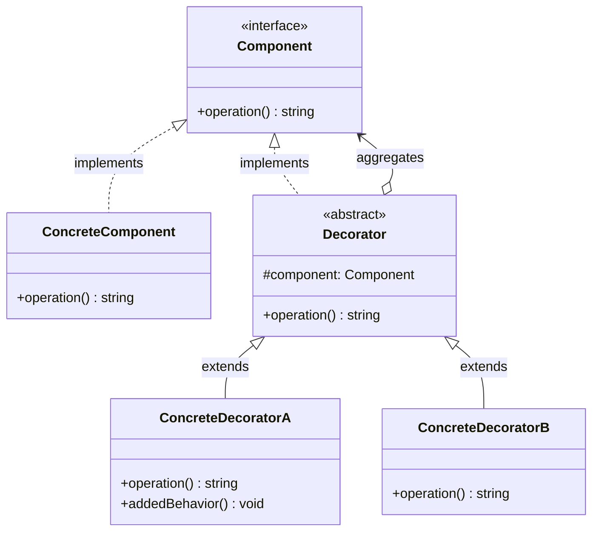
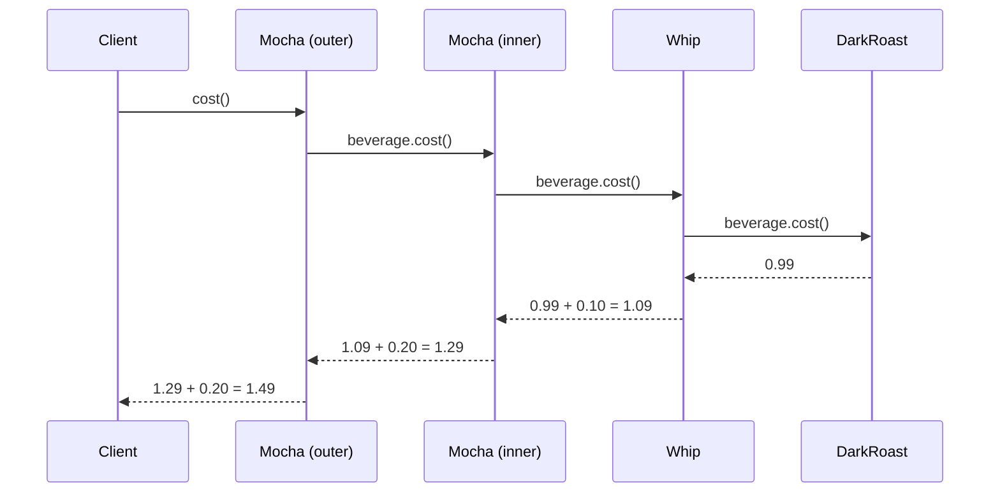
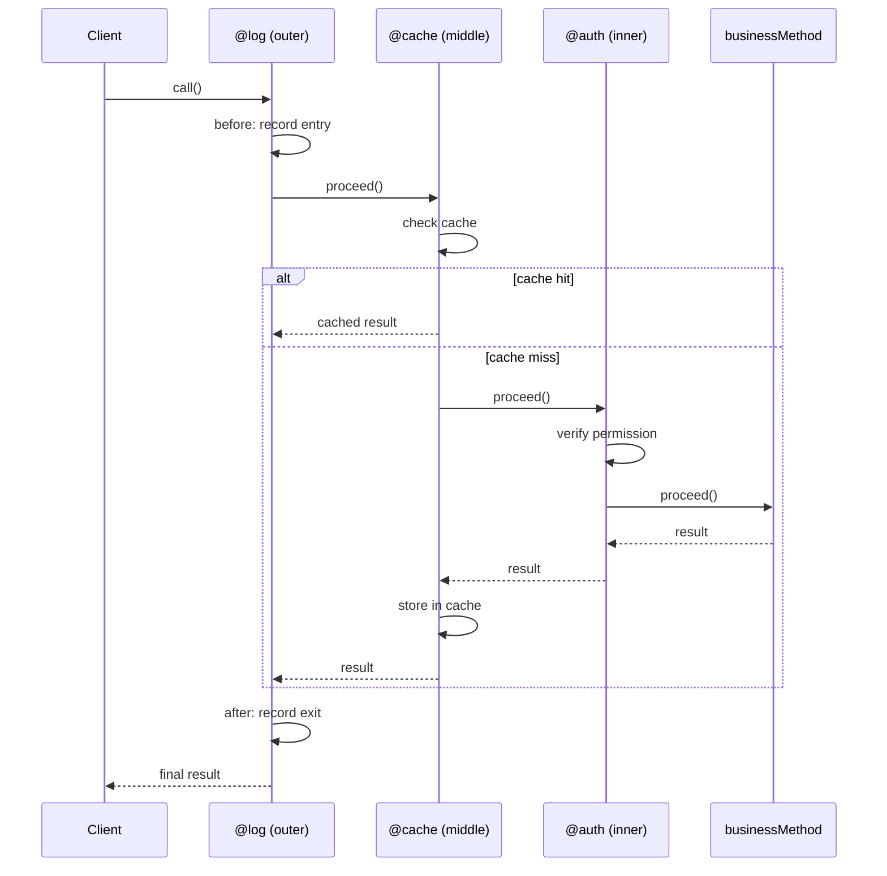

# 装饰器模式

## 1. 定义与意图

> 动态地给一个对象添加一些额外的职责。就增加功能来说，装饰器模式相比生成子类更为灵活。--GoF

装饰器模式（Decorator Pattern）是一种结构型设计模式，其核心思想是：通过创建一系列装饰器类来包装原始对象，在保持接口一致的前提下，动态地为对象叠加额外行为。它与继承的根本区别在于，继承是编译时静态确定的，而装饰器是运行时动态组合的。

在 TypeScript 生态中，装饰器模式存在两种表达形式：

- **对象装饰器**：基于接口聚合的经典 GoF 实现，运行时动态包装
- **语言装饰器**：TC39 Stage 3 提案 / TypeScript 5.0 原生语法，编译时元编程

两者理念同源，但作用层面不同：前者操作对象实例，后者操作类声明结构。

---

## 2. UML类图



**关系说明**：

- `Component` 是统一接口，客户端仅依赖此抽象
- `Decorator` 聚合 `Component`（而非继承），这是装饰器模式的关键特征
- `ConcreteDecorator` 可嵌套多层，每一层在委托调用前后添加自身逻辑
- `ConcreteComponent` 与 `Decorator` 对 `Component` 接口可互相替换

---

## 3. 核心角色与职责

| 角色 | 职责 | 关键特征 |
|------|------|----------|
| Component（组件） | 定义对象的统一接口，声明可被装饰的方法 | 抽象类或接口 |
| ConcreteComponent（具体组件） | 被装饰的原始对象，实现基本行为 | 可被替换 |
| Decorator（装饰器基类） | 持有 Component 引用，转发请求 | 继承接口，聚合组件 |
| ConcreteDecorator（具体装饰器） | 在委托前后添加额外职责 | 可多层嵌套 |

## 4. 应用场景

### 4.1 通用场景

**横切关注点（Cross-cutting Concerns）**

装饰器模式是实现横切关注点最自然的方式。日志、缓存、权限、事务管理等逻辑与业务代码正交，通过装饰器将其从业务逻辑中分离：

**AOP（面向切面编程）**

AOP 是装饰器模式的系统性应用，将横切关注点模块化为切面（Aspect），通过装饰器织入（Weaving）到目标方法：

### 4.2 前端框架实战

**Angular 装饰器：架构核心**

Angular 框架的整个架构建立在装饰器之上，每个 Angular 元素（组件、服务、模块、指令、管道）都由装饰器声明元数据：

Angular 装饰器的本质是元数据注入：`@Component` 将模板、样式、选择器等信息绑定到类上，`@Input`/`@Output` 标记属性为组件的输入输出接口，`@Injectable` 声明依赖注入配置。框架在运行时通过读取这些元数据来构建组件树和注入器树。

**React HOC：函数式装饰器**

React 的高阶组件（Higher-Order Component）本质上是函数式装饰器，以组件为输入，返回增强后的组件：

HOC 与 GoF 装饰器模式的对应关系：

| GoF 装饰器 | React HOC |
|-----------|-----------|
| Component 接口 | React.ComponentType |
| ConcreteComponent | 被包装的业务组件 |
| Decorator | 高阶组件函数 |
| ConcreteDecorator | withRouter, connect, withStyles |

**NestJS 装饰器：全栈装饰器驱动**

NestJS 是 TypeScript 生态中装饰器应用最彻底的框架，从控制器、服务到中间件、守卫、拦截器，全部通过装饰器声明：

NestJS 装饰器的工作原理：框架在启动时扫描所有模块，通过 `Reflect.getMetadata` 读取装饰器注入的元数据（路由路径、HTTP 方法、守卫配置等），据此构建路由表、实例化控制器和提供者、组装请求处理管道。这种声明式架构使得开发者只需关注业务逻辑，框架自动完成依赖注入和请求分发。

**AOP 场景：方法执行时间统计、权限校验、异常捕获**

---

## 5. Mermaid流程图

装饰器链式调用流程，以咖啡订单为例：



**调用链解析**：

1. 客户端调用最外层装饰器 `Mocha2.cost()`
2. `Mocha2` 委托给内层 `Mocha1.cost()`
3. `Mocha1` 委托给 `Whip.cost()`
4. `Whip` 委托给核心组件 `DarkRoast.cost()`
5. `DarkRoast` 返回基础价格 `0.99`
6. 各层装饰器在委托返回值上叠加自身费用，逐层回传
7. 客户端收到最终结果 `1.49`

对于方法装饰器，调用方向相反：外层装饰器先执行 before 逻辑，然后委托内层，内层返回后执行 after 逻辑。



---

## 6. 优缺点分析

| 优点 | 缺点 |
|------|------|
| 动态增减职责，运行时可灵活组合与撤销 | 多层装饰器嵌套导致调试困难，调用栈不直观 |
| 符合开闭原则（OCP），无需修改原类即可扩展 | 装饰器链过长时引入额外函数调用开销，影响热路径性能 |
| 比继承更灵活，避免静态继承导致的类爆炸 | 装饰后的对象与原始对象类型标识不同（identity 问题），`instanceof` 检查会失败 |
| 每个装饰器单一职责，可独立复用于不同组件 | 装饰器叠加顺序敏感，顺序错误可能导致逻辑缺陷 |
| 客户端代码无需感知装饰器存在，保持透明性 | 过度使用装饰器会使代码流程难以静态追踪 |

**关于 identity 问题的说明**：

这是装饰器模式与代理模式的核心差异之一：代理模式通常保持与目标对象相同的 identity，而装饰器模式天然不保证此特性。

---

## 7. 相关模式对比

| 对比维度 | 装饰器 | 代理 |
|----------|-------|------|
| 意图 | 增强功能，添加职责 | 控制访问，管理生命周期 |
| 创建方式 | 客户端主动包装，多层叠加 | 代理方控制创建，通常单层 |
| 接口一致性 | 实现相同接口 | 实现相同接口 |
| 对象生命周期 | 不控制原对象创建 | 可能延迟创建（虚拟代理） |
| identity | 装饰后与原对象不同 | 代理可保持与目标相同 identity |
| 典型用例 | 日志、缓存、权限等横切关注点 | 远程代理、保护代理、智能引用 |

**装饰器与代理的代码结构对比**：

**补充对比：装饰器 vs 适配器**

| 对比维度 | 装饰器 | 适配器 |
|----------|-------|--------|
| 接口变化 | 不改变接口 | 转换接口 |
| 意图 | 增强已有功能 | 兼容不兼容接口 |
| 客户端感知 | 完全透明 | 客户端使用新接口 |

**补充对比：装饰器 vs 组合**

| 对比维度 | 装饰器 | 组合 |
|----------|-------|------|
| 结构 | 线性链式包装 | 树形递归结构 |
| 意图 | 动态叠加职责 | 统一处理整体与部分 |
| 典型用例 | 日志、缓存、权限 | 文件系统、UI 组件树 |

---

## 8. 总结

装饰器模式在前端工程中具有双重身份：

**作为 GoF 设计模式**，它通过对象聚合实现运行时的职责动态叠加，以咖啡订单系统为代表，解决了继承体系无法应对的排列组合爆炸问题。其核心约束是：装饰器与被装饰对象必须共享同一接口，保证客户端透明性。

**作为语言特性**，TC39 Stage 3 装饰器提案（TypeScript 5.0 原生支持）将装饰器从运行时对象包装扩展到了编译时元编程层面。新装饰器的 `(value, context)` 签名取代了旧版的 `(target, propertyKey, descriptor)` 模式，通过 `context.kind` 统一处理类、方法、属性、访问器四种目标，通过 `context.addInitializer` 注入初始化逻辑，语义更清晰，类型安全性更强。

**实践建议**：

- 优先使用 TypeScript 5.0 原生装饰器语法，避免依赖 `experimentalDecorators` 旧模式
- 每个装饰器恪守单一职责，通过组合实现复杂功能
- 装饰器叠加顺序从外到内为 `@A @B @C method()` 等价于 `A(B(C(method)))`，需注意 before/after 逻辑的执行方向
- 对性能敏感的热路径，避免过深的装饰器嵌套，或考虑合并装饰器
- 装饰器最适合横切关注点（日志、缓存、权限、性能统计、异常处理），不要用它替代正常的业务抽象

---

## TypeScript 实现

### 基础实现

咖啡订单系统：以 Espresso 为基础饮品，Milk 与 Mocha 为装饰器，链式叠加计算价格与描述。

```typescript
// ==================== 组件接口 ====================
interface Beverage {
  getDescription(): string;
  cost(): number;
}

// ==================== 具体组件 ====================
class Espresso implements Beverage {
  getDescription(): string {
    return 'Espresso';
  }

  cost(): number {
    return 1.99;
  }
}

class DarkRoast implements Beverage {
  getDescription(): string {
    return 'Dark Roast Coffee';
  }
  cost(): number {
    return 0.99;
  }
}

// ==================== 抽象装饰器 ====================
abstract class CondimentDecorator implements Beverage {
  constructor(protected beverage: Beverage) {}
  abstract getDescription(): string;
  abstract cost(): number;
}

// ==================== 具体装饰器 ====================
class Mocha extends CondimentDecorator {
  getDescription(): string { return this.beverage.getDescription() + ', Mocha'; }
  cost(): number { return 0.20 + this.beverage.cost(); }
}

class Whip extends CondimentDecorator {
  getDescription(): string { return this.beverage.getDescription() + ', Whip'; }
  cost(): number { return 0.10 + this.beverage.cost(); }
}

class Milk extends CondimentDecorator {
  getDescription(): string { return this.beverage.getDescription() + ', Milk'; }
  cost(): number { return 0.15 + this.beverage.cost(); }
}

// ==================== 装饰器构建器 ====================
class BeverageBuilder {
  private constructor(private beverage: Beverage) {}
  static create(beverage: Beverage): BeverageBuilder {
    return new BeverageBuilder(beverage);
  }
  with(Decorator: new (beverage: Beverage) => CondimentDecorator): this {
    this.beverage = new Decorator(this.beverage);
    return this;
  }
  build(): Beverage {
    return this.beverage;
  }
}

// 使用构建器
const myDrink = BeverageBuilder.create(new DarkRoast())
  .with(Mocha)
  .with(Mocha)
  .with(Whip)
  .build();

console.log(`${myDrink.getDescription()} $${myDrink.cost()}`);
// Dark Roast Coffee, Mocha, Mocha, Whip $1.49
```

### 现代TypeScript实现

TC39 装饰器提案（Stage 3）已在 TypeScript 5.0 中正式支持。新装饰器的签名与旧版 `experimentalDecorators` 完全不同，采用 `(value, context)` 双参数模型，并通过 `context.kind` 区分装饰目标类型。

#### 4.2.1 类装饰器

```typescript
type ClassDecoratorValue = new (...args: unknown[]) => unknown;

function sealed<T extends ClassDecoratorValue>(
  value: T,
  context: ClassDecoratorContext
): T {
  context.addInitializer(function (): void {
    Object.seal(value);
    Object.seal(value.prototype);
    console.log(`Class "${String(context.name)}" has been sealed.`);
  });
  return value;
}

// 实例计数装饰器：统计类被实例化的次数
function countInstances<TBase extends new (...args: any[]) => object>(
  value: TBase,
  _context: ClassDecoratorContext
) {
  let count = 0;
  return class extends value {
    constructor(...args: any[]) {
      super(...args);
      count++;
      console.log(`Created instance #${count} of ${String(_context.name)}`);
    }
    static getInstCount(): number { return count; }
  };
}

@sealed
@countInstances
class Repository {
  constructor(public name: string) {}
}

const repo1 = new Repository('users');
const repo2 = new Repository('orders');
console.log((Repository as unknown as { getInstCount: () => number }).getInstCount()); // 2
```

#### 4.2.2 方法装饰器

```typescript
function log<This, Args extends unknown[], Return>(
  target: (this: This, ...args: Args) => Return,
  context: ClassMethodDecoratorContext<This, (this: This, ...args: Args) => Return>
) {
  const methodName = String(context.name);

  return function (this: This, ...args: Args): Return {
    const timestamp = new Date().toISOString();
    console.log(`[${timestamp}] ${methodName} called with args: ${JSON.stringify(args)}`);

    const start = performance.now();
    const result = target.call(this, ...args);
    const duration = performance.now() - start;
    console.log(`[${methodName}] took ${duration.toFixed(2)}ms`);

    return result;
  };
}

// 使用
class UserRepository {
  @log
  async fetchData(url: string): Promise<unknown> {
    const response = await fetch(url);
    if (!response.ok) throw new Error(`HTTP ${response.status}`);
    return response.json();
  }
}
```

#### 4.2.3 属性装饰器

```typescript
function required<T>(
  value: undefined,
  context: ClassFieldDecoratorContext<unknown, T>
): (this: unknown, initialValue: T) => T {
  return function (this: unknown, initialValue: T): T {
    if (initialValue === null || initialValue === undefined || initialValue === '') {
      throw new Error(`Field "${String(context.name)}" is required but received ${JSON.stringify(initialValue)}`);
    }
    return initialValue;
  };
}

// 使用
// 注意：字段装饰器的校验读取的是字段的初始值（字段初始化时机执行），
// 构造函数中 Object.assign 注入的值不会经过装饰器
class UserForm {
  @required
  username = 'alice';

  @required
  email = 'alice@example.com';

  @required
  password = '';

  id: string = crypto.randomUUID();
}

// new UserForm(); // Error: Field "password" is required but received ""
```

#### 4.2.4 访问器装饰器

```typescript
function memoize<This, Return>(
  target: (this: This) => Return,
  context: ClassGetterDecoratorContext<This, Return>
): (this: This) => Return {
  let cached = false;
  let cachedValue: Return;

  return function (this: This): Return {
    if (!cached) {
      cachedValue = target.call(this);
      cached = true;
    }
    return cachedValue!;
  };
}

// 访问器装饰器：校验 setter 值
function modeGuard<This>(
  target: (this: This, value: string) => void,
  context: ClassSetterDecoratorContext<This, string>
): (this: This, value: string) => void {
  const allowed = ['development', 'production', 'test'];
  return function (this: unknown, value: string) {
    if (!allowed.includes(value)) {
      throw new Error(`Mode must be one of: ${allowed.join(', ')}`);
    }
    return target.call(this, value);
  };
}

// 使用
class Configuration {
  private _mode: string = 'development';

  @memoize
  get connectionString(): string {
    console.log('Computing connection string...');
    return `postgres://localhost:3000/${this._mode}`;
  }

  @modeGuard
  set mode(value: string) {
    this._mode = value;
  }
}

const config = new Configuration();
console.log(config.connectionString); // Computing connection string... / postgres://localhost:3000/development
console.log(config.connectionString); // postgres://localhost:3000/development (cached)
config.mode = 'production';
// config.mode = 'staging'; // Error: Mode must be one of: development, production, test
```

#### 4.2.5 装饰器工厂

装饰器工厂是返回装饰器函数的高阶函数，用于接收配置参数，实现可配置的装饰器。

```typescript
// 通用日志装饰器工厂
function createLogDecorator(options: {
  prefix?: string;
  timestamp?: boolean;
  level?: 'debug' | 'info' | 'warn' | 'error';
}) {
  const { prefix = '[LOG]', timestamp = true, level = 'info' } = options;

  return function <This, Args extends unknown[], Return>(
    target: (this: This, ...args: Args) => Return,
    context: ClassMethodDecoratorContext<This, (this: This, ...args: Args) => Return>
  ) {
    const methodName = String(context.name);
    return function (this: This, ...args: Args): Return {
      const time = timestamp ? new Date().toISOString() : '';
      console.log(`${prefix}${time ? ` [${time}]` : ''} [${level}] ${methodName} called`);
      const result = target.call(this, ...args);
      return result;
    };
  };
}

// 缓存装饰器工厂
function createCacheDecorator(options: { ttl?: number; maxSize?: number }) {
  const cache = new Map<string, { value: unknown; expiresAt: number }>();
  return function <This, Args extends unknown[], Return>(
    target: (this: This, ...args: Args) => Return,
    context: ClassMethodDecoratorContext<This, (this: This, ...args: Args) => Return>
  ) {
    return function (this: This, ...args: Args): Return {
      const key = JSON.stringify(args);
      const hit = cache.get(key);
      if (hit && Date.now() < hit.expiresAt) {
        return hit.value as Return;
      }
      const value = target.call(this, ...args);
      cache.set(key, { value, expiresAt: Date.now() + (options.ttl ?? 60000) });
      return value;
    };
  };
}

// 权限装饰器工厂
function requirePermission(permission: string) {
  return function <This, Args extends unknown[], Return>(
    target: (this: This, ...args: Args) => Return,
    context: ClassMethodDecoratorContext<This, (this: This, ...args: Args) => Return>
  ) {
    return function (this: This, ...args: Args): Return {
      const user = (this as Record<string, unknown>).currentUser as { role: string } | undefined;
      if (!user || user.role !== 'admin') {
        throw new Error(`缺少权限: ${permission}`);
      }
      return target.call(this, ...args);
    };
  };
}

// 使用
class ApiService {
  @createLogDecorator({ prefix: '[API]', timestamp: true, level: 'debug' })
  @createCacheDecorator({ ttl: 60000, maxSize: 500 })
  @requirePermission('admin:read')
  getDashboardData(): Record<string, unknown> {
    return { stats: { users: 1024, orders: 5678 } };
  }
}
```

---

```typescript
// 横切关注点装饰器集合（复用上文 createLogDecorator / createCacheDecorator / requirePermission）
interface User {
  id: string;
  name: string;
}

const db = {
  users: {
    findById: async (id: string): Promise<User> => ({ id, name: `user-${id}` }),
  },
};

const withTiming = createLogDecorator({ prefix: '[TIMING]', timestamp: true });
const withCache = createCacheDecorator({ ttl: 30000 });
const withAuth = requirePermission('user:read');

class DataService {
  @withTiming
  @withCache
  @withAuth
  async queryUser(id: string): Promise<User> {
    return db.users.findById(id);
  }
}
```

```typescript
// AOP 切面定义
type Aspect = {
  before?: (context: MethodInvocation) => void;
  after?: (context: MethodInvocation, result: unknown) => void;
  afterThrow?: (context: MethodInvocation, error: Error) => void;
  around?: (context: MethodInvocation, proceed: () => unknown) => unknown;
};

interface MethodInvocation {
  target: unknown;
  method: string;
  args: unknown[];
  returnValue?: unknown;
  error?: Error;
}

// AOP 装饰器：将切面织入目标方法
function applyAspect(aspect: Aspect) {
  return function <This, Args extends unknown[], Return>(
    target: (this: This, ...args: Args) => Return,
    context: ClassMethodDecoratorContext<This, (this: This, ...args: Args) => Return>
  ) {
    return function (this: This, ...args: Args): Return {
      const invocation: MethodInvocation = { target: this, method: String(context.name), args };
      aspect.before?.(invocation);
      try {
        const result = aspect.around
          ? aspect.around(invocation, () => target.call(this, ...args))
          : target.call(this, ...args);
        invocation.returnValue = result;
        aspect.after?.(invocation, result);
        return result as Return;
      } catch (err) {
        invocation.error = err as Error;
        aspect.afterThrow?.(invocation, err as Error);
        throw err;
      }
    };
  };
}

// 切面定义
const loggingAspect: Aspect = {
  before: (ctx) => console.log(`[LOG] ${ctx.method} 开始，参数: ${JSON.stringify(ctx.args)}`),
  after: (ctx, result) => console.log(`[LOG] ${ctx.method} 完成，结果: ${String(result)}`),
};

const timingAspect: Aspect = {
  around: (ctx, proceed) => {
    const start = performance.now();
    const result = proceed();
    console.log(`[TIMING] ${ctx.method} 耗时 ${(performance.now() - start).toFixed(2)}ms`);
    return result;
  },
};

// 使用
class OrderService {
  @applyAspect(loggingAspect)
  @applyAspect(timingAspect)
  createOrder(items: string[]): string {
    return `order-${Date.now()}`;
  }
}
```

```typescript
import { Component, Input, Output, EventEmitter, Injectable, NgModule } from '@angular/core';

@Component({
  selector: 'app-user-list',
  template: `
    <ul>
      <li *ngFor="let user of users" (click)="selectUser.emit(user)">
        {{ user.name }}
      </li>
    </ul>
  `,
  styles: [`ul { list-style: none; padding: 0; }`],
})
export class UserListComponent {
  @Input() users: Array<{ id: number; name: string }> = [];
  @Output() selectUser = new EventEmitter<{ id: number; name: string }>();
  constructor() {}
}

@NgModule({
  declarations: [UserListComponent],
  exports: [UserListComponent],
})
export class UserModule {}
```

```typescript
import React, { ComponentType, useState, useEffect } from 'react';

// 假设存在 useRoute hook（由具体路由库提供）
declare function useRouter(): { pathname: string };

// 被增强的基础组件
function UserListComponent(props: { users?: Array<{ id: number; name: string }> }) {
  return <ul>{(props.users ?? []).map((u) => <li key={u.id}>{u.name}</li>)}</ul>;
}

// withRouter：注入路由信息的 HOC
function withRouter<P extends object>(
  WrappedComponent: ComponentType<P>
): ComponentType<Omit<P, 'router'>> {
  return function WithRouterProps(props: Omit<P, 'router'>) {
    const router = useRouter(); // 假设存在 useRoute hook
    return <WrappedComponent {...(props as P)} router={router} />;
  };
}

// withStyles：注入样式类的 HOC
function withStyles(styles: Record<string, string>) {
  return function <P extends object>(WrappedComponent: ComponentType<P>): ComponentType<P & { styles: Record<string, string> }> {
    return function WithStyles(props: P & { styles: Record<string, string> }) {
      return <WrappedComponent {...props} styles={styles} />;
    };
  };
}

// connect：注入 Redux 状态的 HOC
function connect(mapState: (s: unknown) => Record<string, unknown>, mapDispatch: (d: unknown) => Record<string, unknown>) {
  return function <P extends object>(WrappedComponent: ComponentType<P>): ComponentType<P> {
    return function ConnectedComponent(props: P) {
      const state = { /* 从 store 读取 */ };
      const dispatch = { /* dispatch 包装 */ };
      const injected = { ...mapState(state), ...mapDispatch(dispatch) };
      return <WrappedComponent {...props} {...injected} />;
    };
  };
}

const mapStateToProps = (state: unknown) => ({ users: state });
const mapDispatchToProps = (dispatch: unknown) => ({ loadUsers: dispatch });
const userListStyles = { list: 'list-container' };

// HOC 组合使用
const EnhancedUserList = withStyles(userListStyles)(
  connect(mapStateToProps, mapDispatchToProps)(
    withRouter(UserListComponent)
  )
);
```

```typescript
import 'reflect-metadata';
import { Request, Response, NextFunction } from 'express';
import {
  Controller, Get, Post, Put, Delete,
  Body, Param, Query, UseGuards, UseInterceptors,
  Injectable, NestMiddleware,
} from '@nestjs/common';

// 自定义装饰器：合并参数提取
function User(): ParameterDecorator {
  return function (
    target: object,
    propertyKey: string | symbol | undefined,
    parameterIndex: number
  ) {
    const existing: number[] = Reflect.getMetadata('user:params', target, propertyKey as string) ?? [];
    existing.push(parameterIndex);
    Reflect.defineMetadata('user:params', existing, target, propertyKey as string);
  };
}

// 订单服务（由 Nest 依赖注入容器提供）
class OrderService {
  findAll(): string[] { return ['order-1', 'order-2']; }
  create(items: string[]): string { return `已创建包含 ${items.length} 项的订单`; }
}

// 控制器：通过装饰器声明路由与依赖
@Controller('orders')
export class OrderController {
  constructor(private readonly orderService: OrderService) {}

  @Get()
  findAll(): string[] {
    return this.orderService.findAll();
  }

  @Post()
  create(@Body() dto: { items: string[] }): string {
    return this.orderService.create(dto.items);
  }

  @Get(':id')
  findOne(@Param('id') id: string, @User() user: { id: number }): string {
    return `订单 ${id}，操作者 ${user.id}`;
  }
}

// 中间件：使用装饰器声明全局/路由中间件
@Injectable()
export class LoggingMiddleware implements NestMiddleware {
  use(req: Request, res: Response, next: NextFunction): void {
    console.log(`[${new Date().toISOString()}] ${req.method} ${req.path}`);
    next();
  }
}
```

```typescript
// 执行时间统计
function measure<This, Args extends unknown[], Return>(
  target: (this: This, ...args: Args) => Return,
  context: ClassMethodDecoratorContext<This, (this: This, ...args: Args) => Return>
) {
  return function (this: This, ...args: Args): Return {
    const start = performance.now();
    const result = target.call(this, ...args);
    const duration = performance.now() - start;

    if (duration > 100) {
      console.warn(
        `[PERF] ${String(context.name)} 耗时 ${duration.toFixed(2)}ms，超过阈值 100ms`
      );
    }
    return result;
  };
}

// 权限校验装饰器
function adminOnly<This, Args extends unknown[], Return>(
  target: (this: This, ...args: Args) => Return,
  context: ClassMethodDecoratorContext<This, (this: This, ...args: Args) => Return>
) {
  return function (this: This, ...args: Args): Return {
    const user = (this as Record<string, unknown>).currentUser as { role: string };
    if (user?.role !== 'admin') throw new Error('需要管理员权限');
    return target.call(this, ...args);
  };
}

// 异常捕获装饰器
function catchError<This, Args extends unknown[], Return>(
  target: (this: This, ...args: Args) => Return,
  context: ClassMethodDecoratorContext<This, (this: This, ...args: Args) => Return>
) {
  return function (this: This, ...args: Args): Return {
    try {
      return target.call(this, ...args);
    } catch (err) {
      console.error(`[ERROR] ${String(context.name)} 抛出异常:`, err);
      return { success: false, error: err } as Return;
    }
  };
}

// 组合使用：统计 + 权限 + 异常
class PaymentService {
  @measure
  @adminOnly
  @catchError
  processPayment(orderId: string, amount: number): Record<string, unknown> {
    // 业务逻辑
    return { success: true, orderId, amount };
  }
}
```

```typescript
// 原始实例与装饰后实例的 identity 差异（复用上文的咖啡示例）
const base = new DarkRoast();
const decorated = new Whip(base);

console.log(base === decorated);                      // false -- 它们是不同的对象
console.log(decorated instanceof CondimentDecorator); // true -- 装饰器实例仍属于装饰器抽象层次
console.log(decorated instanceof DarkRoast);          // false -- instanceof 无法还原被包装的原始类型
```

```typescript
interface User { id: number; name: string }
interface UserService { getUsers(): User[] }

class RealUserService implements UserService {
  getUsers(): User[] { return [{ id: 1, name: 'alice' }]; }
}

class CacheDecorator implements UserService {
  private cachedResult: User[] | null = null;
  constructor(private inner: UserService) {}
  getUsers(): User[] {
    if (!this.cachedResult) this.cachedResult = this.inner.getUsers();
    return this.cachedResult;
  }
}

class LogDecorator implements UserService {
  constructor(private inner: UserService) {}
  getUsers(): User[] {
    console.log('[LOG] getUsers');
    return this.inner.getUsers();
  }
}

class AuthDecorator implements UserService {
  constructor(private inner: UserService) {}
  getUsers(): User[] {
    if (!this.checkPermission()) throw new Error('Access denied');
    return this.inner.getUsers();
  }
  private checkPermission(): boolean { return true; }
}

// 装饰器模式：客户端主动叠加
const service = new RealUserService();
const withCache = new CacheDecorator(service);
const withLog = new LogDecorator(withCache);
const withAuth = new AuthDecorator(withLog);
withAuth.getUsers();

// 代理模式：代理方控制访问
class UserServiceProxy implements UserService {
  private realService: UserService | null = null;
  private cachedResult: User[] | null = null;

  getUsers(): User[] {
    if (!this.realService) {
      this.realService = new RealUserService(); // 代理控制创建
    }
    if (this.checkCache()) return this.cachedResult as User[];
    if (!this.checkPermission()) throw new Error('Access denied');
    return this.realService.getUsers();
  }

  private checkCache(): boolean { return this.cachedResult !== null; }
  private checkPermission(): boolean { return true; }
}

// 对客户端透明
const serviceProxy = new UserServiceProxy();
serviceProxy.getUsers(); // 客户端不知道代理的存在
```

---

## Java 实现

### 装饰器模式（动态扩展对象功能）

```java
// 组件接口
interface Coffee {
    double cost();
    String description();
}

// 具体组件：基础咖啡
class Espresso implements Coffee {
    public double cost() { return 15.0; }
    public String description() { return "浓缩咖啡"; }
}

// 装饰器基类：持有被装饰组件，转发方法
abstract class CoffeeDecorator implements Coffee {
    protected final Coffee coffee;

    protected CoffeeDecorator(Coffee coffee) {
        this.coffee = coffee;
    }

    public double cost() { return coffee.cost(); }
    public String description() { return coffee.description(); }
}

// 具体装饰器：加牛奶
class MilkDecorator extends CoffeeDecorator {
    public MilkDecorator(Coffee coffee) {
        super(coffee);
    }

    @Override
    public double cost() { return coffee.cost() + 3.0; }

    @Override
    public String description() { return coffee.description() + " + 牛奶"; }
}

// 具体装饰器：加糖
class SugarDecorator extends CoffeeDecorator {
    public SugarDecorator(Coffee coffee) {
        super(coffee);
    }

    @Override
    public double cost() { return coffee.cost() + 1.5; }

    @Override
    public String description() { return coffee.description() + " + 糖"; }
}

// 使用：可以层层叠加装饰器
public class Client {
    public static void main(String[] args) {
        Coffee coffee = new Espresso();
        coffee = new MilkDecorator(coffee);
        coffee = new SugarDecorator(coffee);
        System.out.println(coffee.description() + "：" + coffee.cost() + " 元");
    }
}
```

> 装饰器模式在不修改原类的情况下动态添加职责。Java 的 `BufferedReader`、`InputStream`/`OutputStream`（`BufferedInputStream` 包 `FileInputStream`）、`Collections.synchronizedXxx` 都是经典应用。

## Python 实现

### 装饰器模式（类装饰器）

```python
# 组件接口（Python 中常用协议/鸭子类型）
class Coffee:
    def cost(self) -> float:
        raise NotImplementedError

    def description(self) -> str:
        raise NotImplementedError

# 具体组件
class Espresso(Coffee):
    def cost(self) -> float:
        return 15.0

    def description(self) -> str:
        return "浓缩咖啡"

# 装饰器基类
class CoffeeDecorator(Coffee):
    def __init__(self, coffee: Coffee):
        self._coffee = coffee

    def cost(self) -> float:
        return self._coffee.cost()

    def description(self) -> str:
        return self._coffee.description()

class MilkDecorator(CoffeeDecorator):
    def cost(self) -> float:
        return self._coffee.cost() + 3.0

    def description(self) -> str:
        return self._coffee.description() + " + 牛奶"

class SugarDecorator(CoffeeDecorator):
    def cost(self) -> float:
        return self._coffee.cost() + 1.5

    def description(self) -> str:
        return self._coffee.description() + " + 糖"

# 使用：层层叠加
coffee = Espresso()
coffee = MilkDecorator(coffee)
coffee = SugarDecorator(coffee)
print(f"{coffee.description()}：{coffee.cost()} 元")
```

### 装饰器模式（Python 函数装饰器）

```python
from functools import wraps
import time

def timer(func):
    """函数装饰器：为函数附加计时能力"""
    @wraps(func)
    def wrapper(*args, **kwargs):
        start = time.time()
        result = func(*args, **kwargs)
        print(f"{func.__name__} 耗时 {time.time() - start:.3f}s")
        return result
    return wrapper

@timer
def heavy_task():
    time.sleep(0.1)
    return "done"

heavy_task()
```

> Python 有两种装饰器实现：**类装饰器**（与 Java 类似，重写方法）和**函数装饰器**（语法糖 `@decorator`，底层就是"把函数传给装饰器返回新函数"）。`functools.lru_cache`、`@staticmethod` 等都是内置装饰器应用。

