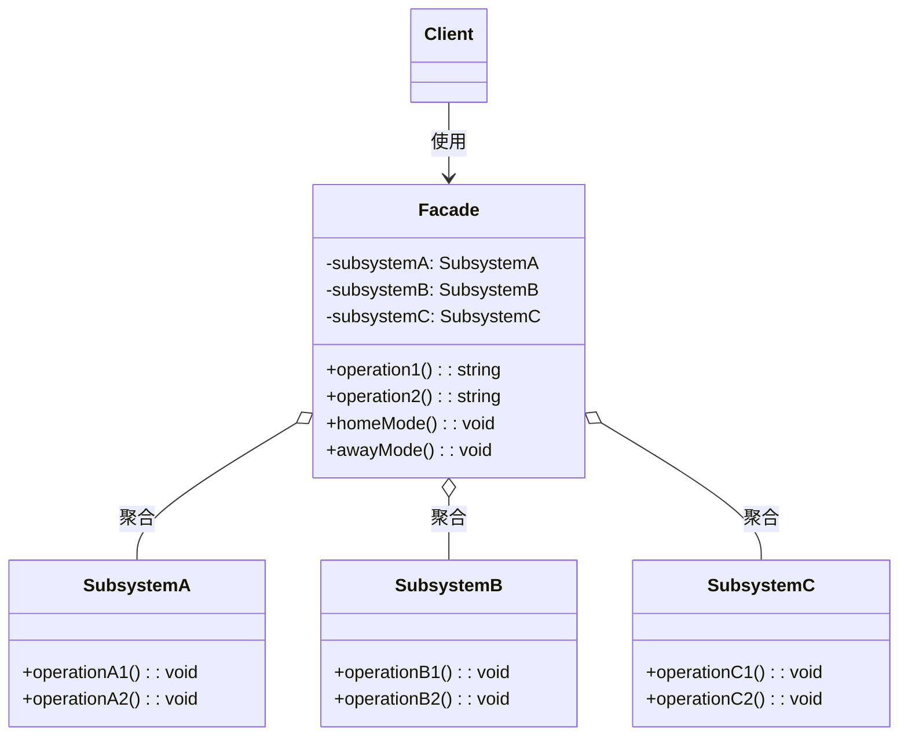
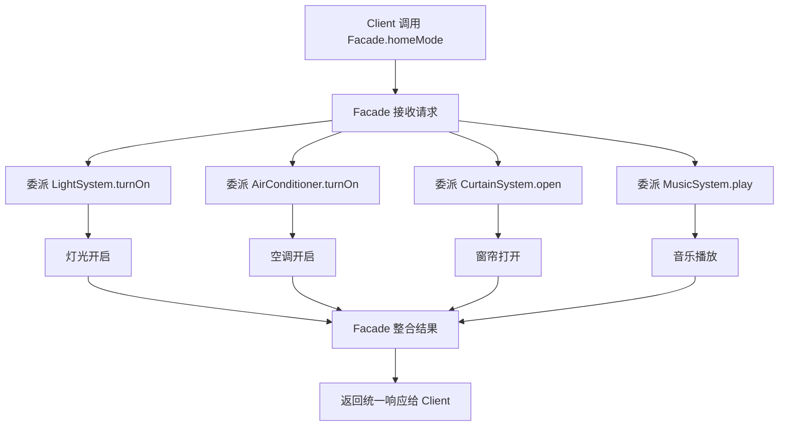
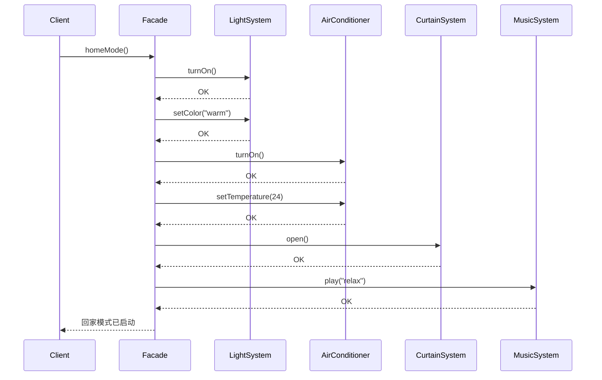

# 外观模式

> 为子系统中的一组接口提供一个一致的界面，外观模式定义了一个高层接口，这个接口使得这一子系统更加容易使用。--GoF

## 1. 定义与意图

### 模式定义

外观模式（Facade Pattern）是一种结构型设计模式，它为复杂的子系统提供一个统一的高层接口。外观模式通过定义一个更高层的抽象，将客户端与子系统的内部复杂性隔离开来，使得客户端只需要与外观对象交互，而无需了解子系统的具体实现细节。

外观模式的核心思想类似于现实生活中的"前台"或"接待员"：客户不需要了解酒店内部各个部门的运作方式，只需要通过前台就能完成入住、点餐、叫车等一系列操作。

### 模式结构

```
+-------------------------------------------------------------+
|                     外观模式结构                             |
+-------------------------------------------------------------+
|                                                             |
|   +-------------+                  +-------------+          |
|   |   Client    |                  |   Facade    |          |
|   |   客户端    | ---------------> |   外观      |          |
|   +-------------+                  +-------------+          |
|                                          |                  |
|                           +--------------+--------------+   |
|                           |              |              |   |
|                           v              v              v   |
|                    +-----------+  +-----------+  +-----------+
|                    |SubsystemA |  |SubsystemB |  |SubsystemC |
|                    | 子系统A   |  | 子系统B   |  | 子系统C   |
|                    +-----------+  +-----------+  +-----------+
|                                                             |
|   Facade 聚合所有子系统，对外提供简化接口                    |
+-------------------------------------------------------------+
```

### 设计原则

```
+-------------------------------------------------------------+
|                   外观模式与设计原则                         |
+-------------------------------------------------------------+
|                                                             |
|  +-----------------------------------------------------+   |
|  | 迪米特法则 (LoD / 最少知识原则)                       |   |
|  | -- 客户端只与外观交互，不直接与子系统交互             |   |
|  | -- 减少对象之间的耦合，降低通信复杂度                 |   |
|  +-----------------------------------------------------+   |
|                                                             |
|  +-----------------------------------------------------+   |
|  | 单一职责原则 (SRP)                                   |   |
|  | -- 外观只负责接口简化与委派，不处理具体业务          |   |
|  | -- 子系统各自负责自己的功能                          |   |
|  +-----------------------------------------------------+   |
|                                                             |
|  +-----------------------------------------------------+   |
|  | 开闭原则 (OCP)                                       |   |
|  | -- 新增子系统时可以扩展外观，无需修改客户端          |   |
|  | -- 子系统内部变化不影响外观接口                      |   |
|  +-----------------------------------------------------+   |
|                                                             |
+-------------------------------------------------------------+
```

### 适用场景

```
+-------------------------------------------------------------+
|                 如何判断是否使用外观模式？                    |
+-------------------------------------------------------------+
|                                                             |
|  子系统接口复杂，客户端使用困难？                            |
|       |                                                     |
|       +-- 是 --> 使用外观模式简化接口                        |
|       |                                                     |
|       +-- 否 --> 需要对子系统进行分层访问控制？              |
|                     |                                       |
|                     +-- 是 --> 使用外观模式作为层间入口      |
|                     |                                       |
|                     +-- 否 --> 需要封装遗留系统？            |
|                           |                                 |
|                           +-- 是 --> 使用外观模式封装旧接口  |
|                           |                                 |
|                           +-- 否 --> 考虑其他模式            |
|                                                             |
+-------------------------------------------------------------+
```

---

## 2. UML类图



---

## 3. 核心角色与职责

| 角色 | 职责 |
|------|------|
| Facade | 简化接口，委派子系统。知道哪些子系统负责处理请求，将客户端请求委派给适当的子系统对象 |
| Subsystem | 实现具体功能，不知道Facade的存在。每个子系统独立运作，不依赖外观对象 |
| Client | 通过Facade与子系统交互。客户端只需要与外观对象通信，无需直接操作子系统 |

### 角色关系详解

```
+-------------------------------------------------------------+
|                     角色交互关系                             |
+-------------------------------------------------------------+
|                                                             |
|  Client                                                     |
|    |                                                        |
|    | 调用简化接口                                           |
|    v                                                        |
|  Facade                                                     |
|    |                                                        |
|    +-- 委派 --> SubsystemA.operationA1()                    |
|    +-- 委派 --> SubsystemB.operationB1()                    |
|    +-- 委派 --> SubsystemC.operationC1()                    |
|    |                                                        |
|    | 整合结果并返回                                         |
|    v                                                        |
|  Client <-- 统一响应                                        |
|                                                             |
|  关键特征：                                                 |
|  1. 子系统不知道 Facade 的存在                              |
|  2. 客户端不知道子系统的存在                                |
|  3. Facade 是单向依赖，不形成循环引用                       |
|                                                             |
+-------------------------------------------------------------+
```

---

## 4. 应用场景

### 4.1 通用场景

#### 复杂子系统简化

#### 遗留系统封装

### 4.2 前端框架实战

#### Axios 封装

#### API Gateway

#### 模块化 SDK 入口

#### jQuery 的 $() -- 外观模式的经典实现

---

## 5. Mermaid流程图



### 调用时序图



---

## 6. 优缺点分析

| 优点 | 缺点 |
|------|------|
| 简化客户端使用，降低学习成本 | 可能成为"上帝对象"，承担过多职责 |
| 解耦客户端与子系统，减少依赖 | 不符合开闭原则（修改需改 Facade） |
| 分层访问控制，隐藏内部实现 | 新增子系统需修改外观类 |
| 提供更清晰的子系统入口 | 过度封装可能丧失灵活性 |
| 遗留系统封装，平滑迁移 | 外观层可能引入不必要的性能开销 |
| 支持多层级外观，灵活组合 | 多层外观增加调用链路深度 |

### 适用场景判断

```
+-------------------------------------------------------------+
|                   是否需要使用外观模式？                      |
+-------------------------------------------------------------+
|                                                             |
|  +-----------------------------------------------------+   |
|  | 适合使用外观模式                                     |   |
|  +-----------------------------------------------------+   |
|  | -- 子系统接口复杂，客户端使用困难                    |   |
|  | -- 需要对子系统进行分层访问控制                      |   |
|  | -- 需要封装遗留系统，提供现代化接口                  |   |
|  | -- 多个客户端共享相同的子系统调用序列                |   |
|  | -- 需要减少客户端与子系统之间的依赖                  |   |
|  +-----------------------------------------------------+   |
|                                                             |
|  +-----------------------------------------------------+   |
|  | 不适合使用外观模式                                   |   |
|  +-----------------------------------------------------+   |
|  | -- 子系统接口已经足够简单                            |   |
|  | -- 客户端需要直接访问子系统的特定功能                |   |
|  | -- 子系统之间没有关联，无需统一入口                  |   |
|  | -- 过度封装会隐藏必要的灵活性                        |   |
|  +-----------------------------------------------------+   |
|                                                             |
+-------------------------------------------------------------+
```

---

## 7. 相关模式对比

### 外观 vs 中介者 vs 代理 vs 适配器

| 对比维度 | 外观 | 中介者 | 代理 | 适配器 |
|----------|------|--------|------|--------|
| 意图 | 简化接口 | 解耦对象间交互 | 控制对象访问 | 转换接口 |
| 交互方向 | 客户端 -> 子系统 | 同层对象间 | 客户端 -> 真实对象 | 客户端 -> 被适配者 |
| 子系统感知 | 不知道 Facade | 知道 Mediator | 不知道 Proxy | 不知道 Adapter |
| 接口变化 | 提供新接口 | 统一通信接口 | 保持接口不变 | 改变接口 |
| 对象关系 | 多对一 | 多对多 | 一对一 | 一对一 |
| 典型场景 | SDK 入口、API 封装 | 聊天室、UI 组件通信 | 懒加载、权限控制 | API 迁移、数据适配 |

### 代码对比

### 模式协作

外观模式常与其他模式组合使用：

- **外观 + 工厂**：外观内部使用工厂创建子系统实例
- **外观 + 单例**：外观通常实现为单例，全局唯一入口
- **外观 + 适配器**：外观内部使用适配器对接不同子系统
- **外观 + 观察者**：外观作为事件发射器，通知客户端状态变化
- **外观 + 策略**：外观内部根据策略选择不同的子系统行为

---

## 8. 总结

外观模式是前端开发中使用频率最高的结构型模式之一，其核心价值在于**简化复杂性**和**解耦依赖**。

### 核心要点

1. **简化接口**：外观模式将多个子系统的复杂交互封装为一个简单的高层接口，客户端无需了解子系统内部细节。智能家居的"回家模式"就是典型体现 -- 一键操作替代了手动控制灯光、空调、窗帘、音乐四个子系统。

2. **松耦合**：客户端只依赖外观对象，不直接依赖子系统。子系统的内部变化不会影响客户端代码，符合迪米特法则（最少知识原则）。

3. **不限制直接访问**：外观模式并不禁止客户端直接访问子系统。当客户端需要子系统的特定功能时，仍可绕过外观直接调用，这为灵活性留出了空间。

4. **可多层嵌套**：外观可以嵌套使用，一个外观可以聚合其他外观，形成分层的子系统结构。大型应用中常见"模块外观 -> 应用外观"的层级关系。

### 前端实践要点

- **Axios 封装**是外观模式在前端最典型的应用：将拦截器、错误处理、重试逻辑、Token 注入等封装为简洁的 `http.get()` / `http.post()` 接口。
- **SDK 入口**（如微信 JSSDK 的 `wx.xxx()`）本质上是外观模式：将分享、支付、扫码、定位等模块统一为一个入口对象。
- **API Gateway** 在微前端架构中扮演外观角色：将多个微服务接口聚合为统一的前端 API。
- **jQuery 的 `$()`** 是外观模式的经典实现：将 DOM 查询、CSS 操作、事件绑定、动画等封装为链式调用接口。

### 使用建议

- 外观类应保持**轻量**，只做委派和协调，不包含业务逻辑。
- 避免外观类演变为**上帝对象**，当职责过多时应拆分为多个细粒度外观。
- 新增子系统时优先考虑**扩展外观方法**而非修改已有方法，尽量减少对客户端的影响。
- 在 TypeScript 中善用**泛型外观**和**接口约束**，在保持灵活性的同时获得类型安全。

---

## TypeScript 实现

### 基础实现

智能家居系统：一键"回家模式"（开灯 + 开空调 + 开窗帘 + 播放音乐）

```typescript
// ==================== 子系统定义 ====================

/** 灯光子系统 */
class LightSystem {
  private brightness: number = 0;
  private color: string = 'white';

  turnOn(): void {
    this.brightness = 100;
    console.log('[LightSystem] 灯光已开启，亮度: 100%');
  }
  turnOff(): void {
    this.brightness = 0;
    console.log('[LightSystem] 灯光已关闭');
  }
  setBrightness(v: number): void { this.brightness = v; }
  setColor(c: string): void { this.color = c; }
  getStatus() { return { brightness: this.brightness, color: this.color }; }
}

/** 空调子系统 */
class AirConditioner {
  private temperature: number = 26;
  private power: boolean = false;
  turnOn(): void { this.power = true; console.log('[AC] 空调已开启，26℃'); }
  turnOff(): void { this.power = false; console.log('[AC] 空调已关闭'); }
  setTemperature(t: number): void { this.temperature = t; }
  getStatus() { return { power: this.power, temperature: this.temperature }; }
}

/** 窗帘子系统 */
class CurtainSystem {
  private openPercent: number = 0;
  open(percent = 100): void { this.openPercent = percent; console.log(`[Curtain] 窗帘打开至 ${percent}%`); }
  close(): void { this.openPercent = 0; console.log('[Curtain] 窗帘关闭'); }
  getStatus() { return { openPercent: this.openPercent }; }
}

/** 音乐子系统 */
class MusicSystem {
  private playing = false;
  play(playlist: string): void { this.playing = true; console.log(`[Music] 播放: ${playlist}`); }
  stop(): void { this.playing = false; console.log('[Music] 停止播放'); }
  getStatus() { return { playing: this.playing }; }
}

// ==================== 外观 ====================
class SmartHomeFacade {
  private light = new LightSystem();
  private ac = new AirConditioner();
  private curtain = new CurtainSystem();
  private music = new MusicSystem();

  homeMode(): void {
    console.log('--- 回家模式 ---');
    this.light.turnOn();
    this.ac.turnOn();
    this.curtain.open(80);
    this.music.play('轻音乐');
  }
  awayMode(): void {
    console.log('--- 离家模式 ---');
    this.light.turnOff();
    this.ac.turnOff();
    this.curtain.close();
    this.music.stop();
  }
  getAllStatus(): Record<string, unknown> {
    return { light: this.light.getStatus(), ac: this.ac.getStatus(), curtain: this.curtain.getStatus(), music: this.music.getStatus() };
  }
}

// ==================== 使用 ====================
const smartHome = new SmartHomeFacade();
smartHome.homeMode();

// 一键离家
smartHome.awayMode();

// 查看状态
console.log(smartHome.getAllStatus());
```

### 现代 TypeScript 实现

#### 4.2.1 泛型外观

```typescript
/** 子系统接口约束 */
interface ISubsystem {
  init(): void;
  destroy(): void;
  getStatus(): Record<string, unknown>;
}

/** 泛型外观：支持任意子系统组合 */
class Facade<TSubsystems extends Record<string, ISubsystem>> {
  private subsystems: TSubsystems;
  private initialized: boolean = false;

  constructor(subsystems: TSubsystems) {
    this.subsystems = subsystems;
  }

  init(): void {
    Object.values(this.subsystems).forEach((s) => s.init());
    this.initialized = true;
  }
  destroy(): void {
    Object.values(this.subsystems).forEach((s) => s.destroy());
    this.initialized = false;
  }
  getStatus(): Record<string, unknown> {
    const status: Record<string, unknown> = {};
    Object.entries(this.subsystems).forEach(([name, s]) => { status[name] = s.getStatus(); });
    return status;
  }
  // 批量执行命令
  execute(commands: Array<{ subsystem: keyof TSubsystems; method: string; args: unknown[] }>): void {
    commands.forEach((cmd) => {
      const target = this.subsystems[cmd.subsystem] as unknown as Record<string, Function>;
      target[cmd.method]?.(...cmd.args);
    });
  }
}

// ==================== 使用 ====================
const appFacade = new Facade({
  database: dbSubsystem,
  cache: cacheSubsystem,
  logger: loggerSubsystem,
});
appFacade.init();

// 批量操作
appFacade.execute([
  { subsystem: 'database', method: 'query', args: ['SELECT 1'] },
  { subsystem: 'cache', method: 'set', args: ['key', 'value'] },
  { subsystem: 'logger', method: 'info', args: ['系统启动'] },
]);
```

#### 4.2.2 懒加载子系统

```typescript
/** 子系统工厂类型 */
type SubsystemFactory<T> = () => T;

/** 懒加载外观：子系统在首次使用时才创建 */
class LazyFacade<TSubsystems extends Record<string, () => ISubsystem>> {
  private factories: TSubsystems;
  private instances: Map<string, ISubsystem> = new Map();

  constructor(factories: TSubsystems) {
    this.factories = factories;
  }

  // 首次访问时才创建子系统
  get<K extends keyof TSubsystems>(name: K): ISubsystem {
    const key = name as string;
    if (!this.instances.has(key)) {
      const factory = this.factories[name];
      const instance = factory();
      console.log(`[Lazy] 首次创建子系统: ${key}`);
      this.instances.set(key, instance);
    }
    return this.instances.get(key)!;
  }

  preload(names: Array<keyof TSubsystems>): void {
    names.forEach((name) => this.get(name));
  }
  getLoadedNames(): string[] {
    return [...this.instances.keys()];
  }
}

// ==================== 使用 ====================
const lazyApp = new LazyFacade({
  database: () => dbSubsystem,   // 仅声明，不立即创建
  cache: () => cacheSubsystem,
  logger: () => loggerSubsystem,
});

lazyApp.get('database');
// [Database] 初始化连接池

console.log('已加载:', lazyApp.getLoadedNames()); // ['database']

// 预加载多个子系统
lazyApp.preload(['cache', 'logger']);
```

#### 4.2.3 事件驱动的外观

```typescript
type EventCallback = (...args: unknown[]) => void;

/** 事件发射器 -- 外观基类 */
class EventEmitterFacade {
  private events: Map<string, Set<EventCallback>> = new Map();

  on(event: string, callback: EventCallback): () => void {
    if (!this.events.has(event)) {
      this.events.set(event, new Set());
    }
    this.events.get(event)!.add(callback);
    return () => this.off(event, callback);
  }

  off(event: string, callback: EventCallback): void {
    this.events.get(event)?.delete(callback);
  }

  protected emit(event: string, ...args: unknown[]): void {
    this.events.get(event)?.forEach((cb) => cb(...args));
  }
}

// ==================== 事件驱动的智能家居外观 ====================
class SmartHomeEventFacade extends EventEmitterFacade {
  homeMode(): void {
    this.emit('mode:before', 'home');
    console.log('... 各子系统操作 ...');
    this.emit('mode:after', 'home');
  }
}

// ==================== 使用 ====================
const eventHome = new SmartHomeEventFacade();
eventHome.on('mode:before', (mode) => console.log(`模式即将切换: unknown -> ${mode}`));
eventHome.on('mode:after', (mode) => console.log(`模式已切换为: ${mode}`));

// 触发模式切换
eventHome.homeMode();
// 模式即将切换: unknown -> home
// ... 各子系统操作 ...
// 模式已切换为: home
```

#### 4.2.4 可配置外观（Builder 模式结合）

```typescript
/** 场景配置接口 */
interface SceneConfig {
  lightOn: boolean;
  lightBrightness: number;
  lightColor: string;
  acOn: boolean;
  acTemperature: number;
  acMode: 'cool' | 'heat' | 'auto';
  curtainOpen: boolean;
  curtainPercent: number;
  musicOn: boolean;
  musicPlaylist: string;
}

// ==================== 可配置场景外观 ====================
interface HomeScene {
  name: string;
  config: SceneConfig;
}

class ConfigurableHomeFacade {
  private scenes = new Map<string, SceneConfig>();

  registerScene(name: string, config: SceneConfig): this {
    this.scenes.set(name, config);
    return this;
  }

  applyScene(name: string): void {
    const config = this.scenes.get(name);
    if (!config) throw new Error(`未注册场景: ${name}`);
    console.log(`--- 应用场景: ${name} ---`);
    if (config.lightOn) console.log(`开灯，亮度 ${config.lightBrightness}，颜色 ${config.lightColor}`);
    if (config.acOn) console.log(`开空调，${config.acTemperature}℃，模式 ${config.acMode}`);
    if (config.curtainOpen) console.log(`开窗帘，打开 ${config.curtainPercent}%`);
    if (config.musicOn) console.log(`播放音乐：${config.musicPlaylist}`);
  }
}

// ==================== 场景构建器（结合 Builder 模式） ====================
class SceneConfigBuilder {
  private config: SceneConfig = {
    lightOn: false, lightBrightness: 100, lightColor: 'white',
    acOn: false, acTemperature: 26, acMode: 'auto',
    curtainOpen: false, curtainPercent: 100,
    musicOn: false, musicPlaylist: '',
  };
  light(brightness: number, color: string): this { this.config.lightOn = true; this.config.lightBrightness = brightness; this.config.lightColor = color; return this; }
  ac(temp: number, mode: SceneConfig['acMode']): this { this.config.acOn = true; this.config.acTemperature = temp; this.config.acMode = mode; return this; }
  curtain(percent: number): this { this.config.curtainOpen = true; this.config.curtainPercent = percent; return this; }
  music(playlist: string): this { this.config.musicOn = true; this.config.musicPlaylist = playlist; return this; }
  build(): SceneConfig { return { ...this.config }; }
}

// ==================== 使用 ====================
const home = new ConfigurableHomeFacade();
home.registerScene('reading', new SceneConfigBuilder()
  .light(50, 'warm')
  .ac(24, 'cool')
  .build(),
);
home.registerScene('gaming', new SceneConfigBuilder()
  .light(80, 'blue')
  .ac(22, 'cool')
  .music('游戏BGM')
  .build(),
);

// 一键应用场景
home.applyScene('reading');
home.applyScene('gaming');
```

---

```typescript
/** 文件处理子系统群 */
class SourceFileReader {
  read(path: string): string {
    console.log(`[SourceFileReader] 读取文件: ${path}`);
    return 'file content';
  }
}

class FileParser {
  parse(buffer: string, format: string): Record<string, unknown> {
    console.log(`[FileParser] 解析格式: ${format}`);
    return { data: buffer };
  }
}

class FileValidator {
  validate(buffer: string): boolean {
    console.log('[FileValidator] 校验文件完整性');
    return buffer.length > 0;
  }
}

// ==================== 文件处理外观 ====================
class FileProcessingFacade {
  private reader = new SourceFileReader();
  private parser = new FileParser();
  private validator = new FileValidator();

  processFile(path: string): Record<string, unknown> {
    const buffer = this.reader.read(path);
    if (!this.validator.validate(buffer)) {
      throw new Error(`文件校验失败: ${path}`);
    }
    const format = path.split('.').pop() ?? 'json';
    return this.parser.parse(buffer, format);
  }
}

// 客户端只需一行代码
const fileFacade = new FileProcessingFacade();
const result = fileFacade.processFile('/data/config.json');
```

```typescript
/** 遗留系统 -- 接口混乱、命名不规范 */
class LegacyUserSystem {
  usr_get(id: number): { usr_name: string; usr_age: number; usr_email: string } {
    return { usr_name: 'Alice', usr_age: 25, usr_email: 'alice@test.com' };
  }

  usr_upd(id: number, data: Record<string, unknown>): boolean {
    console.log('[Legacy] 更新用户', id, data);
    return true;
  }

  usr_del(id: number): boolean {
    console.log('[Legacy] 删除用户', id);
    return true;
  }

  usr_orders(id: number): Array<{ id: number; amount: number }> {
    return [{ id: 1, amount: 99.9 }];
  }
}

// ==================== 现代化外观 ====================
class ModernAPIFacade {
  private legacy = new LegacyUserSystem();

  getUser(id: number): { name: string; age: number; email: string } {
    const u = this.legacy.usr_get(id);
    return { name: u.usr_name, age: u.usr_age, email: u.usr_email };
  }
  updateUser(id: number, data: { name?: string; age?: number }): boolean {
    return this.legacy.usr_upd(id, data);
  }
  deleteUser(id: number): boolean {
    return this.legacy.usr_del(id);
  }
  getUserOrders(id: number): Array<{ id: number; amount: number }> {
    return this.legacy.usr_orders(id);
  }
}

// 客户端使用现代化接口
const api = new ModernAPIFacade();
const user = api.getUser(1); // { name: 'Alice', age: 25, email: 'alice@test.com' }
const orders = api.getUserOrders(1); // [{ id: 1, amount: 99.9 }]
```

```typescript
import axios from 'axios';
import type {
  AxiosInstance,
  AxiosRequestConfig,
  AxiosResponse,
  InternalAxiosRequestConfig,
} from 'axios';

/** 请求配置扩展 */
interface RequestConfig extends AxiosRequestConfig {
  /** 是否跳过错误提示 */
  skipErrorHandler?: boolean;
  /** 是否跳过认证 */
  skipAuth?: boolean;
}

/** Axios 外观封装：统一请求/响应处理 */
class HttpClient {
  private instance: AxiosInstance;

  constructor() {
    this.instance = axios.create({ baseURL: '/api', timeout: 10000 });
    this.setupInterceptors();
  }

  private setupInterceptors(): void {
    // 请求拦截：注入 token
    this.instance.interceptors.request.use((config: InternalAxiosRequestConfig) => {
      if (!(config as RequestConfig).skipAuth) {
        config.headers.Authorization = `Bearer ${getToken()}`;
      }
      return config;
    });
    // 响应拦截：统一错误处理
    this.instance.interceptors.response.use(
      (res) => res,
      (error) => {
        if (error.response?.status === 401) { redirectToLogin(); }
        if (!error.config?.skipErrorHandler) { showErrorMessage(error.message); }
        return Promise.reject(error);
      }
    );
  }

  async get<T>(url: string, config?: RequestConfig): Promise<T> {
    const res = await this.instance.get<AxiosResponse<T>>(url, config);
    return (res as unknown as AxiosResponse<T>).data;
  }
  async post<T>(url: string, data?: unknown, config?: RequestConfig): Promise<T> {
    const res = await this.instance.post<AxiosResponse<T>>(url, data, config);
    return (res as unknown as AxiosResponse<T>).data;
  }
}

const http = new HttpClient();

// ==================== 使用 ====================
interface User { id: number; name: string; }

const user = await http.get<User>('/users/1');
await http.post<User>('/users', { name: 'Bob' });
```

```typescript
/** 微服务接口定义 */
interface UserService {
  getUser(id: string): Promise<{ id: string; name: string; email: string }>;
  updateUser(id: string, data: Partial<{ name: string; email: string }>): Promise<boolean>;
}

interface OrderService {
  getOrders(userId: string): Promise<Array<{ id: string; amount: number; status: string }>>;
  createOrder(userId: string, items: Array<{ productId: string; quantity: number }>): Promise<string>;
}

interface PaymentService {
  pay(amount: number, method: string): Promise<string>;
  refund(transactionId: string): Promise<boolean>;
}

// ==================== API Gateway 外观 ====================
class APIGateway {
  private userService: UserService;
  private orderService: OrderService;
  private paymentService: PaymentService;

  constructor() {
    this.userService = createUserServiceClient();
    this.orderService = createOrderServiceClient();
    this.paymentService = createPaymentServiceClient();
  }

  /** 获取用户及其订单 -- 跨服务聚合 */
  async getUserDashboard(userId: string): Promise<{ user: { id: string; name: string }; orders: Array<{ id: string; amount: number }> }> {
    const [user, orders] = await Promise.all([
      this.userService.getUser(userId),
      this.orderService.getOrders(userId),
    ]);
    return { user, orders };
  }

  /** 下单并支付 -- 跨服务操作 */
  async placeOrder(userId: string, items: Array<{ productId: string; quantity: number }>, paymentMethod: string): Promise<string> {
    const orderId = await this.orderService.createOrder(userId, items);
    await this.paymentService.pay(99.9, paymentMethod);
    return orderId;
  }

  /** 退款 -- 跨服务操作 */
  async refundOrder(transactionId: string): Promise<boolean> {
    return this.paymentService.refund(transactionId);
  }
}
```

```typescript
/** 微信 JSSDK 风格的统一入口外观 */
class WeChatSDKFacade {
  private configReady: boolean = false;

  /** 初始化配置 */
  config(options: {
    appId: string;
    timestamp: number;
    nonceStr: string;
    signature: string;
  }): void {
    console.log('[WeChatSDK] 配置初始化', options.appId);
    this.configReady = true;
  }

  /** 分享到朋友圈 */
  shareToTimeline(options: { title: string; link: string; imgUrl: string }): void {
    if (!this.configReady) throw new Error('请先调用 config');
    console.log('[WeChatSDK] 分享到朋友圈:', options.title);
  }

  /** 分享给朋友 */
  shareToFriend(options: { title: string; desc: string; link: string; imgUrl: string }): void {
    if (!this.configReady) throw new Error('请先调用 config');
    console.log('[WeChatSDK] 分享给朋友:', options.title);
  }

  /** 扫一扫 */
  async scanQRCode(): Promise<string> {
    if (!this.configReady) throw new Error('请先调用 config');
    console.log('[WeChatSDK] 打开扫一扫');
    return 'QRCode-Result';
  }
}

// 客户端使用 -- 统一入口 wx.xxx()
const wx = new WeChatSDKFacade();
wx.config({ appId: 'xxx', timestamp: 123, nonceStr: 'abc', signature: 'sig' });
wx.shareToFriend({ title: 'Hello', desc: 'World', link: 'https://example.com', imgUrl: '' });
const code = await wx.scanQRCode();
```

```typescript
/** 简化版 jQuery 风格外观 -- 展示外观模式思想 */
class DOMFacade {
  private elements: Element[];

  constructor(selector: string | Element) {
    if (typeof selector === 'string') {
      this.elements = Array.from(document.querySelectorAll(selector));
    } else {
      this.elements = [selector];
    }
  }

  addClass(className: string): this {
    this.elements.forEach((el) => el.classList.add(className));
    return this;
  }
  removeClass(className: string): this {
    this.elements.forEach((el) => el.classList.remove(className));
    return this;
  }
  css(property: string, value: string): this {
    this.elements.forEach((el) => (el as HTMLElement).style.setProperty(property, value));
    return this;
  }
  on(event: string, handler: (e: Event) => void): this {
    this.elements.forEach((el) => el.addEventListener(event, handler));
    return this;
  }
  fadeIn(duration: number): this {
    this.elements.forEach((el) => {
      const target = el as HTMLElement;
      target.style.opacity = '0';
      target.style.transition = `opacity ${duration}ms`;
      requestAnimationFrame(() => { target.style.opacity = '1'; });
    });
    return this;
  }
  html(content: string): this {
    this.elements.forEach((el) => { el.innerHTML = content; });
    return this;
  }
}

// 全局 $ 函数（外观入口）
function $(selector: string | Element): DOMFacade {
  return new DOMFacade(selector);
}

// 客户端使用 -- 链式调用，极简 API
$('.btn')
  .addClass('active')
  .css('color', 'red')
  .on('click', () => console.log('clicked'))
  .fadeIn(300);
```

```typescript
// ========== 外观模式 ==========
// 简化多个子系统的调用
class SmartHomeFacade {
  private light = new LightSystem();
  private ac = new AirConditioner();

  homeMode(): void {
    this.light.turnOn();  // 委派子系统
    this.ac.turnOn();     // 委派子系统
  }
}

// ========== 代理模式 ==========
// 控制访问，接口不变
class LightSystemProxy {
  private real = new LightSystem();
  homeMode(): void {
    if (this.hasPermission()) {
      this.real.turnOn(); // 权限控制
    }
  }
  private hasPermission(): boolean { return true; }
}

// ========== 适配器模式 ==========
// 转换接口，使不兼容的接口可用
interface ILogger {
  log(msg: string): void;
}
class LegacyLogger {
  writeLog(msg: string): void { console.log(msg); }
}
class LoggerAdapter implements ILogger {
  constructor(private legacy: LegacyLogger) {}

  log(msg: string): void {
    this.legacy.writeLog(msg); // 接口转换
  }
}
```

```typescript
/** 外观 + 单例 + 工厂 组合示例 */
class ApplicationFacade {
  private static instance: ApplicationFacade;
  private subsystems: Map<string, ISubsystem> = new Map();

  private constructor() {}

  static getInstance(): ApplicationFacade {
    if (!ApplicationFacade.instance) {
      ApplicationFacade.instance = new ApplicationFacade();
    }
    return ApplicationFacade.instance;
  }

  /** 使用工厂创建子系统 */
  registerSubsystem(name: string, factory: () => ISubsystem): void {
    this.subsystems.set(name, factory());
  }

  /** 统一初始化 */
  async init(): Promise<void> {
    for (const sub of this.subsystems.values()) {
      sub.init();
    }
  }
}
```

---

## Java 实现

### 外观模式（为子系统提供统一入口）

```java
// 子系统：复杂的多个组件
class CPU {
    public void boot() { System.out.println("CPU 启动"); }
    public void shutdown() { System.out.println("CPU 关闭"); }
}

class Memory {
    public void load() { System.out.println("内存加载"); }
    public void release() { System.out.println("内存释放"); }
}

class HardDrive {
    public void read() { System.out.println("硬盘读取"); }
    public void stop() { System.out.println("硬盘停止"); }
}

// 外观：为子系统提供简化统一接口，客户端只依赖外观
class ComputerFacade {
    private final CPU cpu = new CPU();
    private final Memory memory = new Memory();
    private final HardDrive hardDrive = new HardDrive();

    public void start() {
        cpu.boot();
        memory.load();
        hardDrive.read();
    }

    public void shutdown() {
        hardDrive.stop();
        memory.release();
        cpu.shutdown();
    }
}

// 使用：客户端无需了解子系统细节
public class Client {
    public static void main(String[] args) {
        ComputerFacade computer = new ComputerFacade();
        computer.start();     // 统一开机流程
        computer.shutdown();  // 统一关机流程
    }
}
```

> 外观模式隐藏子系统的复杂性，为客户端提供一个简化的统一接口。它不封装子系统（客户端仍可访问），只是提供便捷入口。Java 中 `javax.faces.context.FacesContext`、`SLF4J` 日志门面都是外观思想的体现。

## Python 实现

### 外观模式

```python
# 子系统
class CPU:
    def boot(self):
        print("CPU 启动")

    def shutdown(self):
        print("CPU 关闭")

class Memory:
    def load(self):
        print("内存加载")

    def release(self):
        print("内存释放")

class HardDrive:
    def read(self):
        print("硬盘读取")

    def stop(self):
        print("硬盘停止")

# 外观
class ComputerFacade:
    def __init__(self):
        self._cpu = CPU()
        self._memory = Memory()
        self._hard_drive = HardDrive()

    def start(self):
        self._cpu.boot()
        self._memory.load()
        self._hard_drive.read()

    def shutdown(self):
        self._hard_drive.stop()
        self._memory.release()
        self._cpu.shutdown()

# 使用
computer = ComputerFacade()
computer.start()
computer.shutdown()
```

> Python 中外观模式常表现为一个提供高层 API 的类或函数模块，隐藏底层复杂的子系统调用（如 `requests` 库封装底层 HTTP、`os` 模块封装系统调用）。

