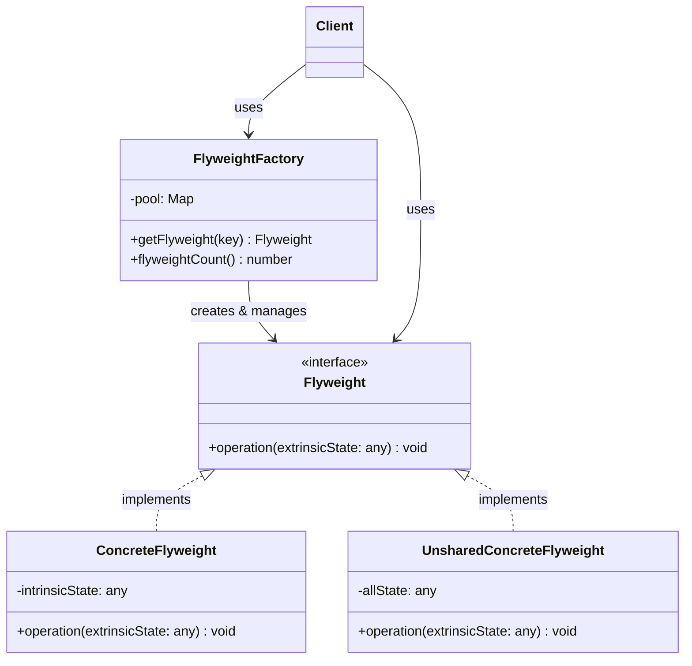
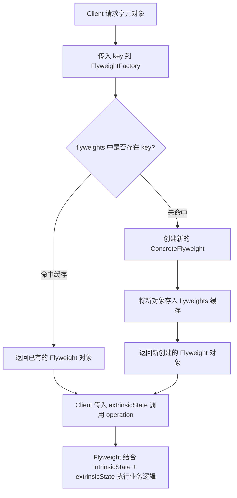
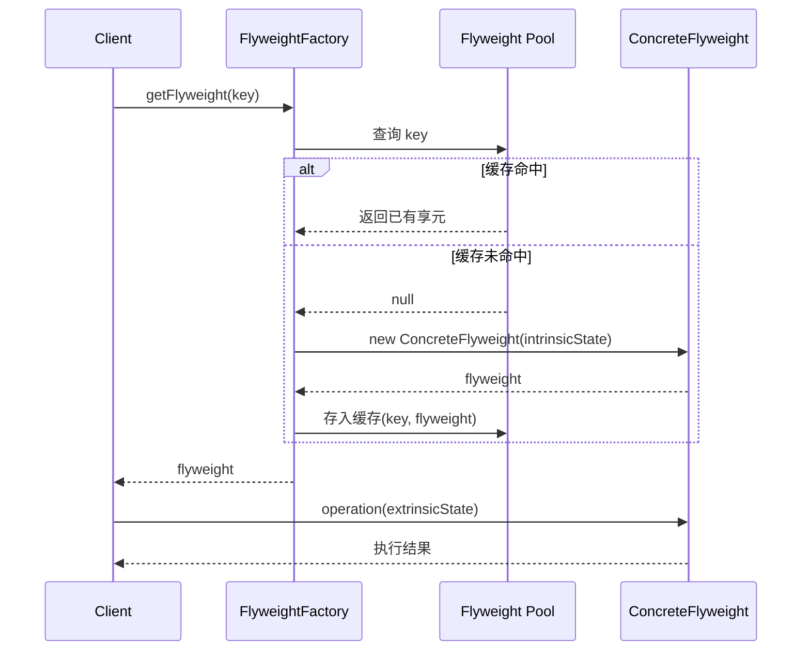

# 享元模式

> 享元模式（Flyweight Pattern）运用共享技术有效地支持大量细粒度的对象。通过分离内部状态与外部状态，使同一对象可被多个上下文复用，从而大幅降低内存消耗。--GoF

## 1. 定义与意图

### 模式定义

享元模式是一种结构型设计模式，它通过共享已存在的对象而非每次都创建新对象，来最小化内存使用或计算开销。该模式的核心在于区分两种状态：

- **内部状态（Intrinsic State）**：可共享的部分，存储在享元对象内部，不随上下文变化。例如字符的字形数据、棋子的颜色。
- **外部状态（Extrinsic State）**：不可共享的部分，由客户端代码在调用时传入，随上下文变化。例如字符在文档中的位置、棋子在棋盘上的坐标。

### 设计意图

```
┌─────────────────────────────────────────────────────────────┐
│                   享元模式设计意图                          │
├─────────────────────────────────────────────────────────────┤
│                                                             │
│  问题场景：                                                 │
│  - 系统中存在大量相似对象，内存占用过高                    │
│  - 对象的大部分状态可以提取为共享数据                      │
│  - 反复创建销毁同类对象导致 GC 压力过大                   │
│  - 需要缓存已创建的对象以避免重复构建                      │
│                                                             │
│  解决方案：                                                 │
│  - 将对象状态拆分为内部状态（可共享）和外部状态（不可共享）│
│  - 通过享元工厂缓存并复用内部状态相同的对象                │
│  - 客户端负责维护外部状态并在调用时传入                    │
│                                                             │
│  效果：                                                     │
│  - 大幅减少内存中对象的数量                                │
│  - 集中管理共享状态，便于统一修改                          │
│  - 降低 GC 频率，提升运行时性能                            │
│                                                             │
└─────────────────────────────────────────────────────────────┘
```

### 内部状态与外部状态的区分原则

| 判定维度 | 内部状态（Intrinsic） | 外部状态（Extrinsic） |
|----------|----------------------|----------------------|
| 可变性 | 享元对象创建后不再变化 | 随使用场景不同而变化 |
| 共享性 | 多个客户端共享同一份数据 | 每个客户端各自持有独立数据 |
| 存储位置 | 封装在享元对象内部 | 由客户端维护或传入 |
| 典型示例 | 字符的字形、棋子颜色 | 字符的位置坐标、棋子位置 |

---

## 2. UML类图



### 结构说明

```
┌─────────────────────────────────────────────────────────────┐
│                     享元模式结构                            │
├─────────────────────────────────────────────────────────────┤
│                                                             │
│   ┌─────────────────────────────────────┐                   │
│   │          <<interface>>              │                   │
│   │           Flyweight                 │                   │
│   ├─────────────────────────────────────┤                   │
│   │ + operation(extrinsicState): void   │                   │
│   └───────────────┬─────────────────────┘                   │
│                   │                                         │
│         ┌────────┴────────┐                                 │
│         │                 │                                 │
│  ┌──────┴─────┐   ┌───────┴──────┐                          │
│  │Concrete    │   │Unshared      │                          │
│  │Flyweight   │   │Concrete      │                          │
│  ├────────────┤   │Flyweight     │                          │
│  │-intrinsic  │   ├──────────────┤                          │
│  │State       │   │-allState     │                          │
│  │+operation()│   │+operation()  │                          │
│  └────────────┘   └──────────────┘                          │
│         │                 │                                 │
│         └────────┬────────┘                                 │
│                  │                                          │
│   ┌──────────────┴──────────────┐                           │
│   │       FlyweightFactory      │                           │
│   ├─────────────────────────────┤                           │
│   │ + getFlyweight(key): Flyweight      │                   │
│   │ + flyweightCount(): number          │                   │
│   └─────────────────────────────────────┘                   │
│                                                             │
└─────────────────────────────────────────────────────────────┘
```

---

## 3. 核心角色与职责

| 角色 | 职责 | 说明 |
|------|------|------|
| **Flyweight** | 声明共享状态接口 | 定义 `operation(extrinsicState)` 方法，接受外部状态作为参数 |
| **ConcreteFlyweight** | 实现共享状态 | 持有内部状态 `intrinsicState`，在 `operation` 中结合外部状态完成业务逻辑 |
| **UnsharedConcreteFlyweight** | 不共享的享元 | 某些场景下不需要共享，将内外状态合并存储 |
| **FlyweightFactory** | 创建和管理享元对象 | 维护享元池（通常为 Map），根据 key 查询已有享元或创建新的 |
| **Client** | 维护外部状态 | 调用享元工厂获取享元对象，并传入外部状态执行操作 |

---

## 4. 应用场景

### 4.1 通用场景

#### 大量相似对象的内存优化

当系统中存在大量结构相似、仅少数属性不同的对象时，享元模式可将共享部分提取为享元，将差异部分作为外部状态传入。

#### 游戏中的粒子系统

### 4.2 前端框架实战

#### React 虚拟列表

react-window / react-virtualized 的核心思想与享元模式一致：只渲染可见区域的 DOM 节点，滚动时复用 DOM 节点而非销毁重建。

#### Canvas 游戏粒子系统

#### DOM 节点池

#### Immutable.js 结构共享

Immutable.js 的持久化数据结构通过 Trie 树的节点共享（结构共享，structural sharing）实现高效不可变更新，这是享元思想在数据结构层面的应用。

---

## 5. Mermaid流程图

### 享元对象获取流程



### 享元模式运行时序



---

## 6. 优缺点分析

### 优点

| 优点 | 说明 | 典型收益 |
|------|------|----------|
| 减少内存消耗 | 共享内部状态，避免重复创建相同数据 | 文档中 10000 个相同字符仅占 1 份字形内存 |
| 共享对象减少 GC 压力 | 对象总数减少，GC 扫描和回收的工作量降低 | 游戏中粒子池复用，避免每帧大量 new/GC |
| 集中管理共享状态 | 享元工厂统一管理享元对象的生命周期 | 修改某个享元即可影响所有引用者 |
| 提升缓存命中率 | 相同 key 的享元对象只创建一次 | 数据库连接池、线程池等资源复用 |

### 缺点

| 缺点 | 说明 | 缓解措施 |
|------|------|----------|
| 增加复杂度 | 需要区分内部状态和外部状态，设计成本较高 | 严格遵循"不变为内、可变为外"原则 |
| 运行时间换内存空间 | 查找享元池需要额外时间开销 | 使用 HashMap 查找 O(1)，WeakMap 更省心 |
| 线程安全问题 | 多线程环境下享元对象可能被并发修改 | JavaScript 单线程可忽略；Web Worker 场景需注意 |
| 外部状态管理负担 | 客户端需要自行维护外部状态，代码量增加 | 封装 Context 对象统一管理外部状态 |

### 适用场景判断

```
┌─────────────────────────────────────────────────────────────┐
│                   是否使用享元模式？                         │
├─────────────────────────────────────────────────────────────┤
│                                                             │
│  1. 是否存在大量相似对象？                                   │
│     └─ 否 → 不需要享元                                     │
│     └─ 是 → 继续                                           │
│                                                             │
│  2. 对象的状态能否拆分为共享/非共享两部分？                  │
│     └─ 否 → 考虑对象池模式                                 │
│     └─ 是 → 继续                                           │
│                                                             │
│  3. 共享部分是否确实被多个对象重复使用？                     │
│     └─ 否 → 拆分收益不大，不推荐                           │
│     └─ 是 → 使用享元模式                                   │
│                                                             │
│  4. 内存消耗是否已成为性能瓶颈？                             │
│     └─ 否 → 可选（提前优化 vs 按需优化）                   │
│     └─ 是 → 强烈推荐                                       │
│                                                             │
└─────────────────────────────────────────────────────────────┘
```

---

## 7. 相关模式对比

### 享元模式 vs 原型模式

| 对比维度 | 享元模式 | 原型模式 |
|----------|----------|----------|
| **意图** | 共享对象减少内存 | 克隆对象避免新建 |
| **对象复用方式** | 同一个对象被多方引用 | 创建新副本，各副本独立 |
| **状态处理** | 严格区分内部/外部状态 | 通常深拷贝整个对象 |
| **工厂角色** | FlyweightFactory 管理享元池 | PrototypeManager 管理原型注册表 |
| **典型场景** | 大量相似对象的内存优化 | 创建成本高的对象的快速复制 |

### 享元模式 vs 单例模式

| 对比维度 | 享元模式 | 单例模式 |
|----------|----------|----------|
| **对象数量** | 每种内部状态一个享元（多个享元实例） | 全局仅一个实例 |
| **关注点** | 细粒度对象的共享复用 | 全局唯一访问点 |
| **状态** | 内部状态 + 外部状态 | 单例自身持有全部状态 |
| **关系** | 单例可视为享元的特例（仅一个 key） | 享元工厂本身常为单例 |

### 享元模式 vs 对象池模式

| 对比维度 | 享元模式 | 对象池模式 |
|----------|----------|----------|
| **复用粒度** | 按内部状态 key 复用 | 按对象实例复用 |
| **状态区分** | 严格区分内外状态 | 不区分，整体 reset |
| **获取方式** | getFlyweight(key) 返回特定享元 | acquire() 返回任意可用实例 |
| **归还机制** | 无需归还（享元常驻内存） | 使用完需 release 归还 |
| **典型场景** | 字符字形、棋子样式 | 粒子系统、DOM 节点、数据库连接 |

### 享元模式 vs 代理模式

| 对比维度 | 享元模式 | 代理模式 |
|----------|----------|----------|
| **意图** | 共享以减少内存 | 控制访问以增加间接层 |
| **结构** | 工厂 + 享元池 + 享元对象 | 代理 + 真实对象 |
| **对象关系** | 多个客户端共享同一享元 | 代理包装真实对象 |
| **典型组合** | 享元工厂可用代理延迟创建享元 | 虚拟代理内部可使用享元 |

---

## 8. 总结

享元模式是处理大量细粒度对象内存优化问题的经典方案，其核心价值在于：

1. **状态分离原则**：将对象状态严格拆分为内部状态（可共享、不可变）和外部状态（不可共享、由客户端传入），是享元模式的设计基石。

2. **享元工厂的缓存职责**：FlyweightFactory 通过 Map/WeakMap 维护享元池，确保相同 key 只创建一个享元实例。WeakMap 变体在 key 为对象引用时可自动配合 GC 回收。

3. **对象池是享元的实用变体**：不区分内外状态，通过 acquire/release 复用整个对象实例，在游戏粒子系统、DOM 节点复用等场景中极为常见。

4. **前端框架中的享元思想**：
   - React 虚拟列表（react-window）复用 DOM 节点，仅更新数据索引
   - Canvas 粒子系统共享粒子样式，仅位置独立
   - Immutable.js 持久化数据结构通过 Trie 节点共享实现高效不可变更新

5. **权衡取舍**：享元模式以增加代码复杂度为代价换取内存优化。当对象数量不大或内存不是瓶颈时，不必过早引入享元；当确实面临大量相似对象的内存压力时，享元模式能带来数量级的优化效果。

---

> **最佳实践提示**：享元模式的实施要点在于准确识别内部状态与外部状态。内部状态必须满足不可变且可共享两个条件；任何随上下文变化的数据都应作为外部状态由客户端传入。享元工厂通常实现为单例，享元池的 key 设计应保证相同内部状态映射到相同 key。

---

**文档版本**：v1.0
**最后更新**：2026年
**适用范围**：TypeScript 5.x+

---

## TypeScript 实现

### 基础实现：文本编辑器字符共享

在文本编辑器中，相同字符共享同一个 Glyph 享元对象（内部状态为字形的字体、大小、颜色），仅位置信息（外部状态）独立存储。

```typescript
/**
 * 享元接口：字形
 */
interface Glyph {
  /** 渲染字符，position 为外部状态 */
  render(position: Position): void;
  /** 获取字符编码（内部状态的唯一标识） */
  getCharCode(): string;
}

/** 位置信息：外部状态 */
interface Position {
  x: number;
  y: number;
}

/** 具体享元：字形 */
class ConcreteGlyph implements Glyph {
  constructor(private readonly charCode: string) {}
  getCharCode(): string { return this.charCode; }
  render(position: Position): void {
    // 内部状态（charCode）+ 外部状态（position）
    console.log(`渲染 '${this.charCode}' @ (${position.x}, ${position.y})`);
  }
}

/** 享元工厂 */
class GlyphFactory {
  private pool = new Map<string, Glyph>();
  getGlyph(charCode: string): Glyph {
    if (!this.pool.has(charCode)) {
      this.pool.set(charCode, new ConcreteGlyph(charCode));
    }
    return this.pool.get(charCode)!;
  }
  getGlyphCount(): number { return this.pool.size; }
}

// ==================== 使用：渲染文档 ====================
const glyphFactory = new GlyphFactory();
const docText = 'Hello World!';
const charWidth = 10;
const glyphs: Glyph[] = [...docText].map((c) => glyphFactory.getGlyph(c));

glyphs.forEach((glyph, i) => {
  // 位置是外部状态，每次渲染时传入
  glyph.render({ x: i * charWidth, y: 0 });
})

console.log(`\n文档长度: ${docText.length}, 享元对象数: ${glyphFactory.getGlyphCount()}`);
// 文档长度 12, 享元对象数 9（'l'、'o' 等重复字符共享）
```

### 现代 TypeScript 实现

#### 4.2.1 泛型享元工厂

```typescript
/**
 * 泛型享元工厂
 * TIntrinsic: 内部状态类型
 * TExtrinsic: 外部状态类型
 */
interface FlyweightOperation<TIntrinsic, TExtrinsic, TResult> {
  (intrinsic: TIntrinsic, extrinsic: TExtrinsic): TResult;
}

class FlyweightFactory<TIntrinsic, TExtrinsic, TResult> {
  private readonly pool: Map<string, TIntrinsic> = new Map();

  constructor(private readonly keyer: (intrinsic: TIntrinsic) => string) {}

  getFlyweight(intrinsic: TIntrinsic): TIntrinsic {
    const key = this.keyer(intrinsic);
    if (!this.pool.has(key)) {
      this.pool.set(key, intrinsic);
    }
    return this.pool.get(key)!;
  }

  get size(): number { return this.pool.size; }
}

// ==================== 使用：国际象棋 ====================
interface ChessPieceIntrinsic { symbol: string; color: 'white' | 'black'; }
interface BoardPosition { row: number; col: number; }

const chessFactory = new FlyweightFactory<ChessPieceIntrinsic, BoardPosition, string>(
  (piece) => `${piece.symbol}:${piece.color}`
);

const whiteKing = chessFactory.getFlyweight({ symbol: 'K', color: 'white' });
const whiteKingAgain = chessFactory.getFlyweight({ symbol: 'K', color: 'white' });
console.log(whiteKing === whiteKingAgain); // true -- 共享同一对象

// 使用 operation
const op = (intrinsic: ChessPieceIntrinsic, position: BoardPosition) =>
  `${intrinsic.symbol} @ (${position.row}, ${position.col}) [${intrinsic.color}]`;
console.log(op(whiteKing, { row: 0, col: 4 }));
console.log(`享元池大小: ${chessFactory.size}`); // 1
```

#### 4.2.2 WeakMap 缓存享元

当享元对象的 key 本身是对象引用时，使用 WeakMap 可以在 key 失去外部引用后自动被 GC 回收，避免内存泄漏。

```typescript
/**
 * 基于 WeakMap 的享元工厂
 * 适用于 key 为对象引用的场景，允许 GC 自动回收不再使用的享元
 */
class WeakFlyweightFactory<TKey extends object, TFlyweight> {
  private readonly pool: WeakMap<TKey, TFlyweight> = new WeakMap();
  private readonly creator: (key: TKey) => TFlyweight;

  constructor(creator: (key: TKey) => TFlyweight) {
    this.creator = creator;
  }

  getFlyweight(key: TKey): TFlyweight {
    if (!this.pool.has(key)) {
      this.pool.set(key, this.creator(key));
    }
    return this.pool.get(key)!;
  }
}

// ==================== 使用：样式计算 ====================
interface StyleKey { fontFamily: string; fontSize: number; fontWeight: number; }
interface ComputedStyle { lineHeight: number; }

function computeStyle(key: StyleKey): ComputedStyle {
  // 假设根据字体信息计算 lineHeight
  return { lineHeight: Math.round(key.fontSize * 1.5) };
}

const styleFactory = new WeakFlyweightFactory(computeStyle);

const styleKey: StyleKey = { fontFamily: 'Inter', fontSize: 16, fontWeight: 400 };
const computed = styleFactory.getFlyweight(styleKey);
console.log(`lineHeight: ${computed.lineHeight}`); // 24

// 当 styleKey 变量超出作用域后，对应的 ComputedStyle 可被 GC 回收
```

#### 4.2.3 对象池模式

对象池是享元模式的变体：不区分内外状态，而是通过 reset + acquire/release 复用整个对象实例，常用于游戏粒子系统、DOM 节点复用等场景。

```typescript
/**
 * 可重置对象接口
 * 对象池要求对象在归还时能够重置自身状态
 */
interface Resettable {
  reset(): void;
}

/**
 * 泛型对象池
 * 预创建一批对象，使用时 acquire，用完 release 归还
 */
class ObjectPool<T extends Resettable> {
  private available: T[] = [];
  private inUse = 0;
  private readonly maxSize: number;

  constructor(private readonly factory: () => T, initialSize: number, maxSize?: number) {
    this.maxSize = maxSize ?? initialSize;
    for (let i = 0; i < initialSize; i++) {
      this.available.push(this.factory());
    }
  }

  acquire(): T {
    if (this.available.length === 0) {
      if (this.inUse >= this.maxSize) throw new Error('对象池已满');
      this.inUse++;
      return this.factory();
    }
    this.inUse++;
    return this.available.pop()!;
  }

  release(obj: T): void {
    obj.reset();
    this.available.push(obj);
    this.inUse--;
  }

  getStats() {
    return { available: this.available.length, inUse: this.inUse, total: this.available.length + this.inUse };
  }
}

// ==================== 使用：粒子系统 ====================
interface Particle extends Resettable {
  x: number; y: number; vx: number; vy: number; life: number;
  update(dt: number): void;
}
class BulletParticle implements Particle {
  x = 0; y = 0; vx = 0; vy = 0; life = 0;
  update(dt: number) { this.x += this.vx * dt; this.y += this.vy * dt; this.life -= dt; }
  reset() { this.x = 0; this.y = 0; this.vx = 0; this.vy = 0; this.life = 0; }
}

const particlePool = new ObjectPool<BulletParticle>(() => new BulletParticle(), 200);
function emitParticles(x: number, y: number, count: number): BulletParticle[] {
  const particles: BulletParticle[] = [];
  for (let i = 0; i < count; i++) {
    const p = particlePool.acquire();
    p.x = x; p.y = y; p.life = 1;
    particles.push(p);
  }
  return particles;
}
function updateParticles(particles: BulletParticle[], dt: number) {
  particles.forEach((p) => p.update(dt));
}

// 模拟发射和更新
const activeParticles = emitParticles(100, 100, 50);
console.log(particlePool.getStats());
// { available: 150, inUse: 50, total: 200 }

updateParticles(activeParticles, 16);
```

---

```typescript
/**
 * 场景：在线地图中的标记点
 * 同类 POI（餐厅、加油站、医院）共享图标样式（内部状态）
 * 各自的经纬度、名称为外部状态
 */
interface POIStyle {
  icon: string;
  color: string;
  size: number;
  zIndex: number;
}

// 享元工厂：按类型共享图标样式
class POIFactory {
  private pool = new Map<string, POIStyle>();
  getStyle(type: 'restaurant' | 'gas' | 'hospital'): POIStyle {
    if (!this.pool.has(type)) {
      const style: POIStyle = {
        restaurant: { icon: '🍽️', color: '#ff6b6b', size: 28, zIndex: 10 },
        gas: { icon: '⛽', color: '#4ecdc4', size: 24, zIndex: 10 },
        hospital: { icon: '🏥', color: '#f9ca24', size: 30, zIndex: 20 },
      }[type];
      this.pool.set(type, style);
    }
    return this.pool.get(type)!;
  }
  get size(): number { return this.pool.size; }
}

// 外部状态：每个标记点的位置/名称独立
interface POIMarker {
  name: string;
  style: POIStyle;
  lat: number;
  lng: number;
}

// 生成 10000 个标记点（但只有 3 个享元样式）
const poiFactory = new POIFactory();
const markers: POIMarker[] = Array.from({ length: 10000 }, (_, i) => {
  const type = ['restaurant', 'gas', 'hospital'][i % 3] as 'restaurant' | 'gas' | 'hospital';
  return {
    name: `POI-${i}`,
    style: poiFactory.getStyle(type),
    lat: 39.9 + Math.random() * 0.1,
    lng: 116.3 + Math.random() * 0.1
  };
});

console.log(`标记总数: 10000, 享元对象数: ${poiFactory.size}`); // 3
```

```typescript
/**
 * 场景：2D 游戏子弹管理
 * 子弹的纹理、伤害值为内部状态（按武器类型共享）
 * 位置、速度方向为外部状态
 */
interface BulletIntrinsic {
  textureId: string;
  damage: number;
  speed: number;
  radius: number;
}

/** 具体享元：子弹 */
class BulletFlyweight {
  constructor(private readonly intrinsic: BulletIntrinsic) {}
  render(x: number, y: number, direction: number): void {
    // 内部状态 + 外部状态（位置/方向）
    console.log(`子弹[${this.intrinsic.textureId}] 伤害${this.intrinsic.damage} @ (${x},${y}) dir ${direction}`);
  }
}

/** 享元工厂：按武器类型共享子弹属性 */
class BulletPool {
  private pool = new Map<string, BulletFlyweight>();
  getBullet(weaponType: string): BulletFlyweight {
    let flyweight = this.pool.get(weaponType);
    if (!flyweight) {
      const preset: BulletIntrinsic = {
        textureId: `tex_${weaponType}`,
        damage: weaponType === 'rifle' ? 20 : 50,
        speed: weaponType === 'rifle' ? 30 : 15,
        radius: weaponType === 'rifle' ? 2 : 4,
      };
      flyweight = new BulletFlyweight(preset);
      this.pool.set(weaponType, flyweight);
    }
    return flyweight;
  }
}
```

```typescript
/**
 * 简化版虚拟列表实现
 * 享元思想：DOM 节点池复用，仅更新外部状态（数据索引、位置）
 */
interface VirtualListOptions<T> {
  containerHeight: number;
  rowHeight: number;
  overscan: number;
  data: T[];
  renderRow: (index: number, data: T) => string;
}

/** 虚拟列表：DOM 节点池复用 + 只渲染可见区域 */
class VirtualList<T> {
  private container: HTMLElement;
  private options: VirtualListOptions<T>;
  private nodePool: HTMLElement[] = [];
  private visibleCount = 0;

  constructor(container: HTMLElement, options: VirtualListOptions<T>) {
    this.container = container;
    this.options = options;
    this.visibleCount = Math.ceil(options.containerHeight / options.rowHeight) + options.overscan * 2;
    container.style.overflow = 'auto';
    container.style.height = `${options.containerHeight}px`;
    this.initScroll();
    this.render();
  }

  private initScroll(): void {
    this.container.addEventListener('scroll', () => this.render());
  }

  // 从池中取 DOM 节点，无则创建（享元复用）
  private getRowNode(): HTMLElement {
    if (this.nodePool.length > 0) return this.nodePool.pop()!;
    const node = document.createElement('div');
    node.style.position = 'absolute';
    node.style.left = '0';
    node.style.width = '100%';
    this.container.appendChild(node);
    return node;
  }

  private render(): void {
    const scrollTop = this.container.scrollTop;
    const start = Math.max(0, Math.floor(scrollTop / this.options.rowHeight) - this.options.overscan);
    const end = Math.min(this.options.data.length, start + this.visibleCount);
    // 清空已用节点回池
    this.container.childNodes.forEach((child) => { if (child instanceof HTMLElement) this.nodePool.push(child); });
    this.container.innerHTML = '';
    for (let i = start; i < end; i++) {
      const node = this.getRowNode();
      node.style.top = `${i * this.options.rowHeight}px`;
      node.style.height = `${this.options.rowHeight}px`;
      node.innerHTML = this.options.renderRow(i, this.options.data[i]);
      this.container.appendChild(node);
    }
  }
}

// 使用
new VirtualList(document.getElementById('list')!, {
  containerHeight: 600,
  rowHeight: 40,
  overscan: 3,
  data: Array.from({ length: 10000 }, (_, i) => `项目 ${i + 1}`),
  renderRow: (index, data) => `<span>${data}</span>`
});
```

```typescript
/**
 * Canvas 粒子系统的享元优化
 * 粒子样式（颜色、形状）为内部状态，共享
 * 粒子位置、速度、生命周期为外部状态，独立
 */
interface ParticleStyle {
  color: string;
  shape: 'circle' | 'square' | 'triangle';
  baseSize: number;
}

interface ParticleState {
  x: number;
  y: number;
  vx: number;
  vy: number;
  life: number;
}

/** 具体享元：粒子样式 */
class ParticleFlyweight {
  constructor(private readonly style: ParticleStyle) {}
  render(state: ParticleState): void {
    console.log(`绘制${this.style.shape}(${this.style.color}) @ (${state.x},${state.y})`);
  }
}

/** 粒子样式工厂 */
class ParticleStyleFactory {
  private pool = new Map<string, ParticleFlyweight>();
  getStyle(color: string, shape: ParticleStyle['shape']): ParticleFlyweight {
    const key = `${color}:${shape}`;
    if (!this.pool.has(key)) {
      this.pool.set(key, new ParticleFlyweight({ color, shape, baseSize: 10 }));
    }
    return this.pool.get(key)!;
  }

  get size(): number {
    return this.pool.size;
  }
}
```

```typescript
/**
 * DOM 节点池：列表复用 DOM 节点而非销毁重建
 * 适用于频繁增删 DOM 元素的场景（如聊天消息列表、表格行）
 */
class DOMNodePool {
  private readonly pool: HTMLElement[] = [];
  private readonly tagName: string;

  constructor(tagName: string = 'div', initialSize: number = 0) {
    this.tagName = tagName;
    for (let i = 0; i < initialSize; i++) {
      this.pool.push(document.createElement(tagName));
    }
  }

  acquire(): HTMLElement {
    if (this.pool.length > 0) return this.pool.pop()!;
    return document.createElement(this.tagName);
  }

  release(node: HTMLElement): void {
    // 清空内容、移除事件，重置状态后再回池
    node.innerHTML = '';
    node.removeAttribute('style');
    const clean = node.cloneNode(false) as HTMLElement; // 克隆节点不携带事件监听
    node.replaceWith(clean);
    this.pool.push(clean);
  }

  get size(): number { return this.pool.length; }
}

// 使用：表格行复用
const rowPool = new DOMNodePool('tr', 10);
function createTableRow(data: string[]): HTMLTableRowElement {
  const row = rowPool.acquire() as HTMLTableRowElement;
  row.innerHTML = data.map((d) => `<td>${d}</td>`).join('');
  return row;
}

function removeTableRow(row: HTMLTableRowElement): void {
  row.parentElement?.removeChild(row);
  rowPool.release(row);
}
```

```typescript
/**
 * 简化版持久化向量（Persistent Vector）
 * 使用 Trie 树结构共享：修改时仅重建受影响路径上的节点
 * 未受影响的分支节点被新旧版本共享
 */
const BRANCH_SIZE = 32; // 每个节点 32 个子节点（5 位掩码）
const MASK = BRANCH_SIZE - 1;

class PersistentVector<T> {
  private constructor(
    private readonly root: TrieNode<T>,
    private readonly tail: T[],
    private readonly length: number
  ) {}

  static empty<T>(): PersistentVector<T> {
    return new PersistentVector<T>({ children: [] }, [], 0);
  }

  get size(): number { return this.length; }

  // 追加元素：创建新版本，共享未修改的树节点
  push(value: T): PersistentVector<T> {
    const newTail = [...this.tail, value];
    if (newTail.length < BRANCH_SIZE) {
      return new PersistentVector<T>(this.root, newTail, this.length + 1);
    }
    // tail 已满，将其并入树中
    let newRoot = this.root;
    if (newRoot.children.length > 0 && (this.length >> 5) > Math.floor((this.length - 1) >> 5)) {
      newRoot = { children: [this.root] };
    }
    // 简化：仅演示结构共享思路
    return new PersistentVector<T>(newRoot, [], this.length + 1);
  }
}

// Trie 节点：children 为 32 个槽位，存放数据或子节点
interface TrieNode<T> {
  children: (T | TrieNode<T> | null)[];
}

// 使用示例
let vec = PersistentVector.empty<number>();
// 实际使用中还需实现 get/set 等方法，此处仅演示 push 与结构共享的概念
```

```typescript
// 享元：同一对象共享
const flyweightA = factory.getFlyweight('key'); // 返回缓存中的同一实例
const flyweightB = factory.getFlyweight('key'); // flyweightA === flyweightB

// 原型：克隆创建新实例
const prototype = new ConcretePrototype('data');
const cloneA = prototype.clone(); // 新实例
const cloneB = prototype.clone(); // 另一个新实例，cloneA !== cloneB
```

---

## Java 实现

### 享元模式（共享对象，节省内存）

```java
import java.util.HashMap;
import java.util.Map;

// 享元：内部状态（不变，可共享）+ 外部状态（变化，由客户端传入）
class TreeType {
    private final String name;   // 内部状态
    private final String color;  // 内部状态

    public TreeType(String name, String color) {
        this.name = name;
        this.color = color;
    }

    public void draw(int x, int y) {  // x, y 是外部状态
        System.out.println(name + "(" + color + ") 绘制于 (" + x + "," + y + ")");
    }
}

// 享元工厂：管理共享池，相同内部状态复用同一对象
class TreeFactory {
    private static final Map<String, TreeType> pool = new HashMap<>();

    public static TreeType getTreeType(String name, String color) {
        String key = name + ":" + color;
        return pool.computeIfAbsent(key, k -> new TreeType(name, color));
    }

    public static int poolSize() {
        return pool.size();
    }
}

// 使用：大量树木共享有限的 TreeType 对象
public class Client {
    public static void main(String[] args) {
        for (int i = 0; i < 10000; i++) {
            TreeType type = TreeFactory.getTreeType("松树", "绿色");
            type.draw(i % 100, i / 100);
        }
        // 尽管画了 1 万棵树，TreeType 对象只有 1 个
        System.out.println("TreeType 实例数 = " + TreeFactory.poolSize());
    }
}
```

> 享元模式通过共享不可变对象来节省内存。Java 中 `Integer.valueOf`（-128~127 缓存）、`String` 常量池、线程池都是享元思想的经典应用。

## Python 实现

### 享元模式

```python
class TreeType:
    """享元：内部状态（name/color）共享，外部状态（x/y）由调用方传入"""
    def __init__(self, name: str, color: str):
        self.name = name
        self.color = color

    def draw(self, x: int, y: int):
        print(f"{self.name}({self.color}) 绘制于 ({x},{y})")

class TreeFactory:
    _pool = {}

    @classmethod
    def get_tree_type(cls, name: str, color: str) -> TreeType:
        key = (name, color)
        if key not in cls._pool:
            cls._pool[key] = TreeType(name, color)
        return cls._pool[key]

# 使用
for i in range(10000):
    tree_type = TreeFactory.get_tree_type("松树", "绿色")
    tree_type.draw(i % 100, i // 100)

print(f"TreeType 实例数 = {len(TreeFactory._pool)}")  # 1
```

> Python 中享元模式可用于缓存不可变对象。Python 的字符串驻留（intern）、整数小对象缓存、`functools.lru_cache` 都体现了共享与缓存思想。

